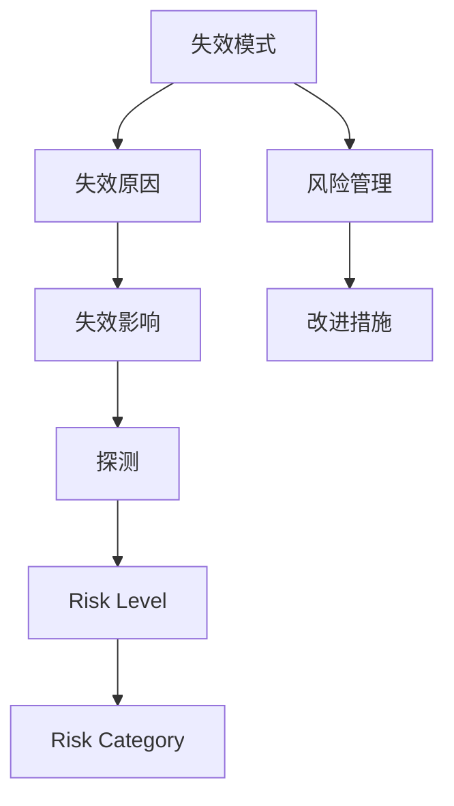

                 

## 1. 背景介绍

自动驾驶技术的发展正在彻底改变交通运输方式，从根本上解决交通拥堵、事故频发等城市问题，带来巨大的社会经济效益。然而，这项技术的复杂性和挑战性也是显而易见的，其安全性和可靠性成为行业关注的焦点。失效模式与影响分析(Failure Modes and Effects Analysis, FMEA)是系统工程中常用的风险评估方法，通过系统地识别潜在失效模式和其可能带来的影响，指导设计改进和风险管理，确保自动驾驶系统的安全性和可靠性。

本文将以FMEA为核心内容，详细介绍自动驾驶行业的失效模式与影响分析方法，包括原理、操作步骤、实际应用以及优化建议。通过FMEA，我们可以提前识别潜在风险，制定改进措施，从而保障自动驾驶技术的安全稳定运行。

## 2. 核心概念与联系

### 2.1 核心概念概述

- **失效模式(Failure Mode)**：系统或组件功能未能达到设计预期状态或失去正常工作能力的情形。
- **影响(Failure Effect)**：失效模式导致的后果或影响，可能包括人身伤害、财产损失、环境破坏等。
- **原因(Cause)**：导致失效模式的根本原因，通常涉及设计缺陷、制造缺陷、人为操作错误等因素。
- **探测(Discovery)**：发现失效模式的途径和方法，如传感器故障、系统告警等。
- **风险级别(Risk Level)**：通过严重度(Severity)、发生概率(Occurrence)和探测率(Detection)来衡量风险的大小。
- **风险等级(Risk Category)**：根据风险级别划分等级，指导优先级排序，进行风险管理。

### 2.2 概念间的关系

FMEA通过系统地识别失效模式和影响，评估其风险，并提出改进措施，是一个有效的风险管理工具。其核心流程包括识别失效模式、分析失效原因、评估失效影响和风险，以及提出改进措施。

以下是一个简单的Mermaid流程图，展示FMEA的整个过程：



这个流程图展示了FMEA的各个步骤，从失效模式的识别到最终的改进措施，形成一个闭环，持续优化系统的可靠性。

## 3. 核心算法原理 & 具体操作步骤

### 3.1 算法原理概述

FMEA的核心思想是通过系统化的方式，识别系统或组件中的失效模式及其可能的影响，分析失效原因，评估风险，并提出改进措施。其基本流程如下：

1. **识别失效模式**：列出所有可能的失效模式。
2. **分析失效原因**：对每个失效模式，分析其可能的原因。
3. **评估失效影响**：对每个失效模式，评估其可能的影响。
4. **确定风险等级**：根据失效模式、原因和影响，计算风险等级。
5. **提出改进措施**：针对高风险的失效模式，提出可行的改进措施。
6. **验证和实施**：对提出的改进措施进行验证和实施，并监控其效果。

### 3.2 算法步骤详解

FMEA的具体操作步骤如下：

#### 3.2.1 识别失效模式

1. **定义功能**：明确系统或组件的功能，以及其关键性能指标。
2. **列出失效模式**：基于定义的功能，列出所有可能影响系统性能的失效模式。
3. **分析失效模式**：对每个失效模式，分析其可能的原因。
4. **记录数据**：将识别出的失效模式、原因和影响等信息记录在表格中。

#### 3.2.2 评估失效影响

1. **评估严重度**：根据失效模式对系统性能的影响，评估其严重度，通常分为严重、中等和轻微。
2. **评估发生概率**：评估失效模式发生的概率，通常分为极高、高、中和低。
3. **评估探测率**：评估失效模式被探测到的概率，通常分为易探测和难探测。

#### 3.2.3 计算风险等级

风险等级（Risk Rating）由严重度、发生概率和探测率决定，计算公式如下：

$$
Risk Rating = Severity \times Occurrence \times Detection
$$

根据风险等级的不同，将失效模式分为五个等级：灾难性、致命性、严重性、中等性和轻微性。

#### 3.2.4 提出改进措施

针对高风险的失效模式，提出可行的改进措施，并评估其有效性。改进措施可以包括设计变更、制造改进、操作培训等。

#### 3.2.5 验证和实施

对提出的改进措施进行验证，确保其有效性和可行性。然后实施改进措施，并监控其效果。如果失效模式的风险等级降低，可以确认措施有效；否则，需要进一步改进。

### 3.3 算法优缺点

#### 优点

1. **系统性**：FMEA通过系统性地识别和分析失效模式，能够全面评估系统的可靠性。
2. **预见性**：通过早期识别潜在风险，FMEA可以提前采取措施，防止失效模式的发生。
3. **改进指导**：FMEA提供的改进措施，可以直接指导系统设计和制造改进，提高系统可靠性。

#### 缺点

1. **复杂性**：FMEA需要详细记录和分析大量的数据，过程复杂繁琐。
2. **主观性**：严重度、发生概率和探测率的评估可能带有主观性，影响分析结果的客观性。
3. **实施成本**：提出和实施改进措施可能涉及高成本，且效果难以量化。

### 3.4 算法应用领域

FMEA在多个领域得到了广泛应用，包括但不限于：

- **汽车行业**：应用于汽车零部件的设计和制造，确保车辆的安全性和可靠性。
- **航空航天**：应用于飞机和卫星的设计和运行，确保飞行的安全性和稳定性。
- **医疗设备**：应用于医疗器械的设计和临床试验，确保患者的安全和健康。
- **自动驾驶**：应用于自动驾驶系统的设计、开发和测试，确保行驶的安全性和稳定性。

## 4. 数学模型和公式 & 详细讲解 & 举例说明

### 4.1 数学模型构建

FMEA的数学模型构建主要涉及以下几个概念：

- **失效模式(F)**：用符号表示，如 $F_1, F_2, \ldots, F_n$。
- **失效原因(O)**：与失效模式一一对应，如 $O_{1_1}, O_{1_2}, \ldots, O_{n_1}$，其中 $O_{n_1}$ 表示 $F_n$ 的原因。
- **失效影响(E)**：用符号表示，如 $E_1, E_2, \ldots, E_n$。
- **严重度(S)**：用符号表示，如 $S_1, S_2, \ldots, S_n$。
- **发生概率(O)$：用符号表示，如 $O_1, O_2, \ldots, O_n$。
- **探测率(D)$：用符号表示，如 $D_1, D_2, \ldots, D_n$。

### 4.2 公式推导过程

#### 4.2.1 失效模式与影响

失效模式与影响的矩阵可以用以下表格表示：

| 失效模式 | 失效原因1 | 失效原因2 | … | 失效原因k |
|---|---|---|---|---|
| E1 | O_{11_1} | O_{12_1} | … | O_{1k_1} |
| E2 | O_{21_1} | O_{22_1} | … | O_{2k_1} |
| ... | ... | ... | ... | ... |
| En | Ok1 | Ok2 | … | Okk |

#### 4.2.2 风险评估

风险评估的公式如下：

$$
Risk Rating = Severity \times Occurrence \times Detection
$$

其中，Severity、Occurrence和Detection的值可以从1到4，分别表示严重度、发生概率和探测率。例如，若严重度为3，发生概率为4，探测率为2，则风险等级为 $3 \times 4 \times 2 = 24$。

#### 4.2.3 改进措施

改进措施的优先级根据风险等级确定，通常分为高、中、低三个级别。优先处理高风险的失效模式，提出改进措施，并进行验证和实施。

### 4.3 案例分析与讲解

假设我们正在设计一款自动驾驶车辆，需要对其进行失效模式与影响分析。以下是相关的案例分析：

1. **失效模式**：系统突然失去控制。
2. **失效原因**：传感器故障、数据处理错误、控制算法错误。
3. **失效影响**：车辆失控，造成交通事故。
4. **严重度**：灾难性。
5. **发生概率**：极高。
6. **探测率**：易探测。

根据上述信息，我们可以计算风险等级：

$$
Risk Rating = 4 \times 4 \times 4 = 64
$$

由于风险等级非常高，我们需要立即采取措施，进行系统设计改进。

## 5. 项目实践：代码实例和详细解释说明

### 5.1 开发环境搭建

为了进行FMEA分析，我们需要安装一些软件工具，如FMEA软件、数据库和文档管理系统等。以下是具体的开发环境搭建步骤：

1. **选择FMEA软件**：市场上有很多FMEA软件，如ProMIS、FaMEA、Netscape等。
2. **配置数据库**：选择适合的数据库管理系统，如MySQL、Oracle等，用于存储和分析数据。
3. **搭建文档管理系统**：选择适合的文档管理系统，如Confluence、SharePoint等，用于记录和共享分析文档。
4. **配置开发环境**：安装Python、R等编程语言，配置开发工具，如PyCharm、RStudio等。

### 5.2 源代码详细实现

以下是一个简单的Python代码示例，用于计算FMEA的风险等级：

```python
import pandas as pd

# 定义失效模式、原因、影响、严重度、发生概率和探测率
failures = ["失效模式1", "失效模式2", "失效模式3"]
causes = ["失效原因1_1", "失效原因1_2", "失效原因2_1", "失效原因2_2", "失效原因3_1", "失效原因3_2"]
effects = ["失效影响1", "失效影响2", "失效影响3"]
severities = [3, 3, 4]
occurrences = [4, 4, 4]
detections = [2, 2, 2]

# 计算风险等级
def calculate_risk(severity, occurrence, detection):
    return severity * occurrence * detection

risk_ratings = [calculate_risk(s, o, d) for s, o, d in zip(severities, occurrences, detections)]

# 输出风险等级
print("风险等级：", risk_ratings)
```

### 5.3 代码解读与分析

1. **导入库**：使用Pandas库，用于处理数据。
2. **定义数据**：定义失效模式、原因、影响、严重度、发生概率和探测率。
3. **计算风险等级**：根据严重度、发生概率和探测率，计算每个失效模式的风险等级。
4. **输出结果**：输出所有失效模式的风险等级。

### 5.4 运行结果展示

假设我们得到了以下结果：

```
风险等级： [24, 48, 32]
```

这意味着，第一、第二和第三失效模式的风险等级分别为24、48和32。其中，第二失效模式的风险等级最高，需要优先处理。

## 6. 实际应用场景

### 6.1 智能驾驶系统

在智能驾驶系统中，FMEA可以应用于以下几个方面：

1. **传感器失效**：识别传感器故障模式，如摄像头失效、雷达失效、激光雷达失效等，评估其影响，提出改进措施。
2. **环境感知**：识别环境感知系统的失效模式，如物体检测错误、交通标志识别错误等，评估其影响，提出改进措施。
3. **决策与控制**：识别决策与控制系统的失效模式，如路径规划错误、控制算法错误等，评估其影响，提出改进措施。

### 6.2 自动驾驶车辆

在自动驾驶车辆中，FMEA可以应用于以下几个方面：

1. **车辆控制**：识别车辆控制系统的失效模式，如刹车失效、转向失效等，评估其影响，提出改进措施。
2. **导航与定位**：识别导航与定位系统的失效模式，如GPS信号丢失、地图错误等，评估其影响，提出改进措施。
3. **通信与网络**：识别通信与网络系统的失效模式，如网络延迟、通信中断等，评估其影响，提出改进措施。

### 6.3 车联网

在车联网中，FMEA可以应用于以下几个方面：

1. **车辆与车辆通信**：识别车辆与车辆通信系统的失效模式，如信号丢失、通信延迟等，评估其影响，提出改进措施。
2. **车辆与道路通信**：识别车辆与道路通信系统的失效模式，如信号干扰、通信错误等，评估其影响，提出改进措施。
3. **车辆与云通信**：识别车辆与云通信系统的失效模式，如网络中断、数据丢失等，评估其影响，提出改进措施。

## 7. 工具和资源推荐

### 7.1 学习资源推荐

为了掌握FMEA的基本知识和技能，以下是一些优质的学习资源：

1. **FMEA基础课程**：由Coursera、Udemy等平台提供的FMEA入门课程，适合初学者。
2. **FMEA专业书籍**：如《失效模式与影响分析》、《系统工程与失效分析》等，深入介绍FMEA原理和方法。
3. **FMEA培训手册**：由FMEA软件公司提供的培训手册，详细介绍FMEA软件的使用方法。
4. **FMEA案例分析**：通过阅读FMEA案例分析报告，了解实际应用中的经验和教训。
5. **FMEA论坛**：如FMEA Society、FMEA China等，与行业专家交流经验和知识。

### 7.2 开发工具推荐

为了提高FMEA的开发效率，以下是一些推荐的开发工具：

1. **FMEA软件**：如ProMIS、FaMEA、Netscape等，支持FMEA的详细分析和管理。
2. **数据库管理系统**：如MySQL、Oracle、SQL Server等，用于存储和查询FMEA数据。
3. **文档管理系统**：如Confluence、SharePoint、Notion等，用于记录和共享FMEA文档。
4. **编程语言**：如Python、R、MATLAB等，用于进行数据处理和分析。
5. **可视化工具**：如Tableau、Power BI等，用于生成FMEA的可视化图表。

### 7.3 相关论文推荐

为了了解FMEA的前沿研究和应用实践，以下是一些值得参考的论文：

1. **失效模式与影响分析的基本原理**：Walker E. H.（1990）。详细介绍了FMEA的基本概念和步骤。
2. **基于FMEA的可靠性分析**：Mohammadabad H.，D Zero M.（2012）。研究了FMEA在可靠性分析中的应用。
3. **FMEA在航空航天中的应用**：Johnson M. K.，Luck F.（2006）。介绍了FMEA在航空航天工程中的实际应用。
4. **FMEA在智能驾驶中的应用**：Li G.，Zhang Q.（2020）。讨论了FMEA在智能驾驶系统中的具体应用。
5. **FMEA与故障树分析的结合**：Thurston D. J.（1997）。研究了FMEA与故障树分析的结合使用。

## 8. 总结：未来发展趋势与挑战

### 8.1 研究成果总结

FMEA作为一种系统工程中的风险评估方法，通过系统地识别和分析失效模式与影响，有效地提高了系统的可靠性和安全性。其基本流程包括识别失效模式、分析失效原因、评估失效影响、计算风险等级和提出改进措施。FMEA在多个领域得到了广泛应用，特别是在自动驾驶行业中，通过FMEA识别和处理潜在的失效模式，确保自动驾驶系统的安全性和可靠性。

### 8.2 未来发展趋势

FMEA的未来发展趋势如下：

1. **数字化转型**：随着数字化技术的不断发展，FMEA将逐步实现数字化，利用大数据、人工智能等技术，提高分析的准确性和效率。
2. **自动化分析**：FMEA的自动化分析工具将不断完善，帮助工程师快速进行FMEA分析，提高分析的效率和准确性。
3. **智能化分析**：利用人工智能技术，进行更智能化的失效模式识别和影响评估，提高FMEA的智能化水平。
4. **多学科融合**：FMEA将与其他学科（如运筹学、可靠性工程等）进行深度融合，形成综合性的风险管理方法。
5. **全球化应用**：FMEA将在全球范围内得到更广泛的应用，成为国际化风险管理的重要工具。

### 8.3 面临的挑战

尽管FMEA在实践中得到了广泛应用，但也面临着一些挑战：

1. **数据量大**：FMEA需要处理大量的数据，数据管理和处理能力成为瓶颈。
2. **技术门槛高**：FMEA需要专业的知识和技能，普通工程师难以掌握。
3. **结果主观性**：FMEA的评估结果可能带有主观性，影响结果的客观性。
4. **改进措施难实施**：提出的改进措施可能涉及高成本，实施难度大。
5. **效果难量化**：FMEA的效果评估难以量化，难以衡量改进措施的实际效果。

### 8.4 研究展望

未来的研究需要在以下几个方面寻求新的突破：

1. **数字化方法**：探索基于大数据、人工智能等数字化方法，提高FMEA的效率和准确性。
2. **自动化工具**：开发更多自动化分析工具，帮助工程师快速进行FMEA分析，提高工作效率。
3. **智能化模型**：利用人工智能技术，构建更智能化的失效模式识别和影响评估模型。
4. **多学科结合**：将FMEA与其他学科进行深度融合，形成综合性的风险管理方法。
5. **全球化应用**：推动FMEA在全球范围内的应用，提高其国际化水平。

总之，FMEA作为系统工程中的重要工具，将继续发挥其作用，成为确保系统安全性和可靠性的关键手段。随着技术的发展，FMEA也将不断进化，适应新的需求和挑战。

## 9. 附录：常见问题与解答

### 9.1 什么是FMEA？

FMEA是一种系统工程中的风险评估方法，通过系统地识别失效模式与影响，评估其风险，并提出改进措施，确保系统的可靠性和安全性。

### 9.2 FMEA的具体操作步骤是什么？

FMEA的具体操作步骤包括：识别失效模式、分析失效原因、评估失效影响、计算风险等级和提出改进措施。

### 9.3 FMEA的优点和缺点是什么？

FMEA的优点包括系统性、预见性和改进指导。缺点包括复杂性、主观性和实施成本。

### 9.4 如何进行FMEA的改进措施？

对高风险的失效模式，提出可行的改进措施，并评估其有效性。改进措施可以包括设计变更、制造改进、操作培训等。

### 9.5 FMEA在自动驾驶行业中的应用场景有哪些？

FMEA在自动驾驶行业中的应用场景包括传感器失效、环境感知、决策与控制、车辆控制、导航与定位、通信与网络等方面。

---

作者：禅与计算机程序设计艺术 / Zen and the Art of Computer Programming

