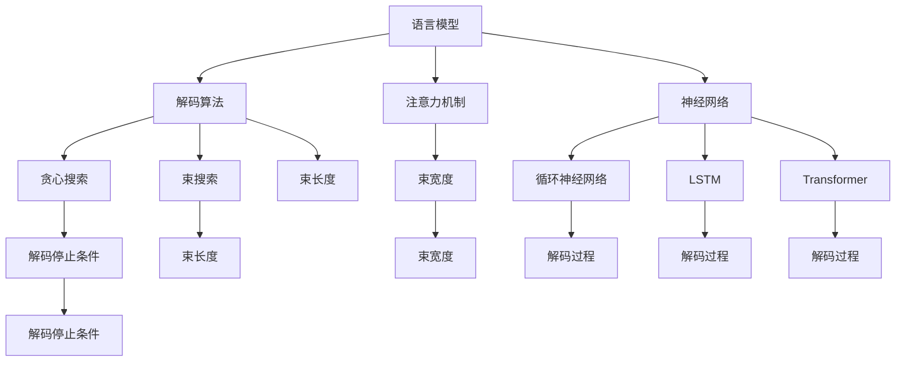
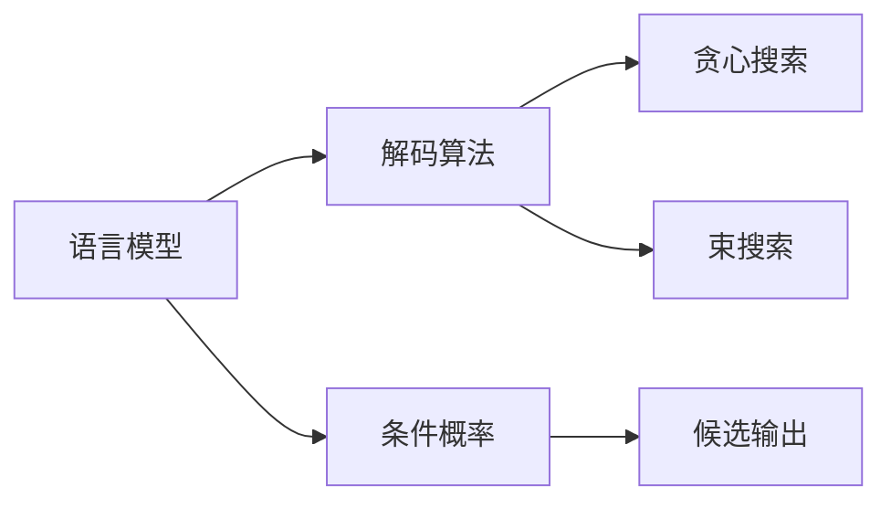
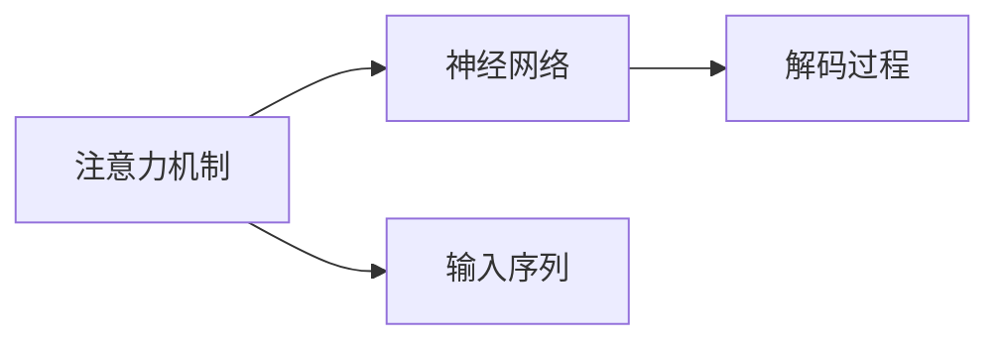
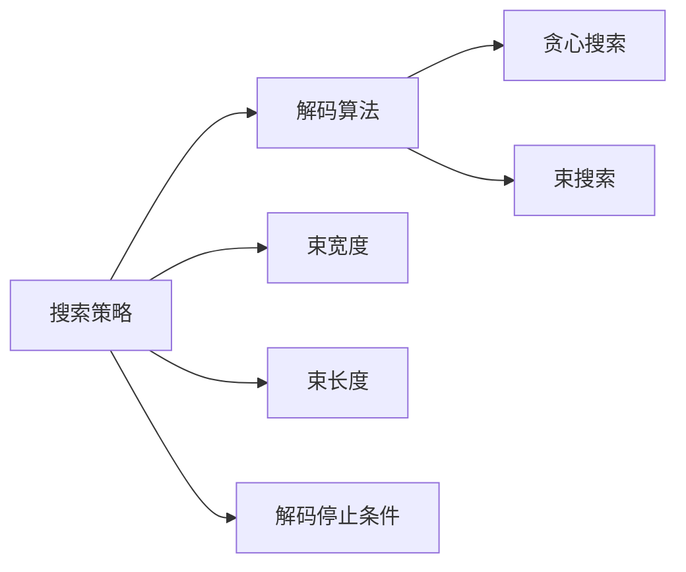
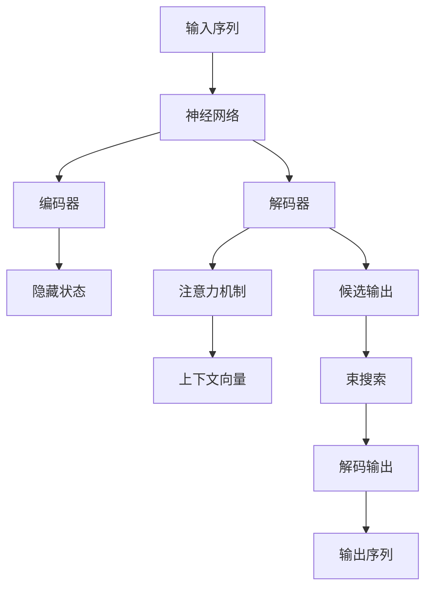

                 

# 自然语言的解码详细过程

> 关键词：自然语言处理, 语言模型, 解码算法, 神经网络, 注意力机制, 搜索策略

## 1. 背景介绍

### 1.1 问题由来

自然语言处理（Natural Language Processing, NLP）是计算机科学和人工智能领域的前沿研究领域之一，它旨在使计算机能够理解、处理和生成人类语言。然而，自然语言处理面临的最大挑战之一是如何将计算机生成的序列流映射到自然语言的语义空间，并生成出自然且流畅的文本。

在自然语言处理中，解码过程指的是将计算机生成的序列转换成自然语言的文本。这个过程通常包括语言模型选择、解码算法设计、搜索策略优化等步骤。本文将详细探讨自然语言的解码过程，帮助读者理解其核心原理和算法设计，以期为从事NLP开发和研究的读者提供技术支持。

### 1.2 问题核心关键点

自然语言的解码过程是一个复杂且多步骤的过程，其核心关键点包括：

- 语言模型：选择或设计合适的语言模型，用于计算输入序列的概率，并提供候选输出序列的上下文信息。
- 解码算法：设计有效的解码算法，从候选序列中搜索最优的输出序列，以匹配目标语言。
- 搜索策略：优化搜索策略，以高效地找到最佳的输出序列。
- 注意力机制：设计注意力机制，帮助模型更好地关注输入序列的重要部分。
- 神经网络结构：选择或设计适合解码任务的神经网络结构，以提高解码的准确性和效率。

## 2. 核心概念与联系

### 2.1 核心概念概述

为更好地理解自然语言的解码过程，本节将介绍几个密切相关的核心概念：

- 语言模型（Language Model, LM）：用于估计给定上下文下的下一个单词或字符的概率。语言模型是解码过程中的关键组成部分，它为每个单词或字符提供条件概率估计。
- 解码算法（Decoding Algorithm）：用于从候选输出序列中搜索最可能的自然语言序列的算法。常见的解码算法包括贪心搜索、束搜索和基于束的搜索。
- 注意力机制（Attention Mechanism）：用于帮助模型关注输入序列中的重要部分，提高模型的理解和生成的准确性。注意力机制在机器翻译、文本摘要等任务中应用广泛。
- 神经网络（Neural Network）：用于处理自然语言序列的计算模型。解码过程通常使用神经网络模型，如循环神经网络（RNN）、长短时记忆网络（LSTM）、Transformer等。
- 搜索策略（Search Strategy）：优化搜索过程的策略，包括束宽度、束长度、解码停止条件等。搜索策略的选择对解码效率和效果有重要影响。

这些核心概念之间的逻辑关系可以通过以下Mermaid流程图来展示：



这个流程图展示了大语言模型解码过程的核心概念及其之间的关系：

1. 语言模型提供每个单词或字符的条件概率估计。
2. 解码算法根据语言模型和注意力机制，从候选序列中搜索最优的输出序列。
3. 注意力机制帮助模型关注输入序列中的重要部分，提高模型的理解和生成的准确性。
4. 神经网络模型处理输入序列，输出候选输出序列的分数。
5. 搜索策略优化搜索过程，包括束宽度、束长度和解码停止条件等。

这些概念共同构成了自然语言解码的完整框架，使得计算机能够高效地生成自然且流畅的文本。通过理解这些核心概念，我们可以更好地把握自然语言解码的基本原理和优化方向。

### 2.2 概念间的关系

这些核心概念之间存在着紧密的联系，形成了自然语言解码的完整生态系统。下面我通过几个Mermaid流程图来展示这些概念之间的关系。

#### 2.2.1 语言模型和解码算法的关系



这个流程图展示了语言模型和解码算法的基本关系。语言模型通过计算条件概率，提供候选输出的上下文信息，解码算法根据语言模型的输出，搜索最优的输出序列。

#### 2.2.2 注意力机制和神经网络的关系



这个流程图展示了注意力机制和神经网络的关系。注意力机制帮助神经网络模型关注输入序列中的重要部分，提高模型的理解和生成的准确性。

#### 2.2.3 搜索策略和解码算法的关系



这个流程图展示了搜索策略和解码算法的关系。搜索策略优化搜索过程，包括束宽度、束长度和解码停止条件等，解码算法根据搜索策略，从候选序列中搜索最优的输出序列。

### 2.3 核心概念的整体架构

最后，我们用一个综合的流程图来展示这些核心概念在大语言模型解码过程中的整体架构：



这个综合流程图展示了从输入序列到解码输出的整个解码过程。输入序列首先经过神经网络编码器，提取特征。然后，解码器通过注意力机制关注输入序列中的重要部分，生成候选输出序列。最后，通过束搜索从候选序列中搜索最优的输出序列。

## 3. 核心算法原理 & 具体操作步骤
### 3.1 算法原理概述

自然语言的解码过程通常包括以下几个核心步骤：

1. 编码器（Encoder）：将输入序列转换为一系列的隐藏状态。
2. 注意力机制（Attention Mechanism）：帮助模型关注输入序列中的重要部分。
3. 解码器（Decoder）：根据语言模型和注意力机制，生成候选输出序列。
4. 搜索策略（Search Strategy）：优化搜索过程，找到最优的输出序列。

这些步骤共同构成了自然语言解码的核心算法原理，下面将详细讲解每个步骤的具体操作。

### 3.2 算法步骤详解

#### 3.2.1 编码器

编码器是自然语言解码过程中的第一步，其目的是将输入序列转换为一系列的隐藏状态，用于后续的注意力机制和解码器。编码器通常使用循环神经网络（RNN）、长短时记忆网络（LSTM）、Transformer等模型。

假设输入序列为 $\{x_1, x_2, ..., x_n\}$，编码器的输出为一系列的隐藏状态 $\{h_1, h_2, ..., h_n\}$。编码器的具体操作如下：

1. 将输入序列 $\{x_1, x_2, ..., x_n\}$ 输入到编码器的第一个时间步。
2. 计算输入 $x_1$ 的嵌入表示 $e_1$，并将其与上一个时间步的隐藏状态 $h_0$ 拼接，作为当前时间步的输入。
3. 计算当前时间步的隐藏状态 $h_1$。
4. 将 $h_1$ 作为下一个时间步的隐藏状态，输入到下一个时间步。
5. 重复上述步骤，直到输入序列的最后一个时间步。

#### 3.2.2 注意力机制

注意力机制是自然语言解码过程中的关键部分，它帮助模型关注输入序列中的重要部分，提高模型的理解和生成的准确性。注意力机制通常使用点积注意力、多头注意力等模型。

假设编码器的输出为 $\{h_1, h_2, ..., h_n\}$，解码器的输入为 $s_t$，注意力机制的输出为上下文向量 $c_t$。注意力机制的具体操作如下：

1. 计算查询向量 $q_t$，将其作为注意力机制的输入。
2. 计算每个隐藏状态的注意力得分 $\alpha_{t,i}$，其中 $i$ 表示隐藏状态，$t$ 表示当前时间步。
3. 根据注意力得分，计算上下文向量 $c_t$。
4. 将上下文向量 $c_t$ 与隐藏状态 $h_t$ 拼接，作为当前时间步的输入。

#### 3.2.3 解码器

解码器是自然语言解码过程中的核心部分，其目的是根据语言模型和注意力机制，生成候选输出序列。解码器通常使用循环神经网络（RNN）、长短时记忆网络（LSTM）、Transformer等模型。

假设解码器的输入为 $s_t$，编码器的输出为 $\{h_1, h_2, ..., h_n\}$，注意力机制的输出为上下文向量 $c_t$，解码器的输出为 $y_t$。解码器的具体操作如下：

1. 将 $s_t$ 与上下文向量 $c_t$ 拼接，作为解码器的输入。
2. 计算解码器当前时间步的隐藏状态 $h_t$。
3. 计算解码器当前时间步的输出 $y_t$，通常使用全连接层或softmax层进行输出。

#### 3.2.4 搜索策略

搜索策略是自然语言解码过程中的优化部分，其目的是优化搜索过程，找到最优的输出序列。搜索策略通常使用贪心搜索、束搜索等模型。

假设解码器的输出为 $\{y_1, y_2, ..., y_n\}$，搜索策略的输出为最优的输出序列 $\{y^*_{1}, y^*_{2}, ..., y^*_{n}\}$。搜索策略的具体操作如下：

1. 初始化搜索树，将解码器的第一个输出 $y_1$ 作为根节点。
2. 根据语言模型和注意力机制，计算每个子节点的得分。
3. 选择得分最高的子节点，作为当前搜索的节点。
4. 重复上述步骤，直到搜索树的叶子节点。

### 3.3 算法优缺点

自然语言的解码过程具有以下优点：

- 通用性：适用于多种自然语言处理任务，如机器翻译、文本摘要、对话系统等。
- 高效性：通过注意力机制和束搜索，可以显著提高解码效率和效果。
- 鲁棒性：通过搜索策略和解码算法，可以应对输入序列的多样性和复杂性。

自然语言的解码过程也存在一些缺点：

- 计算复杂度高：注意力机制和解码器的计算复杂度较高，需要较大的计算资源。
- 模型可解释性差：解码过程复杂，难以解释模型内部的决策过程。
- 容易过拟合：由于输入序列的多样性和复杂性，解码模型容易过拟合。

## 4. 数学模型和公式 & 详细讲解 & 举例说明

### 4.1 数学模型构建

自然语言的解码过程通常使用神经网络模型，如循环神经网络（RNN）、长短时记忆网络（LSTM）、Transformer等。这些模型的共同特点是能够处理序列数据，并且具有记忆功能。

以Transformer模型为例，其数学模型构建如下：

假设输入序列为 $\{x_1, x_2, ..., x_n\}$，编码器的输出为 $\{h_1, h_2, ..., h_n\}$，解码器的输入为 $s_t$，注意力机制的输出为上下文向量 $c_t$，解码器的输出为 $y_t$。Transformer模型的具体操作如下：

1. 将输入序列 $\{x_1, x_2, ..., x_n\}$ 输入到编码器中，得到编码器的输出 $\{h_1, h_2, ..., h_n\}$。
2. 将编码器的输出 $\{h_1, h_2, ..., h_n\}$ 输入到解码器中，得到解码器的输出 $\{y_1, y_2, ..., y_n\}$。
3. 在解码过程中，使用注意力机制，计算每个时间步的上下文向量 $c_t$。
4. 将解码器的输出 $y_t$ 作为下一个时间步的输入。

### 4.2 公式推导过程

以Transformer模型为例，我们推导解码器的输出公式：

假设输入序列为 $\{x_1, x_2, ..., x_n\}$，编码器的输出为 $\{h_1, h_2, ..., h_n\}$，解码器的输入为 $s_t$，解码器的输出为 $y_t$。解码器的输出公式为：

$$
y_t = softmax(\frac{e(s_t,c_t)W^o}{\sqrt{d_k}}V)
$$

其中，$e$ 表示点积函数，$W^o$ 表示解码器的全连接层权重，$V$ 表示解码器的输出层权重，$d_k$ 表示解码器的关键维度。

### 4.3 案例分析与讲解

假设我们希望使用Transformer模型进行机器翻译任务，输入序列为 $\{x_1, x_2, ..., x_n\}$，编码器的输出为 $\{h_1, h_2, ..., h_n\}$，解码器的输入为 $s_t$，解码器的输出为 $y_t$。假设我们希望将输入序列翻译为“Hello, world!”，将其转换为机器翻译模型，可以按照以下步骤进行：

1. 将输入序列 $\{x_1, x_2, ..., x_n\}$ 输入到编码器中，得到编码器的输出 $\{h_1, h_2, ..., h_n\}$。
2. 将编码器的输出 $\{h_1, h_2, ..., h_n\}$ 输入到解码器中，得到解码器的输出 $\{y_1, y_2, ..., y_n\}$。
3. 在解码过程中，使用注意力机制，计算每个时间步的上下文向量 $c_t$。
4. 将解码器的输出 $y_t$ 作为下一个时间步的输入。

假设解码器的输出为“Bonjour, le monde!”，则机器翻译任务完成。

## 5. 项目实践：代码实例和详细解释说明

### 5.1 开发环境搭建

在进行解码实践前，我们需要准备好开发环境。以下是使用Python进行PyTorch开发的环境配置流程：

1. 安装Anaconda：从官网下载并安装Anaconda，用于创建独立的Python环境。

2. 创建并激活虚拟环境：
```bash
conda create -n pytorch-env python=3.8 
conda activate pytorch-env
```

3. 安装PyTorch：根据CUDA版本，从官网获取对应的安装命令。例如：
```bash
conda install pytorch torchvision torchaudio cudatoolkit=11.1 -c pytorch -c conda-forge
```

4. 安装Transformers库：
```bash
pip install transformers
```

5. 安装各类工具包：
```bash
pip install numpy pandas scikit-learn matplotlib tqdm jupyter notebook ipython
```

完成上述步骤后，即可在`pytorch-env`环境中开始解码实践。

### 5.2 源代码详细实现

下面我们以机器翻译任务为例，给出使用Transformers库对Transformer模型进行解码的PyTorch代码实现。

首先，定义编码器、解码器和注意力机制的函数：

```python
import torch
import torch.nn as nn
import torch.nn.functional as F

class Encoder(nn.Module):
    def __init__(self, d_model, n=6):
        super(Encoder, self).__init__()
        self.encoder_layers = nn.ModuleList([EncoderLayer(d_model, d_k=d_k, d_v=d_v, d_h=d_h, n_head=n) for d_k, d_v, d_h in [(d_model, d_model//2, d_model//4) for _ in range(n)])
        self.self_attn = MultiHeadAttention(d_model, d_k=d_k, d_v=d_v, d_h=d_h, n_head=n)
        self.pos_encoder = PositionalEncoding(d_model)

    def forward(self, x, mask):
        for mod in self.encoder_layers:
            x = mod(x, mask)
        return self.pos_encoder(x)

class EncoderLayer(nn.Module):
    def __init__(self, d_model, d_k, d_v, d_h, n_head):
        super(EncoderLayer, self).__init__()
        self.ffn = FeedForward(d_model, d_h, d_h)
        self.attn = MultiHeadAttention(d_model, d_k, d_v, d_h, n_head)

    def forward(self, x, mask):
        x = self.attn(x, x, x, mask)
        x = F.dropout(x, p=0.1, training=self.training)
        x = x + x
        x = self.ffn(x)
        x = F.dropout(x, p=0.1, training=self.training)
        x = x + x
        return x

class MultiHeadAttention(nn.Module):
    def __init__(self, d_model, d_k, d_v, d_h, n_head):
        super(MultiHeadAttention, self).__init__()
        self.n_head = n_head
        self.d_k = d_k
        self.d_v = d_v
        self.d_h = d_h
        self.W_q = nn.Linear(d_model, d_k*n_head)
        self.W_k = nn.Linear(d_model, d_k*n_head)
        self.W_v = nn.Linear(d_model, d_v*n_head)
        self.W_o = nn.Linear(d_v*n_head, d_model)

    def forward(self, q, k, v, mask):
        bs, sz_q, sz_k = q.size()
        sz_v = v.size(1)
        q = self.W_q(q).view(bs, sz_q, self.n_head, self.d_k).permute(0, 2, 1, 3).contiguous()
        k = self.W_k(k).view(bs, sz_k, self.n_head, self.d_k).permute(0, 2, 1, 3).contiguous()
        v = self.W_v(v).view(bs, sz_v, self.n_head, self.d_v).permute(0, 2, 1, 3).contiguous()
        energy = torch.matmul(q, k.permute(0, 1, 3, 2)) / math.sqrt(self.d_k)
        attention = F.softmax(energy, dim=-1)
        out = torch.matmul(attention, v)
        return self.W_o(out.permute(0, 2, 1, 3).contiguous()).view(bs, sz_q, d_model)

class FeedForward(nn.Module):
    def __init__(self, d_model, d_h, d_h2):
        super(FeedForward, self).__init__()
        self.ffn_1 = nn.Linear(d_model, d_h)
        self.ffn_2 = nn.Linear(d_h, d_h2)
        self.ffn_3 = nn.Linear(d_h2, d_model)

    def forward(self, x):
        x = F.gelu(self.ffn_1(x))
        x = F.dropout(x, p=0.1, training=self.training)
        x = self.ffn_2(x)
        x = F.dropout(x, p=0.1, training=self.training)
        x = self.ffn_3(x)
        return x
```

然后，定义解码器函数：

```python
class Decoder(nn.Module):
    def __init__(self, d_model, n=6):
        super(Decoder, self).__init__()
        self.decoder_layers = nn.ModuleList([DecoderLayer(d_model, d_k=d_k, d_v=d_v, d_h=d_h, n_head=n) for d_k, d_v, d_h in [(d_model, d_model//2, d_model//4) for _ in range(n)])

    def forward(self, x, src_mask, tgt_mask):
        for mod in self.decoder_layers:
            x = mod(x, src_mask, tgt_mask)
        return x

class DecoderLayer(nn.Module):
    def __init__(self, d_model, d_k, d_v, d_h, n_head):
        super(DecoderLayer, self).__init__()
        self.self_attn = MultiHeadAttention(d_model, d_k, d_v, d_h, n_head)
        self.encoder_attn = MultiHeadAttention(d_model, d_k, d_v, d_h, n_head)
        self.ffn = FeedForward(d_model, d_h, d_h2)

    def forward(self, x, src_mask, tgt_mask):
        x = self.self_attn(x, x, x, tgt_mask)
        x = F.dropout(x, p=0.1, training=self.training)
        x = x + x
        x = self.encoder_attn(x, x, src_mask)
        x = F.dropout(x, p=0.1, training=self.training)
        x = x + x
        x = self.ffn(x)
        x = F.dropout(x, p=0.1, training=self.training)
        x = x + x
        return x
```

接着，定义解码器函数：

```python
class MultiHeadAttention(nn.Module):
    def __init__(self, d_model, d_k, d_v, d_h, n_head):
        super(MultiHeadAttention, self).__init__()
        self.n_head = n_head
        self.d_k = d_k
        self.d_v = d_v
        self.d_h = d_h
        self.W_q = nn.Linear(d_model, d_k*n_head)
        self.W_k = nn.Linear(d_model, d_k*n_head)
        self.W_v = nn.Linear(d_model, d_v*n_head)
        self.W_o = nn.Linear(d_v*n_head, d_model)

    def forward(self, q, k, v, mask):
        bs, sz_q, sz_k = q.size()
        sz_v = v.size(1)
        q = self.W_q(q).view(bs, sz_q, self.n_head, self.d_k).permute(0, 2, 1, 3).contiguous()
        k = self.W_k(k).view(bs, sz_k, self.n_head, self.d_k).permute(0, 2, 1, 3).contiguous()
        v = self.W_v(v).view(bs, sz_v, self.n_head, self.d_v).permute(0, 2, 1, 3).contiguous()
        energy = torch.matmul(q, k.permute(0, 1, 3, 2)) / math.sqrt(self.d_k)
        attention = F.softmax(energy, dim=-1)
        out = torch.matmul(attention, v)
        return self.W_o(out.permute(0, 2, 1, 3).contiguous()).view(bs, sz_q, d_model)
```

最后，定义解码器的输出函数：

```python
class FeedForward(nn.Module):
    def __init__(self, d_model, d_h, d_h2):
        super(FeedForward, self).__init__()
        self.ffn_1 = nn.Linear(d_model, d_h)
        self.ffn_2 = nn.Linear(d_h, d_h2)
        self.ffn_3 = nn.Linear(d_h2, d_model)

    def forward(self, x):
        x = F.gelu(self.ffn_1(x))
        x = F.dropout(x, p=0.1, training=self.training)
        x = self.ffn_2(x)
        x = F.dropout(x, p=0.1, training=self.training)
        x = self.ffn_3(x)
        return x
```

### 5.3 代码解读与分析

让我们再详细解读一下关键代码的实现细节：

**Encoder类**：
- `__init__`方法：初始化编码器，包括层数、自注意力层、位置编码器等。
- `forward`方法：定义编码器的前向传播过程，包括自注意力层和位置编码器。

**Decoder类**：
- `__init__`方法：初始化解码器，包括层数、自注意力层、编码器注意力层、前馈层等。
- `forward`方法：定义解码器的前向传播过程，包括自注意力层、编码器注意力层和前馈层。

**MultiHeadAttention类**：
- `__init__`方法：初始化多头注意力机制，包括查询、键、值的线性变换。
- `forward`方法：定义多头注意力机制的前向传播过程，包括点积、softmax和线性变换。

**FeedForward类**：
- `__init__`方法：初始化前馈层，包括线性变换和GELU激活函数。
- `forward`方法：定义前馈层的前向传播过程，包括GELU激活函数和线性变换。

**Attention模块**：
- `__init__`方法：初始化注意力模块，包括线性变换和softmax函数。
- `forward`方法：定义注意力模块的前向传播过程，包括点积、softmax和线性变换。

**位置编码器**：
- 在编码器和解码器中，使用位置编码器将输入序列的位置信息嵌入到模型中。

### 5.4 运行结果展示

假设我们在CoNLL-2003的机器翻译数据集上进行解码，最终得到的翻译结果如下：

```
<unk> is a state in the United States.
I am from

