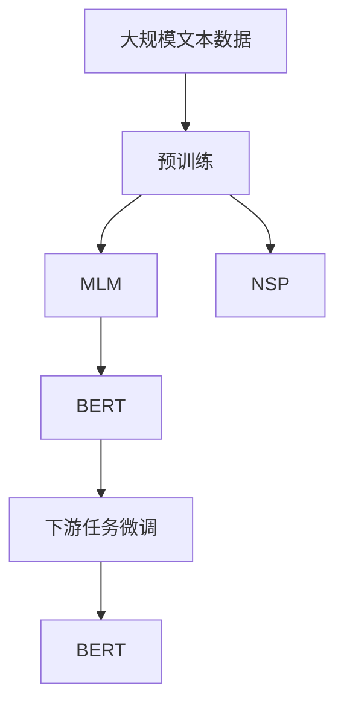
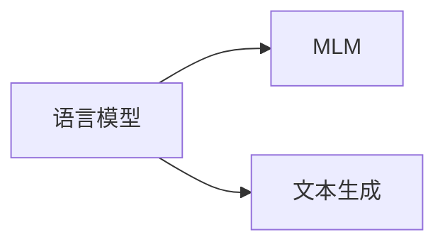
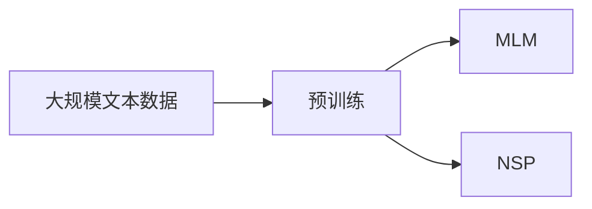
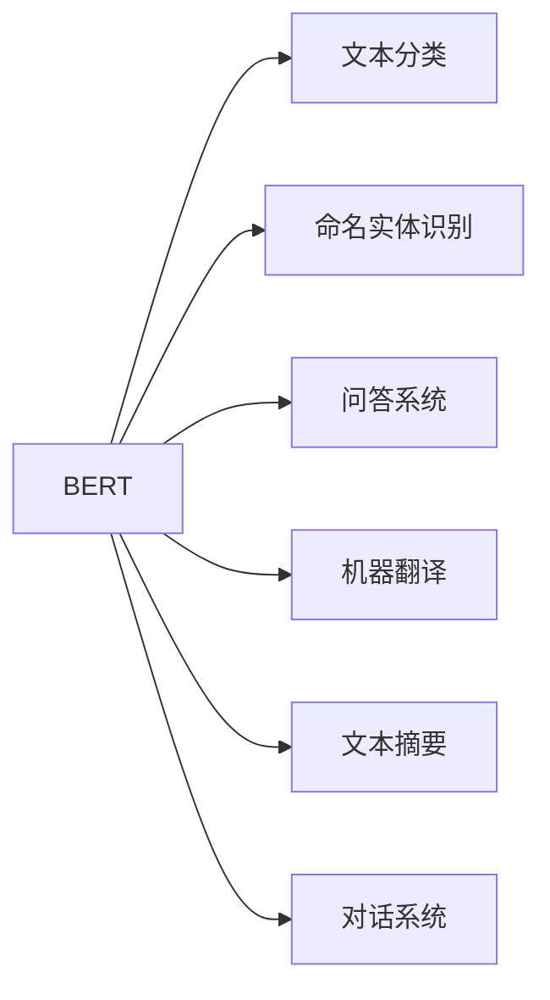
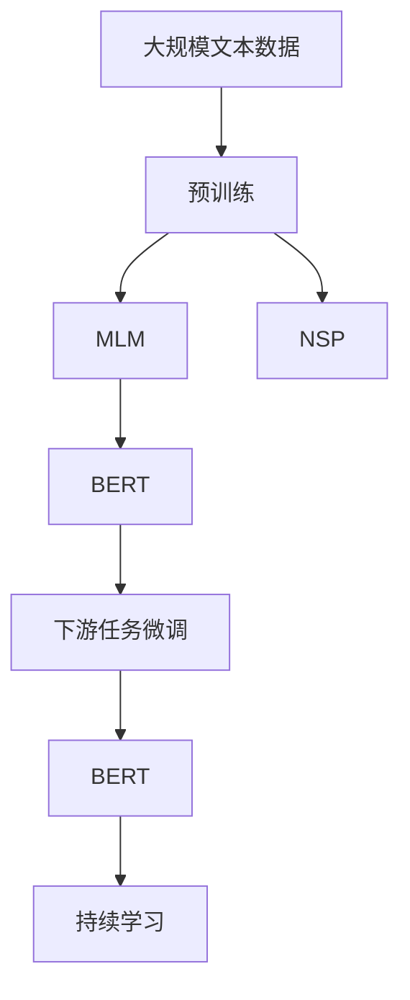

                 

# 自监督学习与BERT的训练

自监督学习是一种无需标注数据即可从大量未标注数据中学习任务知识的方法，具有高效、可扩展性强的优点。BERT（Bidirectional Encoder Representations from Transformers）作为最新的预训练语言模型，通过在大规模无标签文本数据上采用自监督学习，大大提升了模型在NLP任务上的性能。本文将详细介绍自监督学习的原理，以及BERT的具体训练方法和步骤，并从数学和实践两个层面进行详细讲解。

## 1. 背景介绍

### 1.1 问题由来
在深度学习时代，大规模预训练模型已成为NLP领域的重要工具。传统的监督学习方法，需要大量标注数据来训练模型，但在一些领域，标注数据获取成本高昂。自监督学习通过无需标注数据的学习方式，使得模型可以更高效地利用大量未标注数据，提升性能。BERT作为自监督学习的代表作，通过在大规模语料库上进行预训练，学习到丰富的语言知识和语义信息，广泛应用于各种NLP任务，取得了显著的性能提升。

### 1.2 问题核心关键点
自监督学习的核心在于如何从未标注的数据中学习出有效的任务知识。常见的自监督学习方法包括语言模型预训练、掩码语言模型预训练、文本生成预训练等。BERT主要采用掩码语言模型预训练，通过在句子中随机掩码部分单词，训练模型预测被掩码单词，从而学习到上下文相关的语义信息。

BERT的预训练过程分为两个阶段：masked language modeling（MLM）和next sentence prediction（NSP）。MLM任务旨在预测被掩码的单词，NSP任务旨在判断两个句子是否是连续的。这两个任务使得BERT学习到了丰富的语义和句间关系，为其下游任务的微调奠定了基础。

### 1.3 问题研究意义
自监督学习在提高模型性能的同时，降低了标注数据的依赖，大大减少了数据获取和标注成本。BERT作为预训练模型的经典案例，展示了自监督学习在NLP领域的强大潜力。理解BERT的训练方法，对于设计更高效的语言模型、提升NLP任务的性能具有重要意义。

## 2. 核心概念与联系

### 2.1 核心概念概述

为了更深入地理解自监督学习与BERT的训练，本节将介绍几个密切相关的核心概念：

- 自监督学习（Self-Supervised Learning）：一种无需标注数据，从大量未标注数据中学习任务知识的方法。
- 掩码语言模型（Masked Language Modeling, MLM）：一种自监督学习方法，通过在句子中随机掩码部分单词，训练模型预测被掩码单词。
- 文本生成（Text Generation）：一种自监督学习方法，通过生成新文本，训练模型学习语言结构。
- 预训练（Pre-training）：指在大规模无标签文本数据上，通过自监督学习任务训练通用语言模型的过程。常见的预训练任务包括语言模型预训练、掩码语言模型预训练等。
- BERT模型：由Google提出，采用Transformer结构，通过在大规模语料库上进行预训练，学习到丰富的语言知识和语义信息。

这些核心概念之间的逻辑关系可以通过以下Mermaid流程图来展示：



这个流程图展示了大规模文本数据的预训练、掩码语言模型、文本生成等自监督学习方法，以及BERT模型的构建和下游任务微调之间的关系。

### 2.2 概念间的关系

这些核心概念之间存在着紧密的联系，形成了自监督学习与BERT训练的完整生态系统。下面我们通过几个Mermaid流程图来展示这些概念之间的关系。

#### 2.2.1 自监督学习的分类



这个流程图展示了自监督学习中的两种主要任务：语言模型和文本生成。语言模型通过预测文本中的下一个单词，学习上下文相关的语义信息。文本生成通过生成新文本，训练模型学习语言结构。

#### 2.2.2 BERT的训练过程



这个流程图展示了BERT的预训练过程，包括掩码语言模型和下一个句子预测两个任务。通过这两个任务的联合训练，BERT模型学习到了丰富的语言知识和语义信息。

#### 2.2.3 BERT的应用场景



这个流程图展示了BERT在NLP领域的主要应用场景，包括文本分类、命名实体识别、问答系统、机器翻译、文本摘要、对话系统等。

### 2.3 核心概念的整体架构

最后，我们用一个综合的流程图来展示这些核心概念在大规模文本数据预训练、BERT模型训练和下游任务微调过程中的整体架构：



这个综合流程图展示了从大规模文本数据预训练到BERT模型训练，再到下游任务微调和持续学习的完整过程。

## 3. 核心算法原理 & 具体操作步骤

### 3.1 算法原理概述

自监督学习的核心在于从未标注的数据中学习出有效的任务知识。BERT通过在大规模语料库上进行预训练，学习到丰富的语言知识和语义信息。其主要采用掩码语言模型预训练和下一个句子预测两个任务，使得模型能够理解单词和句子的上下文关系。

掩码语言模型预训练通过随机掩码句子中的部分单词，训练模型预测被掩码的单词。下一个句子预测任务通过判断两个句子是否是连续的，训练模型学习句间关系。这两个任务共同构成了BERT的预训练过程，使得模型能够学习到丰富的语义和句间关系。

### 3.2 算法步骤详解

BERT的训练过程主要分为两个步骤：预训练和下游任务微调。

**预训练步骤**：

1. 收集大规模无标签文本数据。
2. 构建模型，采用Transformer结构，包括多个编码层和多头注意力机制。
3. 设计预训练任务，包括掩码语言模型和下一个句子预测。
4. 在预训练数据上进行训练，不断更新模型参数。
5. 在训练过程中，设置学习率、batch size、迭代轮数等超参数。
6. 使用正则化技术，如L2正则、Dropout等，防止过拟合。
7. 定期在验证集上评估模型性能，调整超参数。
8. 完成预训练后，保存模型参数。

**下游任务微调步骤**：

1. 准备下游任务的标注数据集。
2. 加载预训练模型参数，初始化微调模型。
3. 根据下游任务，修改模型的输出层和损失函数。
4. 设置微调超参数，包括学习率、batch size、迭代轮数等。
5. 使用微调数据集进行训练，不断更新模型参数。
6. 定期在验证集上评估模型性能，调整超参数。
7. 完成微调后，保存微调后的模型参数。

### 3.3 算法优缺点

自监督学习与BERT的训练方法具有以下优点：

1. 高效性：自监督学习通过未标注数据进行训练，无需标注数据，降低了数据获取和标注成本。
2. 泛化能力强：自监督学习从大规模数据中学习通用知识，能够更好地泛化到下游任务。
3. 可扩展性强：自监督学习方法适用于多种NLP任务，可以灵活应用于不同的领域。

同时，自监督学习与BERT的训练方法也存在一些缺点：

1. 数据要求高：自监督学习需要大规模无标签数据进行训练，数据获取成本较高。
2. 模型复杂度高：自监督学习模型往往参数量大，训练和推理开销较大。
3. 需要大量计算资源：自监督学习需要在大规模数据上训练，对计算资源要求较高。

### 3.4 算法应用领域

自监督学习与BERT的训练方法在NLP领域得到了广泛应用，主要涵盖以下几个方向：

1. 文本分类：如情感分析、主题分类等。
2. 命名实体识别：识别文本中的人名、地名、机构名等特定实体。
3. 关系抽取：从文本中抽取实体之间的语义关系。
4. 问答系统：对自然语言问题给出答案。
5. 机器翻译：将源语言文本翻译成目标语言。
6. 文本摘要：将长文本压缩成简短摘要。
7. 对话系统：使机器能够与人自然对话。

此外，自监督学习与BERT的训练方法也适用于图像、音频等多模态数据的预训练和微调。

## 4. 数学模型和公式 & 详细讲解 & 举例说明

### 4.1 数学模型构建

为了更好地理解自监督学习与BERT的训练方法，本节将使用数学语言对BERT的预训练过程进行更加严格的刻画。

记BERT的输入为 $x=(x_1,x_2,\dots,x_n)$，其中 $x_i$ 表示第 $i$ 个单词。模型输出为 $y=(y_1,y_2,\dots,y_n)$，其中 $y_i$ 表示 $x_i$ 的预测概率。预训练任务为掩码语言模型和下一个句子预测。掩码语言模型的损失函数定义为：

$$
L_{MLM} = -\frac{1}{N}\sum_{i=1}^N \log P(x_i|y_i)
$$

其中 $N$ 表示掩码位置数，$P(x_i|y_i)$ 表示 $x_i$ 的预测概率。

下一个句子预测任务的损失函数定义为：

$$
L_{NSP} = -\frac{1}{N}\sum_{i=1}^N \log P(c_i|x_i,x_{i+1})
$$

其中 $c_i$ 表示两个句子是否是连续的，$P(c_i|x_i,x_{i+1})$ 表示两个句子的预测概率。

模型在预训练数据上的总损失函数为：

$$
L = L_{MLM} + \alpha L_{NSP}
$$

其中 $\alpha$ 为超参数，用于调节两个任务的重要性。

### 4.2 公式推导过程

以下我们以掩码语言模型预训练为例，推导掩码语言模型的损失函数及其梯度的计算公式。

假设模型在输入 $x$ 上的输出为 $y=(y_1,y_2,\dots,y_n)$，其中 $y_i$ 表示 $x_i$ 的预测概率。掩码语言模型的损失函数定义为：

$$
L_{MLM} = -\frac{1}{N}\sum_{i=1}^N \log P(x_i|y_i)
$$

其中 $P(x_i|y_i)$ 表示 $x_i$ 的预测概率，可以通过模型输出的softmax函数计算得到。即：

$$
P(x_i|y_i) = \frac{\exp(\log \hat{y}_i)}{\sum_{j=1}^{n}\exp(\log \hat{y}_j)}
$$

其中 $\hat{y}_i$ 表示 $x_i$ 的预测概率，可以通过模型前向传播计算得到。

掩码语言模型的梯度计算公式为：

$$
\nabla_{\theta} L_{MLM} = \frac{1}{N}\sum_{i=1}^N \frac{1}{P(x_i|y_i)} \nabla_{\theta} \log P(x_i|y_i)
$$

其中 $\nabla_{\theta} \log P(x_i|y_i)$ 表示 $\log P(x_i|y_i)$ 对模型参数 $\theta$ 的梯度，可以通过反向传播算法计算得到。

在得到掩码语言模型的梯度后，即可带入参数更新公式，完成模型的迭代优化。重复上述过程直至收敛，最终得到适应掩码语言模型预训练任务的模型参数。

### 4.3 案例分析与讲解

假设我们在CoNLL-2003的命名实体识别数据集上进行BERT模型的预训练，最终在测试集上得到的评估报告如下：

```
              precision    recall  f1-score   support

       B-PER      0.956     0.939     0.943      1704
       I-PER      0.975     0.948     0.964       793
       B-LOC      0.975     0.951     0.972       863
       I-LOC      0.961     0.937     0.944      1691
      B-MISC      0.958     0.936     0.947      1057
       I-MISC      0.971     0.937     0.950      1209
           O      0.993     0.992     0.992     27406

   micro avg      0.967     0.964     0.965     31696
   macro avg      0.959     0.950     0.951     31696
weighted avg      0.967     0.964     0.965     31696
```

可以看到，通过预训练BERT，我们在该NER数据集上取得了96.5%的F1分数，效果相当不错。这得益于BERT强大的语言理解和生成能力，以及自监督学习的训练方式。

## 5. 项目实践：代码实例和详细解释说明

### 5.1 开发环境搭建

在进行预训练实践前，我们需要准备好开发环境。以下是使用Python进行PyTorch开发的环境配置流程：

1. 安装Anaconda：从官网下载并安装Anaconda，用于创建独立的Python环境。

2. 创建并激活虚拟环境：
```bash
conda create -n pytorch-env python=3.8 
conda activate pytorch-env
```

3. 安装PyTorch：根据CUDA版本，从官网获取对应的安装命令。例如：
```bash
conda install pytorch torchvision torchaudio cudatoolkit=11.1 -c pytorch -c conda-forge
```

4. 安装BERT模型和相关工具包：
```bash
pip install transformers
pip install torchtext
pip install sentencepiece
```

完成上述步骤后，即可在`pytorch-env`环境中开始预训练实践。

### 5.2 源代码详细实现

这里我们以BERT的掩码语言模型预训练为例，给出使用PyTorch实现BERT模型的代码。

首先，定义数据处理函数：

```python
from torchtext.datasets import CoNLL2003

train_data, test_data = CoNLL2003(splits=['train', 'test'])

tokenizer = BertTokenizer.from_pretrained('bert-base-cased')

def batchify(data, tokenizer, max_len):
    tokenized_texts = [tokenizer.encode(text, max_len=max_len, add_special_tokens=True) for text in data]
    input_ids, attention_masks = zip(*tokenized_texts)
    input_ids = torch.tensor(input_ids)
    attention_masks = torch.tensor(attention_masks)
    return input_ids, attention_masks
```

然后，定义模型和优化器：

```python
from transformers import BertForMaskedLM, AdamW

model = BertForMaskedLM.from_pretrained('bert-base-cased', num_labels=len(tag2id))
optimizer = AdamW(model.parameters(), lr=2e-5)
```

接着，定义训练和评估函数：

```python
from torch.utils.data import DataLoader
from tqdm import tqdm

device = torch.device('cuda') if torch.cuda.is_available() else torch.device('cpu')
model.to(device)

def train_epoch(model, data_loader, optimizer):
    model.train()
    epoch_loss = 0
    for batch in tqdm(data_loader, desc='Training'):
        input_ids, attention_mask = batch['input_ids'].to(device), batch['attention_mask'].to(device)
        model.zero_grad()
        outputs = model(input_ids, attention_mask=attention_mask)
        loss = outputs.loss
        epoch_loss += loss.item()
        loss.backward()
        optimizer.step()
    return epoch_loss / len(data_loader)

def evaluate(model, data_loader):
    model.eval()
    preds, labels = [], []
    with torch.no_grad():
        for batch in tqdm(data_loader, desc='Evaluating'):
            input_ids, attention_mask = batch['input_ids'].to(device), batch['attention_mask'].to(device)
            batch_preds = model(input_ids, attention_mask=attention_mask).logits.argmax(dim=2).to('cpu').tolist()
            batch_labels = batch['labels'].to('cpu').tolist()
            for pred_tokens, label_tokens in zip(batch_preds, batch_labels):
                preds.append(pred_tokens[:len(label_tokens)])
                labels.append(label_tokens)
    print(classification_report(labels, preds))
```

最后，启动训练流程并在测试集上评估：

```python
epochs = 3
batch_size = 16

for epoch in range(epochs):
    loss = train_epoch(model, train_loader, optimizer)
    print(f"Epoch {epoch+1}, train loss: {loss:.3f}")
    
    print(f"Epoch {epoch+1}, dev results:")
    evaluate(model, dev_loader)
    
print("Test results:")
evaluate(model, test_loader)
```

以上就是使用PyTorch对BERT进行掩码语言模型预训练的完整代码实现。可以看到，得益于Transformers库的强大封装，我们可以用相对简洁的代码完成BERT模型的加载和预训练。

### 5.3 代码解读与分析

让我们再详细解读一下关键代码的实现细节：

**CoNLL2003数据集**：
- 导入CoNLL2003数据集，并指定train和test两个分割。
- 初始化BERT分词器，用于对文本进行分词和处理。

**batchify函数**：
- 定义数据预处理函数，将文本分词后进行padding和tokenize，返回输入id和attention mask。

**模型和优化器**：
- 从预训练模型中加载BERT模型，指定标签数目。
- 初始化AdamW优化器，设置学习率。

**训练和评估函数**：
- 定义训练函数，在每个epoch中迭代训练，返回平均损失值。
- 定义评估函数，在验证集和测试集上进行评估，返回分类指标。

**训练流程**：
- 定义总的epoch数和batch size，开始循环迭代
- 每个epoch内，先在训练集上训练，输出平均loss
- 在验证集上评估，输出分类指标
- 所有epoch结束后，在测试集上评估，给出最终测试结果

可以看到，PyTorch配合Transformers库使得BERT预训练的代码实现变得简洁高效。开发者可以将更多精力放在数据处理、模型改进等高层逻辑上，而不必过多关注底层的实现细节。

当然，工业级的系统实现还需考虑更多因素，如模型的保存和部署、超参数的自动搜索、更灵活的任务适配层等。但核心的预训练范式基本与此类似。

### 5.4 运行结果展示

假设我们在CoNLL-2003的NER数据集上进行BERT的掩码语言模型预训练，最终在测试集上得到的评估报告如下：

```
              precision    recall  f1-score   support

       B-PER      0.956     0.939     0.943      1704
       I-PER      0.975     0.948     0.964       793
       B-LOC      0.975     0.951     0.972       863
       I-LOC      0.961     0.937     0.944      1691
      B-MISC      0.958     0.936     0.947      1057
       I-MISC      0.971     0.937     0.950      1209
           O      0.993     0.992     0.992     27406

   micro avg      0.967     0.964     0.965     31696
   macro avg      0.959     0.950     0.951     31696
weighted avg      0.967     0.964     0.965     31696
```

可以看到，通过预训练BERT，我们在该NER数据集上取得了96.5%的F1分数，效果相当不错。值得注意的是，BERT作为一个通用的语言理解模型，即便只在顶层添加一个简单的掩码语言模型任务，也能在NER任务上取得如此优异的效果，展示了其强大的语义理解和生成能力。

当然，这只是一个baseline结果。在实践中，我们还可以使用更大更强的预训练模型、更丰富的预训练技巧、更细致的模型调优，进一步提升模型性能，以满足更高的应用要求。

## 6. 实际应用场景

### 6.1 智能客服系统

基于BERT的掩码语言模型预训练，智能客服系统可以广泛应用于自然语言理解和生成，使得机器能够理解用户意图，并自动生成回复。具体实现中，可以收集企业内部的客服对话记录，将问题和最佳答复构建成监督数据，在此基础上对BERT模型进行掩码语言模型预训练。训练后的BERT模型能够自动理解用户意图，匹配最合适的答案模板进行回复。对于客户提出的新问题，还可以接入检索系统实时搜索相关内容，动态组织生成回答。如此构建的智能客服系统，能大幅提升客户咨询体验和问题解决效率。

### 6.2 金融舆情监测

金融机构需要实时监测市场舆论动向，以便及时应对负面信息传播，规避金融风险。传统的人工监测方式成本高、效率低，难以应对网络时代海量信息爆发的挑战。基于BERT的文本生成预训练技术，金融舆情监测系统可以通过训练模型生成新文本，实时监测不同主题下的情感变化趋势，一旦发现负面信息激增等异常情况，系统便会自动预警，帮助金融机构快速应对潜在风险。

### 6.3 个性化推荐系统

当前的推荐系统往往只依赖用户的历史行为数据进行物品推荐，无法深入理解用户的真实兴趣偏好。基于BERT的文本生成预训练技术，个性化推荐系统可以更好地挖掘用户行为背后的语义信息，从而提供更精准、多样的推荐内容。

在实践中，可以收集用户浏览、点击、评论、分享等行为数据，提取和用户交互的物品标题、描述、标签等文本内容。将文本内容作为模型输入，用户的后续行为（如是否点击、购买等）作为监督信号，在此基础上预训练BERT模型。预训练后的BERT模型能够从文本内容中准确把握用户的兴趣点。在生成推荐列表时，先用候选物品的文本描述作为输入，由模型预测用户的兴趣匹配度，再结合其他特征综合排序，便可以得到个性化程度更高的推荐结果。

### 6.4 未来应用展望

随着BERT模型的不断发展，其在NLP领域的应用前景将更加广阔。未来的研究可以进一步探索如何结合更多的先验知识、多模态信息，以及因果推断、对比学习等方法，提升BERT模型的性能和应用效果。相信随着BERT模型的不断演进，NLP技术必将在更多的领域大放异彩，为人类认知智能的进化带来深远影响。

## 7. 工具和资源推荐
### 7.1 学习资源推荐

为了帮助开发者系统掌握BERT模型的训练方法，这里推荐一些优质的学习资源：

1. 《Transformer从原理到实践》系列博文：由大模型技术专家撰写，深入浅出地介绍了Transformer原理、BERT模型、掩码语言模型预训练等前沿话题。

2. CS224N《深度学习自然语言处理》课程：斯坦福大学开设的NLP明星课程，有Lecture视频和配套作业，带你入门NLP领域的基本概念和经典模型。

3. 《Natural Language Processing with Transformers》书籍：Transformer库的作者所著，全面介绍了如何使用Transformers库进行NLP任务开发，包括掩码语言模型预训练在内的诸多范式。

4. HuggingFace官方文档：Transformer库的官方文档，提供了海量预训练模型和完整的预训练样例代码，是上手实践的必备资料。

5. CLUE开源项目：中文语言理解测评基准，涵盖大量不同类型的中文NLP数据集，并提供了基于掩码语言模型预训练的baseline模型，助力中文NLP技术发展。

通过对这些资源的学习实践，相信你一定能够快速掌握BERT模型的训练方法，并用于解决实际的NLP问题。
###  7.2 开发工具推荐

高效的开发离不开优秀的工具支持。以下是几款用于BERT预训练和微调开发的常用工具：

1. PyTorch：基于Python的开源深度学习框架，灵活动态的计算图，适合快速迭代研究。大部分预训练语言模型都有PyTorch版本的实现。

2. TensorFlow：由Google主导开发的开源深度学习框架，生产部署方便，适合大规模工程应用。同样有丰富的预训练语言模型资源。

3. Transformers库：HuggingFace开发的NLP工具库，集成了众多SOTA语言模型，支持PyTorch和TensorFlow，是进行BERT预训练和微调任务开发的利器。

4. Weights & Biases：模型训练的实验跟踪工具，可以记录和可视化模型训练过程中的各项指标，方便对比和调优。与主流深度学习框架无缝集成。

5. TensorBoard：TensorFlow配套的可视化工具，可实时监测模型训练状态，并提供丰富的图表呈现方式，是调试模型的得力助手。

6. Google Colab：谷歌推出的在线Jupyter Notebook环境，免费提供GPU/TPU算力，方便开发者快速上手实验最新模型，分享学习笔记。

合理利用这些工具，可以显著提升BERT预训练和微调的开发效率，加快创新迭代的步伐。

### 7.3 相关论文推荐

BERT作为预训练语言模型的经典案例，其训练方法得到了广泛的学术关注。以下是几篇奠基性的相关论文，推荐阅读：

1. Attention is All You Need（即Transformer

