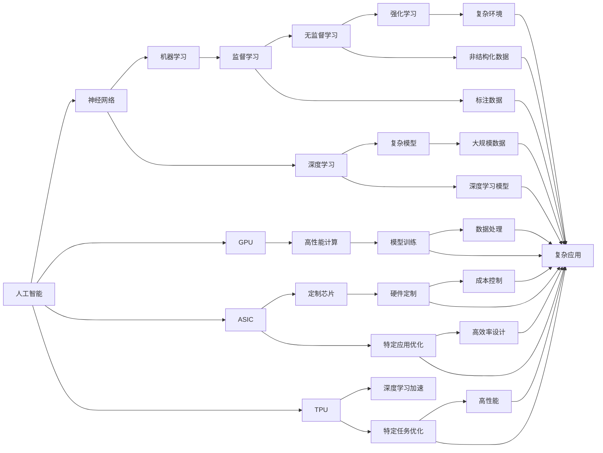

                 

# 芯片技术在AI创新中的突破

> 关键词：芯片,人工智能,神经网络,机器学习,GPU,ASIC,TPU,性能,能效,深度学习,深度学习芯片,定制芯片

## 1. 背景介绍

随着人工智能(AI)技术的迅猛发展，芯片技术在推动AI创新和应用方面起到了关键作用。无论是硬件加速，还是芯片架构设计，都在不断革新AI的边界，重塑其未来发展方向。本篇博客将聚焦于芯片技术在AI中的突破，探讨其如何引领AI时代的到来。

## 2. 核心概念与联系

### 2.1 核心概念概述

要理解芯片技术在AI中的突破，首先需要了解几个关键概念：

- **人工智能(AI)**：人工智能是指通过计算机系统模拟人类智能行为的技术，包括机器学习、深度学习、自然语言处理、计算机视觉等领域。
- **神经网络**：神经网络是AI中的核心算法之一，模仿人类大脑的神经元结构，通过层级化的计算单元来处理和分析数据。
- **机器学习**：机器学习是让机器通过数据自主学习和改进算法，从而实现特定任务的自动化。
- **GPU**：通用图形处理单元(GPU)是专门为并行计算而设计的芯片，能够处理大规模的数据计算任务。
- **ASIC**：专用集成电路(ASIC)是为特定应用定制的芯片，提供更高的性能和更低的能耗。
- **TPU**：Tensor Processing Unit，是Google开发的专为机器学习任务设计的AI芯片，特别擅长加速深度学习模型。
- **性能**：指芯片处理任务的速度和效率，通常用每秒浮点运算次数(FLOPS)来衡量。
- **能效**：芯片的能效是指其在执行任务时消耗的电力与其提供的服务之间的比例。

这些概念共同构成了AI芯片技术的基础，并相互之间存在紧密联系。例如，神经网络、机器学习、GPU、ASIC和TPU等都是AI处理数据的关键工具，而性能和能效则是衡量这些工具效果的指标。

### 2.2 概念间的关系

这些核心概念之间的关系可以用以下Mermaid流程图来展示：



这个流程图展示了AI与芯片技术之间的多维联系：

- **神经网络**：构建了AI中模型的基本框架。
- **机器学习**：提供了AI算法实现的基础。
- **GPU**、**ASIC**、**TPU**：提供了AI算法在芯片上实现的高性能计算能力。
- **性能**、**能效**：衡量芯片技术的实际效果。
- **深度学习**：是AI技术中的关键应用领域，涉及到大量的模型训练和数据处理。

## 3. 核心算法原理 & 具体操作步骤

### 3.1 算法原理概述

AI芯片技术的核心在于如何高效地进行模型训练和推理。具体来说，AI芯片需要处理以下几个关键任务：

1. **数据加载和处理**：芯片需要快速读取和处理海量数据，包括原始数据、预处理数据和训练数据。
2. **模型优化和训练**：芯片需要加速神经网络模型的优化和训练，包括参数调整、梯度更新和模型保存。
3. **推理计算和加速**：芯片需要快速执行深度学习模型的推理计算，提供实时响应和高性能输出。

### 3.2 算法步骤详解

AI芯片技术的具体操作可以包括以下几个步骤：

1. **设计芯片架构**：根据AI任务的需求，设计合适的芯片架构。例如，针对深度学习任务，可以采用专门的ASIC或TPU架构。
2. **实现数据流**：设计高效的数据流，确保数据在芯片内部能够快速流动和处理。
3. **优化并行计算**：使用并行计算单元（如GPU和TPU）来加速模型的训练和推理。
4. **实现算法优化**：针对具体的AI算法进行算法优化，例如使用低精度的数据类型和高效的计算库。
5. **评估和验证**：通过实验验证芯片的性能和能效，确保其满足应用需求。

### 3.3 算法优缺点

AI芯片技术的优势包括：

- **高性能**：能够快速处理大规模数据，加速模型训练和推理。
- **低能耗**：通过优化算法和架构，实现能效比高的计算。
- **定制化**：可以根据具体应用需求进行硬件定制，优化性能和成本。

然而，AI芯片技术也存在一些缺点：

- **复杂性高**：设计和实现AI芯片需要深厚的硬件和软件知识。
- **制造成本高**：定制芯片的成本通常较高。
- **灵活性不足**：定制芯片一旦设计完成，难以进行大规模的量产和应用扩展。

### 3.4 算法应用领域

AI芯片技术在多个领域都有广泛应用，包括：

- **深度学习模型训练**：加速深度学习模型的训练过程，提升模型精度和速度。
- **自然语言处理(NLP)**：加速文本处理、语音识别和机器翻译等任务。
- **计算机视觉**：加速图像识别、物体检测和视频分析等任务。
- **机器人**：加速机器人视觉和决策算法，提高其智能化水平。
- **自动驾驶**：加速自动驾驶车辆的感知和决策算法，提升驾驶安全性。

## 4. 数学模型和公式 & 详细讲解  
### 4.1 数学模型构建

AI芯片技术的数学模型可以基于深度学习的数学框架来构建。以卷积神经网络(CNN)为例，其数学模型如下：

$$y = W^TX + b$$

其中，$W$ 是卷积核矩阵，$X$ 是输入特征矩阵，$b$ 是偏置项，$y$ 是输出结果。在卷积神经网络中，卷积操作和池化操作是两个核心的计算单元，可以并行计算，大幅提升计算效率。

### 4.2 公式推导过程

卷积操作的具体公式如下：

$$y_{ij} = \sum_{m=1}^{n} w_{m}x_{imj} + b_j$$

其中，$w_{m}$ 是卷积核的权重，$x_{imj}$ 是输入特征的像素值，$y_{ij}$ 是卷积操作的输出。

### 4.3 案例分析与讲解

以卷积神经网络为例，其并行计算能力可以通过以下案例进行分析：

- **卷积操作的并行性**：卷积操作可以看作是对输入特征的局部操作，可以通过并行计算实现高效的卷积运算。
- **池化操作的并行性**：池化操作是对输入特征进行下采样，可以通过并行计算实现高效的特征提取。
- **神经网络的深度和宽度**：通过增加神经网络的深度和宽度，可以显著提升模型的精度和泛化能力。

## 5. 项目实践：代码实例和详细解释说明

### 5.1 开发环境搭建

为了进行AI芯片技术的开发和实验，需要搭建相应的开发环境。以下是搭建环境的基本步骤：

1. **选择开发平台**：选择适合的开发平台，如TensorFlow、PyTorch或MXNet等。
2. **安装芯片驱动**：根据选择的芯片类型，安装相应的芯片驱动和SDK。
3. **设置开发环境**：配置好编译器、开发工具和库文件，确保开发环境正常运行。
4. **测试和调试**：编写简单的测试程序，检查芯片的性能和稳定性。

### 5.2 源代码详细实现

以TensorFlow为例，实现一个简单的卷积神经网络模型：

```python
import tensorflow as tf

# 定义模型
model = tf.keras.Sequential([
    tf.keras.layers.Conv2D(32, (3, 3), activation='relu', input_shape=(28, 28, 1)),
    tf.keras.layers.MaxPooling2D((2, 2)),
    tf.keras.layers.Flatten(),
    tf.keras.layers.Dense(10, activation='softmax')
])

# 编译模型
model.compile(optimizer='adam', loss='sparse_categorical_crossentropy', metrics=['accuracy'])

# 训练模型
model.fit(train_images, train_labels, epochs=10, validation_data=(test_images, test_labels))
```

### 5.3 代码解读与分析

上述代码中，我们使用了TensorFlow库来实现一个简单的卷积神经网络模型。该模型包括一个卷积层、一个池化层和一个全连接层。训练模型时，我们使用了Adam优化器和交叉熵损失函数，并在训练过程中使用了验证集进行性能评估。

### 5.4 运行结果展示

在训练完成后，我们可以通过以下代码进行模型评估和测试：

```python
test_loss, test_acc = model.evaluate(test_images, test_labels)
print('Test accuracy:', test_acc)
```

## 6. 实际应用场景

### 6.1 自动驾驶

AI芯片技术在自动驾驶中的应用主要体现在车辆感知和决策算法上。通过安装高性能的AI芯片，自动驾驶车辆可以实时处理传感器数据，进行物体检测、道路识别和路径规划等任务，从而提高驾驶安全性。

### 6.2 医疗影像分析

在医疗影像分析中，AI芯片可以加速模型的训练和推理，帮助医生快速识别和诊断病变。例如，通过使用高性能的GPU和TPU芯片，可以在短时间内处理大量医学影像数据，生成精确的诊断结果。

### 6.3 工业自动化

AI芯片技术在工业自动化中的应用包括机器人视觉检测、自动化生产线和智能制造等。通过安装高性能的AI芯片，可以实现工业生产的智能化和自动化，提高生产效率和质量。

## 7. 工具和资源推荐

### 7.1 学习资源推荐

- **深度学习与人工智能在线课程**：如Coursera上的“Deep Learning Specialization”和Udacity上的“Deep Learning Nanodegree”，帮助学习者系统掌握AI芯片技术的核心知识和技能。
- **AI芯片技术书籍**：如《深度学习芯片设计》和《AI芯片设计与实现》，提供了详细的技术指导和实践案例。
- **在线社区和论坛**：如Reddit上的“r/MachineLearning”和Github上的“AI芯片技术”社区，提供最新的技术动态和交流平台。

### 7.2 开发工具推荐

- **TensorFlow**：谷歌开源的深度学习框架，支持GPU和TPU加速，广泛用于AI芯片技术开发。
- **PyTorch**：Facebook开源的深度学习框架，支持灵活的神经网络模型构建和优化。
- **MXNet**：亚马逊开源的深度学习框架，支持多种编程语言和硬件平台，适合大规模分布式计算。

### 7.3 相关论文推荐

- **《Tensor Processing Unit: Design and Evaluation of a Custom ASIC for Machine Learning》**：Google的研究论文，详细介绍了TPU的设计和性能评估。
- **《Convolutional Neural Networks for Fast Image Classification》**：深度学习领域的经典论文，介绍了卷积神经网络的基本原理和应用。
- **《A Survey on Deep Learning Hardware》**：综述性论文，总结了深度学习硬件技术的研究进展和应用前景。

## 8. 总结：未来发展趋势与挑战

### 8.1 研究成果总结

AI芯片技术在过去几年中取得了显著的进展，推动了AI技术在各个领域的应用。具体研究成果包括：

- **GPU和TPU的性能提升**：通过优化芯片架构和算法，GPU和TPU的性能和能效得到了显著提升。
- **ASIC和FPGA的应用**：ASIC和FPGA芯片的应用范围不断扩大，提供了更高效和定制化的计算能力。
- **深度学习模型的优化**：深度学习模型的算法和架构优化，进一步提升了模型的精度和效率。

### 8.2 未来发展趋势

未来的AI芯片技术将呈现以下趋势：

- **多核并行计算**：未来的芯片将支持多核并行计算，实现更高效的计算能力。
- **低功耗设计**：未来的芯片将更加注重能效比，支持低功耗设计和应用。
- **智能芯片设计**：未来的芯片将具备更高的智能化水平，能够自主进行任务优化和资源管理。
- **跨平台优化**：未来的芯片将支持跨平台优化，实现多种硬件平台的兼容和互操作。

### 8.3 面临的挑战

尽管AI芯片技术取得了显著进展，但仍面临一些挑战：

- **芯片设计和制造**：芯片设计和制造的复杂性高，成本和周期长。
- **算法优化和优化器设计**：深度学习算法和优化器的优化仍需不断探索和改进。
- **跨学科融合**：芯片技术和AI算法需要跨学科融合，实现更全面的技术突破。
- **安全性与隐私保护**：AI芯片技术的应用需要考虑安全性与隐私保护，避免数据泄露和恶意攻击。

### 8.4 研究展望

未来的AI芯片技术需要进一步突破以下领域：

- **硬件加速与软件优化**：实现硬件加速与软件优化的协同，提升整体性能和能效。
- **跨平台兼容与资源共享**：实现跨平台兼容和资源共享，提升AI芯片技术的灵活性和扩展性。
- **多模态数据融合**：实现多模态数据的融合与协同，提升AI系统的感知和理解能力。
- **人工智能伦理与监管**：引入人工智能伦理和监管机制，确保AI系统的公平、透明和可控。

## 9. 附录：常见问题与解答

**Q1: AI芯片技术是否只适用于深度学习任务？**

A: AI芯片技术不仅适用于深度学习任务，也适用于其他AI任务。例如，在自然语言处理和计算机视觉等领域，也可以通过AI芯片加速模型训练和推理。

**Q2: 如何选择合适的AI芯片？**

A: 选择AI芯片需要考虑多方面的因素，包括芯片架构、性能、能效、成本等。一般可以通过以下步骤选择：

1. 确定任务需求：根据任务类型和数据量选择合适的芯片类型。
2. 评估芯片性能：使用测试程序评估芯片的性能和能效。
3. 考虑芯片成本：综合考虑芯片的制造成本和应用成本。
4. 选择适合的开发平台：选择适合的开源框架和开发工具。

**Q3: AI芯片技术是否只适用于硬件加速？**

A: AI芯片技术不仅可以用于硬件加速，还可以用于软件优化。例如，可以使用GPU和TPU加速深度学习模型的训练和推理，使用ASIC和FPGA优化特定应用场景。

**Q4: AI芯片技术在实际应用中需要注意哪些问题？**

A: 在实际应用中，需要注意以下几个问题：

1. 数据隐私保护：确保数据在传输和处理过程中得到保护。
2. 算法公平性：避免算法偏见，确保AI系统的公平性和透明性。
3. 安全性保障：防止恶意攻击和数据泄露，确保系统的安全性。
4. 跨平台兼容性：确保芯片技术在不同平台上的兼容性和互操作性。

**Q5: AI芯片技术在未来的发展方向是什么？**

A: AI芯片技术未来的发展方向包括：

1. 更高的性能和能效比：通过优化芯片架构和算法，提升计算能力和能效。
2. 更高的智能化水平：通过引入人工智能算法，实现更高级别的智能化设计。
3. 更广泛的应用场景：扩展AI芯片技术的覆盖范围，应用于更多领域和任务。
4. 更强的安全性和隐私保护：确保AI系统在实际应用中的安全性与隐私保护。

---

作者：禅与计算机程序设计艺术 / Zen and the Art of Computer Programming

