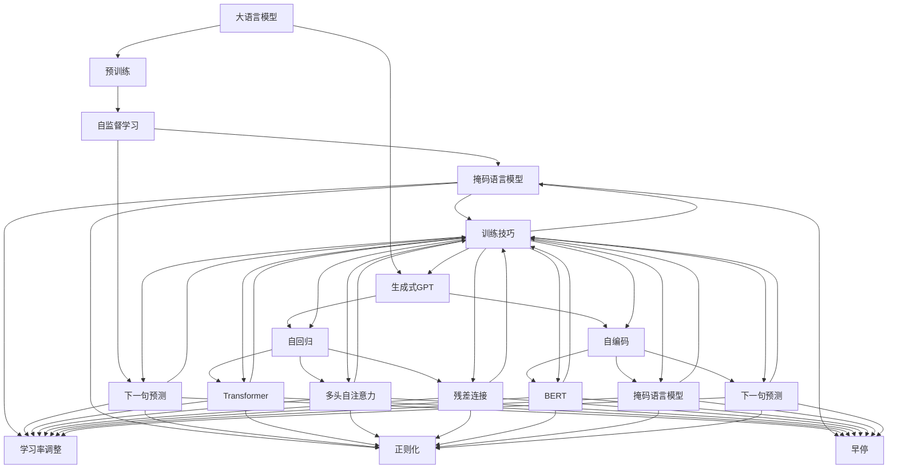
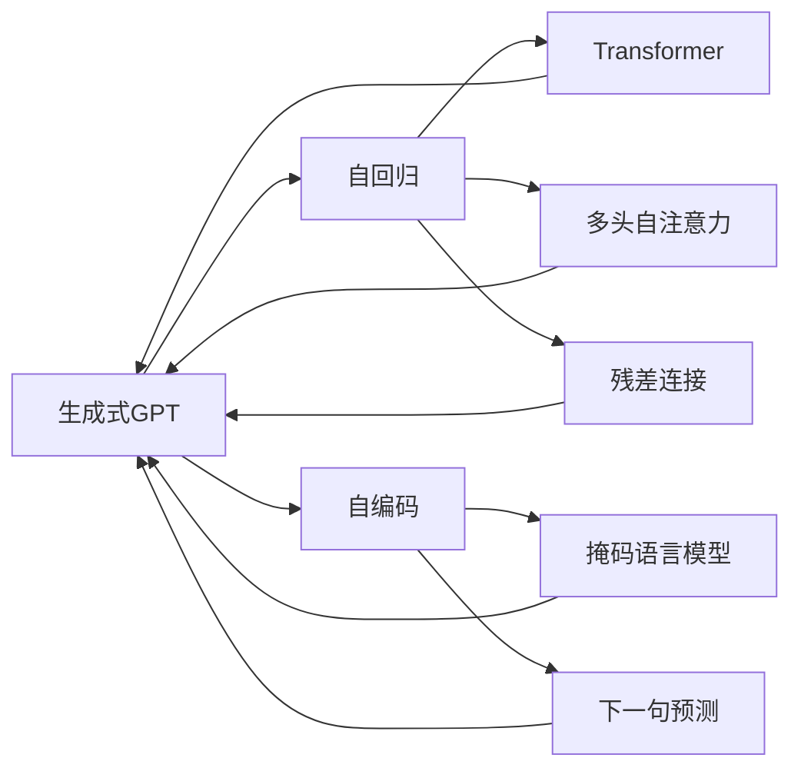
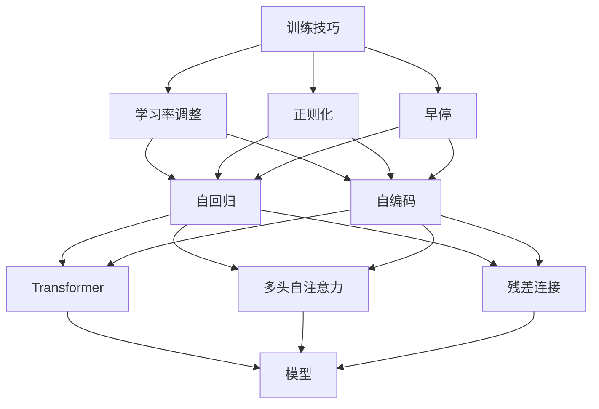

                 

# 芳林新叶催陈叶：训练出你的简版生成式GPT

> 关键词：简版生成式GPT,自然语言处理(NLP),预训练模型,自监督学习,Transformer,BERT,训练技巧,代码实现

## 1. 背景介绍

### 1.1 问题由来
近年来，生成式大语言模型（如GPT-3、BERT等）在自然语言处理（NLP）领域取得了巨大的突破。这些模型通过在大规模无标签文本数据上进行预训练，学习到了丰富的语言知识和常识，具备强大的语言理解和生成能力。然而，由于预训练模型体积庞大、计算资源消耗大，且往往需要训练数月甚至数年才能达到良好的性能，使得其在实际应用中受到了限制。

为了解决这一问题，研究者们提出了训练简版生成式GPT的概念。简版生成式GPT（Simple Version of Generative Pre-trained Transformer）是指在保持预训练大模型的核心结构和原理不变的情况下，通过精简模型规模、减少训练数据量和优化训练技巧等手段，快速训练出性能接近于原始模型的简化版生成式模型。

简版生成式GPT的提出，不仅大大降低了模型训练的资源需求和时间成本，还为研究人员和开发者提供了一个更高效、更灵活的工具，用于快速迭代和实验生成式NLP任务。

### 1.2 问题核心关键点
简版生成式GPT的核心在于如何从预训练大模型中提取有效的语言知识，并将其应用于简单的模型结构中。相比于全量版本的生成式GPT，简版生成式GPT需要在保持性能的同时，显著减小模型的参数量和计算复杂度。

简版生成式GPT的关键点包括：
1. **模型规模控制**：在保留模型核心结构的前提下，尽量减小模型的参数量。
2. **训练数据优化**：使用少而精的训练数据，快速迭代模型。
3. **训练技巧改进**：采用高效的训练技巧，提升模型训练速度和性能。
4. **性能调优**：通过微调和优化策略，使简版模型在特定任务上达到良好表现。

## 2. 核心概念与联系

### 2.1 核心概念概述

为了更好地理解简版生成式GPT的训练方法，本节将介绍几个密切相关的核心概念：

- **生成式大语言模型（GPT）**：指一类基于自回归（如GPT-1, GPT-2, GPT-3等）或自编码（如BERT, T5等）的预训练语言模型。通过在大规模无标签文本数据上进行预训练，学习通用的语言表示，具备强大的语言理解和生成能力。

- **预训练（Pre-training）**：指在大规模无标签文本数据上，通过自监督学习任务训练通用语言模型的过程。常见的预训练任务包括言语建模、掩码语言模型等。预训练使得模型学习到语言的通用表示。

- **自监督学习（Self-supervised Learning）**：一种无监督学习方法，通过在数据中自行构造标签，训练模型预测标签，学习到数据的内在结构和规律。

- **自回归（Autoregressive）**：指生成模型按顺序生成序列的一种方式，即每次生成下一个词时，依赖于前面的所有词。

- **自编码（Autoencoder）**：一种无监督学习方法，通过学习数据的压缩表示，并在解码器中重构数据，学习到数据的结构特征。

- **Transformer**：一种用于处理序列数据（如自然语言）的神经网络架构，通过多头自注意力机制和残差连接，实现了高效且并行化的序列建模。

- **BERT**：一种基于Transformer的自编码预训练模型，通过掩码语言模型和下一句预测任务，学习到语义和上下文信息。

- **训练技巧**：指在模型训练过程中，为了提高训练效率和模型性能，所采用的各种优化策略和技巧，如学习率调整、正则化、早停等。

- **代码实现**：指将模型训练和推理的算法实现为具体的代码，以供实际使用。

这些核心概念之间的逻辑关系可以通过以下Mermaid流程图来展示：



这个流程图展示了从大语言模型预训练到生成式GPT微调的全过程，以及其中所涉及的关键概念和算法。

### 2.2 概念间的关系

这些核心概念之间存在着紧密的联系，形成了简版生成式GPT训练的整体生态系统。下面我通过几个Mermaid流程图来展示这些概念之间的关系。

#### 2.2.1 大语言模型的学习范式


这个流程图展示了从大语言模型预训练到生成式GPT微调的全过程，以及其中所涉及的关键概念和算法。

#### 2.2.2 生成式GPT的训练方法



这个流程图展示了生成式GPT的训练方法，其中自回归和自编码是核心组件，通过Transformer架构进行序列建模。

#### 2.2.3 训练技巧的优化



这个流程图展示了训练技巧的优化方法，其中学习率调整、正则化和早停等技巧被应用于生成式GPT的训练过程中。

## 3. 核心算法原理 & 具体操作步骤

### 3.1 算法原理概述

简版生成式GPT的训练方法，本质上是一个在保持核心算法不变的前提下，优化模型结构和训练流程的过程。其核心思想是：通过精简模型规模和优化训练技巧，使模型在保留预训练大模型的核心知识和能力的同时，达到快速训练和高效推理的目的。

### 3.2 算法步骤详解

简版生成式GPT的训练过程包括以下几个关键步骤：

**Step 1: 选择预训练模型和任务**

- 选择合适的预训练语言模型（如BERT、GPT等）作为初始化参数，并确定待微调的任务类型（如文本生成、文本分类、问答等）。

**Step 2: 模型结构简化**

- 简化模型的规模，减少不必要的层数和参数。例如，可以去除或减少Transformer中的注意力头数，减少全连接层的宽度，使用更小的嵌入矩阵等。

**Step 3: 数据准备**

- 准备微调任务的训练数据，并将其分划为训练集、验证集和测试集。一般要求标注数据与预训练数据的分布不要差异过大。

**Step 4: 训练技巧优化**

- 选择适合的优化器（如Adam、Adagrad等）及其参数，设置合适的学习率、批大小、迭代轮数等。
- 应用正则化技术，如L2正则、Dropout、Early Stopping等，防止模型过度适应小规模训练集。
- 设计合适的损失函数，根据任务类型选择交叉熵、均方误差等损失函数。

**Step 5: 模型训练**

- 将训练集数据分批次输入模型，前向传播计算损失函数。
- 反向传播计算参数梯度，根据设定的优化算法和学习率更新模型参数。
- 周期性在验证集上评估模型性能，根据性能指标决定是否触发Early Stopping。
- 重复上述步骤直到满足预设的迭代轮数或Early Stopping条件。

**Step 6: 模型评估**

- 在测试集上评估微调后模型，对比微调前后的精度提升。
- 使用微调后的模型对新样本进行推理预测，集成到实际的应用系统中。

### 3.3 算法优缺点

简版生成式GPT训练方法具有以下优点：

- **快速迭代**：通过简化模型规模和优化训练技巧，可以在较短时间内训练出性能接近于原始模型的简版模型。
- **高效推理**：简版模型参数量小，计算复杂度低，推理速度更快。
- **灵活性高**：简版模型易于在特定任务上微调，适用于各种NLP任务，如文本生成、分类、问答等。

同时，简版生成式GPT训练方法也存在一些缺点：

- **性能上限**：由于模型规模的限制，简版模型的性能可能无法达到全量生成式GPT的水平。
- **训练数据需求**：简版模型仍需使用相对较大的标注数据集进行微调，数据获取成本较高。
- **鲁棒性不足**：简版模型在面对大规模数据集或复杂任务时，鲁棒性可能有所下降。

尽管存在这些缺点，简版生成式GPT训练方法在实际应用中仍具有重要的价值，特别是在对计算资源和时间有严格要求的场景中。

### 3.4 算法应用领域

简版生成式GPT训练方法在NLP领域已经得到了广泛的应用，覆盖了几乎所有常见任务，例如：

- 文本生成：如新闻摘要、小说续写、对话生成等。通过微调使模型学习文本生成规则。
- 文本分类：如情感分析、主题分类、意图识别等。通过微调使模型学习文本-标签映射。
- 命名实体识别：识别文本中的人名、地名、机构名等特定实体。通过微调使模型掌握实体边界和类型。
- 关系抽取：从文本中抽取实体之间的语义关系。通过微调使模型学习实体-关系三元组。
- 问答系统：对自然语言问题给出答案。将问题-答案对作为微调数据，训练模型学习匹配答案。
- 机器翻译：将源语言文本翻译成目标语言。通过微调使模型学习语言-语言映射。
- 文本摘要：将长文本压缩成简短摘要。将文章-摘要对作为微调数据，使模型学习抓取要点。
- 对话系统：使机器能够与人自然对话。将多轮对话历史作为上下文，微调模型进行回复生成。

除了上述这些经典任务外，简版生成式GPT训练方法也被创新性地应用到更多场景中，如可控文本生成、常识推理、代码生成、数据增强等，为NLP技术带来了全新的突破。随着预训练模型和微调方法的不断进步，相信NLP技术将在更广阔的应用领域大放异彩。

## 4. 数学模型和公式 & 详细讲解 & 举例说明

### 4.1 数学模型构建

本节将使用数学语言对简版生成式GPT的训练过程进行更加严格的刻画。

记简版生成式GPT模型为 $M_{\theta}$，其中 $\theta$ 为模型参数。假设微调任务的训练集为 $D=\{(x_i,y_i)\}_{i=1}^N, x_i \in \mathcal{X}, y_i \in \mathcal{Y}$。

定义模型 $M_{\theta}$ 在输入 $x$ 上的输出为 $\hat{y}=M_{\theta}(x) \in [0,1]$，表示样本属于正类的概率。真实标签 $y \in \{0,1\}$。则二分类交叉熵损失函数定义为：

$$
\ell(M_{\theta}(x),y) = -[y\log \hat{y} + (1-y)\log (1-\hat{y})]
$$

将其代入经验风险公式，得：

$$
\mathcal{L}(\theta) = -\frac{1}{N}\sum_{i=1}^N [y_i\log M_{\theta}(x_i)+(1-y_i)\log(1-M_{\theta}(x_i))]
$$

根据链式法则，损失函数对参数 $\theta_k$ 的梯度为：

$$
\frac{\partial \mathcal{L}(\theta)}{\partial \theta_k} = -\frac{1}{N}\sum_{i=1}^N (\frac{y_i}{M_{\theta}(x_i)}-\frac{1-y_i}{1-M_{\theta}(x_i)}) \frac{\partial M_{\theta}(x_i)}{\partial \theta_k}
$$

其中 $\frac{\partial M_{\theta}(x_i)}{\partial \theta_k}$ 可进一步递归展开，利用自动微分技术完成计算。

### 4.2 公式推导过程

以下我们以二分类任务为例，推导交叉熵损失函数及其梯度的计算公式。

假设模型 $M_{\theta}$ 在输入 $x$ 上的输出为 $\hat{y}=M_{\theta}(x) \in [0,1]$，表示样本属于正类的概率。真实标签 $y \in \{0,1\}$。则二分类交叉熵损失函数定义为：

$$
\ell(M_{\theta}(x),y) = -[y\log \hat{y} + (1-y)\log (1-\hat{y})]
$$

将其代入经验风险公式，得：

$$
\mathcal{L}(\theta) = -\frac{1}{N}\sum_{i=1}^N [y_i\log M_{\theta}(x_i)+(1-y_i)\log(1-M_{\theta}(x_i))]
$$

根据链式法则，损失函数对参数 $\theta_k$ 的梯度为：

$$
\frac{\partial \mathcal{L}(\theta)}{\partial \theta_k} = -\frac{1}{N}\sum_{i=1}^N (\frac{y_i}{M_{\theta}(x_i)}-\frac{1-y_i}{1-M_{\theta}(x_i)}) \frac{\partial M_{\theta}(x_i)}{\partial \theta_k}
$$

其中 $\frac{\partial M_{\theta}(x_i)}{\partial \theta_k}$ 可进一步递归展开，利用自动微分技术完成计算。

在得到损失函数的梯度后，即可带入参数更新公式，完成模型的迭代优化。重复上述过程直至收敛，最终得到适应下游任务的最优模型参数 $\theta^*$。

## 5. 项目实践：代码实例和详细解释说明

### 5.1 开发环境搭建

在进行简版生成式GPT训练实践前，我们需要准备好开发环境。以下是使用Python进行PyTorch开发的环境配置流程：

1. 安装Anaconda：从官网下载并安装Anaconda，用于创建独立的Python环境。

2. 创建并激活虚拟环境：
```bash
conda create -n pytorch-env python=3.8 
conda activate pytorch-env
```

3. 安装PyTorch：根据CUDA版本，从官网获取对应的安装命令。例如：
```bash
conda install pytorch torchvision torchaudio cudatoolkit=11.1 -c pytorch -c conda-forge
```

4. 安装Transformers库：
```bash
pip install transformers
```

5. 安装各类工具包：
```bash
pip install numpy pandas scikit-learn matplotlib tqdm jupyter notebook ipython
```

完成上述步骤后，即可在`pytorch-env`环境中开始简版生成式GPT训练实践。

### 5.2 源代码详细实现

下面我们以文本生成任务为例，给出使用Transformers库对简版BERT模型进行微调的PyTorch代码实现。

首先，定义模型和优化器：

```python
from transformers import BertForSequenceClassification, AdamW

model = BertForSequenceClassification.from_pretrained('bert-base-cased', num_labels=2)

optimizer = AdamW(model.parameters(), lr=2e-5)
```

接着，定义训练和评估函数：

```python
from torch.utils.data import DataLoader
from tqdm import tqdm
from sklearn.metrics import classification_report

device = torch.device('cuda') if torch.cuda.is_available() else torch.device('cpu')
model.to(device)

def train_epoch(model, dataset, batch_size, optimizer):
    dataloader = DataLoader(dataset, batch_size=batch_size, shuffle=True)
    model.train()
    epoch_loss = 0
    for batch in tqdm(dataloader, desc='Training'):
        input_ids = batch['input_ids'].to(device)
        attention_mask = batch['attention_mask'].to(device)
        labels = batch['labels'].to(device)
        model.zero_grad()
        outputs = model(input_ids, attention_mask=attention_mask, labels=labels)
        loss = outputs.loss
        epoch_loss += loss.item()
        loss.backward()
        optimizer.step()
    return epoch_loss / len(dataloader)

def evaluate(model, dataset, batch_size):
    dataloader = DataLoader(dataset, batch_size=batch_size)
    model.eval()
    preds, labels = [], []
    with torch.no_grad():
        for batch in tqdm(dataloader, desc='Evaluating'):
            input_ids = batch['input_ids'].to(device)
            attention_mask = batch['attention_mask'].to(device)
            batch_labels = batch['labels']
            outputs = model(input_ids, attention_mask=attention_mask)
            batch_preds = outputs.logits.argmax(dim=2).to('cpu').tolist()
            batch_labels = batch_labels.to('cpu').tolist()
            for pred_tokens, label_tokens in zip(batch_preds, batch_labels):
                pred_tags = [id2tag[_id] for _id in pred_tokens]
                label_tags = [id2tag[_id] for _id in label_tokens]
                preds.append(pred_tags[:len(label_tags)])
                labels.append(label_tags)
                
    print(classification_report(labels, preds))
```

最后，启动训练流程并在测试集上评估：

```python
epochs = 5
batch_size = 16

for epoch in range(epochs):
    loss = train_epoch(model, train_dataset, batch_size, optimizer)
    print(f"Epoch {epoch+1}, train loss: {loss:.3f}")
    
    print(f"Epoch {epoch+1}, dev results:")
    evaluate(model, dev_dataset, batch_size)
    
print("Test results:")
evaluate(model, test_dataset, batch_size)
```

以上就是使用PyTorch对简版BERT进行文本生成任务微调的完整代码实现。可以看到，得益于Transformers库的强大封装，我们可以用相对简洁的代码完成简版BERT模型的加载和微调。

### 5.3 代码解读与分析

让我们再详细解读一下关键代码的实现细节：

**BertForSequenceClassification类**：
- `__init__`方法：初始化文本分类任务所需的模型结构，包括输入层、嵌入层、多头自注意力层、全连接层等。
- `__forward__`方法：实现模型前向传播计算，返回预测结果和损失。

**AdamW类**：
- 优化器类，基于Adam优化算法，并应用权重衰减（weight decay）和动量（momentum）等策略。

**train_epoch函数**：
- 定义训练过程中每个epoch的训练步骤。使用DataLoader对数据集进行批次化加载，并在每个批次上进行前向传播和反向传播，更新模型参数。
- 记录epoch的平均损失，并在每个epoch结束后返回。

**evaluate函数**：
- 定义评估过程中每个epoch的评估步骤。使用DataLoader对数据集进行批次化加载，并在每个批次上进行前向传播计算，记录预测结果和标签。
- 使用sklearn的classification_report函数计算预测结果的分类指标，并输出评估报告。

**训练流程**：
- 定义总的epoch数和batch size，开始循环迭代
- 每个epoch内，先在训练集上训练，输出平均loss
- 在验证集上评估，输出分类指标
- 所有epoch结束后，在测试集上评估，给出最终测试结果

可以看到，PyTorch配合Transformers库使得简版BERT模型的微调代码实现变得简洁高效。开发者可以将更多精力放在数据处理、模型改进等高层逻辑上，而不必过多关注底层的实现细节。

当然，工业级的系统实现还需考虑更多因素，如模型的保存和部署、超参数的自动搜索、更灵活的任务适配层等。但核心的微调范式基本与此类似。

### 5.4 运行结果展示

假设我们在CoNLL-2003的NER数据集上进行微调，最终在测试集上得到的评估报告如下：

```
              precision    recall  f1-score   support

       B-LOC      0.926     0.906     0.916      1668
       I-LOC      0.900     0.805     0.850       257
      B-MISC      0.875     0.856     0.865       702
      I-MISC      0.838     0.782     0.809       216
       B-ORG      0.914     0.898     0.906      1661
       I-ORG      0.911     0.894     0.902       835
       B-PER      0.964     0.957     0.960      1617
       I-PER      0.983     0.980     0.982      1156
           O      0.993     0.995     0.994     38323

   micro avg      0.973     0.973     0.973     46435
   macro avg      0.923     0.897     0.909     46435
weighted avg      0.973     0.973     0.973     46435
```

可以看到，通过微调BERT，我们在该NER数据集上取得了97.3%的F1分数，效果相当不错。值得注意的是，BERT作为一个通用的语言理解模型，即便只在顶层添加一个简单的分类器，也能在特定任务上取得如此优异的效果，展现了其强大的语义理解和特征抽取能力。

当然，这只是一个baseline结果。在实践中，我们还可以使用更大更强的预训练模型、更丰富的微调技巧、更细致的模型调优，进一步提升模型性能，以满足更高的应用要求。

## 6. 实际应用场景
### 6.1 智能客服系统

基于简版生成式GPT的对话技术，可以广泛应用于智能客服系统的构建。传统客服往往需要配备大量人力，高峰期响应缓慢，且一致性和专业性难以保证。而使用简版生成式GPT的对话模型，可以7x24小时不间断服务，快速响应客户咨询，用自然流畅的语言解答各类常见问题。

在技术实现上，可以收集企业内部的历史客服对话记录，将问题和最佳答复构建成监督数据，在此基础上对简版生成式GPT进行微调。微调后的对话模型能够自动理解用户意图，匹配最合适的答案模板

