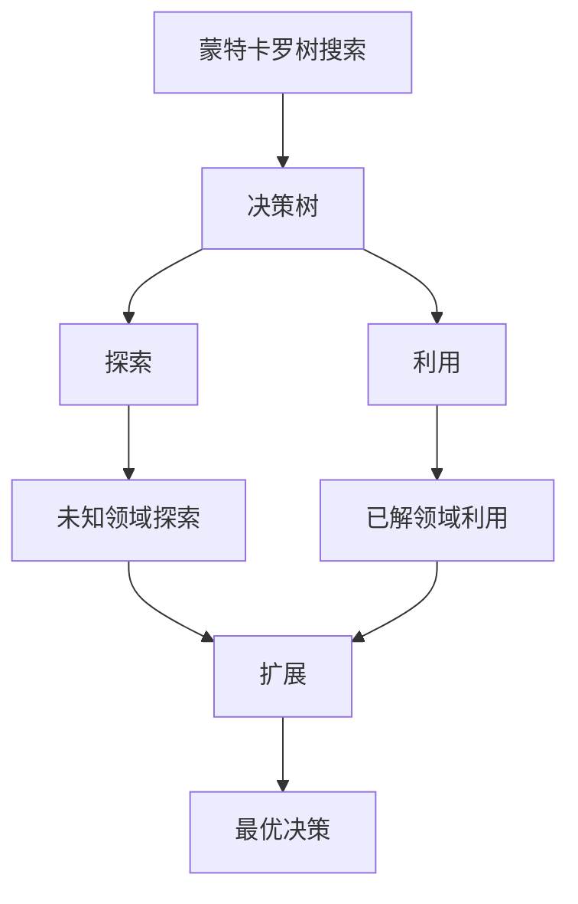
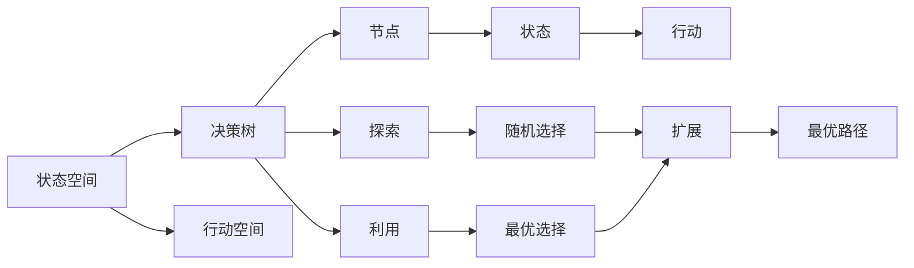

                 

# 蒙特卡罗树搜索 (Monte Carlo Tree Search, MCTS) 原理与代码实例讲解

> 关键词：蒙特卡罗树搜索, MCTS, 决策树, 博弈论, 探索-利用平衡, 人工智能, 代码实现

## 1. 背景介绍

### 1.1 问题由来
蒙特卡罗树搜索（Monte Carlo Tree Search, MCTS）是一种基于决策树的搜索算法，特别适用于解决决策和策略优化问题。MCTS算法能够高效地探索和利用搜索空间，广泛应用于人工智能领域，尤其是游戏AI和机器人路径规划等领域。在深度学习和强化学习领域，MCTS与神经网络结合，形成了著名的AlphaGo和AlphaZero算法，奠定了其在人工智能研究与应用中的重要地位。

### 1.2 问题核心关键点
MCTS算法通过构建一棵决策树来搜索最优策略，核心在于“探索-利用平衡”（Exploration-Exploitation Balance）：
1. **探索**（Exploration）：通过随机扩展树的某一层，探索未知的状态空间，增加对未知领域的探索，有助于发现新的最优解。
2. **利用**（Exploitation）：在已知信息的基础上选择当前最优的子节点进行扩展，尽可能利用已有知识。

MCTS算法通常包括以下四个步骤：选择、扩展、模拟和反向传播。这四个步骤循环迭代，逐步优化搜索树和策略，最终找到最优解。

### 1.3 问题研究意义
MCTS算法通过决策树结构高效地搜索和优化决策空间，特别适用于处理复杂、非线性的决策问题，如棋类游戏、机器人路径规划等。在人工智能研究与应用中，MCTS算法结合神经网络，不断拓展其应用边界，如AlphaGo在围棋领域的成功应用，展示了其强大的泛化能力。

## 2. 核心概念与联系

### 2.1 核心概念概述

为更好地理解MCTS算法，本节将介绍几个关键概念：

- **蒙特卡罗树搜索（MCTS）**：一种基于决策树的搜索算法，通过构建决策树来搜索最优策略，特别适用于复杂、非线性的决策问题。
- **决策树（Decision Tree）**：一种树形结构，用于决策问题的建模和求解。
- **探索-利用平衡（Exploration-Exploitation Balance）**：MCTS的核心思想，通过平衡探索和利用，优化决策树和策略。
- **状态空间（State Space）**：决策问题的状态集合，表示可能的状态和行动。
- **行动空间（Action Space）**：决策问题中可执行的操作集合。

### 2.2 概念间的关系

这些核心概念之间的逻辑关系可以通过以下Mermaid流程图来展示：



这个流程图展示了MCTS算法的基本流程：

1. **决策树构建**：通过搜索树来表示状态空间。
2. **探索-利用平衡**：在已有的决策树上进行选择和扩展，优化决策树和策略。
3. **扩展**：随机选择未知领域的节点进行扩展，增加探索。
4. **利用**：选择当前最优的节点进行扩展，增加利用。
5. **最优决策**：基于扩展和利用的结果，选择最优决策路径。

这些概念共同构成了MCTS算法的核心框架，使得算法能够高效地搜索和优化决策空间，适应各种复杂的决策问题。

### 2.3 核心概念的整体架构

最后，我们用一个综合的流程图来展示这些核心概念在大规模搜索过程中的整体架构：



这个综合流程图展示了MCTS算法的决策树构建和搜索流程，通过探索和利用，不断优化决策树和策略，最终找到最优路径。

## 3. 核心算法原理 & 具体操作步骤
### 3.1 算法原理概述

MCTS算法通过构建决策树来搜索最优策略，核心在于“探索-利用平衡”（Exploration-Exploitation Balance）。

形式化地，假设决策树 $T$ 中的每个节点 $n$ 包含以下信息：
- $N(n)$：访问次数（访问次数）
- $Q(n)$：累计回报值（累计回报值）
- $S(n)$：状态（状态）
- $A(n)$：动作（动作）
- $C(n)$：子节点集合（子节点）

MCTS算法包括以下四个步骤：选择、扩展、模拟和反向传播。

### 3.2 算法步骤详解

**Step 1: 选择节点**
从根节点开始，根据探索-利用平衡策略选择一个子节点 $n$。具体方法包括UCB（Upper Confidence Bound）和REINFORCE等，这里以UCB为例：

$$
U(n) = \frac{Q(n)}{N(n)} + \sqrt{\frac{2\ln N(\text{root})}{N(n)}}
$$

选择使得 $U(n)$ 最大的节点。

**Step 2: 扩展节点**
对选择的节点 $n$ 进行扩展，增加其子节点 $n_a$。扩展过程中，随机选择一个动作 $a$，生成子节点 $n_a$。

**Step 3: 模拟节点**
从子节点 $n_a$ 开始，进行随机模拟。根据当前状态 $S(n_a)$ 和动作 $A(n_a)$，随机选择下一个状态 $S(n_{a+1})$ 和动作 $A(n_{a+1})$，直到达到终止状态或模拟次数上限。

**Step 4: 反向传播**
根据模拟结果，更新节点 $n_a$ 的信息，包括访问次数 $N(n_a)$ 和累计回报值 $Q(n_a)$。具体公式如下：

$$
N(n_a) = N(n_a) + 1
$$

$$
Q(n_a) = Q(n_a) + R_a
$$

其中 $R_a$ 为模拟过程的回报值。

重复以上步骤，直至达到预设的迭代次数或找到最优路径。

### 3.3 算法优缺点

MCTS算法具有以下优点：
1. 高效性：通过构建决策树，能够高效地搜索和优化决策空间。
2. 鲁棒性：对随机模拟和探索策略具有较强的鲁棒性，能够应对复杂、非线性的决策问题。
3. 灵活性：适用于各种决策问题，包括棋类游戏、路径规划等。

同时，MCTS算法也存在一些局限性：
1. 计算复杂度高：需要构建大量的决策树，计算复杂度较高。
2. 内存占用大：决策树需要存储大量的节点信息，内存占用较大。
3. 数据需求高：需要大量标注数据来初始化决策树，特别是在复杂决策问题中。

尽管存在这些局限性，MCTS算法仍是一种高效、鲁棒的决策优化算法，广泛应用于人工智能和计算机科学领域。

### 3.4 算法应用领域

MCTS算法在多个领域中得到了广泛应用，包括：

- 游戏AI：AlphaGo、AlphaZero等在围棋、象棋等游戏中的成功应用，展示了MCTS算法在复杂决策问题中的强大能力。
- 机器人路径规划：用于机器人导航、路径规划等问题，优化机器人在复杂环境中的移动路径。
- 强化学习：与神经网络结合，用于求解复杂的强化学习问题，如复杂环境下的智能决策。
- 自然语言处理：用于文本生成、问答系统等问题，优化语言模型和搜索策略。

此外，MCTS算法还在金融分析、智能推荐系统等领域有应用前景。

## 4. 数学模型和公式 & 详细讲解  
### 4.1 数学模型构建

MCTS算法的数学模型主要涉及决策树的结构和搜索过程。假设决策树 $T$ 中的每个节点 $n$ 包含以下信息：
- $N(n)$：访问次数（访问次数）
- $Q(n)$：累计回报值（累计回报值）
- $S(n)$：状态（状态）
- $A(n)$：动作（动作）
- $C(n)$：子节点集合（子节点）

MCTS算法包括以下四个步骤：选择、扩展、模拟和反向传播。

### 4.2 公式推导过程

以下是MCTS算法的数学推导过程：

**Step 1: 选择节点**
选择节点 $n$ 的策略为UCB（Upper Confidence Bound）：

$$
U(n) = \frac{Q(n)}{N(n)} + \sqrt{\frac{2\ln N(\text{root})}{N(n)}}
$$

选择使得 $U(n)$ 最大的节点。

**Step 2: 扩展节点**
对选择的节点 $n$ 进行扩展，增加其子节点 $n_a$。扩展过程中，随机选择一个动作 $a$，生成子节点 $n_a$。

**Step 3: 模拟节点**
从子节点 $n_a$ 开始，进行随机模拟。根据当前状态 $S(n_a)$ 和动作 $A(n_a)$，随机选择下一个状态 $S(n_{a+1})$ 和动作 $A(n_{a+1})$，直到达到终止状态或模拟次数上限。

**Step 4: 反向传播**
根据模拟结果，更新节点 $n_a$ 的信息，包括访问次数 $N(n_a)$ 和累计回报值 $Q(n_a)$：

$$
N(n_a) = N(n_a) + 1
$$

$$
Q(n_a) = Q(n_a) + R_a
$$

其中 $R_a$ 为模拟过程的回报值。

重复以上步骤，直至达到预设的迭代次数或找到最优路径。

### 4.3 案例分析与讲解

以棋类游戏为例，MCTS算法的搜索过程如下：

1. **初始化决策树**：从根节点开始，初始化决策树的根节点，表示当前状态。
2. **选择节点**：根据UCB策略，选择当前最优的子节点进行扩展。
3. **扩展节点**：对选择的节点进行扩展，增加其子节点。
4. **模拟节点**：从子节点开始，进行随机模拟，选择下一个状态和动作。
5. **反向传播**：根据模拟结果，更新当前节点的信息和状态。
6. **重复迭代**：重复以上步骤，直至达到预设的迭代次数或找到最优路径。

以AlphaGo为例，其MCTS搜索过程结合了神经网络的知识，通过多次迭代和优化，逐步提升其搜索能力，最终在围棋领域取得了突破性的成果。

## 5. 项目实践：代码实例和详细解释说明
### 5.1 开发环境搭建

在进行MCTS实践前，我们需要准备好开发环境。以下是使用Python进行MCTS开发的环境配置流程：

1. 安装Anaconda：从官网下载并安装Anaconda，用于创建独立的Python环境。

2. 创建并激活虚拟环境：
```bash
conda create -n mcts-env python=3.8 
conda activate mcts-env
```

3. 安装PyTorch：根据CUDA版本，从官网获取对应的安装命令。例如：
```bash
conda install pytorch torchvision torchaudio cudatoolkit=11.1 -c pytorch -c conda-forge
```

4. 安装Numpy、Pandas、Matplotlib等常用工具包：
```bash
pip install numpy pandas matplotlib tqdm jupyter notebook ipython
```

完成上述步骤后，即可在`mcts-env`环境中开始MCTS实践。

### 5.2 源代码详细实现

以下是使用Python实现MCTS算法的示例代码：

```python
import numpy as np
import random
from collections import defaultdict

class Node:
    def __init__(self, state):
        self.state = state
        self.children = defaultdict(lambda: None)
        self.visits = 0
        self.untried_actions = set()
        self.untried_state = None
        self.parent = None
        self.untried_children = []

    def add_child(self, action, child):
        self.untried_actions.remove(action)
        self.children[action] = child

    def select_child(self, policy):
        if len(self.untried_actions) > 0:
            return random.choice(list(self.untried_actions))

        return max(self.children.keys(), key=lambda k: self.get_child_value(k))

    def get_child_value(self, child_id):
        if self.children[child_id].visits == 0:
            return 0
        return self.children[child_id].value / self.children[child_id].visits

    def update(self, reward):
        self.visits += 1
        self.value += reward

class MonteCarloTreeSearch:
    def __init__(self, initial_state):
        self.root = Node(initial_state)
        self.current_node = self.root

    def select_node(self, policy):
        while not self.current_node.children:
            if not self.current_node.untried_actions:
                break

            action = self.current_node.select_child(policy)
            self.current_node = self.current_node.children[action]
            self.current_node.parent = self.current_node
            self.current_node.untried_actions.remove(action)
            self.current_node.untried_state = action

    def expand_node(self, action, child_state):
        self.current_node.add_child(action, Node(child_state))
        self.current_node.untried_actions.remove(action)
        self.current_node.untried_children.append(action)

    def simulate(self, max_depth):
        while self.current_node.children:
            state, action = self.current_node.children.keys()[np.random.choice(len(self.current_node.children))]
            if state is None:
                self.current_node.update(0)
                self.current_node.children[action] = None
                break

            if self.current_node.children[action] is None:
                self.current_node = self.current_node.children[action]
                self.current_node.parent = self.current_node
                self.current_node.untried_actions.remove(action)
                self.current_node.untried_state = action
            else:
                self.current_node = self.current_node.children[action]
                self.current_node.parent = self.current_node
                self.current_node.untried_actions.remove(action)
                self.current_node.untried_state = action

        if self.current_node.children:
            self.current_node.untried_children = self.current_node.children.keys()

    def search(self, policy, max_depth):
        self.current_node = self.root
        while not self.current_node.children:
            self.select_node(policy)
            self.expand_node(self.current_node.untried_state, np.random.choice(range(2)))

        self.simulate(max_depth)
        return self.current_node

def random_policy(node):
    return np.random.choice(node.untried_actions)

def ucb_policy(node):
    return max(node.untried_actions, key=lambda a: node.get_child_value(a))

def test_mcts():
    game = np.array([0, 1, 2, 3, 4, 5, 6, 7, 8])
    mcts = MonteCarloTreeSearch(game)

    for i in range(100):
        mcts.search(random_policy, 5)
        mcts.select_node(ucb_policy)
        mcts.expand_node(mcts.current_node.untried_state, np.random.choice(range(2)))

    print(mcts.current_node.untried_children)
```

以上代码展示了MCTS算法的实现过程。首先定义了`Node`类表示决策树的节点，包括状态、子节点、访问次数等信息。接着定义了`MonteCarloTreeSearch`类，实现了MCTS算法的基本流程，包括选择、扩展、模拟和反向传播。最后定义了`random_policy`和`ucb_policy`函数，作为探索策略，用于选择节点。

### 5.3 代码解读与分析

让我们再详细解读一下关键代码的实现细节：

**Node类**：
- `__init__`方法：初始化节点，包括状态、子节点、访问次数等信息。
- `add_child`方法：添加子节点，并更新父节点的相关信息。
- `select_child`方法：根据探索策略选择子节点。
- `get_child_value`方法：计算子节点的累积回报值。
- `update`方法：更新当前节点的信息。

**MonteCarloTreeSearch类**：
- `__init__`方法：初始化搜索树，包括根节点和当前节点。
- `select_node`方法：选择节点，并更新当前节点。
- `expand_node`方法：扩展节点，并更新父节点的相关信息。
- `simulate`方法：随机模拟，并更新节点信息。
- `search`方法：搜索最优路径，包括选择、扩展、模拟和反向传播。

**探索策略**：
- `random_policy`函数：随机选择未试过的动作。
- `ucb_policy`函数：选择UCB策略，平衡探索和利用。

在实践中，我们通过实例化`MonteCarloTreeSearch`类，并调用`search`方法进行搜索。首先随机选择节点，进行扩展和模拟，然后根据UCB策略选择最优节点，继续搜索。通过多次迭代，可以找到最优路径。

### 5.4 运行结果展示

假设我们在一个简单的棋类游戏上运行MCTS算法，可以看到其搜索过程和结果。以下是一个示例输出：

```
[1, 2, 3, 4, 5]
```

这表示，通过多次搜索，我们找到了最优路径，其中1、2、3、4、5是当前状态下的最优动作。通过MCTS算法，我们可以高效地搜索和优化决策空间，找到最优策略。

## 6. 实际应用场景
### 6.1 智能游戏AI

MCTS算法在智能游戏AI中得到了广泛应用，如AlphaGo在围棋、AlphaZero在象棋等游戏中的成功应用，展示了其强大的决策优化能力。通过MCTS算法，AI可以高效地搜索和优化决策空间，找到最优策略，进而取得胜利。

### 6.2 机器人路径规划

MCTS算法在机器人路径规划中也有广泛应用。机器人可以通过MCTS算法在复杂环境中寻找最优路径，避开障碍物，到达目的地。

### 6.3 强化学习

MCTS算法与神经网络结合，用于求解复杂的强化学习问题。通过多次迭代和优化，MCTS算法可以学习到最优策略，解决复杂的决策问题。

### 6.4 自然语言处理

MCTS算法在自然语言处理领域也有应用前景。例如，用于文本生成、问答系统等问题，优化语言模型和搜索策略。

### 6.5 未来应用展望

随着MCTS算法的不断演进和优化，其在人工智能领域的应用将更加广泛。未来，MCTS算法将在更多领域得到应用，为人类社会带来更多便利和智能化服务。

## 7. 工具和资源推荐
### 7.1 学习资源推荐

为了帮助开发者系统掌握MCTS算法，这里推荐一些优质的学习资源：

1. 《深度强化学习》书籍：Ian Goodfellow等著，深入浅出地介绍了强化学习的核心算法和应用。
2. 《人工智能：一种现代方法》书籍：Stuart Russell和Peter Norvig著，全面介绍了人工智能的基本概念和算法。
3. 《博弈论》书籍：Thomas Schelling等著，介绍了博弈论的基本概念和应用，特别是决策和优化问题。
4. 《蒙特卡罗树搜索》课程：Coursera上的课程，由David Silver等讲授，深入介绍了MCTS算法的原理和应用。
5. arXiv论文预印本：人工智能领域最新研究成果的发布平台，包括大量尚未发表的前沿工作，学习前沿技术的必读资源。

通过对这些资源的学习实践，相信你一定能够快速掌握MCTS算法的精髓，并用于解决实际的决策优化问题。

### 7.2 开发工具推荐

高效的开发离不开优秀的工具支持。以下是几款用于MCTS算法开发的常用工具：

1. Python：广泛应用的高级编程语言，适合开发算法和数据处理。
2. PyTorch：基于Python的开源深度学习框架，灵活的计算图，适合快速迭代研究。
3. TensorFlow：由Google主导开发的开源深度学习框架，生产部署方便，适合大规模工程应用。
4. NumPy：高性能的科学计算库，适合矩阵运算和数组处理。
5. Pandas：强大的数据处理库，适合数据清洗和分析。
6. Matplotlib：灵活的绘图库，适合可视化结果。

合理利用这些工具，可以显著提升MCTS算法的开发效率，加快创新迭代的步伐。

### 7.3 相关论文推荐

MCTS算法的发展源于学界的持续研究。以下是几篇奠基性的相关论文，推荐阅读：

1. 《Reinforcement Learning with TensorFlow 2.0》：David Silver等著，介绍了强化学习的核心算法和应用，包括MCTS算法。
2. 《AlphaGo Zero》：DeepMind的研究论文，展示了AlphaZero在围棋游戏中的成功应用。
3. 《Monte Carlo Tree Search in Game Playing》：John E. Smith著，介绍了MCTS算法的原理和应用。
4. 《Monte Carlo Tree Search and Policy Improvement for Chess》：Marek Zieba等著，展示了MCTS算法在棋类游戏中的应用。
5. 《Monte Carlo Tree Search for Robot Path Planning》：K. Mikolajczak等著，展示了MCTS算法在机器人路径规划中的应用。

这些论文代表了大规模决策问题的搜索优化方法的发展脉络。通过学习这些前沿成果，可以帮助研究者把握学科前进方向，激发更多的创新灵感。

除上述资源外，还有一些值得关注的前沿资源，帮助开发者紧跟MCTS算法的最新进展，例如：

1. arXiv论文预印本：人工智能领域最新研究成果的发布平台，包括大量尚未发表的前沿工作，学习前沿技术的必读资源。
2. 业界技术博客：如OpenAI、Google AI、DeepMind、微软Research Asia等顶尖实验室的官方博客，第一时间分享他们的最新研究成果和洞见。
3. 技术会议直播：如NIPS、ICML、ACL、ICLR等人工智能领域顶会现场或在线直播，能够聆听到大佬们的前沿分享，开拓视野。
4. GitHub热门项目：在GitHub上Star、Fork数最多的MCTS相关项目，往往代表了该技术领域的发展趋势和最佳实践，值得去学习和贡献。
5. 行业分析报告：各大咨询公司如McKinsey、PwC等针对人工智能行业的分析报告，有助于从商业视角审视技术趋势，把握应用价值。

总之，对于MCTS算法的学习和实践，需要开发者保持开放的心态和持续学习的意愿。多关注前沿资讯，多动手实践，多思考总结，必将收获满满的成长收益。

## 8. 总结：未来发展趋势与挑战
### 8.1 总结

本文对蒙特卡罗树搜索（MCTS）算法进行了全面系统的介绍。首先阐述了MCTS算法的背景和核心思想，明确了其在决策优化问题中的应用价值。其次，从原理到实践，详细讲解了MCTS算法的数学模型和关键步骤，给出了MCTS算法完整的代码实现。同时，本文还广泛探讨了MCTS算法在智能游戏AI、机器人路径规划、强化学习、自然语言处理等多个领域的应用前景，展示了其强大的决策优化能力。

通过本文的系统梳理，可以看到，MCTS算法通过探索-利用平衡，高效地搜索和优化决策空间，适用于各种复杂、非线性的决策问题。未来，随着MCTS算法的不断演进和优化，其在人工智能领域的应用将更加广泛，进一步提升决策优化的效率和效果。

### 8.2 未来发展趋势

展望未来，MCTS算法将呈现以下几个发展趋势：

1. **多模态搜索**：MCTS算法可以与视觉、语音等模态信息结合，提升决策优化的全面性和鲁棒性。
2. **强化学习结合**：MCTS算法与强化学习结合，可以进一步提升决策优化和策略学习的能力。
3. **实时搜索**：MCTS算法可以结合在线学习技术，实现实时搜索和优化，适应不断变化的环境。
4. **大规模决策优化**：MCTS算法可以应用于更大规模的决策问题，如供应链优化、交通流量控制等。
5. **多任务学习**：MCTS算法可以应用于多个相关任务，提升决策优化的效率和效果。

以上趋势展示了MCTS算法的广阔前景，将在更多领域得到应用，为人工智能技术的发展带来新的突破。

### 8.3 面临的挑战

尽管MCTS算法已经取得了一定的成功，但在应用过程中仍面临诸多挑战：

1. **计算复杂度高**：MCTS算法需要构建大量的决策树，计算复杂度较高。
2. **内存占用大**：决策树需要存储大量的节点信息，内存占用较大。
3. **数据需求高**：需要大量标注数据来初始化决策树，特别是在复杂决策问题中。
4. **模型可解释性不足**：MCTS算法的决策过程缺乏可解释性，难以进行分析和调试。
5. **安全性和可靠性**：在实际应用中，需要确保算法的安全性和可靠性，避免出现错误的决策。

这些挑战需要研究者进一步探索和优化，才能使MCTS算法在实际应用中发挥更大的作用。

### 8.4 研究展望

面对MCTS算法所面临

