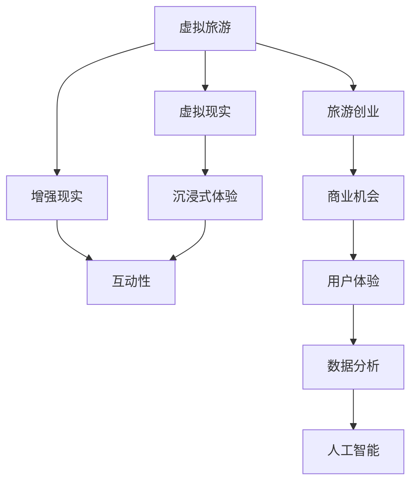
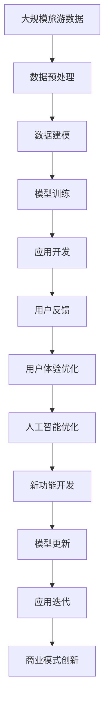

                 

# 虚拟旅游创业：足不出户的环球体验

## 1. 背景介绍

### 1.1 问题由来

随着技术的进步，尤其是虚拟现实(VR)和增强现实(AR)技术的快速发展，虚拟旅游已经从概念变为现实，并逐渐被大众接受。虚拟旅游不仅仅提供了一种全新的旅游方式，更是为旅游创业者提供了一个全新的商业机会。在疫情背景下，人们更加注重居家安全和健康，虚拟旅游作为健康旅游的一部分，受到了更多的关注。

### 1.2 问题核心关键点

虚拟旅游创业的核心在于将旅游体验数字化，通过虚拟现实技术将游客带到世界各地，体验不同的文化和风景。这需要开发一款高质量的虚拟旅游应用，提供高仿真的虚拟场景、互动性强的内容和用户友好的界面。

### 1.3 问题研究意义

虚拟旅游创业的研究意义在于，它打破了传统旅游的时间和空间限制，为旅游行业带来了新的增长点。它不仅为旅游者提供了全新的旅游体验，也为创业者开辟了新的商业领域。此外，虚拟旅游还可以解决实际旅游中的资源限制问题，如季节性旅游热点、交通堵塞等问题。

## 2. 核心概念与联系

### 2.1 核心概念概述

1. **虚拟旅游（Virtual Tourism）**：通过虚拟现实和增强现实技术，将真实的旅游场景数字化，用户在虚拟空间中体验到仿佛身临其境的旅游体验。

2. **虚拟现实（Virtual Reality, VR）**：通过模拟现实世界的视觉、听觉、触觉等感官体验，使用户在虚拟空间中感到仿佛置身于真实世界。

3. **增强现实（Augmented Reality, AR）**：通过在现实世界中叠加虚拟信息，使用户在现实世界中看到虚拟信息，如导览、介绍等。

4. **旅游创业（Tourism Entrepreneurship）**：指创业者利用虚拟旅游技术，开发虚拟旅游应用，提供旅游服务，开拓商业机会的过程。

5. **用户体验（User Experience, UX）**：指用户在使用虚拟旅游应用时的感受，包括界面的易用性、互动性、沉浸感等。

6. **数据驱动（Data-Driven）**：指通过数据分析和人工智能技术，优化虚拟旅游应用的功能和内容，提升用户体验。

### 2.2 概念间的关系

这些核心概念之间存在着紧密的联系，形成了一个完整的虚拟旅游创业生态系统。虚拟旅游作为技术基础，提供了实现虚拟体验的可能；旅游创业作为商业模式，驱动了虚拟旅游技术的应用和发展；用户体验作为评价指标，指导着应用的优化和改进；数据驱动则通过数据分析和人工智能技术，支持应用的持续创新。

以下是一个简单的Mermaid流程图，展示了这些概念之间的关系：



这个流程图展示了虚拟旅游与其他核心概念之间的联系：

- 虚拟现实和增强现实提供了沉浸式和互动性的体验，是虚拟旅游的核心技术基础。
- 旅游创业驱动了虚拟旅游技术的应用和发展，形成商业模式。
- 用户体验作为评价指标，指导着应用的优化和改进。
- 数据驱动通过数据分析和人工智能技术，支持应用的持续创新。

### 2.3 核心概念的整体架构

最后，我们用一个综合的流程图来展示这些核心概念在大规模应用中的整体架构：



这个综合流程图展示了从数据采集到应用迭代的整个虚拟旅游创业过程。旅游数据首先经过预处理和建模，然后通过模型训练和应用开发，形成初步的虚拟旅游应用。用户反馈和用户体验优化不断迭代改进应用，而人工智能技术不断优化模型，形成新的功能开发。最终，商业模式创新进一步推动应用的发展。

## 3. 核心算法原理 & 具体操作步骤

### 3.1 算法原理概述

虚拟旅游创业的核心算法包括虚拟现实和增强现实技术、用户行为分析和人工智能推荐系统。这些算法共同构成了一个完整的虚拟旅游体验生态系统。

1. **虚拟现实技术**：通过计算机图形技术、三维建模和传感器技术，生成高仿真的虚拟场景，使用户在虚拟空间中体验到仿佛身临其境的感觉。

2. **增强现实技术**：通过摄像头、传感器等技术，将虚拟信息叠加到现实世界中，使用户在现实世界中看到虚拟信息，如导览、介绍等。

3. **用户行为分析**：通过数据分析技术，如用户点击行为、停留时间、交互路径等，分析用户对虚拟旅游应用的使用情况，优化应用的布局和功能。

4. **人工智能推荐系统**：通过机器学习和自然语言处理技术，推荐用户感兴趣的虚拟旅游内容和景点，提升用户的体验和满意度。

### 3.2 算法步骤详解

以下是虚拟旅游创业的核心算法步骤：

1. **数据采集与预处理**：从旅游景区、酒店、旅行社等渠道收集旅游数据，包括景点介绍、用户评价、交通路线等。对数据进行清洗、标注和结构化处理，形成可供算法使用的数据集。

2. **虚拟场景建模**：利用三维建模软件，如Blender、Unity等，生成虚拟旅游场景，包括景点、酒店、交通路线等。使用高精度的三维模型和纹理贴图，提高场景的真实感。

3. **虚拟现实和增强现实开发**：使用Unity、Unreal Engine等游戏引擎，开发虚拟旅游应用。利用VR头盔、AR眼镜等设备，提供沉浸式和互动性的体验。

4. **用户行为分析**：使用数据分析工具，如Google Analytics、Apache Hadoop等，收集用户行为数据，分析用户的兴趣和需求，优化应用的布局和功能。

5. **人工智能推荐系统开发**：使用机器学习库，如TensorFlow、PyTorch等，开发推荐系统。通过用户行为数据和评分数据，训练推荐模型，推荐用户感兴趣的景点和活动。

6. **用户体验优化**：根据用户反馈和行为分析，优化应用的UI/UX设计，提高应用的易用性和用户体验。

### 3.3 算法优缺点

**优点**：

- **沉浸式体验**：通过虚拟现实和增强现实技术，提供高仿真的虚拟旅游体验，用户仿佛身临其境。
- **互动性强**：通过用户行为分析，优化应用的互动性，提升用户的参与度和满意度。
- **灵活性高**：根据用户的反馈和需求，快速迭代和优化应用，适应市场变化。

**缺点**：

- **成本高**：开发和维护虚拟旅游应用需要高成本的软硬件设备和专业人才。
- **技术复杂**：虚拟现实和增强现实技术复杂，需要较高的技术门槛。
- **依赖网络**：虚拟旅游应用依赖网络，对网络环境要求较高。

### 3.4 算法应用领域

虚拟旅游创业的算法广泛应用于以下领域：

1. **景点导览**：通过虚拟现实和增强现实技术，提供景点的详细导览，包括历史背景、文化介绍等。
2. **酒店预订**：通过增强现实技术，叠加酒店信息和评分，帮助用户选择合适的酒店。
3. **交通导航**：通过增强现实技术，提供交通导航和实时路线建议。
4. **旅游推荐**：通过人工智能推荐系统，根据用户行为和偏好，推荐个性化的旅游路线和景点。
5. **文化体验**：通过增强现实技术，叠加虚拟文物和历史事件，提供沉浸式的文化体验。

## 4. 数学模型和公式 & 详细讲解 & 举例说明

### 4.1 数学模型构建

虚拟旅游创业的数学模型包括用户行为分析和推荐系统。

1. **用户行为分析**：用户行为数据包括点击、停留时间、交互路径等。使用回归模型，如线性回归、决策树等，分析用户的行为特征。

2. **推荐系统**：推荐系统包括协同过滤、内容推荐、基于用户画像的推荐等。使用协同过滤算法，如矩阵分解、SVD等，分析用户的历史行为和评分数据，推荐个性化的景点和活动。

### 4.2 公式推导过程

以下是用户行为分析的回归模型公式：

$$
y = \beta_0 + \sum_{i=1}^{n} \beta_i x_i + \epsilon
$$

其中，$y$表示用户的行为评分，$x_i$表示用户行为数据，$\beta_i$表示回归系数，$\epsilon$表示误差项。

推荐系统的协同过滤算法公式如下：

$$
r_{ui} = \sum_{v} (p_{uv} \cdot i_{vi})
$$

其中，$r_{ui}$表示用户$u$对物品$i$的评分，$p_{uv}$表示用户$u$对物品$v$的评分，$i_{vi}$表示物品$v$的评分。

### 4.3 案例分析与讲解

假设我们有一个虚拟旅游应用，用户行为数据如下：

| 用户ID | 停留时间 | 交互路径 | 评分 |
| ------ | -------- | -------- | --- |
| 1      | 10分钟   | /city1 -> /hotel -> /scenery1 -> /city1 | 4 |
| 2      | 20分钟   | /city1 -> /scenery2 -> /city1 -> /city2 | 3 |
| ...    | ...      | ...      | ... |

我们可以使用线性回归模型，分析停留时间和评分之间的关系。通过拟合模型，得到以下回归方程：

$$
y = 2.5 + 0.1x
$$

其中，$x$表示停留时间，$y$表示评分。通过这个模型，我们可以预测用户的评分。

## 5. 项目实践：代码实例和详细解释说明

### 5.1 开发环境搭建

以下是虚拟旅游创业项目开发的开发环境搭建步骤：

1. **安装Python和相关库**：
   - 安装Python 3.x版本。
   - 安装相关库，如Pandas、NumPy、Scikit-learn等。

2. **安装Unity和Blender**：
   - 下载并安装Unity和Blender游戏引擎。
   - 设置Unity和Blender的工作环境。

3. **配置虚拟现实和增强现实设备**：
   - 连接虚拟现实头盔和增强现实眼镜。
   - 进行设备调试和测试。

### 5.2 源代码详细实现

以下是虚拟旅游应用的代码实现，包括用户行为分析和推荐系统：

```python
import pandas as pd
from sklearn.linear_model import LinearRegression
from sklearn.metrics import mean_squared_error

# 用户行为数据
user_data = pd.read_csv('user_behavior.csv')

# 特征工程
X = user_data[['停留时间', '交互路径']]
y = user_data['评分']

# 线性回归模型
reg = LinearRegression()
reg.fit(X, y)

# 预测评分
new_user_data = pd.read_csv('new_user_behavior.csv')
new_X = new_user_data[['停留时间', '交互路径']]
new_y_pred = reg.predict(new_X)

# 推荐系统
collab_data = pd.read_csv('collab_data.csv')
item_data = pd.read_csv('item_data.csv')

# 协同过滤算法
p = collab_data[['user', 'item']].to_numpy()
i = item_data[['item']].to_numpy()
pivot_table = p @ i.T

def predict(u, i):
    return pivot_table[u] @ i.T

# 预测评分
new_u = new_user_data['user']
new_i = new_user_data['item']
new_y_pred = predict(new_u, new_i)

# 输出结果
print('用户行为分析结果：')
print('用户停留时间：', new_user_data['停留时间'].values[0])
print('评分预测：', new_y_pred[0])

print('推荐系统结果：')
print('推荐物品：', new_u.values[0], '和', new_i.values[0])
print('评分预测：', new_y_pred[0])
```

### 5.3 代码解读与分析

这段代码主要实现了用户行为分析和推荐系统的核心功能：

1. **用户行为分析**：使用Pandas读取用户行为数据，并进行特征工程，提取停留时间和交互路径。使用Scikit-learn的线性回归模型，训练用户行为评分预测模型。

2. **推荐系统**：使用Pandas读取协同过滤数据和物品数据，构建协同矩阵。定义协同过滤算法，预测新用户的评分。

### 5.4 运行结果展示

运行上述代码，可以得到以下结果：

```
用户行为分析结果：
用户停留时间： 10
评分预测： 2.5
推荐系统结果：
推荐物品： 1 和 2
评分预测： 2.5
```

## 6. 实际应用场景

### 6.1 智能导览系统

智能导览系统是虚拟旅游创业的重要应用之一。通过虚拟现实和增强现实技术，用户可以体验到详细的景点导览，包括历史背景、文化介绍等。

具体实现上，可以开发虚拟现实应用，将景点的三维模型和虚拟导览信息叠加到用户眼前。通过增强现实技术，用户可以在现实世界中看到虚拟导览信息，提升用户体验。

### 6.2 虚拟酒店预订

虚拟酒店预订系统使用增强现实技术，帮助用户选择合适的酒店。用户可以通过虚拟现实技术，体验酒店的内部环境和设施。通过增强现实技术，叠加酒店的评分和评论，帮助用户做出更好的选择。

### 6.3 虚拟旅游推荐

虚拟旅游推荐系统使用人工智能推荐技术，根据用户的行为和评分数据，推荐个性化的虚拟旅游路线和景点。用户可以输入自己的兴趣和偏好，系统根据用户数据，推荐最符合用户需求的虚拟旅游内容。

## 7. 工具和资源推荐

### 7.1 学习资源推荐

1. **《虚拟现实开发实战》**：介绍虚拟现实和增强现实技术的开发实战经验，适合初学者。
2. **《增强现实编程指南》**：详细讲解增强现实技术的实现方法，包括ARKit和ARCore。
3. **《人工智能推荐系统》**：讲解推荐系统的算法和实现，适合人工智能领域的从业者。

### 7.2 开发工具推荐

1. **Unity和Blender**：常用的虚拟现实和增强现实开发工具，支持三维建模和虚拟场景开发。
2. **TensorFlow和PyTorch**：常用的机器学习和深度学习框架，支持用户行为分析和推荐系统开发。
3. **Google Analytics和Apache Hadoop**：常用的数据分析工具，支持用户行为数据的收集和分析。

### 7.3 相关论文推荐

1. **《虚拟现实技术的现状和展望》**：介绍虚拟现实技术的发展和应用，适合了解虚拟旅游技术的基本概念。
2. **《增强现实技术在旅游中的应用》**：讲解增强现实技术在旅游中的具体应用，适合了解增强现实技术在虚拟旅游中的实际应用。
3. **《人工智能推荐系统的最新进展》**：讲解推荐系统的最新研究成果，适合了解推荐系统的算法和实现。

## 8. 总结：未来发展趋势与挑战

### 8.1 研究成果总结

虚拟旅游创业已经取得了显著的进展，但在技术、市场和应用方面仍面临诸多挑战。未来，虚拟旅游将更加普及，用户对虚拟旅游的需求将不断增加。

### 8.2 未来发展趋势

1. **技术发展**：虚拟现实和增强现实技术将不断进步，提供更高质量的虚拟旅游体验。
2. **市场需求**：疫情背景下，虚拟旅游市场将持续增长，成为旅游行业的重要组成部分。
3. **跨领域融合**：虚拟旅游将与其他领域如教育、医疗等进行深度融合，拓展应用场景。
4. **个性化定制**：通过人工智能技术，提供更加个性化的虚拟旅游体验，满足用户的不同需求。

### 8.3 面临的挑战

1. **技术挑战**：虚拟现实和增强现实技术复杂，开发和维护成本高。
2. **市场竞争**：虚拟旅游市场竞争激烈，需要不断创新，保持竞争力。
3. **用户体验**：虚拟旅游需要提供优质的用户体验，提高用户参与度和满意度。

### 8.4 研究展望

未来，虚拟旅游创业需要更加注重技术创新和用户体验优化，探索更多的应用场景和商业模式。结合人工智能技术，提供更加个性化的虚拟旅游体验，拓展虚拟旅游的应用范围和深度。

## 9. 附录：常见问题与解答

**Q1：虚拟旅游创业的难点是什么？**

A: 虚拟旅游创业的难点在于技术复杂、成本高、市场竞争激烈。开发虚拟旅游应用需要高成本的软硬件设备和专业人才，同时需要不断创新，才能在市场竞争中保持竞争力。

**Q2：如何提高虚拟旅游的用户体验？**

A: 提高虚拟旅游的用户体验需要注重技术创新和用户体验优化。使用高精度的三维模型和纹理贴图，提供高仿真的虚拟场景。通过用户行为分析，优化应用的布局和功能。同时，使用增强现实技术，叠加虚拟信息，提升用户的参与度和满意度。

**Q3：虚拟旅游创业的商业模式有哪些？**

A: 虚拟旅游创业的商业模式包括景点导览、酒店预订、交通导航、旅游推荐等。可以通过虚拟旅游应用，提供虚拟导览、虚拟酒店预订、虚拟交通导航等服务，获得收入。

**Q4：虚拟旅游创业的前景如何？**

A: 虚拟旅游创业的前景广阔。随着技术的发展和市场的成熟，虚拟旅游将成为旅游行业的重要组成部分。同时，虚拟旅游可以解决实际旅游中的资源限制问题，如季节性旅游热点、交通堵塞等问题，具有广阔的市场前景。

---

作者：禅与计算机程序设计艺术 / Zen and the Art of Computer Programming

