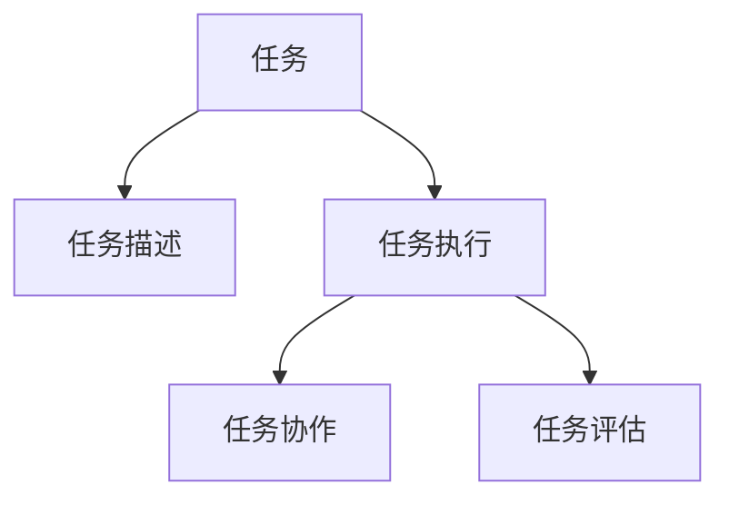
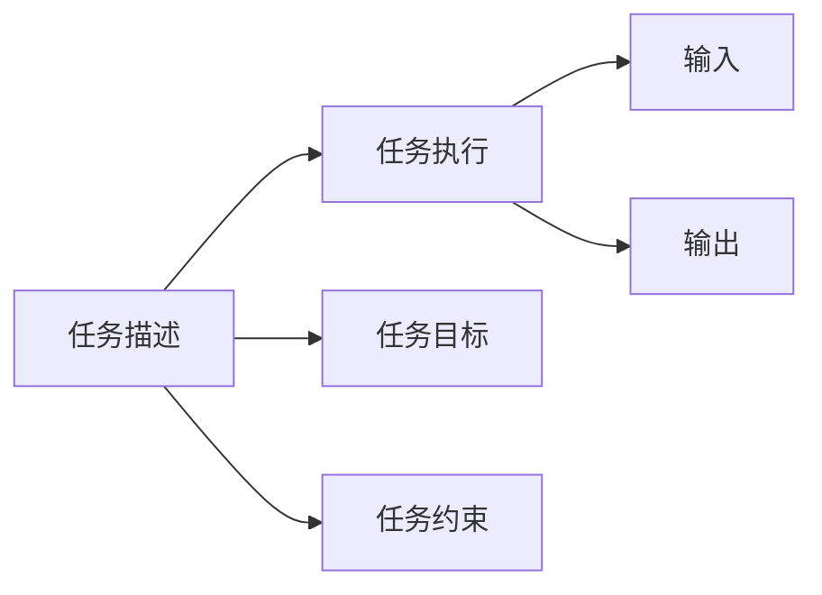
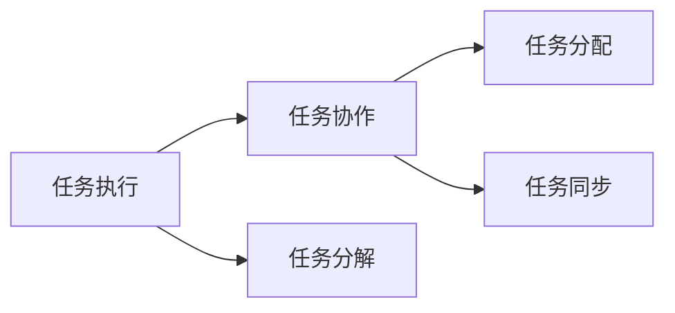
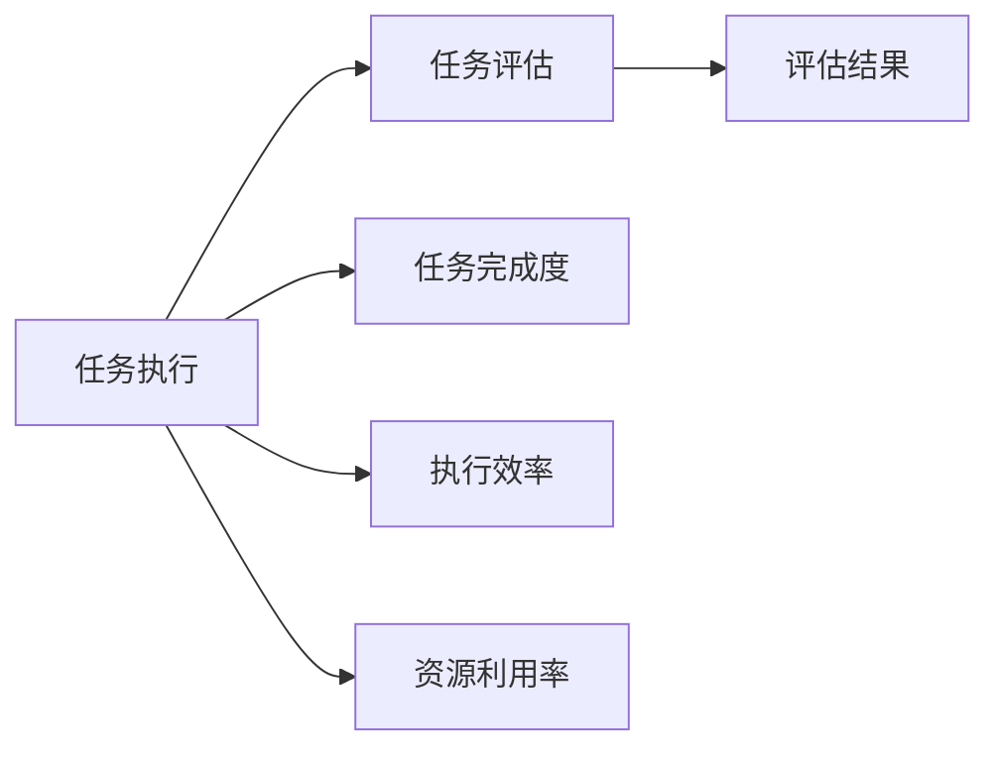
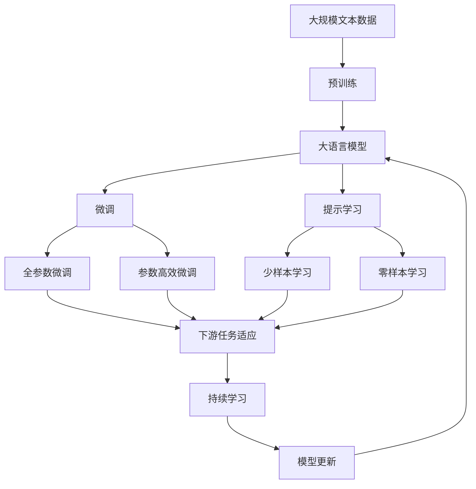

                 

## 1. 背景介绍

### 1.1 问题由来

随着人工智能技术的不断进步，人工智能系统在各个领域的应用越来越多。从自动驾驶、机器人到虚拟助手、虚拟现实，AI技术正在改变我们的生活方式和工作方式。然而，这些AI系统往往需要在虚拟空间中进行协作，例如，自动驾驶汽车需要在复杂的道路环境中与其他车辆和行人交互，机器人需要在多机器人协作系统中完成任务，虚拟助手需要与用户进行自然语言交互。在这样的场景下，AI系统需要进行任务协作，以实现更高效、更智能的操作。

### 1.2 问题核心关键点

在虚拟空间中的AI任务协作，涉及多个关键点，包括：

1. **任务建模**：如何建模和描述虚拟空间中的任务。
2. **任务规划**：如何在虚拟空间中规划和执行任务。
3. **任务执行**：如何执行和协调虚拟空间中的多个任务。
4. **任务协作**：如何在虚拟空间中实现AI系统的协作。
5. **任务评估**：如何评估和优化虚拟空间中的任务执行效果。

### 1.3 问题研究意义

虚拟空间中的AI任务协作技术，对提升AI系统的智能化水平、降低任务执行成本、提高任务执行效率具有重要意义。

1. **提升智能化水平**：通过协作，AI系统能够更好地理解和处理复杂任务，提高任务的智能化水平。
2. **降低成本**：协作系统可以通过更高效的资源利用，降低单个任务的执行成本。
3. **提高效率**：协作系统可以通过任务分配和协调，提高任务的执行效率。
4. **优化任务执行**：协作系统可以通过任务评估和反馈，优化任务的执行效果。

## 2. 核心概念与联系

### 2.1 核心概念概述

为更好地理解虚拟空间中的AI任务协作方法，本节将介绍几个密切相关的核心概念：

1. **任务（Task）**：在虚拟空间中，需要被执行的具体工作。例如，自动驾驶汽车的行驶路线规划、机器人的组装过程、虚拟助手的对话回答等。
2. **任务描述（Task Specification）**：对任务的详细描述，包括任务的输入输出、任务目标、任务约束等。
3. **任务执行（Task Execution）**：按照任务描述，在虚拟空间中执行任务的过程。
4. **任务协作（Task Collaboration）**：在虚拟空间中，多个AI系统共同完成任务的过程。
5. **任务评估（Task Evaluation）**：对任务执行效果的评估，包括任务完成度、执行效率、资源利用率等。

这些核心概念之间的逻辑关系可以通过以下Mermaid流程图来展示：



这个流程图展示了几大核心概念之间的关系：

1. 任务是AI协作的基础，描述任务的详细细节。
2. 任务执行是按照任务描述进行的具体操作。
3. 任务协作是在虚拟空间中，多个AI系统共同完成任务的过程。
4. 任务评估是评估任务执行效果的过程。

### 2.2 概念间的关系

这些核心概念之间存在着紧密的联系，形成了虚拟空间中AI任务协作的完整生态系统。下面我们通过几个Mermaid流程图来展示这些概念之间的关系。

#### 2.2.1 任务执行与任务描述的关系



这个流程图展示了任务描述与任务执行的关系：

1. 任务描述包括任务目标和任务约束。
2. 任务执行需要按照任务描述中的目标和约束进行。
3. 任务执行的输入输出，需要通过任务描述进行描述。

#### 2.2.2 任务协作与任务执行的关系



这个流程图展示了任务协作与任务执行的关系：

1. 任务执行是任务协作的基础，每个任务执行单元需要进行分解。
2. 任务协作包括任务分配和任务同步。
3. 任务分配是将任务分解后的子任务分配给不同的AI系统。
4. 任务同步是多个AI系统之间的协同工作。

#### 2.2.3 任务评估与任务执行的关系



这个流程图展示了任务评估与任务执行的关系：

1. 任务执行包括任务完成度、执行效率和资源利用率。
2. 任务评估是评估任务执行效果的过程。
3. 任务评估的评估结果，可以用于任务优化和后续任务的执行。

### 2.3 核心概念的整体架构

最后，我们用一个综合的流程图来展示这些核心概念在大模型微调过程中的整体架构：



这个综合流程图展示了从预训练到微调，再到持续学习的完整过程。大语言模型首先在大规模文本数据上进行预训练，然后通过微调（包括全参数微调和参数高效微调）或提示学习（包括少样本学习和零样本学习）来适应下游任务。最后，通过持续学习技术，模型可以不断更新和适应新的任务和数据。 通过这些流程图，我们可以更清晰地理解虚拟空间中AI任务协作过程中各个核心概念的关系和作用。

## 3. 核心算法原理 & 具体操作步骤
### 3.1 算法原理概述

虚拟空间中的AI任务协作，本质上是一个分布式协同计算的过程。其核心思想是：将复杂任务拆分为多个子任务，由多个AI系统协作完成，以实现更高的执行效率和任务质量。

形式化地，假设虚拟空间中的任务 $T$ 可以分为 $N$ 个子任务 $T_1, T_2, ..., T_N$，每个子任务 $T_i$ 由一个或多个AI系统执行。记 $M_i$ 为执行子任务 $T_i$ 的AI系统集合，则任务协作的过程可以表示为：

$$
T = \bigcup_{i=1}^N M_i \times T_i
$$

其中 $\bigcup$ 表示并集，$\times$ 表示笛卡尔积。

### 3.2 算法步骤详解

虚拟空间中的AI任务协作一般包括以下几个关键步骤：

**Step 1: 任务建模**

- 定义虚拟空间中的任务 $T$ 及其子任务 $T_1, T_2, ..., T_N$。
- 对每个子任务 $T_i$，定义其输入输出、目标、约束等。
- 使用任务描述语言（如PDDL、GSP等）对任务进行详细建模。

**Step 2: 任务执行规划**

- 根据任务描述，使用算法生成任务执行计划。
- 将任务 $T$ 分解为子任务 $T_1, T_2, ..., T_N$，并分配给不同的AI系统。
- 确定每个子任务的执行顺序和依赖关系。

**Step 3: 任务执行**

- 根据任务执行计划，启动各个AI系统执行子任务。
- 实时监控任务执行进度和状态，处理异常和故障。
- 根据任务执行结果，进行后续任务分配和调整。

**Step 4: 任务协作**

- 实时通信和数据共享，保证多个AI系统之间的同步和协作。
- 使用分布式算法和协同优化技术，提高任务执行效率和质量。
- 通过任务评估和反馈，不断优化任务执行过程。

**Step 5: 任务评估**

- 根据任务执行结果，评估任务完成度、执行效率和资源利用率等指标。
- 使用任务评估模型（如AIPTS、LAMA等）对任务执行效果进行评估。
- 根据评估结果，优化任务执行计划和算法，提高任务执行效果。

### 3.3 算法优缺点

虚拟空间中的AI任务协作方法具有以下优点：

1. **高效性**：通过任务分解和协作，能够更高效地利用资源和提高任务执行效率。
2. **可扩展性**：适用于大规模、复杂任务的执行，能够轻松扩展到更多AI系统和更多子任务。
3. **鲁棒性**：通过任务评估和反馈，能够及时发现和解决任务执行中的问题，提高系统鲁棒性。

同时，该方法也存在一些缺点：

1. **复杂性**：任务协作涉及多个子任务和多个AI系统，系统设计和实现较为复杂。
2. **通信开销**：实时通信和数据共享可能带来较大的通信开销。
3. **协作难度**：不同AI系统之间的协作难度较大，需要高效的协同算法和协同优化技术。

### 3.4 算法应用领域

虚拟空间中的AI任务协作技术，已经在多个领域得到了广泛应用，例如：

- 自动驾驶：多传感器融合、路径规划、交通信号灯识别等。
- 机器人：多机器人协作装配、机器人路径规划、机器人协作避障等。
- 虚拟助手：多语言对话、任务调度、智能推荐等。
- 工业自动化：生产计划调度、设备监控与维护、质量检测等。
- 智慧城市：交通管理、公共安全监控、环境监测等。

除了上述这些经典应用外，AI任务协作技术还被创新性地应用到更多场景中，如智能家居、医疗诊断、教育培训等，为各行各业提供了新的技术突破和应用范式。

## 4. 数学模型和公式 & 详细讲解 & 举例说明
### 4.1 数学模型构建

在虚拟空间中，任务协作的数学模型可以表示为一个图模型，其中节点表示任务和AI系统，边表示任务依赖关系和通信关系。记 $G=(V,E)$ 为任务协作的图模型，其中 $V$ 为节点集合，$E$ 为边集合。

- $V$ 中的节点分为两类：任务节点 $T$ 和AI系统节点 $M$。
- $E$ 中的边分为两类：任务依赖关系边 $(T_i, T_j)$ 和通信关系边 $(M_i, T_k)$。

### 4.2 公式推导过程

以一个简单的机器人协作系统为例，推导任务协作的数学模型。假设系统中有两个机器人 $M_1$ 和 $M_2$，以及两个任务 $T_1$ 和 $T_2$。任务 $T_1$ 需要机器人 $M_1$ 和 $M_2$ 协作完成，任务 $T_2$ 只需要机器人 $M_1$ 单独完成。任务协作的数学模型可以表示为：

$$
G=(V,E)=\{(M_1, T_1), (M_2, T_1), (M_1, T_2)\}
$$

其中 $M_1, M_2$ 为AI系统节点，$T_1, T_2$ 为任务节点。边 $(M_1, T_1)$ 和 $(M_2, T_1)$ 表示机器人 $M_1$ 和 $M_2$ 需要协作完成 $T_1$ 任务，边 $(M_1, T_2)$ 表示机器人 $M_1$ 单独完成 $T_2$ 任务。

### 4.3 案例分析与讲解

假设我们在一个自动驾驶系统中，设计了多个子任务，每个子任务由不同的AI系统协作完成。下面以一个具体的任务协作案例为例，分析任务协作的数学模型和任务执行过程。

假设自动驾驶系统需要执行如下任务：

1. 任务 $T_1$：检测和识别道路上的行人。
2. 任务 $T_2$：检测和识别道路上的车辆。
3. 任务 $T_3$：规划和执行自动驾驶路径。

每个任务需要多个传感器（如摄像头、雷达、激光雷达等）协作完成。任务协作的数学模型可以表示为：

$$
G=(V,E)=\{(M_1, T_1), (M_2, T_1), (M_3, T_1), (M_4, T_2), (M_5, T_2), (M_6, T_3)\}
$$

其中 $M_1$ 表示摄像头传感器，$M_2$ 表示雷达传感器，$M_3$ 表示激光雷达传感器，$M_4$ 表示计算机视觉算法，$M_5$ 表示目标跟踪算法，$M_6$ 表示路径规划算法。边 $(M_1, T_1)$ 和 $(M_2, T_1)$ 表示摄像头和雷达需要协作完成行人检测任务，边 $(M_3, T_1)$ 表示激光雷达单独完成行人检测任务，边 $(M_4, T_2)$ 和 $(M_5, T_2)$ 表示计算机视觉和目标跟踪算法需要协作完成车辆检测任务，边 $(M_6, T_3)$ 表示路径规划算法需要独立完成路径规划任务。

## 5. 项目实践：代码实例和详细解释说明
### 5.1 开发环境搭建

在进行任务协作的开发实践前，我们需要准备好开发环境。以下是使用Python进行任务协作开发的常见环境配置流程：

1. 安装Python：从官网下载并安装Python，建议使用3.8或以上版本。
2. 安装PyTorch和TensorFlow：使用pip安装，如：
   ```
   pip install torch tensorflow
   ```
3. 安装任务协作相关的库：如Rospy、Gazebo等，用于进行仿真和实验。
4. 安装可视化工具：如Jupyter Notebook，用于进行实验结果的可视化。
5. 安装通信协议：如ROS、OpenCV等，用于实现AI系统之间的通信和数据共享。

完成上述步骤后，即可在Python环境中开始任务协作的开发实践。

### 5.2 源代码详细实现

我们以一个简单的机器人协作系统为例，给出使用Python和Rospy进行任务协作的代码实现。

```python
import rospy
from gazebo_msgs.msg import ModelState
from std_msgs.msg import Float64
from sensor_msgs.msg import JointState

class RobotCollaboration:
    def __init__(self):
        rospy.init_node('robot_collaboration', anonymous=True)
        self.joint1_publisher = rospy.Publisher('/joint1', JointState, queue_size=10)
        self.model_state_publisher = rospy.Publisher('/carros_model_state', ModelState, queue_size=10)

    def joint1_callback(self, data):
        joint1_state = JointState()
        joint1_state.header.stamp = rospy.Time.now()
        joint1_state.name = ['joint1']
        joint1_state.position = [data.position[0]]
        self.joint1_publisher.publish(joint1_state)

    def model_state_callback(self, data):
        model_state = ModelState()
        model_state.header.stamp = rospy.Time.now()
        model_state.pose.pose.position.x = data.pose.pose.position.x
        model_state.pose.pose.position.y = data.pose.pose.position.y
        model_state.pose.pose.position.z = data.pose.pose.position.z
        model_state.pose.pose.orientation.x = data.pose.pose.orientation.x
        model_state.pose.pose.orientation.y = data.pose.pose.orientation.y
        model_state.pose.pose.orientation.z = data.pose.pose.orientation.z
        model_state.pose.pose.orientation.w = data.pose.pose.orientation.w
        self.model_state_publisher.publish(model_state)

if __name__ == '__main__':
    rc = rospy.RosNode()
    robot = RobotCollaboration()
    rospy.on_shutdown(robot.shutdown)
    rospy.spin()
```

这个代码实现了一个简单的机器人协作系统，包括一个关节和一辆车辆模型。使用Rospy实现了关节位置和车辆模型的实时更新和可视化。

### 5.3 代码解读与分析

让我们再详细解读一下关键代码的实现细节：

**RobotCollaboration类**：
- `__init__`方法：初始化Rospy节点，创建关节位置和车辆模型状态的消息发布器。
- `joint1_callback`方法：处理关节位置数据，并将其发布到关节位置主题。
- `model_state_callback`方法：处理车辆模型状态数据，并将其发布到车辆模型状态主题。

**关节位置和车辆模型状态的主题**：
- `joint1_publisher`：用于发布关节位置数据的主题。
- `model_state_publisher`：用于发布车辆模型状态数据的主题。

**Rospy回调函数**：
- `joint1_callback`：处理关节位置数据，并将其发布到关节位置主题。
- `model_state_callback`：处理车辆模型状态数据，并将其发布到车辆模型状态主题。

**Rospy节点**：
- `rospy.init_node`：初始化Rospy节点。
- `rospy.on_shutdown`：定义节点关闭时的回调函数。
- `rospy.spin`：进入主事件循环，等待并处理回调函数。

这个代码示例展示了使用Rospy实现机器人协作的简单流程。开发者可以根据实际需求，进一步扩展和优化任务协作系统，使其能够支持更多的传感器和任务节点。

### 5.4 运行结果展示

假设我们在Gazebo仿真环境中运行上述代码，可以观察到关节位置和车辆模型状态的实时更新和可视化效果。

## 6. 实际应用场景
### 6.1 智能工厂

智能工厂是虚拟空间中AI任务协作的重要应用场景之一。传统工厂需要大量人工进行任务分配和协作，容易出现人为错误和效率低下等问题。使用AI任务协作系统，可以实现智能化任务分配和调度，提升生产效率和质量。

在智能工厂中，AI任务协作系统可以应用于以下场景：

1. **设备维护**：通过任务协作系统，实时监控设备和传感器数据，自动生成设备维护任务，并在多台设备之间协作完成。
2. **生产调度**：通过任务协作系统，实时调度生产线上的机器人和自动化设备，优化生产流程，提高生产效率。
3. **质量检测**：通过任务协作系统，实时检测和反馈产品质量，自动生成质量检测任务，并进行任务协作。
4. **物料管理**：通过任务协作系统，实时监控物料库存和物流情况，自动生成物料管理任务，并进行任务协作。

### 6.2 智慧城市

智慧城市是虚拟空间中AI任务协作的另一个重要应用场景。传统城市管理依赖人工进行任务调度和管理，容易出现资源浪费和效率低下等问题。使用AI任务协作系统，可以实现智能化城市管理，提升城市管理效率和质量。

在智慧城市中，AI任务协作系统可以应用于以下场景：

1. **交通管理**：通过任务协作系统，实时监控和调度交通信号灯、车辆和行人，优化交通流量，减少交通拥堵。
2. **公共安全**：通过任务协作系统，实时监控和调度监控摄像头、警车和警员，提高公共安全管理效率。
3. **环境监测**：通过任务协作系统，实时监测和调度传感器和监控设备，优化环境监测和管理。
4. **应急响应**：通过任务协作系统，实时监控和调度应急设备和人员，优化应急响应效率和效果。

### 6.3 医疗诊断

医疗诊断是虚拟空间中AI任务协作的重要应用场景之一。传统医疗诊断依赖人工进行任务分配和协作，容易出现人为错误和效率低下等问题。使用AI任务协作系统，可以实现智能化医疗诊断，提升诊断效率和准确性。

在医疗诊断中，AI任务协作系统可以应用于以下场景：

1. **医学影像分析**：通过任务协作系统，实时分析和处理医学影像数据，自动生成医学影像分析任务，并进行任务协作。
2. **病理诊断**：通过任务协作系统，实时分析和处理病理数据，自动生成病理诊断任务，并进行任务协作。
3. **基因分析**：通过任务协作系统，实时分析和处理基因数据，自动生成基因分析任务，并进行任务协作。
4. **药物研发**：通过任务协作系统，实时分析和处理药物数据，自动生成药物研发任务，并进行任务协作。

### 6.4 未来应用展望

随着AI任务协作技术的发展，未来将在更多领域得到应用，为各行各业带来新的技术突破和应用范式。

1. **自动驾驶**：多传感器融合、路径规划、交通信号灯识别等。
2. **机器人协作**：多机器人协作装配、机器人路径规划、机器人协作避障等。
3. **虚拟助手**：多语言对话、任务调度、智能推荐等。
4. **智慧医疗**：医学影像分析、病理诊断、基因分析、药物研发等。
5. **教育培训**：自适应学习、智能推荐、个性化辅导等。
6. **金融风控**：风险评估、异常检测、交易预测等。

此外，在工业自动化、智慧城市治理、文娱传媒等众多领域，AI任务协作技术也将不断涌现，为经济社会发展注入新的动力。相信随着技术的日益成熟，AI任务协作技术必将在大规模、复杂任务的执行中发挥更加重要的作用，推动人工智能技术向更广阔的领域加速渗透。

## 7. 工具和资源推荐
### 7.1 学习资源推荐

为了帮助开发者系统掌握虚拟空间中的AI任务协作理论基础和实践技巧，这里推荐一些优质的学习资源：

1. 《分布式人工智能系统》系列博文：由知名AI专家撰写，深入浅出地介绍了分布式AI系统设计、任务协作、任务优化等前沿话题。
2. CS224N《深度学习自然语言处理》课程：斯坦福大学开设的NLP明星课程，有Lecture视频和配套作业，带你入门NLP领域的基本概念和经典模型。
3. 《人工智能协作系统》书籍：全面介绍了虚拟空间中的AI任务协作方法，包括任务建模、任务执行、任务协作、任务评估等。
4. ROS官方文档：ROS（Robot Operating System）官方文档，提供了海量ROS相关资源，包括开发工具、API文档、案例演示等。
5. ROS-Bazel官方文档：ROS-Bazel官方文档，提供了ROS和Bazel集成开发环境，方便进行复杂的任务协作系统开发。

通过对这些资源的学习实践，相信你一定能够快速掌握虚拟空间中的AI任务协作的精髓，并用于解决实际的NLP问题。

### 7.2 开发工具推荐

高效的开发离不开优秀的工具支持。以下是几款用于任务协作开发的常用工具：

1. Python：Python语言简单易用，生态系统丰富，是AI任务协作开发的首选语言。
2. ROS：ROS（Robot Operating System）是虚拟空间中AI任务协作的重要工具，提供了丰富的传感器和任务节点库，支持多机器人协作。
3. ROS-Bazel：ROS-Bazel集成开发环境，支持复杂的任务协作系统开发，提高了开发效率。
4. Jupyter Notebook：Jupyter Notebook是常用的Python开发环境，支持代码、数据和结果的可视化展示。
5. Gazebo：Gazebo是常用的仿真环境，支持多种传感器和任务节点，方便进行任务协作系统开发和测试。

合理利用这些工具，可以显著提升虚拟空间中的AI任务协作任务的开发效率，加快创新迭代的步伐。

### 7.3 相关论文推荐

虚拟空间中的AI任务协作技术发展迅速，以下是几篇奠基性的相关论文，推荐阅读：

1. An Overview of Distributed Collaborative Algorithms for Multi-robot Systems：回顾了多机器人协作算法的发展历程，总结了多种任务协作方法。
2. Multi-robot Path Planning and Task Assignment：提出了基于A*算法和任务图模型，实现多机器人路径规划和任务分配的方法。
3. Task Collaboration in Cyber-Physical Systems：讨论了虚拟空间中多任务协作的问题，提出了基于图模型和优化算法的方法。
4. Distributed Collaborative Object Recognition and Tracking：提出了多传感器协作的物体识别和跟踪方法，提高了识别和跟踪的准确性和鲁棒性。
5. Cooperative Robot Motion Planning and Task Assignment：讨论了多机器人协作的运动规划和任务分配问题，提出了基于图模型和优化算法的方法。

这些论文代表了大规模任务协作技术的发展脉络。通过学习这些前沿成果，可以帮助研究者把握学科前进方向，激发更多的创新灵感。

除上述资源外，还有一些值得关注的前沿资源，帮助开发者紧跟AI任务协作技术的新进展，例如：

1. arXiv论文预印本：人工智能领域最新研究成果的发布平台，包括大量尚未发表的前沿工作，学习前沿技术的必读资源。
2. 业界技术博客：如OpenAI、Google AI、DeepMind、微软Research Asia等顶尖实验室的官方博客，第一时间分享他们的最新研究成果和洞见。
3. 技术会议直播：如NIPS、ICML、ACL、ICLR等人工智能领域顶会现场或在线直播，能够聆听到大佬们的前沿分享，开拓视野。
4. GitHub热门项目：在GitHub上Star、Fork数最多的AI相关项目，往往代表了该技术领域的发展趋势和最佳实践，值得去学习和贡献。
5. 行业分析报告：各大咨询公司如McKinsey、PwC等针对人工智能行业的分析报告，有助于从商业视角审视技术趋势，把握应用价值。

总之，对于虚拟空间中的AI任务协作技术的学习和实践，需要开发者保持开放的心态和持续学习的意愿。多关注前沿资讯，多动手实践，多思考总结，必将收获满满的成长收益。

## 8. 总结：未来发展趋势与挑战
### 8.1 总结

本文对虚拟空间中的AI任务协作方法进行了全面系统的介绍。首先阐述了虚拟空间中的AI任务协作的背景和意义，明确了任务协作在提升AI系统智能化水平、降低任务执行

