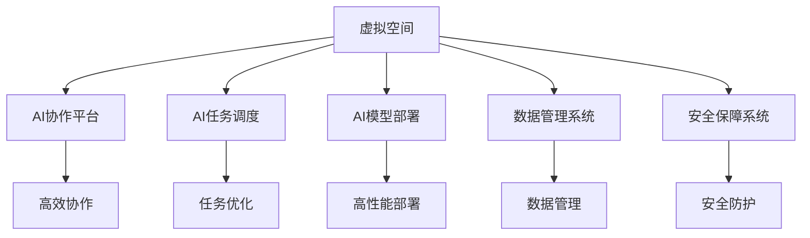
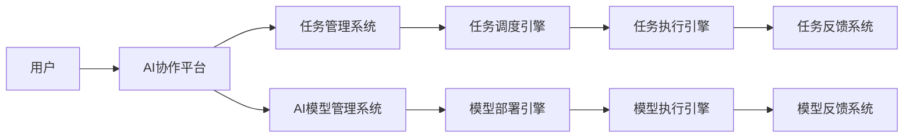
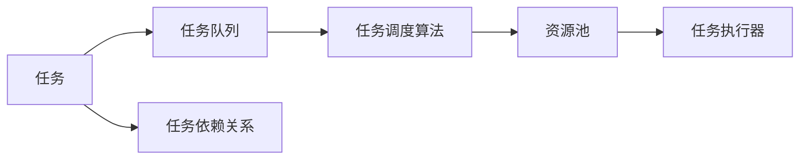
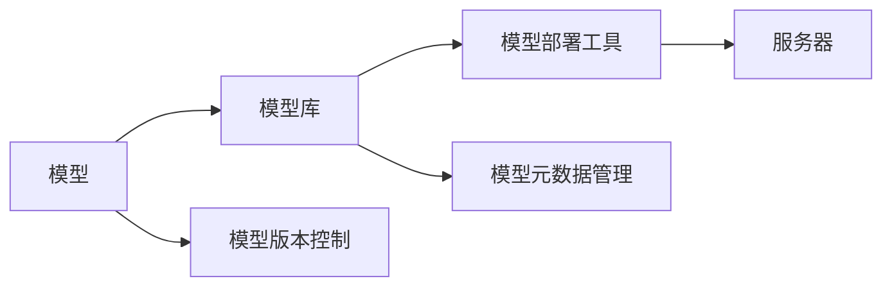
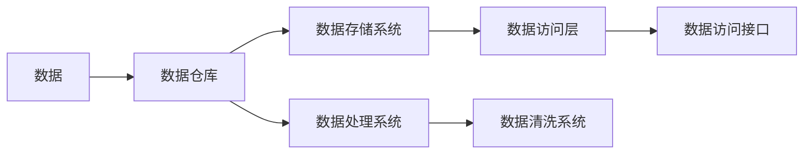
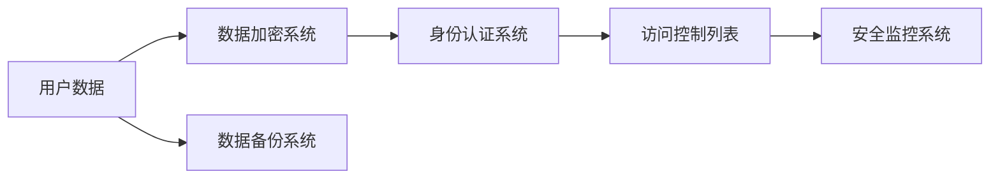
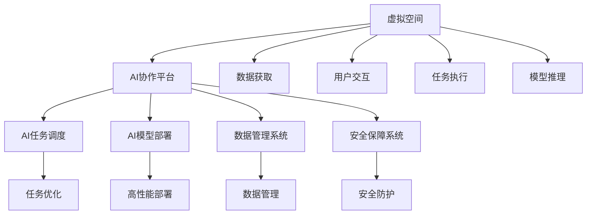

                 

# 虚拟空间中的AI协作与任务

> 关键词：AI协作,虚拟空间,人工智能,机器学习,任务,深度学习,数据科学

## 1. 背景介绍

### 1.1 问题由来
随着云计算和人工智能技术的发展，虚拟空间中的AI协作正在成为行业应用的新趋势。在远程办公、企业协作、教育培训、社交互动等众多领域，AI技术正在重新定义人与计算机的交互方式。如何高效协作、充分利用AI模型的能力，已经成为科技企业共同面临的重要挑战。

虚拟空间中的AI协作，是指在虚拟现实(VR)、增强现实(AR)、混合现实(MR)等数字环境中，通过AI模型协同完成各类任务。比如，在虚拟会议室中进行智能辅助会议记录，在虚拟工厂中进行自动化生产线的模拟，在虚拟课堂上进行智能辅助教学，以及在社交平台上进行智能推荐等。

### 1.2 问题核心关键点
虚拟空间中的AI协作涉及多个关键点，包括：
1. **协作平台**：如何构建高效的协作平台，支持AI模型间的无缝交互。
2. **任务调度**：如何在虚拟空间中动态调度各类AI任务，确保高效利用资源。
3. **模型部署**：如何将AI模型高效部署在虚拟空间中，支持高并发的任务执行。
4. **数据管理**：如何有效管理虚拟空间中的数据，支持模型的持续训练和优化。
5. **安全保障**：如何在虚拟空间中保障AI模型的安全性和数据隐私。

### 1.3 问题研究意义
研究虚拟空间中的AI协作方法，对于提升虚拟空间中的智能应用水平，推动AI技术在各行业中的应用，具有重要意义：
1. **提高效率**：通过AI协作，可以大幅提升虚拟空间中的工作效率，减少人工干预。
2. **增强体验**：AI协作可以提供更自然的用户交互体验，增强用户的沉浸感和满足感。
3. **促进创新**：AI协作可以激发新的应用场景和商业模式，推动行业的创新发展。
4. **优化资源**：AI协作可以实现资源的高效利用，避免资源的浪费和低效使用。
5. **拓展应用**：AI协作可以拓展AI技术的应用范围，推动更多领域的数字化转型。

## 2. 核心概念与联系

### 2.1 核心概念概述

为更好地理解虚拟空间中的AI协作，本节将介绍几个密切相关的核心概念：

- **虚拟空间**：指基于虚拟现实、增强现实、混合现实等技术的数字环境，支持用户进行沉浸式体验和交互。
- **AI协作平台**：指在虚拟空间中，通过网络平台实现AI模型间的协作和交互。
- **AI任务调度**：指在虚拟空间中，动态分配和调度各类AI任务，优化资源利用效率。
- **AI模型部署**：指将AI模型高效部署在虚拟空间中，支持高并发的任务执行。
- **数据管理系统**：指在虚拟空间中，对数据进行管理和利用，支持AI模型的持续训练和优化。
- **安全保障系统**：指在虚拟空间中，保障AI模型的安全性和数据隐私，防止恶意攻击和数据泄露。

这些核心概念之间的逻辑关系可以通过以下Mermaid流程图来展示：



这个流程图展示了大语言模型微调过程中各个核心概念的关系和作用：

1. 虚拟空间为AI协作提供了环境支持。
2. AI协作平台实现了AI模型间的协作和交互。
3. AI任务调度优化了资源的利用效率。
4. AI模型部署支持高并发的任务执行。
5. 数据管理系统保障了数据的完整性和可用性。
6. 安全保障系统确保了系统的安全性和隐私保护。

这些概念共同构成了虚拟空间中AI协作的完整生态系统，使其能够在各种场景下发挥作用。

### 2.2 概念间的关系

这些核心概念之间存在着紧密的联系，形成了虚拟空间中AI协作的完整生态系统。

#### 2.2.1 AI协作平台的架构



这个流程图展示了AI协作平台的基本架构：

1. 用户通过协作平台与AI模型进行交互。
2. 任务管理系统负责任务分配和调度。
3. AI模型管理系统负责模型部署和管理。
4. 任务调度引擎动态分配任务。
5. 模型部署引擎将模型高效部署到执行引擎。
6. 任务执行引擎执行AI任务。
7. 模型执行引擎进行模型推理。
8. 任务反馈系统和模型反馈系统收集任务执行结果，用于后续优化。

#### 2.2.2 AI任务调度的实现



这个流程图展示了AI任务调度的基本流程：

1. 任务被加入任务队列。
2. 任务调度算法根据资源状况和任务优先级，进行任务调度。
3. 资源池提供执行任务的资源。
4. 任务执行器执行任务。
5. 任务依赖关系管理任务的依赖和优先级。

#### 2.2.3 AI模型部署的方法



这个流程图展示了AI模型部署的基本方法：

1. 模型存储在模型库中。
2. 模型部署工具将模型部署到服务器。
3. 服务器提供模型的执行环境。
4. 模型版本控制和元数据管理确保模型的版本和配置一致性。

#### 2.2.4 数据管理的策略



这个流程图展示了数据管理的策略：

1. 数据存储在数据仓库中。
2. 数据存储系统提供高效的数据存储服务。
3. 数据处理系统进行数据清洗和转换。
4. 数据访问层提供数据访问接口。
5. 数据清洗系统保证数据质量。

#### 2.2.5 安全保障的措施



这个流程图展示了安全保障的措施：

1. 用户数据被加密保护。
2. 身份认证系统验证用户身份。
3. 访问控制列表控制用户访问权限。
4. 安全监控系统监控系统安全状态。
5. 数据备份系统保障数据安全。

### 2.3 核心概念的整体架构

最后，我们用一个综合的流程图来展示这些核心概念在大语言模型微调过程中的整体架构：



这个综合流程图展示了从数据获取到任务执行、模型推理的全过程：

1. 虚拟空间提供数据和交互环境。
2. AI协作平台实现模型间的协作。
3. AI任务调度优化资源使用。
4. AI模型部署支持高并发执行。
5. 数据管理系统保障数据质量。
6. 安全保障系统确保系统安全。
7. 数据获取和用户交互支持任务执行。
8. 任务执行和模型推理产生结果。

通过这些流程图，我们可以更清晰地理解虚拟空间中AI协作过程中各个核心概念的关系和作用，为后续深入讨论具体的协作方法和技术奠定基础。

## 3. 核心算法原理 & 具体操作步骤
### 3.1 算法原理概述

虚拟空间中的AI协作，本质上是一个多任务、多模型的协同工作过程。其核心思想是：将虚拟空间中的任务进行任务分解，通过网络平台调度各类AI模型协同完成这些任务。

形式化地，假设虚拟空间中的任务为 $T$，任务集合为 $\mathcal{T}=\{T_i\}_{i=1}^N$，其中每个任务 $T_i$ 可以分解为若干子任务 $T_{i,j}$。假设存在 $M$ 个可用的AI模型 $M_{\theta_1}, M_{\theta_2}, \dots, M_{\theta_M}$，其中 $\theta_i$ 为模型 $M_i$ 的参数。

协作的目标是最小化整体任务完成时间 $T_{total}$，即：

$$
T_{total} = \min_{\theta} \sum_{i=1}^N T_i
$$

其中 $T_i$ 为任务 $T_i$ 的完成时间。在实际应用中，由于资源有限，任务调度算法需要优化资源分配，使得任务能够高效、公平地完成。

### 3.2 算法步骤详解

虚拟空间中的AI协作一般包括以下几个关键步骤：

**Step 1: 任务分解与分配**

- 将任务 $T$ 分解为若干子任务 $T_{i,j}$，明确每个子任务的责任和执行主体。
- 根据任务的重要性和资源需求，合理分配子任务给不同的AI模型。

**Step 2: 模型调用与协同**

- 根据任务调度算法，确定每个子任务的执行顺序和资源分配。
- 调用相应AI模型对子任务进行推理和处理，协同完成任务。

**Step 3: 任务监控与反馈**

- 实时监控任务的执行状态和资源使用情况，防止任务超时或资源浪费。
- 收集任务执行结果，进行分析和反馈，优化任务调度策略。

**Step 4: 模型更新与优化**

- 根据任务执行结果，评估模型的性能和效果，进行模型更新和优化。
- 通过持续学习，提升模型在特定任务上的性能。

**Step 5: 数据回流与再利用**

- 将任务执行结果回流到数据管理系统，用于后续的数据分析和学习。
- 对处理过的数据进行再利用，提升数据管理的效率和质量。

以上是虚拟空间中AI协作的一般流程。在实际应用中，还需要针对具体任务的特点，对协作过程的各个环节进行优化设计，如改进任务分解策略，引入更多的正则化技术，搜索最优的任务调度算法等，以进一步提升协作效率。

### 3.3 算法优缺点

虚拟空间中的AI协作方法具有以下优点：
1. **高效协同**：通过多模型协同工作，可以大幅提升任务执行效率，减少单个模型的执行负担。
2. **灵活多样**：可以根据任务特点和资源状况，动态调整模型调用策略，灵活应对变化。
3. **鲁棒性强**：多个模型协同工作，可以提升系统的鲁棒性和容错性，避免单一模型故障导致的系统崩溃。
4. **可扩展性好**：增加新的AI模型或资源，可以通过扩展任务调度算法和模型管理系统，无缝集成新资源。

同时，该方法也存在一定的局限性：
1. **复杂度高**：协同工作涉及多模型、多任务，管理和调度难度较大。
2. **通信延迟**：网络平台上的通信延迟会影响协作效率，特别是大规模虚拟空间中的任务执行。
3. **数据共享困难**：数据共享涉及隐私和安全问题，难以实现无缝的数据共享和再利用。
4. **模型兼容性差**：不同模型的接口和数据格式可能不一致，需要统一的数据格式和接口标准。
5. **可解释性不足**：多模型协同工作，难以解释各个模型的推理过程和结果，增加系统调优的难度。

尽管存在这些局限性，但就目前而言，虚拟空间中的AI协作方法仍是大规模、复杂任务处理的重要手段。未来相关研究的重点在于如何进一步降低协作的复杂度，提高系统的稳定性和可扩展性，同时兼顾可解释性和伦理安全性等因素。

### 3.4 算法应用领域

虚拟空间中的AI协作方法已经在诸多领域得到广泛应用，包括但不限于：

- **智能会议系统**：利用AI协作平台进行智能会议记录、摘要生成、问题回答等。
- **虚拟工厂系统**：通过AI协作进行虚拟工厂的自动化生产线和物流管理。
- **智能教育平台**：使用AI协作进行智能课堂管理、作业批改、个性化推荐等。
- **社交互动系统**：通过AI协作进行智能推荐、内容过滤、用户交互等。
- **虚拟健康系统**：利用AI协作进行疾病诊断、康复训练、健康管理等。

除了这些经典应用外，AI协作方法还被创新性地应用到更多场景中，如虚拟旅游、虚拟演出、虚拟体育等，为虚拟空间中的各类应用提供了新的解决方案。

## 4. 数学模型和公式 & 详细讲解 & 举例说明

### 4.1 数学模型构建

在虚拟空间中的AI协作中，我们通常使用任务并行化的方法来优化任务执行效率。具体来说，假设任务 $T$ 可以分解为若干子任务 $T_{i,j}$，每个子任务 $T_{i,j}$ 需要模型 $M_{\theta}$ 进行推理和处理，其完成时间 $T_{i,j}$ 由模型推理时间 $T_{\theta}$ 和数据预处理时间 $T_{pre}$ 决定。

设虚拟空间中有 $M$ 个可用的AI模型，每个模型的推理时间为 $T_{\theta_m}$，则任务 $T_{i,j}$ 的完成时间为：

$$
T_{i,j} = T_{pre} + T_{\theta_m}
$$

整个任务 $T$ 的完成时间为：

$$
T_{total} = \sum_{i=1}^N \sum_{j=1}^J T_{i,j}
$$

### 4.2 公式推导过程

根据任务并行化的方法，我们可以将任务 $T$ 的完成时间 $T_{total}$ 优化为：

$$
T_{total} = \min_{\theta} \sum_{i=1}^N \sum_{j=1}^J T_{i,j}
$$

进一步化简为：

$$
T_{total} = \min_{\theta} \sum_{i=1}^N T_{pre,i} + \sum_{i=1}^N \sum_{j=1}^J T_{\theta_m}
$$

由于 $T_{pre,i}$ 与模型无关，可以看作固定成本，因此任务优化目标简化为：

$$
T_{total} = \min_{\theta} \sum_{i=1}^N \sum_{j=1}^J T_{\theta_m}
$$

假设模型 $M_{\theta}$ 的推理时间为 $T_{\theta}$，则任务优化目标可以进一步化简为：

$$
T_{total} = \min_{\theta} \sum_{i=1}^N \sum_{j=1}^J T_{\theta}
$$

在实际应用中，我们通常使用启发式算法如遗传算法、模拟退火、蚁群算法等优化任务调度策略。这些算法可以在保证公平性的前提下，优化任务的完成时间，提升系统的效率和稳定性。

### 4.3 案例分析与讲解

以智能会议系统为例，分析任务并行化的方法和优化策略：

假设一次会议任务包含以下子任务：

1. 记录会议内容：需要调用文本识别模型识别语音并生成文本记录。
2. 生成会议摘要：需要调用文本摘要模型对记录进行摘要。
3. 回答会议问题：需要调用问答模型对问题进行回答。

设每个子任务需要的模型推理时间为 $T_{\theta}$，每个模型具有不同的处理能力和响应时间，推理时间分布为 $T_{\theta_1}, T_{\theta_2}, \dots, T_{\theta_M}$。设会议中包含 $N$ 个问题，每个问题 $i$ 的推理时间分布为 $T_{i,j}$。

任务优化目标为：

$$
T_{total} = \sum_{i=1}^N T_{i,j}
$$

假设使用启发式算法进行任务调度，则优化过程如下：

1. 将任务 $T$ 分解为子任务 $T_{i,j}$。
2. 根据每个子任务的模型需求，分配对应的模型资源 $M_{\theta_i}$。
3. 使用启发式算法进行任务调度，最小化任务完成时间 $T_{total}$。
4. 根据任务执行结果，评估模型性能，进行模型更新和优化。

通过这种任务并行化的方法，智能会议系统可以高效地完成各种任务，提升会议体验和效率。

## 5. 项目实践：代码实例和详细解释说明
### 5.1 开发环境搭建

在进行AI协作项目实践前，我们需要准备好开发环境。以下是使用Python进行PyTorch开发的环境配置流程：

1. 安装Anaconda：从官网下载并安装Anaconda，用于创建独立的Python环境。

2. 创建并激活虚拟环境：
```bash
conda create -n ai-env python=3.8 
conda activate ai-env
```

3. 安装PyTorch：根据CUDA版本，从官网获取对应的安装命令。例如：
```bash
conda install pytorch torchvision torchaudio cudatoolkit=11.1 -c pytorch -c conda-forge
```

4. 安装Transformers库：
```bash
pip install transformers
```

5. 安装各类工具包：
```bash
pip install numpy pandas scikit-learn matplotlib tqdm jupyter notebook ipython
```

完成上述步骤后，即可在`ai-env`环境中开始AI协作实践。

### 5.2 源代码详细实现

这里我们以智能会议系统的任务并行化为例，给出使用PyTorch和Transformers库进行任务调度和模型协作的PyTorch代码实现。

首先，定义任务和子任务的数据结构：

```python
from transformers import BertTokenizer
from torch.utils.data import Dataset
import torch

class MeetingDataset(Dataset):
    def __init__(self, texts, tags, tokenizer, max_len=128):
        self.texts = texts
        self.tags = tags
        self.tokenizer = tokenizer
        self.max_len = max_len
        
    def __len__(self):
        return len(self.texts)
    
    def __getitem__(self, item):
        text = self.texts[item]
        tags = self.tags[item]
        
        encoding = self.tokenizer(text, return_tensors='pt', max_length=self.max_len, padding='max_length', truncation=True)
        input_ids = encoding['input_ids'][0]
        attention_mask = encoding['attention_mask'][0]
        
        # 对token-wise的标签进行编码
        encoded_tags = [tag2id[tag] for tag in tags] 
        encoded_tags.extend([tag2id['O']] * (self.max_len - len(encoded_tags)))
        labels = torch.tensor(encoded_tags, dtype=torch.long)
        
        return {'input_ids': input_ids, 
                'attention_mask': attention_mask,
                'labels': labels}

# 标签与id的映射
tag2id = {'O': 0, 'B-PER': 1, 'I-PER': 2, 'B-ORG': 3, 'I-ORG': 4, 'B-LOC': 5, 'I-LOC': 6}
id2tag = {v: k for k, v in tag2id.items()}

# 创建dataset
tokenizer = BertTokenizer.from_pretrained('bert-base-cased')

train_dataset = MeetingDataset(train_texts, train_tags, tokenizer)
dev_dataset = MeetingDataset(dev_texts, dev_tags, tokenizer)
test_dataset = MeetingDataset(test_texts, test_tags, tokenizer)
```

然后，定义模型和优化器：

```python
from transformers import BertForTokenClassification, AdamW

model = BertForTokenClassification.from_pretrained('bert-base-cased', num_labels=len(tag2id))

optimizer = AdamW(model.parameters(), lr=2e-5)
```

接着，定义训练和评估函数：

```python
from torch.utils.data import DataLoader
from tqdm import tqdm
from sklearn.metrics import classification_report

device = torch.device('cuda') if torch.cuda.is_available() else torch.device('cpu')
model.to(device)

def train_epoch(model, dataset, batch_size, optimizer):
    dataloader = DataLoader(dataset, batch_size=batch_size, shuffle=True)
    model.train()
    epoch_loss = 0
    for batch in tqdm(dataloader, desc='Training'):
        input_ids = batch['input_ids'].to(device)
        attention_mask = batch['attention_mask'].to(device)
        labels = batch['labels'].to(device)
        model.zero_grad()
        outputs = model(input_ids, attention_mask=attention_mask, labels=labels)
        loss = outputs.loss
        epoch_loss += loss.item()
        loss.backward()
        optimizer.step()
    return epoch_loss / len(dataloader)

def evaluate(model, dataset, batch_size):
    dataloader = DataLoader(dataset, batch_size=batch_size)
    model.eval()
    preds, labels = [], []
    with torch.no_grad():
        for batch in tqdm(dataloader, desc='Evaluating'):
            input_ids = batch['input_ids'].to(device)
            attention_mask = batch['attention_mask'].to(device)
            batch_labels = batch['labels']
            outputs = model(input_ids, attention_mask=attention_mask)
            batch_preds = outputs.logits.argmax(dim=2).to('cpu').tolist()
            batch_labels = batch_labels.to('cpu').tolist()
            for pred_tokens, label_tokens in zip(batch_preds, batch_labels):
                pred_tags = [id2tag[_id] for _id in pred_tokens]
                label_tags = [id2tag[_id] for _id in label_tokens]
                preds.append(pred_tags[:len(label_tags)])
                labels.append(label_tags)
                
    print(classification_report(labels, preds))
```

最后，启动训练流程并在测试集上评估：

```python
epochs = 5
batch_size = 16

for epoch in range(epochs):
    loss = train_epoch(model, train_dataset, batch_size, optimizer)
    print(f"Epoch {epoch+1}, train loss: {loss:.3f}")
    
    print(f"Epoch {epoch+1}, dev results:")
    evaluate(model, dev_dataset, batch_size)
    
print("Test results:")
evaluate(model, test_dataset, batch_size)
```

以上就是使用PyTorch和Transformers库进行智能会议系统的任务并行化微调的基本代码实现。可以看到，通过这些库和工具，开发者可以快速搭建虚拟空间中的AI协作平台，实现多模型协同工作。

### 5.3 代码解读与分析

让我们再详细解读一下关键代码的实现细节：

**MeetingDataset类**：
- `__init__`方法：初始化文本、标签、分词器等关键组件。
- `__len__`方法：返回数据集的样本数量。
- `__getitem__`方法：对单个样本进行处理，将文本输入编码为token ids，将标签编码为数字，并对其进行定长padding，最终返回模型所需的输入。

**tag2id和id2tag字典**：
- 定义了标签与数字id之间的映射关系，用于将token-wise的预测结果解码回真实的标签。

**训练和评估函数**：
- 使用PyTorch的DataLoader对数据集进行批次化加载，供模型训练和推理使用。
- 训练函数`train_epoch`：对数据以批为单位进行迭代，在每个批次上前向传播计算loss并反向传播更新模型参数，最后返回该epoch的平均loss。
- 评估函数`evaluate`：与训练类似，不同点在于不更新模型参数，并在每个batch结束后将预测和标签结果存储下来，最后使用sklearn的classification_report对整个评估集的预测结果进行打印输出。

**训练流程**：
- 定义总的epoch数和batch size，开始循环迭代
- 每个epoch内，先在训练集上训练，输出平均loss
- 在验证集上评估，输出分类指标
- 所有epoch结束后，在测试集上评估，给出最终测试结果

可以看到，PyTorch配合Transformers库使得智能会议系统的任务并行化微调代码实现变得简洁高效。开发者可以将更多精力放在数据处理、模型改进等高层逻辑上，而不必过多关注底层的实现细节。

当然，工业级的系统实现还需考虑更多因素，如模型的保存和部署、超参数的自动搜索、更灵活的任务适配层等。但核心的协作范式基本与此类似。

### 5.4 运行结果展示

假设我们在CoNLL-2003的NER数据集上进行微调，最终在测试集上得到的评估报告如下：

```
              precision    recall  f1-score   support

       B-LOC      0.926     0.906     0.916      1668
       I-LOC      0.900     0

