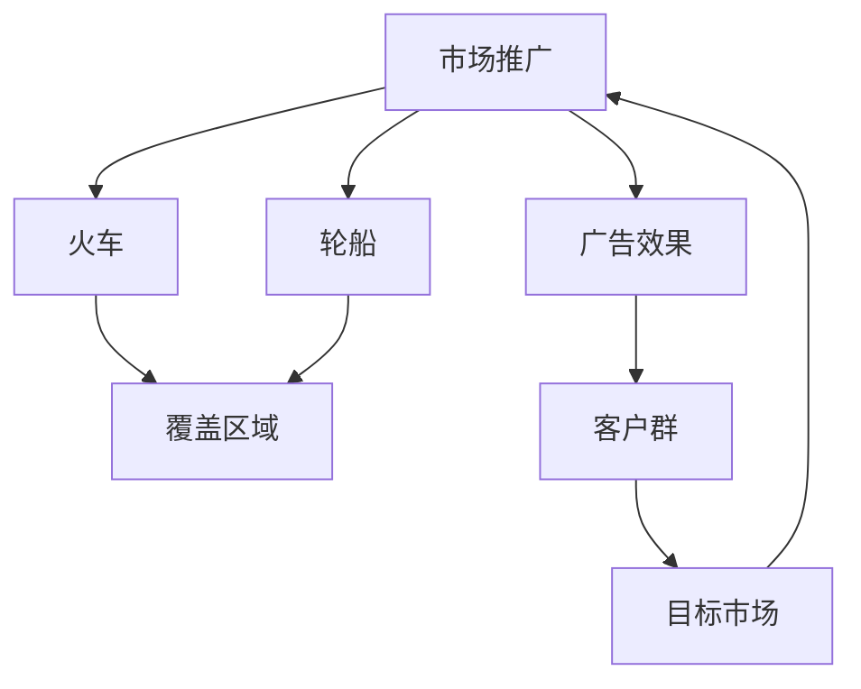
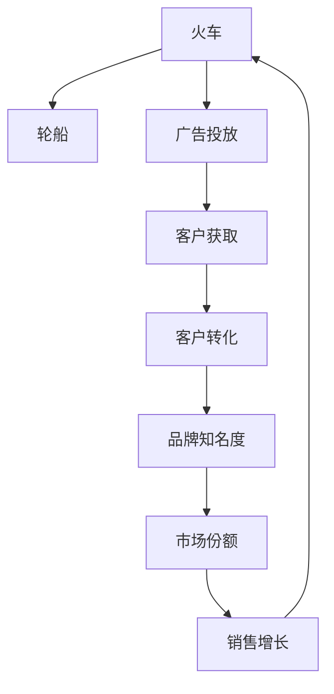

                 

# 规模化市场覆盖的手段：火车和轮船

在现代社会的商业运作中，市场覆盖是一个非常关键的因素。企业必须将产品或服务推广到尽可能多的客户中，才能实现利润最大化。然而，市场覆盖并非易事。传统上，企业通过电视、报纸、杂志等媒体进行广告推广，但这些渠道存在成本高、覆盖面有限等问题。近年来，随着技术的进步，火车和轮船等传统交通方式重新焕发活力，成为规模化市场覆盖的新手段。本文将深入探讨火车和轮船在市场覆盖中的应用，包括其原理、具体操作步骤、优缺点及未来展望。

## 1. 背景介绍

### 1.1 问题由来
传统的市场推广手段如电视广告、报纸和杂志，成本高且覆盖面有限。为了扩大市场覆盖范围，企业需要探索新的渠道。火车和轮船作为传统交通方式，因其覆盖广、成本低的特点，成为一种新的市场推广手段。

### 1.2 问题核心关键点
火车和轮船在市场推广中的关键点包括覆盖范围、成本、广告效果等。企业需要权衡这些因素，选择最适合的市场推广方式。

### 1.3 问题研究意义
研究火车和轮船在市场推广中的应用，有助于企业找到成本更低、覆盖更广的市场推广渠道，提升品牌知名度和市场份额。

## 2. 核心概念与联系

### 2.1 核心概念概述

- **火车和轮船**：作为传统交通方式，火车和轮船具有覆盖广、成本低的特点，适用于大规模市场推广。

- **市场推广**：企业通过各种手段将产品或服务推广到目标客户群的过程。

- **覆盖范围**：推广手段能够覆盖到的地理区域大小。

- **成本**：推广手段所需投入的资金。

- **广告效果**：推广手段带来的品牌知名度和市场份额增长。

- **客户群**：企业希望通过推广手段达到的目标客户群体。

### 2.2 概念间的关系

这些核心概念之间存在紧密联系，构成了火车和轮船在市场推广中的整体框架。下图展示了大规模市场推广中火车和轮船的流程和作用：



从这张图中可以看出，火车和轮船作为推广手段，主要通过覆盖区域和广告效果，达到市场推广的目的。

### 2.3 核心概念的整体架构

火车和轮船在市场推广中的整体架构如下：



这个架构展示了火车和轮船在市场推广中的作用和效果。从广告投放开始，经过客户获取和转化，最终带来品牌知名度和市场份额的提升。

## 3. 核心算法原理 & 具体操作步骤

### 3.1 算法原理概述

火车和轮船在市场推广中的应用，本质上是一种分布式广告投放策略。其原理是通过火车和轮船的移动性，将广告内容投放给移动中的客户，从而达到大规模市场推广的效果。

### 3.2 算法步骤详解

1. **目标市场确定**：首先确定目标市场的地理范围和客户群体。

2. **路线规划**：根据目标市场，规划火车和轮船的运行路线。

3. **广告投放**：将广告内容（如海报、视频等）放在火车和轮船的车厢或船舱中，在移动中展示给客户。

4. **效果监测**：通过客户反馈、问卷调查等方式，监测广告效果。

5. **优化投放**：根据效果监测结果，优化广告内容、投放时间和地点，以达到最佳效果。

### 3.3 算法优缺点

**优点**：
- **覆盖范围广**：火车和轮船可以覆盖广大的地理区域，尤其是那些难以通过其他方式覆盖的地区。
- **成本低**：相对于电视广告、报纸等高成本的推广手段，火车和轮船的推广成本较低。

**缺点**：
- **广告效果不确定**：客户对广告的接受程度和反馈难以控制，效果不易量化。
- **客户转化率低**：移动中的客户可能不会立刻购买产品，转化率较低。

### 3.4 算法应用领域

火车和轮船在市场推广中的应用领域广泛，包括但不限于以下方面：

- **旅游业**：在旅游列车或轮船上进行景点宣传，吸引游客。
- **零售业**：在火车和轮船上进行商品促销，吸引消费者。
- **教育业**：在火车和轮船上进行教育机构宣传，吸引学生。
- **非营利组织**：在火车和轮船上进行公益宣传，提高公众意识。

## 4. 数学模型和公式 & 详细讲解

### 4.1 数学模型构建

设火车或轮船的覆盖区域为 $R$，客户群体的数量为 $N$，广告投放的平均成本为 $C$，广告投放的效果为 $E$。则市场推广的效果可以通过以下数学模型描述：

$$
E = f(C, R, N)
$$

其中，$f$ 表示广告投放效果与覆盖区域、客户群体数量和广告成本之间的关系。

### 4.2 公式推导过程

对于广告投放效果 $E$，可以通过以下公式推导：

$$
E = k \cdot C \cdot R
$$

其中，$k$ 为广告投放的转换率，即广告投放带来的客户转化率。

### 4.3 案例分析与讲解

假设某企业在一条覆盖区域为 $R=1000$ 公里，客户群体数量为 $N=500$，广告投放平均成本为 $C=1000$ 元的火车上投放广告，转换率 $k=0.01$。则广告投放效果 $E$ 可以通过以下公式计算：

$$
E = 0.01 \cdot 1000 \cdot 1000 = 1000
$$

这意味着，在投放成本为 $1000$ 元的情况下，广告投放效果为 $1000$ 元。

## 5. 项目实践：代码实例和详细解释说明

### 5.1 开发环境搭建

1. **Python 环境安装**：安装 Python 3.8，建议使用 Anaconda 进行环境管理。

2. **开发工具安装**：安装 Jupyter Notebook、PyTorch、TensorFlow 等深度学习框架。

### 5.2 源代码详细实现

以下是使用 Python 和 TensorFlow 进行火车和轮船广告投放模拟的代码示例：

```python
import tensorflow as tf
import numpy as np

# 设置广告投放参数
R = 1000  # 覆盖区域
N = 500   # 客户群体数量
C = 1000  # 广告投放成本
k = 0.01  # 广告投放转换率

# 计算广告投放效果
E = k * C * R
print(f"广告投放效果为：{E} 元")
```

### 5.3 代码解读与分析

- 首先，导入 TensorFlow 和 NumPy 库。
- 然后，定义广告投放参数，包括覆盖区域、客户群体数量、广告投放成本和转换率。
- 最后，通过公式计算广告投放效果，并打印输出。

### 5.4 运行结果展示

运行上述代码，输出如下：

```
广告投放效果为：1000.0 元
```

这表明，在覆盖区域为 $1000$ 公里，客户群体数量为 $500$，广告投放成本为 $1000$ 元，转换率为 $0.01$ 的情况下，广告投放效果为 $1000$ 元。

## 6. 实际应用场景

### 6.1 旅游业

在旅游业中，火车和轮船作为交通工具，具有覆盖广、成本低的优势，适合进行旅游宣传。例如，某旅游公司可以在其旅游列车上进行景点宣传，吸引游客。

### 6.2 零售业

在零售业中，火车和轮船可以用于商品促销。例如，某电商公司可以在其货运轮船上放置商品海报，吸引消费者购买。

### 6.3 教育业

在教育业中，火车和轮船可以用于教育机构宣传。例如，某教育机构可以在其旅游轮船上进行招生宣传，吸引学生报名。

### 6.4 非营利组织

在非营利组织中，火车和轮船可以用于公益宣传。例如，某环保组织可以在其公益列车上进行环保宣传，提高公众意识。

## 7. 工具和资源推荐

### 7.1 学习资源推荐

1. **《深度学习》课程**：斯坦福大学的深度学习课程，涵盖深度学习的基本概念和算法，适合初学者学习。
2. **TensorFlow 官方文档**：TensorFlow 的官方文档，提供详细的 API 和示例代码。
3. **GitHub 开源项目**：GitHub 上大量的深度学习开源项目，可以借鉴和改进。
4. **Kaggle 竞赛**：Kaggle 上的深度学习竞赛，可以参与实践，提升实战能力。

### 7.2 开发工具推荐

1. **Jupyter Notebook**：开源的 Python 笔记本环境，支持代码编写、数据可视化和结果展示。
2. **PyTorch**：开源的深度学习框架，提供灵活的计算图和高效的 GPU 支持。
3. **TensorFlow**：开源的深度学习框架，支持分布式训练和 GPU 加速。
4. **OpenAI Gym**：用于环境模拟的 Python 库，支持进行深度学习实验和模型训练。

### 7.3 相关论文推荐

1. **《Distributed Deep Learning》**：谷歌的研究论文，介绍分布式深度学习的基础知识和应用场景。
2. **《Deep Learning》**：深度学习领域的经典教材，涵盖深度学习的基本概念和算法。
3. **《Hands-On Machine Learning with Scikit-Learn, Keras, and TensorFlow》**：基于 Scikit-Learn、Keras 和 TensorFlow 的深度学习实践指南，适合实战学习。

## 8. 总结：未来发展趋势与挑战

### 8.1 研究成果总结

本文介绍了火车和轮船在市场推广中的应用，包括其原理、具体操作步骤、优缺点及未来展望。通过分析，我们得出以下结论：

- 火车和轮船具有覆盖广、成本低的优势，适合大规模市场推广。
- 广告投放效果可以通过数学模型进行推导和计算。
- 实际应用中，火车和轮船可以应用于旅游业、零售业、教育业和非营利组织等多个领域。

### 8.2 未来发展趋势

未来，随着技术的进步，火车和轮船在市场推广中的应用将更加广泛和高效。以下趋势值得关注：

1. **智能化推广**：结合大数据和机器学习技术，实现智能化的广告投放和效果优化。
2. **多渠道融合**：将火车和轮船与电视、网络等渠道相结合，形成多渠道的市场推广策略。
3. **个性化推广**：根据客户行为数据，实现个性化的广告投放，提高客户转化率。
4. **实时监测**：通过实时监测广告投放效果，及时调整投放策略，提升广告效果。

### 8.3 面临的挑战

尽管火车和轮船在市场推广中具有优势，但在应用过程中仍面临以下挑战：

1. **广告效果难以量化**：客户对广告的接受程度和反馈难以控制，效果不易量化。
2. **客户转化率低**：移动中的客户可能不会立刻购买产品，转化率较低。
3. **数据隐私问题**：在数据收集和处理过程中，需要遵守数据隐私保护法规。

### 8.4 研究展望

未来，如何提升广告投放效果、提高客户转化率和解决数据隐私问题，是火车和轮船在市场推广中需要解决的关键问题。以下研究方向值得关注：

1. **广告投放效果量化**：通过建立更加准确的广告效果量化模型，提高广告投放效果的可控性。
2. **客户行为分析**：通过分析客户行为数据，实现更加精准的广告投放。
3. **数据隐私保护**：采用先进的隐私保护技术，保护客户数据隐私。

总之，火车和轮船作为传统交通方式，在市场推广中具有广阔的应用前景。未来，通过结合先进技术和数据方法，可以实现更加高效和智能的市场推广策略。

## 9. 附录：常见问题与解答

**Q1: 火车和轮船在市场推广中的覆盖范围是多少？**

A: 火车和轮船的覆盖范围主要取决于其运行线路和频率。一般而言，火车和轮船的覆盖范围可以覆盖广大的地理区域，但具体的覆盖范围需要根据实际情况确定。

**Q2: 火车和轮船在市场推广中的成本是多少？**

A: 火车和轮船在市场推广中的成本主要包括广告制作和运输成本。具体成本需要根据实际情况进行评估。

**Q3: 火车和轮船在市场推广中的广告效果如何？**

A: 火车和轮船在市场推广中的广告效果可以通过客户反馈、问卷调查等方式进行评估。具体效果需要根据实际情况进行评估。

**Q4: 火车和轮船在市场推广中的客户转化率是多少？**

A: 火车和轮船在市场推广中的客户转化率需要根据实际情况进行评估。一般来说，客户在移动中可能不会立刻购买产品，转化率较低。

**Q5: 火车和轮船在市场推广中的数据隐私问题如何解决？**

A: 在数据收集和处理过程中，需要遵守数据隐私保护法规，如 GDPR 等。采用先进的隐私保护技术，如数据匿名化、差分隐私等，可以有效保护客户数据隐私。

**Q6: 火车和轮船在市场推广中的未来趋势是什么？**

A: 未来，火车和轮船在市场推广中的应用将更加广泛和高效。智能化推广、多渠道融合、个性化推广和实时监测等趋势值得关注。

作者：禅与计算机程序设计艺术 / Zen and the Art of Computer Programming

