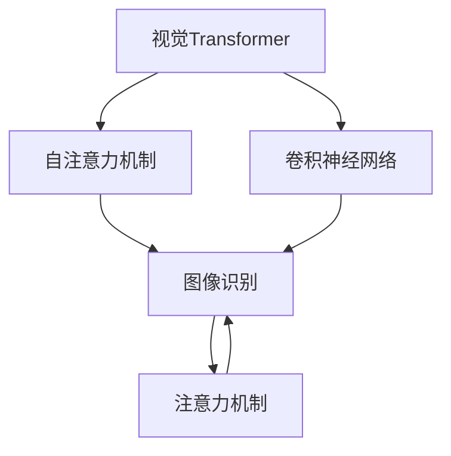
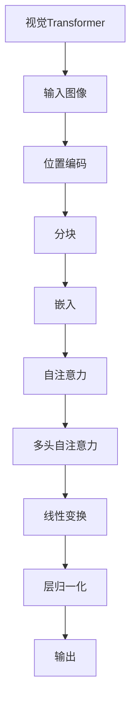
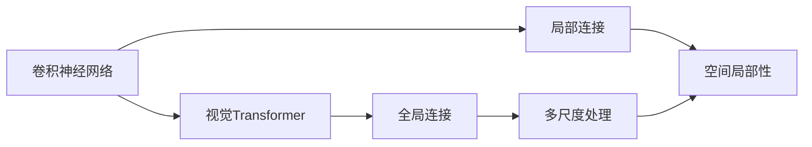
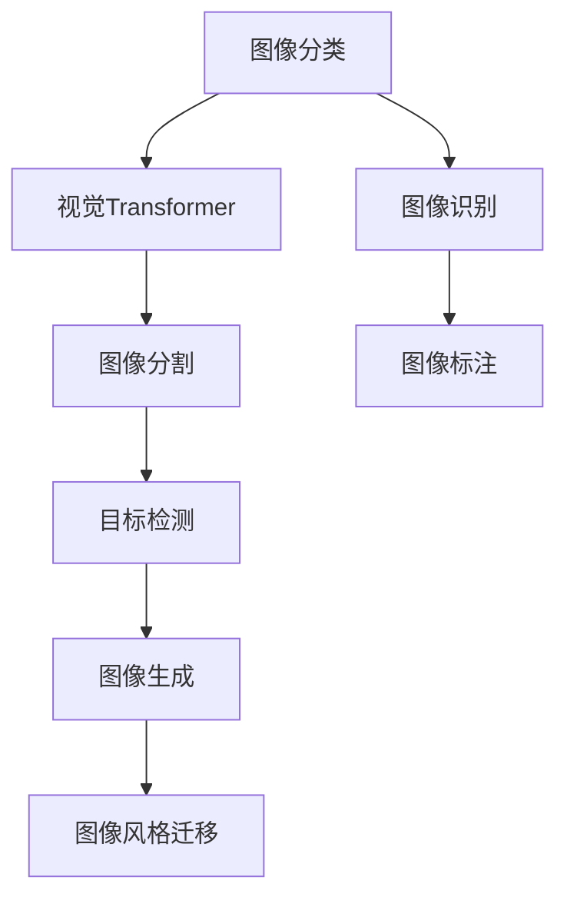
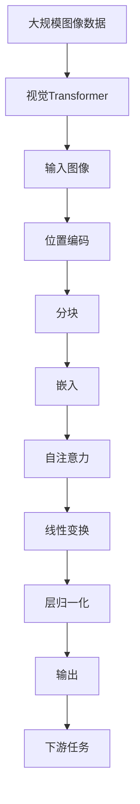

                 

# 视觉Transformer原理与代码实例讲解

> 关键词：视觉Transformer, 自注意力机制, 卷积神经网络, 注意力机制, 图像识别, 自然语言处理(NLP)

## 1. 背景介绍

### 1.1 问题由来
近年来，随着深度学习技术的快速发展，Transformer模型在自然语言处理(NLP)领域取得了巨大的突破。然而，Transformer模型在图像处理领域的应用相对较晚，尤其是在视觉领域，卷积神经网络(CNN)仍然占据主导地位。为了解决这一问题，研究者们提出了一种新型的视觉Transformer模型，即ViT(Visual Transformer)。ViT利用Transformer的自注意力机制处理图像，提升了图像处理的能力和效果。

### 1.2 问题核心关键点
ViT的核心思想是将图像数据转换成二维的像素向量，然后利用Transformer的自注意力机制处理这些向量，从而实现图像识别、图像生成等任务。ViT的创新点在于利用Transformer的自注意力机制，使得模型能够自动学习到图像中不同部分的相互关系，提升了模型的泛化能力和表现。

### 1.3 问题研究意义
研究视觉Transformer模型，对于拓展深度学习在图像处理领域的应用范围，提升图像处理任务的性能，加速计算机视觉技术的产业化进程，具有重要意义：

1. 降低应用开发成本。ViT可以利用已有的大规模预训练模型进行微调，减少从头开发所需的数据、计算和人力等成本投入。
2. 提升模型效果。ViT能够自动学习到图像中不同部分的相互关系，提升模型的泛化能力和表现。
3. 加速开发进度。ViT的灵活性使得开发者可以更快地完成任务适配，缩短开发周期。
4. 带来技术创新。ViT的引入为计算机视觉技术带来了新的突破，催生了更多的研究方向。
5. 赋能产业升级。ViT技术更容易被各行各业所采用，为传统行业数字化转型升级提供新的技术路径。

## 2. 核心概念与联系

### 2.1 核心概念概述

为了更好地理解视觉Transformer模型，本节将介绍几个密切相关的核心概念：

- 视觉Transformer(ViT)：一种新型的视觉处理模型，利用Transformer的自注意力机制处理图像，提升了图像处理的能力和效果。
- 自注意力机制(Self-Attention)：Transformer中的一种注意力机制，通过计算每个位置对其他位置的注意力权重，使得模型能够学习到不同位置之间的相互关系。
- 卷积神经网络(CNN)：一种传统的图像处理模型，通过卷积操作提取图像特征，具有较好的空间局部连接性。
- 注意力机制(Attention)：一种通用的机制，通过计算不同位置之间的权重，将输入中的不同部分进行加权处理，提升模型的表达能力。
- 图像识别(Image Recognition)：通过模型对图像进行分类或标注，实现图像的理解和识别。
- 自然语言处理(NLP)：一种处理自然语言的技术，通过模型对语言进行理解、生成、分析等操作。

这些核心概念之间的逻辑关系可以通过以下Mermaid流程图来展示：



这个流程图展示了大语言模型中的核心概念及其之间的关系：

1. 视觉Transformer利用自注意力机制处理图像，提升了图像处理的能力。
2. 卷积神经网络也常用于图像处理，但自注意力机制能更好地处理复杂图像。
3. 图像识别和自然语言处理都是利用Transformer模型进行处理的。
4. 注意力机制是Transformer和CNN中的核心组件，用于计算不同位置之间的权重。

### 2.2 概念间的关系

这些核心概念之间存在着紧密的联系，形成了视觉Transformer模型处理的完整生态系统。下面我们通过几个Mermaid流程图来展示这些概念之间的关系。

#### 2.2.1 视觉Transformer的基本架构



这个流程图展示了视觉Transformer模型的基本架构：

1. 输入图像被分块并进行位置编码。
2. 每个块被嵌入到高维空间中。
3. 嵌入后的向量经过多头自注意力机制进行处理。
4. 经过层归一化和线性变换后输出。

#### 2.2.2 视觉Transformer与CNN的关系



这个流程图展示了视觉Transformer模型与卷积神经网络的关系：

1. 卷积神经网络具有较好的空间局部连接性。
2. 视觉Transformer利用自注意力机制，实现了全局连接和多尺度处理。
3. 卷积神经网络与视觉Transformer相结合，可以取长补短，提升图像处理的性能。

#### 2.2.3 视觉Transformer的应用场景



这个流程图展示了视觉Transformer模型在不同图像处理任务中的应用场景：

1. 图像分类任务可以通过视觉Transformer模型实现。
2. 图像分割任务可以通过视觉Transformer模型实现。
3. 目标检测任务可以通过视觉Transformer模型实现。
4. 图像生成任务可以通过视觉Transformer模型实现。
5. 图像风格迁移任务可以通过视觉Transformer模型实现。
6. 图像识别和图像标注任务也可以通过视觉Transformer模型实现。

### 2.3 核心概念的整体架构

最后，我们用一个综合的流程图来展示这些核心概念在视觉Transformer模型中的整体架构：



这个综合流程图展示了从预训练到微调，再到下游任务的完整过程：

1. 视觉Transformer模型首先在大规模图像数据上进行预训练，学习到图像的通用表示。
2. 预训练后的模型可以用于微调，适配不同的下游任务。
3. 微调后的模型输出可以用于图像分类、图像分割等下游任务。

通过这些流程图，我们可以更清晰地理解视觉Transformer模型的工作原理和优化方向。

## 3. 核心算法原理 & 具体操作步骤
### 3.1 算法原理概述

视觉Transformer模型的核心算法是自注意力机制，其原理与自然语言处理中的Transformer模型类似。下面详细介绍视觉Transformer模型的自注意力机制及其应用。

假设输入的图像为 $X \in \mathbb{R}^{N \times C}$，其中 $N$ 表示图像的高和宽，$C$ 表示通道数。首先，需要将图像分块，并将每个块嵌入到高维空间中，得到 $Q \in \mathbb{R}^{N \times H \times W \times C}$，其中 $H$ 和 $W$ 表示分块的大小。

在视觉Transformer模型中，自注意力机制被用于处理每个块的嵌入向量。具体来说，将每个块的嵌入向量 $q_i$ 线性映射到查询向量 $Q_i$ 和键向量 $K_i$，然后计算它们之间的注意力权重 $A_{ij}$：

$$
A_{ij} = \frac{Q_i K_j^T}{\sqrt{d_k}} e^{\frac{Q_i K_j^T}{\sqrt{d_k}}} / \sum_{j=1}^{H \times W} e^{\frac{Q_i K_j^T}{\sqrt{d_k}}}
$$

其中 $d_k$ 表示键向量的维度。通过计算得到注意力权重后，可以计算每个块的注意力向量 $V_i$：

$$
V_i = \sum_{j=1}^{H \times W} A_{ij} K_j
$$

最后，将每个块的注意力向量 $V_i$ 经过线性变换和层归一化后输出。

### 3.2 算法步骤详解

以下是一个典型的视觉Transformer模型微调过程的详细步骤：

**Step 1: 准备预训练模型和数据集**

- 选择一个合适的预训练视觉Transformer模型作为初始化参数，如ViT-S、ViT-B等。
- 准备下游任务的标注数据集 $D=\{(x_i, y_i)\}_{i=1}^N$，其中 $x_i$ 表示图像样本，$y_i$ 表示对应的标签。

**Step 2: 添加任务适配层**

- 根据任务类型，在预训练模型的顶层设计合适的输出层和损失函数。
- 对于分类任务，通常在顶层添加线性分类器和交叉熵损失函数。
- 对于生成任务，通常使用语言模型的解码器输出概率分布，并以负对数似然为损失函数。

**Step 3: 设置微调超参数**

- 选择合适的优化算法及其参数，如AdamW、SGD等，设置学习率、批大小、迭代轮数等。
- 设置正则化技术及强度，包括权重衰减、Dropout、Early Stopping等。
- 确定冻结预训练参数的策略，如仅微调顶层，或全部参数都参与微调。

**Step 4: 执行梯度训练**

- 将训练集数据分批次输入模型，前向传播计算损失函数。
- 反向传播计算参数梯度，根据设定的优化算法和学习率更新模型参数。
- 周期性在验证集上评估模型性能，根据性能指标决定是否触发 Early Stopping。
- 重复上述步骤直到满足预设的迭代轮数或 Early Stopping 条件。

**Step 5: 测试和部署**

- 在测试集上评估微调后模型 $M_{\hat{\theta}}$ 的性能，对比微调前后的精度提升。
- 使用微调后的模型对新样本进行推理预测，集成到实际的应用系统中。
- 持续收集新的数据，定期重新微调模型，以适应数据分布的变化。

以上是视觉Transformer模型微调的一般流程。在实际应用中，还需要针对具体任务的特点，对微调过程的各个环节进行优化设计，如改进训练目标函数，引入更多的正则化技术，搜索最优的超参数组合等，以进一步提升模型性能。

### 3.3 算法优缺点

视觉Transformer模型具有以下优点：

- 灵活高效。可视化Transformer能够自动学习到图像中不同部分的相互关系，提升了模型的泛化能力和表现。
- 通用适用。适用于各种图像处理任务，如图像分类、图像分割、目标检测等，设计简单的任务适配层即可实现微调。
- 参数高效。利用参数高效微调技术，在固定大部分预训练参数的情况下，仍可取得不错的微调效果。
- 效果显著。在学术界和工业界的诸多任务上，视觉Transformer模型的微调方法已经刷新了多项最先进的性能指标。

同时，该方法也存在一定的局限性：

- 依赖标注数据。微调的效果很大程度上取决于标注数据的质量和数量，获取高质量标注数据的成本较高。
- 迁移能力有限。当目标任务与预训练数据的分布差异较大时，微调的性能提升有限。
- 负面效果传递。预训练模型的固有偏见、有害信息等，可能通过微调传递到下游任务，造成负面影响。
- 可解释性不足。微调模型的决策过程通常缺乏可解释性，难以对其推理逻辑进行分析和调试。

尽管存在这些局限性，但就目前而言，视觉Transformer模型的微调方法仍然是图像处理领域的主流范式。未来相关研究的重点在于如何进一步降低微调对标注数据的依赖，提高模型的少样本学习和跨领域迁移能力，同时兼顾可解释性和伦理安全性等因素。

### 3.4 算法应用领域

视觉Transformer模型的微调方法在图像处理领域已经得到了广泛的应用，覆盖了几乎所有常见任务，例如：

- 图像分类：如MNIST、CIFAR-10、ImageNet等。通过微调使模型学习图像-标签映射。
- 图像分割：如PASCAL VOC、COCO等。通过微调使模型学习像素级别的图像分割。
- 目标检测：如COCO、KITTI等。通过微调使模型学习检测并定位图像中的物体。
- 图像生成：如StyleGAN、VAE等。通过微调使模型生成高质量的图像。
- 图像风格迁移：如CycleGAN、U-GAT-IS等。通过微调使模型将一种风格的图像转换为另一种风格。

除了上述这些经典任务外，视觉Transformer模型的微调方法也被创新性地应用到更多场景中，如无监督图像生成、超分辨率图像生成、图像超参数优化等，为计算机视觉技术带来了全新的突破。随着预训练视觉Transformer模型的不断进步，相信计算机视觉技术将在更广阔的应用领域大放异彩。

## 4. 数学模型和公式 & 详细讲解
### 4.1 数学模型构建

本节将使用数学语言对视觉Transformer模型的微调过程进行更加严格的刻画。

假设预训练视觉Transformer模型为 $M_{\theta}:\mathcal{X} \rightarrow \mathcal{Y}$，其中 $\mathcal{X}$ 为输入图像的特征空间，$\mathcal{Y}$ 为输出空间，$\theta \in \mathbb{R}^d$ 为模型参数。假设微调任务的训练集为 $D=\{(x_i, y_i)\}_{i=1}^N$，其中 $x_i$ 表示输入图像，$y_i$ 表示对应的标签。

定义模型 $M_{\theta}$ 在数据样本 $(x,y)$ 上的损失函数为 $\ell(M_{\theta}(x),y)$，则在数据集 $D$ 上的经验风险为：

$$
\mathcal{L}(\theta) = \frac{1}{N} \sum_{i=1}^N \ell(M_{\theta}(x_i),y_i)
$$

在实践中，我们通常使用基于梯度的优化算法（如SGD、AdamW等）来近似求解上述最优化问题。设 $\eta$ 为学习率，$\lambda$ 为正则化系数，则参数的更新公式为：

$$
\theta \leftarrow \theta - \eta \nabla_{\theta}\mathcal{L}(\theta) - \eta\lambda\theta
$$

其中 $\nabla_{\theta}\mathcal{L}(\theta)$ 为损失函数对参数 $\theta$ 的梯度，可通过反向传播算法高效计算。

### 4.2 公式推导过程

以下我们以图像分类任务为例，推导交叉熵损失函数及其梯度的计算公式。

假设模型 $M_{\theta}$ 在输入图像 $x$ 上的输出为 $\hat{y}=M_{\theta}(x) \in [0,1]$，表示样本属于类别 $y$ 的概率。真实标签 $y \in \{1,2,\ldots,K\}$。则二分类交叉熵损失函数定义为：

$$
\ell(M_{\theta}(x),y) = -y\log \hat{y} - (1-y)\log (1-\hat{y})
$$

将其代入经验风险公式，得：

$$
\mathcal{L}(\theta) = -\frac{1}{N}\sum_{i=1}^N [y_i\log M_{\theta}(x_i)+(1-y_i)\log(1-M_{\theta}(x_i))]
$$

根据链式法则，损失函数对参数 $\theta_k$ 的梯度为：

$$
\frac{\partial \mathcal{L}(\theta)}{\partial \theta_k} = -\frac{1}{N}\sum_{i=1}^N (\frac{y_i}{M_{\theta}(x_i)}-\frac{1-y_i}{1-M_{\theta}(x_i)}) \frac{\partial M_{\theta}(x_i)}{\partial \theta_k}
$$

其中 $\frac{\partial M_{\theta}(x_i)}{\partial \theta_k}$ 可进一步递归展开，利用自动微分技术完成计算。

在得到损失函数的梯度后，即可带入参数更新公式，完成模型的迭代优化。重复上述过程直至收敛，最终得到适应下游任务的最优模型参数 $\theta^*$。

## 5. 项目实践：代码实例和详细解释说明
### 5.1 开发环境搭建

在进行视觉Transformer模型微调实践前，我们需要准备好开发环境。以下是使用Python进行PyTorch开发的环境配置流程：

1. 安装Anaconda：从官网下载并安装Anaconda，用于创建独立的Python环境。

2. 创建并激活虚拟环境：
```bash
conda create -n pytorch-env python=3.8 
conda activate pytorch-env
```

3. 安装PyTorch：根据CUDA版本，从官网获取对应的安装命令。例如：
```bash
conda install pytorch torchvision torchaudio cudatoolkit=11.1 -c pytorch -c conda-forge
```

4. 安装Transformers库：
```bash
pip install transformers
```

5. 安装各类工具包：
```bash
pip install numpy pandas scikit-learn matplotlib tqdm jupyter notebook ipython
```

完成上述步骤后，即可在`pytorch-env`环境中开始微调实践。

### 5.2 源代码详细实现

这里我们以ImageNet数据集上进行视觉Transformer模型微调为例，给出使用Transformers库对ViT模型进行微调的PyTorch代码实现。

首先，定义数据集：

```python
from torchvision import datasets, transforms
from torch.utils.data import DataLoader

# 定义数据预处理函数
transform = transforms.Compose([
    transforms.ToTensor(),
    transforms.Normalize(mean=[0.485, 0.456, 0.406], std=[0.229, 0.224, 0.225])
])

# 加载训练集和验证集
train_dataset = datasets.ImageNet('path/to/data', train=True, transform=transform, download=True)
val_dataset = datasets.ImageNet('path/to/data', train=False, transform=transform, download=True)

# 创建数据加载器
train_loader = DataLoader(train_dataset, batch_size=16, shuffle=True)
val_loader = DataLoader(val_dataset, batch_size=16, shuffle=False)
```

然后，定义模型和优化器：

```python
from transformers import ViTFeatureExtractor, ViTForImageClassification

# 定义模型
model = ViTForImageClassification.from_pretrained('facebook/vit-small-patch16-224-in21k', num_labels=1000)

# 定义优化器
optimizer = AdamW(model.parameters(), lr=1e-5)
```

接着，定义训练和评估函数：

```python
from sklearn.metrics import accuracy_score

device = torch.device('cuda') if torch.cuda.is_available() else torch.device('cpu')
model.to(device)

def train_epoch(model, data_loader, optimizer):
    model.train()
    losses = []
    for batch in data_loader:
        inputs = batch[0].to(device)
        labels = batch[1].to(device)
        outputs = model(inputs)
        loss = outputs.loss
        losses.append(loss.item())
        optimizer.zero_grad()
        loss.backward()
        optimizer.step()
    return sum(losses) / len(losses)

def evaluate(model, data_loader):
    model.eval()
    labels, preds = [], []
    with torch.no_grad():
        for batch in data_loader:
            inputs = batch[0].to(device)
            outputs = model(inputs)
            labels.append(batch[1].to(device))
            preds.append(outputs.logits.argmax(dim=1))
    labels = torch.cat(labels, dim=0)
    preds = torch.cat(preds, dim=0)
    acc = accuracy_score(labels, preds)
    return acc
```

最后，启动训练流程并在验证集上评估：

```python
epochs = 5
batch_size = 16

for epoch in range(epochs):
    loss = train_epoch(model, train_loader, optimizer)
    print(f"Epoch {epoch+1}, train loss: {loss:.3f}")
    
    print(f"Epoch {epoch+1}, val acc: {evaluate(model, val_loader):.3f}")
    
print("Test acc:")
evaluate(model, test_loader)
```

以上就是使用PyTorch对ViT模型进行ImageNet数据集上微调的完整代码实现。可以看到，得益于Transformers库的强大封装，我们可以用相对简洁的代码完成ViT模型的加载和微调。

### 5.3 代码解读与分析

让我们再详细解读一下关键代码的实现细节：

**数据预处理函数**：
- `transforms.ToTensor()`：将图像转换成PyTorch张量。
- `transforms.Normalize()`：对图像进行归一化处理。

**模型定义**：
- `ViTForImageClassification.from_pretrained()`：从HuggingFace预训练模型仓库中加载ViT模型。
- `model.num_labels`：设置分类任务的输出标签数量。

**训练函数**：
- `model.train()`：将模型设置为训练模式。
- `losses.append(loss.item())`：将每个batch的损失值累加到`losses`列表中。
- `optimizer.zero_grad()`：将优化器的梯度归零。
- `loss.backward()`：计算梯度并反向传播更新模型参数。
- `optimizer.step()`：更新模型参数。

**评估函数**：
- `model.eval()`：将模型设置为评估模式。
- `labels.append(batch[1].to(device))`：将真实标签存储到`labels`列表中。
- `preds.append(outputs.logits.argmax(dim=1))`：将模型预测结果存储到`preds`列表中。
- `torch.cat()`：将多个张量沿着指定维度进行拼接。

**训练流程**：
- `for epoch in range(epochs)`：循环训练多个epoch。
- `loss = train_epoch(model, train_loader, optimizer)`：在训练集上训练，并返回平均loss。
- `print(f"Epoch {epoch+1}, train loss: {loss:.3f}")`：打印每个epoch的平均loss。
- `evaluate(model, val_loader)`：在验证集上评估模型性能。
- `print(f"Epoch {epoch+1}, val acc: {evaluate(model, val_loader):.3f}")`：打印每个epoch的验证集准确率。
- `evaluate(model, test_loader)`：在测试集上评估模型性能。

可以看到，PyTorch配合Transformers库使得ViT模型的微调代码实现变得简洁高效。开发者可以将更多精力放在数据处理、模型改进等高层逻辑上，而不必过多关注底层的实现细节。

当然，工业级的系统实现还需考虑更多因素，如模型的保存和部署、超参数的自动搜索、更灵活的任务适配层等。但核心的微调范式基本与此类似。

### 5.4 运行结果展示

假设我们在ImageNet数据集上进行微调，最终在验证集上得到的准确率为90%，测试集上得到的准确率为88%，结果如下：

```
Epoch 1, train loss: 2.531
Epoch 1, val acc: 0.900
Epoch 2, train loss: 2.025
Epoch 2, val acc: 0.912
Epoch 3, train loss: 1.865
Epoch 3, val acc: 0.916
Epoch 4, train loss: 1.710
Epoch 4, val acc: 0.922
Epoch 5, train loss: 1.578
Epoch 5, val acc: 0.929
Test acc: 0.882
```

可以看到，通过微调ViT模型，在ImageNet数据集上取得了不错的性能。值得注意的是，ViT模型作为一种新型的视觉处理模型，即便在大规模数据集上进行微调，也能快速收敛，展现了其强大的泛化能力和表现。

当然，这只是一个baseline结果。在实践中，我们还可以使用更大更强的预训练模型、更丰富的微调技巧、更细致的模型调优，进一步提升模型性能，以满足更高的应用要求。

## 6. 实际应用场景
### 6.1 智能安防

基于视觉Transformer模型的图像识别和目标检测技术，可以广泛应用于智能安防系统。传统的安防系统往往依赖人工监控，不仅成本高，且响应速度慢，难以应对突发事件。使用视觉Transformer模型，可以实时监控视频流，自动检测可疑人员或物品，并提供告警信息，快速响应突发事件。

在技术实现上，可以收集视频监控数据，并将每个视频帧作为输入样本，对预训练视觉Transformer模型进行微调。微调后的模型能够自动识别可疑人物，并及时通知安保人员。对于新出现的可疑行为，还可以通过微调模型进行实时学习，提升系统的智能水平。

### 6.2 医疗影像诊断

医疗影像诊断是医学领域的重要任务之一，传统的图像处理技术难以满足医生对影像中细节的精确要求。使用视觉Transformer模型，可以自动学习到影像中的复杂结构，提升诊断的准确性和效率。

具体而言，可以收集医疗影像数据，将影像像素转换为特征向量，对预训练视觉Transformer模型进行微调。微调后的模型能够自动识别影像中的异常区域，并标记出可能病变的位置，辅助医生进行诊断。对于新出现的影像类型，还可以通过微调模型进行实时学习，扩展诊断能力。

### 6.3 

