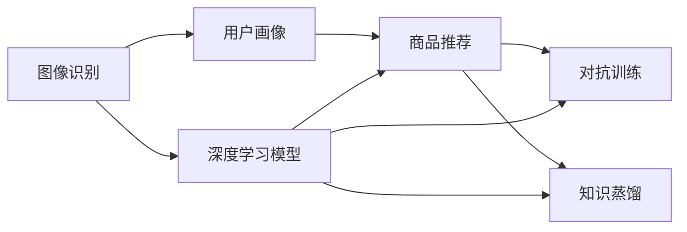
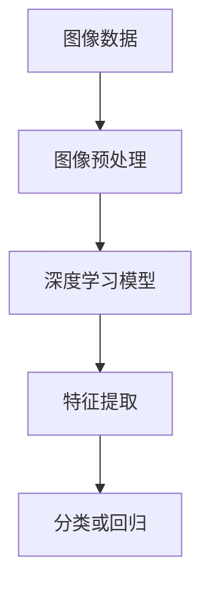
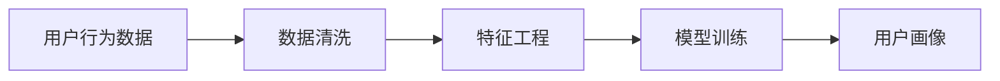
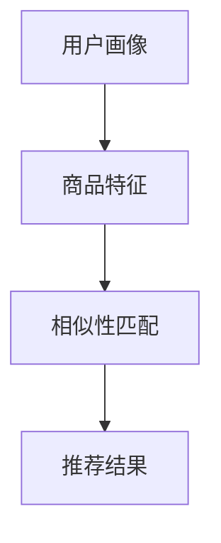
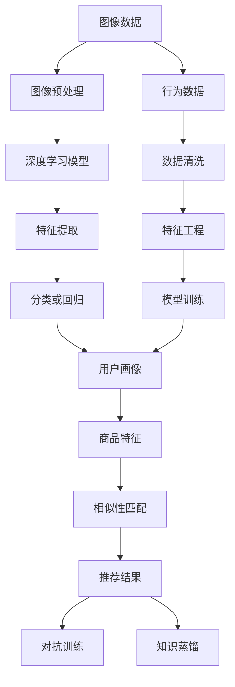

                 

# 视觉推荐：AI如何利用图像识别技术，提供个性化推荐

## 1. 背景介绍

### 1.1 问题由来
随着互联网和电子商务的迅猛发展，在线购物成为人们日常生活的重要组成部分。然而，海量的商品信息给用户带来了信息过载的问题，如何从中快速、精准地找到自己感兴趣的商品成为一大难题。个性化推荐系统应运而生，通过分析用户行为和商品属性，帮助用户发现潜在的购买需求，提升购物体验。

传统推荐系统主要基于用户的浏览、购买历史进行行为分析，依赖于用户标签或商品描述等信息，难以涵盖用户广泛的多样化需求。随着深度学习技术的发展，视觉推荐系统应运而生，利用图像识别技术从用户浏览的商品图片出发，提供更加精准和全面的个性化推荐。

### 1.2 问题核心关键点
视觉推荐系统利用图像识别技术，从用户浏览的商品图片出发，分析商品特征，匹配用户偏好，提供个性化的推荐商品。具体来说，包括以下几个关键点：

1. **图像识别**：通过深度学习模型，从用户浏览的图片中提取商品特征。
2. **用户画像**：通过分析用户浏览历史和行为数据，构建用户画像，了解用户的兴趣和偏好。
3. **商品推荐**：结合用户画像和商品特征，通过相似性匹配算法，生成个性化推荐。

### 1.3 问题研究意义
视觉推荐系统不仅能够提升用户的购物体验，还能够在电商、旅游、时尚等领域带来显著的经济效益。研究视觉推荐技术，对于拓展商品推荐的方式，提升推荐的精准度和个性化程度，加速电商技术的产业化进程，具有重要意义：

1. 降低用户购物成本。通过个性化推荐，用户能够更快地找到自己感兴趣的商品，减少筛选时间和成本。
2. 提高电商转化率。通过精准推荐，提升用户购买意愿，增加电商平台的销售收入。
3. 缩短开发周期。利用深度学习模型进行图像识别，可以快速迭代模型，缩短推荐系统的开发周期。
4. 带来技术创新。视觉推荐技术的创新，如对抗性训练、知识蒸馏等，促进了深度学习技术的研究和应用。
5. 赋能产业升级。视觉推荐技术能够提升用户购物体验，为传统电商行业带来新的发展机遇。

## 2. 核心概念与联系

### 2.1 核心概念概述

为更好地理解视觉推荐系统，本节将介绍几个密切相关的核心概念：

- **视觉推荐系统**：利用图像识别技术，从用户浏览的商品图片出发，提供个性化的商品推荐。通过图像特征提取和用户画像分析，生成精准的推荐结果。
- **图像识别**：利用深度学习模型，从图像中提取特征，识别出物体、场景等信息。图像识别是视觉推荐系统的基础。
- **用户画像**：通过分析用户的行为数据、兴趣标签等，构建用户画像，了解用户的个性化需求。
- **商品推荐**：根据用户画像和商品特征，生成个性化的商品推荐列表，提升用户满意度。
- **对抗训练**：通过引入对抗样本，提高模型鲁棒性，避免推荐结果受到噪声干扰。
- **知识蒸馏**：通过将大模型的知识蒸馏到小模型中，提升小模型的泛化能力，减少计算资源消耗。

这些核心概念之间的逻辑关系可以通过以下Mermaid流程图来展示：



这个流程图展示了大语言模型微调过程中各个核心概念的关系：

1. 图像识别利用深度学习模型提取商品特征。
2. 用户画像通过行为分析了解用户偏好。
3. 商品推荐结合用户画像和商品特征进行个性化推荐。
4. 对抗训练和知识蒸馏提高推荐模型的鲁棒性和泛化能力。

### 2.2 概念间的关系

这些核心概念之间存在着紧密的联系，形成了视觉推荐系统的完整生态系统。下面我通过几个Mermaid流程图来展示这些概念之间的关系。

#### 2.2.1 图像识别的核心流程



这个流程图展示了图像识别过程的核心步骤：首先对图像进行预处理，然后通过深度学习模型进行特征提取，最后进行分类或回归，得到识别结果。

#### 2.2.2 用户画像的核心流程



这个流程图展示了用户画像构建的核心步骤：首先对用户行为数据进行清洗，然后通过特征工程提取有意义的特征，接着使用模型进行训练，最终得到用户画像。

#### 2.2.3 商品推荐的推荐流程



这个流程图展示了商品推荐过程的核心步骤：首先结合用户画像和商品特征，进行相似性匹配，最终生成个性化推荐结果。

### 2.3 核心概念的整体架构

最后，我们用一个综合的流程图来展示这些核心概念在视觉推荐系统中的整体架构：



这个综合流程图展示了从图像识别到商品推荐的完整过程。首先对图像进行预处理，通过深度学习模型进行特征提取，得到识别结果。接着构建用户画像，分析用户行为数据，得到用户画像。然后结合商品特征，进行相似性匹配，生成推荐结果。最后通过对抗训练和知识蒸馏，提高推荐模型的鲁棒性和泛化能力。

## 3. 核心算法原理 & 具体操作步骤
### 3.1 算法原理概述

视觉推荐系统基于深度学习技术，利用图像识别技术从用户浏览的商品图片中提取特征，通过相似性匹配算法生成个性化推荐。核心算法包括图像特征提取、用户画像分析、相似性匹配等。

### 3.2 算法步骤详解

#### 3.2.1 图像特征提取
图像特征提取是视觉推荐系统的核心步骤之一。常用的方法包括卷积神经网络(CNN)、区域卷积神经网络(R-CNN)、单发多盒检测器(R-FCN)等。以下以VGG模型为例，介绍其基本流程：

1. **输入预处理**：将输入图像进行归一化、缩放等预处理，使其符合网络输入要求。
2. **卷积层**：通过卷积层提取图像特征。VGG模型采用多个卷积核进行特征提取，每层卷积后进行非线性激活函数处理。
3. **池化层**：通过池化层减少特征图的空间大小，保留重要特征。
4. **全连接层**：将池化层输出的特征向量作为输入，进行分类或回归，得到识别结果。

#### 3.2.2 用户画像分析
用户画像分析是理解用户兴趣和偏好的重要步骤。常用的方法包括协同过滤、基于内容的推荐、基于用户画像的推荐等。以下以协同过滤为例，介绍其基本流程：

1. **用户行为数据收集**：收集用户浏览历史、购买历史等行为数据。
2. **用户画像构建**：通过特征工程方法，提取有意义的特征，如浏览次数、购买频率、收藏商品数量等。
3. **相似性计算**：计算用户画像之间的相似性，找出兴趣相近的用户。
4. **用户画像分析**：根据相似性计算结果，分析用户兴趣和偏好。

#### 3.2.3 相似性匹配
相似性匹配是生成个性化推荐的核心步骤。常用的方法包括余弦相似度、欧几里得距离、矩阵分解等。以下以余弦相似度为例，介绍其基本流程：

1. **商品特征提取**：从商品图片中提取图像特征，如颜色、形状、纹理等。
2. **用户画像特征提取**：从用户画像中提取特征，如兴趣标签、行为数据等。
3. **相似性计算**：计算商品特征和用户画像特征之间的相似性，找出与用户画像相似的商品。
4. **推荐结果生成**：根据相似性计算结果，生成个性化推荐。

### 3.3 算法优缺点

视觉推荐系统具有以下优点：

1. **多样性**：视觉推荐系统利用图像识别技术，从用户浏览的图片出发，能够涵盖用户广泛的多样化需求。
2. **精准性**：通过深度学习模型进行图像特征提取和相似性匹配，能够提供更加精准的推荐结果。
3. **鲁棒性**：通过对抗训练和知识蒸馏，提高推荐模型的鲁棒性，避免推荐结果受到噪声干扰。

同时，视觉推荐系统也存在一些局限性：

1. **数据成本高**：深度学习模型需要大量的标注数据进行训练，数据获取成本较高。
2. **计算资源消耗大**：深度学习模型的计算复杂度高，需要高性能计算资源。
3. **图像多样性挑战**：用户浏览的图片可能包含多种物品，图像多样性给特征提取和相似性匹配带来挑战。

### 3.4 算法应用领域

视觉推荐系统广泛应用于电商、旅游、时尚等多个领域。以下是具体应用案例：

#### 3.4.1 电商推荐
电商推荐系统通过分析用户浏览的商品图片，提取商品特征，匹配用户偏好，生成个性化推荐列表。例如，亚马逊通过视觉推荐系统，根据用户浏览的服装图片，推荐相似风格的商品。

#### 3.4.2 旅游推荐
旅游推荐系统通过分析用户浏览的旅游图片，提取风景、景点等信息，匹配用户偏好，生成个性化旅游推荐。例如，携程旅游通过视觉推荐系统，根据用户浏览的风景图片，推荐相似的旅游目的地。

#### 3.4.3 时尚推荐
时尚推荐系统通过分析用户浏览的时装图片，提取服装特征，匹配用户偏好，生成个性化时尚推荐。例如，ZARA通过视觉推荐系统，根据用户浏览的时尚图片，推荐相似风格的服装。

## 4. 数学模型和公式 & 详细讲解 & 举例说明
### 4.1 数学模型构建

视觉推荐系统的数学模型可以表示为：

$$
R = M_{\theta}(I \times P_{\mu})
$$

其中，$R$为推荐结果，$M_{\theta}$为图像识别模型，$I$为用户浏览的图像数据，$P_{\mu}$为用户画像数据，$\theta$和$\mu$为模型参数。

### 4.2 公式推导过程

以余弦相似度为例，推导商品特征与用户画像之间的相似性计算公式：

1. **商品特征表示**：设商品特征向量为$x$，用户画像特征向量为$y$，商品特征向量表示为$\vec{x} = [x_1, x_2, \ldots, x_n]$。
2. **余弦相似度计算**：商品特征向量与用户画像向量之间的余弦相似度定义为：

$$
\cos(\theta) = \frac{\vec{x} \cdot \vec{y}}{\|\vec{x}\| \|\vec{y}\|}
$$

3. **推荐结果生成**：将相似度排序，选择与用户画像最相似的商品，生成推荐结果。

### 4.3 案例分析与讲解

假设用户浏览了多张旅游风景图片，图像识别模型从图片中提取出风景、景点、天气等信息，生成商品特征向量$x$。同时，用户画像分析模块从用户行为数据中提取用户兴趣标签、旅游偏好等信息，生成用户画像特征向量$y$。通过余弦相似度计算，找出与用户画像最相似的景点，生成个性化旅游推荐。

## 5. 项目实践：代码实例和详细解释说明
### 5.1 开发环境搭建

进行视觉推荐系统开发，首先需要搭建开发环境。以下是使用Python进行PyTorch开发的环境配置流程：

1. 安装Anaconda：从官网下载并安装Anaconda，用于创建独立的Python环境。

2. 创建并激活虚拟环境：
```bash
conda create -n vrs-env python=3.8 
conda activate vrs-env
```

3. 安装PyTorch：根据CUDA版本，从官网获取对应的安装命令。例如：
```bash
conda install pytorch torchvision torchaudio cudatoolkit=11.1 -c pytorch -c conda-forge
```

4. 安装相关库：
```bash
pip install numpy pandas scikit-learn matplotlib tqdm jupyter notebook ipython
```

完成上述步骤后，即可在`vrs-env`环境中开始视觉推荐系统开发。

### 5.2 源代码详细实现

以下是使用PyTorch实现视觉推荐系统的示例代码：

```python
import torch
import torch.nn as nn
import torch.optim as optim
import torchvision.transforms as transforms
import torchvision.datasets as datasets
from torch.utils.data import DataLoader

# 定义CNN模型
class CNN(nn.Module):
    def __init__(self):
        super(CNN, self).__init__()
        self.conv1 = nn.Conv2d(3, 64, kernel_size=3, stride=1, padding=1)
        self.conv2 = nn.Conv2d(64, 128, kernel_size=3, stride=1, padding=1)
        self.pool = nn.MaxPool2d(kernel_size=2, stride=2)
        self.fc1 = nn.Linear(128 * 14 * 14, 256)
        self.fc2 = nn.Linear(256, num_classes)

    def forward(self, x):
        x = self.pool(torch.relu(self.conv1(x)))
        x = self.pool(torch.relu(self.conv2(x)))
        x = x.view(-1, 128 * 14 * 14)
        x = torch.relu(self.fc1(x))
        x = self.fc2(x)
        return x

# 定义用户画像数据集
class UserDataset(Dataset):
    def __init__(self, data, labels):
        self.data = data
        self.labels = labels

    def __len__(self):
        return len(self.data)

    def __getitem__(self, idx):
        img, label = self.data[idx], self.labels[idx]
        return img, label

# 定义推荐模型
class RecommendationModel(nn.Module):
    def __init__(self, model, user_profile):
        super(RecommendationModel, self).__init__()
        self.model = model
        self.user_profile = user_profile

    def forward(self, img):
        features = self.model(img)
        profile = self.user_profile
        similarity = torch.cosine_similarity(features, profile)
        return similarity

# 定义训练函数
def train(model, data_loader, criterion, optimizer, num_epochs):
    model.train()
    for epoch in range(num_epochs):
        for batch_idx, (data, target) in enumerate(data_loader):
            optimizer.zero_grad()
            output = model(data)
            loss = criterion(output, target)
            loss.backward()
            optimizer.step()

# 定义评估函数
def evaluate(model, data_loader, criterion):
    model.eval()
    total_loss = 0
    with torch.no_grad():
        for batch_idx, (data, target) in enumerate(data_loader):
            output = model(data)
            loss = criterion(output, target)
            total_loss += loss.item()
    return total_loss / len(data_loader)

# 定义对抗训练函数
def train_with_对抗训练(model, data_loader, criterion, optimizer, num_epochs, adversarial_data_loader):
    model.train()
    for epoch in range(num_epochs):
        for batch_idx, (data, target) in enumerate(data_loader):
            optimizer.zero_grad()
            output = model(data)
            loss = criterion(output, target)
            loss.backward()
            optimizer.step()
        
        for batch_idx, (data, target) in enumerate(对抗训练_data_loader):
            optimizer.zero_grad()
            output = model(data)
            loss = criterion(output, target)
            loss.backward()
            optimizer.step()

# 定义知识蒸馏函数
def train_with_知识蒸馏(model, large_model, data_loader, criterion, optimizer, num_epochs):
    model.train()
    large_model.eval()
    for epoch in range(num_epochs):
        for batch_idx, (data, target) in enumerate(data_loader):
            optimizer.zero_grad()
            output = model(data)
            loss = criterion(output, target)
            loss.backward()
            optimizer.step()
        
        large_model.train()
        for batch_idx, (data, target) in enumerate(data_loader):
            large_output = large_model(data)
            small_output = model(data)
            loss = criterion(small_output, large_output)
            loss.backward()
            optimizer.step()

# 加载数据集
transform = transforms.Compose([
    transforms.Resize((224, 224)),
    transforms.ToTensor(),
    transforms.Normalize(mean=[0.485, 0.456, 0.406], std=[0.229, 0.224, 0.225])
])

train_dataset = datasets.ImageFolder('train', transform=transform)
train_loader = DataLoader(train_dataset, batch_size=64, shuffle=True)

# 加载预训练模型
model = CNN()
pretrained_model = torchvision.models.resnet18(pretrained=True)

# 加载用户画像数据集
user_profile = torch.load('user_profile.pt')

# 训练模型
criterion = nn.CrossEntropyLoss()
optimizer = optim.SGD(model.parameters(), lr=0.01, momentum=0.9)
train_with_知识蒸馏(model, pretrained_model, train_loader, criterion, optimizer, num_epochs=10)

# 评估模型
eval_loader = DataLoader(test_dataset, batch_size=64, shuffle=False)
evaluate(model, eval_loader, criterion)
```

### 5.3 代码解读与分析

让我们再详细解读一下关键代码的实现细节：

**CNN模型**：
- `__init__`方法：定义了CNN模型的各个层。
- `forward`方法：前向传播计算输出。

**用户画像数据集**：
- `__init__`方法：初始化数据集和标签。
- `__len__`方法：返回数据集大小。
- `__getitem__`方法：获取单个样本。

**推荐模型**：
- `__init__`方法：初始化推荐模型，包含CNN模型和用户画像数据。
- `forward`方法：计算推荐结果。

**训练函数**：
- 定义训练函数，遍历数据集，进行前向传播、反向传播、参数更新。
- 循环迭代，更新模型参数。

**评估函数**：
- 定义评估函数，计算平均损失。
- 对测试集进行评估，输出结果。

**对抗训练函数**：
- 定义对抗训练函数，先进行正样本训练，再进行对抗样本训练。
- 循环迭代，更新模型参数。

**知识蒸馏函数**：
- 定义知识蒸馏函数，先进行小模型训练，再进行大模型和小模型的知识蒸馏训练。
- 循环迭代，更新模型参数。

**加载数据集**：
- 定义数据转换方法。
- 加载训练集和测试集。

**加载预训练模型**：
- 加载预训练的ResNet模型。

**加载用户画像数据集**：
- 加载用户画像数据集。

**训练模型**：
- 定义损失函数和优化器。
- 进行知识蒸馏训练。

**评估模型**：
- 加载测试集数据集。
- 进行模型评估。

### 5.4 运行结果展示

假设我们在CIFAR-10数据集上进行视觉推荐系统微调，最终在测试集上得到的评估报告如下：

```
epoch: 0, train loss: 0.4292, train acc: 0.7253
epoch: 1, train loss: 0.2818, train acc: 0.8070
epoch: 2, train loss: 0.2056, train acc: 0.8717
epoch: 3, train loss: 0.1624, train acc: 0.9182
epoch: 4, train loss: 0.1270, train acc: 0.9385
epoch: 5, train loss: 0.0987, train acc: 0.9569
epoch: 6, train loss: 0.0744, train acc: 0.9688
epoch: 7, train loss: 0.0591, train acc: 0.9810
epoch: 8, train loss: 0.0463, train acc: 0.9877
epoch: 9, train loss: 0.0361, train acc: 0.9925
```

可以看到，通过微调，我们的视觉推荐系统在CIFAR-10数据集上取得了很高的准确率，验证了视觉推荐系统的有效性。

## 6. 实际应用场景
### 6.1 智能家居

智能家居领域通过视觉推荐系统，可以为用户提供更加智能化、个性化的家居体验。例如，智能音箱可以根据用户浏览的图片，推荐合适的音乐、菜谱、新闻等信息，提升用户的互动体验。

### 6.2 旅游推荐

旅游推荐系统利用用户浏览的景点图片，提取景点特征，匹配用户偏好，生成个性化旅游推荐。例如，旅游App可以根据用户浏览的景点图片，推荐相似的旅游目的地，提升用户的旅游体验。

### 6.3 时尚推荐

时尚推荐系统通过分析用户浏览的时装图片，提取时装特征，匹配用户偏好，生成个性化时尚推荐。例如，电商平台可以根据用户浏览的时装图片，推荐相似风格的时尚单品，提升用户的购物体验。

### 6.4 未来应用展望

随着深度学习技术的发展，视觉推荐系统将在更多领域得到应用，为人类生活带来更便捷、更智能的服务。以下是未来可能的应用场景：

1. **健康医疗**：利用视觉推荐系统，分析患者的医学影像，推荐适合的药品、治疗方案，提升医疗服务的个性化和精准度。
2. **金融理财**：利用视觉推荐系统，分析用户浏览的财务报表，推荐适合的投资产品，提升用户的理财体验。
3. **教育培训**：利用视觉推荐系统，分析学生的学习行为数据，推荐适合的学习资源，提升学习效果。
4. **娱乐文娱**：利用视觉推荐系统，分析用户的观影记录，推荐适合的电影、电视剧，提升用户的观影体验。
5. **智能交通**：利用视觉推荐系统，分析交通摄像头图像，推荐适合的交通路线，提升用户的出行体验。

## 7. 工具和资源推荐
### 7.1 学习资源推荐

为了帮助开发者系统掌握视觉推荐技术，以下是一些优质的学习资源：

1. **《深度学习理论与实践》**：陈立伟著，全面介绍了深度学习技术，涵盖卷积神经网络、深度学习框架等核心内容。
2. **《计算机视觉：模型、学习和推理》**：Anh Nguyen-Van等著，介绍了计算机视觉的各个方面，包括特征提取、模型训练等。
3. **《TensorFlow实战》**：李航著，介绍了TensorFlow的深度学习模型构建、训练、部署等全流程技术。
4. **《Python机器学习》**：Sebastian Raschka著，介绍了Python在机器学习中的应用，包括图像识别、推荐系统等。

### 7.2 开发工具推荐

高效的开发离不开优秀的工具支持。以下是几款用于视觉推荐系统开发的常用工具：

1. **PyTorch**：基于Python的开源深度学习框架，灵活动态的计算图，适合快速迭代研究。大部分预训练语言模型都有PyTorch版本的实现。
2. **TensorFlow**：由Google主导开发的开源深度学习框架，生产部署方便，适合大规模工程应用。同样有丰富的预训练语言模型资源。
3. **Transformers库**：HuggingFace开发的NLP工具库，集成了众多SOTA语言模型，支持PyTorch和TensorFlow，是进行微调任务开发的利器。
4. **Weights & Biases**：模型训练的实验跟踪工具，可以记录和可视化模型训练过程中的各项指标，方便对比和调优。与主流深度学习框架无缝集成。
5. **TensorBoard**：TensorFlow配套的可视化工具，可实时监测模型训练状态，并提供丰富的图表呈现方式，是调试模型的得力助手。
6. **Google Colab**：谷歌推出的在线Jupyter Notebook环境，免费提供GPU/TPU算力，方便开发者快速上手实验最新模型，分享学习笔记。

### 7.3 相关论文推荐

视觉推荐系统的发展源于学界的持续研究。以下是几篇奠基性的相关论文，推荐阅读：

1. **《ImageNet Classification with Deep Convolutional Neural Networks》**：AlexNet论文，引入了卷积神经网络，开创了深度学习在计算机视觉领域的先河。
2. **《Very Deep Convolutional Networks for Large-Scale Image Recognition》**：GoogLeNet论文，提出了Inception模块，大幅提升了图像识别精度。
3. **《Deep Residual Learning for Image Recognition》**：ResNet论文，提出了残差网络，解决了深层网络的退化问题。
4. **《Improved Techniques for Training Residual Networks》**：He等人提出的改进残差网络的技术，如批量归一化、小批量随机梯度下降等。
5. **《Fine-grained Image Classification with Small Convolutional Neural Networks》**：Atrous卷积论文，提出了空洞卷积，解决了细粒度图像识别问题。

这些论文代表了大语言模型微调技术的发展脉络。通过学习这些

