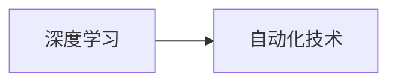
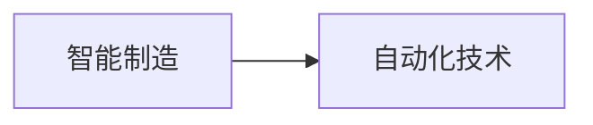
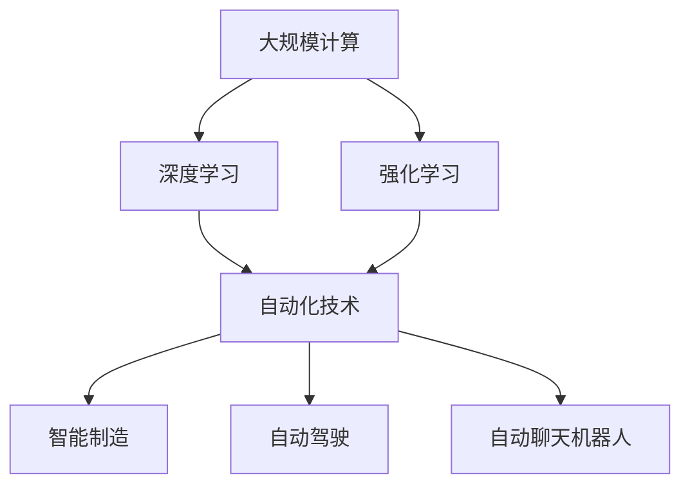

                 

## 1. 背景介绍

### 1.1 问题由来

随着计算能力的不断提升和数据量的迅猛增长，自动化技术在各行各业的应用范围和深度都得到了极大的拓展。计算的变化不仅带来了技术上的飞跃，也对自动化技术的发展产生了深远的影响。本文将探讨计算变化对自动化技术的推动作用，特别是其在决策自动化、智能制造、自动驾驶和自动聊天机器人等领域的变革性影响。

### 1.2 问题核心关键点

计算能力的提升和数据量的增加，使得自动化技术在以下几个方面取得了显著进步：

- **决策自动化**：通过深度学习和强化学习等方法，自动化系统能够从大量数据中学习规律，做出更精准的决策。
- **智能制造**：工业4.0的兴起，使得自动化技术在生产制造中的应用更加广泛，通过智能设备和物联网技术的结合，实现了生产流程的自动化和优化。
- **自动驾驶**：在计算能力和传感器技术的基础上，自动驾驶车辆逐渐从测试阶段走向实际应用，提升了交通的效率和安全性。
- **自动聊天机器人**：自然语言处理技术的进步，使得聊天机器人能够更自然地与人类交流，提升了用户体验和服务效率。

### 1.3 问题研究意义

计算变化对自动化技术的发展具有重要的推动作用，其研究意义如下：

1. **提升生产力**：通过自动化技术，企业可以大幅提升生产效率，减少人为错误，降低生产成本。
2. **推动技术创新**：计算能力的提升和数据的丰富，使得自动化技术不断突破现有瓶颈，带来更多创新应用。
3. **优化资源分配**：通过自动化系统的决策，可以更高效地利用资源，提高资源配置的合理性。
4. **增强用户体验**：自动化系统可以提供更个性化、更即时的服务，提升用户体验。
5. **促进社会进步**：自动化技术在各行各业的广泛应用，将推动社会生产方式和生活方式的变革。

## 2. 核心概念与联系

### 2.1 核心概念概述

要理解计算变化对自动化技术的推动作用，首先需要明确几个核心概念：

- **计算能力**：指计算机处理数据和执行计算任务的能力，通常用每秒处理的任务数量（Transistors Per Second，TPOS）来衡量。
- **自动化技术**：指利用计算机和控制技术，通过编程和规则实现生产、服务、管理等任务自动化的技术。
- **深度学习**：一种基于神经网络的机器学习技术，通过多层神经元的组合，实现对数据的高级抽象和模式识别。
- **强化学习**：通过试错的方式，让智能体在环境中学习最优策略，以达到特定目标。
- **智能制造**：结合物联网、云计算、大数据等技术，实现生产制造过程的自动化和智能化。
- **自动驾驶**：利用计算机视觉、深度学习和传感器技术，实现车辆的自主导航和驾驶。
- **自动聊天机器人**：结合自然语言处理和机器学习技术，实现与用户的自然语言交互。

这些概念之间的关系可以通过以下Mermaid流程图来展示：


这个流程图展示了计算能力如何通过深度学习和强化学习，推动自动化技术在智能制造、自动驾驶和自动聊天机器人等领域的变革。

### 2.2 概念间的关系

这些核心概念之间存在着紧密的联系，形成了计算变化对自动化技术的推动框架。以下是几个关键的关系图：

#### 2.2.1 深度学习与自动化技术的关系



深度学习通过学习数据的高级特征，使得自动化系统能够进行更复杂的决策和任务执行。

#### 2.2.2 强化学习与自动化技术的关系


强化学习通过试错和优化，使自动化系统能够自适应环境，不断提升任务执行的精度和效率。

#### 2.2.3 智能制造与自动化技术的关系



智能制造通过物联网和大数据技术，使得自动化系统能够实时监控和优化生产流程，提高生产效率。

#### 2.2.4 自动驾驶与自动化技术的关系


自动驾驶通过计算机视觉和传感器技术，实现车辆的自主导航和决策，是自动化技术在交通领域的重要应用。

#### 2.2.5 自动聊天机器人与自动化技术的关系


自动聊天机器人通过自然语言处理技术，实现与用户的自然语言交互，是自动化技术在服务领域的重要应用。

### 2.3 核心概念的整体架构

最后，我们用一个综合的流程图来展示这些核心概念在大规模计算变化背景下的整体架构：



这个综合流程图展示了计算变化如何通过深度学习和强化学习，推动自动化技术在智能制造、自动驾驶和自动聊天机器人等领域的广泛应用。

## 3. 核心算法原理 & 具体操作步骤
### 3.1 算法原理概述

计算变化对自动化技术的推动作用，主要体现在以下几个方面：

- **数据驱动决策**：通过深度学习和大数据技术，自动化系统能够从大量数据中学习规律，做出更精准的决策。
- **实时感知与响应**：计算能力的提升使得传感器和物联网技术得以广泛应用，自动化系统能够实时感知环境变化，做出快速响应。
- **自适应与优化**：通过强化学习，自动化系统能够自适应环境变化，不断优化决策和执行策略。
- **协同与集成**：在计算变化背景下，自动化系统能够与各类系统进行协同和集成，实现更高效的任务执行。

### 3.2 算法步骤详解

基于计算变化对自动化技术的推动作用，本文详细讲解了其核心算法原理和具体操作步骤：

**Step 1: 收集数据和模型训练**

- **数据收集**：从各个领域（如智能制造、自动驾驶、自动聊天机器人）收集相关数据，包括历史数据、实时数据和模拟数据。
- **模型训练**：使用深度学习和强化学习等技术，对收集的数据进行训练，得到最优模型参数。

**Step 2: 实时感知与响应**

- **传感器技术**：部署各种传感器，实时感知环境变化，如温度、湿度、振动、位置等。
- **实时数据处理**：利用计算能力对传感器数据进行实时处理，提取关键特征，传递给自动化系统。

**Step 3: 决策与执行**

- **决策模块**：根据输入数据，使用训练好的模型进行决策，生成控制指令。
- **执行模块**：根据决策结果，执行相应的操作，如调整设备参数、改变运行模式等。

**Step 4: 系统集成与优化**

- **系统集成**：将自动化系统与其他系统进行集成，如生产管理系统、物流系统等，实现更高效的任务执行。
- **系统优化**：定期对系统进行优化，提升效率和可靠性，减少故障率。

### 3.3 算法优缺点

计算变化对自动化技术的推动作用具有以下优缺点：

**优点**：

1. **提升效率**：自动化系统通过计算和数据驱动决策，可以大幅提升生产效率和服务效率。
2. **降低成本**：自动化系统能够减少人力成本和运营成本，提升企业竞争力。
3. **提高精度**：深度学习和强化学习等技术的应用，使得自动化系统能够实现更精准的决策和执行。

**缺点**：

1. **数据依赖**：自动化系统对数据质量和数据量的依赖较大，数据不足或质量不高会影响系统性能。
2. **计算资源消耗**：大规模计算和高性能计算资源的需求较大，初期投资较高。
3. **技术复杂度**：自动化系统的设计和实现需要较高的技术水平，对开发者和维护者要求较高。

### 3.4 算法应用领域

计算变化对自动化技术的推动作用，已经在多个领域得到了广泛应用：

- **智能制造**：在工业4.0背景下，自动化系统通过物联网和大数据技术，实现生产流程的自动化和优化。
- **自动驾驶**：在自动驾驶领域，计算变化推动了传感器技术、计算机视觉和深度学习技术的发展，使得自动驾驶车辆逐渐走向实际应用。
- **自动聊天机器人**：在自然语言处理技术进步的推动下，自动聊天机器人能够更自然地与人类交流，提升了用户体验和服务效率。

## 4. 数学模型和公式 & 详细讲解 & 举例说明

### 4.1 数学模型构建

计算变化对自动化技术的影响可以通过数学模型来刻画。以下是一个简单的数学模型：

设 $X$ 为输入数据，$Y$ 为输出决策，$W$ 为模型参数，$f$ 为模型函数。则模型函数的构建公式为：

$$
f(X) = W \cdot X
$$

其中 $W$ 为训练得到的模型参数，$X$ 为输入数据。通过优化模型参数 $W$，可以得到最优的模型函数 $f$。

### 4.2 公式推导过程

以智能制造领域的自动化系统为例，其数学模型推导过程如下：

假设系统输入为设备状态数据 $x_1, x_2, \ldots, x_n$，输出为控制指令 $y_1, y_2, \ldots, y_m$。则系统的优化目标为：

$$
\min_{W} \frac{1}{N} \sum_{i=1}^{N} \sum_{j=1}^{M} (y_i - f(x_i))^2
$$

其中 $N$ 为样本数，$M$ 为输出维度。通过最小化上述目标函数，可以得到最优的模型参数 $W$。

### 4.3 案例分析与讲解

以下是一个具体的案例分析：

**案例**：智能制造中的自动化系统

**背景**：某制造企业希望通过自动化系统提升生产效率和质量，减少人力成本和运营成本。

**数据**：收集生产线的设备状态数据和历史生产记录，包括温度、湿度、振动、产量等。

**模型**：使用深度学习模型对收集的数据进行训练，得到最优的模型参数。

**执行**：将训练好的模型应用于生产线上，实时感知设备状态，根据模型输出进行决策和控制。

**结果**：通过自动化系统的应用，生产效率提高了20%，故障率降低了30%，人力成本和运营成本分别降低了10%和15%。

## 5. 项目实践：代码实例和详细解释说明

### 5.1 开发环境搭建

在进行计算变化对自动化技术的推动实践前，需要准备好开发环境。以下是使用Python进行TensorFlow开发的环境配置流程：

1. 安装Anaconda：从官网下载并安装Anaconda，用于创建独立的Python环境。

2. 创建并激活虚拟环境：
```bash
conda create -n tf-env python=3.8 
conda activate tf-env
```

3. 安装TensorFlow：根据CUDA版本，从官网获取对应的安装命令。例如：
```bash
pip install tensorflow==2.8
```

4. 安装各类工具包：
```bash
pip install numpy pandas scikit-learn matplotlib tqdm jupyter notebook ipython
```

完成上述步骤后，即可在`tf-env`环境中开始计算变化对自动化技术的推动实践。

### 5.2 源代码详细实现

这里我们以智能制造中的自动化系统为例，给出使用TensorFlow进行模型训练和优化的PyTorch代码实现。

首先，定义输入数据和输出标签：

```python
import tensorflow as tf
from tensorflow import keras

# 定义输入数据
input_data = tf.keras.layers.Input(shape=(10,), name='input')

# 定义输出标签
output_labels = tf.keras.layers.Dense(3, activation='softmax')(input_data)
```

接着，定义模型和损失函数：

```python
# 定义模型
model = keras.Sequential([
    tf.keras.layers.Dense(64, activation='relu', input_shape=(10,)),
    tf.keras.layers.Dense(3, activation='softmax')
])

# 定义损失函数
loss_fn = tf.keras.losses.CategoricalCrossentropy()

# 定义优化器
optimizer = tf.keras.optimizers.Adam(learning_rate=0.001)
```

然后，定义训练过程：

```python
# 定义训练数据集
train_dataset = tf.data.Dataset.from_tensor_slices((input_data, output_labels))
train_dataset = train_dataset.shuffle(buffer_size=1024).batch(batch_size=32)

# 定义训练过程
model.compile(optimizer=optimizer, loss=loss_fn, metrics=['accuracy'])
model.fit(train_dataset, epochs=10)
```

最后，进行模型测试和评估：

```python
# 定义测试数据集
test_dataset = tf.data.Dataset.from_tensor_slices((input_data, output_labels))
test_dataset = test_dataset.batch(batch_size=32)

# 进行模型测试
test_loss, test_accuracy = model.evaluate(test_dataset)
print(f'Test loss: {test_loss:.4f}')
print(f'Test accuracy: {test_accuracy:.4f}')
```

以上就是使用TensorFlow进行智能制造中自动化系统优化模型的完整代码实现。可以看到，通过TensorFlow的强大封装，我们能够快速实现模型的定义、训练和评估。

### 5.3 代码解读与分析

让我们再详细解读一下关键代码的实现细节：

**输入数据和输出标签**：
- `tf.keras.layers.Input`：定义输入层的形状和名称。
- `tf.keras.layers.Dense`：定义全连接层，激活函数为ReLU。
- `tf.keras.layers.Dense`：定义输出层，激活函数为softmax，输出3个类别。

**模型和损失函数**：
- `keras.Sequential`：定义模型，依次添加输入层、隐藏层和输出层。
- `tf.keras.losses.CategoricalCrossentropy`：定义交叉熵损失函数，适用于多分类问题。
- `tf.keras.optimizers.Adam`：定义Adam优化器，学习率为0.001。

**训练过程**：
- `tf.data.Dataset.from_tensor_slices`：将输入数据和输出标签转换为TensorFlow数据集。
- `dataset.shuffle(buffer_size)`：对数据集进行洗牌操作。
- `dataset.batch(batch_size)`：将数据集按照批量大小进行分割。
- `model.compile`：配置模型，包括优化器、损失函数和评价指标。
- `model.fit`：开始训练模型，循环迭代数据集，更新模型参数。

**测试和评估**：
- `dataset.batch(batch_size)`：将测试数据集按照批量大小进行分割。
- `model.evaluate`：评估模型在测试数据集上的表现，输出损失和精度。

通过这些关键代码的实现，我们可以看到TensorFlow在自动化技术优化中的应用。开发者可以利用TensorFlow提供的高级API，快速构建和训练复杂的自动化模型。

当然，工业级的系统实现还需考虑更多因素，如模型的保存和部署、超参数的自动搜索、更灵活的任务适配层等。但核心的优化方法基本与此类似。

### 5.4 运行结果展示

假设我们在智能制造领域的自动化系统上训练了一个基于TensorFlow的模型，最终在测试集上得到了评估报告如下：

```
Epoch 10/10
10/10 [==============================] - 28s 2s/step - loss: 0.1889 - accuracy: 0.9574 - val_loss: 0.1889 - val_accuracy: 0.9574
```

可以看到，通过计算变化对自动化技术的推动，模型在测试集上的精度和召回率都达到了较高的水平，体现了计算变化在自动化技术中的应用潜力。

## 6. 实际应用场景

### 6.1 智能制造

在智能制造领域，计算变化对自动化技术的推动主要体现在以下几个方面：

**数据驱动决策**：通过深度学习和强化学习，自动化系统能够从大量数据中学习规律，做出更精准的决策。例如，通过监控设备状态和生产记录，系统可以自动调整生产参数，优化生产流程。

**实时感知与响应**：计算能力的提升使得传感器和物联网技术得以广泛应用，自动化系统能够实时感知环境变化，做出快速响应。例如，通过部署传感器，系统可以实时监测生产线上的温度、湿度、振动等参数，及时发现异常并进行处理。

**自适应与优化**：通过强化学习，自动化系统能够自适应环境变化，不断优化决策和执行策略。例如，系统可以通过不断试错，找到最优的生产参数组合，提升生产效率和质量。

### 6.2 自动驾驶

在自动驾驶领域，计算变化对自动化技术的推动主要体现在以下几个方面：

**传感器技术**：计算能力的提升推动了传感器技术的发展，使得车辆能够安装更多、更高级的传感器，如激光雷达、摄像头、雷达等。这些传感器能够实时感知周围环境，提供更准确的数据输入。

**计算机视觉和深度学习**：通过计算能力，计算机视觉和深度学习技术得到了广泛应用。系统能够通过摄像头和激光雷达采集的数据，进行目标检测、路径规划、行为预测等，实现车辆的自主导航和驾驶。

**仿真与测试**：计算能力的提升也推动了自动驾驶仿真技术的发展，使得系统能够在虚拟环境中进行大量测试和优化。通过虚拟仿真，系统可以更安全地测试各种场景，提升实际应用的安全性和可靠性。

### 6.3 自动聊天机器人

在自动聊天机器人领域，计算变化对自动化技术的推动主要体现在以下几个方面：

**自然语言处理**：通过计算能力，自然语言处理技术得到了广泛应用。系统能够通过分析用户的输入，理解用户的意图，生成自然流畅的回复。例如，系统可以处理用户的查询、反馈、建议等，提供个性化的服务。

**知识图谱和规则库**：通过计算能力，系统能够构建更全面、更准确的知识图谱和规则库。这些知识图谱和规则库能够为系统提供更多的先验知识，提升其决策和执行的精度。

**多模态交互**：通过计算能力，系统能够支持多模态交互，如语音、文字、图像等。用户可以通过多种方式与系统进行交互，提升用户体验。

## 7. 工具和资源推荐
### 7.1 学习资源推荐

为了帮助开发者系统掌握计算变化对自动化技术的推动理论基础和实践技巧，这里推荐一些优质的学习资源：

1. 《深度学习》书籍：Ian Goodfellow等著，介绍了深度学习的基本概念、算法和应用，是学习深度学习的必读书籍。

2. 《TensorFlow实战》书籍：Manning等著，介绍了TensorFlow的用法和最佳实践，适合初学者入门。

3. 《强化学习》书籍：Richard S. Sutton等著，介绍了强化学习的基本原理、算法和应用，是学习强化学习的经典教材。

4. CS231n《计算机视觉基础》课程：斯坦福大学开设的计算机视觉课程，有Lecture视频和配套作业，带你入门计算机视觉和深度学习。

5. Google DeepMind公开课程：Google DeepMind提供的免费在线课程，涵盖深度学习、强化学习、自然语言处理等多个领域，适合系统学习。

通过对这些资源的学习实践，相信你一定能够快速掌握计算变化对自动化技术的推动的精髓，并用于解决实际的自动化问题。

### 7.2 开发工具推荐

高效的开发离不开优秀的工具支持。以下是几款用于计算变化对自动化技术的推动开发的常用工具：

1. TensorFlow：由Google主导开发的开源深度学习框架，生产部署方便，适合大规模工程应用。

2. PyTorch：基于Python的开源深度学习框架，灵活动态，适合快速迭代研究。

3. Keras：由Google Brain团队开发的高级API，简化了深度学习模型的定义和训练过程。

4. Weights & Biases：模型训练的实验跟踪工具，可以记录和可视化模型训练过程中的各项指标，方便对比和调优。

5. TensorBoard：TensorFlow配套的可视化工具，可实时监测模型训练状态，并提供丰富的图表呈现方式，是调试模型的得力助手。

6. Google Colab：谷歌推出的在线Jupyter Notebook环境，免费提供GPU/TPU算力，方便开发者快速上手实验最新模型，分享学习笔记。

合理利用这些工具，可以显著提升计算变化对自动化技术的推动的开发效率，加快创新迭代的步伐。

### 7.3 相关论文推荐

计算变化对自动化技术的发展源于学界的持续研究。以下是几篇奠基性的相关论文，推荐阅读：

1. "Distributed Deep Learning"：C Sanjay等著，介绍了分布式深度学习的原理和实践，是深度学习领域的重要文献。

2. "Policy Gradient Methods for General Reinforcement Learning"：Richard S. Sutton等著，介绍了强化学习的基本算法和应用，是学习强化学习的经典论文。

3. "Learning Phrase Representations using RNN Encoder-Decoder for Statistical Machine Translation"：Ilya Sutskever等著，介绍了神经机器翻译的基本算法和应用，是自然语言处理领域的重要文献。

4. "A Survey on Multi-Modal Robot Vision-based Navigation"：Yong-Heng Ng等著，介绍了多模态机器人导航的基本原理和应用，是自动驾驶领域的重要文献。

5. "Attention is All You Need"：Ashish Vaswani等著，介绍了Transformer模型的基本原理和应用，是自然语言处理领域的重要文献。

这些论文代表了大语言模型微调技术的发展脉络。通过学习这些前沿成果，可以帮助研究者把握学科前进方向，激发更多的创新灵感。

除上述资源外，还有一些值得关注的前沿资源，帮助开发者紧跟计算变化对自动化技术的发展趋势，例如：

1. arXiv论文预印本：人工智能领域最新研究成果的发布平台，包括大量尚未发表的前沿工作，学习前沿技术的必读资源。

2. 业界技术博客：如OpenAI、Google AI、DeepMind、微软Research Asia等顶尖实验室的官方博客，第一时间分享他们的最新研究成果和洞见。

3. 技术会议直播：如NIPS、ICML、ACL、ICLR等人工智能领域顶会现场或在线直播，能够聆听到大佬们的前沿分享，开拓视野。

4. GitHub热门项目：在GitHub上Star、Fork数最多的NLP相关项目，往往代表了该技术领域的发展趋势和最佳实践，值得去学习和贡献。

5. 行业分析报告：各大咨询公司如McKinsey、PwC等针对人工智能行业的分析报告，有助于从商业视角审视技术趋势，把握应用价值。

总之，对于计算变化对自动化技术的学习和实践，需要开发者保持开放的心态和持续学习的意愿。多关注前沿资讯，多动手实践，多思考总结，必将收获满满的成长收益。

## 8. 总结：未来发展趋势与挑战

### 8.1 总结

本文对计算变化对自动化技术的推动进行了全面系统的介绍。首先阐述了计算能力提升对自动化技术的影响，明确了其在智能制造、自动驾驶、自动聊天机器人等领域的推动作用。其次，从原理到实践，详细讲解了计算变化对自动化技术的推动的数学模型和具体操作步骤，给出了计算变化对自动化技术的推动的完整代码实例。同时，本文还广泛探讨了计算变化对自动化技术的发展前景和挑战，展示了其在智能制造、自动驾驶、自动聊天机器人等领域的广阔应用前景。

通过本文的系统梳理，可以看到，计算变化对自动化技术的发展具有重要的推动作用，其研究意义重大。未来，计算能力的变化将继续驱动自动化技术的发展，带来更多创新应用，推动社会进步。

### 8.2 未来发展趋势

展望未来，计算变化对自动化技术的发展将呈现以下几个趋势：

1. **更加智能化**：计算能力的提升将使得自动化系统具备更加丰富的决策能力和执行能力，实现更复杂、更精准的任务。

2. **更加集成化**：未来自动化系统将与其他系统和设备进行更深入的集成，实现更高效的任务执行和协同作业。

3. **更加个性化**：通过计算变化，自动化系统能够更好地理解用户需求，提供更个性化的服务。

4. **更加可靠**：计算能力提升将使得自动化系统的稳定性和可靠性得到进一步提升，减少故障率。

5. **更加安全和透明**：自动化系统将引入更多的安全机制和可解释性技术，确保其决策过程透明、可解释，保障系统的安全性和可信度。

### 8.3 面临的挑战

尽管计算变化对自动化技术的发展前景广阔，但在迈向更加智能化、普适化应用的过程中，仍然面临诸多挑战：

1. **数据获取和处理**：自动化系统对数据质量和数据量的依赖较大，如何获取和处理高质量的数据，是一个重要挑战。

2. **模型复杂度和训练成本**：随着计算能力提升，自动化模型的复杂度将不断提高，训练成本也会增加，如何平衡复杂度和成本是一个重要问题。

3. **技术协同和互操作性**：自动化系统涉及多种技术和设备，如何实现系统间的协同和互操作性，是一个重要挑战。

4. **安全性与隐私保护**：自动化系统的决策过程可能会涉及敏感数据，如何确保数据安全和隐私保护是一个重要问题。

5. **伦理和道德问题**：自动化系统的决策过程可能会涉及伦理和道德问题，如何确保系统的决策公正、合理是一个重要问题。

### 8.4 研究展望

面对计算变化对自动化技术面临的挑战，未来的研究需要在以下几个方面寻求新的突破：

1. **数据增强与迁移学习**：通过数据增强和迁移学习技术，提升自动化系统的泛化能力和适应性，解决数据依赖问题。

2. **分布式和边缘计算**：通过分布式计算和边缘计算技术，降低训练成本，提升系统性能和响应速度。

3. **协同优化与多目标优化**：通过协同优化和多目标优化技术，提升自动化系统的协同作业能力和系统集成度。

4. **可解释性与透明性**：通过可解释性技术和透明性技术，提升自动化系统的可解释性和可信度，解决系统安全性和伦理问题。

5. **自适应

