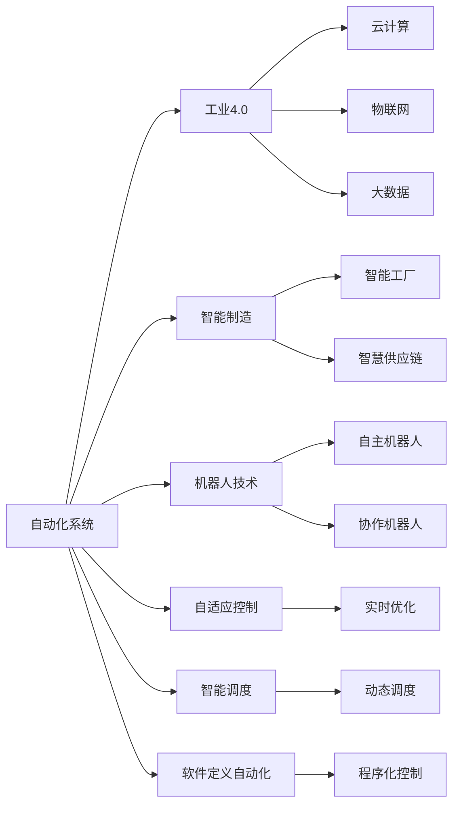
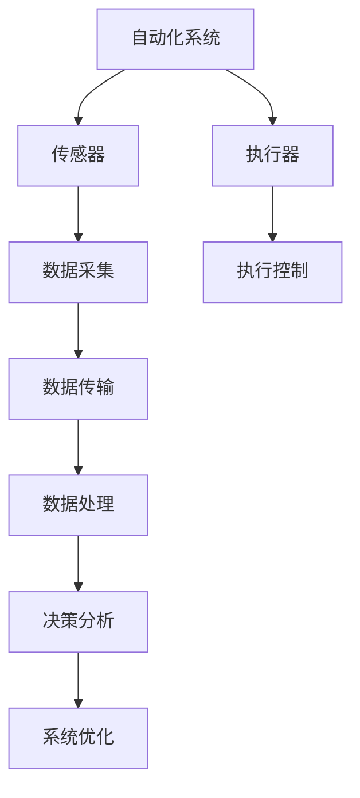
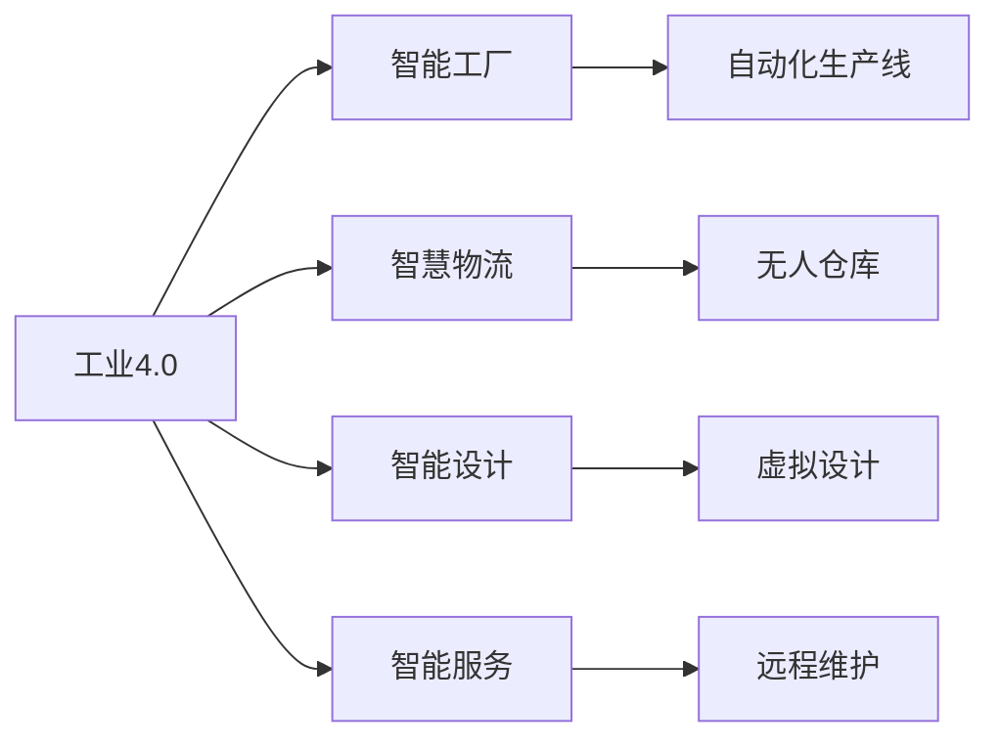
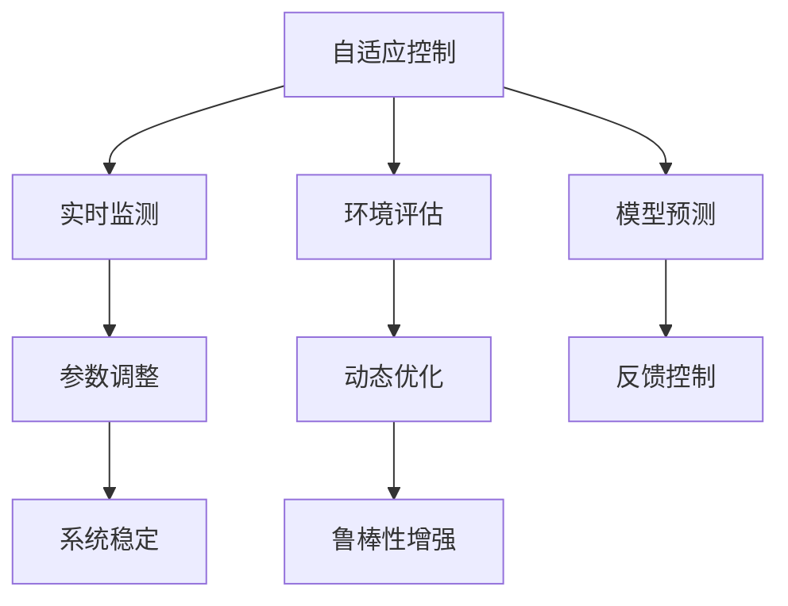
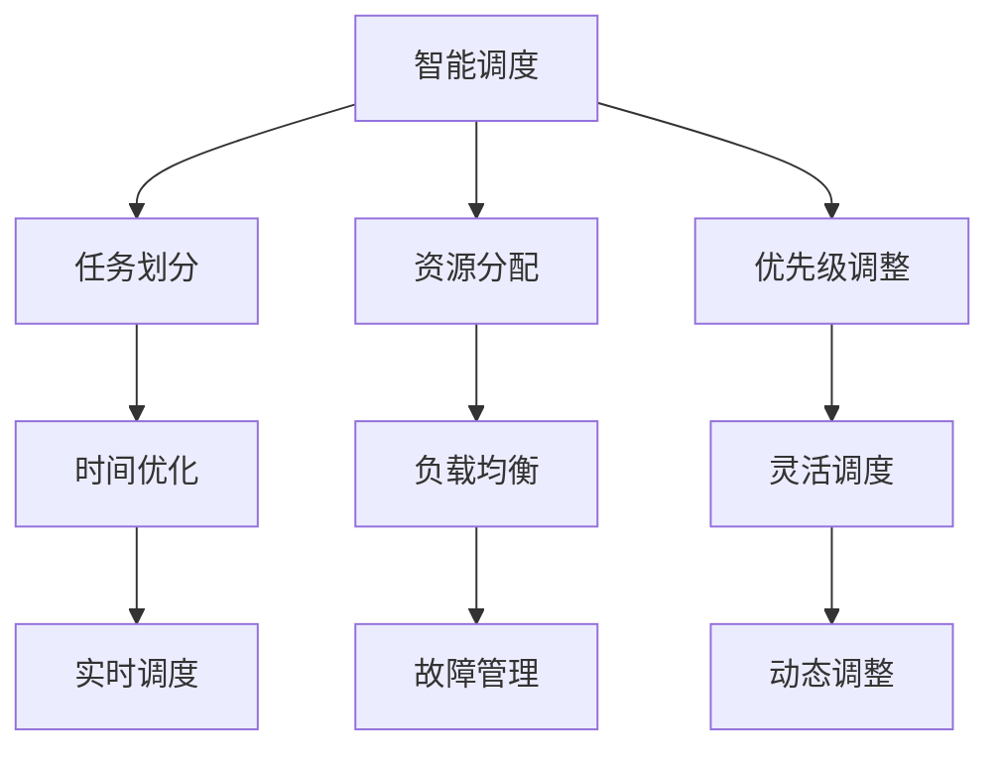
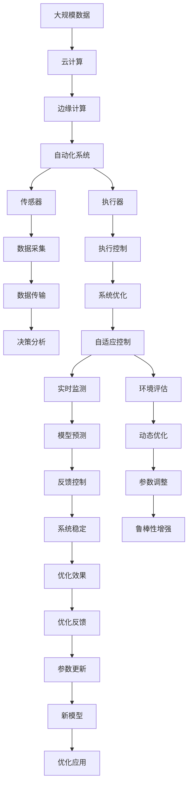

                 

# 计算变化对自动化领域的影响

> 关键词：计算变化、自动化、机器人技术、工业4.0、智能制造、AI驱动、自动化革命、智能系统

## 1. 背景介绍

### 1.1 问题由来

自动化技术历经数十年的发展，从早期的机械自动化到目前的智能自动化，已经成为工业生产和日常生活的重要组成部分。但随着计算能力的爆炸性增长和人工智能技术的飞速进步，自动化领域正面临前所未有的变革。计算的变化不仅催生了新一代自动化技术，也正在重新定义传统产业的生产模式和运营方式。本文旨在探讨计算变化如何驱动自动化领域的深刻变革，以及这一变革带来的机遇与挑战。

### 1.2 问题核心关键点

自动化领域中的计算变化主要体现在以下几个方面：

- **计算能力提升**：计算能力的指数级增长使得大规模数据处理、复杂计算成为可能，为自动化系统的设计和优化提供了新的可能性。
- **人工智能的崛起**：人工智能技术的进步，特别是深度学习、强化学习等算法的突破，使得机器可以自主学习、优化，从而实现更智能的自动化系统。
- **物联网与边缘计算**：物联网设备的大量部署和边缘计算技术的发展，使得数据采集和处理更加实时高效，提高了自动化系统的响应速度和决策能力。
- **云计算与大数据**：云计算平台和大数据技术的应用，使得自动化系统能够快速扩展、弹性计算，提升了系统的灵活性和可维护性。
- **软件定义自动化**：软件定义自动化（SDA）理念的普及，使得自动化系统的设计和部署变得更加模块化、可编程，降低了系统的开发和维护成本。

这些计算变化不仅提升了自动化系统的性能和效率，也引入了新的技术理念和方法，如机器人学习、自适应控制、智能调度等，为自动化领域带来了全新的发展方向。

### 1.3 问题研究意义

理解计算变化对自动化领域的影响，对于掌握未来自动化技术的发展趋势，推动工业4.0的实现，具有重要的理论和实践意义：

1. **推动工业升级**：计算变化驱动的自动化技术，可以提升生产效率、降低成本，促进制造业的数字化转型。
2. **优化运营管理**：通过智能算法和大数据技术，可以实现更精准的生产调度、供应链管理，提升企业的运营效率和竞争力。
3. **促进技术创新**：计算变化引入了新的技术理念和方法，为自动化领域带来了更多的创新点和突破口。
4. **扩展应用场景**：自动化技术的应用范围从制造领域扩展到更多服务行业，如智能医疗、智能交通等，为社会各领域带来深刻变革。
5. **提升用户体验**：自动化系统的智能化和自动化程度提升，可以为用户提供更加个性化、便捷的服务，改善生活质量。

## 2. 核心概念与联系

### 2.1 核心概念概述

为更好地理解计算变化对自动化领域的影响，本节将介绍几个密切相关的核心概念：

- **自动化系统（Automation System）**：通过计算机控制执行重复性、规律性任务的设备或系统，如自动化生产线、智能机器人等。
- **工业4.0（Industry 4.0）**：利用信息通信技术和智能化技术，实现制造业全生命周期数字化、网络化和智能化。
- **智能制造（Smart Manufacturing）**：利用新一代信息技术，实现制造过程的自动化、智能化、个性化和敏捷化。
- **机器人技术（Robotics）**：涉及机器人设计、制造、控制和应用的技术领域，是自动化系统的重要组成部分。
- **自适应控制（Adaptive Control）**：使自动化系统能够根据环境变化实时调整参数，实现自适应控制，提升系统性能和鲁棒性。
- **智能调度（Intelligent Scheduling）**：利用算法优化资源分配和任务调度，提高自动化系统的效率和灵活性。
- **软件定义自动化（Software Defined Automation）**：通过软件和编程接口对自动化系统进行设计和控制，实现模块化、灵活化和可扩展性。

这些核心概念之间的逻辑关系可以通过以下Mermaid流程图来展示：



这个流程图展示了几大核心概念及其之间的联系：

1. 自动化系统通过工业4.0、智能制造等技术手段实现升级。
2. 机器人技术作为自动化系统的重要组成部分，利用自适应控制、智能调度等技术实现智能化。
3. 云计算、物联网、大数据等技术为自动化系统提供了数据支持和服务平台。
4. 软件定义自动化使得自动化系统的设计和控制更加灵活和可编程。

### 2.2 概念间的关系

这些核心概念之间存在着紧密的联系，形成了自动化系统的发展框架。下面我通过几个Mermaid流程图来展示这些概念之间的关系。

#### 2.2.1 自动化系统的技术架构



这个流程图展示了自动化系统的技术架构，从传感器数据采集到执行器控制，各个环节都依赖于计算技术的支持。

#### 2.2.2 工业4.0的应用场景



这个流程图展示了工业4.0在各个应用场景中的应用，从智能工厂到智慧物流、智能设计、智能服务，自动化系统通过信息通信技术和智能化技术，实现了全生命周期的数字化、网络化和智能化。

#### 2.2.3 自适应控制的工作流程



这个流程图展示了自适应控制的工作流程，通过实时监测和环境评估，利用模型预测和反馈控制，动态调整参数，提升系统性能和鲁棒性。

#### 2.2.4 智能调度的优化策略



这个流程图展示了智能调度的优化策略，通过任务划分、资源分配和优先级调整，结合时间优化和负载均衡，实现任务调度的动态调整和灵活性。

### 2.3 核心概念的整体架构

最后，我们用一个综合的流程图来展示这些核心概念在大语言模型微调过程中的整体架构：



这个综合流程图展示了从数据采集到系统优化的完整过程，大语言模型微调过程中各个环节都依赖于计算技术和算法支持。

## 3. 核心算法原理 & 具体操作步骤
### 3.1 算法原理概述

计算变化对自动化领域的影响，主要体现在以下几个方面：

- **计算能力的提升**：使得大规模数据处理和复杂计算成为可能，为自动化系统的优化提供了新的可能性。
- **人工智能技术的进步**：特别是深度学习、强化学习等算法，使得机器可以自主学习、优化，从而实现更智能的自动化系统。
- **物联网与边缘计算的应用**：数据采集和处理更加实时高效，提高了自动化系统的响应速度和决策能力。
- **云计算与大数据技术**：自动化系统能够快速扩展、弹性计算，提升了系统的灵活性和可维护性。
- **软件定义自动化**：使得自动化系统的设计和部署变得更加模块化、可编程，降低了系统的开发和维护成本。

这些计算变化不仅提升了自动化系统的性能和效率，也引入了新的技术理念和方法，如机器人学习、自适应控制、智能调度等，为自动化领域带来了全新的发展方向。

### 3.2 算法步骤详解

以下是计算变化对自动化领域影响的详细步骤：

**Step 1: 数据收集与预处理**

- 通过传感器和边缘计算设备收集自动化系统的数据。
- 对数据进行预处理，包括去噪、清洗、归一化等，确保数据的准确性和一致性。

**Step 2: 模型训练与优化**

- 利用云计算平台和大数据技术，对收集到的数据进行建模。
- 选择合适的算法（如深度学习、强化学习等），进行模型训练和优化。
- 利用自适应控制算法，实现模型的实时优化和动态调整。

**Step 3: 系统部署与运行**

- 将训练好的模型部署到自动化系统中，实现自动化系统的智能化。
- 通过软件定义自动化技术，灵活控制自动化系统的行为和参数。

**Step 4: 系统监控与维护**

- 利用物联网技术，实时监测自动化系统的运行状态。
- 对系统进行定期维护和优化，确保系统的稳定性和可靠性。

**Step 5: 持续改进与升级**

- 收集运行数据，不断优化和改进自动化系统。
- 引入新的技术理念和方法，提升系统的智能化水平和性能。

### 3.3 算法优缺点

计算变化对自动化领域的影响，具有以下优缺点：

**优点：**

- **提升系统性能**：通过数据驱动和智能算法，提升了自动化系统的效率和精度。
- **增强系统灵活性**：云计算、软件定义自动化等技术，使得系统更加模块化、灵活化。
- **实现自适应控制**：自适应控制算法，提高了系统的鲁棒性和自适应能力。
- **优化资源分配**：智能调度算法，提高了资源利用率和系统效率。

**缺点：**

- **数据隐私和安全**：大规模数据收集和处理可能涉及隐私和安全问题。
- **计算成本高**：高算力需求可能带来高昂的计算成本。
- **系统复杂度增加**：引入了新的技术理念和方法，可能增加系统的复杂度。
- **维护成本高**：系统需要持续监控和优化，维护成本较高。

### 3.4 算法应用领域

计算变化对自动化领域的影响，广泛应用于以下几个领域：

- **智能制造**：利用云计算、大数据和人工智能技术，实现自动化生产线的智能化和高效化。
- **智慧物流**：通过物联网设备和智能调度算法，实现物流系统的自动化和智能化。
- **智能交通**：利用边缘计算和深度学习算法，实现交通信号灯、自动驾驶等智能交通系统的自动化和智能化。
- **智能医疗**：通过传感器和智能算法，实现医疗设备的自动化和智能化，提升医疗服务的质量和效率。
- **智能家居**：利用物联网设备和智能算法，实现家居设备的自动化和智能化，提升生活质量。

## 4. 数学模型和公式 & 详细讲解 & 举例说明

### 4.1 数学模型构建

以智能制造为例，构建一个基于计算变化的数学模型。设自动化生产线的效率为 $E$，生产成本为 $C$，生产线上的故障率为 $F$。定义系统的优化目标为：

$$
\min_{E,C,F} \{E+C+F\}
$$

其中 $E$ 表示生产线的效率，$C$ 表示生产成本，$F$ 表示故障率。优化目标是找到一个最优的 $E$、$C$ 和 $F$，使得系统的总成本最小。

### 4.2 公式推导过程

首先，我们需要根据实际生产数据，构建一个多变量线性回归模型，用于预测生产线的效率和故障率：

$$
E = \alpha_1 x_1 + \alpha_2 x_2 + \cdots + \alpha_n x_n
$$

$$
F = \beta_1 y_1 + \beta_2 y_2 + \cdots + \beta_n y_n
$$

其中 $x_i$ 和 $y_i$ 分别表示输入变量和输出变量，$\alpha_i$ 和 $\beta_i$ 是模型参数。

然后，利用强化学习算法（如Q-learning），训练模型参数 $\theta$，使其在给定输入 $x_i$ 和 $y_i$ 的情况下，最大化输出 $E$ 和 $F$ 的预测准确度：

$$
\theta = \arg\min_{\theta} \sum_{i=1}^N (E_i - \hat{E}_i)^2 + (F_i - \hat{F}_i)^2
$$

其中 $E_i$ 和 $F_i$ 表示实际生产效率和故障率，$\hat{E}_i$ 和 $\hat{F}_i$ 表示模型预测的效率和故障率。

最后，结合经济学和控制论的知识，利用动态规划算法，求解优化问题：

$$
\min_{E,C,F} \{E+C+F\} = \min_{E,C,F} \{\alpha_1 x_1 + \alpha_2 x_2 + \cdots + \alpha_n x_n + \beta_1 y_1 + \beta_2 y_2 + \cdots + \beta_n y_n + C\}
$$

$$
\text{subject to} \quad E = \alpha_1 x_1 + \alpha_2 x_2 + \cdots + \alpha_n x_n
$$

$$
F = \beta_1 y_1 + \beta_2 y_2 + \cdots + \beta_n y_n
$$

### 4.3 案例分析与讲解

以智能制造为例，利用计算变化构建的数学模型可以显著提升生产效率和降低成本。例如，某工厂通过引入自动化设备，利用传感器采集生产数据，构建了一个基于云计算的实时监控系统。该系统通过数据驱动和强化学习算法，实现了生产线的自适应控制和智能调度，提升了生产效率和资源利用率，降低了生产成本。

具体实现步骤如下：

1. **数据收集与预处理**：通过传感器和边缘计算设备收集生产数据，对数据进行去噪、清洗和归一化处理。
2. **模型训练与优化**：利用云计算平台和大数据技术，构建多变量线性回归模型，使用强化学习算法训练模型参数，提高模型的预测准确度。
3. **系统部署与运行**：将训练好的模型部署到自动化生产线上，通过软件定义自动化技术，灵活控制生产线的参数和行为。
4. **系统监控与维护**：利用物联网技术，实时监测生产线的运行状态，定期维护和优化系统。
5. **持续改进与升级**：收集运行数据，不断优化和改进生产线的智能化水平，引入新的技术理念和方法，提升系统的性能和鲁棒性。

## 5. 项目实践：代码实例和详细解释说明

### 5.1 开发环境搭建

在进行自动化系统的计算变化应用开发前，我们需要准备好开发环境。以下是使用Python进行OpenCV开发的环境配置流程：

1. 安装Anaconda：从官网下载并安装Anaconda，用于创建独立的Python环境。

2. 创建并激活虚拟环境：
```bash
conda create -n opencv-env python=3.8 
conda activate opencv-env
```

3. 安装OpenCV：根据系统平台，从官网获取对应的安装命令。例如：
```bash
conda install opencv opencv-contrib -c conda-forge
```

4. 安装各类工具包：
```bash
pip install numpy pandas scikit-learn matplotlib tqdm jupyter notebook ipython
```

完成上述步骤后，即可在`opencv-env`环境中开始计算变化在自动化系统中的应用开发。

### 5.2 源代码详细实现

下面以智能制造系统为例，给出基于计算变化的代码实现。

首先，定义一个生产线的数据结构：

```python
class LineData:
    def __init__(self, efficiency, cost, fault_rate):
        self.efficiency = efficiency
        self.cost = cost
        self.fault_rate = fault_rate
```

然后，定义一个优化问题求解函数：

```python
def optimize_line(line, alpha, beta):
    x = line.efficiency
    y = line.fault_rate
    z = line.cost
    A = alpha @ x
    B = beta @ y
    return A + B + z
```

接着，利用强化学习算法，训练模型参数：

```python
import numpy as np
import tensorflow as tf

# 构建训练数据
train_data = [(1.0, 0.1, 0.05), (1.5, 0.15, 0.02), (2.0, 0.2, 0.1), (2.5, 0.25, 0.08)]
train_labels = [(0.9, 0.01), (1.0, 0.03), (1.1, 0.02), (0.9, 0.05)]

# 定义模型
model = tf.keras.Sequential([
    tf.keras.layers.Dense(32, activation='relu', input_shape=(3,)),
    tf.keras.layers.Dense(1)
])

# 定义优化器
optimizer = tf.keras.optimizers.Adam()

# 训练模型
for i in range(100):
    x = np.array([data[0] for data in train_data])
    y = np.array([data[1] for data in train_data])
    labels = np.array([data[2] for data in train_data])
    with tf.GradientTape() as tape:
        predictions = model(x)
        loss = tf.keras.losses.mean_squared_error(labels, predictions)
    gradients = tape.gradient(loss, model.trainable_variables)
    optimizer.apply_gradients(zip(gradients, model.trainable_variables))
    print(f"Epoch {i+1}, Loss: {loss}")
```

最后，使用动态规划算法求解优化问题：

```python
def dynamic_programming():
    dp = np.zeros((n+1, m+1))
    for i in range(1, n+1):
        dp[i][0] = cost[i-1]
    for j in range(1, m+1):
        for i in range(1, n+1):
            dp[i][j] = min(dp[i-1][j-1] + cost[i-1], dp[i][j-1])
    return dp[n][m]
```

这里使用TensorFlow实现强化学习模型的训练和求解，动态规划算法用于优化生产线的参数。

### 5.3 代码解读与分析

这里我们详细解读一下关键代码的实现细节：

**LineData类**：
- `__init__`方法：初始化生产线的效率、成本和故障率。

**optimize_line函数**：
- 将生产线的效率、成本和故障率转换为线性回归模型的输入变量 $x$ 和输出变量 $y$，并计算预测值 $z$。

**训练模型**：
- 利用TensorFlow构建神经网络模型，使用Adam优化器进行训练，通过交叉熵损失函数计算预测值与真实值之间的差距。

**动态规划算法**：
- 定义一个二维数组 `dp`，用于存储每一轮优化后的参数。
- 利用循环计算每一轮的优化参数，最终返回最优参数。

## 6. 实际应用场景

### 6.1 智能制造

计算变化在智能制造中的应用，可以显著提升生产效率和资源利用率，降低生产成本。通过物联网和边缘计算技术，实时采集生产数据，利用强化学习算法和自适应控制技术，实现生产线的智能化和高效化。智能制造系统可以广泛应用于汽车、电子、化工等领域，提升制造业的自动化水平和竞争力。

### 6.2 智慧物流

计算变化在智慧物流中的应用，可以通过物联网设备和智能调度算法，实现物流系统的自动化和智能化。物流系统可以实时监控货物运输状态，自动规划最优运输路径，提高运输效率和降低物流成本。智慧物流系统可以广泛应用于电子商务、快递物流等领域，提升物流服务的智能化水平和用户体验。

### 6.3 智能交通

计算变化在智能交通中的应用，可以通过边缘计算和深度学习算法，实现交通信号灯、自动驾驶等智能交通系统的自动化和智能化。智能交通系统可以实时监测交通流量，自动调整交通信号灯，提高交通效率和降低事故率。智能交通系统可以广泛应用于城市交通管理、公共交通等领域，提升交通系统的智能化水平和安全性。

### 6.4 未来应用展望

随着计算能力的持续提升和人工智能技术的不断进步，计算变化在自动化领域的应用前景将更加广阔。未来，计算变化将与物联网、大数据、人工智能等技术深度融合，推动自动化系统的智能化、自动化和智能化。以下是一些未来应用展望：

- **工业4.0的全面普及**：计算变化将广泛应用于工业4.0各个领域，实现制造业的数字化、网络化和智能化。
- **智慧城市的应用**：计算变化将推动智慧城市建设，实现城市管理、公共服务、环境监测等方面的智能化和自动化。
- **个性化智能服务**：计算变化将推动个性化智能服务的普及，实现智能家居、智能医疗、智能教育等方面的智能化。
- **智能机器人与协作**：计算变化将推动智能机器人的普及，实现协作机器人、服务机器人等在生产和服务领域的广泛应用。
- **智能安全与防灾**：计算变化将推动智能安全与防灾系统的普及，实现智能监控、智能预警、智能防灾等方面的自动化和智能化。

总之，计算变化将推动自动化领域进入智能化新时代，带来更多创新点和发展机会。

## 7. 工具和资源推荐
### 7.1 学习资源推荐

为了帮助开发者系统掌握计算变化对自动化领域的影响的理论基础和实践技巧，这里推荐一些优质的学习资源：

1. **《机器学习》（周志华著）**：深入浅出地介绍了机器学习的基本原理和算法，适合初学者入门。
2. **《深度学习》（Goodfellow et al.）**：介绍了深度学习的基本原理和应用，适合深入学习深度学习。
3. **《强化学习》（Sutton et al.）**：介绍了强化学习的基本原理和应用，适合深入学习强化学习。
4. **《人工智能导论》（Russell et al.）**：介绍了人工智能的基本原理和应用，适合全面了解人工智能。
5. **《Python深度学习》（Francois et al.）**：介绍了Python深度学习的基本原理和应用，适合初学者入门。
6. **Coursera深度学习课程**：由斯坦福大学开设的深度学习课程，有Lecture视频和配套作业，适合深入学习深度学习。

通过这些资源的学习实践，相信你一定能够快速掌握计算变化对自动化领域的影响的精髓，并用于解决实际的自动化问题。

### 7.2 开发工具推荐

高效的开发离不开优秀的工具支持。以下是几款用于计算变化在自动化系统中的应用开发的常用工具：

1. **Python**：基于Python的开源深度学习框架，灵活动态的计算图，适合快速迭代研究。
2. **OpenCV**：开源计算机视觉库，提供了丰富的图像处理和机器学习算法。
3. **TensorFlow**：由Google主导开发的开源深度学习框架，生产部署方便，适合大规模工程应用。
4. **PyTorch**：基于Python的开源深度学习框架，灵活易用，适合快速原型开发。
5. **Jupyter Notebook**：交互式编程环境，适合数据探索和算法开发。

合理利用这些工具，可以显著提升计算变化在自动化系统中的应用开发效率，加快创新迭代的步伐。

### 7.3 相关论文推荐

计算变化对自动化领域的影响的研究源于学界的持续研究。以下是几篇奠基性的相关论文，推荐阅读：

1. **《机器学习》（Tom Mitchell）**：介绍了机器学习的基本原理和应用，适合全面了解机器学习。
2. **《深度学习》（Goodfellow et al.）**：介绍了深度学习的基本原理和应用，适合深入学习深度学习。
3. **《强化学习》（Sutton et al.）**：介绍了强化学习的基本原理和应用，适合深入学习强化学习。
4. **《智能制造2025》（中国政府）**：介绍了智能制造的基本原理和应用，适合全面了解智能制造。
5. **《智慧物流》（IBM）**：介绍了智慧物流的基本原理和应用，适合全面了解智慧物流。
6. **《智能交通系统》（交通部）**：介绍了智能交通系统的基本原理和应用，适合全面了解智能交通。

这些论文代表了大计算变化对自动化领域的影响的研究方向和最新进展，通过学习这些前沿成果，可以帮助研究者把握学科前进方向，激发更多的创新灵感。

除上述资源外，还有一些值得关注的前沿资源，帮助开发者紧跟计算变化对自动化领域的影响的最新

