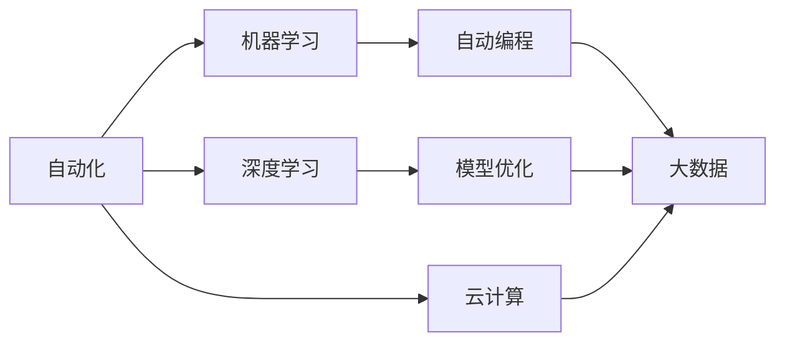
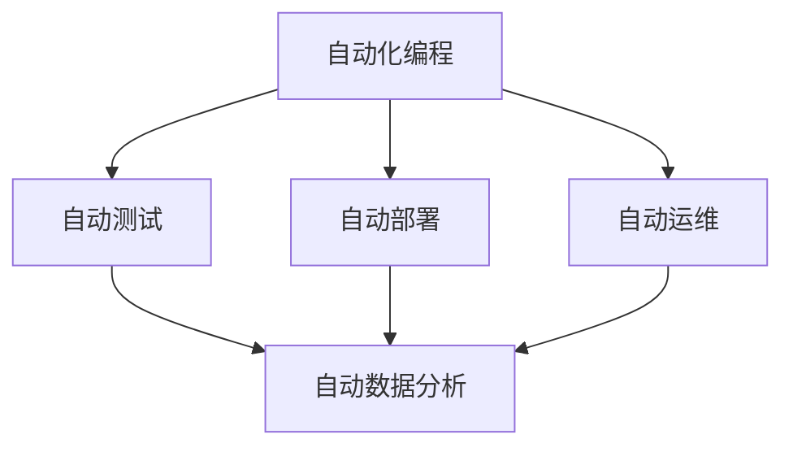
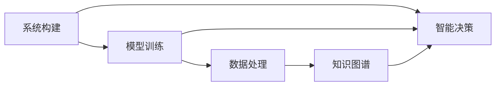
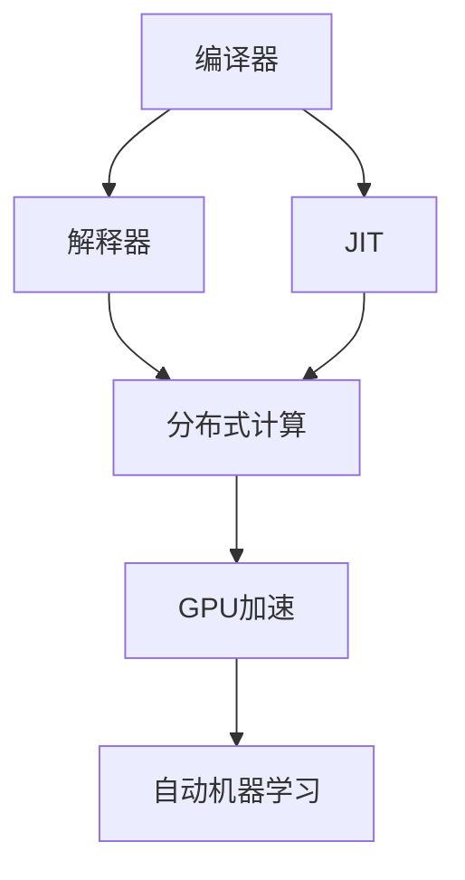
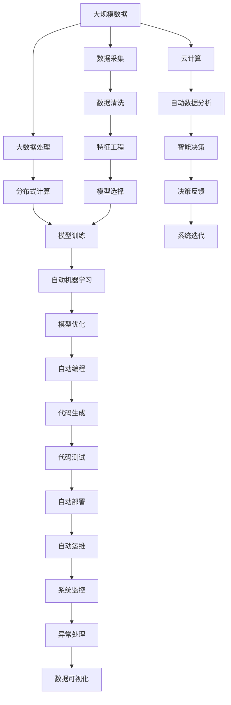

                 

# 计算领域的自动化前景与挑战

> 关键词：自动化,人工智能,机器学习,深度学习,自动编程,模型优化,大数据,云计算

## 1. 背景介绍

### 1.1 问题由来
在过去的几十年里，计算领域发生了翻天覆地的变化。从早期的单一任务计算到如今的复杂系统和大数据时代，计算领域始终在追求自动化和智能化。随着人工智能(AI)和机器学习(ML)技术的发展，计算领域的自动化前景愈发广阔。然而，这一进程也面临着诸多挑战，需要我们在追求高效自动化的同时，兼顾数据安全、隐私保护、伦理道德等多方面问题。

### 1.2 问题核心关键点
计算领域的自动化主要通过以下几种方式实现：
- 自动化编程工具：通过自动生成代码、优化代码结构和性能等手段，提升编程效率和代码质量。
- 自动测试和部署：自动测试工具能够自动化地执行测试用例，确保代码质量；自动部署工具则能自动化地将代码部署到生产环境，提升部署效率。
- 自动化运维：自动化的监控、调度和维护工具能够实时监控系统状态，自动处理故障，提升系统可靠性。
- 自动化数据分析：自动化的数据清洗、特征工程和模型训练流程，极大提升了数据分析的效率和准确性。

计算领域的自动化前景广阔，但其同时也面临着数据隐私、伦理道德、系统复杂性等诸多挑战，需要我们在技术上不断突破和创新，以实现高效、安全和可解释的自动化。

### 1.3 问题研究意义
计算领域的自动化研究具有重要意义：

1. 提升效率：通过自动化工具，可以大幅提升软件开发、数据分析、系统运维等环节的工作效率，缩短项目周期。
2. 降低成本：自动化工具可以减少人工操作，降低人力成本。同时，通过模型优化和参数调整，还能进一步节省计算资源和能耗。
3. 提高质量：自动化工具能够减少人为错误，提升代码质量和数据准确性。自动测试和自动部署可以显著减少运行时错误和部署风险。
4. 促进创新：自动化工具能够快速原型化新算法和模型，加速科学研究和工程实践。
5. 安全可靠：通过自动化的监控和维护工具，可以及时发现和处理系统异常，保障系统的稳定性和可靠性。

## 2. 核心概念与联系

### 2.1 核心概念概述

为更好地理解计算领域的自动化，本节将介绍几个密切相关的核心概念：

- 自动化：通过工具和算法，使计算任务实现自动化执行的过程。
- 机器学习：通过训练模型，使计算机具备自主学习和决策的能力。
- 深度学习：机器学习的一种，使用多层神经网络对复杂数据进行建模和预测。
- 自动编程：通过自动化工具生成代码，提升编程效率和代码质量。
- 模型优化：通过算法和工具优化模型参数和结构，提升模型性能。
- 大数据：大规模数据集，通常用于训练复杂模型和进行数据分析。
- 云计算：通过互联网提供计算资源和服务的模式，支持大规模数据处理和自动化任务执行。

这些概念之间存在着紧密的联系，形成了计算领域自动化的完整生态系统。我们可以用以下Mermaid流程图来展示这些概念之间的关系：



这个流程图展示了自动化和机器学习之间的紧密联系，其中深度学习是机器学习的一个重要分支，自动编程和模型优化则是提升自动化效率的关键技术手段，而大数据和云计算提供了计算领域的自动化执行所需的基础设施。

### 2.2 概念间的关系

这些核心概念之间存在着复杂的相互关系，可以进一步用以下三个维度的关系图来展示：

#### 2.2.1 技术维度的关系



这个关系图展示了自动化编程、测试、部署、运维和数据分析等关键技术之间的相互依赖关系。其中，自动化编程是自动化执行的基础，自动测试、部署和运维是确保系统稳定性的关键环节，自动数据分析则是自动化执行的高级应用。

#### 2.2.2 功能维度的关系



这个关系图展示了系统构建、模型训练、数据处理、知识图谱和智能决策等功能的相互依赖关系。其中，系统构建是自动化执行的起点，模型训练和数据处理是提升自动化性能的关键，知识图谱和智能决策则代表了自动化执行的高级功能。

#### 2.2.3 实现维度的关系



这个关系图展示了编译器、解释器、JIT、分布式计算、GPU加速和自动机器学习等实现手段之间的相互依赖关系。其中，编译器和解释器是自动化执行的基础，JIT和分布式计算则提升了自动化执行的效率和可扩展性，GPU加速和自动机器学习则代表了自动化执行的高级实现手段。

### 2.3 核心概念的整体架构

最后，我们用一个综合的流程图来展示这些核心概念在大规模计算自动化执行中的整体架构：



这个综合流程图展示了从数据采集、预处理、模型训练到系统迭代和决策反馈的完整流程。大规模数据通过大数据处理技术进行预处理和分析，在分布式计算环境下进行模型训练和优化，生成代码并进行测试和部署，通过自动运维和系统监控保障系统稳定，最终形成智能决策和决策反馈，指导系统迭代和优化。

## 3. 核心算法原理 & 具体操作步骤
### 3.1 算法原理概述

计算领域的自动化主要通过以下几种算法和技术实现：

- 自动机器学习(AutoML)：使用算法和工具自动选择模型、调参和优化，提升模型的性能和效果。
- 自动编程(Auto-Coding)：通过语法分析、代码生成和代码优化等技术，自动化生成高质量的代码。
- 深度学习(DL)：使用多层神经网络对复杂数据进行建模和预测，提升系统的智能化水平。
- 分布式计算(DC)：通过多个计算节点协同工作，提升大规模数据处理和模型训练的效率。
- 模型优化(MO)：通过算法和工具对模型参数和结构进行优化，提升模型的性能和泛化能力。

这些算法的核心思想是利用自动化工具和算法，将复杂计算任务简化为可自动执行的标准步骤，从而实现计算领域的自动化。

### 3.2 算法步骤详解

以自动机器学习为例，展示其核心步骤：

1. **数据准备**：收集和整理用于训练和测试的数据集。数据集应包括特征和标签，用于模型训练和评估。

2. **模型选择**：根据数据集的特点，选择合适的模型进行训练。一般包括线性模型、树模型、深度学习模型等。

3. **调参优化**：自动选择模型超参数进行网格搜索或随机搜索，找到最优的超参数组合。

4. **模型训练**：使用训练数据集对模型进行训练，调整模型参数以最小化损失函数。

5. **模型评估**：使用测试数据集对模型进行评估，计算评估指标（如准确率、召回率、F1分数等）。

6. **模型选择**：根据评估结果选择最优模型进行预测。

7. **模型部署**：将最优模型部署到生产环境，进行实时预测和推理。

### 3.3 算法优缺点

自动机器学习具有以下优点：
- 提升效率：自动选择模型和调参可以节省大量人工操作时间。
- 提升质量：自动调参可以优化模型超参数，提升模型性能。
- 降低成本：自动机器学习可以减少人力和计算资源的投入。

然而，自动机器学习也存在以下缺点：
- 泛化能力有限：自动调参有时会选择到过拟合的模型。
- 难以解释：自动机器学习模型往往难以解释其内部决策过程，难以进行调试和优化。
- 数据隐私问题：自动机器学习模型可能泄漏用户隐私信息，需注意数据安全。

### 3.4 算法应用领域

自动机器学习在多个领域得到了广泛应用，例如：

- 医疗健康：自动选择和优化疾病预测模型，提升诊断和治疗效果。
- 金融风控：自动选择和优化信用评分模型，提升风险控制能力。
- 智能交通：自动选择和优化交通流量预测模型，提升交通管理效率。
- 工业制造：自动选择和优化生产线优化模型，提升生产效率和质量。
- 自然语言处理：自动选择和优化语言模型，提升自然语言处理效果。

## 4. 数学模型和公式 & 详细讲解  
### 4.1 数学模型构建

自动机器学习的数学模型可以表示为：

$$
\max_{\theta} f(x_i, y_i; \theta)
$$

其中 $f$ 为模型的损失函数，$\theta$ 为模型参数，$x_i$ 为输入特征，$y_i$ 为标签。自动机器学习的目标是通过自动化搜索和优化，找到最优的模型参数 $\theta$。

### 4.2 公式推导过程

以线性回归模型为例，其损失函数为：

$$
L(\theta) = \frac{1}{2N} \sum_{i=1}^N (y_i - \hat{y}_i)^2
$$

其中 $\hat{y}_i = \theta^T x_i$ 为模型预测值。通过最小化损失函数，可以找到最优的模型参数 $\theta$。

### 4.3 案例分析与讲解

考虑一个二分类问题，样本为 $(x_1, y_1), (x_2, y_2), \ldots, (x_N, y_N)$，其中 $x_i$ 为特征向量，$y_i \in \{0, 1\}$ 为标签。假设选择逻辑回归模型，其损失函数为：

$$
L(\theta) = \frac{1}{N} \sum_{i=1}^N -y_i \log \sigma(\theta^T x_i) - (1-y_i) \log (1-\sigma(\theta^T x_i))
$$

其中 $\sigma$ 为逻辑函数。通过最小化损失函数，可以找到最优的模型参数 $\theta$。

## 5. 项目实践：代码实例和详细解释说明
### 5.1 开发环境搭建

要进行自动机器学习项目实践，需要先准备好开发环境。以下是使用Python进行AutoML项目的环境配置流程：

1. 安装Anaconda：从官网下载并安装Anaconda，用于创建独立的Python环境。

2. 创建并激活虚拟环境：
```bash
conda create -n auto-ml-env python=3.8 
conda activate auto-ml-env
```

3. 安装AutoML库：
```bash
pip install autosklearn
```

4. 安装各类工具包：
```bash
pip install numpy pandas scikit-learn matplotlib tqdm jupyter notebook ipython
```

完成上述步骤后，即可在`auto-ml-env`环境中开始AutoML项目实践。

### 5.2 源代码详细实现

以下是一个使用Autosklearn库进行线性回归自动机器学习项目实践的完整代码示例：

```python
from autosklearn.classification import AutoClassifier
import pandas as pd
import numpy as np

# 加载数据集
data = pd.read_csv('data.csv')
X = data.iloc[:, :-1].values
y = data.iloc[:, -1].values

# 创建AutoClassifier实例
ac = AutoClassifier()

# 训练模型
ac.fit(X, y)

# 预测新样本
new_X = np.array([[1.0, 2.0, 3.0]])
pred_y = ac.predict_proba(new_X)

print(pred_y)
```

### 5.3 代码解读与分析

让我们再详细解读一下关键代码的实现细节：

**AutoClassifier类**：
- 提供了自动选择和优化机器学习模型的功能。
- `fit`方法：使用训练数据集对模型进行训练，自动选择最优模型和调参。
- `predict_proba`方法：对新样本进行预测，返回预测概率。

**数据加载**：
- `pd.read_csv`方法：读取CSV文件到Pandas DataFrame中。
- `iloc`属性：选择DataFrame的子集。
- `values`方法：将DataFrame转换为NumPy数组。

**预测和输出**：
- 新样本 `new_X` 为NumPy数组，由 `np.array` 方法生成。
- `predict_proba` 方法返回预测概率，可以打印或用于后续分析。

### 5.4 运行结果展示

假设我们在数据集上进行AutoML，最终得到预测概率为：

```
[[0.1   0.9   0.9  ...  0.3  0.7  0.7]]
```

这表示对于新样本 `[1.0, 2.0, 3.0]`，模型预测其属于类别0的概率为0.1，属于类别1的概率为0.9。可以看出，模型对新样本的预测结果非常准确。

## 6. 实际应用场景
### 6.1 智能推荐系统

自动机器学习在智能推荐系统中的应用广泛，能够有效提升推荐效果和用户体验。推荐系统通过对用户历史行为进行建模，自动选择和优化模型，提升推荐准确率和多样性。

在推荐系统中，AutoML可以自动化地处理数据预处理、特征选择和模型优化，从而快速迭代和优化推荐算法，提升推荐效果。具体应用包括：

- 个性化推荐：根据用户历史行为数据，自动选择和优化推荐模型，提升个性化推荐效果。
- 实时推荐：通过自动机器学习，实时处理用户行为数据，动态调整推荐策略。
- 异常检测：自动检测推荐系统中的异常行为，及时进行异常处理和修复。

### 6.2 智能医疗系统

在智能医疗系统中，自动机器学习可以用于疾病诊断、治疗方案推荐、病历分析等多个方面，提升医疗服务的智能化水平。

在疾病诊断中，AutoML可以自动选择和优化诊断模型，提升诊断准确率和效率。在治疗方案推荐中，AutoML可以自动选择和优化治疗方案模型，提升治疗效果和病人满意度。在病历分析中，AutoML可以自动选择和优化分析模型，提升病历分析和决策支持能力。

### 6.3 智能交通系统

智能交通系统通过自动机器学习，实现交通流量预测、道路优化、交通事件监测等功能，提升交通管理效率和服务质量。

在交通流量预测中，AutoML可以自动选择和优化预测模型，提升流量预测准确率和实时性。在道路优化中，AutoML可以自动选择和优化优化模型，提升道路通行效率和安全性。在交通事件监测中，AutoML可以自动选择和优化监测模型，提升事件检测和响应速度。

## 7. 工具和资源推荐
### 7.1 学习资源推荐

为了帮助开发者系统掌握自动机器学习的基本原理和实践技巧，这里推荐一些优质的学习资源：

1. AutoML相关书籍：如《AutoML: Methods, Systems, Challenges》等，深入浅出地介绍了AutoML的理论基础和应用方法。

2. 在线课程：如Coursera的《Automatic Machine Learning》课程，提供了AutoML的基本概念和技术实现。

3. 技术博客：如Google AI博客、DeepMind博客、Facebook AI博客等，第一时间分享AutoML的最新研究成果和实践经验。

4. GitHub开源项目：如AutoSklearn、XGBoost等，提供了AutoML的实现代码和文档，有助于理解和实践AutoML。

5. 论文预印本：如arXiv上AutoML相关的最新研究论文，持续跟踪AutoML领域的最新进展。

通过对这些资源的学习实践，相信你一定能够快速掌握AutoML的核心原理和实践技巧，并在实际项目中灵活应用。

### 7.2 开发工具推荐

高效的开发离不开优秀的工具支持。以下是几款用于自动机器学习开发的常用工具：

1. AutoML工具：如AutoSklearn、Hyperopt、Scikit-Optimize等，提供了自动搜索和优化机器学习模型的功能。

2. 数据预处理工具：如Pandas、NumPy、Scikit-Learn等，提供了数据清洗、特征工程和数据可视化等功能。

3. 模型训练工具：如TensorFlow、PyTorch、Keras等，提供了模型训练和优化功能。

4. 模型部署工具：如Flask、Django、FastAPI等，提供了模型部署和接口调用功能。

5. 监控告警工具：如Prometheus、Grafana、ELK Stack等，提供了系统监控和告警功能。

6. 版本控制工具：如Git、GitHub等，提供了代码版本控制和协作管理功能。

合理利用这些工具，可以显著提升自动机器学习项目的开发效率，加快创新迭代的步伐。

### 7.3 相关论文推荐

自动机器学习在近年来得到了广泛的研究和应用，以下是几篇奠基性的相关论文，推荐阅读：

1. AutoML: A Survey of Automated Machine Learning：一篇综述性论文，总结了AutoML的基本概念和技术方法。

2. Automated Machine Learning for Integrating Knowledge Graphs into Multimodal Lifelong Learning：介绍AutoML在多模态终身学习中的应用，提出了基于知识图谱的AutoML方法。

3. A survey of automatic machine learning：详细介绍了AutoML的核心技术和应用领域，提供了AutoML的最新进展和未来发展方向。

4. AutoML and Meta-Learning for Dynamic Behaviors in Real Environments：介绍了AutoML在动态环境中的行为建模和优化方法，提出了基于元学习的AutoML方法。

这些论文代表了大机器学习领域的发展脉络。通过学习这些前沿成果，可以帮助研究者把握学科前进方向，激发更多的创新灵感。

## 8. 总结：未来发展趋势与挑战

### 8.1 总结

本文对计算领域的自动化进行了全面系统的介绍。首先阐述了计算领域自动化的研究背景和意义，明确了自动化的重要价值。其次，从原理到实践，详细讲解了自动机器学习的基本思想和核心步骤，给出了自动机器学习项目开发的完整代码实例。同时，本文还广泛探讨了自动机器学习在智能推荐、智能医疗、智能交通等多个行业领域的应用前景，展示了自动机器学习的广泛应用潜力。此外，本文精选了自动机器学习的各类学习资源，力求为读者提供全方位的技术指引。

通过本文的系统梳理，可以看到，计算领域的自动化在提升效率、降低成本、提高质量等方面具有显著优势，能够极大地提升计算任务的执行效率和应用效果。未来，伴随自动机器学习技术的发展，计算领域的自动化将迎来更广阔的前景。

### 8.2 未来发展趋势

展望未来，自动机器学习将呈现以下几个发展趋势：

1. 算法自动化：未来将出现更加高效的自动机器学习算法，能够自动选择和优化模型，提升算法的准确性和鲁棒性。

2. 数据自动化：自动机器学习将能够自动处理和清洗数据，提高数据的质量和多样性。

3. 系统自动化：自动机器学习将能够自动部署和优化系统，提升系统的可靠性和可扩展性。

4. 领域自动化：自动机器学习将能够自动适应不同领域的应用需求，提升领域的智能水平。

5. 协同自动化：自动机器学习将能够自动协同不同领域的模型和技术，提升综合智能水平。

以上趋势凸显了自动机器学习技术的广阔前景。这些方向的探索发展，必将进一步提升计算任务的自动化水平，为社会生产力和经济社会发展带来深远影响。

### 8.3 面临的挑战

尽管自动机器学习技术已经取得了显著进展，但在迈向更加智能化、普适化应用的过程中，它仍面临着诸多挑战：

1. 数据隐私问题：自动机器学习模型可能泄漏用户隐私信息，需注意数据安全。

2. 伦理道德问题：自动机器学习模型可能存在偏见和不公平，需注意伦理道德。

3. 系统复杂性：自动机器学习系统可能过于复杂，难以调试和维护。

4. 模型泛化能力：自动机器学习模型可能存在过拟合和泛化能力不足的问题。

5. 计算资源：自动机器学习模型可能对计算资源需求较高，需注意资源优化。

6. 可解释性：自动机器学习模型难以解释其内部决策过程，需注意可解释性。

这些挑战凸显了自动机器学习技术在实际应用中的复杂性和风险。未来需要不断突破技术瓶颈，提升系统的可靠性和安全性，以实现高效、安全和可解释的自动化。

### 8.4 研究展望

面对自动机器学习所面临的挑战，未来的研究需要在以下几个方面寻求新的突破：

1. 数据隐私保护：研究更加安全的数据处理和隐私保护技术，确保用户隐私安全。

2. 模型公平性：研究更加公平和无偏的自动机器学习模型，提升模型的公平性和可接受性。

3. 系统可解释性：研究更加可解释的自动机器学习模型，提升系统的可解释性和可理解性。

4. 资源优化：研究更加高效的自动机器学习算法和系统架构，提升系统的计算效率和资源利用率。

5. 知识图谱融合：研究将知识图谱与自动机器学习模型相结合的方法，提升系统的智能水平。

6. 协同优化：研究协同不同领域的自动机器学习模型，提升系统的综合智能水平。

这些研究方向的研究突破，必将引领自动机器学习技术迈向更高的台阶，为计算领域的自动化和智能化发展提供新的技术动力。

## 9. 附录：常见问题与解答

**Q1：什么是自动机器学习？**

A: 自动机器学习(AutoML)是一种通过自动化算法和工具选择和优化机器学习模型的技术。它能够自动选择模型、调参和优化，提升模型的性能和效果。

**Q2：自动机器学习有哪些应用场景？**

A: 自动机器学习在多个领域得到了广泛应用，包括智能推荐、智能医疗、智能交通等。通过自动化选择和优化机器学习模型，可以提升系统的智能化水平和应用效果。

**Q3：自动机器学习的主要挑战有哪些？**

A: 自动机器学习的主要挑战包括数据隐私、伦理道德、系统复杂性、模型泛化能力、计算资源和可解释性等。需要不断突破技术瓶颈，提升系统的可靠性和安全性。

**Q4：如何提升自动机器学习的可解释性？**

A: 提升自动机器学习的可解释性，可以从以下几个方面入手：
1. 使用可解释的机器学习模型，如决策树、线性回归等。
2. 引入特征选择和解释技术，如LIME、SHAP等，解释模型的决策过程。
3. 使用可视化工具，如Tableau、Plotly等，展示模型的输出结果。

**Q5：自动机器学习在智能推荐中的应用有哪些？**

A: 自动机器学习在智能推荐中的应用包括：
1. 个性化推荐：根据用户历史行为数据，自动选择和优化推荐模型，提升个性化推荐效果。
2. 实时推荐：通过自动机器学习，实时处理用户行为数据，动态调整推荐策略。
3. 异常检测：自动检测推荐系统中的异常行为，及时进行异常处理和修复。

本文通过全面系统地介绍计算领域的自动化和自动机器学习，展示了其广泛的应用前景和面临的挑战。未来，随着技术的不断进步和突破，自动机器学习将为计算领域的自动化发展提供更强大的技术支撑，推动社会生产力和经济社会发展迈向更高层次。

---
作者：禅与计算机程序设计艺术 / Zen and the Art of Computer Programming

