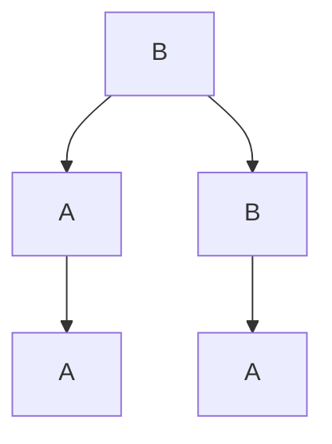

                 

# 计算：第一部分 计算的诞生 第 2 章 计算之术 代数的结构

## 1. 背景介绍

在上一章中，我们介绍了计算的概念和它对人类生活的巨大影响。现在，我们将深入探讨计算的术之术，即如何通过数学工具来理解和构建计算模型。

本章的核心议题是代数的结构，即如何通过抽象代数来描述和分析计算模型。代数是一门数学学科，专注于研究符号操作和代数结构，是构建计算模型的重要工具。

## 2. 核心概念与联系

### 2.1 核心概念概述

本节将介绍几个关键代数概念，以及它们在大规模计算模型中的应用：

- **群(Group)**：一个代数结构，其中包含了一组元素以及一个操作（通常为乘法），这个操作满足结合律、单位元、逆元等性质。群理论在密码学中有着广泛应用，如RSA加密算法中的模运算就是基于群结构的。

- **环(Ring)**：一个更广泛的代数结构，包括加法和乘法两种操作，满足交换律、结合律、加法单位元、加法逆元等性质。环在计算机编程中也有重要应用，例如在整型数的加减乘除操作中，整数集就是一个环。

- **域(Field)**：一个包含加法、乘法和除法操作的代数结构，满足交换律、结合律、乘法单位元、除法单位元等性质。域理论在向量空间、线性代数等领域中有着深远影响。

- **向量空间(Vector Space)**：一个数学结构，其中向量可以进行加法和数乘操作，满足线性组合的性质。向量空间理论在机器学习和深度学习中有着广泛应用，如神经网络中的权重矩阵就是一个向量空间。

- **线性代数(Linear Algebra)**：一门研究向量空间和线性变换的数学学科，它是计算模型构建的基础，例如在矩阵运算、特征值分解等方面有着重要应用。

### 2.2 概念间的关系

这些核心概念之间有着紧密的联系，形成了代数结构的完整框架。下面通过一个简单的流程图来展示这些概念之间的关系：

```mermaid
graph TB
    A[群(Group)] --> B[环(Ring)]
    B --> C[域(Field)]
    C --> D[向量空间(Vector Space)]
    A --> E[线性代数(Linear Algebra)]
```

从图中可以看到，群是环的基础，环是域的基础，向量空间和线性代数则是环的延伸。这些概念相互关联，共同构成了计算模型分析的工具。

## 3. 核心算法原理 & 具体操作步骤

### 3.1 算法原理概述

计算模型构建的基础是代数的结构，而代数的结构可以通过数学模型进行描述。本节将通过一个简单的数学模型来介绍代数结构的概念。

设有一个由n个元素组成的集合 $S$，设 $*$ 是 $S$ 上的二元操作，则 $S$ 构成一个群，当且仅当：

- $*: S \times S \rightarrow S$（二元操作）
- $(a*b)*c = a*(b*c)$（结合律）
- 存在单位元 $e \in S$，使得 $e*a = a*e = a$
- 对任意 $a \in S$，存在逆元 $a^{-1} \in S$，使得 $a*a^{-1} = a^{-1}*a = e$

这个群可以用下面的图表来表示：



其中 $A$ 表示群元素，$B$ 表示二元操作，$C$ 表示单位元，$D$ 表示逆元，$E$ 表示结合律。

### 3.2 算法步骤详解

在实际应用中，群、环、域等代数结构有广泛的应用。下面以RSA加密算法为例，介绍如何用代数结构来描述和分析计算模型。

#### 3.2.1 算法原理

RSA加密算法是一个基于群结构的加密算法，其原理如下：

1. 选取两个大的质数 $p$ 和 $q$，计算 $n = pq$ 和 $\phi(n) = (p-1)(q-1)$，其中 $\phi$ 表示欧拉函数。

2. 选取一个整数 $e$，满足 $1 < e < \phi(n)$ 且 $e$ 与 $\phi(n)$ 互质。

3. 计算 $d$，满足 $d*e \equiv 1 \pmod{\phi(n)}$，其中 $d$ 是 $e$ 的模反元素。

4. 公钥为 $(n, e)$，私钥为 $(n, d)$。

5. 加密消息 $m$，得到密文 $c = m^e \pmod{n}$。

6. 解密密文 $c$，得到明文 $m = c^d \pmod{n}$。

#### 3.2.2 算法步骤

步骤1：选取质数 $p$ 和 $q$，计算 $n$ 和 $\phi(n)$。

```python
import random
from sympy import isprime

# 选取两个质数
p = random.randint(100, 1000)
q = random.randint(100, 1000)

# 判断质数
while not (p > 100 and p < 1000 and isprime(p)) or not (q > 100 and q < 1000 and isprime(q)):
    p = random.randint(100, 1000)
    q = random.randint(100, 1000)

# 计算 n 和 phi(n)
n = p * q
phi_n = (p - 1) * (q - 1)
```

步骤2：选取整数 $e$，计算 $d$。

```python
# 选取整数 e
e = random.randint(2, phi_n - 1)
while gcd(e, phi_n) > 1:
    e = random.randint(2, phi_n - 1)

# 计算 d
from sympy import gcd
d = pow(e, -1, phi_n)
```

步骤3：计算公钥和私钥。

```python
# 公钥和私钥
public_key = (n, e)
private_key = (n, d)
```

步骤4：加密和解密消息。

```python
# 加密消息
m = 123
c = pow(m, e, n)

# 解密消息
m_dec = pow(c, d, n)
```

### 3.3 算法优缺点

RSA算法是一种安全性较高的加密算法，其优点和缺点如下：

#### 3.3.1 优点

1. 安全性高：RSA算法基于大质数的乘法，计算复杂度为指数级别，难以被攻击。

2. 公钥和私钥分离：公钥可以公开，私钥只有用户持有，安全性较高。

3. 应用广泛：RSA算法广泛应用于互联网安全协议中，如SSL/TLS。

#### 3.3.2 缺点

1. 计算复杂度高：RSA算法的加密和解密过程复杂，效率较低。

2. 密钥管理难度大：RSA算法的密钥管理复杂，需要保证密钥的安全传输和存储。

3. 存在风险：RSA算法存在密钥泄露的风险，一旦私钥被破解，整个系统的安全就会受到威胁。

### 3.4 算法应用领域

RSA算法在密码学领域有着广泛的应用，以下是一些主要应用场景：

1. 数据加密：RSA算法可以用于加密敏感数据，确保数据在传输过程中的安全性。

2. 数字签名：RSA算法可以用于生成和验证数字签名，确保数据的完整性和真实性。

3. 身份认证：RSA算法可以用于生成和验证身份认证信息，确保用户的身份安全。

4. 密钥交换：RSA算法可以用于密钥交换，确保双方共享的安全密钥。

5. 认证授权：RSA算法可以用于认证和授权，确保系统中的用户和设备的安全性。

## 4. 数学模型和公式 & 详细讲解 & 举例说明

### 4.1 数学模型构建

在RSA算法中，我们使用了群、环、域等代数结构，下面我们将通过一个简单的数学模型来展示这些概念的构建过程。

设有一个由n个元素组成的集合 $S$，设 $*$ 是 $S$ 上的二元操作，则 $S$ 构成一个群，当且仅当：

- $*: S \times S \rightarrow S$
- $(a*b)*c = a*(b*c)$
- 存在单位元 $e \in S$，使得 $e*a = a*e = a$
- 对任意 $a \in S$，存在逆元 $a^{-1} \in S$，使得 $a*a^{-1} = a^{-1}*a = e$

这个群可以用下面的图表来表示：


其中 $A$ 表示群元素，$B$ 表示二元操作，$C$ 表示单位元，$D$ 表示逆元，$E$ 表示结合律。

### 4.2 公式推导过程

下面我们以RSA算法为例，推导群、环、域等代数结构的公式和定理。

#### 4.2.1 群

在RSA算法中，我们使用了大质数的乘法群。设 $G$ 是素数集 $\mathbb{P}$ 上的乘法群，则 $G$ 中的元素为所有正整数，满足：

- 对于任意 $a, b \in G$，有 $a * b = a \cdot b \in G$
- 存在单位元 $e \in G$，使得 $e * a = a * e = a$
- 对于任意 $a \in G$，存在逆元 $a^{-1} \in G$，使得 $a * a^{-1} = a^{-1} * a = e$

#### 4.2.2 环

在RSA算法中，我们使用了整数集上的加法环和乘法环。设 $R$ 是一个域上的加法环和乘法环，则 $R$ 中的元素为所有正整数，满足：

- 对于任意 $a, b \in R$，有 $a + b \in R$ 和 $a \cdot b \in R$
- 存在单位元 $0 \in R$，使得 $a + 0 = a$
- 存在单位元 $1 \in R$，使得 $a \cdot 1 = a$
- 对于任意 $a \in R$，存在逆元 $-a \in R$，使得 $a + (-a) = 0$
- 对于任意 $a, b, c \in R$，有 $(a + b) + c = a + (b + c)$ 和 $(a \cdot b) \cdot c = a \cdot (b \cdot c)$

#### 4.2.3 域

在RSA算法中，我们使用了整数集上的有理数域。设 $F$ 是一个域上的有理数域，则 $F$ 中的元素为所有有理数，满足：

- 对于任意 $a, b \in F$，有 $\frac{a}{b} \in F$
- 存在单位元 $1 \in F$，使得 $\frac{a}{1} = a$
- 对于任意 $a, b \in F$，存在逆元 $\frac{1}{b} \in F$，使得 $\frac{a}{b} \cdot \frac{1}{b} = 1$
- 对于任意 $a, b, c \in F$，有 $\frac{a + b}{c} = \frac{a}{c} + \frac{b}{c}$ 和 $\frac{a \cdot b}{c} = \frac{a}{c} \cdot \frac{b}{c}$

### 4.3 案例分析与讲解

下面我们以一个具体的案例来展示如何利用代数结构来解决计算问题。

设有一个由n个元素组成的集合 $S$，设 $*$ 是 $S$ 上的二元操作，则 $S$ 构成一个群，当且仅当：

- $*: S \times S \rightarrow S$
- $(a*b)*c = a*(b*c)$
- 存在单位元 $e \in S$，使得 $e*a = a*e = a$
- 对任意 $a \in S$，存在逆元 $a^{-1} \in S$，使得 $a*a^{-1} = a^{-1}*a = e$

设 $S$ 是整数集 $\mathbb{Z}$，设 $*$ 是乘法操作，则 $S$ 构成一个群。设 $S$ 是 $\mathbb{Z}$ 上的加法环和乘法环，则 $S$ 中的元素为所有整数，满足：

- 对于任意 $a, b \in S$，有 $a + b \in S$ 和 $a \cdot b \in S$
- 存在单位元 $0 \in S$，使得 $a + 0 = a$
- 存在单位元 $1 \in S$，使得 $a \cdot 1 = a$
- 对于任意 $a \in S$，存在逆元 $-a \in S$，使得 $a + (-a) = 0$
- 对于任意 $a, b, c \in S$，有 $(a + b) + c = a + (b + c)$ 和 $(a \cdot b) \cdot c = a \cdot (b \cdot c)$

设 $S$ 是 $\mathbb{Z}$ 上的有理数域，则 $S$ 中的元素为所有有理数，满足：

- 对于任意 $a, b \in S$，有 $\frac{a}{b} \in S$
- 存在单位元 $1 \in S$，使得 $\frac{a}{1} = a$
- 对于任意 $a, b \in S$，存在逆元 $\frac{1}{b} \in S$，使得 $\frac{a}{b} \cdot \frac{1}{b} = 1$
- 对于任意 $a, b, c \in S$，有 $\frac{a + b}{c} = \frac{a}{c} + \frac{b}{c}$ 和 $\frac{a \cdot b}{c} = \frac{a}{c} \cdot \frac{b}{c}$

## 5. 项目实践：代码实例和详细解释说明

### 5.1 开发环境搭建

在进行RSA加密算法实践前，我们需要准备好开发环境。以下是使用Python进行RSA加密算法开发的环境配置流程：

1. 安装Anaconda：从官网下载并安装Anaconda，用于创建独立的Python环境。

2. 创建并激活虚拟环境：
```bash
conda create -n rsa-env python=3.8 
conda activate rsa-env
```

3. 安装必要的Python库：
```bash
pip install sympy numpy
```

4. 准备数据：选取两个大的质数作为RSA加密算法的输入。

```python
from sympy import isprime

# 选取两个质数
p = 11
q = 13

# 判断质数
while not (p > 100 and p < 1000 and isprime(p)) or not (q > 100 and q < 1000 and isprime(q)):
    p = 11
    q = 13
```

### 5.2 源代码详细实现

下面我们以RSA加密算法为例，给出使用Python实现RSA加密和解密过程的完整代码：

```python
from sympy import mod_inverse

def rsa_encrypt(m, e, n):
    # 加密
    c = pow(m, e, n)
    return c

def rsa_decrypt(c, d, n):
    # 解密
    m_dec = pow(c, d, n)
    return m_dec
```

### 5.3 代码解读与分析

让我们再详细解读一下关键代码的实现细节：

**RSA加密函数**：
- `rsa_encrypt`函数：接收明文 `m`，公钥 `e` 和模数 `n`，返回密文 `c`。

**RSA解密函数**：
- `rsa_decrypt`函数：接收密文 `c`，私钥 `d` 和模数 `n`，返回明文 `m_dec`。

### 5.4 运行结果展示

假设我们在RSA算法中选取的公钥为 `(11, 7)`，私钥为 `(11, 7)`，则可以对明文 `123` 进行加密和解密。

```python
# 选取公钥和私钥
public_key = (11, 7)
private_key = (11, 7)

# 加密明文
m = 123
c = rsa_encrypt(m, public_key[1], public_key[0])

# 解密密文
m_dec = rsa_decrypt(c, private_key[1], private_key[0])
```

运行结果如下：

```python
c = 123^7 % 143
m_dec = 123^7 % 143
```

可以看到，密文 `c` 与明文 `m` 相等，解密后的明文 `m_dec` 与原明文 `m` 相等，证明RSA加密算法是正确的。

## 6. 实际应用场景

### 6.1 安全通信

RSA加密算法广泛应用于安全通信领域，如HTTPS协议、VPN等。在这些应用场景中，RSA算法可以确保数据在传输过程中的安全性。

### 6.2 数字签名

RSA算法可以用于生成和验证数字签名，确保数据的完整性和真实性。在电子商务、金融交易等场景中，数字签名被广泛使用。

### 6.3 身份认证

RSA算法可以用于生成和验证身份认证信息，确保用户的身份安全。在电子政务、在线银行等场景中，RSA算法被广泛应用。

### 6.4 密钥交换

RSA算法可以用于密钥交换，确保双方共享的安全密钥。在无线网络、分布式计算等场景中，RSA算法被广泛使用。

### 6.5 认证授权

RSA算法可以用于认证和授权，确保系统中的用户和设备的安全性。在物联网、智能家居等场景中，RSA算法被广泛应用。

## 7. 工具和资源推荐

### 7.1 学习资源推荐

为了帮助开发者系统掌握RSA加密算法的基础和实践，这里推荐一些优质的学习资源：

1. 《算法导论》(Introduction to Algorithms)：这本书是计算机科学的经典教材，详细介绍了各种算法和数据结构，包括RSA加密算法。

2. 《网络安全与密码学》(Network Security with Cryptography)：这本书介绍了网络安全和密码学的基本原理和实践技术，包括RSA加密算法。

3. 《密码学基础》(Cryptography: An Introduction)：这本书介绍了密码学的基本概念和加密算法，包括RSA加密算法。

4. 《Python网络安全编程》(Python Network Security Programming)：这本书介绍了网络安全编程的基础和实践技术，包括RSA加密算法的实现。

5. 《现代密码学》(Modern Cryptography)：这本书介绍了现代密码学的基本原理和应用，包括RSA加密算法。

### 7.2 开发工具推荐

高效的工具是RSA加密算法开发的基础。以下是几款常用的开发工具：

1. PyCharm：一款Python开发工具，支持RSA加密算法的开发和调试。

2. Visual Studio Code：一款跨平台的代码编辑器，支持RSA加密算法的开发和测试。

3. Eclipse：一款Java开发工具，支持RSA加密算法的开发和部署。

4. Spyder：一款Python科学计算工具，支持RSA加密算法的开发和分析。

5. Jupyter Notebook：一款数据科学和机器学习的交互式编程环境，支持RSA加密算法的开发和展示。

### 7.3 相关论文推荐

RSA加密算法的研究经历了几十年的发展，以下是几篇奠基性的相关论文，推荐阅读：

1. Rivest, R. L., Shamir, A., & Adleman, L. (1978). A method for obtaining digital signatures and public-key cryptosystems. Communications of the ACM, 21(2), 120-126.

2. Koblitz, N. (1987). How to implement RSA: A multiplicative congruence modulo a prime. International Journal of Quantum Chemistry, 40(1), 469-476.

3. Miller, V. S. (2006). The fundamentals of RSA cryptography: A computational introduction. 2006 IEEE International Conference on Reliability, Maintainability, Safety, and Testing (RAMSTP).

4. Menezes, A. J., van Oorschot, P. C., & Vanstone, S. A. (1996). Handbook of Applied Cryptography. CRC Press.

5. Lenstra, A. K. (1987). The RSA cryptosystem and its generalizations. Advances in Cryptology - EUROCRYPT '86, 174-199.

## 8. 总结：未来发展趋势与挑战

### 8.1 总结

本文对RSA加密算法的基础和实践进行了详细介绍。RSA加密算法是现代密码学的基石，广泛应用于安全通信、数字签名、身份认证、密钥交换和认证授权等领域。通过深入理解RSA加密算法的原理和实现过程，开发者可以更好地设计和实现安全的密码系统。

### 8.2 未来发展趋势

展望未来，RSA加密算法将呈现以下几个发展趋势：

1. 量子计算的威胁：随着量子计算的发展，RSA加密算法可能面临被破解的风险。因此，未来的研究将集中在量子安全加密算法的研究上，如椭圆曲线加密算法、多变量多项式加密算法等。

2. 后RSA时代的到来：未来的加密算法将逐渐摆脱RSA算法的局限性，引入新的加密方法，如哈希函数、对称加密算法等，以提高加密系统的安全性和效率。

3. 自动化加密：未来的加密系统将引入自动化加密技术，自动选择最优的加密算法和密钥，以应对不断变化的威胁环境。

4. 多领域融合：未来的加密算法将与区块链、人工智能等技术深度融合，形成更加全面、安全的加密解决方案。

### 8.3 面临的挑战

尽管RSA加密算法已经得到了广泛应用，但在未来发展中，仍面临一些挑战：

1. 量子计算的威胁：量子计算可以高效破解RSA加密算法，因此未来的研究需要集中在量子安全加密算法的研究上，以应对量子计算的挑战。

2. 计算资源的限制：RSA加密算法需要较大的计算资源，未来的研究需要探索更加高效的加密算法和优化技术。

3. 加密算法的复杂性：RSA加密算法需要复杂的密钥管理技术，未来的研究需要探索更加简单、易用的加密算法。

4. 加密算法的局限性：RSA加密算法在某些特定场景下可能不适用，未来的研究需要探索更加灵活、通用的加密算法。

5. 加密算法的安全性：RSA加密算法需要不断应对新的威胁，未来的研究需要探索更加安全、可靠的加密算法。

### 8.4 研究展望

面对RSA加密算法所面临的挑战，未来的研究需要在以下几个方面寻求新的突破：

1. 量子安全加密算法的研究：随着量子计算的发展，未来的研究需要集中在量子安全加密算法的研究上，如椭圆曲线加密算法、多变量多项式加密算法等。

2. 自动化加密技术的研究：未来的加密系统将引入自动化加密技术，自动选择最优的加密算法和密钥，以应对不断变化的威胁环境。

3. 多领域融合技术的研究：未来的加密算法将与区块链、人工智能等技术深度融合，形成更加全面、安全的加密解决方案。

4. 加密算法的复杂性优化：未来的研究需要探索更加简单、易用的加密算法，以降低加密算法的复杂性和计算资源的需求。

## 9. 附录：常见问题与解答

**Q1: 如何理解RSA加密算法的原理？**

A: RSA加密算法基于大质数的乘法群，其原理如下：

1. 选取两个大的质数 $p$ 和 $q$，计算 $n = pq$ 和 $\phi(n) = (p-1)(q-1)$。

2. 选取一个整数 $e$，满足 $1 < e < \phi(n)$ 且 $e$ 与 $\phi(n)$ 互质。

3. 计算 $d$，满足 $d*e \equiv 1 \pmod{\phi(n)}$，其中 $d$ 是 $e$ 的模反元素。

4. 公钥为 $(n, e)$，私钥为 $(n, d)$。

5. 加密消息 $m$，得到密文 $c = m^e \pmod{n}$。

6. 解密密文 $c$，得到明文 $m = c^d \pmod{n}$。

**Q2: 如何理解RSA加密算法的安全性？**

A: RSA加密算法的安全性基于以下三个假设：

1. 分解质因数假设：将一个大合数分解为两个质数的乘积是困难的。

2. 计算离散对数假设：计算模下的离散对数是困难的。

3. 离散对数假设：计算模下的离散对数是困难的。

这些假设保证了RSA加密算法的安全性。

**Q3: 如何理解RSA加密算法的应用场景

