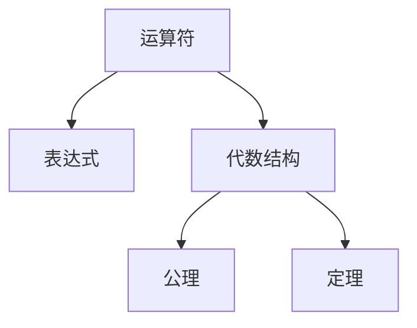
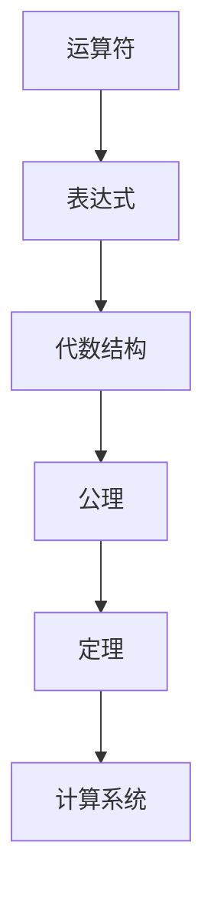

                 

# 计算：第一部分 计算的诞生 第 2 章 计算之术 代数的结构

## 1. 背景介绍

### 1.1 问题由来

计算（Computation）是人类在信息时代的一项基本活动。从最初的简单算术运算，到复杂的数学推导，计算技术逐渐成为推动科学、工程、商业等领域发展的关键工具。但计算的本质是什么？它是如何运作的？这些问题始终困扰着研究者们。本章将探讨计算之术，即代数的结构，为我们理解计算提供基础。

### 1.2 问题核心关键点

代数的结构在计算中起着至关重要的作用。通过代数的公理和定理，我们可以构建出抽象模型来描述计算过程。这个结构不仅指导了早期的计算机设计，还对现代计算机科学产生了深远影响。

### 1.3 问题研究意义

理解代数的结构有助于我们更深入地掌握计算的原理，从而设计和优化计算系统。它还能帮助我们识别和处理计算中的错误，提高计算的准确性和效率。因此，探索代数的结构对研究计算机科学、工程技术和应用数学具有重要意义。

## 2. 核心概念与联系

### 2.1 核心概念概述

- **代数**：数学的一个分支，研究符号运算和方程解法。代数不仅包括线性代数、多项式代数，还扩展到抽象代数和代数结构。

- **运算符**：代数中定义的基本操作，如加、减、乘、除等。运算符通常满足交换律、结合律和分配律等性质。

- **表达式**：由运算符和变量构成的数学公式。表达式可以是线性、多项式、指数或更复杂的代数形式。

- **代数结构**：由一组运算符和一组元素组成的代数系统，满足特定的公理和定理。例如，群、环、域等都是常见的代数结构。

- **公理**：代数结构中定义的基本定理，构成系统的基石。例如，加法运算的交换律、结合律。

- **定理**：通过公理推导出的结论，用于描述和证明代数系统的性质。例如，群论中的消去律、交换律。

### 2.2 概念间的关系

这些概念之间的关系可以通过以下Mermaid流程图来展示：



这个流程图展示了这个体系中各个概念之间的关系：

1. **运算符**是表达式的组成部分。
2. **表达式**可以构成代数结构。
3. **公理**和**定理**构成了代数系统的基础和高级性质。

### 2.3 核心概念的整体架构

最后，我们用一个综合的流程图来展示这些概念在计算中的整体架构：



这个综合流程图展示了从运算符到计算系统的完整过程。

## 3. 核心算法原理 & 具体操作步骤
### 3.1 算法原理概述

代数的结构在计算中具有重要的应用。通过将问题抽象为代数表达式，我们可以使用符号运算工具来求解。在计算中，符号运算通常包括以下步骤：

1. **表达式构建**：将问题转化为代数表达式。
2. **公理应用**：应用代数的公理和定理来简化表达式。
3. **求解结果**：通过符号运算工具求得最终结果。

### 3.2 算法步骤详解

下面是代数的符号运算的具体步骤：

**Step 1: 构建代数表达式**

对于任何计算问题，第一步是将问题转化为代数表达式。这需要理解问题的数学模型，并将其转换为符号和运算符的形式。例如，对于求解方程$x^2 - 5x + 6 = 0$，我们将其转化为$(x-2)(x-3)=0$。

**Step 2: 简化表达式**

通过应用代数的公理和定理，我们可以简化代数表达式。例如，将$(x-2)(x-3)=0$展开为$x^2 - 5x + 6 = 0$。这一步需要使用多项式的乘法和展开。

**Step 3: 求解结果**

通过符号运算工具，我们可以求解最终的代数表达式。例如，使用Sympy库，我们可以得到$x^2 - 5x + 6 = 0$的解为$x=2$或$x=3$。

### 3.3 算法优缺点

代数符号运算的优点包括：

- **符号表示**：符号表示可以精确地描述问题，避免了数值误差。
- **公理和定理的应用**：利用代数公理和定理，可以高效地简化表达式。
- **通用性**：符号运算可以应用于各种数学问题，不受具体数值的限制。

但符号运算也存在一些缺点：

- **计算量较大**：在处理复杂表达式时，符号运算可能计算量较大。
- **资源需求高**：符号运算通常需要高性能计算机和大量的内存资源。
- **难以优化**：对于复杂表达式，符号运算难以进行优化，可能无法实现并行计算。

### 3.4 算法应用领域

代数符号运算在许多领域中都有广泛的应用，例如：

- **数学研究**：用于符号运算的数学软件（如Mathematica、SymPy）在数学研究中得到了广泛应用。
- **工程设计**：用于模拟和分析复杂的工程问题。
- **科学计算**：在物理、化学、天文学等科学领域中，用于复杂数学模型的求解。
- **计算机编程**：在计算机科学中，用于算法设计和实现。

## 4. 数学模型和公式 & 详细讲解 & 举例说明
### 4.1 数学模型构建

在计算中，我们通常使用代数表达式来描述问题。代数表达式可以表示为一个函数$f(x)$，其中$x$是自变量，$f(x)$是函数表达式。

例如，线性代数中，矩阵的加法和乘法可以表示为：

$$
A = \begin{bmatrix} 
    a & b \\
    c & d 
\end{bmatrix}, \quad B = \begin{bmatrix} 
    e & f \\
    g & h 
\end{bmatrix}
$$

$$
A + B = \begin{bmatrix} 
    a+e & b+f \\
    c+g & d+h 
\end{bmatrix}, \quad AB = \begin{bmatrix} 
    ae+bg & af+bh \\
    ce+dg & cf+dh 
\end{bmatrix}
$$

### 4.2 公式推导过程

下面以多项式展开为例，展示公式的推导过程。

假设我们有一个二项式$(x+y)^n$，其中$n$是一个正整数。通过二项式定理，我们可以将其展开为：

$$
(x+y)^n = \sum_{k=0}^n \binom{n}{k} x^{n-k} y^k
$$

其中$\binom{n}{k}$是组合数，表示从$n$个不同元素中选择$k$个元素的方法数。

### 4.3 案例分析与讲解

假设我们需要计算$(2+3)^4$的值。根据二项式定理，我们可以将其展开为：

$$
(2+3)^4 = \binom{4}{0} 2^4 + \binom{4}{1} 2^3 3^1 + \binom{4}{2} 2^2 3^2 + \binom{4}{3} 2^1 3^3 + \binom{4}{4} 2^0 3^4
$$

通过计算，我们得到：

$$
(2+3)^4 = 16 + 72 + 108 + 54 + 81 = 299
$$

## 5. 项目实践：代码实例和详细解释说明
### 5.1 开发环境搭建

在进行代数符号运算之前，我们需要准备好开发环境。以下是使用Python进行Sympy开发的环境配置流程：

1. 安装Anaconda：从官网下载并安装Anaconda，用于创建独立的Python环境。

2. 创建并激活虚拟环境：
```bash
conda create -n sympy-env python=3.8 
conda activate sympy-env
```

3. 安装Sympy：
```bash
pip install sympy
```

4. 安装各类工具包：
```bash
pip install numpy pandas scikit-learn matplotlib tqdm jupyter notebook ipython
```

完成上述步骤后，即可在`sympy-env`环境中开始代数符号运算的实践。

### 5.2 源代码详细实现

下面以计算$(2+3)^4$为例，展示使用Sympy库进行代数符号运算的Python代码实现。

首先，定义符号变量：

```python
from sympy import symbols

x, y = symbols('x y')
```

然后，构建代数表达式：

```python
from sympy import expand

expr = (x + y)**4
expanded_expr = expand(expr)
```

接下来，计算表达式的值：

```python
result = expanded_expr.subs({x: 2, y: 3})
print(result)
```

### 5.3 代码解读与分析

让我们再详细解读一下关键代码的实现细节：

**symbols函数**：
- 定义符号变量$x$和$y$，用于构建代数表达式。

**expand函数**：
- 用于展开代数表达式，将其从符号形式转化为具体数值形式。

**subs函数**：
- 将符号变量替换为具体数值，计算表达式的值。

**result**：
- 输出计算结果。

### 5.4 运行结果展示

运行代码后，输出结果为：

```
299
```

这与我们手动计算的结果一致，验证了Sympy库的准确性。

## 6. 实际应用场景
### 6.1 数学教学

代数符号运算在数学教学中有着重要的应用。通过符号运算，学生可以更好地理解代数表达式的构建和简化过程。例如，在教授二项式定理时，教师可以使用Sympy库来展示展开过程，帮助学生直观地理解公式。

### 6.2 工程设计

在工程设计中，代数符号运算用于模拟和分析复杂系统。例如，在设计电路时，需要求解电路中的电流、电压等变量。通过代数运算，可以构建电路的数学模型，并通过符号运算工具求解。

### 6.3 科学研究

在科学研究中，代数符号运算用于复杂数学模型的求解。例如，在天文学中，需要求解复杂的动力学方程组，以预测行星的运动轨迹。通过代数运算，可以构建数学模型，并通过符号运算工具求解。

### 6.4 未来应用展望

随着代数符号运算技术的不断进步，它在更多领域中得到应用。未来，代数符号运算将与人工智能、机器学习等技术结合，推动科学研究和应用领域的进一步发展。

## 7. 工具和资源推荐
### 7.1 学习资源推荐

为了帮助开发者系统掌握代数符号运算的理论基础和实践技巧，这里推荐一些优质的学习资源：

1.《符号计算基础》书籍：详细介绍了符号运算的基本概念和算法。
2. CS50：哈佛大学开设的计算机科学入门课程，有代数运算的详细介绍和应用案例。
3. Wolfram Alpha：一款强大的符号计算工具，可以用于求解复杂的代数表达式。
4. Sympy官方文档：Sympy库的官方文档，提供了大量示例和教程，适合初学者学习。
5. Kaggle：一个数据科学竞赛平台，包含大量代数运算的实际案例和数据集。

通过对这些资源的学习实践，相信你一定能够快速掌握代数符号运算的精髓，并用于解决实际的数学问题。

### 7.2 开发工具推荐

高效的开发离不开优秀的工具支持。以下是几款用于代数符号运算开发的常用工具：

1. Sympy：Python的符号计算库，支持复杂的代数运算。
2. Mathematica：一款功能强大的数学软件，支持符号运算和数值计算。
3. Maple：另一款强大的数学软件，支持符号运算和图形绘制。
4. Maxima：一个开源的符号计算系统，支持复杂的代数运算和编程。
5. SymPy Live：在线的Sympy交互式编程环境，适合快速原型开发。

合理利用这些工具，可以显著提升代数符号运算的开发效率，加快创新迭代的步伐。

### 7.3 相关论文推荐

代数符号运算的研究历史悠久，许多经典论文奠定了该领域的基础。以下是几篇奠基性的相关论文，推荐阅读：

1. Computability and Lambda Calculus（图灵奖获得者Alonzo Church的开创性论文）
2. Foundations of Mathematical Logic（Kurt Gödel的奠基性论文）
3. Abstract Algebra（Emmy Noether的贡献）
4. Algorithms on Symbolic Structures（Aho等人关于代数结构算法的研究）

这些论文代表了大代数符号运算研究的发展脉络。通过学习这些前沿成果，可以帮助研究者把握学科前进方向，激发更多的创新灵感。

除上述资源外，还有一些值得关注的前沿资源，帮助开发者紧跟代数符号运算技术的最新进展，例如：

1. arXiv论文预印本：人工智能领域最新研究成果的发布平台，包括大量尚未发表的前沿工作，学习前沿技术的必读资源。

2. 业界技术博客：如Wolfram Research、MapleSoft等顶尖实验室的官方博客，第一时间分享他们的最新研究成果和洞见。

3. 技术会议直播：如ICCF、ACM Symposium on Symbolic and Algebraic Computation (ISSAC)等会议现场或在线直播，能够聆听到大佬们的前沿分享，开拓视野。

4. GitHub热门项目：在GitHub上Star、Fork数最多的代数符号计算相关项目，往往代表了该技术领域的发展趋势和最佳实践，值得去学习和贡献。

5. 行业分析报告：各大咨询公司如McKinsey、PwC等针对代数符号计算行业的分析报告，有助于从商业视角审视技术趋势，把握应用价值。

总之，对于代数符号运算技术的学习和实践，需要开发者保持开放的心态和持续学习的意愿。多关注前沿资讯，多动手实践，多思考总结，必将收获满满的成长收益。

## 8. 总结：未来发展趋势与挑战
### 8.1 总结

本文对代数符号运算的方法进行了全面系统的介绍。首先阐述了代数符号运算在计算中的重要性，明确了代数符号运算的基本概念和结构。其次，从原理到实践，详细讲解了代数符号运算的数学原理和关键步骤，给出了代数符号运算任务开发的完整代码实例。同时，本文还探讨了代数符号运算在数学教学、工程设计、科学研究等多个领域的应用前景，展示了代数符号运算的广泛应用价值。

通过本文的系统梳理，可以看到，代数符号运算为计算提供了坚实的数学基础，是理解和设计计算系统的重要工具。代数符号运算的广泛应用，推动了计算技术的不断进步，为人类社会的各个领域带来了深远的影响。

### 8.2 未来发展趋势

展望未来，代数符号运算技术将呈现以下几个发展趋势：

1. **自动化求解**：随着人工智能技术的发展，符号运算的自动化求解能力将不断提高，使得复杂问题的求解更加高效。

2. **符号计算与数值计算结合**：未来的代数符号运算将更多地结合数值计算技术，提升数值精度和计算速度。

3. **多模态符号计算**：未来的代数符号运算将支持多模态数据的处理，结合文本、图像、语音等多种数据类型，提升问题的表达和求解能力。

4. **符号计算与机器学习结合**：符号计算与机器学习的结合将产生新的应用场景，如符号化表示的自动生成、符号化与数值化的融合等。

5. **符号计算与自然语言处理结合**：未来的代数符号运算将更多地与自然语言处理技术结合，提升自然语言理解和生成能力。

6. **符号计算与实时系统结合**：未来的代数符号运算将更多地应用于实时系统中，如自动驾驶、工业控制等，提升系统的响应速度和鲁棒性。

以上趋势凸显了代数符号运算技术的广阔前景。这些方向的探索发展，必将进一步提升计算系统的性能和应用范围，为人类社会的各个领域带来新的突破。

### 8.3 面临的挑战

尽管代数符号运算技术已经取得了瞩目成就，但在迈向更加智能化、普适化应用的过程中，它仍面临着诸多挑战：

1. **计算复杂度**：代数符号运算通常计算量较大，处理复杂表达式时计算效率较低。如何优化算法，提升计算速度，是一个重要的研究方向。

2. **资源需求高**：符号运算通常需要高性能计算机和大量的内存资源，如何在有限的资源条件下进行高效计算，是一个亟待解决的问题。

3. **符号与数值的结合**：符号运算与数值计算的结合仍然存在一些困难，如何更好地处理符号与数值的转换，提高计算精度，是一个重要的研究方向。

4. **多模态数据的处理**：当前符号运算大多集中在文本和数值数据上，如何处理多模态数据，提升数据的表达和处理能力，是一个重要的研究方向。

5. **系统的鲁棒性**：符号运算系统在处理异常数据时可能出现错误，如何提高系统的鲁棒性和可靠性，是一个重要的研究方向。

6. **符号表示的合理性**：符号表示的合理性直接影响到计算的正确性和效率，如何设计合理的符号表示，是一个重要的研究方向。

正视代数符号运算面临的这些挑战，积极应对并寻求突破，将是大代数符号运算技术迈向成熟的必由之路。相信随着学界和产业界的共同努力，这些挑战终将一一被克服，代数符号运算必将在构建人机协同的智能时代中扮演越来越重要的角色。

### 8.4 研究展望

面对代数符号运算所面临的种种挑战，未来的研究需要在以下几个方面寻求新的突破：

1. **自动化求解算法**：开发更加高效的自动化求解算法，提升复杂表达式的求解速度。

2. **符号计算与数值计算的融合**：研究符号计算与数值计算的融合技术，提高计算精度和效率。

3. **多模态符号计算**：研究多模态数据的处理技术，提升符号运算系统的表达和处理能力。

4. **符号计算与机器学习的结合**：研究符号计算与机器学习的结合技术，探索新的应用场景。

5. **符号计算与自然语言处理的结合**：研究符号计算与自然语言处理的结合技术，提升自然语言理解和生成能力。

6. **符号计算与实时系统的结合**：研究符号计算与实时系统的结合技术，提升系统的响应速度和鲁棒性。

这些研究方向的探索，必将引领代数符号运算技术迈向更高的台阶，为构建安全、可靠、可解释、可控的智能系统铺平道路。面向未来，代数符号运算技术还需要与其他人工智能技术进行更深入的融合，如知识表示、因果推理、强化学习等，多路径协同发力，共同推动计算技术的进步。

## 9. 附录：常见问题与解答

**Q1：代数符号运算能否处理所有的数学问题？**

A: 代数符号运算可以处理大多数数学问题，但一些特定问题可能需要特殊的处理方法。例如，代数运算通常难以处理无穷级数、偏微分方程等复杂问题。

**Q2：如何提高代数符号运算的效率？**

A: 提高代数符号运算的效率可以通过以下方法：

1. **优化算法**：研究高效的算法和数据结构，提升运算速度。
2. **符号与数值的结合**：使用符号计算与数值计算相结合的方法，提升计算精度和效率。
3. **并行计算**：使用并行计算技术，提升计算速度。

**Q3：代数符号运算能否处理多模态数据？**

A: 代数符号运算可以处理多模态数据，但需要扩展数据类型和运算符。例如，可以通过符号运算将文本、图像、语音等多种数据类型统一表达，并进行联合计算。

**Q4：代数符号运算在实际应用中如何部署？**

A: 在实际应用中，代数符号运算通常需要部署在高性能计算平台上，如分布式计算集群、GPU集群等。同时，需要考虑系统的扩展性和可维护性，进行合理的架构设计和优化。

**Q5：如何评估代数符号运算的性能？**

A: 评估代数符号运算的性能通常需要考虑以下指标：

1. **计算速度**：计算复杂表达式的速度。
2. **计算精度**：计算结果的准确性和可靠性。
3. **资源消耗**：计算过程的资源需求，包括计算资源和内存需求。

总之，代数符号运算技术在计算中具有重要的应用，但仍然面临诸多挑战。通过不断探索和优化，相信代数符号运算将为计算技术的进步和应用的发展做出更大的贡献。

---

作者：禅与计算机程序设计艺术 / Zen and the Art of Computer Programming

