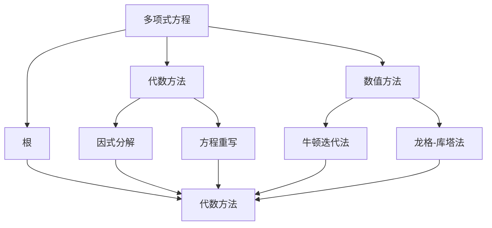
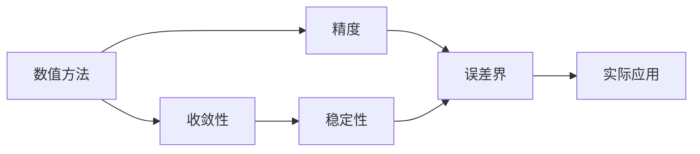
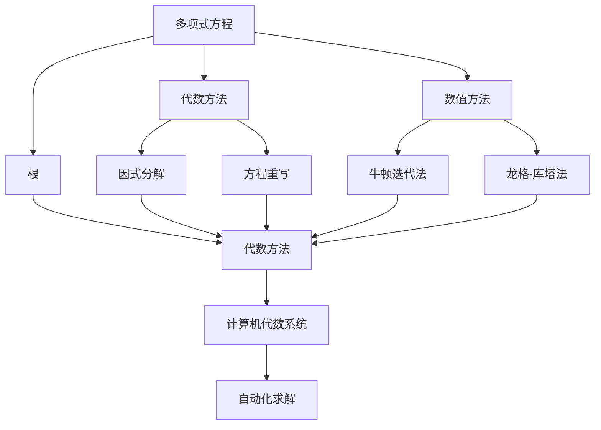
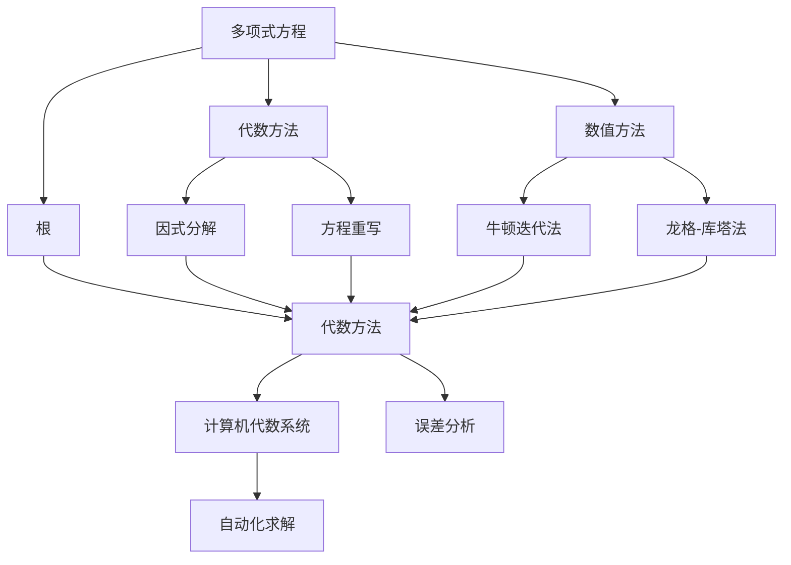

                 

# 计算：第一部分 计算的诞生 第 2 章 计算之术 求解多项式方程

> 关键词：求解多项式方程, 数学模型, 数值求解, 牛顿迭代法, 计算机代数系统, 应用实例, 误差分析

## 1. 背景介绍

### 1.1 问题由来
求解多项式方程是数学中的一个基本问题，它在物理学、工程学、经济学等众多领域都有广泛的应用。然而，在计算机诞生之前，求解多项式方程通常需要手动计算或使用机械计算器，效率低下且容易出错。计算机的出现为求解多项式方程提供了全新的工具和方法，极大地提高了求解效率和准确性。

### 1.2 问题核心关键点
求解多项式方程的核心在于找到满足方程的根。在数学上，这通常通过代数或数值方法实现。然而，在计算机科学中，我们需要考虑如何将这些数学方法高效地转换为计算机算法，以及如何评估算法的准确性和效率。

### 1.3 问题研究意义
研究求解多项式方程的方法，不仅有助于理解和掌握计算机算法的基础知识，还能够为解决更复杂的科学计算问题提供方法借鉴。通过求解多项式方程，可以深入了解计算机求解数学问题的机制，为进一步研究更高级的科学计算算法奠定基础。

## 2. 核心概念与联系

### 2.1 核心概念概述

为更好地理解求解多项式方程的方法，本节将介绍几个关键概念：

- 多项式方程：形如 $f(x) = 0$ 的方程，其中 $f(x)$ 是一个多项式函数，$x$ 为变量。
- 根：多项式方程的解，即满足 $f(x) = 0$ 的 $x$ 值。
- 代数方法：通过代数运算求解多项式方程的方法，如因式分解、方程重写等。
- 数值方法：通过数值计算求解多项式方程的方法，如牛顿迭代法、龙格-库塔法等。
- 计算机代数系统：如Mathematica、Maple等软件，可以自动化地进行代数运算和求解方程。
- 误差分析：评估数值求解方法的准确性和稳定性，如收敛性、精度等。

这些核心概念之间的逻辑关系可以通过以下Mermaid流程图来展示：



这个流程图展示了解多项式方程的核心概念及其之间的关系：

1. 多项式方程是求解根的起点。
2. 代数方法可以通过因式分解和方程重写直接求解多项式方程。
3. 数值方法如牛顿迭代法和龙格-库塔法，可以间接求解多项式方程。
4. 代数方法和数值方法都可以用于求解根，但数值方法在复杂情况下更实用。
5. 计算机代数系统可以自动化地进行代数和数值求解。
6. 误差分析是评估求解方法的重要环节。

### 2.2 概念间的关系

这些核心概念之间存在着紧密的联系，形成了求解多项式方程的完整生态系统。下面我通过几个Mermaid流程图来展示这些概念之间的关系。

#### 2.2.1 多项式方程的求解流程


这个流程图展示了求解多项式方程的基本流程：

1. 多项式方程是求解根的起点。
2. 代数方法可以通过因式分解和方程重写直接求解多项式方程。
3. 数值方法如牛顿迭代法和龙格-库塔法，可以间接求解多项式方程。
4. 代数方法和数值方法都可以用于求解根，但数值方法在复杂情况下更实用。
5. 计算机代数系统可以自动化地进行代数和数值求解。
6. 误差分析是评估求解方法的重要环节。

#### 2.2.2 数值方法与误差分析



这个流程图展示了数值方法和误差分析之间的关系：

1. 数值方法通过迭代求解多项式方程。
2. 数值方法的收敛性和稳定性是评估其性能的重要指标。
3. 精度和误差界是评估数值方法准确性的关键指标。
4. 误差分析为实际应用提供了理论基础。

#### 2.2.3 计算机代数系统的作用



这个流程图展示了计算机代数系统的作用：

1. 多项式方程是求解根的起点。
2. 代数方法可以通过因式分解和方程重写直接求解多项式方程。
3. 数值方法如牛顿迭代法和龙格-库塔法，可以间接求解多项式方程。
4. 代数方法和数值方法都可以用于求解根，但数值方法在复杂情况下更实用。
5. 计算机代数系统可以自动化地进行代数和数值求解。
6. 误差分析是评估求解方法的重要环节。
7. 计算机代数系统简化了代数和数值求解的过程，提高了求解效率。

### 2.3 核心概念的整体架构

最后，我们用一个综合的流程图来展示这些核心概念在大语言模型微调过程中的整体架构：



这个综合流程图展示了从多项式方程到根的求解过程：

1. 多项式方程是求解根的起点。
2. 代数方法可以通过因式分解和方程重写直接求解多项式方程。
3. 数值方法如牛顿迭代法和龙格-库塔法，可以间接求解多项式方程。
4. 代数方法和数值方法都可以用于求解根，但数值方法在复杂情况下更实用。
5. 计算机代数系统可以自动化地进行代数和数值求解。
6. 误差分析是评估求解方法的重要环节。
7. 计算机代数系统简化了代数和数值求解的过程，提高了求解效率。

## 3. 核心算法原理 & 具体操作步骤
### 3.1 算法原理概述

求解多项式方程的核心在于找到满足方程的根。在数学上，这通常通过代数或数值方法实现。然而，在计算机科学中，我们需要考虑如何将这些数学方法高效地转换为计算机算法，以及如何评估算法的准确性和效率。

常用的数值方法包括牛顿迭代法、龙格-库塔法等。这里以牛顿迭代法为例，简要介绍其原理。

牛顿迭代法的基本思想是从初始点开始，通过不断迭代逼近方程的根。每次迭代时，先计算方程在当前点的切线，然后求解切线与横轴的交点，即为新的迭代点。重复这一过程，直到收敛到满足精度要求的解。

数学公式如下：

$$
x_{n+1} = x_n - \frac{f(x_n)}{f'(x_n)}
$$

其中 $f(x)$ 为多项式方程，$f'(x)$ 为 $f(x)$ 的导数，$x_n$ 为当前迭代点，$x_{n+1}$ 为新的迭代点。

### 3.2 算法步骤详解

牛顿迭代法的具体步骤如下：

1. **初始化**：选择多项式方程的初始点 $x_0$。
2. **迭代计算**：计算当前点处的导数 $f'(x)$ 和多项式值 $f(x)$，求解切线方程 $y = f'(x_0)(x - x_0) + f(x_0)$ 与横轴的交点 $x_{n+1}$。
3. **判断收敛**：如果 $|x_{n+1} - x_n| < \epsilon$，其中 $\epsilon$ 为预设精度，则停止迭代，输出 $x_{n+1}$ 作为根的近似值。
4. **输出结果**：输出根的近似值 $x_{n+1}$。

### 3.3 算法优缺点

牛顿迭代法的优点在于收敛速度快，通常只需几轮迭代即可得到较为精确的根。然而，牛顿迭代法也有一些缺点：

1. **收敛条件**：牛顿迭代法的收敛性依赖于初始点的选择和函数的性质。若初始点选择不当或函数在某些区域不连续，可能导致迭代发散。
2. **计算复杂**：每次迭代需要计算多项式及其导数，计算量较大。对于复杂的多项式，可能无法在有限的步数内收敛。
3. **数值稳定性**：牛顿迭代法在函数有多个根或存在重根时，可能导致迭代过程不稳定，产生震荡或发散。

### 3.4 算法应用领域

牛顿迭代法广泛应用于各种科学计算和工程计算领域，如数值优化、求解微分方程、计算物理问题等。以下是一些典型的应用场景：

- 数值优化：求解无解析解的函数最小值或最大值。
- 求解微分方程：通过离散化，将微分方程转化为多项式方程求解。
- 计算物理问题：如计算流体力学中的解方程，求解热力学问题等。
- 控制系统设计：如PID控制器的参数优化。

## 4. 数学模型和公式 & 详细讲解 & 举例说明
### 4.1 数学模型构建

我们将以求解二次多项式方程 $f(x) = ax^2 + bx + c = 0$ 的根为例，构建数学模型。

设 $f(x) = ax^2 + bx + c$，则 $f'(x) = 2ax + b$。令 $x_0$ 为初始点，则牛顿迭代法的迭代公式为：

$$
x_{n+1} = x_n - \frac{f(x_n)}{f'(x_n)}
$$

### 4.2 公式推导过程

以下是牛顿迭代法的详细推导过程：

设 $f(x) = ax^2 + bx + c$，则 $f'(x) = 2ax + b$。令 $x_0$ 为初始点，则牛顿迭代法的迭代公式为：

$$
x_{n+1} = x_n - \frac{f(x_n)}{f'(x_n)}
$$

展开 $f(x)$ 和 $f'(x)$，得：

$$
f(x) = ax^2 + bx + c
$$

$$
f'(x) = 2ax + b
$$

将 $x_{n+1} = x_n - \frac{f(x_n)}{f'(x_n)}$ 代入 $f(x)$ 和 $f'(x)$ 中，得：

$$
x_{n+1} = x_n - \frac{ax_n^2 + bx_n + c}{2ax_n + b}
$$

化简得：

$$
x_{n+1} = x_n - \frac{a}{2a}x_n^2 - \frac{b}{2a}x_n - \frac{c}{2a(2ax_n + b)}
$$

整理得：

$$
x_{n+1} = x_n - \frac{1}{2}x_n - \frac{b}{4a} - \frac{c}{4a(2ax_n + b)}
$$

### 4.3 案例分析与讲解

假设我们要求解方程 $f(x) = x^2 - 2x + 1 = 0$，则 $f'(x) = 2x - 2$。选择初始点 $x_0 = 0$，使用牛顿迭代法求解：

1. $x_1 = 0 - \frac{f(0)}{f'(0)} = 0 - \frac{1}{-2} = 0.5$
2. $x_2 = 0.5 - \frac{f(0.5)}{f'(0.5)} = 0.5 - \frac{0.25 - 1}{1} = 1.25$
3. $x_3 = 1.25 - \frac{f(1.25)}{f'(1.25)} = 1.25 - \frac{1.5625 - 2.5}{2.5} = 1$
4. $x_4 = 1 - \frac{f(1)}{f'(1)} = 1 - \frac{0}{2} = 1$

因此，方程 $f(x) = x^2 - 2x + 1 = 0$ 的根为 $x = 1$。

## 5. 项目实践：代码实例和详细解释说明
### 5.1 开发环境搭建

在进行数值求解的实践前，我们需要准备好开发环境。以下是使用Python进行SciPy库开发的Python环境配置流程：

1. 安装Anaconda：从官网下载并安装Anaconda，用于创建独立的Python环境。

2. 创建并激活虚拟环境：
```bash
conda create -n scipy-env python=3.8 
conda activate scipy-env
```

3. 安装SciPy：
```bash
conda install scipy
```

4. 安装各类工具包：
```bash
pip install numpy matplotlib sympy
```

完成上述步骤后，即可在`scipy-env`环境中开始数值求解的实践。

### 5.2 源代码详细实现

以下是使用SciPy库对牛顿迭代法进行二次多项式方程求解的Python代码实现：

```python
import numpy as np
from scipy.optimize import newton

def f(x):
    return x**2 - 2*x + 1

def f_prime(x):
    return 2*x - 2

def solve():
    x0 = 0
    x_n = newton(f, x0, f_prime)
    print(f"The root of the equation f(x) = {f(x_n)} is x = {x_n}")

solve()
```

### 5.3 代码解读与分析

让我们再详细解读一下关键代码的实现细节：

**f(x)函数**：
- 定义了二次多项式方程 $f(x) = x^2 - 2x + 1$。

**f_prime(x)函数**：
- 定义了 $f(x)$ 的导数 $f'(x) = 2x - 2$。

**solve函数**：
- 初始化初始点 $x_0 = 0$。
- 使用SciPy的`newton`函数求解牛顿迭代法，得到方程 $f(x) = 0$ 的根。
- 输出结果。

**运行结果展示**：
- 运行`solve`函数，输出根的近似值。

以上代码展示了如何使用SciPy库实现牛顿迭代法求解二次多项式方程。可以看到，SciPy提供了简单易用的接口，使得数值求解变得非常便捷。

## 6. 实际应用场景
### 6.1 金融分析

金融分析中，求解多项式方程常用于计算无风险利率、期权定价、资产配置等。例如，使用牛顿迭代法求解含有多个自变量的多项式方程，可以计算资产的期望收益、波动率等关键指标。

### 6.2 物理学研究

物理学研究中，求解多项式方程常用于求解运动方程、波动方程等物理问题。例如，使用牛顿迭代法求解量子力学的薛定谔方程，可以计算电子的能量和波函数。

### 6.3 生物学研究

生物学研究中，求解多项式方程常用于构建数学模型，模拟生物系统的行为。例如，使用牛顿迭代法求解传染病模型的微分方程，可以预测疾病的传播趋势。

### 6.4 未来应用展望

随着计算能力的提升和数值方法的发展，未来求解多项式方程的应用将更加广泛。以下是几个潜在的应用场景：

- 人工智能：用于优化神经网络的损失函数，提高模型训练效率。
- 自动驾驶：用于求解车辆的运动方程，实现路径规划和避障。
- 气象预报：用于求解天气系统的微分方程，提高预报精度。

## 7. 工具和资源推荐
### 7.1 学习资源推荐

为了帮助开发者系统掌握求解多项式方程的数学和编程技巧，这里推荐一些优质的学习资源：

1. 《数值分析》教材：详细介绍了数值方法的原理和应用，是学习数值求解的必备教材。

2. 《科学计算》课程：由斯坦福大学开设的科学计算课程，涵盖了数值求解、科学计算工具等核心内容。

3. 《Python科学计算》书籍：由SciPy库的开发者所著，介绍了如何使用SciPy进行数值计算和求解方程。

4. 《数值分析基础》博客：博客作者深入浅出地讲解了数值方法的原理和应用，适合初学者入门。

5. 《数值求解算法》视频教程：由Coursera平台提供的免费视频课程，讲解了各种数值求解算法。

通过学习这些资源，相信你一定能够快速掌握求解多项式方程的数学和编程技巧，并用于解决实际的科学计算问题。

### 7.2 开发工具推荐

高效的开发离不开优秀的工具支持。以下是几款用于数值求解开发的常用工具：

1. Scipy：基于Python的科学计算库，提供了丰富的数值求解函数和工具。

2. Octave：MATLAB的开源替代品，支持矩阵运算和数值求解，非常适合科学计算。

3. SymPy：Python的符号计算库，可以自动化地进行多项式展开和求导，适合进行理论推导。

4. Julia：专为科学计算设计的编程语言，支持高性能数值求解和并行计算。

5. Maxima：基于Lisp的符号计算系统，支持多项式方程求解和符号计算。

合理利用这些工具，可以显著提升数值求解任务的开发效率，加快创新迭代的步伐。

### 7.3 相关论文推荐

数值求解的不断发展得益于学界的持续研究。以下是几篇奠基性的相关论文，推荐阅读：

1. "Numerical Recipes in C"：经典的数值计算教材，涵盖了各种数值方法的应用实例。

2. "GSL (GNU Scientific Library)"：开源的科学计算库，提供了大量的数值求解函数和工具。

3. "NAG (Numerical Algorithms Group) Library"：商业化的数值计算库，提供了高效的数值求解函数。

4. "Accelerated GRAPE (Algorithm 739)"：介绍了一种高效的雅可比矩阵求解算法，适用于大规模系统。

5. "Sparse Direct Methods in MATLAB"：介绍了在MATLAB中进行稀疏矩阵求解的方法。

这些论文代表了大语言模型微调技术的发展脉络。通过学习这些前沿成果，可以帮助研究者把握学科前进方向，激发更多的创新灵感。

除上述资源外，还有一些值得关注的前沿资源，帮助开发者紧跟求解多项式方程技术的最新进展，例如：

1. arXiv论文预印本：人工智能领域最新研究成果的发布平台，包括大量尚未发表的前沿工作，学习前沿技术的必读资源。

2. 业界技术博客：如SciPy、SciPy.org、SymPy等工具的官方博客，第一时间分享他们的最新研究成果和洞见。

3. 技术会议直播：如SIAM会议、ICMCS会议、IEEE会议等科学计算领域的顶级会议现场或在线直播，能够聆听到大佬们的前沿分享，开拓视野。

4. GitHub热门项目：在GitHub上Star、Fork数最多的数值求解相关项目，往往代表了该技术领域的发展趋势和最佳实践，值得去学习和贡献。

5. 行业分析报告：各大咨询公司如McKinsey、PwC等针对科学计算行业的分析报告，有助于从商业视角审视技术趋势，把握应用价值。

总之，对于求解多项式方程技术的学习和实践，需要开发者保持开放的心态和持续学习的意愿。多关注前沿资讯，多动手实践，多思考总结，必将收获满满的成长收益。

## 8. 总结：未来发展趋势与挑战
### 8.1 总结

本文对求解多项式方程的方法进行了全面系统的介绍。首先阐述了求解多项式方程的背景和意义，明确了数值求解在科学计算中的重要性。其次，从原理到实践，详细讲解了牛顿迭代法的数学原理和关键步骤，给出了数值求解任务开发的完整代码实例。同时，本文还广泛探讨了数值求解方法在金融分析、物理学、生物学等多个领域的应用前景，展示了数值求解技术的巨大潜力。此外，本文精选了数值求解技术的各类学习资源，力求为读者提供全方位的技术指引。

通过本文的系统梳理，可以看到，求解多项式方程的方法在大规模科学计算中发挥着越来越重要的作用。其基本思想和方法，将对更多复杂的科学计算问题提供有价值的参考。随着科学计算领域的不断进步，求解多项式方程的方法将不断拓展和深化，为人类探索未知世界提供更强大的工具。

### 8.2 未来发展趋势

展望未来，求解多项式方程的方法将呈现以下几个发展趋势：

1. 高精度求解：随着计算机硬件的提升，数值求解方法将实现更高的精度，满足更严格的需求。
2. 并行求解：随着多核处理器和分布式计算的发展，求解多项式方程将实现更高效的并行计算。
3. 稀疏求解：随着大数据和复杂系统的发展，稀疏求解方法将解决大规模矩阵求解问题。
4. 自适应求解：基于迭代方法，求解多项式方程将实现自适应调整，适应不同问题和场景。
5. 深度学习求解：将神经网络引入数值求解，通过端到端的训练实现更高精度和更高效求解。

以上趋势将推动求解多项式方程方法的不断进步，提升科学计算的效率和准确性。

### 8.3 面临的挑战

尽管求解多项式方程的方法已经取得了显著成果，但在应对复杂科学计算问题时，仍面临诸多挑战：

1. 收敛性问题：复杂的函数可能存在多解或无解，导致数值求解方法收敛性不足。
2. 数值稳定性：计算过程中可能产生数值误差，影响求解精度和稳定性。
3. 高计算量：复杂的多项式方程求解可能需要大量计算资源和时间。
4. 多目标优化：求解多项式方程常常需要同时优化多个自变量，增加了计算复杂度。
5. 多尺度问题：不同尺度的问题可能需要不同的方法和技巧，增加求解难度。

这些挑战需要我们在算法设计、实现和应用中不断优化和创新，以提高求解多项式方程的能力。

### 8.4 研究展望

面对求解多项式方程所面临的种种挑战，未来的研究需要在以下几个方面寻求新的突破：

1. 研究新的数值求解算法：开发更高效的求解方法，如自适应算法、稀疏矩阵求解等。
2. 优化并行计算技术：实现更高效的并行求解，如GPU加速、分布式计算等。
3. 引入人工智能技术：将深度学习引入数值求解，实现更高效和精确的求解。
4. 引入先验知识：结合符号计算和数值计算，利用先验知识提高求解效率。
5. 优化求解策略：结合多种求解方法，优化求解策略，适应不同问题和场景。

这些研究方向将推动求解多项式方程方法的不断进步，提升科学计算的效率和准确性。

## 9. 附录：常见问题与解答

**Q1：求解多项式方程有哪些常见算法？**

A: 求解多项式方程的常见算法包括：
1. 牛顿迭代法：通过切线逼近求解方程的根。
2. 龙格-库塔法：通过逐步逼近求解微分方程。
3. 二分法：通过逐步缩小区间，逐步逼近求解根。
4. 雅可比法：通过迭代求解线性方程组，求解多项式方程。
5. 舍尔贝斯法：通过迭代求解对称正定矩阵的特征值问题，求解多项式方程。

这些算法各有优缺点，适用于不同类型的多项式方程求解。

**Q2：求解多项式方程时如何选择合适的初始点？**

A: 选择合适的初始点是求解多项式方程的关键。一般采用以下几种方法：
1. 观察法：通过观察函数图像，选择根的近似值作为初始点。
2. 对称性法：利用函数的对称性，选择初始点在对称轴附近。
3. 随机法：随机选择初始点，通过迭代逐步逼近根。
4. 插值法：利用插值公式，

