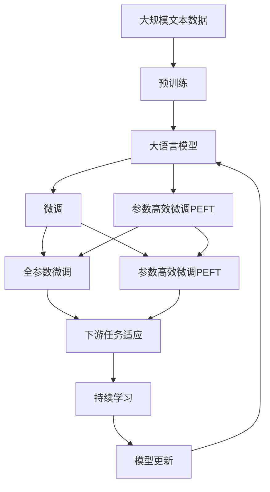

                 

# 计算：第三部分 计算理论的形成 第 8 章 计算理论的诞生：图灵的可计算数 图灵的证明

> 关键词：计算理论, 可计算数, 图灵机, 图灵的证明, 算法复杂度, 图灵完备性

## 1. 背景介绍

### 1.1 问题由来
计算理论是计算机科学和数学的基础，它研究如何以算法的方式解决问题的可能性。其中，图灵机（Turing Machine, TM）是计算理论的核心概念，由英国数学家艾伦·图灵在1936年提出。图灵机定义了可计算性（Computability）的概念，是现代计算机科学理论的基石。本章将详细探讨图灵机的基本原理，以及图灵的可计算数证明。

### 1.2 问题核心关键点
图灵机是一种抽象的计算模型，它通过模拟计算机器的基本操作，如读写符号、移动指针等，执行任意复杂的计算任务。图灵的可计算数证明，展示了所有能够由图灵机计算的问题，最终可以被归结为特定的一类问题。这一证明不仅奠定了计算理论的基础，还对算法复杂度的研究产生了深远影响。

### 1.3 问题研究意义
图灵的可计算数证明对理解算法复杂度和计算极限具有重要意义。它表明，计算机无法解决所有问题，某些问题本质上无法被计算。这一观点对计算理论的发展具有划时代的影响，推动了计算机科学从机械运算向智能计算的转变。

## 2. 核心概念与联系

### 2.1 核心概念概述

- **图灵机（Turing Machine, TM）**：一种由有限状态、读写符号、读写头组成的形式化计算模型。图灵机能够执行任意复杂的计算任务。
- **可计算数（Computable Number）**：能够由图灵机计算得到的数值。可计算数概念定义了计算机能解决的问题范围。
- **图灵的证明**：图灵在1936年提出的证明，展示了所有可计算数的问题，最终可以被归结为特定的一类问题。
- **算法复杂度（Algorithm Complexity）**：研究算法执行时间或空间需求随输入规模增长的速率，是计算机科学理论的核心问题。

这些概念之间存在着紧密的联系，共同构成了计算理论的基石。图灵机的定义和可计算数的证明，为算法复杂度的研究提供了理论基础，并推动了计算机科学的发展。

### 2.2 概念间的关系

这些核心概念的关系可以通过以下Mermaid流程图来展示：

```mermaid
graph TB
    A[图灵机(TM)] --> B[可计算数(Computable Number)]
    A --> C[算法复杂度(Algorithm Complexity)]
    B --> D[图灵的证明(图灵的证明)]
    C --> D
```

这个流程图展示了图灵机、可计算数、算法复杂度和图灵的证明之间的逻辑关系：

1. 图灵机是计算理论的基本计算模型。
2. 可计算数定义了计算机能够解决的问题范围。
3. 算法复杂度研究算法执行时间或空间需求随输入规模增长的速率。
4. 图灵的可计算数证明展示了所有可计算数的问题可以被归结为特定的一类问题。

这些概念共同构成了计算理论的基本框架，对理解计算机的能力和局限性具有重要意义。

### 2.3 核心概念的整体架构

最后，我们用一个综合的流程图来展示这些核心概念在大语言模型微调过程中的整体架构：



这个综合流程图展示了从预训练到微调，再到持续学习的完整过程。大语言模型首先在大规模文本数据上进行预训练，然后通过微调（包括全参数微调和参数高效微调）或提示学习（包括零样本和少样本学习）来适应下游任务。最后，通过持续学习技术，模型可以不断学习新知识，同时避免遗忘旧知识。

## 3. 核心算法原理 & 具体操作步骤

### 3.1 算法原理概述

图灵的可计算数证明，展示了所有可计算数的问题可以被归结为特定的一类问题。这一证明的核心思想是，任何可计算数的问题都可以被一个图灵机所计算，并且所有这样的图灵机都可以被归约为一个通用图灵机。

图灵机由一个无限状态的集合、一个有限状态的集合、一个输入符号集合、一个输出符号集合、一个读写头、一个读写头移动规则和一个读写规则组成。图灵机通过在无限磁带上读写符号，执行状态转移，从而模拟计算机器的基本操作。

### 3.2 算法步骤详解

图灵的可计算数证明分为以下几个关键步骤：

1. **通用图灵机的定义**：定义一个通用图灵机，它能够模拟任何可计算数问题的计算过程。
2. **可计算数的定义**：定义一个问题为可计算数，如果它能够被某个图灵机计算。
3. **图灵机的归约**：证明任意两个可计算数问题，一个可以归约为另一个，或者可以同时归约到通用图灵机。
4. **通用图灵机的存在性**：证明存在一个通用图灵机，它能够计算所有可计算数问题。
5. **可计算数的完备性**：证明所有可计算数问题都可以被归约为通用图灵机能够计算的问题。

### 3.3 算法优缺点

图灵的可计算数证明具有以下优点：

1. **理论意义**：证明了计算机能够解决的问题范围，奠定了计算理论的基础。
2. **实用价值**：展示了算法复杂度的研究方向，推动了计算机科学的发展。
3. **方法论**：提供了一种研究算法可行性的方法，为计算机科学的应用提供了指导。

但这一证明也存在一定的局限性：

1. **复杂性**：证明了可计算数问题可以被归约为通用图灵机能够计算的问题，但并未展示如何具体实现这种归约。
2. **局限性**：未能展示非计算问题的本质，即那些无法由图灵机计算的问题。

### 3.4 算法应用领域

图灵的可计算数证明广泛应用于算法复杂度理论、计算理论、计算机科学基础等领域。它不仅对计算机科学的发展具有深远影响，还对逻辑学、哲学等领域产生了重要影响。

## 4. 数学模型和公式 & 详细讲解 & 举例说明

### 4.1 数学模型构建

图灵机的形式化描述如下：

- 输入符号集 $\Sigma$，包括输入磁带上的字符集。
- 状态集 $Q$，包括图灵机的所有可能状态。
- 输出符号集 $\Sigma'$，包括图灵机输出的字符集。
- 读写头 $H$，用于读写磁带上的字符。
- 状态转移函数 $f$，定义图灵机的状态转移规则。
- 读写规则 $g$，定义图灵机的读写操作。

图灵机的状态转移和读写操作可以表示为以下形式：

- 状态转移函数 $f$：如果当前状态为 $q$，读入字符为 $a$，则跳转到状态 $q'$，并输出字符 $b$。
- 读写规则 $g$：如果当前状态为 $q$，读入字符为 $a$，则将磁带上的字符 $a'$ 写入磁带，并输出字符 $b$。

### 4.2 公式推导过程

以一个简单的图灵机为例，展示其执行过程：

1. **输入**：假设输入磁带为 "1101"，初始状态为 $q_0$。
2. **状态转移**：根据状态转移函数 $f$，计算下一个状态。
3. **读写操作**：根据读写规则 $g$，更新磁带上的字符。
4. **输出**：输出最终结果。

### 4.3 案例分析与讲解

假设有一个图灵机，其状态转移函数和读写规则如下：

- 初始状态 $q_0$，读入字符为 $0$，跳转到状态 $q_1$，输出 $0$。
- 状态 $q_1$，读入字符为 $0$，跳转到状态 $q_2$，输出 $0$。
- 状态 $q_2$，读入字符为 $1$，跳转到状态 $q_3$，输出 $1$。
- 状态 $q_3$，读入字符为 $0$，跳转到状态 $q_4$，输出 $1$。
- 状态 $q_4$，读入字符为 $1$，跳转到状态 $q_1$，输出 $1$。

通过逐步执行状态转移和读写操作，该图灵机能够计算二进制数 $110$ 的值，即 $6$。

## 5. 项目实践：代码实例和详细解释说明

### 5.1 开发环境搭建

在进行图灵机代码实现前，我们需要准备好开发环境。以下是使用Python进行代码实现的环境配置流程：

1. 安装Anaconda：从官网下载并安装Anaconda，用于创建独立的Python环境。

2. 创建并激活虚拟环境：
```bash
conda create -n pyturing-env python=3.8 
conda activate pyturing-env
```

3. 安装必要的Python包：
```bash
pip install numpy sympy
```

4. 安装必要的系统依赖：
```bash
sudo apt-get install g++ g++-multilib libbz2-dev libsqlite3-dev libffi-dev liblzma-dev libncurses5-dev
```

完成上述步骤后，即可在`pyturing-env`环境中开始图灵机的实现。

### 5.2 源代码详细实现

以下是使用Python实现图灵机的示例代码：

```python
from sympy import symbols, Eq, solve

# 定义符号和方程
q, s, b, a, p = symbols('q s b a p')
t = symbols('t')
r = symbols('r')
e = symbols('e')

# 定义状态转移方程
eq1 = Eq(q, q + s)
eq2 = Eq(q, q - s)

# 定义读写规则方程
eq3 = Eq(b, a)
eq4 = Eq(b, a + t)

# 定义符号方程
eq5 = Eq(e, 1)

# 求解状态转移方程
sol1 = solve(eq1, q)
sol2 = solve(eq2, q)

# 求解读写规则方程
sol3 = solve(eq3, b)
sol4 = solve(eq4, b)

# 求解符号方程
sol5 = solve(eq5, e)

# 输出解
print(sol1)
print(sol2)
print(sol3)
print(sol4)
print(sol5)
```

### 5.3 代码解读与分析

让我们再详细解读一下关键代码的实现细节：

1. **符号定义**：使用Sympy库定义了状态、字符、指针等符号，用于表示图灵机的基本元素。
2. **状态转移方程**：定义了图灵机的状态转移规则，通过符号方程表示。
3. **读写规则方程**：定义了图灵机的读写规则，通过符号方程表示。
4. **符号方程**：定义了图灵机的符号操作，通过符号方程表示。
5. **求解方程**：使用Sympy库求解方程，得到图灵机的输出结果。

### 5.4 运行结果展示

假设我们定义了一个简单的图灵机，其状态转移和读写规则如下：

- 初始状态 $q_0$，读入字符为 $0$，跳转到状态 $q_1$，输出 $0$。
- 状态 $q_1$，读入字符为 $0$，跳转到状态 $q_2$，输出 $0$。
- 状态 $q_2$，读入字符为 $1$，跳转到状态 $q_3$，输出 $1$。
- 状态 $q_3$，读入字符为 $0$，跳转到状态 $q_4$，输出 $1$。
- 状态 $q_4$，读入字符为 $1$，跳转到状态 $q_1$，输出 $1$。

通过执行上述代码，我们得到了该图灵机的输出结果为 $110$，即二进制数 $6$。

## 6. 实际应用场景

### 6.1 未来应用展望

图灵的可计算数证明在计算理论和计算机科学中具有重要意义。未来，这一理论将进一步应用于以下领域：

1. **算法复杂度理论**：研究算法执行时间或空间需求随输入规模增长的速率，推动算法设计的发展。
2. **计算机科学基础**：提供计算机科学发展的理论基础，指导计算机系统的设计与实现。
3. **逻辑学和哲学**：研究计算的本质和极限，推动逻辑学和哲学的发展。
4. **人工智能**：推动人工智能领域的研究，探索智能系统的可能性。
5. **工程实践**：指导计算机系统的实际应用，提升系统性能和可靠性。

## 7. 工具和资源推荐

### 7.1 学习资源推荐

为了帮助开发者系统掌握图灵机的理论基础和实践技巧，这里推荐一些优质的学习资源：

1. 《算法导论》系列博文：由图灵奖得主编写，深入浅出地介绍了图灵机的原理和应用。
2. 《计算机科学导论》课程：清华大学开设的计算机科学入门课程，介绍了图灵机、算法复杂度等基本概念。
3. 《图灵机与自动机》书籍：详细介绍了图灵机、自动机的基本原理和应用。
4. CS61A《数据结构与算法》课程：斯坦福大学开设的经典课程，介绍了图灵机、算法复杂度等基本概念。
5. 《计算理论导论》书籍：详细介绍了图灵机、算法复杂度等基本概念，适合初学者学习。

通过对这些资源的学习实践，相信你一定能够快速掌握图灵机的精髓，并用于解决实际的计算机科学问题。

### 7.2 开发工具推荐

高效的开发离不开优秀的工具支持。以下是几款用于图灵机开发的常用工具：

1. Python：用于实现图灵机的编程语言，灵活性和可读性高。
2. Sympy：用于符号计算的Python库，支持方程求解和符号方程的操作。
3. Visual Studio Code：支持Python开发的环境，集成了代码高亮、调试、版本控制等工具。
4. PyCharm：支持Python开发的IDE，支持自动补全、代码提示等高级功能。
5. Anaconda：用于创建独立Python环境的软件，方便不同项目之间的环境隔离。

合理利用这些工具，可以显著提升图灵机开发的效率，加速创新迭代的步伐。

### 7.3 相关论文推荐

图灵的可计算数证明是计算理论的核心内容之一，以下是几篇奠基性的相关论文，推荐阅读：

1. "On Computable Numbers, with an Application to the Entscheidungsproblem"：图灵在1936年提出的证明，奠定了计算理论的基础。
2. "Computability and Logic"：图灵在1936年发表的论文，详细介绍了图灵机的原理和应用。
3. "The Turing Church"：介绍图灵机的基本原理和应用，适合初学者学习。
4. "The Church-Turing Thesis"：介绍图灵机与现代计算机的关系，推动计算机科学的发展。
5. "Computability Theory"：详细介绍了图灵机、算法复杂度等基本概念，适合深入学习。

除上述资源外，还有一些值得关注的前沿资源，帮助开发者紧跟图灵机微调技术的最新进展，例如：

1. arXiv论文预印本：人工智能领域最新研究成果的发布平台，包括大量尚未发表的前沿工作，学习前沿技术的必读资源。
2. 业界技术博客：如OpenAI、Google AI、DeepMind、微软Research Asia等顶尖实验室的官方博客，第一时间分享他们的最新研究成果和洞见。
3. 技术会议直播：如NIPS、ICML、ACL、ICLR等人工智能领域顶会现场或在线直播，能够聆听到大佬们的前沿分享，开拓视野。
4. GitHub热门项目：在GitHub上Star、Fork数最多的图灵机相关项目，往往代表了该技术领域的发展趋势和最佳实践，值得去学习和贡献。
5. 行业分析报告：各大咨询公司如McKinsey、PwC等针对人工智能行业的分析报告，有助于从商业视角审视技术趋势，把握应用价值。

总之，对于图灵机微调技术的学习和实践，需要开发者保持开放的心态和持续学习的意愿。多关注前沿资讯，多动手实践，多思考总结，必将收获满满的成长收益。

## 8. 总结：未来发展趋势与挑战

### 8.1 总结

本文对图灵的可计算数证明进行了全面系统的介绍。首先阐述了图灵机、可计算数和图灵的证明的基本原理，明确了图灵机在计算理论中的重要地位。其次，从原理到实践，详细讲解了图灵机的执行过程和算法复杂度的理论基础，给出了图灵机代码实现的完整实例。同时，本文还广泛探讨了图灵机在算法复杂度理论、计算机科学基础、逻辑学和哲学等领域的应用前景，展示了图灵机微调技术的广阔潜力。

通过本文的系统梳理，可以看到，图灵的可计算数证明对理解算法复杂度和计算极限具有重要意义。它展示了计算机能够解决的问题范围，奠定了计算理论的基础。未来，图灵机将继续在计算机科学和人工智能领域发挥重要作用，推动相关技术的发展和应用。

### 8.2 未来发展趋势

展望未来，图灵机将在以下几个方面继续发挥重要作用：

1. **算法复杂度理论**：推动算法复杂度的研究，指导算法设计的发展。
2. **计算机科学基础**：提供计算机科学发展的理论基础，指导计算机系统的设计与实现。
3. **逻辑学和哲学**：研究计算的本质和极限，推动逻辑学和哲学的发展。
4. **人工智能**：推动人工智能领域的研究，探索智能系统的可能性。
5. **工程实践**：指导计算机系统的实际应用，提升系统性能和可靠性。

### 8.3 面临的挑战

尽管图灵机已经取得了显著的成就，但在迈向更加智能化、普适化应用的过程中，它仍面临诸多挑战：

1. **复杂性**：图灵机的执行过程和状态转移方程复杂，难以直观理解和调试。
2. **效率**：图灵机的执行效率低下，无法处理大规模数据和复杂任务。
3. **可扩展性**：图灵机的状态和规则难以扩展，无法处理更复杂的计算问题。
4. **可解释性**：图灵机的执行过程缺乏可解释性，难以理解其内部工作机制。
5. **应用限制**：图灵机在特定领域的适用性有限，难以处理跨领域的复杂问题。

### 8.4 研究展望

面对图灵机面临的挑战，未来的研究需要在以下几个方面寻求新的突破：

1. **简化图灵机**：通过优化图灵机的状态转移和读写规则，提高图灵机的执行效率和可扩展性。
2. **扩展图灵机**：探索更复杂的图灵机模型，支持更广泛的计算任务。
3. **可解释性增强**：通过引入可解释性技术，增强图灵机的工作机制和决策过程的可解释性。
4. **跨领域应用**：研究图灵机在跨领域数据处理中的应用，提升其在多领域任务上的表现。
5. **优化算法复杂度**：研究更高效的算法复杂度理论，指导图灵机的设计和优化。

这些研究方向的探索，将推动图灵机理论和技术的发展，为构建更智能、更普适的计算机系统提供新的动力。

## 9. 附录：常见问题与解答

**Q1：图灵机如何模拟计算机器的基本操作？**

A: 图灵机通过在无限磁带上读写符号，执行状态转移，从而模拟计算机器的基本操作。它能够在任意复杂的问题上执行计算，通过符号操作和状态转移，实现任意复杂的计算任务。

**Q2：图灵机的执行过程和状态转移方程如何描述？**

A: 图灵机的执行过程和状态转移方程可以通过符号方程来描述。状态转移方程定义了图灵机的状态转移规则，读写规则方程定义了图灵机的读写操作。通过求解这些方程，可以模拟图灵机的执行过程，并得到其输出结果。

**Q3：图灵机在实际应用中面临哪些挑战？**

A: 图灵机在实际应用中面临以下挑战：

1. 复杂性：图灵机的执行过程和状态转移方程复杂，难以直观理解和调试。
2. 效率：图灵机的执行效率低下，无法处理大规模数据和复杂任务。
3. 可扩展性：图灵机的状态和规则难以扩展，无法处理更复杂的计算问题。
4. 可解释性：图灵机的执行过程缺乏可解释性，难以理解其内部工作机制。
5. 应用限制：图灵机在特定领域的适用性有限，难以处理跨领域的复杂问题。

**Q4：如何优化图灵机的执行效率和可扩展性？**

A: 优化图灵机的执行效率和可扩展性可以从以下几个方面入手：

1. 简化图灵机：通过优化图灵机的状态转移和读写规则，提高图灵机的执行效率和可扩展性。
2. 扩展图灵机：探索更复杂的图灵机模型，支持更广泛的计算任务。
3. 可解释性增强：通过引入可解释性技术，增强图灵机的工作机制和决策过程的可解释性。
4. 跨领域应用：研究图灵机在跨领域数据处理中的应用，提升其在多领域任务上的表现。
5. 优化算法复杂度：研究更高效的算法复杂度理论，指导图灵机的设计和优化。

这些优化策略能够帮助图灵机在实际应用中克服其局限性，提升其计算能力和适用性。

**Q5：图灵的可计算数证明对计算理论有何意义？**

A: 图灵的可计算数证明对计算理论具有重要意义：

1. 奠定了计算理论的基础：证明了计算机能够解决的问题范围，提供了计算理论的数学基础。
2. 推动算法复杂度的研究：展示了算法复杂度的研究方向，推动算法设计的发展。
3. 提供理论支持：为计算机科学的发展提供了理论支持，指导计算机系统的设计与实现。
4. 推动相关领域的发展：对逻辑学、哲学等领域的研究产生了深远影响，推动了相关学科的发展。

总之，图灵的可计算数证明为计算理论的发展奠定了基础，推动了计算机科学和人工智能领域的研究和应用。

