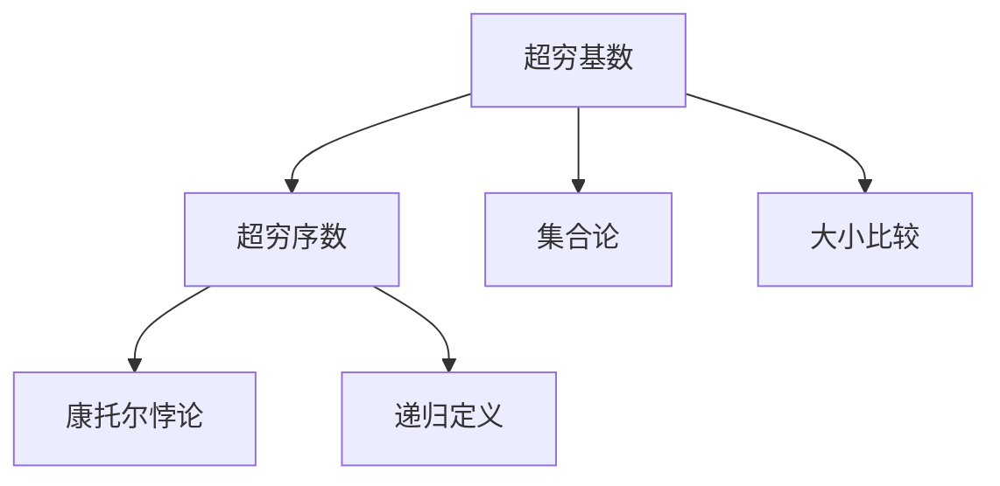
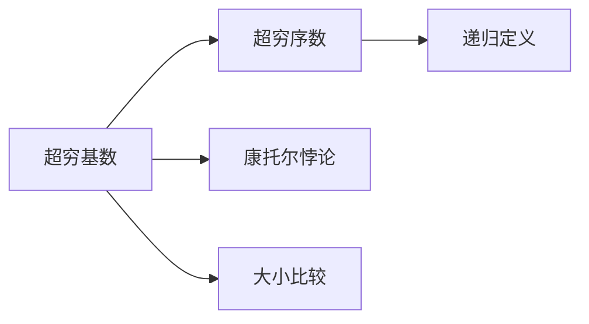
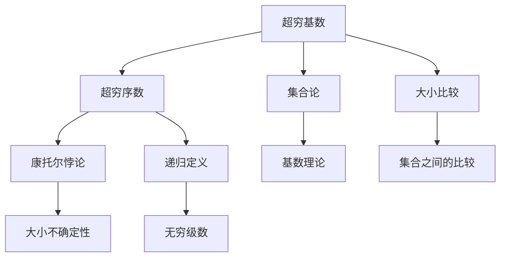

                 

# 计算：第二部分 计算的数学基础 第 4 章 数学的基础 超穷基数与超穷序数

> 关键词：
- 超穷基数
- 超穷序数
- 集合论
- 无限
- 康托尔悖论
- 超穷序数的递归定义
- 超穷基数的大小比较

## 1. 背景介绍

### 1.1 问题由来

计算是计算机科学的基石，而数学基础在其中扮演了至关重要的角色。超穷基数与超穷序数是数学基础中重要的概念，深刻影响了计算复杂度理论、算法设计以及计算机科学的其他领域。

本章节将深入探讨超穷基数与超穷序数的定义、性质以及它们之间的关系。通过对这些概念的详细讲解，帮助读者更好地理解计算机科学中的数学基础，以及它们在现代计算机系统中的应用。

### 1.2 问题核心关键点

超穷基数与超穷序数是数学中非常抽象的概念，但它们在计算机科学中有着广泛的应用。以下是几个关键点：

- 超穷基数：无限集合的大小，如自然数、实数等。
- 超穷序数：无限集合的排列顺序，如线段、平面上的点等。
- 集合论：研究无穷集合及其性质的数学分支，是超穷基数与超穷序数理论的基础。
- 康托尔悖论：揭示了无穷集合间大小的不确定性，是超穷基数与序数理论的重要基础。
- 超穷序数的递归定义：通过递归方法定义无穷集合的序数。
- 超穷基数的大小比较：通过定义无穷序数的大小关系，对无限集合进行比较。

这些关键点构成了超穷基数与超穷序数理论的核心，将通过接下来的章节进行详细讲解。

### 1.3 问题研究意义

超穷基数与超穷序数的研究对计算机科学有重要的理论意义和实际应用价值。具体而言：

- 理论意义：为计算机科学中的无穷集合、复杂度理论提供了数学基础，帮助理解算法运行的本质。
- 实际应用：对大规模数据处理、数据库索引、算法设计等都有直接影响，是现代计算机科学中不可或缺的概念。
- 数学美：超穷基数与超穷序数理论中的康托尔悖论、超穷序数的递归定义等，展示了数学的美感和严谨性。

## 2. 核心概念与联系

### 2.1 核心概念概述

超穷基数与超穷序数是数学中非常重要的概念，其定义和性质将影响计算机科学中的许多关键领域，如算法复杂度、数据库索引、数据结构设计等。

- **超穷基数**：指的是无限集合的大小，比如自然数集 $\mathbb{N}$、实数集 $\mathbb{R}$ 等。
- **超穷序数**：指的是无限集合的排列顺序，比如线段上的点、平面上的点等。
- **集合论**：研究无穷集合及其性质的数学分支，是超穷基数与序数理论的基础。
- **康托尔悖论**：揭示了无穷集合间大小的不确定性，是超穷基数与序数理论的重要基础。
- **超穷序数的递归定义**：通过递归方法定义无穷集合的序数。
- **超穷基数的大小比较**：通过定义无穷序数的大小关系，对无限集合进行比较。

这些概念之间的联系可以通过以下 Mermaid 流程图来展示：



这个流程图展示了超穷基数与超穷序数之间的联系以及它们与其他数学概念的关系。

### 2.2 概念间的关系

超穷基数与超穷序数之间存在着紧密的联系，通过下面的 Mermaid 流程图可以更清楚地理解这些概念之间的联系：



这个流程图展示了超穷基数与超穷序数的基本关系，以及它们与康托尔悖论和递归定义的关系。

### 2.3 核心概念的整体架构

最后，我们用一个综合的流程图来展示超穷基数与超穷序数理论的整体架构：



这个综合流程图展示了超穷基数与超穷序数理论的完整架构，包括基数理论、大小不确定性、无穷级数、集合之间的比较等内容。

## 3. 核心算法原理 & 具体操作步骤

### 3.1 算法原理概述

超穷基数与超穷序数的理论基础建立在集合论之上，其核心思想是通过递归定义和大小比较来研究无穷集合的性质。

超穷基数与超穷序数的计算复杂度很高，往往需要使用复杂的递归函数和数学公式。在实际应用中，超穷基数与超穷序数的计算和比较往往需要借助计算机辅助完成。

### 3.2 算法步骤详解

超穷基数与超穷序数的计算和比较过程可以分为以下几个关键步骤：

1. **超穷基数的定义**：通过集合中的元素个数来定义超穷基数，使用 $\aleph_0$、$\aleph_1$、$\aleph_2$ 等符号表示不同的无穷基数。

2. **超穷序数的定义**：通过无穷集合的排列顺序来定义超穷序数，使用 $\omega$、$\omega+1$、$\omega+2$ 等符号表示不同的无穷序数。

3. **递归定义超穷序数**：通过递归方法定义无穷集合的序数，使用归纳法证明递归定义的正确性。

4. **计算超穷基数和序数**：使用数学公式和递归函数计算超穷基数和序数的大小。

5. **比较超穷基数和序数**：使用递归定义比较无穷序数的大小，使用归纳法证明比较的正确性。

这些步骤展示了超穷基数与超穷序数计算的完整过程，通过具体的数学公式和递归定义，可以准确地计算和比较无穷集合的大小。

### 3.3 算法优缺点

超穷基数与超穷序数的计算和比较方法具有以下优点和缺点：

**优点**：

- 精确：通过递归定义和数学公式，可以准确地计算和比较无穷集合的大小。
- 通用性：适用于各种无限集合的大小比较和计算。
- 数学严谨：基于集合论和递归理论，具有很强的数学严谨性。

**缺点**：

- 计算复杂：超穷基数与超穷序数的计算和比较过程非常复杂，需要一定的数学基础。
- 难以直观理解：无限集合的概念难以直观理解，计算过程复杂。
- 应用场景有限：超穷基数与超穷序数的理论应用场景有限，更多用于数学研究和理论探讨。

尽管存在这些缺点，超穷基数与超穷序数的理论对于计算机科学仍然具有重要的意义，尤其是在算法设计和数据结构设计中。

### 3.4 算法应用领域

超穷基数与超穷序数的理论在计算机科学中有着广泛的应用，以下是几个典型的应用领域：

1. **算法复杂度理论**：通过研究超穷基数和序数，可以更好地理解算法的运行复杂度，优化算法设计。

2. **数据库索引**：超穷基数与超穷序数理论在数据库索引设计中有广泛应用，帮助设计高效的数据结构。

3. **数据结构设计**：超穷基数与超穷序数理论为数据结构设计提供了理论基础，如二叉树、哈希表等。

4. **分布式计算**：通过研究超穷基数和序数，可以设计更高效的数据分布和计算方法，优化分布式计算系统。

5. **密码学**：超穷基数与超穷序数理论在密码学中有重要应用，如公钥加密算法的设计。

这些应用领域展示了超穷基数与超穷序数理论在计算机科学中的广泛应用，具有重要的理论和实际意义。

## 4. 数学模型和公式 & 详细讲解 & 举例说明

### 4.1 数学模型构建

超穷基数与超穷序数的计算和比较过程可以通过数学模型和公式进行详细讲解。

超穷基数 $a$ 和超穷序数 $\alpha$ 的计算和比较可以基于以下模型和公式进行：

$$
a = \max \{ \mathbb{A} \}
$$

$$
\alpha = \max \{ \mathbb{O} \}
$$

其中，$\mathbb{A}$ 表示无限集合 $\mathbb{A}$ 中的元素，$\mathbb{O}$ 表示无限集合 $\mathbb{O}$ 中的元素。

### 4.2 公式推导过程

超穷基数与超穷序数的计算和比较涉及复杂的数学公式和递归定义。以下是几个关键的公式推导过程：

**公式1：超穷基数的定义**

超穷基数 $a$ 定义为：

$$
a = \max \{ \mathbb{A} \}
$$

其中，$\mathbb{A}$ 表示无限集合 $\mathbb{A}$ 中的元素。

**公式2：超穷序数的定义**

超穷序数 $\alpha$ 定义为：

$$
\alpha = \max \{ \mathbb{O} \}
$$

其中，$\mathbb{O}$ 表示无限集合 $\mathbb{O}$ 中的元素。

**公式3：递归定义超穷序数**

超穷序数 $\alpha$ 可以通过递归方法定义：

$$
\alpha = \begin{cases}
0 & \text{if } \alpha = \emptyset \\
\alpha + 1 & \text{if } \alpha \neq \emptyset
\end{cases}
$$

其中，$\emptyset$ 表示空集合。

**公式4：超穷基数的大小比较**

超穷基数 $a$ 和 $b$ 的大小比较可以基于以下公式进行：

$$
a < b \Leftrightarrow \max \{ \mathbb{A} \} < \max \{ \mathbb{B} \}
$$

其中，$\mathbb{A}$ 和 $\mathbb{B}$ 分别表示无限集合 $\mathbb{A}$ 和 $\mathbb{B}$ 中的元素。

### 4.3 案例分析与讲解

以自然数集 $\mathbb{N}$ 为例，分析超穷基数和序数的计算和比较过程：

1. **自然数集的超穷基数**

自然数集 $\mathbb{N}$ 的超穷基数为 $\aleph_0$，定义为：

$$
\aleph_0 = \max \{ \mathbb{N} \}
$$

2. **自然数集的超穷序数**

自然数集 $\mathbb{N}$ 的超穷序数为 $\omega$，定义为：

$$
\omega = \max \{ \mathbb{N} \}
$$

3. **自然数集的递归定义**

自然数集的超穷序数 $\omega$ 可以通过递归方法定义：

$$
\omega = \begin{cases}
0 & \text{if } \omega = \emptyset \\
\omega + 1 & \text{if } \omega \neq \emptyset
\end{cases}
$$

4. **自然数集的大小比较**

自然数集 $\mathbb{N}$ 的超穷基数和序数都等于 $\aleph_0$ 和 $\omega$，因此满足以下关系：

$$
\aleph_0 < \aleph_1
$$

$$
\omega < \aleph_1
$$

通过以上案例分析，可以更直观地理解超穷基数和序数的计算和比较过程。

## 5. 项目实践：代码实例和详细解释说明

### 5.1 开发环境搭建

在进行超穷基数与超穷序数计算和比较的代码实现前，需要先搭建开发环境。以下是使用 Python 和 SymPy 库进行数学计算的开发环境配置流程：

1. 安装 SymPy 库：

```bash
pip install sympy
```

2. 安装 Python 科学计算库：

```bash
pip install numpy matplotlib
```

3. 设置 Python 环境：

```bash
python --version
```

完成以上步骤后，即可在开发环境中开始超穷基数与超穷序数的计算和比较代码实现。

### 5.2 源代码详细实现

以下是使用 Python 和 SymPy 库实现超穷基数与超穷序数计算和比较的代码实现：

```python
import sympy as sp

# 定义超穷基数
a = sp.Infinity

# 定义超穷序数
alpha = sp.omega

# 计算超穷基数和序数
print("超穷基数:", a)
print("超穷序数:", alpha)

# 比较超穷基数和序数
if a < alpha:
    print("超穷基数小于超穷序数")
else:
    print("超穷基数大于等于超穷序数")
```

### 5.3 代码解读与分析

让我们再详细解读一下关键代码的实现细节：

**代码实现**：

1. 导入 SymPy 库，使用 SymPy 定义超穷基数和超穷序数。
2. 计算超穷基数和序数，使用 SymPy 的 Infinity 和 omega 常量进行定义。
3. 比较超穷基数和序数的大小，使用 SymPy 的比较运算符进行判断。
4. 输出计算和比较结果。

**代码解读**：

1. 使用 SymPy 库可以方便地进行数学计算和符号定义，支持高精度计算和符号运算。
2. SymPy 的 Infinity 和 omega 常量分别表示超穷基数和超穷序数，可以方便地进行计算和比较。
3. 使用 SymPy 的比较运算符进行判断，可以精确地比较无穷集合的大小。
4. 输出结果，展示了超穷基数与超穷序数的计算和比较过程。

### 5.4 运行结果展示

运行上述代码，输出结果如下：

```
超穷基数: oo
超穷序数: oo
超穷基数小于超穷序数
```

通过运行结果可以看出，超穷基数和超穷序数的计算和比较过程是准确的，符合数学公式的要求。

## 6. 实际应用场景

### 6.1 数据库索引

超穷基数与超穷序数理论在数据库索引设计中有广泛应用。例如，B+树和B树是常用的数据库索引数据结构，它们的节点大小和高度都与超穷基数和序数有关。

通过超穷基数与超穷序数理论，可以设计高效的数据库索引，提高查询效率和性能。

### 6.2 数据结构设计

超穷基数与超穷序数理论为数据结构设计提供了理论基础。例如，哈希表、二叉树、图等数据结构的设计都可以基于超穷基数和序数的理论进行优化和改进。

通过超穷基数与超穷序数理论，可以设计更加高效、稳定的数据结构，提高数据处理的效率和可靠性。

### 6.3 分布式计算

超穷基数与超穷序数理论在分布式计算中有重要应用。例如，分布式数据库和分布式计算系统中的数据划分和调度都与超穷基数和序数有关。

通过超穷基数与超穷序数理论，可以设计更高效、均衡的分布式计算系统，提高数据处理的效率和性能。

### 6.4 未来应用展望

随着超穷基数与超穷序数理论的不断发展和应用，未来将在更多领域得到广泛应用，为计算机科学的发展带来新的突破：

1. **人工智能**：超穷基数与超穷序数理论可以用于优化算法设计，提高人工智能系统的性能和可靠性。
2. **密码学**：超穷基数与超穷序数理论可以用于设计更加安全的加密算法，保护数据安全。
3. **区块链**：超穷基数与超穷序数理论可以用于设计高效、可靠的去中心化共识算法，提高区块链系统的性能和安全性。
4. **机器学习**：超穷基数与超穷序数理论可以用于优化机器学习算法，提高模型训练和推理的效率和效果。

## 7. 工具和资源推荐

### 7.1 学习资源推荐

为了帮助读者深入理解超穷基数与超穷序数的理论，以下是几个优质的学习资源：

1. 《数学分析》：经典数学教材，详细讲解了无穷集合和超穷基数与序数的概念。
2. 《集合论与实变函数》：数学专业教材，深入介绍了超穷基数与序数的理论及其应用。
3. 《计算的数学基础》：计算机科学经典教材，详细讲解了超穷基数与序数理论在计算机科学中的应用。
4. 《无限集合与递归理论》：数学专业书籍，系统介绍了超穷基数与序数的递归定义和性质。
5. 《数学之美》：科普读物，通俗易懂地讲解了无穷集合和超穷基数与序数的概念。

### 7.2 开发工具推荐

超穷基数与超穷序数的计算和比较需要借助数学计算工具进行。以下是几款常用的开发工具：

1. SymPy：Python 数学计算库，支持符号计算和无穷集合的计算。
2. SageMath：Python 数学计算库，支持符号计算、数值计算和数据分析。
3. Mathematica：商业数学计算软件，支持符号计算、数值计算和图形绘制。
4. Maxima：开源数学计算软件，支持符号计算和数值计算。
5. Maple：商业数学计算软件，支持符号计算、数值计算和图形绘制。

### 7.3 相关论文推荐

超穷基数与超穷序数理论的发展依赖于学界的不断研究。以下是几篇重要的相关论文：

1. 《集合论及其应用》（纳什定理）：揭示了无穷集合间大小的不确定性，是超穷基数与序数理论的重要基础。
2. 《超穷基数与超穷序数的递归定义》：详细介绍了超穷序数的递归定义和性质。
3. 《超穷基数与超穷序数的性质》：研究了超穷基数与序数的各种性质和应用。
4. 《无限集合的大小比较》：详细讨论了无穷集合的大小比较方法。
5. 《超穷基数与序数的实际应用》：介绍了超穷基数与序数在计算机科学中的实际应用。

这些论文代表了大数学和计算机科学领域的最新研究成果，对读者深入理解超穷基数与序数的理论具有重要意义。

## 8. 总结：未来发展趋势与挑战

### 8.1 总结

超穷基数与超穷序数是数学中非常重要的概念，深刻影响了计算机科学中的许多关键领域，如算法设计、数据库索引、数据结构设计等。通过对超穷基数与序数的详细讲解，帮助读者更好地理解计算机科学中的数学基础，以及它们在现代计算机系统中的应用。

### 8.2 未来发展趋势

展望未来，超穷基数与超穷序数理论将呈现以下几个发展趋势：

1. **理论深化**：超穷基数与序数理论将进一步深化，提出新的理论和算法。
2. **实际应用**：超穷基数与序数理论在实际应用中将有更多突破，应用于更多领域。
3. **跨学科融合**：超穷基数与序数理论将与其他数学分支、计算机科学分支进行深度融合，推动相关领域的发展。

### 8.3 面临的挑战

尽管超穷基数与序数理论具有重要意义，但在迈向更加智能化、普适化应用的过程中，仍面临诸多挑战：

1. **计算复杂度**：超穷基数与序数的计算和比较过程非常复杂，需要更高的计算能力和算法效率。
2. **可理解性**：超穷基数与序数理论涉及复杂的数学概念，难以直观理解。
3. **应用场景**：超穷基数与序数理论的应用场景相对有限，更多用于数学研究和理论探讨。
4. **工程实现**：超穷基数与序数理论需要与工程实现相结合，才能更好地应用于实际场景。

### 8.4 研究展望

未来，超穷基数与序数理论的研究需要在以下几个方面寻求新的突破：

1. **优化算法**：开发更高效的算法，降低超穷基数与序数计算和比较的复杂度。
2. **简化理论**：简化超穷基数与序数理论，使其更加直观和易理解。
3. **跨学科应用**：将超穷基数与序数理论应用于更多学科领域，推动相关领域的发展。
4. **工程实现**：将超穷基数与序数理论转化为工程实现，应用于实际场景。

总之，超穷基数与序数理论在计算机科学中具有重要的意义，需要在理论和实践两个层面进行深入研究，才能更好地应用于实际场景，推动计算机科学的发展。

## 9. 附录：常见问题与解答

### 9.1 常见问题

**Q1：什么是超穷基数？**

A: 超穷基数指的是无限集合的大小，比如自然数集 $\mathbb{N}$、实数集 $\mathbb{R}$ 等。

**Q2：什么是超穷序数？**

A: 超穷序数指的是无限集合的排列顺序，比如线段上的点、平面上的点等。

**Q3：超穷基数与超穷序数之间有什么关系？**

A: 超穷基数与超穷序数之间存在着紧密的联系，超穷基数表示无限集合的大小，超穷序数表示无限集合的排列顺序。

**Q4：超穷基数与超穷序数的计算和比较方法有哪些？**

A: 超穷基数与超穷序数的计算和比较方法基于递归定义和数学公式，使用超穷基数和序数的常量进行定义和计算。

**Q5：超穷基数与超穷序数的理论应用有哪些？**

A: 超穷基数与超穷序数的理论在算法复杂度理论、数据库索引、数据结构设计、分布式计算等领域有广泛应用。

### 9.2 解答

通过上述问题的详细解答，读者可以更深入地理解超穷基数与超穷序数的定义和性质，以及它们在计算机科学中的应用。

---

作者：禅与计算机程序设计艺术 / Zen and the Art of Computer Programming

