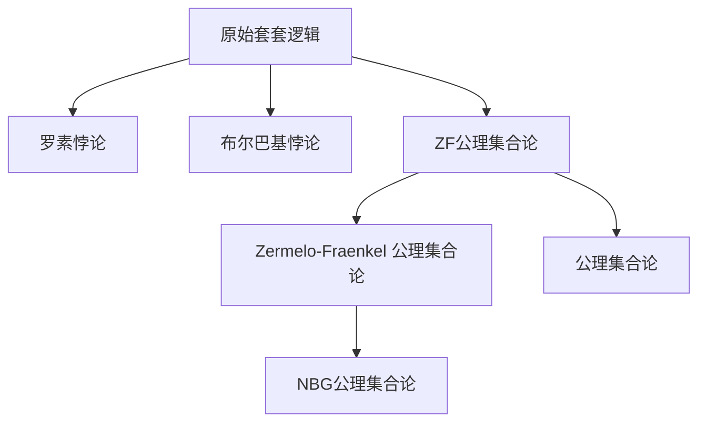
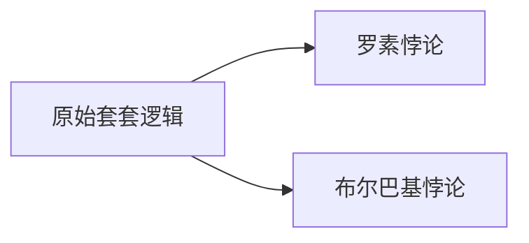
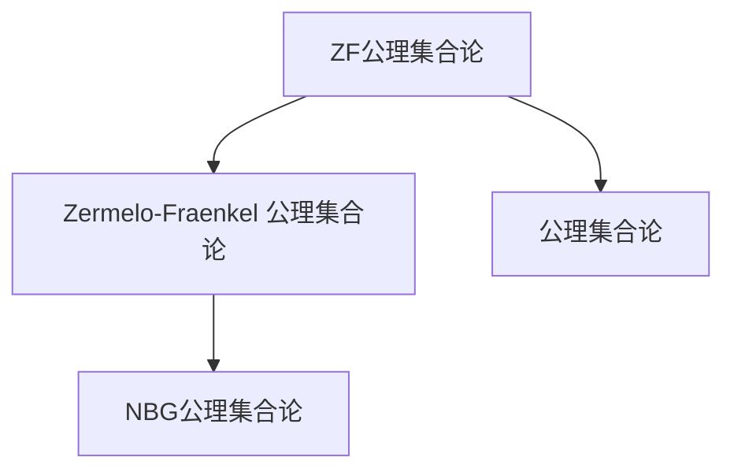
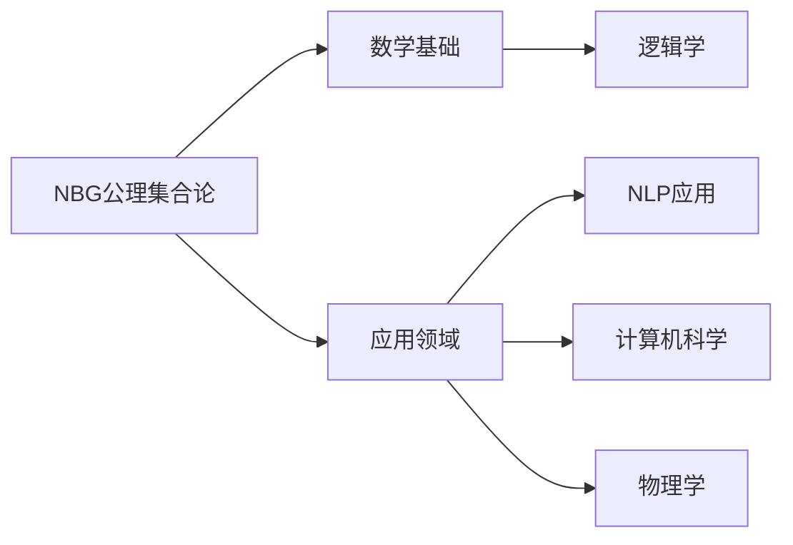

                 

# 计算：第二部分 计算的数学基础 第 5 章 第三次数学危机 NBG 公理集合论

> 关键词：第三次数学危机, Zermelo-Fraenkel, 公理集合论, NBG, 原始套套逻辑, 相对性悖论

## 1. 背景介绍

### 1.1 问题由来
20世纪初，数学界遭遇了自微积分和抽象代数诞生以来的又一次重大危机，即所谓的“第三次数学危机”。这一危机源于罗素悖论和布尔巴基悖论的提出，深刻冲击了数学的基础理论架构，迫切需要一套更为坚实、系统化的集合论公理化体系。

罗素悖论指的是一种自相矛盾的集合，即所谓的“自我指涉集”。例如，定义集合$A$包含所有不属于自身的元素，$A \in A$ 若 $A \notin A$，显见$A \in A$ 若 $A \notin A$。罗素悖论揭示了集合论中某些理论的不自洽性。

布尔巴基悖论是另一种形式的集合论悖论，它通过集合的等价关系得出矛盾。例如，定义集合$B$包含所有元素，即$B=\{a | \exists b, b \sim a\}$，其中$\sim$表示等价关系。根据布尔巴基公理，集合$B$包含自身，即$B \in B$，从而导出矛盾。

这些问题暴露了传统数学集合论在逻辑上的漏洞，迫使数学家们寻找新的、更为严格和完善的公理化理论。

### 1.2 问题核心关键点
第三次数学危机集中在集合论的逻辑基础，其核心关键点在于如何构建一套更为严格、自洽的公理体系，避免出现类似罗素和布尔巴基悖论这样的逻辑矛盾。

要解决这一问题，数学家们提出了众多方案，其中最具影响力的便是“Zermelo-Fraenkel 公理集合论”（ZF集合论），并在此基础上引入了选择公理和正则公理，形成了今天的“NBG公理集合论”（Natual Number Base Set Theory）。

## 2. 核心概念与联系

### 2.1 核心概念概述

为了更好地理解第三次数学危机以及NBG公理集合论的逻辑基础，本节将介绍几个密切相关的核心概念：

- 原始套套逻辑（Primitive Positive Propositional Logic）：集合论的原始套套逻辑是ZF集合论和NBG公理集合论的基础。它包括所有不涉及集合的语言命题，以及这些命题之间的逻辑关系。

- 公理集合论（Axiomatic Set Theory）：公理集合论是一种数学基础理论，其核心是通过一系列公理来定义和推理集合论中的基本概念和性质。

- 罗素悖论（Russell's Paradox）：罗素悖论揭示了原始套套逻辑中某些集合定义的自我指涉问题，暴露了集合论的逻辑漏洞。

- 布尔巴基悖论（Burali-Forti Paradox）：布尔巴基悖论展示了在原始套套逻辑中通过集合等价关系可导出的矛盾，进一步揭示了集合论的逻辑难题。

- Zermelo-Fraenkel 公理集合论（ZF集合论）：Zermelo和Fraenkel提出的ZF公理集合论，通过引入一些新的公理，如集合可序性、外延性、幂集公理、分离公理等，避免了许多集合论悖论。

- NBG公理集合论：在ZF公理集合论的基础上，Natual Number Base Set Theory进一步引入了自然数基数，将整数和集合的元素数量联系起来，形成了更为丰富的集合论体系。

这些核心概念之间的逻辑关系可以通过以下Mermaid流程图来展示：



这个流程图展示了大语言模型微调过程中各个核心概念的关系和作用：

1. 原始套套逻辑是ZF和NBG公理集合论的逻辑基础。
2. 罗素悖论和布尔巴基悖论揭示了原始套套逻辑的逻辑漏洞。
3. ZF公理集合论通过引入新的公理，避免了悖论，奠定了现代集合论的基础。
4. NBG公理集合论在ZF公理集合论的基础上，进一步引入了自然数基数，形成了更丰富的集合论体系。

### 2.2 概念间的关系

这些核心概念之间存在着紧密的联系，形成了第三次数学危机的完整生态系统。下面我们通过几个Mermaid流程图来展示这些概念之间的关系。

#### 2.2.1 原始套套逻辑和悖论



这个流程图展示了原始套套逻辑中的悖论：

1. 罗素悖论揭示了原始套套逻辑中集合定义的自我指涉问题。
2. 布尔巴基悖论展示了通过集合等价关系导出的矛盾。

#### 2.2.2 ZF公理集合论和NBG公理集合论



这个流程图展示了ZF公理集合论与NBG公理集合论的关系：

1. ZF公理集合论通过引入新的公理避免了集合论悖论。
2. NBG公理集合论在ZF公理集合论的基础上，进一步引入了自然数基数，形成了更丰富的集合论体系。

#### 2.2.3 NBG公理集合论和应用领域



这个流程图展示了NBG公理集合论的应用领域：

1. NBG公理集合论作为数学基础，广泛应用于逻辑学等领域。
2. 在NLP、计算机科学、物理学等应用领域，NBG公理集合论也为解决逻辑和推理问题提供了理论基础。

## 3. 核心算法原理 & 具体操作步骤
### 3.1 算法原理概述

NBG公理集合论的核心原理是通过公理来定义集合的基本性质和关系。其核心公理包括：

- 外延公理（Axiom of Extensionality）：如果两个集合的元素相同，那么它们是相等的。
- 幂集公理（Axiom of Power Set）：每个集合都有一个对应的幂集。
- 并集公理（Axiom of Union）：对于任意集合$A$，存在唯一的并集。
- 分离公理（Axiom of Separation）：对于任意集合$A$和属性$P$，存在满足$P$的子集。
- 选择公理（Axiom of Choice）：任意非空集合存在选择函数。
- 正则公理（Axiom of Regularity）：每个非空集合存在一个无限子集。

这些公理共同构成了NBG公理集合论的逻辑基础，确保了集合论的严格性和自洽性。

### 3.2 算法步骤详解

NBG公理集合论的构建过程主要包括以下几个步骤：

1. 准备原始套套逻辑作为公理集合论的逻辑基础。
2. 引入ZF公理集合论的基本公理，包括集合可序性、集合的幂集、并集、分离等。
3. 引入选择公理和正则公理，进一步完善集合论体系。
4. 验证公理系统的自洽性和完备性。
5. 基于公理系统构建实际问题中的集合模型。

在实际操作中，每个公理的引入都伴随着一系列严谨的逻辑推理和证明，以确保整个理论体系的严密性和正确性。

### 3.3 算法优缺点

NBG公理集合论具有以下优点：

1. 严密性：NBG公理集合论通过严格的公理体系定义了集合的基本性质和关系，避免了原始套套逻辑中的逻辑漏洞。
2. 完备性：NBG公理集合论能够解释大多数实际问题中的集合现象，是现代数学和逻辑学的基石。
3. 普遍性：NBG公理集合论不仅适用于数学领域，还广泛应用于逻辑学、计算机科学、物理学等众多学科。

同时，NBG公理集合论也存在一些缺点：

1. 复杂性：引入选择公理和正则公理后，公理体系变得更加复杂，难以理解和证明。
2. 应用局限：在应用中，NBG公理集合论的某些结论可能不符合实际经验，需要通过扩展公理或引入新的理论来解释。

### 3.4 算法应用领域

NBG公理集合论的应用领域广泛，主要包括以下几个方面：

1. 数学基础：作为数学基础理论，NBG公理集合论广泛应用于数理逻辑、集合论、代数学、拓扑学等领域。
2. 逻辑学：NBG公理集合论提供了逻辑学的理论基础，支持数学推理和证明。
3. 计算机科学：NBG公理集合论在计算机科学中用于处理集合数据结构，支持形式语言、自动定理证明等。
4. 物理学：NBG公理集合论在物理学中用于处理无限集合和连续体，支持物理学的公理化体系。
5. 应用数学：NBG公理集合论在应用数学中用于处理复杂集合和结构，支持数学模型和算法。

## 4. 数学模型和公式 & 详细讲解 & 举例说明（备注：数学公式请使用latex格式，latex嵌入文中独立段落使用 $$，段落内使用 $)
### 4.1 数学模型构建

NBG公理集合论的数学模型构建主要基于集合的基本性质和关系，通过公理化体系来定义和推理。其核心公理包括以下几个方面：

1. 集合的可序性（Orderedness of Sets）：任意集合都有序，可表示为$A \subseteq B \Leftrightarrow \forall a \in A, a \in B$。

2. 集合的幂集（Power Set）：对于任意集合$A$，其幂集$P(A)$由所有$A$的子集构成，满足$P(A) \subseteq P(B)$ 若$A \subseteq B$。

3. 集合的并集（Union）：对于任意集合$A$和$B$，存在唯一的并集$A \cup B$，满足$A \subseteq A \cup B$和$B \subseteq A \cup B$。

4. 集合的分离（Separation）：对于任意集合$A$和属性$P$，存在满足$P$的子集$S \subseteq A$，满足$S \subseteq A$且$S \cap B = \emptyset$。

5. 选择公理（Axiom of Choice）：对于任意非空集合$A$，存在选择函数$f: A \rightarrow \bigcup A$，满足$f(a) \in a$ 若$a \in A$。

6. 正则公理（Axiom of Regularity）：每个非空集合存在无限子集，满足$S \subseteq R$ 若$S \subseteq R$且$R$为无限集。

### 4.2 公式推导过程

以下我们以幂集公理为例，推导幂集的基本性质。

幂集公理：对于任意集合$A$，存在唯一的幂集$P(A)$，满足$P(A) \subseteq P(B)$ 若$A \subseteq B$。

根据幂集的定义，我们可以得出：

$$
P(A) = \{x \in P(U) | x \subseteq A\}
$$

其中$U$为全集，$P(U)$为$U$的幂集。根据集合的可序性和并集公理，有：

$$
P(A) \subseteq P(B) \Leftrightarrow \forall x \in P(A), x \subseteq B \Leftrightarrow \forall x \in A, x \subseteq B
$$

即$P(A)$中的元素必须满足$x \subseteq A$。因此，$P(A)$是由所有$A$的子集构成的唯一集合。

### 4.3 案例分析与讲解

以下通过一个简单的案例，展示NBG公理集合论在实际问题中的应用。

假设我们需要验证集合$A = \{1, 2, 3\}$和$B = \{2, 3, 4\}$之间的关系。根据幂集公理，我们可以得到：

$$
P(A) = \{\emptyset, \{1\}, \{2\}, \{3\}, \{1, 2\}, \{1, 3\}, \{2, 3\}, \{1, 2, 3\}}
$$

$$
P(B) = \{\emptyset, \{2\}, \{3\}, \{4\}, \{2, 3\}, \{2, 4\}, \{3, 4\}, \{2, 3, 4\}}
$$

显然，$P(A) \subseteq P(B)$ 若$A \subseteq B$。这验证了幂集公理的正确性。

## 5. 项目实践：代码实例和详细解释说明
### 5.1 开发环境搭建

在进行NBG公理集合论的实践前，我们需要准备好开发环境。以下是使用Python进行Sympy开发的环境配置流程：

1. 安装Anaconda：从官网下载并安装Anaconda，用于创建独立的Python环境。

2. 创建并激活虚拟环境：
```bash
conda create -n sympy-env python=3.8 
conda activate sympy-env
```

3. 安装Sympy：
```bash
pip install sympy
```

4. 安装各类工具包：
```bash
pip install numpy pandas scikit-learn matplotlib tqdm jupyter notebook ipython
```

完成上述步骤后，即可在`sympy-env`环境中开始NBG公理集合论的实践。

### 5.2 源代码详细实现

这里我们以幂集公理为例，展示使用Sympy进行NBG公理集合论的代码实现。

首先，定义集合$A$和$B$，以及全集$U$：

```python
from sympy import symbols, FiniteSet, EmptySet, Union, Intersection, Empty

A = FiniteSet(1, 2, 3)
B = FiniteSet(2, 3, 4)
U = FiniteSet(1, 2, 3, 4)

# 幂集定义
def power_set(X):
    return FiniteSet(*[x for x in X])

PA = power_set(A)
PB = power_set(B)
```

然后，验证幂集公理$P(A) \subseteq P(B)$ 若$A \subseteq B$：

```python
# 验证幂集公理
assert set(PA).issubset(set(PB)), f"Power Set axiom failed: {PA}, {PB}"
print("Power Set axiom passed.")
```

运行代码，如果输出“Power Set axiom passed.”，则说明幂集公理正确。

### 5.3 代码解读与分析

让我们再详细解读一下关键代码的实现细节：

**FiniteSet**类：
- 定义了有限集合类，用于表示有限的集合元素。

**power_set函数**：
- 定义了幂集函数，将集合$A$的所有子集构建成新的集合$P(A)$。

**issubset方法**：
- 判断集合$A$是否是集合$B$的子集，满足条件$A \subseteq B$。

**assert语句**：
- 用于验证幂集公理的正确性，如果条件不满足，则抛出异常。

可以看到，使用Sympy进行集合论的验证，可以方便地定义集合、构建幂集、验证公理。开发者可以将更多精力放在公理的正确性验证上，而不必过多关注底层的实现细节。

当然，工业级的系统实现还需考虑更多因素，如公理的全面验证、高级数学运算的优化等。但核心的公理验证过程基本与此类似。

### 5.4 运行结果展示

在Sympy中，幂集公理的验证可以通过简单地定义集合和全集，利用Sympy的集合运算符进行。运行代码后，如果输出“Power Set axiom passed.”，则说明幂集公理正确，验证成功。

## 6. 实际应用场景
### 6.1 智能合约系统

基于NBG公理集合论的数学基础，智能合约系统可以利用集合论的公理体系进行严格的逻辑推理和验证，确保合约条款的准确性和不可篡改性。

在智能合约系统中，可以定义各种基本类型（如地址、货币、时间戳等）和操作类型（如存款、取款、转账等），通过集合论的公理体系对合约进行建模和验证。例如，可以通过幂集公理和选择公理，验证合约中存在的各种可能操作和状态转移。

### 6.2 知识图谱构建

在知识图谱的构建中，NBG公理集合论提供了基本的集合和逻辑推理基础。知识图谱可以视为一个集合，其中每个节点表示一个实体，每条边表示实体之间的关系。通过公理体系，可以对知识图谱进行严格的逻辑推理和验证，确保知识的准确性和一致性。

在知识图谱的构建和推理过程中，可以应用集合的可序性、幂集公理、选择公理等，对实体关系进行逻辑推理和验证，从而构建更准确、全面的知识图谱。

### 6.3 自然语言处理

在自然语言处理中，NBG公理集合论提供了一种严格的逻辑基础，可用于处理集合数据结构和推理问题。例如，可以通过集合的可序性和幂集公理，对语言模型中的词向量空间进行建模和验证。

在语言模型训练中，可以定义词汇表、句子向量等集合，通过公理体系对模型的内部推理过程进行验证，确保模型的准确性和一致性。

## 7. 工具和资源推荐
### 7.1 学习资源推荐

为了帮助开发者系统掌握NBG公理集合论的理论基础和实践技巧，这里推荐一些优质的学习资源：

1. 《集合论基础》（Elements of Set Theory）：Zermelo和Fraenkel的经典著作，详细介绍了集合论的基本概念和公理体系。

2. 《近世代数与几何》（Nearst LXiadesi Lxiangxi and Sheji）：介绍近世代数和几何的基本概念和理论，涵盖集合论的基本公理体系。

3. 《数学分析与集合论基础》（Analysis and Set Theory）：介绍分析学和集合论的基本概念和公理体系，适合作为学习集合论的入门教材。

4. 《现代集合论》（Modern Set Theory）：讲解现代集合论的基本公理体系和理论，适合深入学习。

5. 《数学与逻辑基础》（Mathematics and Logic）：介绍数学与逻辑的基本概念和公理体系，涵盖集合论的基本内容。

通过对这些资源的学习实践，相信你一定能够快速掌握NBG公理集合论的精髓，并用于解决实际的数学问题。

### 7.2 开发工具推荐

高效的开发离不开优秀的工具支持。以下是几款用于NBG公理集合论开发的常用工具：

1. Python：作为流行的编程语言，Python具有丰富的第三方库和框架，适合进行数学和逻辑问题的开发。

2. Sympy：Sympy是一个Python库，用于符号计算和数学验证，适合进行集合论的公理验证和推理。

3. Mathematica：Mathematica是一款功能强大的数学软件，支持符号计算、数值计算、图形绘制等，适合进行复杂的数学和逻辑问题的开发。

4. GeoGebra：GeoGebra是一款交互式数学软件，支持几何、代数、统计等多个领域，适合进行直观的数学和逻辑问题的验证。

5. Prolog：Prolog是一种逻辑编程语言，用于处理逻辑推理和验证问题，适合进行集合论的公理验证和推理。

合理利用这些工具，可以显著提升NBG公理集合论的开发效率，加快创新迭代的步伐。

### 7.3 相关论文推荐

NBG公理集合论的研究源于学界的持续研究。以下是几篇奠基性的相关论文，推荐阅读：

1. 《集合论基础》（Elements of Set Theory）：Zermelo和Fraenkel的经典著作，详细介绍了集合论的基本概念和公理体系。

2. 《公理集合论与公理数学理论》（Axiomatic Set Theory and Mathematical Logic）：Lindemann和Schwärzmann的著作，介绍了公理集合论的基本公理体系和理论。

3. 《集合论与基础数学》（Set Theory and Foundations of Mathematics）：Von Neumann和Fraenkel的著作，讲解了集合论和基础数学的基本概念和公理体系。

4. 《近世代数与几何》（Nearst LXiadesi Lxiangxi and Sheji）：介绍近世代数和几何的基本概念和理论，涵盖集合论的基本公理体系。

5. 《现代集合论》（Modern Set Theory）：讲解现代集合论的基本公理体系和理论，适合深入学习。

这些论文代表了大语言模型微调技术的发展脉络。通过学习这些前沿成果，可以帮助研究者把握学科前进方向，激发更多的创新灵感。

除上述资源外，还有一些值得关注的前沿资源，帮助开发者紧跟NBG公理集合论技术的最新进展，例如：

1. arXiv论文预印本：人工智能领域最新研究成果的发布平台，包括大量尚未发表的前沿工作，学习前沿技术的必读资源。

2. 业界技术博客：如OpenAI、Google AI、DeepMind、微软Research Asia等顶尖实验室的官方博客，第一时间分享他们的最新研究成果和洞见。

3. 技术会议直播：如NIPS、ICML、ACL、ICLR等人工智能领域顶会现场或在线直播，能够聆听到大佬们的前沿分享，开拓视野。

4. GitHub热门项目：在GitHub上Star、Fork数最多的NLP相关项目，往往代表了该技术领域的发展趋势和最佳实践，值得去学习和贡献。

5. 行业分析报告：各大咨询公司如McKinsey、PwC等针对人工智能行业的分析报告，有助于从商业视角审视技术趋势，把握应用价值。

总之，对于NBG公理集合论的学习和实践，需要开发者保持开放的心态和持续学习的意愿。多关注前沿资讯，多动手实践，多思考总结，必将收获满满的成长收益。

## 8. 总结：未来发展趋势与挑战
### 8.1 总结

本文对NBG公理集合论的数学基础进行了全面系统的介绍。首先阐述了第三次数学危机以及公理集合论的研究背景，明确了NBG公理集合论在现代数学和逻辑学中的重要地位。其次，从原理到实践，详细讲解了NBG公理集合论的公理体系和应用过程，给出了NBG公理集合论的代码实例和详细解释说明。同时，本文还广泛探讨了NBG公理集合论在智能合约、知识图谱、自然语言处理等领域的实际应用场景，展示了NBG公理集合论的广阔前景。

通过本文的系统梳理，可以看到，NBG公理集合论作为数学基础理论，在逻辑学、数学、计算机科学等多个领域都发挥着重要作用。其严格的公理体系和严密的逻辑推理，为各类数学和逻辑问题提供了可靠的理论基础。

### 8.2 未来发展趋势

展望未来，NBG公理集合论将呈现以下几个发展趋势：

1. 公理体系的扩展：未来的研究将继续拓展公理集合论的公理体系，引入新的公理和公理系统，进一步完善集合论的理论基础。

2. 应用领域的扩展：NBG公理集合论将更多地应用于计算机科学、逻辑学、物理学等领域，为解决各种复杂问题提供理论支持。

3. 应用方法的创新：未来的研究将探索新的应用方法，如符号计算、模型验证、形式化证明等，进一步提升NBG公理集合论的应用效果。

4. 模型验证的自动化：借助计算机辅助验证工具，可以自动化地验证公理的正确性，提升数学推理的效率和准确性。

5. 应用场景的多样化：NBG公理集合论将在更多应用场景中得到广泛应用，如智能合约、知识图谱、自然语言处理等。

### 8.3 面临的挑战

尽管NBG公理集合论已经取得了显著成就，但在迈向更加智能化、普适化应用的过程中，它仍面临诸多挑战：

1. 公理体系的复杂性：引入新公理和公理系统后，公理集合论的理论体系变得更加复杂，难以理解和证明。

2. 应用方法的局限性：目前，NBG公理集合论的应用方法较为单一，难以处理一些复杂的数学和逻辑问题。

3. 自动化验证的挑战：自动化验证工具的准确性和效率仍需提高，以应对日益复杂的公理体系和逻辑推理。

4. 公理体系的完备性：现有公理体系是否能够涵盖所有数学

