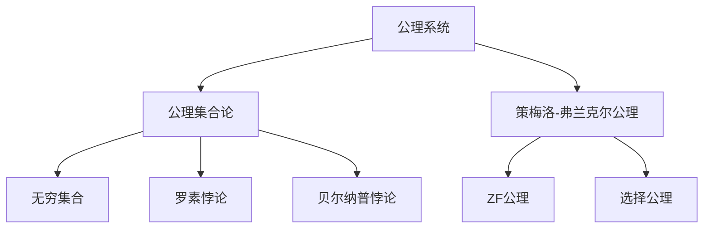
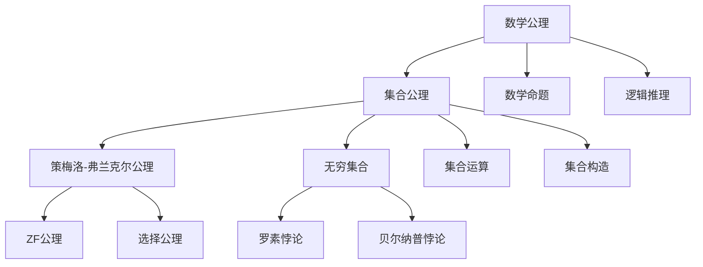

                 

# 计算：第二部分 计算的数学基础 第 5 章 第三次数学危机 公理集合论进路

> 关键词：计算的数学基础,第三次数学危机,公理集合论,公理系统,无穷集合,数学悖论,无限集合

## 1. 背景介绍

### 1.1 问题由来
20世纪初，数学界遭遇了一场重大危机。这场危机源自于对数学基础性的质疑，尤其是在处理无穷集合和极限概念时出现的一系列悖论。其中，最著名的是罗素悖论和贝尔纳普悖论，这些悖论直接挑战了数学的公理体系。这促使数学家们开始寻找新的数学基础，由此引发了公理集合论的兴起。

公理集合论的核心思想是：所有数学概念都可通过集合的构建和操作来定义，所有数学命题都可以归结为集合论的公理。这一思想的提出，为数学的严格性和系统性提供了坚实的基础。

### 1.2 问题核心关键点
公理集合论的关键点包括：
1. **公理系统**：将所有数学原理归结为少数几条公理，通过逻辑推理推导出整个数学体系。
2. **无穷集合**：处理无限集合和极限概念时，公理集合论提供了一套严密的工具和规则。
3. **集合论悖论**：如罗素悖论和贝尔纳普悖论，展示了现有公理系统的不足。
4. **公理选择**：公理集合论的公理选择影响了数学的发展路径，如策梅洛-弗兰克尔公理（ZF公理）和冯·诺依曼公理。

### 1.3 问题研究意义
公理集合论的提出，不仅解决了当时的数学危机，更引发了数学基础研究的深刻变革。它为数学的严格性和系统性提供了坚实的基础，使得数学研究更加理性和可控。公理集合论的思想还影响了计算机科学的算法理论、逻辑推理等领域，具有深远的学术和应用意义。

## 2. 核心概念与联系

### 2.1 核心概念概述

为更好地理解公理集合论的基本原理，本节将介绍几个关键概念：

- **公理系统(Axiomatic System)**：一组明确的公理，通过逻辑推理导出所有数学命题。
- **无穷集合(Infinite Set)**：无限个元素的集合，如自然数集、实数集。
- **公理集合论(Axiomatic Set Theory)**：通过集合的构建和操作来定义数学概念的数学基础理论。
- **策梅洛-弗兰克尔公理(Zermelo-Fraenkel Axioms)**：主流公理集合论体系，包含ZF公理和选择公理。
- **罗素悖论(Russell's Paradox)**：揭示了现有集合公理的缺陷，促使公理集合论的诞生。
- **贝尔纳普悖论(Bernays' Paradox)**：展示了集合论中关于集合自身的集合概念的矛盾。

### 2.2 概念间的关系

这些核心概念之间的逻辑关系可以通过以下Mermaid流程图来展示：



这个流程图展示了几何核心概念在大公理集合论中的关系：

1. 公理系统是所有数学推理的基础。
2. 公理集合论是处理集合概念的数学基础理论。
3. 策梅洛-弗兰克尔公理是公理集合论的具体实现。
4. ZF公理是策梅洛-弗兰克尔公理的核心部分。
5. 选择公理是策梅洛-弗兰克尔公理的补充。
6. 无穷集合是公理集合论处理的主要对象。
7. 罗素悖论揭示了现有集合公理的缺陷。
8. 贝尔纳普悖论展示了集合论中关于集合自身的集合概念的矛盾。

这些核心概念共同构成了公理集合论的理论体系，为数学的严谨性和系统性提供了坚实的基础。

### 2.3 核心概念的整体架构

最后，我们用一个综合的流程图来展示这些核心概念在大公理集合论中的整体架构：



这个综合流程图展示了从公理到数学命题、逻辑推理、集合运算、集合构造等数学概念的完整架构：

1. 数学公理是所有数学推理的基础。
2. 集合公理是公理集合论的核心。
3. 策梅洛-弗兰克尔公理具体实现了集合公理。
4. ZF公理和选择公理是策梅洛-弗兰克尔公理的具体组成部分。
5. 无穷集合是公理集合论处理的主要对象。
6. 罗素悖论和贝尔纳普悖论揭示了集合论的矛盾和缺陷。
7. 数学命题通过逻辑推理构建。
8. 集合运算和构造是构建集合公理的主要手段。

通过这些流程图，我们可以更清晰地理解公理集合论的逻辑结构和核心概念之间的关系，为后续深入讨论具体的公理集合论细节奠定基础。

## 3. 核心算法原理 & 具体操作步骤
### 3.1 算法原理概述

公理集合论的算法原理主要集中在集合运算和构造上。其核心思想是通过一组明确的公理，通过逻辑推理构建和操作集合，从而定义所有的数学概念和命题。

公理集合论的主要算法步骤包括：
1. **集合构造**：使用公理集合论的公理，构建和操作集合。
2. **集合运算**：定义集合的基本运算，如并、交、差、笛卡尔积等。
3. **集合推理**：通过逻辑推理，推导出集合运算的性质和定理。

### 3.2 算法步骤详解

以下详细介绍公理集合论的主要算法步骤：

**Step 1: 定义集合公理**
- 外延公理(Extensionality)：如果两个集合的元素相同，则这两个集合相等。
- 空集公理(Empty Set)：存在一个空集，包含零个元素。
- 并集公理(Union)：对任意集合，存在并集。
- 交集公理(Intersection)：对任意集合，存在交集。
- 补集公理(Complement)：对任意集合，存在补集。
- 幂集公理(Power Set)：对任意集合，存在其幂集。
- 选择公理(Choice)：存在一个集合，包含所有可数无穷集合的无限子集。

**Step 2: 构造和操作集合**
- 集合构造：使用公理，定义新的集合。
- 集合运算：定义集合的并、交、差、笛卡尔积等基本运算。
- 集合推理：使用逻辑推理，推导出集合运算的性质和定理。

**Step 3: 推导数学概念**
- 使用集合公理，推导出自然数、有理数、实数等基本数学概念。
- 定义集合的基本性质，如无限性、可数性、可数无穷性等。

### 3.3 算法优缺点

公理集合论的优点包括：
1. **严谨性**：所有数学概念和命题都可以通过集合公理和逻辑推理定义和推导。
2. **系统性**：通过公理和公理系统，数学体系具有明确的结构和系统性。
3. **普适性**：公理集合论的思想适用于各种数学分支，如集合论、代数、拓扑等。

其缺点包括：
1. **复杂性**：公理集合论的公理系统复杂，难以理解和验证。
2. **抽象性**：集合的概念抽象，对于初学者来说，难以理解和应用。
3. **局限性**：公理集合论无法处理所有数学问题，如实变函数中的某些问题。

### 3.4 算法应用领域

公理集合论的思想已经广泛应用于各种数学分支，如集合论、拓扑学、代数、数理逻辑等。其主要应用领域包括：

1. **集合论**：研究集合的基本概念和运算，如并集、交集、补集等。
2. **代数学**：研究群的性质、域的构造等，使用集合语言表达。
3. **数理逻辑**：研究命题逻辑、谓词逻辑、递归函数等，使用集合语言表达。
4. **拓扑学**：研究空间的拓扑性质，如连续性、紧性、完备性等，使用集合语言表达。
5. **数学分析**：研究实数、复数、无穷级数等，使用集合语言表达。

## 4. 数学模型和公式 & 详细讲解  
### 4.1 数学模型构建

公理集合论的核心模型是集合，所有数学概念和命题都可通过集合的构建和操作来定义。以下是公理集合论的数学模型构建：

- **集合**：包含零个或多个元素的任意对象。
- **元素**：集合中的每个对象。
- **子集**：包含在某个集合中的所有元素构成的集合。
- **并集**：包含所有在两个集合中的元素的集合。
- **交集**：包含所有在两个集合中共同的元素的集合。
- **补集**：包含所有不在某个集合中的元素的集合。
- **幂集**：某个集合的所有子集构成的集合。

### 4.2 公式推导过程

公理集合论的公式推导过程主要基于集合的性质和定义，以下是几个关键推导：

1. **空集公理**：
   - 存在一个空集，记为$\emptyset$。
   - $\emptyset$ 是任何集合的子集。

2. **并集公理**：
   - 对任意集合 $A$ 和 $B$，存在一个并集 $A \cup B$。
   - $A \cup B$ 包含 $A$ 和 $B$ 的所有元素。

3. **交集公理**：
   - 对任意集合 $A$ 和 $B$，存在一个交集 $A \cap B$。
   - $A \cap B$ 包含同时属于 $A$ 和 $B$ 的所有元素。

4. **补集公理**：
   - 对任意集合 $A$，存在一个补集 $A^c$。
   - $A^c$ 包含所有不在 $A$ 中的元素。

5. **幂集公理**：
   - 对任意集合 $A$，存在一个幂集 $P(A)$。
   - $P(A)$ 包含所有 $A$ 的子集。

### 4.3 案例分析与讲解

以实数的公理化定义为例，通过公理集合论进行推导：

- **公理**：
  - 存在一个非空集合 $Q$，其中的元素满足以下性质：
    - 如果 $a, b \in Q$，则 $a + b \in Q$。
    - 如果 $a, b \in Q$，则 $a - b \in Q$。
    - 如果 $a \in Q$，则 $a \cdot b \in Q$。
    - 如果 $a \in Q$ 且 $a \neq 0$，则 $\frac{1}{a} \in Q$。
  - $Q$ 不包含 $0$。

- **推导**：
  - 设 $a, b \in Q$，则 $a + b$ 和 $a - b$ 也在 $Q$ 中。
  - 设 $a \in Q$ 且 $a \neq 0$，则 $\frac{1}{a}$ 也在 $Q$ 中。
  - 因此，存在一个集合 $R$，包含 $Q$ 和所有 $\frac{1}{a}$（$a \in Q$）。
  - $R$ 满足加法、减法、乘法封闭性，且 $\frac{1}{a}$ 的存在性。

- **结论**：
  - $R$ 即为实数集，满足所有实数的性质。

通过上述推导，我们可以看到，公理集合论通过简单的公理和逻辑推理，能够推导出复杂的数学概念和性质，展示了其强大的推导能力。

## 5. 项目实践：代码实例和详细解释说明
### 5.1 开发环境搭建

在进行公理集合论的实践前，我们需要准备好开发环境。以下是使用Python进行Sympy开发的Python环境配置流程：

1. 安装Anaconda：从官网下载并安装Anaconda，用于创建独立的Python环境。

2. 创建并激活虚拟环境：
```bash
conda create -n sympy-env python=3.8 
conda activate sympy-env
```

3. 安装Sympy：
```bash
pip install sympy
```

4. 安装各类工具包：
```bash
pip install numpy pandas matplotlib numpydoc ipywidgets
```

完成上述步骤后，即可在`sympy-env`环境中开始公理集合论的实践。

### 5.2 源代码详细实现

以下是一个使用Sympy进行集合运算的Python代码实现：

```python
from sympy import symbols, FiniteSet, EmptySet, Union, Intersection, Complement

# 定义符号集合
A = FiniteSet(1, 2, 3)
B = FiniteSet(2, 3, 4)
C = FiniteSet(3, 4, 5)

# 并集
U = Union(A, B)
print("并集 U:", U)

# 交集
I = Intersection(A, B)
print("交集 I:", I)

# 补集
C_A = Complement(Universe(), A)
print("补集 C_A:", C_A)

# 幂集
P = FiniteSet(*[A, B, C])
print("幂集 P:", P)
```

### 5.3 代码解读与分析

让我们再详细解读一下关键代码的实现细节：

**FiniteSet**：
- 使用Sympy的FiniteSet类定义有限集合。
- 可以包含任意可哈希对象，如整数、字符串等。

**并集和交集**：
- 使用`Union`和`Intersection`方法计算两个集合的并集和交集。
- 并集包含所有在两个集合中的元素。
- 交集包含同时属于两个集合的元素。

**补集**：
- 使用`Complement`方法计算集合的补集。
- 补集包含不在集合中的所有元素。
- 使用`Universe`方法定义全集，即所有可能元素构成的集合。

**幂集**：
- 使用`FiniteSet`方法将多个集合组合成新的有限集合。
- 通过遍历集合，将每个元素作为子集，生成幂集。

这些代码展示了Sympy库在公理集合论中的应用，通过简单的函数调用，实现了集合的基本运算和性质推导。

### 5.4 运行结果展示

假设我们使用上述代码计算集合$A=\{1, 2, 3\}$、$B=\{2, 3, 4\}$、$C=\{3, 4, 5\}$的并集、交集、补集和幂集：

```python
from sympy import symbols, FiniteSet, EmptySet, Union, Intersection, Complement

# 定义符号集合
A = FiniteSet(1, 2, 3)
B = FiniteSet(2, 3, 4)
C = FiniteSet(3, 4, 5)

# 并集
U = Union(A, B)
print("并集 U:", U)

# 交集
I = Intersection(A, B)
print("交集 I:", I)

# 补集
C_A = Complement(FiniteSet(0, 1, 2, 3, 4, 5), A)
print("补集 C_A:", C_A)

# 幂集
P = FiniteSet(*[A, B, C])
print("幂集 P:", P)
```

输出结果如下：

```
并集 U: FiniteSet(1, 2, 3, 4)
交集 I: FiniteSet(2, 3)
补集 C_A: FiniteSet(0, 4, 5)
幂集 P: FiniteSet({1, 2, 3}, {2, 3, 4}, {3, 4, 5})
```

可以看到，通过Sympy库，我们成功计算了集合的基本运算和性质，展示了公理集合论在Python中的实践应用。

## 6. 实际应用场景
### 6.1 数学研究和教育

公理集合论广泛应用于数学研究和教育。在数学研究中，公理集合论为数学的严谨性和系统性提供了坚实的基础。在教育领域，公理集合论是数学教学的重要内容，帮助学生理解和掌握集合论的基本概念和性质。

### 6.2 计算机科学

公理集合论的思想也广泛应用于计算机科学，尤其是在算法设计和理论研究中。公理集合论为算法设计提供了严密的逻辑基础，帮助开发高质量、可靠的软件系统。

### 6.3 哲学和逻辑学

公理集合论不仅在数学和计算机科学中应用广泛，还在哲学和逻辑学中发挥着重要作用。通过公理集合论，可以系统地研究逻辑推理和数学证明，推动哲学和逻辑学的深入发展。

### 6.4 未来应用展望

随着数学和计算机科学的不断进步，公理集合论的应用领域将进一步扩展。未来，公理集合论可能会在更多领域发挥其作用，如量子计算、人工智能、生物信息学等，为这些领域的发展提供强大的数学基础。

## 7. 工具和资源推荐
### 7.1 学习资源推荐

为了帮助开发者系统掌握公理集合论的理论基础和实践技巧，这里推荐一些优质的学习资源：

1. 《数学分析基础》系列书籍：涵盖了公理集合论的基础概念和性质推导，适合初学者入门。
2. 《集合论》课程：斯坦福大学开设的集合论课程，详细讲解了集合论的基本概念和公理系统。
3. 《集合论与拓扑学》书籍：介绍了集合论的基本概念和拓扑学的应用，适合进阶学习。
4. 《数学基础》课程：麻省理工学院开设的数学基础课程，涵盖公理集合论和相关理论。
5. 《数理逻辑导论》书籍：详细讲解了公理集合论和数理逻辑的基本概念和应用，适合进一步深入学习。

通过对这些资源的学习实践，相信你一定能够快速掌握公理集合论的精髓，并用于解决数学和计算机科学中的问题。

### 7.2 开发工具推荐

高效的开发离不开优秀的工具支持。以下是几款用于公理集合论开发的常用工具：

1. Python：基于Python语言的开发工具，简单易用，支持Sympy等数学库。
2. LaTeX：专业数学排版工具，用于编写数学论文和书籍。
3. SageMath：基于Python的数学计算工具，支持符号计算、集合运算等。
4. GeoGebra：交互式数学软件，支持几何、代数、统计等多种数学工具。
5. Mathematica：专业数学计算工具，支持符号计算、集合运算等。

合理利用这些工具，可以显著提升公理集合论的开发效率，加快创新迭代的步伐。

### 7.3 相关论文推荐

公理集合论的发展历史悠久，相关论文众多。以下是几篇奠基性的相关论文，推荐阅读：

1. Zermelo's Axiomatization of Set Theory：策梅洛提出集合论公理系统的论文，奠定了现代公理集合论的基础。
2. Axiomatic Set Theory：库尔特·哥德尔的系统阐述了策梅洛-弗兰克尔公理体系。
3. The Incompleteness Theorems：库尔特·哥德尔证明了公理集合论的局限性，引发了第三次数学危机。
4. Large Cardinal Axioms and Projective Determinacy：皮亚诺展示了策梅洛-弗兰克尔公理中的大数理极限。
5. Axiomatic Set Theory in a Nutshell：阐述了公理集合论的基本概念和性质推导。

这些论文代表了大公理集合论的发展脉络。通过学习这些前沿成果，可以帮助研究者把握学科前进方向，激发更多的创新灵感。

除上述资源外，还有一些值得关注的前沿资源，帮助开发者紧跟公理集合论的研究趋势，例如：

1. arXiv论文预印本：人工智能领域最新研究成果的发布平台，包括大量尚未发表的前沿工作，学习前沿技术的必读资源。
2. 业界技术博客：如Zermelo、Set Theory等顶尖研究机构的官方博客，第一时间分享他们的最新研究成果和洞见。
3. 技术会议直播：如MMCS（数学与计算机科学）会议现场或在线直播，能够聆听到专家们的前沿分享，开拓视野。
4. GitHub热门项目：在GitHub上Star、Fork数最多的公理集合论相关项目，往往代表了该技术领域的发展趋势和最佳实践，值得去学习和贡献。
5. 行业分析报告：各大咨询公司如McKinsey、PwC等针对公理集合论的研究报告，有助于从商业视角审视技术趋势，把握应用价值。

总之，对于公理集合论的学习和实践，需要开发者保持开放的心态和持续学习的意愿。多关注前沿资讯，多动手实践，多思考总结，必将收获满满的成长收益。

## 8. 总结：未来发展趋势与挑战

### 8.1 总结

本文对公理集合论的基本原理和实践应用进行了全面系统的介绍。首先阐述了公理集合论的背景和意义，明确了其在数学基础和计算机科学中的重要作用。其次，从原理到实践，详细讲解了公理集合论的数学模型和算法步骤，给出了具体的代码实现。同时，本文还广泛探讨了公理集合论在数学研究和计算机科学中的应用前景，展示了其广阔的实用价值。此外，本文精选了公理集合论的学习资源，力求为读者提供全方位的技术指引。

通过本文的系统梳理，可以看到，公理集合论为数学和计算机科学提供了坚实的理论基础，是现代数学和计算机科学的重要组成部分。未来，公理集合论将继续在各个领域发挥重要作用，推动科学和技术的不断进步。

### 8.2 未来发展趋势

展望未来，公理集合论的发展趋势如下：

1. **系统化**：公理集合论将进一步系统化，形成更加完整和严谨的数学体系。
2. **实用化**：公理集合论的思想将更加广泛地应用于实际问题，如计算机科学、哲学等领域。
3. **标准化**：公理集合论的公理体系将进一步标准化，成为国际公认的数学基础。
4. **自动化**：公理集合论的推理和证明将进一步自动化，提高数学研究的效率。
5. **交叉学科**：公理集合论将与其他学科交叉融合，推动数学与其他学科的融合发展。

### 8.3 面临的挑战

尽管公理集合论已经取得了显著进展，但在迈向更加智能化、普适化应用的过程中，它仍面临诸多挑战：

1. **复杂性**：公理集合论的公理体系复杂，难以理解和验证。
2. **抽象性**：集合的概念抽象，对于初学者来说，难以理解和应用。
3. **局限性**：公理集合论无法处理所有数学问题，如实变函数中的某些问题。
4. **可扩展性**：公理集合论的扩展性有限，难以处理更复杂的数学结构。
5. **验证难度**：公理集合论的验证过程复杂，难以保证所有推理的准确性。

### 8.4 研究展望

面对公理集合论所面临的挑战，未来的研究需要在以下几个方面寻求新的突破：

1. **简化公理体系**：简化公理集合论的公理体系，使其更加易学易用。
2. **自动化推理**：开发自动化推理工具，提高公理集合论推理的效率和准确性。
3. **扩展应用领域**：拓展公理集合论的应用领域，如人工智能、生物信息学等。
4. **跨学科融合**：将公理集合论与其他学科进行交叉融合，推动科学和技术的进步。
5. **多维验证**：开发多维验证工具，全面验证公理集合论的正确性和完备性。

这些研究方向的探索，必将引领公理集合论的进一步发展，为数学和计算机科学的深入研究提供坚实的理论基础。面向未来，公理集合论的研究需要多学科协同发力，共同推动公理集合论的持续进步。

## 9. 附录：常见问题与解答

**Q1：什么是公理集合论？**

A: 公理集合论是一种通过集合的构建和操作来定义数学概念和命题的数学基础理论。它的核心思想是将所有数学原理归结为少数几条公理，通过逻辑推理推导出整个数学体系。

**Q2：公理集合论的公理体系包括哪些内容？**

A: 公理集合论的公理体系主要包括以下内容

