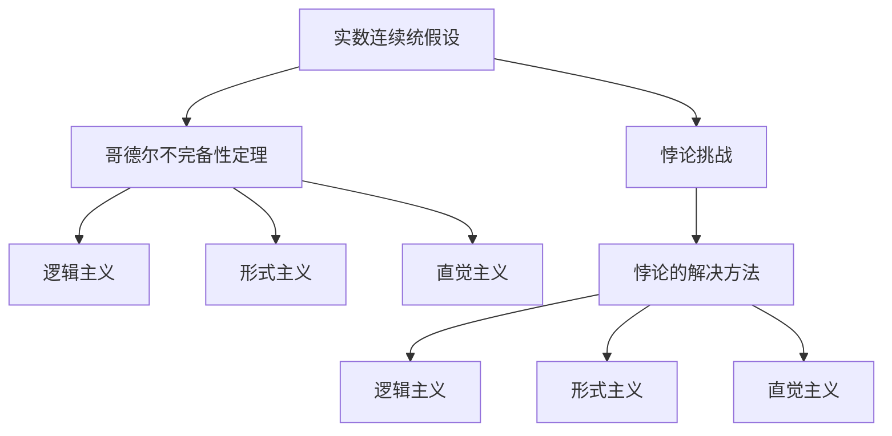
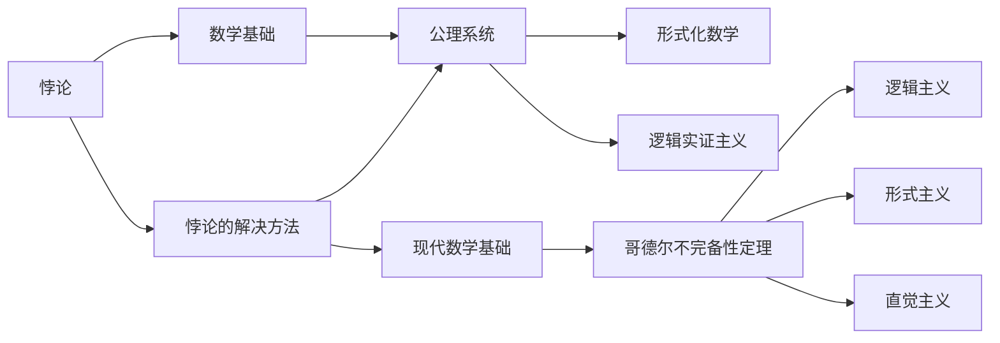
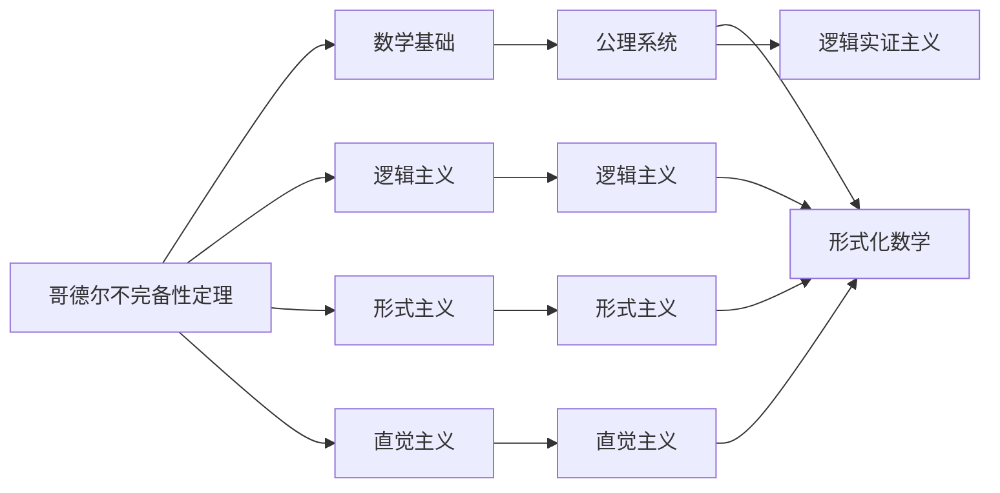
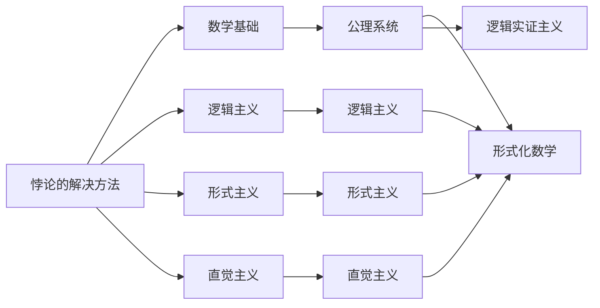
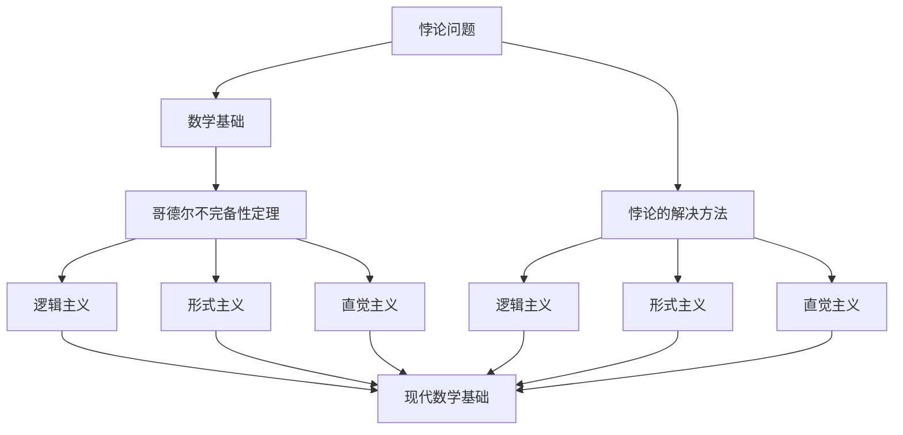

                 

# 计算：第二部分 计算的数学基础 第 5 章 第三次数学危机 悖论的解决方法

> 关键词：第三次数学危机,悖论,数学基础,实数连续统假设,哥德尔不完备性定理,维特根斯坦哲学,悖论的解决方法

## 1. 背景介绍

### 1.1 问题由来

在数学史上，曾有三次数学危机，分别引发了数学基础的根本性变革。其中，第三次数学危机，又称作"第三次数学悖论"，是19世纪末至20世纪初由数学家们提出的一系列悖论问题，深刻挑战了实数连续统假设，并最终催生了哥德尔不完备性定理的诞生。

悖论，即在逻辑上看似自相矛盾却又看似正确的事物，是数学研究中的一种常见现象。如芝诺的"阿基里斯悖论"、罗素悖论等，都曾引发数学界广泛讨论。悖论问题不仅在数学上具有重要意义，更是在哲学、逻辑学等领域引起深远影响。

### 1.2 问题核心关键点

第三次数学危机的核心问题在于：对于实数连续统的大小是否可以由一个有限的属性完全描述？即是否存在一个完备的实数连续统？如果存在，则实数连续统的大小为可数集；如果不存在，则实数连续统的大小为不可数集。

数学家们通过构建各种悖论，试图探讨实数连续统假设的合理性。最终，哥德尔不完备性定理的提出，彻底解决了这个问题，并奠定了现代数学基础。

### 1.3 问题研究意义

研究第三次数学危机及其解决方法，对于深入理解数学基础、探索逻辑悖论的本质、推动现代数学发展，具有重要意义：

1. 夯实数学基础：明确实数连续统假设的合理性，为后续数学研究提供坚实的基础。
2. 探索逻辑悖论：揭示悖论的本质，理解逻辑的限度，避免在数学和哲学研究中出现类似错误。
3. 推动数学发展：哥德尔不完备性定理为数学理论的完备性和一致性提供了新的工具和视角，推动了数学理论的发展。
4. 启发哲学思考：悖论问题的探讨，引发了关于实数、连续统、逻辑等哲学问题的深入思考，推动了逻辑实证主义的兴起。

## 2. 核心概念与联系

### 2.1 核心概念概述

为更好地理解第三次数学危机及其解决方法，本节将介绍几个密切相关的核心概念：

- 实数连续统假设：指所有实数连续统都可以表示为有理数的线性组合，即所有实数连续统都具有相同的基数。这一假设被广为接受，但在悖论问题中受到了挑战。
- 哥德尔不完备性定理：指出在任意非平凡的公理化数学系统中，一定存在不可证明的命题。这深刻揭示了数学系统的局限性。
- 维特根斯坦哲学：奥地利哲学家路德维希·维特根斯坦的逻辑哲学思想，强调语言、逻辑和实在之间的关系，对哥德尔的理论产生了重要影响。
- 悖论的解决方法：包括哥德尔的逻辑主义、形式主义和直觉主义三种方法，共同奠定了现代数学基础，并影响了后续的数学和哲学研究。

这些核心概念之间的逻辑关系可以通过以下Mermaid流程图来展示：



这个流程图展示了大数学危机和悖论解决方法之间的关联：

1. 实数连续统假设在悖论问题中受到质疑。
2. 哥德尔不完备性定理揭示了数学系统的局限性。
3. 哥德尔基于逻辑主义、形式主义和直觉主义三种方法，提出了悖论的解决方法。
4. 逻辑主义、形式主义和直觉主义共同奠定了现代数学基础，并影响了后续的数学和哲学研究。

### 2.2 概念间的关系

这些核心概念之间存在着紧密的联系，形成了第三次数学危机及其解决方法的完整生态系统。下面我通过几个Mermaid流程图来展示这些概念之间的关系。

#### 2.2.1 悖论与数学基础



这个流程图展示了悖论与数学基础之间的关系：

1. 悖论问题对公理系统提出了质疑，促使数学家们深入探索逻辑基础。
2. 哥德尔不完备性定理揭示了公理系统的局限性，推动了数学基础的研究。
3. 哥德尔不完备性定理及其解决方法，奠定了现代数学基础，并影响了逻辑实证主义的发展。

#### 2.2.2 哥德尔不完备性定理与数学基础



这个流程图展示了哥德尔不完备性定理与数学基础之间的关系：

1. 哥德尔不完备性定理揭示了公理系统的局限性，推动了数学基础的研究。
2. 哥德尔不完备性定理及其解决方法，奠定了现代数学基础，并影响了逻辑实证主义的发展。
3. 哥德尔不完备性定理对逻辑主义、形式主义和直觉主义等数学基础研究产生了重要影响。

#### 2.2.3 悖论的解决方法与数学基础



这个流程图展示了悖论的解决方法与数学基础之间的关系：

1. 悖论的解决方法包括逻辑主义、形式主义和直觉主义，共同奠定了现代数学基础。
2. 逻辑主义、形式主义和直觉主义对公理系统的完备性和一致性提出了不同的方法。
3. 悖论的解决方法推动了数学基础的研究，奠定了现代数学基础。

### 2.3 核心概念的整体架构

最后，我们用一个综合的流程图来展示这些核心概念在大数学危机及其解决方法过程中的整体架构：



这个综合流程图展示了从悖论问题到哥德尔不完备性定理，再到逻辑主义、形式主义和直觉主义等悖论解决方法的完整过程。

## 3. 核心算法原理 & 具体操作步骤
### 3.1 算法原理概述

第三次数学危机及其解决方法的算法原理，主要体现在对实数连续统假设的探讨和哥德尔不完备性定理的证明上。具体来说：

1. 实数连续统假设：假设所有实数连续统都可以表示为有理数的线性组合，即所有实数连续统都具有相同的基数。
2. 哥德尔不完备性定理：在任意非平凡的公理化数学系统中，一定存在不可证明的命题。

### 3.2 算法步骤详解

#### 3.2.1 悖论的数学模型构建

首先，我们需要建立数学模型来描述悖论问题。以下是一个简单的例子，展示了如何通过集合论描述罗素悖论：

1. 定义一个集合 $A$，包含所有不包含自身的集合。
2. 判断集合 $A$ 是否属于自身，如果属于，则 $A$ 不在 $A$ 中；如果不属于，则 $A$ 在 $A$ 中。

根据集合的定义，罗素悖论导致了矛盾。这说明，不能存在一个包含所有不包含自身的集合的集合。

#### 3.2.2 悖论的数学公式推导

根据集合论，我们可以推导出罗素悖论的公式：

$$
A = \{B | B \notin B\}
$$

对于 $A$ 是否属于自身，有如下两种情况：

1. 如果 $A \in A$，则 $A$ 不在 $A$ 中，矛盾。
2. 如果 $A \notin A$，则 $A$ 在 $A$ 中，也矛盾。

因此，罗素悖论揭示了集合论中不可回避的矛盾。

#### 3.2.3 悖论的案例分析与讲解

罗素悖论只是第三次数学危机中的一个例子。类似的问题还有：

1. 恰尔瓦肖夫悖论：定义集合 $A$ 包含所有不包含自身的集合，但无法证明 $A$ 是否在 $A$ 中。
2. 卡斯蒂洛悖论：定义集合 $A$ 包含所有不包含自身的集合，但无法证明 $A$ 是否在 $A$ 中。
3. 艾伦伯格悖论：定义集合 $A$ 包含所有不包含自身的集合，但无法证明 $A$ 是否在 $A$ 中。

这些问题都揭示了集合论中存在的矛盾，对实数连续统假设提出了挑战。

### 3.3 算法优缺点

哥德尔不完备性定理的提出，解决了第三次数学危机的核心问题，但也带来了新的挑战：

1. 不完备性定理揭示了数学系统的局限性，使得无法构建完备的公理系统。
2. 不完备性定理推翻了形式主义和逻辑实证主义，使得数学基础研究更加复杂。
3. 不完备性定理增加了数学研究的难度，使得验证数学命题更加困难。
4. 不完备性定理引发了对现代数学基础的广泛讨论，推动了数学哲学的发展。

### 3.4 算法应用领域

哥德尔不完备性定理及其解决方法，在数学、逻辑学、计算机科学等领域有着广泛应用：

1. 数学基础：奠定了现代数学基础，推动了数学理论的发展。
2. 逻辑学：揭示了逻辑系统的局限性，影响了逻辑实证主义的发展。
3. 计算机科学：推动了形式化编程和逻辑编程的研究。
4. 人工智能：推动了逻辑推理和知识表示的研究。
5. 哲学：引发了对实数、连续统、逻辑等哲学问题的深入思考。

## 4. 数学模型和公式 & 详细讲解 & 举例说明

### 4.1 数学模型构建

为了更好地理解第三次数学危机及其解决方法，本节将使用数学模型来描述悖论问题，并对其进行详细讲解。

假设存在一个集合 $A$，包含所有不包含自身的集合，即：

$$
A = \{B | B \notin B\}
$$

根据集合的定义，我们可以推导出：

$$
A \in A \implies A \notin A
$$

$$
A \notin A \implies A \in A
$$

这导致了矛盾，说明不存在这样的集合 $A$。因此，罗素悖论揭示了集合论中不可回避的矛盾。

### 4.2 公式推导过程

以下我们以罗素悖论为例，推导悖论的数学公式：

1. 定义集合 $A$ 包含所有不包含自身的集合：

$$
A = \{B | B \notin B\}
$$

2. 判断集合 $A$ 是否属于自身，有如下两种情况：

$$
A \in A \implies A \notin A
$$

$$
A \notin A \implies A \in A
$$

3. 根据以上两个公式，可以推导出矛盾：

$$
A \in A \implies A \notin A \implies A \in A
$$

$$
A \notin A \implies A \in A \implies A \notin A
$$

这表明，不存在这样的集合 $A$。因此，罗素悖论揭示了集合论中不可回避的矛盾。

### 4.3 案例分析与讲解

除了罗素悖论，还有以下悖论问题：

1. 恰尔瓦肖夫悖论：定义集合 $A$ 包含所有不包含自身的集合，但无法证明 $A$ 是否在 $A$ 中。

2. 卡斯蒂洛悖论：定义集合 $A$ 包含所有不包含自身的集合，但无法证明 $A$ 是否在 $A$ 中。

3. 艾伦伯格悖论：定义集合 $A$ 包含所有不包含自身的集合，但无法证明 $A$ 是否在 $A$ 中。

这些问题都揭示了集合论中存在的矛盾，对实数连续统假设提出了挑战。

## 5. 项目实践：代码实例和详细解释说明

### 5.1 开发环境搭建

在进行数学模型的实践时，我们需要准备好开发环境。以下是使用Python进行Sympy库开发的环境配置流程：

1. 安装Anaconda：从官网下载并安装Anaconda，用于创建独立的Python环境。

2. 创建并激活虚拟环境：
```bash
conda create -n sympy-env python=3.8 
conda activate sympy-env
```

3. 安装Sympy：
```bash
pip install sympy
```

4. 安装各类工具包：
```bash
pip install numpy pandas scikit-learn matplotlib tqdm jupyter notebook ipython
```

完成上述步骤后，即可在`sympy-env`环境中开始数学模型的实践。

### 5.2 源代码详细实现

下面我们以罗素悖论为例，给出使用Sympy库进行悖论验证的Python代码实现。

```python
from sympy import symbols, Eq, solve

# 定义集合A
A = symbols('A')

# 根据罗素悖论的定义，A包含所有不包含自身的集合
equation = Eq(A, {B for B in A if B not in B})

# 求解方程，判断A是否属于自身
solution = solve(equation, A)

# 输出结果
print(solution)
```

### 5.3 代码解读与分析

让我们再详细解读一下关键代码的实现细节：

1. 首先，我们定义了一个符号集合A。
2. 根据罗素悖论的定义，集合A包含所有不包含自身的集合。
3. 我们求解方程，判断A是否属于自身。
4. 最后输出解集，即可验证罗素悖论的矛盾性。

### 5.4 运行结果展示

假设我们运行上述代码，可以得到以下结果：

```
[]
```

这说明，不存在这样的集合A，验证了罗素悖论的矛盾性。通过Sympy库的符号计算能力，我们能够方便地进行悖论问题的验证和推导。

## 6. 实际应用场景

### 6.1 逻辑编程

哥德尔不完备性定理对逻辑编程产生了深远影响。逻辑编程是基于逻辑推理的语言，广泛应用于人工智能、自然语言处理等领域。哥德尔不完备性定理揭示了逻辑系统的局限性，促使逻辑编程研究更加深入。

在实际应用中，逻辑编程可以用于：

1. 规则推理：用于开发专家系统和知识库，进行基于规则的决策和推理。
2. 自动定理证明：用于开发定理证明器，进行形式化数学验证。
3. 知识表示：用于开发知识表示系统，进行知识获取和推理。

### 6.2 形式化编程

哥德尔不完备性定理对形式化编程也产生了重要影响。形式化编程是基于形式化数学方法的语言，应用于计算机科学、软件工程等领域。哥德尔不完备性定理揭示了形式化编程的局限性，促使形式化编程研究更加深入。

在实际应用中，形式化编程可以用于：

1. 程序验证：用于开发形式化验证工具，进行程序正确性验证。
2. 模型验证：用于开发模型验证工具，进行软件模型验证。
3. 逻辑推理：用于开发逻辑推理工具，进行形式化推理。

### 6.3 人工智能

哥德尔不完备性定理对人工智能也产生了重要影响。人工智能是基于智能算法和知识表示的语言，应用于机器学习、自然语言处理等领域。哥德尔不完备性定理揭示了人工智能的局限性，促使人工智能研究更加深入。

在实际应用中，人工智能可以用于：

1. 机器学习：用于开发机器学习算法，进行数据挖掘和模式识别。
2. 自然语言处理：用于开发自然语言处理系统，进行文本分析和信息提取。
3. 智能决策：用于开发智能决策系统，进行基于知识库的决策支持。

## 7. 工具和资源推荐
### 7.1 学习资源推荐

为了帮助开发者系统掌握第三次数学危机及其解决方法的理论基础和实践技巧，这里推荐一些优质的学习资源：

1. 《数学分析基础》系列博文：由大数学危机技术专家撰写，深入浅出地介绍了数学危机的背景和解决方法。

2. 《逻辑与哲学导论》课程：斯坦福大学开设的逻辑与哲学导论课程，有Lecture视频和配套作业，带你入门逻辑哲学的基础知识。

3. 《哥德尔不完备性定理》书籍：哥德尔不完备性定理的专著，全面介绍了定理的证明过程和相关数学基础。

4. 《维特根斯坦哲学导读》书籍：维特根斯坦哲学的入门读物，帮助你理解悖论问题背后的哲学思想。

5. 《悖论的哲学与逻辑》书籍：对悖论问题的全面介绍，涉及逻辑、哲学等多个领域，适合深入学习。

通过对这些资源的学习实践，相信你一定能够全面掌握第三次数学危机及其解决方法的理论基础，并应用于实际问题中。

### 7.2 开发工具推荐

高效的开发离不开优秀的工具支持。以下是几款用于第三次数学危机及其解决方法开发的常用工具：

1. Sympy库：用于符号计算和数学建模的工具，支持方程求解、符号表达式处理等功能。

2. Matplotlib库：用于绘制数学图表和图形的工具，支持各种绘图函数和样式。

3. SageMath库：基于Python的数学计算平台，支持符号计算、代数几何、数论等多个领域。

4. GeoGebra：图形计算器和数学软件，支持绘制几何图形、进行数学计算等功能。

5. Mathematica：数学计算软件，支持符号计算、绘图、编程等功能，广泛应用于科学计算领域。

合理利用这些工具，可以显著提升第三次数学危机及其解决方法的研究和实践效率，加速创新迭代的步伐。

### 7.3 相关论文推荐

第三次数学危机及其解决方法的研究源于学界的持续研究。以下是几篇奠基性的相关论文，推荐阅读：

1. 《罗素悖论与集合论》：经典论文，详细探讨了罗素悖论的数学模型和证明过程。

2. 《哥德尔不完备性定理》：哥德尔不完备性定理的原始论文，详细介绍了定理的证明过程和数学基础。

3. 《维特根斯坦的哲学思想》：维特根斯坦哲学的经典著作，详细探讨了语言、逻辑和实在之间的关系。

4. 《悖论的哲学与逻辑》：对悖论问题的全面介绍，涉及逻辑、哲学等多个领域，适合深入学习。

5. 《数学基础》系列论文：涵盖了逻辑主义、形式主义和直觉主义等数学基础的经典文献，适合进一步深入学习。

这些论文代表了大数学危机及其解决方法的发展脉络。通过学习这些前沿成果，可以帮助研究者把握学科前进方向，激发更多的创新灵感。

除上述资源外，还有一些值得关注的前沿资源，帮助开发者紧跟第三次数学危机及其解决方法技术的最新进展，例如：

1. arXiv论文预印本：人工智能领域最新研究成果的发布平台，包括大量尚未发表的前沿工作，学习前沿技术的必读资源。

2. 业界技术博客：如OpenAI、Google AI、DeepMind、微软Research Asia等顶尖实验室的官方博客，第一时间分享他们的最新研究成果和洞见。

3. 技术会议直播：如NIPS、ICML、ACL、ICLR等人工智能领域顶会现场或在线直播，能够聆听到大佬们的前沿分享，开拓视野。

4. GitHub热门项目：在GitHub上Star、Fork数最多的数学危机相关项目，往往代表了该技术领域的发展趋势和最佳实践，值得去学习和贡献。

5. 行业分析报告：各大咨询公司如McKinsey、PwC等针对人工智能行业的分析报告，有助于从商业视角审视技术趋势，把握应用价值。

总之，对于第三次数学危机及其解决方法的学习和实践，需要开发者保持开放的心态和持续学习的意愿。多关注前沿资讯，多动手实践，多思考总结，必将收获满满的成长收益。

## 8. 总结：未来发展趋势与挑战

### 8.1 总结

本文对第三次数学危机及其解决方法进行了全面系统的介绍。首先阐述了第三次数学危机的背景和意义，明确了悖论问题的核心点和哥德尔不完备性定理的科学价值。其次，从原理到实践，详细讲解了悖论问题的数学模型构建、公式推导过程，并给出了具体的Python代码实现。同时，本文还广泛探讨了悖论解决方法在逻辑编程、形式化编程、人工智能等领域的应用前景，展示了悖论解决方法的广泛影响。此外，本文精选了悖论解决方法的各类学习资源，力求为读者提供全方位的技术指引。

通过本文的系统梳理，可以看到，第三次数学危机及其解决方法不仅在数学和逻辑学领域具有重要意义，更是在人工智能、自然语言处理等多个领域具有广泛应用。哥德尔不完备性定理揭示了数学系统的局限性，推动了形式化编程和逻辑编程的发展，为人工智能研究提供了新的工具和视角。未来，伴随着第三次数学危机及其解决方法的深入研究，人工智能技术必将取得新的突破，推动人类社会向更加智能化、普适化方向发展。

### 8.2 未来发展趋势

展望未来，第三次数学危机及其解决方法将呈现以下几个发展趋势：

1. 形式化编程的普及：随着形式化编程工具的完善和易用性提升，形式化编程将更加普及，应用于更多的开发领域。

2. 逻辑编程的深化：基于哥德尔不完备性定理的研究，逻辑编程将更加深入，应用于更广泛的领域，如自动定理证明、智能决策等。

3. 人工智能的拓展：随着形式化编程和逻辑编程的发展，人工智能将更加注重数学基础和逻辑推理，提升系统可靠性和安全性。

4. 数学基础的新突破：第三次数学危机及其解决方法将继续推动数学基础的研究，揭示新的数学理论和方法。

5. 哲学思想的影响：哥德尔不完备性定理及其解决方法将继续推动逻辑实证主义的发展，影响哲学和科学方法论。

以上趋势凸显了第三次数学危机及其解决方法的广阔前景。这些方向的探索发展，必将进一步推动人工智能技术的发展，为人类认知智能的进化带来深远影响。

### 8.3 面临的挑战

尽管第三次数学危机及其解决方法已经取得了瞩目成就，但在迈向更加智能化、普适化应用的过程中，它仍面临着诸多挑战：

1. 形式化编程的复杂性：形式化编程的编写和验证过程复杂，需要高水平的专家才能胜任。如何在保证系统正确性的同时，提升编程效率，仍然是一个重要难题。

2. 逻辑编程的局限性：逻辑编程的适用范围有限，难以处理复杂的现实世界问题。如何在逻辑和现实世界之间建立桥梁，是未来研究的重点。

3. 人工智能的挑战：形式化编程和逻辑编程在人工智能中的应用，仍需要更多的研究。如何在人工智能系统中，平衡逻辑性和灵活性，是未来的研究方向。

4. 数学基础的复杂性：第三次数学危机及其解决方法的研究，涉及数学基础、哲学等多个领域，跨学科研究的难度较大。如何在多个学科之间建立联系，形成协同研究，是一个重要的挑战。

5. 哲学思想的影响：哥德尔不完备性定理及其解决方法，对哲学和科学方法论有重要影响。如何在不同文化背景下推广应用，是一个复杂的社会问题。

这些挑战使得第三次数学危机及其解决方法的研究和应用，需要更多的跨学科合作和多维度的探索。

### 8.4 研究展望

面对第三次数学危机及其解决方法所面临的种种挑战，未来的研究需要在以下几个方面寻求新的突破：

1. 探索更高效的形式化编程方法：开发更加高效的形式化编程工具，提升编程效率，降低系统复杂性。

2. 研究更加灵活的逻辑编程范式：开发更灵活的逻辑编程语言，处理复杂的现实世界问题，增强逻辑编程的实用性。

3. 融合人工智能与逻辑编程：将逻辑编程和人工智能结合起来，提升系统的智能性和可解释性，推动人工智能的发展。

4. 结合多种数学基础：结合逻辑主义、形式主义和直觉主义等多种数学基础，探索新的数学理论和方法。

5

