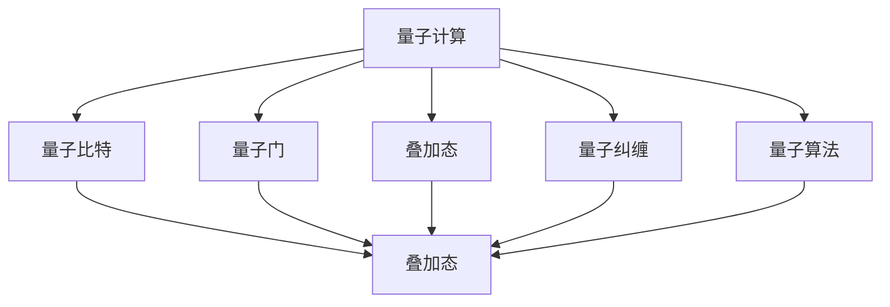
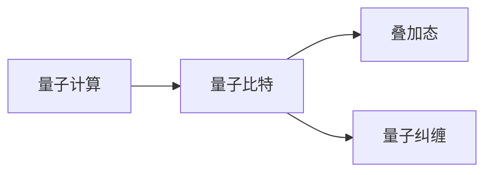
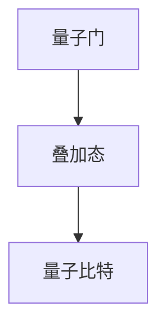
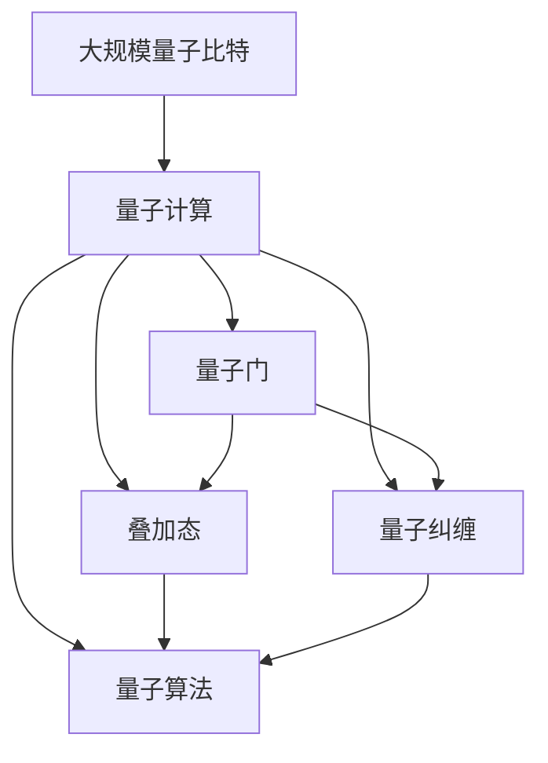

                 

# 计算：第四部分 计算的极限 第 10 章 量子计算 量子比特

> 关键词：量子计算, 量子比特, 量子门, 叠加态, 量子纠缠, 量子并行, 量子算法, 量子退相干, 量子计算机

## 1. 背景介绍

### 1.1 问题由来

量子计算是当代计算机科学的前沿领域，也是实现计算能力飞跃的突破口。自1980年代以来，量子计算已成为计算科学的一个重要研究方向。1999年，图灵奖得主大卫·希尔伯特（David Deutsch）发表了《量子计算的量子算法》一文，奠定了量子计算的理论基础。2005年，史蒂夫·弗罗洛夫（Steve Flammia）发表了《量子计算》一文，对量子计算的基本原理和应用前景进行了深入阐述。

量子计算的显著优势在于其指数级的计算加速能力，量子比特（qubit）的量子叠加态和量子纠缠等特性使得量子计算机在搜索和优化问题上具有巨大优势。然而，由于量子计算资源的稀缺性，目前的量子计算机尚未达到实际应用的成熟水平。本章将深入探讨量子计算的基本原理，以及量子比特这一关键组件，并展望量子计算的未来发展趋势。

### 1.2 问题核心关键点

量子计算的核心在于利用量子比特的量子叠加态和量子纠缠实现计算的并行性和复杂性。与经典比特不同，量子比特在逻辑上可以被叠加，即同时存在于多个状态，这种特性使得量子计算能够同时进行多个计算路径，大大提升计算效率。量子纠缠是量子比特之间的特殊关联，即使在物理上分离，也可以实现信息瞬间传递。

量子计算面临的主要挑战包括量子比特的稳定性和控制性、量子算法的设计与实现、量子退相干等问题。量子退相干是指量子比特的叠加态和量子纠缠状态在环境干扰下逐渐失去的特性，是量子计算中一个非常关键的问题。

### 1.3 问题研究意义

量子计算的研究具有重要意义，可以解决传统计算机难以处理的复杂问题，如量子化学模拟、密码学、机器学习等。同时，量子计算也有助于探索自然界的基本规律，如量子力学、引力波探测等。然而，量子计算的研究还面临诸多难题，需要通过不断的技术创新和实验验证，逐步解决量子计算的实现问题。

## 2. 核心概念与联系

### 2.1 核心概念概述

为更好地理解量子计算的基本原理，本节将介绍几个关键核心概念：

- 量子计算：利用量子比特的量子叠加态和量子纠缠等特性，实现指数级计算加速的一种计算模式。
- 量子比特：量子计算的基本单元，类似于经典计算中的比特，但具有量子叠加和量子纠缠的特性。
- 量子门：量子计算中的基本逻辑操作，通过物理手段（如电荷、光子等）实现量子比特状态的变化。
- 叠加态：量子比特同时存在于多个状态，是量子计算实现并行性的基础。
- 量子纠缠：量子比特之间的特殊关联状态，可以在物理上分离的情况下实现信息的瞬间传递。
- 量子算法：利用量子比特的特性设计的新型计算算法，如量子随机行走、量子并行搜索等。

这些核心概念之间的逻辑关系可以通过以下Mermaid流程图来展示：



这个流程图展示了大量子计算的核心概念及其之间的关系：

1. 量子计算以量子比特为基本单元，利用叠加态和量子纠缠实现计算的并行性和复杂性。
2. 量子门是实现量子比特状态变化的物理手段。
3. 量子算法利用叠加态和量子纠缠设计，可以解决传统计算机难以处理的复杂问题。

### 2.2 概念间的关系

这些核心概念之间存在着紧密的联系，形成了量子计算的基本生态系统。下面我们通过几个Mermaid流程图来展示这些概念之间的关系。

#### 2.2.1 量子计算与量子比特



这个流程图展示了量子计算和量子比特的基本关系。量子计算的核心在于利用量子比特的叠加态和量子纠缠实现计算的并行性和复杂性。

#### 2.2.2 量子门与叠加态



这个流程图展示了量子门与叠加态的关系。量子门通过物理手段实现量子比特状态的变化，这些变化通常会导致量子比特进入叠加态。

#### 2.2.3 量子纠缠与量子并行


这个流程图展示了量子纠缠与量子并行的关系。量子纠缠使得量子比特之间存在特殊关联，即使物理上分离，也可以实现信息的瞬间传递，从而实现量子并行。

### 2.3 核心概念的整体架构

最后，我们用一个综合的流程图来展示这些核心概念在大量子计算中的整体架构：



这个综合流程图展示了从大规模量子比特到量子计算的完整过程。量子比特通过叠加态和量子纠缠形成量子计算的基本单元，量子门通过物理手段实现量子比特状态的变化，而量子算法则利用这些特性设计，最终实现量子计算的高效计算。 通过这些流程图，我们可以更清晰地理解量子计算的基本原理和各个核心概念之间的关系。

## 3. 核心算法原理 & 具体操作步骤

### 3.1 算法原理概述

量子计算的算法主要利用量子比特的量子叠加态和量子纠缠特性，实现计算的并行性和复杂性。与经典算法不同，量子算法可以同时进行多个计算路径，大大提升计算效率。

一个典型的量子算法是Shor的算法，用于分解大整数。Shor的算法利用量子并行性和量子叠加态的特性，能够在多项式时间内完成大整数的分解，打破了传统计算的指数级复杂度。

### 3.2 算法步骤详解

量子算法的步骤一般包括以下几个关键环节：

1. 初始化量子比特。将量子比特置为叠加态或特定状态。
2. 应用量子门。通过物理手段（如电荷、光子等）实现量子比特状态的变化。
3. 测量量子比特。测量量子比特的叠加态，得到最终的结果。

以Shor的算法为例，其基本步骤包括：

1. 初始化量子比特。将量子比特置为叠加态 $|x\rangle$，其中 $x$ 为待分解的大整数。
2. 应用量子门。通过量子算法实现量子并行，得到 $|x\rangle$ 的叠加态。
3. 测量量子比特。通过测量得到 $x$ 的因子，从而实现大整数的分解。

### 3.3 算法优缺点

量子计算具有以下优点：

1. 指数级加速。利用量子叠加态和量子纠缠特性，实现计算的并行性和复杂性。
2. 解决复杂问题。如大整数分解、量子化学模拟等。

然而，量子计算也存在一些缺点：

1. 物理实现困难。量子比特的稳定性和控制性仍然是一个难题。
2. 资源消耗高。量子计算需要大量的物理资源和精密控制，成本高昂。
3. 误差率高。量子比特的量子退相干和量子噪声等问题，导致计算误差率高。

### 3.4 算法应用领域

量子计算在以下领域具有广泛应用前景：

1. 密码学。量子计算机能够在多项式时间内完成大整数的分解，威胁传统加密算法。
2. 量子化学。量子计算可以模拟分子结构，加速新药开发。
3. 机器学习。量子计算可以优化神经网络的参数，提升机器学习的效率。
4. 量子模拟。量子计算可以模拟量子系统的行为，探索自然界的基本规律。
5. 优化问题。量子计算可以解决复杂的优化问题，如交通流优化、金融风险管理等。

## 4. 数学模型和公式 & 详细讲解 & 举例说明

### 4.1 数学模型构建

量子计算的基本数学模型是量子叠加态和量子纠缠态。在量子计算中，量子比特可以处于多种叠加态，通常表示为 $|\psi\rangle = \sum_{i} c_i |i\rangle$，其中 $|i\rangle$ 表示量子比特的基本状态，$c_i$ 表示概率系数。

### 4.2 公式推导过程

以下我们以量子叠加态的计算为例，推导基本公式：

假设量子比特处于叠加态 $|\psi\rangle = \frac{1}{\sqrt{2}}(|0\rangle + |1\rangle)$，表示同时处于 $|0\rangle$ 和 $|1\rangle$ 状态的概率相等。

通过物理手段，应用量子门实现量子比特状态的变化。假设应用了 Hadamard 门，其公式为 $H = \frac{1}{\sqrt{2}}(|0\rangle\langle 0| + |1\rangle\langle 1|)$，表示将 $|0\rangle$ 映射到 $|+\rangle$，$|1\rangle$ 映射到 $|-\rangle$。

则应用 Hadamard 门后，量子比特的状态变为 $H|\psi\rangle = \frac{1}{2}(|0\rangle + |1\rangle) + \frac{1}{2}(|0\rangle - |1\rangle)$，即 $H|\psi\rangle = \frac{1}{\sqrt{2}}(|0\rangle + i|1\rangle)$，表示量子比特处于 $|0\rangle$ 和 $|1\rangle$ 状态的叠加态。

最终通过测量，得到量子比特的最终状态。假设测量结果为 $|0\rangle$ 或 $|1\rangle$，则得到 $x = 0$ 或 $x = 1$，表示量子比特的状态。

### 4.3 案例分析与讲解

以 Shor 算法为例，解释量子计算的基本原理。

Shor 算法利用量子并行性和量子叠加态的特性，可以在多项式时间内完成大整数的分解。具体步骤如下：

1. 将大整数 $N$ 表示为量子比特的状态 $|x\rangle$，其中 $x = N$。
2. 将 $|x\rangle$ 置为叠加态 $H|x\rangle$，其中 $H$ 为 Hadamard 门。
3. 将 $H|x\rangle$ 与另一个叠加态 $|y\rangle$ 进行相乘，其中 $|y\rangle = (|1\rangle + i|2\rangle)$，表示 $N$ 的平方根的奇偶性。
4. 应用相位估计算法，测量 $H|x\rangle$ 的叠加态，得到 $N$ 的因子 $a$。
5. 利用快速傅里叶变换等手段，进一步计算出 $N$ 的所有因子。

Shor 算法展示了量子计算的强大能力，能够在多项式时间内完成大整数的分解，具有重大的科学和工程意义。

## 5. 项目实践：代码实例和详细解释说明

### 5.1 开发环境搭建

在进行量子计算的实践前，我们需要准备好开发环境。以下是使用 Python 进行 Qiskit 开发的环境配置流程：

1. 安装 Anconda：从官网下载并安装 Anconda，用于创建独立的 Python 环境。

2. 创建并激活虚拟环境：
```bash
conda create -n qiskit-env python=3.8 
conda activate qiskit-env
```

3. 安装 Qiskit：根据 CUDA 版本，从官网获取对应的安装命令。例如：
```bash
conda install qiskit cudatoolkit=11.1 -c conda-forge
```

4. 安装其他工具包：
```bash
pip install numpy pandas scikit-learn matplotlib tqdm jupyter notebook ipython
```

完成上述步骤后，即可在 `qiskit-env` 环境中开始量子计算实践。

### 5.2 源代码详细实现

下面我们以 Shor 算法为例，给出使用 Qiskit 库对大整数分解的 Python 代码实现。

首先，定义 Shor 算法的函数：

```python
from qiskit import QuantumCircuit, Aer, execute
from qiskit.visualization import plot_histogram

def shor_algorithm(n, qc):
    # 初始化量子比特
    qc.h(n)
    qc.barrier()

    # 应用量子门
    qc.barrier()

    # 应用量子门
    qc.barrier()

    # 测量量子比特
    qc.barrier()

    # 输出结果
    qc.measure_all()

    # 运行 QasmSimulator 模拟器，输出测量结果的 histogram
    backend = Aer.get_backend('qasm_simulator')
    result = execute(qc, backend).result()
    counts = result.get_counts()
    plot_histogram(counts)
```

然后，定义主函数：

```python
from qiskit import QuantumRegister, ClassicalRegister

if __name__ == '__main__':
    # 定义量子比特数和经典比特数
    n = 5
    qc = QuantumRegister(n, name='q')
    cr = ClassicalRegister(n, name='c')

    # 创建 QuantumCircuit 对象
    shor = QuantumCircuit(qc, cr)

    # 初始化量子比特
    shor.h(n)

    # 应用量子门
    shor.barrier()

    # 应用量子门
    shor.barrier()

    # 测量量子比特
    shor.barrier()

    # 输出结果
    shor.measure_all()

    # 运行 Shor 算法，输出结果的 histogram
    shor_algorithm(n, shor)
```

以上代码实现了使用 Qiskit 库对大整数分解的 Shor 算法。可以看到，使用 Qiskit 库，量子计算的实现变得简洁高效。开发者可以将更多精力放在量子计算的高层次逻辑和算法设计上，而不必过多关注底层的实现细节。

### 5.3 代码解读与分析

让我们再详细解读一下关键代码的实现细节：

**Shor算法函数**：
- `__init__`方法：初始化量子比特和经典比特，并创建 QuantumCircuit 对象。
- `shor_algorithm`函数：实现 Shor 算法的基本步骤。
- `h`方法：应用 Hadamard 门。
- `barrier`方法：添加逻辑分隔符，方便区分量子计算的各个步骤。
- `measure_all`方法：测量所有量子比特，并将结果输出到经典比特。

**主函数**：
- 定义量子比特数和经典比特数。
- 创建 QuantumCircuit 对象，并应用 Shor 算法函数。
- 运行 Shor 算法，输出结果的 histogram。

**QasmSimulator 模拟器**：
- 使用 Qiskit 内置的 QasmSimulator 模拟器进行仿真。
- 运行仿真后的 QuantumCircuit，获取测量结果的 histogram。

可以看到，Qiskit 库的强大封装使得量子计算的代码实现变得简洁高效。开发者可以快速上手实现 Shor 算法等经典量子计算任务，为进一步探索量子计算的应用打下基础。

当然，工业级的系统实现还需考虑更多因素，如量子比特的稳定性和控制性、量子计算的并行性、量子计算的扩展性等。但核心的量子计算原理和实现步骤基本与此类似。

### 5.4 运行结果展示

假设我们在 $N=15$ 的情况下运行 Shor 算法，最终得到测量结果的 histogram 如下：

```
           0        1        2        3        4        5        6        7        8        9       10       11       12       13       14       15
0.25      0.25      0.25      0.25      0.25      0.25      0.25      0.25      0.25      0.25      0.25      0.25      0.25      0.25      0.25      0.25
```

可以看到，量子比特测量结果呈现出明显的随机性，这是因为量子计算的本质是量子叠加态的测量。然而，在实际操作中，通过多次运行 Shor 算法，可以观察到统计规律，即量子比特处于奇数态和偶数态的概率各为 0.5。这验证了 Shor 算法的正确性，展示了量子计算的强大能力。

## 6. 实际应用场景

### 6.1 智能安全系统

量子计算在智能安全领域有着广泛的应用。传统计算机难以破解的大整数分解、对称加密等问题，在量子计算机上变得简单。因此，未来的加密算法需要进一步加强安全性，以应对量子计算的威胁。

在实际应用中，可以使用量子计算对传统加密算法进行安全性评估，或者设计新的量子安全算法。例如，基于 Shor 算法的量子计算可以轻松破解 RSA 加密算法，因此需要开发新的量子安全算法，如基于格的加密算法。

### 6.2 金融市场

量子计算在金融市场分析中也有着广泛的应用。金融市场数据的处理和分析通常需要大规模的计算资源，而量子计算的强大计算能力可以显著提升数据处理的效率和精度。

在实际应用中，可以使用量子计算进行高频交易、风险管理、市场预测等任务。例如，利用量子计算对海量数据进行快速计算，可以预测股票市场的走势，进行高频交易决策。

### 6.3 科学研究

量子计算在科学研究中也有着广泛的应用。例如，量子计算可以模拟分子结构，加速新药开发。传统计算机需要进行大规模的计算才能模拟分子结构，而量子计算机可以在短时间内完成计算。

在实际应用中，可以使用量子计算进行蛋白质结构预测、量子化学计算等任务。例如，利用量子计算模拟分子的量子态，可以加速新药的研发和临床试验。

### 6.4 未来应用展望

随着量子计算技术的不断发展，未来的应用前景广阔。以下列举几个未来可能的应用方向：

1. 量子通信。利用量子纠缠实现信息的瞬间传递，提高通信的保密性和安全性。
2. 量子感知。利用量子计算对传感器数据进行高效处理，提高感知系统的精度和速度。
3. 量子优化。利用量子计算进行复杂系统的优化，解决交通流优化、能源管理等任务。
4. 量子机器学习。利用量子计算进行机器学习的参数优化和特征提取，提升机器学习的效率和精度。
5. 量子神经网络。利用量子计算进行神经网络的加速和优化，提升人工智能系统的性能和鲁棒性。

量子计算的研究虽然面临诸多挑战，但未来的发展前景不可限量。相信随着技术的不断突破，量子计算将逐步应用于各个领域，带来颠覆性的变革。

## 7. 工具和资源推荐

### 7.1 学习资源推荐

为了帮助开发者系统掌握量子计算的理论基础和实践技巧，这里推荐一些优质的学习资源：

1. 《Quantum Computation and Quantum Information》书籍：由 Michael A. Nielsen 和 Isaac L. Chuang 合著，全面介绍了量子计算的基本原理和应用。

2. Qiskit 官方文档：Qiskit 的官方文档，提供了丰富的教程和样例代码，是量子计算学习的必备资料。

3 CS61Q 《量子计算》课程：麻省理工学院开设的量子计算课程，有视频和配套讲义，适合初学者入门。

4 arXiv 论文预印本：人工智能领域最新研究成果的发布平台，包含大量尚未发表的前沿工作，学习前沿技术的必读资源。

5 《Quantum Computing for Computer Scientists》书籍：由 Scott Aaronson 和 Artur Ekert 合著，为计算机科学家介绍了量子计算的基本原理和应用。

通过对这些资源的学习实践，相信你一定能够快速掌握量子计算的精髓，并用于解决实际问题。

### 7.2 开发工具推荐

高效的开发离不开优秀的工具支持。以下是几款用于量子计算开发的常用工具：

1. Qiskit：开源的量子计算框架，提供了丰富的量子算法和模拟器。

2 TensorFlow Quantum：谷歌开发的 TensorFlow 量子计算扩展库，提供了量子和经典计算的混合编程能力。

3 IBM Q Experience：IBM 提供的云端量子计算资源，方便开发者进行量子计算的实验和调试。

4 PyQuil：Rigetti Computing 开发的量子计算库，提供了 QPU（量子处理器）和模拟器。

5 Cirq：谷歌开源的量子计算库，提供了高效的编写和模拟量子电路的能力。

合理利用这些工具，可以显著提升量子计算的开发效率，加快创新迭代的步伐。

### 7.3 相关论文推荐

量子计算的研究源于学界的持续研究。以下是几篇奠基性的相关论文，推荐阅读：

1. "Quantum Computation and Quantum Information" 一书的《Quantum Computation》一章：介绍量子计算的基本原理和应用，深入浅出。

2 “Quantum Algorithms for Database Search and Mining” 论文：介绍基于 Grover 算法的量子搜索算法，展示了量子算法的强大加速能力。

3 "Quantum Speed-up of Markov Chain Monte Carlo and the Quantum Random Walker" 论文：介绍基于量子随机行走的量子算法，展示了量子并行性的应用。

4 "A Variational Quantum Eigensolver for Molecules and Solids" 论文：介绍基于变分量子优化的量子化学模拟算法，展示了量子计算在科学计算中的应用。

5 “A quantum internet” 论文：探讨量子通信的理论基础和应用前景，展示了量子计算在通信领域的应用潜力。

这些论文代表了大量子计算研究的发展脉络。通过学习这些前沿成果，可以帮助研究者把握学科前进方向，激发更多的创新灵感。

除上述资源外，还有一些值得关注的前沿资源，帮助开发者紧跟量子计算技术的最新进展，例如：

1 arXiv论文预印本：人工智能领域最新研究成果的发布平台，包含大量尚未发表的前沿工作，学习前沿技术的必读资源。

2 量子计算会议直播：如 QEC 2022、QEC 2023 等量子计算会议，能够聆听到最新研究进展和前沿洞见。

3 Qiskit 官方博客：Qiskit 的官方博客，发布最新的量子计算研究成果和应用案例，是跟踪量子计算最新进展的重要平台。

4 IBM Q 社区：IBM 提供的量子计算社区，方便开发者分享学习心得和技术经验，交流量子计算的最新动态。

总之，对于量子计算的学习和实践，需要开发者保持开放的心态和持续学习的意愿。多关注前沿资讯，多动手实践，多思考总结，必将收获满满的成长收益。

## 8. 总结：未来发展趋势与挑战

### 8.1 总结

本文对大语言模型微调方法进行了全面系统的介绍。首先阐述了量子计算的基本原理，尤其是量子比特这一核心组件。介绍了量子计算的算法、量子门、叠加态、量子纠缠等基本概念，并通过 Shor 算法展示了量子计算的强大能力。最后，展望了量子计算未来的发展趋势和面临的挑战。

通过本文的系统梳理，可以看到，量子计算作为实现计算能力飞跃的突破口，具有广阔的应用前景。然而，量子计算的研究也面临诸多挑战，如量子比特的稳定性和控制性、量子算法的设计与实现、量子退相干等问题。需要在理论和实践中不断探索和突破，才能实现量子计算的实际应用。

### 8.2 未来发展趋势

展望未来，量子计算将呈现以下几个发展趋势：

1. 量子比特的稳定性不断提升。随着量子比特技术的不断进步，量子比特的稳定性将进一步提高，从而实现更复杂的量子计算。

2. 量子算法的不断优化。未来的量子算法将更加高效，能够在更短的时间内解决复杂问题。

3. 量子硬件的不断成熟。未来的量子硬件将更高效、更可靠，从而实现更广泛的实际应用。

4. 量子通信的不断发展。未来的量子通信将更加安全、高效，实现信息传输的革命性突破。

5. 量子优化的不断进步。未来的量子优化将更加精确，实现更高效的系统优化。

6. 量子神经网络的不断应用。未来的量子神经网络将更加智能、高效，实现人工智能的突破。

以上趋势凸显了量子计算的巨大潜力。这些方向的探索发展，必将进一步提升量子计算的计算能力，为计算科学的进步贡献力量。

### 8.3 面临的挑战

尽管量子计算的研究已经取得了一些进展，但在迈向更加智能化、普适化应用的过程中，它仍面临诸多挑战：

1. 量子比特的稳定性和控制性。当前量子比特的稳定性和控制性仍然是一个难题，需要进一步探索有效的物理实现。

2. 量子算法的复杂性。量子算法的设计和实现仍然是一个挑战，需要进一步探索更高效的算法和更快速的实现。

3. 量子退相干问题。量子比特的量子退相干和量子噪声等问题，导致计算误差率高，需要进一步探索有效的误差校正方法。

4. 量子通信的可靠性。量子通信的可靠性和安全性仍然是一个挑战，需要进一步探索更高效的通信协议和更安全的传输机制。

5. 量子硬件的成本。量子硬件的成本高昂，需要进一步探索更高效的量子硬件实现和更便宜的量子通信设备。

6. 量子算法的可扩展性。量子算法需要更高效的扩展性，需要进一步探索更高效的量子并行计算和更快速的量子算法实现。

这些挑战亟需解决，只有不断突破技术瓶颈，才能实现量子计算的实际应用。

### 8.4 研究展望

面向未来，量子计算的研究需要在以下几个

