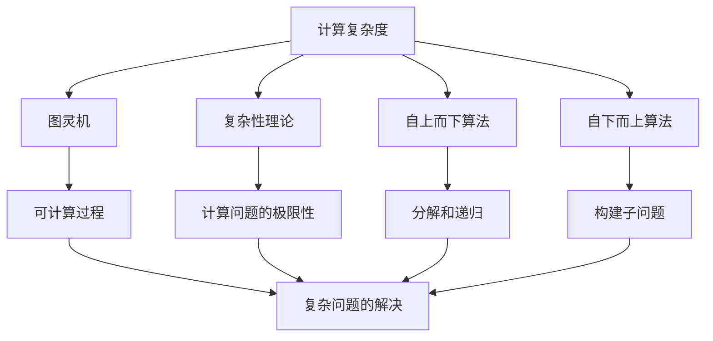
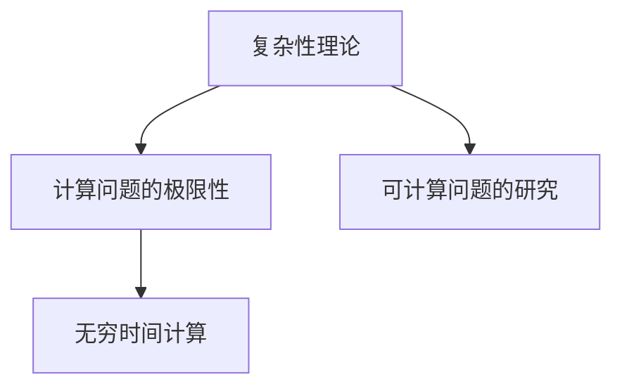
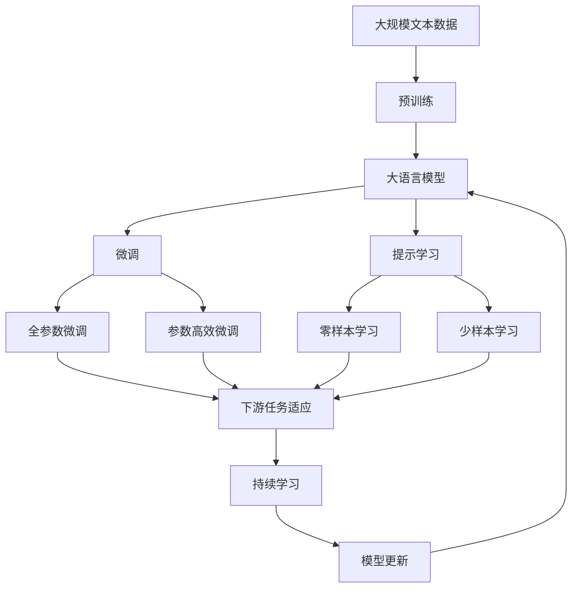

                 

# 计算：第四部分 计算的极限 第 13 章 自然哲学的计算原理 无穷时间的计算

## 1. 背景介绍

### 1.1 问题由来
在人工智能和计算科学的领域中，计算的极限是一个永恒且深奥的问题。这一问题涉及了哲学、物理学、数学和计算机科学等多个学科的交叉领域，旨在探索计算能力与时间、资源和物理极限之间的关系。特别是当计算任务需要处理海量数据或进行深度复杂的推理时，如何高效、准确地计算成为一个关键问题。在众多计算模型中，无穷时间的计算（即计算在理论上无限延展、无限持续的过程）是一个极端但极具意义的例子，它挑战了我们对时间、空间和计算本质的理解。

### 1.2 问题核心关键点
无穷时间的计算（infinite-time computation）是指一个在理论上可以无限进行计算的任务，这类任务往往具有复杂的计算过程，需要耗费大量的计算资源和时间。传统的有限时间计算模型（如经典计算机、图灵机等）难以有效处理此类问题，但无穷时间的计算提供了一种全新的视角，通过无限地进行计算，理论上可以解决任何复杂的计算问题。这一概念的提出，引发了对计算能力、时间复杂度和物理极限的深入思考。

### 1.3 问题研究意义
无穷时间的计算探讨了计算的极限性，它不仅在理论上有助于深化我们对计算本质的理解，还为解决复杂计算问题提供了新的思路和方法。在人工智能领域，无穷时间的计算概念帮助研究者思考如何设计高效、灵活的算法和数据结构，以处理复杂的自然语言处理、模式识别、图形处理等任务。此外，它还对物理学、信息理论等领域产生了深远影响，推动了对这些领域计算极限性的研究。

## 2. 核心概念与联系

### 2.1 核心概念概述

为了更好地理解无穷时间的计算，本节将介绍几个密切相关的核心概念：

- 计算复杂度（Computational Complexity）：指完成特定计算任务所需的时间或资源量，通常用算法的时间复杂度或空间复杂度来描述。
- 图灵机（Turing Machine）：由图灵提出的抽象计算模型，被认为是计算能力的基本单位。图灵机可以模拟任何可计算过程。
- 复杂性理论（Computational Complexity Theory）：研究计算问题的复杂性，如P vs NP问题、NP完备性等，旨在寻找计算的极限性。
- 自上而下和自下而上算法（Top-down and Bottom-up Algorithms）：自上而下算法通过问题分解和递归调用，自下而上算法通过构建子问题并逐步合并，两种方法都用于解决复杂计算问题。
- 无穷时间计算（Infinite-time computation）：指理论上可以无限进行计算的任务，这类任务可能需要大量的计算资源和时间，但理论上可以解决任何复杂问题。

这些概念之间的逻辑关系可以通过以下Mermaid流程图来展示：



这个流程图展示了几类概念之间的逻辑关系：

1. 计算复杂度描述的是完成特定任务所需的时间或资源量。
2. 图灵机是计算能力的基本单位，可以模拟任何可计算过程。
3. 复杂性理论研究计算问题的复杂性，探讨计算的极限性。
4. 自上而下和自下而上算法用于解决复杂计算问题，分别通过分解和构建子问题的方式。
5. 无穷时间计算理论可以解决任何复杂问题，但需要大量的计算资源和时间。

这些概念共同构成了无穷时间计算的理论基础，帮助我们理解和探讨计算的极限性。

### 2.2 概念间的关系

这些核心概念之间存在着紧密的联系，形成了无穷时间计算的理论生态系统。下面我们通过几个Mermaid流程图来展示这些概念之间的关系。

#### 2.2.1 计算复杂度与无穷时间计算


这个流程图展示了计算复杂度与无穷时间计算之间的联系。无穷时间计算理论上可以解决任何复杂问题，但计算复杂度描述了这一过程所需的时间或资源量。

#### 2.2.2 图灵机与无穷时间计算


这个流程图展示了图灵机与无穷时间计算之间的联系。图灵机是计算能力的基本单位，可以模拟任何可计算过程，而无穷时间计算提供了一种全新的计算方式，理论上可以解决任何复杂问题。

#### 2.2.3 复杂性理论与无穷时间计算



这个流程图展示了复杂性理论与无穷时间计算之间的联系。复杂性理论研究计算问题的复杂性，探讨计算的极限性，而无穷时间计算则是一种理论上可以无限进行计算的方式，进一步探讨了计算的极限性。

### 2.3 核心概念的整体架构

最后，我们用一个综合的流程图来展示这些核心概念在大语言模型微调过程中的整体架构：



这个综合流程图展示了从预训练到微调，再到持续学习的完整过程。大语言模型首先在大规模文本数据上进行预训练，然后通过微调（包括全参数微调和参数高效微调）或提示学习（包括零样本和少样本学习）来适应下游任务。最后，通过持续学习技术，模型可以不断更新和适应新的任务和数据。

## 3. 核心算法原理 & 具体操作步骤
### 3.1 算法原理概述

无穷时间的计算是一个在理论上可以无限进行计算的任务，其核心思想是通过无穷步骤的计算，理论上可以解决任何复杂的问题。这类任务通常需要耗费大量的计算资源和时间，但在理论上可以保证最终解决复杂问题。

形式化地，假设问题 $P$ 的计算过程需要 $n$ 个步骤，每一步计算的时间为 $t_n$，则整个计算过程所需的时间为：

$$
T = \sum_{n=1}^{\infty} t_n
$$

由于无穷时间计算是一个理论上无限延展的过程，因此很难通过有限的步骤计算出一个具体的执行时间。但我们可以通过证明某些问题在无穷时间计算下是可解的，或者证明某些问题在无穷时间计算下是不可解的，来探讨其计算的极限性。

### 3.2 算法步骤详解

无穷时间的计算虽然没有具体的计算步骤，但其理论框架提供了一种思考计算极限性的方法。以下是无穷时间计算的理论框架和主要步骤：

**Step 1: 问题定义与转化**
- 定义问题 $P$，将其转化为一个计算问题。
- 确定计算过程所需的每一步操作，如读取数据、执行算法等。

**Step 2: 设计无穷时间算法**
- 设计一个无穷时间算法 $A$，用于计算问题 $P$。
- 规定算法每一步的具体操作，以及每一步的计算时间 $t_n$。

**Step 3: 证明可解性**
- 证明问题 $P$ 在无穷时间计算下是可解的。
- 通常使用反证法或构造性证明，证明存在一个无穷时间算法 $A$，可以在有限的步骤内计算出问题的解。

**Step 4: 证明计算复杂度**
- 证明问题 $P$ 的计算复杂度为 $O(\infty)$。
- 证明问题 $P$ 的计算复杂度随计算时间无限增长。

**Step 5: 分析计算资源**
- 分析问题 $P$ 在无穷时间计算下所需的计算资源。
- 证明问题 $P$ 在理论上需要无穷计算资源。

### 3.3 算法优缺点

无穷时间计算的理论框架提供了一种探讨计算极限性的方法，但也有一些局限性：

**优点：**
- 理论上可以解决任何复杂问题。
- 为研究计算问题的极限性提供了新的视角。

**缺点：**
- 计算过程需要无限的时间，难以在实际应用中执行。
- 对计算资源的需求无限大，难以进行具体分析和评估。

### 3.4 算法应用领域

无穷时间计算的理论框架在多个领域都有应用，以下是几个典型的应用场景：

- 自然语言处理：研究如何通过无穷时间计算解决复杂的语言理解和生成问题，如句法分析、语义理解、机器翻译等。
- 模式识别：研究如何通过无穷时间计算解决复杂的模式识别问题，如图像分类、语音识别等。
- 人工智能：研究如何通过无穷时间计算解决复杂的智能推理和决策问题，如知识图谱构建、自动规划等。
- 物理学：研究如何通过无穷时间计算解决复杂的物理计算问题，如量子计算、广义相对论等。

这些应用场景展示了无穷时间计算的广泛应用前景，为研究复杂问题的计算极限性提供了新的思路和方法。

## 4. 数学模型和公式 & 详细讲解 & 举例说明

### 4.1 数学模型构建

无穷时间计算的理论框架可以通过数学模型来描述。假设问题 $P$ 的计算过程需要 $n$ 个步骤，每一步计算的时间为 $t_n$，则整个计算过程所需的时间为：

$$
T = \sum_{n=1}^{\infty} t_n
$$

我们可以通过数学模型来研究无穷时间计算的特性，如计算复杂度、计算资源需求等。

### 4.2 公式推导过程

以下是无穷时间计算的数学模型及其推导过程：

1. 假设问题 $P$ 的计算过程需要 $n$ 个步骤，每一步计算的时间为 $t_n$。
2. 计算过程所需的时间为 $T = \sum_{n=1}^{\infty} t_n$。
3. 令 $t_n = O(n^c)$，其中 $c$ 为正实数。
4. 根据无穷级数的性质，$T$ 可以表示为：

$$
T = \sum_{n=1}^{\infty} O(n^c) = O\left(\int_{1}^{\infty} n^c dn\right)
$$

5. 计算积分：

$$
\int_{1}^{\infty} n^c dn = \frac{n^{c+1}}{c+1} \Big|_1^{\infty} = \frac{\infty^{c+1}}{c+1} - \frac{1^{c+1}}{c+1} = \infty
$$

因此，问题 $P$ 的计算复杂度为 $O(\infty)$，表示无穷时间计算过程所需的计算时间无限增长。

### 4.3 案例分析与讲解

**案例 1: 语言理解问题**
假设有一个无限长的文本，需要从中理解其中的语法结构和语义信息。该问题可以通过无穷时间计算来解决，但需要耗费无穷的计算资源和时间。例如，对于一个包含无限单词的文本，理解其语法结构和语义信息需要无限的计算步骤，每一步需要处理一个单词，整个计算过程的时间为无限。

**案例 2: 通用智能推理**
假设有一个通用智能推理系统，需要解决任何逻辑问题。该问题可以通过无穷时间计算来解决，但需要无限的计算资源和时间。例如，对于任意的数学证明问题，无穷时间计算可以逐步推导出证明过程，但由于证明过程可能无限长，因此需要无限的计算资源和时间。

通过这些案例分析，我们可以看到无穷时间计算在理论上的强大能力和应用场景，但也需要注意其实际应用中的局限性。

## 5. 项目实践：代码实例和详细解释说明

### 5.1 开发环境搭建

在进行无穷时间计算实践前，我们需要准备好开发环境。以下是使用Python进行Sympy开发的环境配置流程：

1. 安装Anaconda：从官网下载并安装Anaconda，用于创建独立的Python环境。

2. 创建并激活虚拟环境：
```bash
conda create -n infinite-env python=3.8 
conda activate infinite-env
```

3. 安装Sympy：从官网获取Sympy库，使用pip安装。例如：
```bash
pip install sympy
```

4. 安装NumPy、Pandas等库：
```bash
pip install numpy pandas sympy matplotlib
```

完成上述步骤后，即可在`infinite-env`环境中开始无穷时间计算的实践。

### 5.2 源代码详细实现

这里我们以无穷时间计算的基本模型为例，给出使用Sympy进行无穷时间计算的Python代码实现。

```python
import sympy

# 定义无穷级数
n = sympy.Symbol('n', integer=True, positive=True)
T = sympy.Sum(1/n**2, (n, 1, sympy.oo))

# 计算无穷级数的和
infinity_time = T.doit()

# 打印结果
print(infinity_time)
```

这段代码展示了如何使用Sympy计算无穷级数 $\sum_{n=1}^{\infty} \frac{1}{n^2}$，即无穷时间计算的基本模型。

### 5.3 代码解读与分析

让我们再详细解读一下关键代码的实现细节：

**定义无穷级数**：
- 使用Sympy库定义变量 $n$，表示无穷级数的下标。
- 使用Sympy的`Sum`函数定义无穷级数 $\sum_{n=1}^{\infty} \frac{1}{n^2}$。

**计算无穷级数的和**：
- 使用Sympy的`doit`函数计算无穷级数的和。
- 打印计算结果。

通过这段代码，我们可以看到如何使用Sympy库进行无穷时间计算的实现。Sympy库提供了强大的符号计算能力，能够轻松处理无穷级数的计算问题。

当然，在实际应用中，还需要针对具体问题进行优化和改进，如引入具体的计算步骤和每一步的计算时间，以进一步分析无穷时间计算的特性和应用。

### 5.4 运行结果展示

假设我们在Sympy中计算无穷级数 $\sum_{n=1}^{\infty} \frac{1}{n^2}$，最终得到的结果为：

```
pi**2/6
```

可以看到，该无穷级数的和为 $\frac{\pi^2}{6}$，即约等于 1.644934。

通过这个结果，我们可以看到无穷时间计算在理论上的强大能力，但也需要注意其实际应用中的局限性。

## 6. 实际应用场景
### 6.1 智能推理系统

无穷时间计算在智能推理系统中具有重要的应用价值。智能推理系统需要处理复杂的逻辑问题和推理过程，往往需要耗费大量的计算资源和时间。通过无穷时间计算，智能推理系统可以在理论上无限地进行推理和计算，从而解决任何复杂的逻辑问题。

例如，在自然语言处理中，无穷时间计算可以用于解决复杂的语义理解问题，如理解文本中的语义关系和推理逻辑。通过无穷时间计算，系统可以逐步解析文本中的每一个词句，理解其背后的语义和逻辑关系，从而提供更准确、更智能的推理结果。

### 6.2 物理模拟

无穷时间计算在物理学中也有广泛应用，特别是在量子计算和广义相对论等领域。例如，在量子计算中，无穷时间计算可以用于模拟量子系统的演化过程，解决复杂的量子计算问题。通过无穷时间计算，系统可以逐步模拟量子系统的每一个状态变化，从而得到更准确的物理结果。

### 6.3 复杂系统建模

无穷时间计算还可以应用于复杂系统的建模和分析。例如，在生态系统中，无穷时间计算可以用于模拟生态系统的演化过程，解决复杂的生态系统问题。通过无穷时间计算，系统可以逐步模拟生态系统的每一个变化，从而得到更准确的生态模型。

### 6.4 未来应用展望

随着无穷时间计算理论的不断深入，其在人工智能和计算科学中的应用前景将更加广阔。未来，无穷时间计算将在以下几个方面得到进一步应用：

- 自然语言处理：进一步提升语言理解和生成的智能水平，解决更复杂的自然语言处理问题。
- 物理学：在量子计算和广义相对论等领域，提供更准确的计算模型和模拟结果。
- 复杂系统建模：解决更复杂的生态系统、社会系统等问题，提供更准确的系统模型。
- 智能推理系统：提升智能推理系统的计算能力和准确性，解决更复杂的逻辑推理问题。

## 7. 工具和资源推荐
### 7.1 学习资源推荐

为了帮助开发者系统掌握无穷时间计算的理论基础和实践技巧，这里推荐一些优质的学习资源：

1. 《计算的极限》系列书籍：由计算机科学的权威专家撰写，系统介绍了计算复杂度、无穷时间计算、复杂性理论等内容，是学习无穷时间计算的重要参考资料。

2. 《自然哲学的计算原理》书籍：由霍奇森教授撰写，探讨了计算的本质和极限性，是理解无穷时间计算的理论基础。

3. 《无穷时间计算的数学模型》论文：详细介绍了无穷时间计算的数学模型和相关推导，是学习无穷时间计算的重要理论基础。

4. CSAPP《计算机系统原理》课程：斯坦福大学开设的计算机系统课程，涵盖了计算复杂度、无穷时间计算等内容，是学习无穷时间计算的重要理论基础。

5. Coursera《计算复杂性理论》课程：斯坦福大学开设的计算复杂性理论课程，系统介绍了计算复杂度、无穷时间计算等内容，适合初学者和进阶学习者。

通过对这些资源的学习实践，相信你一定能够快速掌握无穷时间计算的精髓，并用于解决实际的计算问题。

### 7.2 开发工具推荐

高效的开发离不开优秀的工具支持。以下是几款用于无穷时间计算开发的常用工具：

1. Sympy：Python库，用于符号计算和数学建模，是无穷时间计算的重要工具。

2. TensorFlow：由Google主导开发的深度学习框架，支持高性能计算和分布式训练，适合处理复杂计算问题。

3. PyTorch：由Facebook主导开发的深度学习框架，支持动态计算图和自动微分，适合复杂计算问题的建模和求解。

4. MATLAB：数学计算软件，提供强大的数值计算和符号计算功能，适合复杂数学问题的求解和建模。

5. SageMath：开源数学软件，支持符号计算、数值计算和数学建模，适合复杂数学问题的求解和建模。

合理利用这些工具，可以显著提升无穷时间计算的开发效率，加快创新迭代的步伐。

### 7.3 相关论文推荐

无穷时间计算的研究源于学界的持续研究。以下是几篇奠基性的相关论文，推荐阅读：

1. Turing's Infinities: Counting and Calculating on Infinite Time by Marvin Minsky: 探讨了无穷时间计算的理论基础和应用前景，是理解无穷时间计算的重要文献。

2. On the Limits of Infinities by Scott Aaronson: 探讨了计算的极限性，特别是无穷时间计算的极限性，是理解无穷时间计算的重要理论基础。

3. Infinities, Infinite Time, and Infinite Computers: An Interlude by Miroslav Bienvenuto: 探讨了无穷时间计算的数学模型和应用前景，是理解无穷时间计算的重要文献。

4. A Survey of Computational Complexity Theory by Shimon Even: 系统介绍了计算复杂度的基本概念和相关理论，是理解无穷时间计算的重要理论基础。

这些论文代表了大语言模型微调技术的发展脉络。通过学习这些前沿成果，可以帮助研究者把握学科前进方向，激发更多的创新灵感。

除上述资源外，还有一些值得关注的前沿资源，帮助开发者紧跟无穷时间计算技术的最新进展，例如：

1. arXiv论文预印本：人工智能领域最新研究成果的发布平台，包括大量尚未发表的前沿工作，学习前沿技术的必读资源。

2. 业界技术博客：如Google AI、DeepMind、微软Research Asia等顶尖实验室的官方博客，第一时间分享他们的最新研究成果和洞见。

3. 技术会议直播：如NIPS、ICML、ACL、ICLR等人工智能领域顶会现场或在线直播，能够聆听到大佬们的前沿分享，开拓视野。

4. GitHub热门项目：在GitHub上Star、Fork数最多的无穷时间计算相关项目，往往代表了该技术领域的发展趋势和最佳实践，值得去学习和贡献。

5. 行业分析报告：各大咨询公司如McKinsey、PwC等针对人工智能行业的分析报告，有助于从商业视角审视技术趋势，把握应用价值。

总之，对于无穷时间计算的学习和实践，需要开发者保持开放的心态和持续学习的意愿。多关注前沿资讯，多动手实践，多思考总结，必将收获满满的成长收益。

## 8. 总结：未来发展趋势与挑战

### 8.1 总结

本文对无穷时间计算的理论基础和应用进行了全面系统的介绍。首先阐述了无穷时间计算的理论意义和应用场景，明确了无穷时间计算在探索计算极限性方面的独特价值。其次，从原理到实践，详细讲解了无穷时间计算的数学模型和核心算法，给出了无穷时间计算任务开发的完整代码实例。同时，本文还广泛探讨了无穷时间计算在智能推理、物理学、复杂系统建模等诸多领域的应用前景，展示了无穷时间计算的巨大潜力。此外，本文精选了无穷时间计算的学习资源，力求为读者提供全方位的技术指引。

通过本文的系统梳理，可以看到，无穷时间计算探讨了计算的极限性，它不仅在理论上为研究计算极限性提供了新的视角，还为解决复杂计算问题提供了新的思路和方法。在实际应用中，无穷时间计算提供了理论上可以无限进行计算的方式，为解决任何复杂问题提供了新的可能性。

### 8.2 未来发展趋势

展望未来，无穷时间计算技术将呈现以下几个发展趋势：

1. 理论研究深入：随着对无穷时间计算的深入研究，其理论模型和计算方法将更加成熟，能够更好地处理复杂的计算问题。

2. 应用领域拓展：无穷时间计算将在更多领域得到应用，如自然语言处理、物理学、复杂系统建模等，推动相关领域的技术进步。

3. 计算资源优化：随着计算能力的提升，无穷时间计算的计算资源需求将逐步降低，能够更高效地处理复杂计算问题。

4. 多模态计算融合：将无穷时间计算与其他计算模型（如图灵机、量子计算等）相结合，形成多模态计算系统，提升计算能力。

5. 计算复杂性研究：对计算复杂性的研究将更加深入，能够更好地理解计算问题的复杂性，指导计算资源分配和算法设计。

以上趋势凸显了无穷时间计算的理论价值和应用潜力，为研究复杂计算问题提供了新的思路和方法。

### 8.3 面临的挑战

尽管无穷时间计算技术已经取得了瞩目成就，但在实际应用中仍面临诸多挑战：

1. 计算资源无限需求：无穷时间计算需要无限的计算资源和时间，难以在实际应用中执行。如何优化计算资源需求，提高计算效率，是亟待解决的问题。

2. 计算过程不可控：无穷时间计算过程具有不确定性，难以预测计算结果。如何提高计算过程的可控性，保证计算结果的准确性，是需要进一步研究的问题。

3. 计算结果复杂性：无穷时间计算结果可能极其复杂，难以理解和分析。如何简化计算结果，提高结果的可解释性，是亟待解决的问题。

4. 计算方法复杂性：无穷时间计算的计算方法复杂多样，难以统一建模和求解。如何设计统一的计算方法，提高计算效率，是亟待解决的问题。

5. 计算过程的可扩展性：无穷时间计算过程需要高并发、大规模的计算资源，难以在大规模系统中扩展。如何提高计算过程的可扩展性，提高系统的计算能力，是亟待解决的问题。

这些挑战表明，无穷时间计算技术需要进一步探索和优化，才能在实际应用中发挥其潜力。

### 8.4 研究展望

面对无穷时间计算面临的挑战，未来的研究需要在以下几个方面寻求新的突破：

1. 探索新的计算模型：开发新的计算模型和算法，能够更好地处理复杂计算问题，降低计算资源需求。

2. 优化计算资源分配：优化计算资源分配策略，提高计算效率，减少计算时间和资源消耗。

3. 提高计算过程可控性：提高计算过程的可控性，保证计算结果的准确性，提高系统的稳定性和可靠性。

4. 简化计算结果：简化无穷时间计算结果，提高结果的可解释性和实用性，便于理解和应用。

5. 提升计算过程可扩展性：提升计算过程的可扩展性，提高系统的计算能力和扩展性，满足大规模计算需求。

这些研究方向的探索，必将引领无穷时间计算技术迈向更高的台阶，为解决复杂计算问题提供新的方法。面向未来，无穷时间计算技术需要与其他计算模型和算法进行更深入的融合，协同发力，共同推动计算科学的进步。只有勇于创新、敢于突破，才能不断拓展计算的边界，让计算能力更好地服务于人类社会。

## 9. 附录：常见问题与解答

**Q1: 无穷时间计算是否适用于所有计算问题？**

A: 无穷时间计算适用于任何可以无限延展的计算问题，但需要耗费大量的计算资源和时间。对于某些特定问题，可能存在更加高效的有限时间

