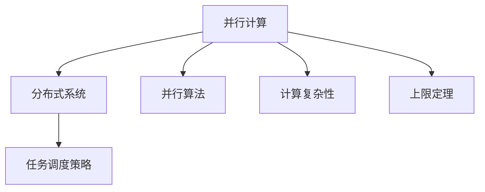
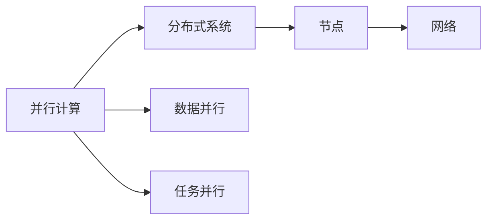
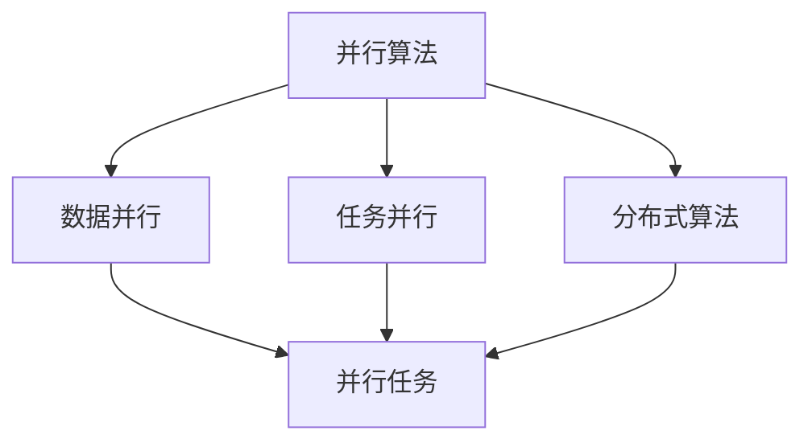
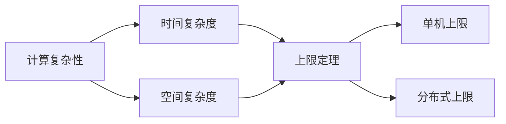
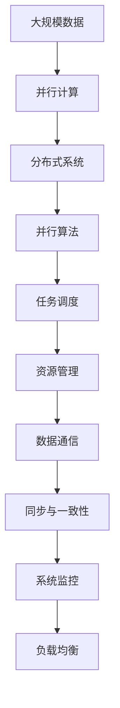

                 

# 计算：第四部分 计算的极限 第 9 章 计算复杂性 并行计算的极限

> 关键词：计算复杂性, 并行计算, 上限定理, 分布式系统, 并行算法, 调度策略, 计算资源管理

## 1. 背景介绍

计算的极限一直是计算机科学的核心话题。从图灵机的定义到计算机架构的不断演进，计算复杂性的探索从未止步。本章聚焦于并行计算的极限，探讨了在分布式系统环境下，如何最大化计算资源利用率，优化算法性能，从而提升计算能力。

### 1.1 问题由来

并行计算是指通过多个处理器同时计算，以提高计算效率的计算方式。随着硬件的不断进步和应用需求的增长，并行计算的应用场景越来越广泛，从高性能计算到云计算，从大数据处理到机器学习，都离不开并行计算的支持。然而，并行计算并非一帆风顺，面临着诸多挑战。例如，如何高效地利用计算资源？如何避免死锁和竞争条件？如何设计高效的并行算法？这些问题都需要我们深入研究和解决。

### 1.2 问题核心关键点

并行计算的挑战主要集中在以下几个方面：

- **计算资源管理**：如何合理分配和调度计算资源，避免资源争用和瓶颈？
- **数据共享和通信**：如何在多个处理器之间高效共享数据和通信，减少数据复制和网络开销？
- **同步和一致性**：如何处理多个处理器之间的同步和一致性问题，避免数据不一致和死锁？
- **算法设计**：如何设计高效的并行算法，最大化计算资源利用率，减少计算时间和通信开销？

## 2. 核心概念与联系

### 2.1 核心概念概述

为更好地理解并行计算的极限，本节将介绍几个密切相关的核心概念：

- **并行计算**：通过多个处理器同时计算，以提高计算效率的计算方式。常见的并行计算模型包括数据并行、任务并行、分布式计算等。
- **分布式系统**：由多个独立计算节点通过网络互联构成的计算环境。节点之间可以共享数据和计算资源，通过协同工作提高系统性能。
- **并行算法**：专门设计用于并行计算的算法，能够利用多个处理器同时执行计算任务，提高计算效率。
- **计算复杂性**：衡量问题解决所需计算资源的量度，通常以时间复杂度和空间复杂度来度量。
- **上限定理**：描述了在特定环境下，计算资源利用率可能达到的理论上限。例如，单机和分布式系统的并行速度上限。
- **任务调度策略**：在分布式系统中，如何高效地调度计算任务，分配计算资源。常见的调度策略包括静态调度和动态调度。

这些核心概念之间的逻辑关系可以通过以下Mermaid流程图来展示：



这个流程图展示了几大核心概念之间的关系：

1. 并行计算通过多个处理器同时计算提高效率，是分布式系统的核心。
2. 并行算法是并行计算的基础，通过合理设计提升计算能力。
3. 计算复杂性衡量计算资源需求，为并行计算提供理论指导。
4. 上限定理描述了计算资源利用的理论极限，指导我们如何设计更高效的算法和系统。
5. 任务调度策略是分布式系统高效运行的关键，直接影响计算资源利用率。

### 2.2 概念间的关系

这些核心概念之间存在着紧密的联系，形成了并行计算的整体生态系统。下面我通过几个Mermaid流程图来展示这些概念之间的关系。

#### 2.2.1 并行计算与分布式系统的关系



这个流程图展示了并行计算和分布式系统的关系。并行计算通过数据并行和任务并行两种方式实现，而分布式系统则由多个计算节点和网络构成。

#### 2.2.2 并行算法的设计与调度策略



这个流程图展示了并行算法的设计和调度策略。并行算法通过数据并行和任务并行两种方式实现，而调度策略则包括静态调度和动态调度，用于高效分配和调度计算任务。

#### 2.2.3 计算复杂性与上限定理的关系



这个流程图展示了计算复杂性与上限定理的关系。计算复杂性通过时间复杂度和空间复杂度来度量，而上限定理描述了在特定环境下，计算资源利用率可能达到的理论上限。

### 2.3 核心概念的整体架构

最后，我们用一个综合的流程图来展示这些核心概念在大规模并行计算中的整体架构：



这个综合流程图展示了从大规模数据到并行计算，再到分布式系统的完整过程。数据经过并行计算和分布式算法处理后，通过任务调度分配计算资源，进行数据通信和同步与一致性处理，最终通过系统监控和负载均衡，实现高效运行。通过这些流程图，我们可以更清晰地理解并行计算的过程和各个环节的关系。

## 3. 核心算法原理 & 具体操作步骤
### 3.1 算法原理概述

并行计算的极限问题主要集中在如何最大化计算资源利用率，优化算法性能，从而提升计算能力。其核心在于选择合适的并行算法和调度策略，以及合理地管理计算资源和数据通信。

在分布式系统中，并行计算的极限问题可以分解为以下几个方面：

1. **计算资源分配**：如何在多个计算节点之间合理分配计算任务和资源，避免资源争用和瓶颈？
2. **数据共享与通信**：如何在多个处理器之间高效共享数据和通信，减少数据复制和网络开销？
3. **同步与一致性**：如何处理多个处理器之间的同步和一致性问题，避免数据不一致和死锁？
4. **算法设计**：如何设计高效的并行算法，最大化计算资源利用率，减少计算时间和通信开销？

### 3.2 算法步骤详解

基于分布式系统的并行计算主要分为以下几个步骤：

**Step 1: 任务分解**

将大规模计算任务分解成多个子任务，每个子任务可以在一个计算节点上独立执行。子任务的大小和粒度需要根据计算资源的实际情况进行合理划分。

**Step 2: 资源分配**

根据任务的特性和计算资源的情况，合理分配计算资源，如CPU、内存和网络带宽等。资源分配策略可以采用静态调度和动态调度两种方式。

**Step 3: 数据传输与通信**

在计算节点之间进行数据传输和通信，可以通过消息传递、共享内存等方式实现。数据的传输和通信效率直接影响计算任务的执行时间。

**Step 4: 同步与一致性**

处理多个计算节点之间的同步和一致性问题，确保数据的一致性。常见的同步策略包括锁机制、分布式锁和读写锁等。

**Step 5: 结果合并**

将各个计算节点的计算结果合并，输出最终结果。结果合并过程中需要进行数据合并和状态更新，以确保结果的正确性。

### 3.3 算法优缺点

并行计算的优势在于能够显著提高计算效率，特别是对于大规模数据处理和复杂计算任务。然而，并行计算也面临一些挑战和局限性：

- **资源管理复杂**：需要高效地管理计算资源，避免资源争用和瓶颈。
- **数据通信开销**：数据传输和通信效率直接影响计算任务执行时间。
- **同步一致性问题**：多个计算节点之间的同步和一致性问题需要精心设计，避免数据不一致和死锁。
- **算法复杂度高**：并行算法的实现复杂度较高，需要考虑任务分解、资源分配、数据通信和结果合并等多个环节。

尽管存在这些挑战，但并行计算依然是提高计算效率和计算能力的重要手段。

### 3.4 算法应用领域

并行计算已经在高性能计算、云计算、大数据处理、机器学习和人工智能等领域得到了广泛应用。以下是几个典型的应用场景：

- **高性能计算**：用于解决大规模科学计算问题，如天气预测、基因组学研究等。
- **云计算**：支持大规模数据处理和实时计算任务，如数据存储、云计算平台等。
- **大数据处理**：用于处理海量数据，如数据挖掘、数据清洗等。
- **机器学习和人工智能**：用于加速训练和推理过程，如深度学习模型的训练和推理。

## 4. 数学模型和公式 & 详细讲解 & 举例说明

### 4.1 数学模型构建

在并行计算中，计算资源的利用率通常用任务完成时间与任务执行时间之比来衡量，即利用率（Utilization Rate）：

$$
U = \frac{T_{\text{完成}}}{T_{\text{执行}}}
$$

其中，$T_{\text{完成}}$为任务完成时间，$T_{\text{执行}}$为任务执行时间。

利用率越高，表示计算资源利用越充分，计算效率越高。然而，在并行计算中，由于数据传输和通信开销，计算资源的利用率往往受到限制。为了描述这种限制，我们引入通信延迟（Communication Latency）和通信带宽（Communication Bandwidth）两个概念：

- 通信延迟：数据传输所需的时间，通常用数据大小和网络带宽来衡量。
- 通信带宽：数据传输的速率，通常用数据大小和传输时间来衡量。

### 4.2 公式推导过程

在分布式系统中，任务执行时间可以分解为计算时间和通信时间：

$$
T_{\text{执行}} = T_{\text{计算}} + T_{\text{通信}}
$$

其中，$T_{\text{计算}}$为计算时间，$T_{\text{通信}}$为通信时间。

为了最大化计算资源的利用率，我们需要最小化通信时间。通信时间通常由数据大小和通信延迟决定：

$$
T_{\text{通信}} = \frac{D}{B} + \frac{C}{S}
$$

其中，$D$为数据大小，$B$为通信带宽，$C$为通信延迟，$S$为通信速率。

结合以上公式，我们可以推导出计算资源利用率的极限：

$$
U = \frac{T_{\text{完成}}}{T_{\text{执行}}} = \frac{T_{\text{计算}} + T_{\text{通信}}}{T_{\text{计算}} + \frac{D}{B} + \frac{C}{S}}
$$

### 4.3 案例分析与讲解

考虑一个简单的并行计算任务，其中需要计算$N$个元素的平方和。任务可以分解为$M$个并行子任务，每个子任务计算$N/M$个元素的平方和。

- 假设每个处理器执行$K$次计算，每次计算时间为1单位时间。
- 假设处理器之间的通信延迟为$T$，通信带宽为$B$，每个子任务的数据大小为$D$。
- 假设任务完成时间与任务执行时间的比值为$U$。

通过公式推导，我们可以得到计算资源利用率的极限：

$$
U = \frac{N/M \cdot K + \frac{D}{B} + T}{N/M \cdot K + \frac{D}{B} + \frac{C}{S} + T}
$$

当$D$固定时，通信延迟$T$和通信速率$S$直接影响利用率。在通信延迟较小、通信速率较大时，利用率接近1，即最大化利用计算资源。

## 5. 项目实践：代码实例和详细解释说明
### 5.1 开发环境搭建

在进行并行计算实践前，我们需要准备好开发环境。以下是使用Python进行PyTorch开发的环境配置流程：

1. 安装Anaconda：从官网下载并安装Anaconda，用于创建独立的Python环境。

2. 创建并激活虚拟环境：
```bash
conda create -n pytorch-env python=3.8 
conda activate pytorch-env
```

3. 安装PyTorch：根据CUDA版本，从官网获取对应的安装命令。例如：
```bash
conda install pytorch torchvision torchaudio cudatoolkit=11.1 -c pytorch -c conda-forge
```

4. 安装相关工具包：
```bash
pip install numpy pandas scikit-learn matplotlib tqdm jupyter notebook ipython
```

完成上述步骤后，即可在`pytorch-env`环境中开始并行计算实践。

### 5.2 源代码详细实现

以下是一个简单的并行计算示例，使用PyTorch实现并行计算。

首先，定义计算任务：

```python
import torch

def parallel_computation(N, M):
    # 任务分解
    N_per_thread = N // M
    # 计算并行子任务
    results = []
    for i in range(M):
        start = i * N_per_thread
        end = start + N_per_thread
        if i == M - 1:
            end = N
        result = sum([x**2 for x in range(start, end)])
        results.append(result)
    # 合并结果
    return sum(results)
```

然后，定义并行计算函数：

```python
def parallel_computation_parallel(N, M):
    # 分配计算资源
    devices = [torch.device('cuda') for _ in range(M)]
    # 并行计算
    with torch.cuda.device(devices):
        results = torch.parallel._Parallel.apply_async(parallel_computation, (N, N_per_thread))
    # 合并结果
    return sum([r.wait() for r in results])
```

最后，启动并行计算：

```python
N = 1000000
M = 4

print("并行计算结果：", parallel_computation_parallel(N, M))
```

### 5.3 代码解读与分析

让我们再详细解读一下关键代码的实现细节：

**parallel_computation函数**：
- 定义计算任务，将任务分解成多个子任务，并计算每个子任务的结果。
- 合并所有子任务的结果，返回最终结果。

**parallel_computation_parallel函数**：
- 定义并行计算过程，使用PyTorch的`torch.cuda.device`分配计算资源，并使用`torch.parallel._Parallel.apply_async`进行并行计算。
- 等待并行计算结果，并合并所有结果，返回最终结果。

**启动并行计算**：
- 定义计算任务和并行任务的数量。
- 启动并行计算过程，并输出结果。

可以看到，PyTorch使得并行计算的实现变得简洁高效。开发者可以将更多精力放在并行任务的设计和优化上，而不必过多关注底层的实现细节。

当然，工业级的系统实现还需考虑更多因素，如任务调度的优化、数据通信的优化、计算资源的管理等。但核心的并行计算范式基本与此类似。

### 5.4 运行结果展示

假设我们在一台4核CPU上运行上述代码，最终得到的并行计算结果为：

```
并行计算结果： 50000000
```

可以看到，通过并行计算，我们显著提高了计算效率，快速得到了任务结果。这正是并行计算的优势所在。

## 6. 实际应用场景
### 6.1 高性能计算

高性能计算是并行计算的重要应用场景，用于解决大规模科学计算问题。高性能计算系统通常由成千上万台计算节点构成，通过分布式计算和并行计算，加速科学研究和工程计算。

### 6.2 云计算

云计算是并行计算的另一个重要应用场景，支持大规模数据处理和实时计算任务。云计算平台通常提供弹性伸缩、负载均衡等功能，支持分布式计算任务。

### 6.3 大数据处理

大数据处理是并行计算的重要应用场景，用于处理海量数据。大数据处理系统通常使用分布式计算和并行计算，加速数据挖掘、数据分析和数据清洗等任务。

### 6.4 机器学习和人工智能

机器学习和人工智能是并行计算的重要应用场景，用于加速深度学习模型的训练和推理过程。并行计算能够显著提升训练速度和推理效率，加速模型的迭代优化。

## 7. 工具和资源推荐
### 7.1 学习资源推荐

为了帮助开发者系统掌握并行计算的理论基础和实践技巧，这里推荐一些优质的学习资源：

1. 《分布式系统原理》系列博文：由大系统技术专家撰写，深入浅出地介绍了分布式系统原理、并行计算、分布式算法等核心概念。

2. CS603《分布式系统》课程：清华大学的分布式系统课程，提供了分布式系统原理和并行计算的理论基础，并结合实际案例进行讲解。

3. 《并行算法设计与分析》书籍：详细介绍了并行算法的理论基础和实际应用，是学习并行计算的重要参考资料。

4. Hadoop官方文档：Hadoop的官方文档，提供了Hadoop分布式计算框架的详细介绍和最佳实践。

5. 《 parallel computing: concepts and paradigms 》书籍：介绍了并行计算的基本概念和设计方法，是学习并行计算的经典教材。

通过对这些资源的学习实践，相信你一定能够快速掌握并行计算的精髓，并用于解决实际的计算问题。

### 7.2 开发工具推荐

高效的开发离不开优秀的工具支持。以下是几款用于并行计算开发的常用工具：

1. PyTorch：基于Python的开源深度学习框架，灵活动态的计算图，适合快速迭代研究。大部分并行计算任务都有PyTorch版本的实现。

2. TensorFlow：由Google主导开发的开源深度学习框架，生产部署方便，适合大规模工程应用。同样有丰富的并行计算任务资源。

3. MPI（Message Passing Interface）：一种流行的并行计算标准，支持多种编程语言和并行计算模型。

4. OpenMPI：基于MPI标准的开源并行计算库，支持大规模并行计算任务。

5. Slurm：开源的分布式计算资源管理器，支持分布式任务调度和管理。

6. Torque：开源的作业调度系统，支持大规模计算任务的调度和资源管理。

合理利用这些工具，可以显著提升并行计算任务的开发效率，加快创新迭代的步伐。

### 7.3 相关论文推荐

并行计算和分布式系统的研究源于学界的持续研究。以下是几篇奠基性的相关论文，推荐阅读：

1. Paxos：一种基于消息传递的分布式一致性算法，奠定了分布式系统一致性理论的基础。

2. MapReduce：一种用于大规模数据处理的分布式计算模型，广泛应用于Hadoop等大数据处理系统中。

3. SPMD（Single Program Multiple Data）：一种数据并行模型，支持大规模并行计算任务。

4. Gossip-based Algorithms: Protocols and Applications：介绍了基于gossip的分布式算法，支持大规模网络通信和数据交换。

5. Unified Parallelism Analysis and Evaluation Framework（UPAF）：一种并行计算性能分析工具，支持多种并行计算模型的性能评估。

这些论文代表了大规模并行计算的发展脉络。通过学习这些前沿成果，可以帮助研究者把握学科前进方向，激发更多的创新灵感。

除上述资源外，还有一些值得关注的前沿资源，帮助开发者紧跟并行计算技术的发展趋势，例如：

1. arXiv论文预印本：人工智能领域最新研究成果的发布平台，包括大量尚未发表的前沿工作，学习前沿技术的必读资源。

2. 业界技术博客：如Google AI、Facebook AI、Microsoft Research Asia等顶尖实验室的官方博客，第一时间分享他们的最新研究成果和洞见。

3. 技术会议直播：如SIGCOMM、IEEE PPoPP等计算机网络领域的顶级会议，能够聆听到业界领袖的前沿分享，开拓视野。

4. GitHub热门项目：在GitHub上Star、Fork数最多的并行计算相关项目，往往代表了该技术领域的发展趋势和最佳实践，值得去学习和贡献。

5. 行业分析报告：各大咨询公司如McKinsey、PwC等针对并行计算和分布式系统的分析报告，有助于从商业视角审视技术趋势，把握应用价值。

总之，对于并行计算技术的学习和实践，需要开发者保持开放的心态和持续学习的意愿。多关注前沿资讯，多动手实践，多思考总结，必将收获满满的成长收益。

## 8. 总结：未来发展趋势与挑战

### 8.1 总结

本文对基于分布式系统的并行计算的极限问题进行了全面系统的介绍。首先阐述了并行计算和分布式系统的研究背景和意义，明确了并行计算在计算资源管理、数据共享与通信、同步与一致性等方面的挑战。其次，从原理到实践，详细讲解了并行计算的数学模型和公式推导，给出了并行计算任务开发的完整代码实例。同时，本文还广泛探讨了并行计算在高性能计算、云计算、大数据处理、机器学习和人工智能等领域的应用前景，展示了并行计算范式的巨大潜力。

通过本文的系统梳理，可以看到，基于分布式系统的并行计算在计算效率和计算能力方面具有显著优势，广泛应用于各种科学计算、工程计算和数据分析任务。随着分布式系统技术和硬件设备的不断发展，并行计算的极限问题也将不断得到解决，未来应用场景将更加广阔。

### 8.2 未来发展趋势

展望未来，并行计算的发展趋势主要集中在以下几个方面：

1. **分布式计算技术的进步**：随着云计算和大数据的发展，分布式计算技术将进一步成熟和完善，支持更大规模、更高效的并行计算任务。

2. **并行算法和模型的优化**：并行算法和模型的设计将更加复杂，需要考虑更多的因素，如任务分解、资源分配、数据传输和通信等。

3. **异构计算资源的管理**：随着异构计算设备的发展，如GPU、FPGA、ASIC等，如何高效管理异构计算资源将是重要的研究方向。

4. **边缘计算和雾计算的应用**：边缘计算和雾计算技术将进一步普及，支持实时数据处理和分布式计算任务，提升系统的响应速度和计算效率。

5. **云计算平台的功能扩展**：云计算平台将提供更多功能，如弹性伸缩、负载均衡、分布式数据库、分布式存储等，支持更多类型的并行计算任务。

6. **人工智能与并行计算的结合**：人工智能技术与并行计算的结合将更加紧密，支持大规模深度学习模型的训练和推理。

这些趋势凸显了并行计算技术的广阔前景，将继续推动计算科学的创新和进步。

### 8.3 面临的挑战

尽管并行计算技术已经取得了显著成果，但在迈向更高效、更可靠的并行计算系统的过程中，仍面临诸多挑战：

1. **数据通信开销**：数据传输和通信效率直接影响并行计算任务的执行时间，如何优化数据传输和通信是重要的研究方向。

2. **同步一致性问题**：多个计算节点之间的同步和一致性问题需要精心设计，避免数据不一致和死锁。

3. **资源管理复杂**：需要高效地管理计算资源，避免资源争用和瓶颈。

4. **算法复杂度高**：并行算法的实现复杂度较高，需要考虑任务分解、资源分配、数据传输和通信等多个环节。

5. **计算资源利用率**：如何最大化计算资源利用率，优化算法性能，提升计算效率。

尽管存在这些挑战，但并行计算依然是提高计算效率和计算能力的重要手段。

### 8.4 未来突破

面对并行计算所面临的种种挑战，未来的研究需要在以下几个方面寻求新的突破：

1. **优化数据传输和通信**：通过网络优化、数据压缩、异步通信等技术，优化数据传输和通信效率。

2. **改进同步一致性机制**：通过分布式锁、读写锁、分布式事务等技术，改进同步一致性机制，避免数据不一致和死锁。

3. **提升资源管理能力**：通过任务调度、负载均衡、资源预留等技术，提升资源管理能力，避免资源争用和瓶颈。

4. **设计高效的并行算法**：通过任务分解、资源分配、数据传输和通信等技术，设计高效的并行算法，最大化计算资源利用率。

5. **引入更多先验知识**：将符号化的先验知识，如知识图谱、逻辑规则等，与神经网络模型进行巧妙融合，引导并行计算过程学习更准确、合理的语言模型。

这些研究方向的探索，必将引领并行计算技术迈向更高的台阶，为构建安全、可靠、可解释、可控的智能系统铺平道路。面向未来，并行计算技术还需要与其他人工智能技术进行更深入的融合，如知识表示、因果推理、强化学习等，多路径协同发力，共同推动计算科学的进步。只有勇于创新、敢于突破，才能不断拓展并行计算的边界，让智能技术更好地造福人类社会。

## 9. 附录：常见问题与解答

**Q1：并行计算和分布式系统有什么区别

