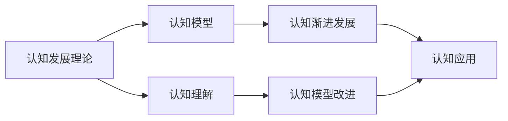
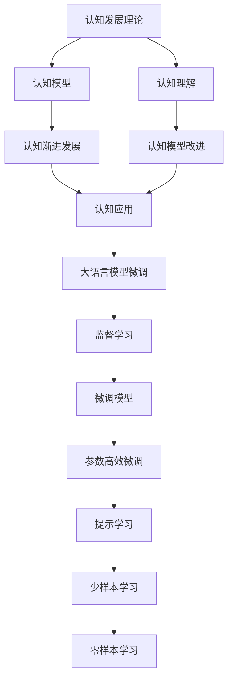

                 

# 认知渐进发展的阶段性理论

在人工智能和机器学习的快速发展的背景下，我们对于认知和智慧的理解不断深入。本文将围绕认知渐进发展的阶段性理论进行探讨，旨在通过逻辑清晰、结构紧凑、简单易懂的专业的技术语言，深入解析认知发展的本质，并在应用领域中寻找实际落地路径。

## 1. 背景介绍

认知科学的本质是对人类大脑如何处理信息、产生意识和智慧的科学理解。过去几十年，认知科学的发展深受人工智能和机器学习的影响，尤其是深度学习技术的突破。AI的认知模型从最初的符号主义到如今的连接主义，逐步向模拟人类大脑的工作机制迈进。

### 1.1 符号主义 vs 连接主义
- **符号主义**：20世纪60至80年代，AI研究主要依赖于符号逻辑和规则系统，以自然语言处理为代表。
- **连接主义**：自1980年代中后期，受神经科学启发，AI研究转向连接主义模型，强调模拟神经元之间互连的网络结构和动态交互。

### 1.2 深度学习与认知科学
深度学习的成功，源于其模拟人脑神经网络的多层次、多维度信息处理能力。AI研究开始借鉴认知科学的成果，如注意力机制、记忆网络和联想推理等，希望构建更为逼真和高效的学习模型。

## 2. 核心概念与联系

### 2.1 核心概念概述

在探讨认知渐进发展的阶段性理论时，我们首先需要明确以下几个核心概念：

- **认知发展理论**：描述认知能力随年龄增长而变化的过程，如皮亚杰的阶段理论、维果茨基的社会文化理论等。
- **认知模型**：以符号主义和连接主义为代表，通过模拟人类大脑的处理机制，实现信息理解和生成。
- **认知渐进发展**：认知能力逐渐提升，从简单到复杂，从局部到整体的过程。
- **认知应用**：将认知模型应用于机器学习、自然语言处理、智能决策等领域。

这些核心概念构成了认知渐进发展理论的基础。为了更好地理解这些概念之间的关系，我们可以使用以下Mermaid流程图：



### 2.2 概念间的关系

上述概念之间存在紧密的联系：

- **认知发展理论**为**认知模型**提供了理论基础，指导其如何模拟人的认知过程。
- **认知模型**是实现**认知渐进发展**的途径，通过模拟人的认知过程，逐步提升模型能力。
- **认知应用**是**认知模型**的实践场所，通过对认知模型的不断优化，将其应用于解决实际问题。
- **认知理解**和**认知模型改进**是相互促进的，理解认知过程有助于模型优化，模型优化又加深了对认知的理解。

### 2.3 核心概念的整体架构

下面我们将通过一个综合的流程图展示这些核心概念在大语言模型微调中的整体架构：



该综合流程图展示了从认知理论到认知模型改进，再到认知应用的整体流程。大语言模型微调作为认知应用的一种，通过监督学习、参数高效微调、提示学习等技术，逐步提升模型的认知能力，从而实现零样本和少样本学习。

## 3. 核心算法原理 & 具体操作步骤

### 3.1 算法原理概述

认知渐进发展的阶段性理论，基于人类认知的逐步提升，强调从简单到复杂、从局部到整体的认知模型构建。核心算法包括符号主义模型和连接主义模型。

- **符号主义模型**：基于规则和逻辑推理，通过符号操作实现信息处理。
- **连接主义模型**：基于神经网络，通过层次化的特征提取和关联推理实现信息处理。

### 3.2 算法步骤详解

#### 3.2.1 符号主义模型的算法步骤

符号主义模型的算法步骤如下：

1. **知识表示**：将问题转化为符号表示，定义符号和符号间的关系。
2. **推理规则**：建立符号间的推理规则，进行逻辑推理。
3. **知识获取**：通过学习和经验获取新的知识，更新符号表示。
4. **知识应用**：将获取的知识应用于新问题，进行求解。

#### 3.2.2 连接主义模型的算法步骤

连接主义模型的算法步骤如下：

1. **数据预处理**：将输入数据转换为神经网络可处理的格式。
2. **特征提取**：通过卷积和池化操作提取输入数据的特征。
3. **网络构建**：构建多层神经网络结构，包括卷积层、池化层和全连接层。
4. **训练优化**：使用反向传播算法更新模型参数，最小化损失函数。
5. **推理预测**：将新数据输入模型，进行特征提取和预测。

### 3.3 算法优缺点

符号主义模型具有明确的规则和可解释性，但其知识表示复杂，难以处理复杂问题。

连接主义模型具有较好的泛化能力和适应性，但其参数复杂，难以解释和调试。

### 3.4 算法应用领域

认知模型在自然语言处理、机器翻译、智能决策等领域有广泛应用：

- **自然语言处理**：通过符号主义或连接主义模型，实现语言理解和生成。
- **机器翻译**：使用连接主义模型，如Transformer，实现多语言之间的互译。
- **智能决策**：结合符号主义和连接主义模型，实现复杂决策问题的求解。

## 4. 数学模型和公式 & 详细讲解 & 举例说明

### 4.1 数学模型构建

认知模型的数学模型构建，主要涉及符号表示和神经网络结构。以下以连接主义模型为例，说明其数学模型的构建过程。

### 4.2 公式推导过程

连接主义模型的核心公式是神经网络的前向传播和反向传播算法。

假设神经网络包含 $n$ 个神经元，每个神经元的输入为 $x_i$，输出为 $y_i$，激活函数为 $f$，权重矩阵为 $W$，偏置向量为 $b$。

前向传播算法：

$$ y = f(Wx + b) $$

其中 $W$ 是权重矩阵，$x$ 是输入向量，$y$ 是输出向量。

反向传播算法：

$$ \Delta W = -\eta \frac{\partial L}{\partial W} $$
$$ \Delta b = -\eta \frac{\partial L}{\partial b} $$

其中 $\eta$ 是学习率，$L$ 是损失函数。

### 4.3 案例分析与讲解

以图像分类任务为例，展示连接主义模型的应用过程：

1. **数据预处理**：将图像转换为神经网络可处理的格式，如归一化、裁剪等。
2. **特征提取**：通过卷积层和池化层提取图像特征。
3. **网络构建**：构建包含多个卷积层、池化层和全连接层的神经网络结构。
4. **训练优化**：使用交叉熵损失函数，通过反向传播算法更新模型参数。
5. **推理预测**：将新图像输入模型，进行特征提取和分类预测。

## 5. 项目实践：代码实例和详细解释说明

### 5.1 开发环境搭建

进行认知模型开发时，需要搭建一个包含深度学习框架和数据集的环境。

以PyTorch为例，安装过程如下：

1. 安装Anaconda
2. 创建虚拟环境
3. 安装PyTorch和相关库

### 5.2 源代码详细实现

以下是一个基于PyTorch实现图像分类的代码示例：

```python
import torch
import torch.nn as nn
import torch.optim as optim
from torchvision import datasets, transforms

class Net(nn.Module):
    def __init__(self):
        super(Net, self).__init__()
        self.conv1 = nn.Conv2d(3, 6, 5)
        self.pool = nn.MaxPool2d(2, 2)
        self.conv2 = nn.Conv2d(6, 16, 5)
        self.fc1 = nn.Linear(16 * 5 * 5, 120)
        self.fc2 = nn.Linear(120, 84)
        self.fc3 = nn.Linear(84, 10)

    def forward(self, x):
        x = self.pool(torch.relu(self.conv1(x)))
        x = self.pool(torch.relu(self.conv2(x)))
        x = x.view(-1, 16 * 5 * 5)
        x = torch.relu(self.fc1(x))
        x = torch.relu(self.fc2(x))
        x = self.fc3(x)
        return x

# 加载数据集
transform = transforms.Compose(
    [transforms.ToTensor(),
     transforms.Normalize((0.5, 0.5, 0.5), (0.5, 0.5, 0.5))])
trainset = datasets.CIFAR10(root='./data', train=True,
                           download=True, transform=transform)
trainloader = torch.utils.data.DataLoader(trainset, batch_size=4,
                                          shuffle=True, num_workers=2)

# 构建模型和优化器
net = Net()
criterion = nn.CrossEntropyLoss()
optimizer = optim.SGD(net.parameters(), lr=0.001, momentum=0.9)

# 训练模型
for epoch in range(2):
    running_loss = 0.0
    for i, data in enumerate(trainloader, 0):
        inputs, labels = data
        optimizer.zero_grad()
        outputs = net(inputs)
        loss = criterion(outputs, labels)
        loss.backward()
        optimizer.step()
        running_loss += loss.item()
        if i % 2000 == 1999:
            print('[%d, %5d] loss: %.3f' %
                  (epoch + 1, i + 1, running_loss / 2000))
            running_loss = 0.0

# 测试模型
correct = 0
total = 0
with torch.no_grad():
    for data in testloader:
        images, labels = data
        outputs = net(images)
        _, predicted = torch.max(outputs.data, 1)
        total += labels.size(0)
        correct += (predicted == labels).sum().item()

print('Accuracy of the network on the 10000 test images: %d %%' % (
    100 * correct / total))
```

### 5.3 代码解读与分析

上述代码展示了基于PyTorch实现一个简单的图像分类模型。其核心步骤如下：

1. **模型定义**：使用`nn.Module`定义神经网络结构，包括卷积层、池化层和全连接层。
2. **数据加载**：使用`torchvision.datasets`加载CIFAR-10数据集，并进行预处理。
3. **模型训练**：使用`torch.optim.SGD`优化器进行模型训练，最小化交叉熵损失。
4. **模型测试**：在测试集上评估模型的分类准确率。

## 6. 实际应用场景

### 6.1 自然语言处理

认知模型在自然语言处理中的应用包括机器翻译、情感分析、命名实体识别等。以下以机器翻译为例，展示认知模型在实际应用中的使用：

1. **数据预处理**：将源语言文本转换为神经网络可处理的格式，如分词、去除停用词等。
2. **特征提取**：通过卷积和池化操作提取文本特征。
3. **网络构建**：构建包含多个卷积层、池化层和全连接层的神经网络结构。
4. **训练优化**：使用交叉熵损失函数，通过反向传播算法更新模型参数。
5. **推理预测**：将新文本输入模型，进行特征提取和翻译预测。

### 6.2 智能决策

认知模型在智能决策中的应用包括医疗诊断、金融风险评估等。以下以医疗诊断为例，展示认知模型在实际应用中的使用：

1. **数据预处理**：将病历文本转换为神经网络可处理的格式，如分词、去除噪音等。
2. **特征提取**：通过卷积和池化操作提取文本特征。
3. **网络构建**：构建包含多个卷积层、池化层和全连接层的神经网络结构。
4. **训练优化**：使用交叉熵损失函数，通过反向传播算法更新模型参数。
5. **推理预测**：将新病历文本输入模型，进行特征提取和诊断预测。

## 7. 工具和资源推荐

### 7.1 学习资源推荐

- **课程资源**：斯坦福大学《CS224N：自然语言处理与深度学习》课程。
- **书籍资源**：《深度学习》(周志华)，《认知计算与脑科学》(邓俊辉)。
- **在线资源**：Kaggle数据科学竞赛平台，GitHub深度学习项目。

### 7.2 开发工具推荐

- **深度学习框架**：PyTorch，TensorFlow，Keras。
- **可视化工具**：TensorBoard，Weights & Biases。
- **数据处理库**：Pandas，NumPy。

### 7.3 相关论文推荐

- **深度学习论文**：《ImageNet classification with deep convolutional neural networks》。
- **认知科学论文**：《The Course of Cognitive Development》。

## 8. 总结：未来发展趋势与挑战

### 8.1 研究成果总结

本文探讨了认知渐进发展的阶段性理论，强调符号主义和连接主义模型的优势和局限。通过符号主义和连接主义模型的结合，可以实现更加复杂和高效的信息处理。

### 8.2 未来发展趋势

未来认知模型将向以下方向发展：

1. **符号主义与连接主义结合**：综合符号主义和连接主义的优势，构建更加高效和灵活的认知模型。
2. **多模态融合**：结合视觉、听觉、语言等多模态数据，构建更加全面的认知模型。
3. **认知计算与神经科学结合**：借鉴神经科学的成果，优化认知模型的结构和算法。
4. **认知模型解释性**：提升认知模型的可解释性和可审计性，增强其应用可靠性。

### 8.3 面临的挑战

认知模型在发展过程中面临以下挑战：

1. **模型复杂性**：认知模型参数繁多，难以解释和调试。
2. **数据需求**：需要大规模高质量数据进行训练，获取数据成本较高。
3. **泛化能力**：模型的泛化能力不足，难以应对复杂和未知场景。
4. **实时性**：大模型的推理速度较慢，难以实现实时决策。
5. **伦理与安全**：模型的偏见和有害输出可能带来伦理和安全问题。

### 8.4 研究展望

未来的研究需要在以下方向寻求突破：

1. **模型简化与优化**：简化认知模型结构，提升推理速度。
2. **数据增强与获取**：利用数据增强技术，优化数据获取方法。
3. **知识图谱与外部知识结合**：构建知识图谱，结合外部知识优化认知模型。
4. **认知计算与伦理安全**：建立认知计算的伦理规范，确保模型应用的安全性。

## 9. 附录：常见问题与解答

### 附录

本文系统地介绍了认知渐进发展的阶段性理论，并在实际应用领域中进行了详细讨论。以下是对一些常见问题的解答：

**Q1: 认知渐进发展理论的核心理念是什么？**

A: 认知渐进发展理论的核心理念是认知能力随着年龄的增长逐渐提升，从简单到复杂，从局部到整体。

**Q2: 符号主义模型和连接主义模型有何区别？**

A: 符号主义模型基于规则和逻辑推理，可解释性强，但知识表示复杂；连接主义模型基于神经网络，具有更好的泛化能力和适应性，但难以解释和调试。

**Q3: 深度学习与认知模型结合的优势是什么？**

A: 深度学习与认知模型结合，可以模拟人类大脑的多层次信息处理能力，提升模型的复杂性和泛化能力。

**Q4: 如何在实际应用中提升认知模型的效率？**

A: 可以通过模型简化与优化、数据增强与获取、知识图谱与外部知识结合等方法提升认知模型的效率。

**Q5: 认知模型的伦理与安全问题如何处理？**

A: 可以通过建立认知计算的伦理规范，结合外部知识优化模型，确保模型应用的安全性。

---

作者：禅与计算机程序设计艺术 / Zen and the Art of Computer Programming

