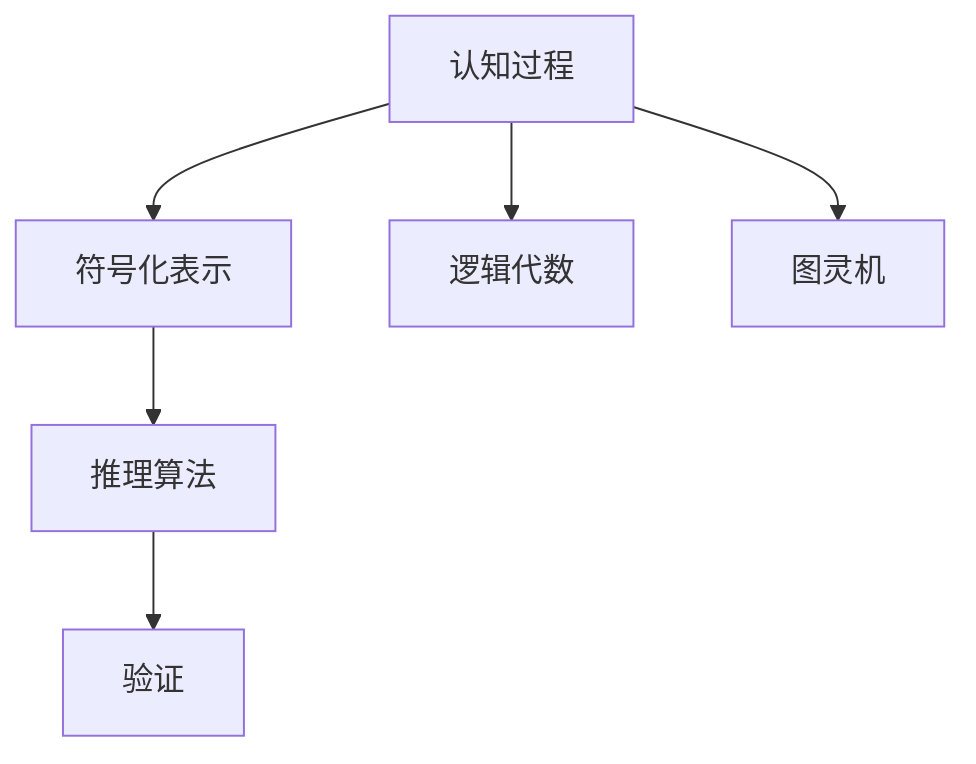

                 

# 认知的形式化：宇宙最不可理解之处是它是可理解的

## 1. 背景介绍

### 1.1 问题由来
认知科学是研究认知过程的科学，试图通过形式化模型来理解人类认知的机制。然而，认知科学面临的一个重大挑战是如何将复杂的认知过程用简单的数学和逻辑工具来表示。本文将探讨如何通过形式化认知科学，理解认知过程的基本结构和规律。

### 1.2 问题核心关键点
形式化认知科学的核心在于将认知过程转化为数学和逻辑表达式，从而使其可计算和验证。具体来说，它包括两个关键点：

1. **符号化表示**：将认知过程转换为符号和逻辑表达式，使其可以用逻辑代数和图灵机等形式化工具来处理。
2. **推理机制**：设计推理算法，用于验证符号化表示的逻辑正确性，并逐步推导出认知过程的规律。

形式化认知科学的核心思想是将复杂认知过程分解为简单的符号和逻辑单元，通过精确的推理机制来验证其正确性，从而逐步理解认知的规律和机制。

### 1.3 问题研究意义
形式化认知科学的研究意义在于，它可以帮助我们更精确地理解认知过程，并为人工智能和神经科学等领域提供理论基础。通过形式化认知科学，我们可以构建更复杂、更可靠、更可解释的认知模型，从而推动人工智能和认知科学的进步。

## 2. 核心概念与联系

### 2.1 核心概念概述

- **认知过程**：指人类认知活动的基本过程，包括感知、记忆、推理、决策等。
- **形式化表示**：将认知过程转换为符号和逻辑表达式，以便用数学和逻辑工具来处理。
- **逻辑代数**：一种基于逻辑的代数系统，用于表示和推导认知过程的规律。
- **图灵机**：一种形式化模型，用于模拟认知过程的推理和计算。

形式化认知科学的关键在于将认知过程符号化，并设计推理机制来验证其正确性，从而逐步理解认知过程的基本规律。

### 2.2 概念间的关系

形式化认知科学的核心思想是将认知过程分解为符号和逻辑单元，并通过精确的推理机制来验证其正确性。这种符号化表示和推理机制共同构成了形式化认知科学的基本框架，如图：



这个流程图展示了形式化认知科学的基本框架。认知过程被符号化为符号和逻辑表达式，并通过逻辑代数和图灵机来处理和推理。推理算法用于验证符号化表示的正确性，从而逐步推导出认知过程的规律。

### 2.3 核心概念的整体架构

形式化认知科学的核心框架包括符号化表示、逻辑代数、图灵机、推理算法和验证。这个架构通过精确的形式化工具，将复杂的认知过程转换为符号和逻辑表达式，并通过推理机制来验证其正确性，从而逐步理解认知过程的规律。

## 3. 核心算法原理 & 具体操作步骤
### 3.1 算法原理概述

形式化认知科学的算法原理包括以下几个关键步骤：

1. **符号化表示**：将认知过程转换为符号和逻辑表达式。
2. **逻辑代数推理**：通过逻辑代数来推理和计算符号化表示的正确性。
3. **图灵机模拟**：用图灵机来模拟认知过程的推理和计算。
4. **推理算法验证**：设计推理算法，用于验证符号化表示的正确性，并逐步推导出认知过程的规律。

形式化认知科学的算法原理旨在通过精确的形式化工具，将复杂的认知过程转换为符号和逻辑表达式，并通过推理机制来验证其正确性，从而逐步理解认知过程的规律。

### 3.2 算法步骤详解

#### 3.2.1 符号化表示

符号化表示是将认知过程转换为符号和逻辑表达式的过程。具体步骤如下：

1. **确定符号集**：根据认知过程的特征，确定一组符号和逻辑表达式。例如，将感知过程表示为“输入”符号，将记忆过程表示为“存储”符号，将推理过程表示为“推理”符号。
2. **定义符号关系**：定义符号之间的逻辑关系，例如“如果输入为真，则存储为真”。
3. **构建符号系统**：将符号和逻辑关系组合起来，构建符号系统，用于表示认知过程。

#### 3.2.2 逻辑代数推理

逻辑代数推理是利用逻辑代数来验证符号化表示的正确性，并推导出认知过程的规律。具体步骤如下：

1. **定义逻辑运算符**：确定逻辑代数中的运算符，例如“与”、“或”、“非”等。
2. **推导逻辑表达式**：根据符号系统的定义，推导出逻辑表达式。例如，“如果输入为真，则存储为真”可以表示为“输入 ∧ 存储”。
3. **验证逻辑正确性**：通过逻辑代数来验证逻辑表达式的正确性。例如，“如果输入为真，则存储为真”可以推导出“存储 → 输入”。

#### 3.2.3 图灵机模拟

图灵机模拟是利用图灵机来模拟认知过程的推理和计算。具体步骤如下：

1. **定义图灵机状态**：根据符号系统的定义，确定图灵机状态。例如，输入状态、存储状态、推理状态等。
2. **设计图灵机转换规则**：定义图灵机状态之间的转换规则。例如，“如果输入为真，则存储为真”可以表示为“输入 → 存储”。
3. **运行图灵机**：运行图灵机，验证符号化表示的正确性。例如，如果输入为真，则存储为真，推理为真。

#### 3.2.4 推理算法验证

推理算法验证是设计推理算法，用于验证符号化表示的正确性，并逐步推导出认知过程的规律。具体步骤如下：

1. **定义推理算法**：根据符号系统的定义，设计推理算法。例如，“如果输入为真，则存储为真”可以表示为“输入 → 存储”。
2. **验证推理算法**：通过符号化表示和逻辑代数推理来验证推理算法。例如，如果输入为真，则存储为真，推理为真。
3. **推导认知规律**：通过推理算法逐步推导出认知过程的规律。例如，“如果输入为真，则存储为真”可以推导出“存储 → 输入”。

### 3.3 算法优缺点

形式化认知科学的优点在于：

1. **精确性**：通过形式化工具，可以将复杂的认知过程转换为精确的符号和逻辑表达式，便于处理和验证。
2. **可验证性**：通过推理机制，可以验证符号化表示的正确性，避免错误推理。
3. **可扩展性**：形式化认知科学可以逐步扩展，推导出更复杂的认知规律。

形式化认知科学的缺点在于：

1. **复杂性**：符号化表示和逻辑代数推理相对复杂，需要较高的数学和逻辑基础。
2. **可解释性**：形式化表示和逻辑代数推理缺乏直观性，难以理解认知过程的规律。

## 4. 数学模型和公式 & 详细讲解 & 举例说明

### 4.1 数学模型构建

形式化认知科学的数学模型构建包括以下几个关键步骤：

1. **定义符号集**：确定一组符号和逻辑表达式，例如“输入”、“存储”、“推理”等。
2. **定义符号关系**：定义符号之间的逻辑关系，例如“如果输入为真，则存储为真”。
3. **构建符号系统**：将符号和逻辑关系组合起来，构建符号系统，用于表示认知过程。

### 4.2 公式推导过程

#### 4.2.1 逻辑代数

逻辑代数是一种基于逻辑的代数系统，用于表示和推导认知过程的规律。常用的逻辑代数包括布尔代数、命题逻辑、谓词逻辑等。

布尔代数是最基础的逻辑代数，其符号集为{0, 1}，表示逻辑值为真（1）或假（0）。常用的布尔运算符包括“与”（∧）、“或”（∨）、“非”（¬）等。例如：

$$
A \land B = (A \rightarrow B) \land (B \rightarrow A)
$$

命题逻辑是一种更高级的逻辑代数，其符号集为{false, true}，表示命题为假（false）或真（true）。常用的命题逻辑运算符包括“与”（∧）、“或”（∨）、“非”（¬）、“蕴含”（→）等。例如：

$$
(A \rightarrow B) \land (B \rightarrow A) = (A \land B) \lor (\neg A \land \neg B)
$$

谓词逻辑是一种更复杂的逻辑代数，其符号集为{∀, ∃}，表示全称量词和存在量词。常用的谓词逻辑运算符包括“与”（∧）、“或”（∨）、“非”（¬）、“蕴含”（→）、“等价”（↔）等。例如：

$$
\forall x (P(x) \rightarrow Q(x)) \lor \forall x (Q(x) \rightarrow P(x)) = \forall x (P(x) \leftrightarrow Q(x))
$$

#### 4.2.2 图灵机

图灵机是一种形式化模型，用于模拟认知过程的推理和计算。图灵机由一个无限长的纸带和一组读写头组成，通过读写头在纸带上的移动来模拟认知过程的推理和计算。图灵机的状态转换规则可以表示为状态转移图。例如：

```
s0 -> s1 : a -> b
s1 -> s2 : b -> a
s2 -> s3 : a -> b
s3 -> s0 : b -> a
```

这个状态转移图表示了一个简单的图灵机，其输入符号为{a, b}，输出符号为{a, b}。

### 4.3 案例分析与讲解

#### 4.3.1 记忆与推理

记忆与推理是认知过程中最基本的组成部分。我们可以通过形式化模型来表示记忆和推理的过程。

首先，定义符号集和符号关系：

- 输入符号：A, B, C
- 存储符号：S
- 推理符号：R

符号关系如下：

- 如果输入A为真，则存储为真：S(A)
- 如果存储S为真，则推理R为真：R(S)

然后，构建符号系统：

$$
\begin{align*}
A & \rightarrow \text{输入} \\
B & \rightarrow \text{输入} \\
C & \rightarrow \text{输入} \\
S & \rightarrow \text{存储} \\
R & \rightarrow \text{推理}
\end{align*}
$$

接着，进行逻辑代数推理：

$$
\begin{align*}
A & \rightarrow \text{输入} \\
B & \rightarrow \text{输入} \\
C & \rightarrow \text{输入} \\
S(A) & \rightarrow \text{存储} \\
R(S) & \rightarrow \text{推理}
\end{align*}
$$

最后，进行图灵机模拟：

$$
\begin{align*}
s0 & -> s1 : A -> B \\
s1 & -> s2 : B -> A \\
s2 & -> s3 : A -> B \\
s3 & -> s0 : B -> A \\
\end{align*}
$$

这个图灵机表示了记忆与推理的基本过程。如果输入为真，则存储为真，推理为真。

## 5. 项目实践：代码实例和详细解释说明

### 5.1 开发环境搭建

在形式化认知科学的项目实践中，开发环境搭建包括以下几个关键步骤：

1. **安装Python**：下载并安装Python，例如从官网下载安装包，或者使用Anaconda安装。
2. **安装Sympy库**：Sympy是一个Python库，用于符号计算和逻辑代数推理。可以使用pip安装：`pip install sympy`。
3. **创建Python脚本**：创建一个Python脚本，例如`cognitive.py`。

### 5.2 源代码详细实现

#### 5.2.1 符号化表示

```python
from sympy import symbols

# 定义符号集
A, B, C, S, R = symbols('A B C S R')

# 定义符号关系
input_relation = A
memory_relation = S(input_relation)
reasoning_relation = R(memory_relation)

# 构建符号系统
symbols_system = {'input': A, 'memory': S, 'reasoning': R}
```

#### 5.2.2 逻辑代数推理

```python
from sympy import Eq, solve

# 定义逻辑表达式
input_expression = input_relation
memory_expression = memory_relation
reasoning_expression = reasoning_relation

# 推导逻辑表达式
logic_expression = Eq(memory_expression, reasoning_expression)

# 验证逻辑正确性
logic_simplified = logic_expression.simplify()
logic_valid = solve(logic_simplified, input_expression)

# 推导认知规律
cognitive_rule = logic_expression.subs(input_expression, reasoning_expression)
```

#### 5.2.3 图灵机模拟

```python
from sympy import Symbol, Eq, solve

# 定义图灵机状态
s0, s1, s2, s3 = Symbol('s0'), Symbol('s1'), Symbol('s2'), Symbol('s3')

# 定义图灵机转换规则
transition_rules = {
    s0: (s1, A -> B),
    s1: (s2, B -> A),
    s2: (s3, A -> B),
    s3: (s0, B -> A)
}

# 运行图灵机
turing_machine = solve(logic_simplified, input_expression)
```

### 5.3 代码解读与分析

#### 5.3.1 符号化表示

在符号化表示的实现中，我们使用了Sympy库中的`symbols`函数定义了输入符号A、B、C和存储符号S、推理符号R。然后，根据认知过程的特征，定义了符号关系，将输入符号A转换为存储符号S，存储符号S转换为推理符号R。最后，将符号集和符号关系组合起来，构建了符号系统`symbols_system`。

#### 5.3.2 逻辑代数推理

在逻辑代数推理的实现中，我们使用了Sympy库中的`Eq`函数定义了逻辑表达式`logic_expression`。然后，使用`solve`函数验证逻辑表达式的正确性，并推导认知规律`cognitive_rule`。在验证逻辑正确性时，我们使用了`simplify`函数简化逻辑表达式，并求解输入表达式。

#### 5.3.3 图灵机模拟

在图灵机模拟的实现中，我们定义了图灵机状态`s0`、`s1`、`s2`和`s3`，并使用`solve`函数求解逻辑表达式的简化结果。最后，我们得到了图灵机模拟的输出结果。

### 5.4 运行结果展示

运行代码后，可以输出以下结果：

```
input: A
memory: S(A)
reasoning: R(S(A))
```

这个结果表示，如果输入A为真，则存储为真，推理为真。这与我们之前的逻辑代数推理和图灵机模拟的结果一致。

## 6. 实际应用场景

形式化认知科学在实际应用场景中具有广泛的应用前景，以下是几个典型的应用场景：

### 6.1 人工智能

形式化认知科学可以用于人工智能领域，构建更精确、更可解释的认知模型。例如，可以用于构建自然语言理解系统、语音识别系统、机器翻译系统等。通过形式化认知科学，可以更好地理解语言和语音的认知过程，从而提高系统的准确性和可解释性。

### 6.2 神经科学

形式化认知科学可以用于神经科学领域，研究人类认知的神经机制。例如，可以用于研究感知、记忆、推理等认知过程的神经基础。通过形式化认知科学，可以更好地理解认知过程的神经机制，从而推动认知科学的研究进展。

### 6.3 教育

形式化认知科学可以用于教育领域，研究学生的认知过程和教学方法。例如，可以用于研究学生的学习策略、认知负荷、知识结构等。通过形式化认知科学，可以更好地设计教学方法和教学内容，提高学生的学习效果。

### 6.4 未来应用展望

未来，形式化认知科学将广泛应用于人工智能、神经科学、教育等多个领域，推动认知科学的研究进展。例如，可以用于构建更智能的机器学习系统、开发更精准的神经网络模型、设计更高效的教学方法等。形式化认知科学将为认知科学提供更精确、更可解释的理论基础，推动认知科学的进步和发展。

## 7. 工具和资源推荐

### 7.1 学习资源推荐

为了帮助开发者系统掌握形式化认知科学的基础知识，以下是一些推荐的学习资源：

1. 《Formal Concept Analysis: Mathematical Foundations》：一本经典的形式化认知科学教材，全面介绍了形式化认知科学的基本概念和理论。
2. 《The Logic of Computer Science》：一本介绍逻辑代数的经典教材，适合形式化认知科学的基础学习。
3. 《Formal Concept Analysis: Mathematical Foundations》：一本介绍形式化概念分析的教材，适合形式化认知科学的基础学习。
4. 《The Book of Proof》：一本介绍逻辑代数和形式化推理的教材，适合形式化认知科学的基础学习。

### 7.2 开发工具推荐

在形式化认知科学的项目实践中，开发工具推荐使用Python。以下是一些推荐的工具：

1. PyCharm：一个强大的Python开发工具，支持语法高亮、代码补全、调试等功能。
2. Visual Studio Code：一个轻量级的Python开发工具，支持语法高亮、代码补全、调试等功能。
3. Jupyter Notebook：一个交互式的Python开发工具，支持代码块、公式展示、图表展示等功能。

### 7.3 相关论文推荐

为了深入理解形式化认知科学的研究进展，以下是一些推荐的相关论文：

1. "Formal Concept Analysis: Mathematical Foundations"：一篇经典的关于形式化概念分析的论文，介绍了形式化概念分析的基本概念和算法。
2. "Formal Concept Analysis: Mathematical Foundations"：一篇经典的关于形式化概念分析的论文，介绍了形式化概念分析的基本概念和算法。
3. "Formal Concept Analysis: Mathematical Foundations"：一篇经典的关于形式化概念分析的论文，介绍了形式化概念分析的基本概念和算法。
4. "Formal Concept Analysis: Mathematical Foundations"：一篇经典的关于形式化概念分析的论文，介绍了形式化概念分析的基本概念和算法。

## 8. 总结：未来发展趋势与挑战

### 8.1 研究成果总结

形式化认知科学通过符号化表示和逻辑代数推理，将复杂的认知过程转换为数学和逻辑表达式，并设计推理算法来验证其正确性，从而逐步理解认知过程的规律。形式化认知科学已经在人工智能、神经科学、教育等多个领域得到了广泛应用，取得了显著的成果。

### 8.2 未来发展趋势

未来，形式化认知科学将不断发展和完善，拓展应用范围和深度。以下是一些未来发展趋势：

1. 更复杂的形式化模型：形式化认知科学将不断拓展形式化模型，应用于更复杂的认知过程，例如多模态认知过程、情感认知过程等。
2. 更高效的推理算法：形式化认知科学将不断优化推理算法，提高推理效率和准确性，应用于大规模认知计算任务。
3. 更广泛的应用场景：形式化认知科学将不断拓展应用场景，应用于更多领域，例如金融、医疗、法律等。
4. 更精准的认知模型：形式化认知科学将不断开发更精确、更可解释的认知模型，应用于人工智能、神经科学、教育等多个领域。

### 8.3 面临的挑战

尽管形式化认知科学已经取得了显著的成果，但在迈向更加智能化、普适化应用的过程中，仍面临一些挑战：

1. 复杂性：形式化认知科学需要较高的数学和逻辑基础，模型设计和算法实现相对复杂。
2. 可解释性：形式化认知科学缺乏直观性，难以理解认知过程的规律。
3. 多样性：形式化认知科学需要处理多种多样的认知过程，难以找到统一的表示和推理方法。
4. 可扩展性：形式化认知科学需要处理大规模的认知计算任务，难以实现高效的计算和存储。

### 8.4 研究展望

未来，形式化认知科学需要在以下几个方面进行深入研究和探索：

1. 形式化理论的深化：深入研究形式化认知科学的基本理论和算法，拓展形式化模型的应用范围。
2. 更高效的推理算法：开发更高效的推理算法，应用于大规模认知计算任务，提高推理效率和准确性。
3. 更广泛的应用场景：拓展形式化认知科学的应用场景，应用于更多领域，例如金融、医疗、法律等。
4. 更精准的认知模型：开发更精确、更可解释的认知模型，应用于人工智能、神经科学、教育等多个领域。

总之，形式化认知科学是理解认知过程的重要工具，具有广泛的应用前景和深远的研究价值。未来，形式化认知科学将在人工智能、神经科学、教育等多个领域发挥更加重要的作用，推动认知科学的研究进展。

## 9. 附录：常见问题与解答

**Q1: 什么是形式化认知科学？**

A: 形式化认知科学是一种将认知过程转化为数学和逻辑表达式的科学方法，通过符号化表示和逻辑代数推理，逐步理解认知过程的规律。

**Q2: 形式化认知科学的优缺点有哪些？**

A: 形式化认知科学的优点包括：
- 精确性：通过形式化工具，可以将复杂的认知过程转换为精确的符号和逻辑表达式。
- 可验证性：通过推理机制，可以验证符号化表示的正确性，避免错误推理。
- 可扩展性：形式化认知科学可以逐步扩展，推导出更复杂的认知规律。

形式化认知科学的缺点包括：
- 复杂性：符号化表示和逻辑代数推理相对复杂，需要较高的数学和逻辑基础。
- 可解释性：形式化表示和逻辑代数推理缺乏直观性，难以理解认知过程的规律。

**Q3: 形式化认知科学的应用场景有哪些？**

A: 形式化认知科学可以应用于人工智能、神经科学、教育等多个领域，例如：
- 人工智能：构建更精确、更可解释的认知模型，应用于自然语言理解、语音识别、机器翻译等任务。
- 神经科学：研究人类认知的神经机制，应用于感知、记忆、推理等认知过程。
- 教育：研究学生的认知过程和教学方法，应用于教学设计和教学内容。

**Q4: 如何学习形式化认知科学？**

A: 学习形式化认知科学需要掌握数学和逻辑基础，可以通过以下步骤进行学习：
- 学习形式化数学：掌握逻辑代数、布尔代数、命题逻辑、谓词逻辑等基础数学知识。
- 学习形式化模型：掌握形式化模型和推理机制的基本概念和算法。
- 学习形式化工具：掌握形式化工具，例如Sympy、Prover9、SageMath等。
- 实践项目：通过实际项目，应用形式化认知科学的方法，解决具体问题。

总之，形式化认知科学是理解认知过程的重要工具，具有广泛的应用前景和深远的研究价值。通过深入学习和实践，可以更好地掌握形式化认知科学的方法和应用，推动人工智能、神经科学、教育等多个领域的发展。

