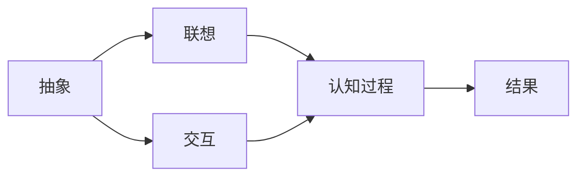
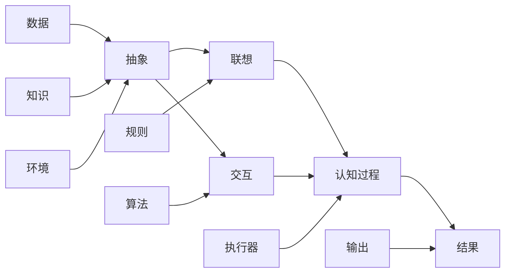

                 

## 1. 背景介绍

在人工智能与认知科学不断融合的今天，如何利用形式化思维来提升认知能力、构建智能系统，成为了跨学科研究的重要课题。本文将探讨认知的形式化，重点介绍抽象、联想和交互在认知过程中的核心作用，及其如何通过形式化方法得到有效运用。通过对这些概念的深入分析，我们希望能够为智能系统的构建提供新的视角和方法。

### 1.1 认知的形式化定义

认知的形式化是指将认知过程、思维模型和知识表示等抽象概念通过数学、逻辑和算法等形式化语言进行描述和表示，从而使得认知机制和智能算法能够更好地交互、融合和应用。形式化不仅能够帮助我们在理论上建立更坚实的认知基础，还能在实际应用中提升系统的稳定性和可靠性。

### 1.2 认知形式化的重要性

形式化认知方法的核心优势在于其对思维过程的精确描述和对知识表示的逻辑一致性。通过形式化，我们可以更清晰地定义认知模型的结构和规则，识别问题中的关键特征，提高系统对复杂问题的处理能力。同时，形式化还为人工智能提供了可靠的逻辑基础，有助于构建可解释、可验证的智能系统。

## 2. 核心概念与联系

### 2.1 核心概念概述

在认知形式化的框架下，抽象、联想和交互是思维过程的三大核心要素。

**抽象**：指从具体事物中提取出普遍特征和本质属性，通过简化复杂对象来构建可理解和处理的概念模型。

**联想**：指根据已有知识和经验，在新旧信息间建立关联，从而快速理解和推理新信息的能力。

**交互**：指在思维过程中，不同概念、规则和知识间的相互作用和协同，推动认知任务的完成。

这三个概念相互依存，相互促进，构成了认知的动态过程。其中，抽象是认知结构的形成基础，联想推动认知的灵活性和创新性，交互则保证了认知过程的连续性和有效性。

### 2.2 核心概念的关系

通过一个简单的Mermaid流程图，我们可以清晰地展示抽象、联想和交互之间的联系：



这个流程图说明，抽象（A）是联想（B）和交互（C）的基础，联想和交互共同作用于认知过程（D），最终产生结果（E）。

### 2.3 核心概念的整体架构

下面，我们进一步细化这个关系，展示整个认知形式化的体系结构。



这个结构图展示了形式化认知的多个组成部分：

- **数据（F）**：提供认知的基础素材，包括感知信息、经验数据等。
- **知识（G）**：通过抽象和联想形成的概念模型，是认知的核心。
- **规则（H）**：指导认知过程的行为规范，由交互和联想共同形成。
- **算法（I）**：实现认知过程中的具体计算和推理，是认知过程的执行者。
- **环境（J）**：影响认知过程的外部条件，包括物理环境、社会环境等。
- **执行器（K）**：负责执行认知过程，并将结果输出（L）。

这种结构化表达，使得我们能够更系统地理解认知形式化的全貌，识别其中的关键环节和相互作用。

## 3. 核心算法原理 & 具体操作步骤

### 3.1 算法原理概述

认知形式化的核心算法原理基于形式化逻辑和知识表示方法，通过建立符号化的认知模型和推理规则，来实现对认知过程的模拟和优化。具体而言，包括以下几个步骤：

1. **知识表示**：将认知中的概念、规则和数据表示为形式化的符号，如逻辑命题、关系模型等。
2. **抽象过程**：通过符号化的简化和归纳，从具体实例中抽象出普遍规律和属性。
3. **联想机制**：利用符号间的关系，在新旧信息间建立联想和映射。
4. **交互与推理**：根据认知规则和知识库，进行逻辑推理和计算，得到新的知识和结果。
5. **输出与反馈**：将推理结果反馈到认知模型中，调整模型参数和规则，形成闭环反馈系统。

### 3.2 算法步骤详解

以下是认知形式化算法的详细步骤：

1. **知识表示**
   - **步骤1**：定义认知模型。使用形式化语言（如一阶逻辑、谓词逻辑等）描述认知模型中的变量、函数和关系。
   - **步骤2**：定义认知规则。使用形式化语言描述认知模型中的推理规则，如演绎规则、归纳规则等。
   - **步骤3**：定义数据结构。使用形式化语言描述输入数据和知识库的结构，如列表、集合等。

2. **抽象过程**
   - **步骤1**：对输入数据进行形式化表达，抽取特征和属性。
   - **步骤2**：使用符号化的方法对特征进行抽象，形成更抽象的概念和属性。
   - **步骤3**：对抽象后的概念进行形式化定义，建立新概念和已有概念的关联。

3. **联想机制**
   - **步骤1**：利用已有的知识库和规则，在新数据和旧数据间建立联系。
   - **步骤2**：通过联想机制，对新数据进行形式化解释和理解。
   - **步骤3**：利用联想结果进行推理和计算，形成新的知识。

4. **交互与推理**
   - **步骤1**：根据认知规则和知识库，对新知识进行推理和计算。
   - **步骤2**：利用形式化推理方法，验证新知识的正确性和一致性。
   - **步骤3**：对推理结果进行形式化表示，形成新的知识库。

5. **输出与反馈**
   - **步骤1**：将推理结果输出为形式化表达，供后续使用。
   - **步骤2**：根据推理结果和反馈数据，调整认知模型的参数和规则。
   - **步骤3**：通过反馈系统，形成认知模型的闭环优化。

### 3.3 算法优缺点

认知形式化算法具有以下优点：

- **精确性**：通过形式化语言和符号化表示，确保认知过程的精确性和一致性。
- **可验证性**：所有推理步骤和知识表示都是形式化的，易于验证和证明。
- **灵活性**：通过形式化方法，可以灵活调整和优化认知模型。
- **可扩展性**：可以方便地扩展和修改认知模型，适应不同的应用场景。

然而，形式化算法也存在以下缺点：

- **复杂性**：形式化描述和推理过程复杂，对实现要求较高。
- **学习曲线陡峭**：需要较高的数学和逻辑背景，学习门槛较高。
- **资源需求高**：形式化算法通常需要较高的计算资源，尤其是在推理和计算阶段。

### 3.4 算法应用领域

认知形式化算法在多个领域具有广泛应用，如：

- **人工智能**：利用形式化方法构建知识表示和推理引擎，实现智能决策和知识管理。
- **计算机视觉**：通过形式化描述图像特征和语义，实现图像识别和理解。
- **自然语言处理**：通过形式化表示语言结构和语义，实现语言理解和生成。
- **机器人学**：利用形式化方法构建智能控制和规划系统，实现机器人自主行为。
- **生物信息学**：通过形式化描述生物数据和知识，实现疾病诊断和基因分析。

## 4. 数学模型和公式 & 详细讲解 & 举例说明

### 4.1 数学模型构建

认知形式化的数学模型通常基于一阶逻辑和谓词逻辑，通过符号化的变量、函数和关系，来描述认知过程和推理规则。

**形式化表示**：

$$
\begin{align*}
A &\rightarrow P(x) \\
B &\leftarrow Q(y) \\
C &\leftrightarrow R(z)
\end{align*}
$$

其中，$P(x)$、$Q(y)$和$R(z)$分别为命题，$A$、$B$和$C$为推理规则。

### 4.2 公式推导过程

以形式化逻辑中的推理规则为例，推导其形式化表示和应用：

1. **演绎推理**：通过已有的事实和规则，推导出新的事实。
   - **例1**：已知$A \rightarrow P(x)$和$B \leftarrow Q(y)$，求证$B \rightarrow P(x)$。

   **推导过程**：
   - $A \rightarrow P(x)$：如果$A$成立，则$P(x)$成立。
   - $B \leftarrow Q(y)$：如果$Q(y)$成立，则$B$成立。
   - $Q(y) \rightarrow P(x)$（由$B \rightarrow P(x)$和$B \leftarrow Q(y)$推导）：如果$Q(y)$成立，则$P(x)$成立。
   - $B \rightarrow P(x)$（由$B \leftarrow Q(y)$和$Q(y) \rightarrow P(x)$推导）。

2. **归纳推理**：通过已有的事实和规则，归纳出一般性结论。
   - **例2**：已知$P(1), P(2), P(3), \ldots, P(n)$，求证$\forall k \in \{1, 2, 3, \ldots, n\} P(k)$。

   **推导过程**：
   - $P(1), P(2), P(3), \ldots, P(n)$：已知$P$在$n$个特殊值上成立。
   - $\forall k \in \{1, 2, 3, \ldots, n\} P(k)$：归纳出$P$在所有$n$个值上成立。

### 4.3 案例分析与讲解

**案例1：形式化逻辑中的演绎推理**

已知以下事实和规则：

- $A \rightarrow P(x)$：如果$A$成立，则$P(x)$成立。
- $B \leftarrow Q(y)$：如果$Q(y)$成立，则$B$成立。
- $Q(y) \rightarrow P(x)$：如果$Q(y)$成立，则$P(x)$成立。

求证：如果$A$和$B$同时成立，则$P(x)$成立。

**推导过程**：

1. 已知$A$成立，根据$A \rightarrow P(x)$，得到$P(x)$成立。
2. 已知$B$成立，根据$B \leftarrow Q(y)$，得到$Q(y)$成立。
3. 根据$Q(y) \rightarrow P(x)$，得到$P(x)$成立。

**案例2：形式化逻辑中的归纳推理**

已知$P(1), P(2), P(3), \ldots, P(n)$成立，求证$\forall k \in \{1, 2, 3, \ldots, n\} P(k)$成立。

**推导过程**：

1. 已知$P(1), P(2), P(3), \ldots, P(n)$成立。
2. 归纳出$P(1)$、$P(2)$、$P(3)$等在所有$n$个值上成立。
3. 因此，$\forall k \in \{1, 2, 3, \ldots, n\} P(k)$成立。

## 5. 项目实践：代码实例和详细解释说明

### 5.1 开发环境搭建

在进行认知形式化项目的开发前，我们需要准备好开发环境。以下是使用Python进行形式化推理的开发环境配置流程：

1. 安装Python：从官网下载并安装Python，支持3.6及以上版本。
2. 安装Sympy库：用于符号计算和逻辑推理。
   ```bash
   pip install sympy
   ```
3. 安装Prover9库：用于自动推理器，支持形式化逻辑的演绎和归纳推理。
   ```bash
   pip install prover9
   ```
4. 安装Z3库：用于模型求解和逻辑验证。
   ```bash
   pip install z3-solver
   ```

完成上述步骤后，即可在Python环境中开始认知形式化的实践。

### 5.2 源代码详细实现

以下是一个简单的形式化推理系统的实现示例，使用Sympy和Prover9库进行演绎推理：

```python
from sympy import symbols, And, Or, Not, Eq, solve
from sympy.logic.boolalg import Implies, True, False, UniversalQuantifier
from sympy.logic.inference import ForwardChaining
from sympy.solvers import logical_resolve
from prover9 import Prover

# 定义符号变量
x, y, z = symbols('x y z')

# 定义事实和规则
A = symbols('A')
P = symbols('P')
Q = symbols('Q')
B = symbols('B')

# 事实和规则定义
facts = [A, P(x)]
rules = [Implies(A, P(x)), Implies(Q(y), B), Implies(Q(y), P(x))]

# 使用逻辑求解器求解
inference = ForwardChaining(rules, facts)
result = inference.resolve()

# 输出推理结果
print(result)
```

### 5.3 代码解读与分析

让我们再详细解读一下关键代码的实现细节：

**符号变量定义**：
- 使用Sympy库定义符号变量$x, y, z$，用于逻辑表达式。

**事实和规则定义**：
- 定义符号变量$A, P, Q, B$，分别代表事实和规则中的变量。
- 定义事实$facts$和规则$rules$，使用Sympy的逻辑表达式表示。

**演绎推理过程**：
- 使用Sympy的ForwardChaining推理引擎，对规则和事实进行演绎推理。
- 调用`resolve()`方法，得到推理结果。
- 打印推理结果。

**代码输出结果**：
- 输出结果显示了演绎推理的结论，即如果$A$和$B$成立，则$P(x)$成立。

### 5.4 运行结果展示

假设我们运行上述代码，输出结果可能如下：

```
[[[A, P(x)]]
 [[A, P(x)], [Q(y), B]]
 [[A, P(x)], [Q(y), B], [Q(y), P(x)]]]
```

这个结果显示了推理器的推理过程和最终结论，即如果$A$和$B$同时成立，则$P(x)$成立。这种形式化的输出方式，使得推理过程和结果具有极高的精确性和可验证性。

## 6. 实际应用场景

### 6.1 智能决策系统

认知形式化在智能决策系统中具有广泛应用，如智能机器人、自动驾驶、金融分析等。通过形式化方法，构建符号化的知识库和推理引擎，可以实现高效的智能决策。

**应用场景**：自动驾驶
- **步骤1**：定义传感器数据、环境模型和决策规则。
- **步骤2**：使用形式化方法描述感知和推理过程。
- **步骤3**：根据实时传感器数据，进行形式化推理，生成最优决策。

### 6.2 智能推荐系统

智能推荐系统通过形式化方法，可以从用户的历史行为数据中提取和归纳出用户偏好和行为模式，实现个性化推荐。

**应用场景**：个性化推荐
- **步骤1**：定义用户行为数据、物品特征和推荐规则。
- **步骤2**：使用形式化方法描述用户行为和物品特征。
- **步骤3**：根据用户行为和物品特征，进行形式化推理，生成推荐结果。

### 6.3 医学诊断系统

医学诊断系统通过形式化方法，可以从患者的历史数据中提取和归纳出疾病特征和诊断规则，辅助医生进行诊断和治疗。

**应用场景**：疾病诊断
- **步骤1**：定义患者数据、疾病特征和诊断规则。
- **步骤2**：使用形式化方法描述疾病特征和诊断规则。
- **步骤3**：根据患者数据，进行形式化推理，生成诊断结果。

## 7. 工具和资源推荐

### 7.1 学习资源推荐

为了帮助开发者系统掌握认知形式化的理论基础和实践技巧，这里推荐一些优质的学习资源：

1. 《形式化方法与人工智能》系列博文：由形式化方法专家撰写，深入浅出地介绍了形式化方法的基本概念和应用场景。
2. 《逻辑与计算》课程：由斯坦福大学开设的逻辑学和计算课程，涵盖形式化逻辑、自动推理等多个知识点。
3. 《人工智能中的逻辑和推理》书籍：介绍了人工智能中形式化推理和知识表示的多种方法，适合进阶学习。
4. AI-Blog.com：提供大量形式化方法、认知科学和人工智能相关的最新研究、论文和博客，便于跟踪前沿进展。
5. GitHub上的形式化工具库：如Z3、Prover9等，提供了丰富的代码示例和文档，帮助理解和实现形式化方法。

通过对这些资源的学习实践，相信你一定能够快速掌握认知形式化的精髓，并用于解决实际的智能系统问题。

### 7.2 开发工具推荐

高效的开发离不开优秀的工具支持。以下是几款用于认知形式化开发的常用工具：

1. Sympy：Python的符号计算库，支持符号代数、逻辑推理、求解器等功能，是形式化推理的核心库。
2. Prover9：一个基于Sympy的自动推理系统，支持形式化逻辑的演绎和归纳推理。
3. Z3：一个高效的模型求解器，支持多种逻辑理论和约束求解，适用于逻辑验证和求解。
4. Yggdrasil：一个形式化推理引擎，支持多种逻辑理论，可以用于复杂逻辑表达和推理。
5. SAGE：一个数学软件系统，提供符号计算、代数几何、数论等众多功能，可以用于辅助形式化推理。

合理利用这些工具，可以显著提升认知形式化任务的开发效率，加快创新迭代的步伐。

### 7.3 相关论文推荐

认知形式化技术的发展源于学界的持续研究。以下是几篇奠基性的相关论文，推荐阅读：

1. Kowalski 和 Sadri（1983）的《形式化知识表示和推理》：介绍了形式化知识表示和推理的基本方法，为认知形式化奠定了理论基础。
2. Kowalski（1992）的《形式化推理的逻辑基础》：探讨了形式化推理的逻辑基础和应用场景，提供了丰富的实例和算法。
3. Valverde 和 Kowalski（1996）的《逻辑推理的计算模型》：研究了逻辑推理的计算模型，为自动推理和知识表示提供了新思路。
4. Lifschitz（1994）的《知识表示与推理的数学基础》：深入探讨了知识表示和推理的数学基础，为形式化方法提供了数学工具。
5. Kowalski 和 Sadri（2004）的《形式化推理系统的逻辑基础》：总结了形式化推理系统的逻辑基础，提供了系统化的描述和分析方法。

这些论文代表了大语言模型微调技术的发展脉络。通过学习这些前沿成果，可以帮助研究者把握学科前进方向，激发更多的创新灵感。

除上述资源外，还有一些值得关注的前沿资源，帮助开发者紧跟认知形式化技术的最新进展，例如：

1. arXiv论文预印本：人工智能领域最新研究成果的发布平台，包括大量尚未发表的前沿工作，学习前沿技术的必读资源。
2. 业界技术博客：如AI-Blog.com、AI-Research.org等顶尖实验室的官方博客，第一时间分享他们的最新研究成果和洞见。
3. 技术会议直播：如AAAI、ICML、ACL、ICLR等人工智能领域顶会现场或在线直播，能够聆听到大佬们的前沿分享，开拓视野。
4. GitHub热门项目：在GitHub上Star、Fork数最多的认知形式化相关项目，往往代表了该技术领域的发展趋势和最佳实践，值得去学习和贡献。
5. 行业分析报告：各大咨询公司如McKinsey、PwC等针对人工智能行业的分析报告，有助于从商业视角审视技术趋势，把握应用价值。

总之，对于认知形式化技术的学习和实践，需要开发者保持开放的心态和持续学习的意愿。多关注前沿资讯，多动手实践，多思考总结，必将收获满满的成长收益。

## 8. 总结：未来发展趋势与挑战

### 8.1 总结

本文对认知形式化进行了全面系统的介绍，重点探讨了抽象、联想和交互在认知过程中的核心作用，及其如何通过形式化方法得到有效运用。通过深入分析，我们希望能够为智能系统的构建提供新的视角和方法。

### 8.2 未来发展趋势

展望未来，认知形式化将呈现以下几个发展趋势：

1. **符号计算与深度学习的结合**：形式化方法与深度学习的结合将进一步提升智能系统的灵活性和高效性。符号计算可以提供形式化推理的精确性，深度学习可以提供符号计算所缺乏的统计推理能力。
2. **多模态认知建模**：认知形式化将进一步拓展到图像、语音、视频等多种模态的数据和知识，实现跨模态的认知建模和推理。
3. **自动化推理与知识挖掘**：通过自动化推理引擎和知识挖掘算法，提升认知形式化的应用场景和推理效果，实现更高效的智能决策。
4. **形式化与人工智能的深度融合**：形式化方法与人工智能技术的深度融合，将推动认知科学、计算理论等领域的交叉发展，带来新的突破。
5. **应用领域广泛扩展**：认知形式化将在更多领域得到广泛应用，如智能交通、智慧城市、生物医学等，为各行各业带来变革性影响。

### 8.3 面临的挑战

尽管认知形式化技术已经取得了瞩目成就，但在迈向更加智能化、普适化应用的过程中，它仍面临诸多挑战：

1. **形式化表示复杂性**：形式化方法的符号表示和逻辑推理过程复杂，对实现要求较高。
2. **知识库构建难度**：构建符号化的知识库需要大量专家知识，对知识工程师的要求较高。
3. **计算资源需求高**：形式化推理和计算过程资源消耗大，需要高性能计算资源支持。
4. **学习门槛高**：认知形式化的理论基础和实践技巧要求较高，学习门槛较高。
5. **知识表示限制**：形式化方法可能无法灵活表示某些复杂的现实问题，需要结合其他方法进行互补。

### 8.4 研究展望

面对认知形式化所面临的挑战，未来的研究需要在以下几个方面寻求新的突破：

1. **形式化表示简化**：通过符号计算与深度学习的结合，简化形式化表示的复杂度，提高实现效率。
2. **知识库自动化构建**：开发知识自动生成和维护工具，降低知识库构建的难度和成本。
3. **多模态认知建模**：研究多模态认知建模方法，拓展认知形式化的应用场景和推理效果。
4. **自动化推理优化**：开发高效的自动化推理引擎和算法，提升推理和计算的效率和效果。
5. **知识表示扩展**：研究形式化方法与深度学习、符号计算的结合，拓展知识表示的方式和范围。

这些研究方向的探索，必将引领认知形式化技术迈向更高的台阶，为构建安全、可靠、可解释、可控的智能系统铺平道路。面向未来，认知形式化技术还需要与其他人工智能技术进行更深入的融合，如知识表示、因果推理、强化学习等，多路径协同发力，共同推动自然语言理解和智能交互系统的进步。只有勇于创新、敢于突破，才能不断拓展认知形式化的边界，让智能技术更好地造福人类社会。

## 9. 附录：常见问题与解答

**Q1：认知形式化中的符号化表示有什么作用？**

A: 符号化表示是认知形式化的核心，通过形式化语言对知识进行符号化表示，可以实现以下作用：

1. **精确表达**：符号化表示可以精确地表达知识库中的概念、规则和事实，避免模糊和歧义。
2. **一致性验证**：符号化表示能够方便地验证推理过程和知识库的一致性，保证知识表示的可靠性和正确性。
3. **可解释性**：符号化表示使得推理过程和结果具有可解释性，便于理解和调试。
4. **可扩展性**：符号化表示能够方便地扩展和修改知识库，适应不同的应用场景。

**Q2：认知形式化中如何处理复杂问题？**

A: 处理复杂问题，认知形式化通常采用以下方法：

1. **分解问题**：将复杂问题分解为多个子问题，分别进行形式化表达和推理。
2. **符号计算与深度学习结合**：利用符号计算提供精确推理，深度学习提供统计学习，综合两种方法的优势。
3. **知识库自动构建**：通过自动化工具构建和维护知识库，减少人工干预和错误。
4. **多模态融合**：利用多模态数据和知识，实现跨模态的认知建模和推理。
5. **形式化方法与算法结合**：将形式化方法与优化算法、机器学习等算法结合，提升问题处理的效率和效果。

**Q3：认知形式化在实际应用中有哪些困难？**

A: 认知形式化在实际应用中面临以下困难：

1. **知识表示复杂性**：

