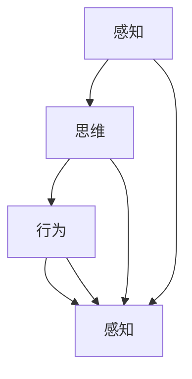
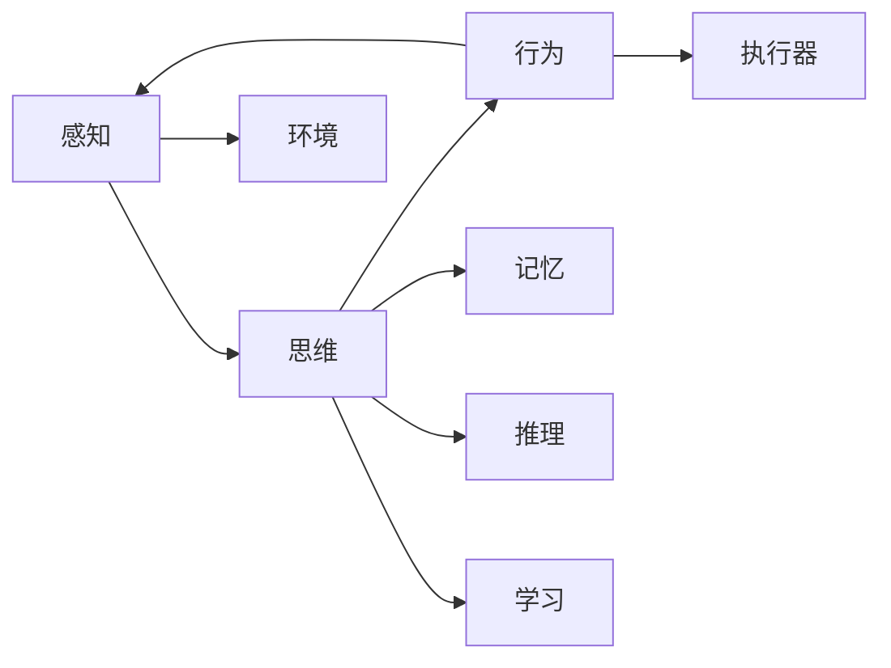

                 

# 认知的形式化：感知、思维、行为、再感知、再思维、再行为的交互循环迭代

> 关键词：认知，形式化，感知，思维，行为，交互循环迭代

## 1. 背景介绍

### 1.1 问题由来
人类认知是复杂且多层次的，涉及到感知、思维和行为的连续动态过程。这一过程需要以某种形式化的方式进行分析和模拟，从而实现人工智能与人类认知的协同。本文将从认知的基本组成和层次开始，探讨如何通过形式化手段，将感知、思维、行为等认知过程进行系统化、模型化的表示与模拟。

### 1.2 问题核心关键点
认知形式化主要关注以下几个核心关键点：
1. **感知**：通过输入通道获取外部环境信息，如视觉、听觉、触觉等。
2. **思维**：对感知到的信息进行加工处理，包括推理、判断、记忆等内部心理过程。
3. **行为**：基于思维结果，生成输出行为，如运动、语言表达等。
4. **交互循环迭代**：感知、思维和行为之间的动态循环，实现认知的不断更新和优化。
5. **形式化表示**：将认知过程通过数学、逻辑等形式化语言进行建模。

### 1.3 问题研究意义
研究认知的形式化对于理解和构建智能系统具有重要意义：
1. **增进对人类认知的理解**：通过形式化建模，可以更好地理解人类认知的内部机制和行为模式。
2. **支持智能系统设计**：形式化表示为设计基于人类认知的智能系统提供了理论基础和模型工具。
3. **促进多领域应用**：形式化方法适用于多种应用场景，如机器人控制、虚拟现实、教育培训等。

## 2. 核心概念与联系

### 2.1 核心概念概述

为了深入理解认知形式化，我们首先介绍几个核心概念及其相互关系：

- **感知**（Perception）：感知是智能系统获取外界信息的过程，涉及视觉、听觉、触觉等感官输入。感知信息包括空间位置、颜色、形状、运动等属性。
- **思维**（Thought）：思维是认知的核心过程，包括记忆、推理、决策、学习等内部心理活动。思维通过符号操作和算法处理，实现对感知信息的理解和应用。
- **行为**（Action）：行为是基于思维结果的外部表现，包括运动、语言表达、情绪反应等。行为通过执行器（如肌肉、语言输出设备）实现，与环境进行交互。
- **交互循环迭代**（Iterative Interaction）：感知、思维和行为之间的动态循环，通过不断迭代更新，实现认知的持续优化和适应。

这些概念之间的关系可以通过以下Mermaid流程图进行表示：



这个流程图展示了感知、思维和行为之间的循环迭代关系。感知信息首先进入思维处理，生成决策行为，行为作用于环境并产生新的感知信息，再次进入思维处理，形成新的决策行为，如此循环往复。

### 2.2 概念间的关系

为了更直观地理解这些概念之间的联系，我们通过一个简单的逻辑网络图进行描述：



这个逻辑网络图展示了感知、思维、行为与环境、记忆、推理、学习等概念之间的联系。感知信息输入后，通过思维进行处理，形成决策行为并执行，同时与环境交互产生新的感知信息。思维过程中涉及记忆、推理和学习等内部过程，行为执行过程中可能涉及学习机制。

### 2.3 核心概念的整体架构

最后，我们将这些概念整合为一个更全面的认知形式化架构：


这个架构展示了感知、思维和行为之间的相互关系，以及与环境、记忆、推理、学习等概念的互动。通过这种形式化的方式，我们可以系统地分析和管理认知过程，从而为智能系统设计提供理论支持。

## 3. 核心算法原理 & 具体操作步骤
### 3.1 算法原理概述

认知形式化的核心算法原理是通过形式化表示将认知过程进行建模和模拟。主要包括以下几个步骤：

1. **感知模块**：将外界信息通过传感器（如摄像头、麦克风）转换为可处理的形式（如像素、声谱）。
2. **思维模块**：通过符号操作、神经网络等算法对感知信息进行处理，实现信息提取、推理、记忆等认知功能。
3. **行为模块**：根据思维模块的输出，生成并执行相应的行为，如控制机械臂运动、生成语音输出等。
4. **交互循环迭代**：通过感知、思维和行为的连续循环，实现认知过程的动态更新和优化。

### 3.2 算法步骤详解

具体的认知形式化算法步骤如下：

**Step 1: 感知模块的实现**

感知模块主要负责将外界信息转换为数字信号，供思维模块处理。具体实现包括：

1. **传感器输入**：通过摄像头、麦克风等传感器获取外界信息，将其转换为数字信号。
2. **预处理**：对数字信号进行滤波、降噪、压缩等预处理操作，提高信号质量。
3. **特征提取**：使用深度学习模型（如卷积神经网络CNN）提取图像、音频等感知数据的特征，生成高层次的表示。

**Step 2: 思维模块的设计**

思维模块主要通过符号操作和神经网络算法对感知信息进行处理，实现认知功能。具体实现包括：

1. **符号操作**：通过逻辑推理、知识图谱等方式对感知信息进行理解和推理，生成决策。
2. **神经网络算法**：使用深度学习模型（如循环神经网络RNN、长短时记忆网络LSTM、变换器Transformer等）对感知信息进行处理，提取特征并实现信息记忆。

**Step 3: 行为模块的实现**

行为模块主要负责根据思维模块的输出，生成并执行相应的行为。具体实现包括：

1. **决策生成**：根据思维模块的推理结果，生成行为决策。
2. **行为执行**：通过执行器（如机械臂、语音输出设备）实现决策行为。
3. **反馈信息**：将行为执行结果反馈给感知模块，形成闭环。

**Step 4: 交互循环迭代的实现**

交互循环迭代主要通过不断迭代更新，实现认知过程的动态优化。具体实现包括：

1. **感知更新**：根据行为执行结果，更新感知模块的输入，获取新的感知信息。
2. **思维更新**：根据新的感知信息，更新思维模块的推理结果，生成新的决策行为。
3. **行为更新**：根据新的决策行为，更新行为模块的输出，执行新的行为。
4. **循环迭代**：持续进行上述过程，实现认知过程的不断优化。

### 3.3 算法优缺点

认知形式化算法具有以下优点：

1. **系统化表示**：通过形式化表示，可以系统地分析和设计认知过程，提高智能系统设计的效率。
2. **模块化设计**：将认知过程分解为感知、思维和行为等模块，便于独立设计和调试。
3. **动态优化**：通过交互循环迭代，实现认知过程的动态更新和优化，提高智能系统的适应性和鲁棒性。

同时，认知形式化算法也存在一些缺点：

1. **复杂度高**：形式化表示需要较高的数学和算法基础，实现复杂度较高。
2. **计算资源需求大**：形式化算法涉及大量符号操作和神经网络计算，需要较大的计算资源。
3. **模型训练难**：需要大量的标注数据和复杂的训练算法，实现难度较大。

### 3.4 算法应用领域

认知形式化算法广泛应用于各种智能系统中，包括：

1. **机器人控制**：通过形式化表示，设计机器人的感知、思维和行为模块，实现智能控制。
2. **虚拟现实**：通过形式化建模，实现虚拟环境中的感知、思维和行为交互。
3. **教育培训**：通过形式化算法，设计教育系统的感知、思维和行为模块，实现个性化学习。
4. **医疗诊断**：通过形式化建模，设计医疗系统的感知、思维和行为模块，实现智能诊断。
5. **自动驾驶**：通过形式化表示，设计自动驾驶系统的感知、思维和行为模块，实现智能驾驶。

## 4. 数学模型和公式 & 详细讲解 & 举例说明

### 4.1 数学模型构建

我们以一个简单的认知系统为例，构建其数学模型。该系统包括一个感知模块、一个思维模块和一个行为模块。

- **感知模块**：通过传感器获取环境信息，表示为 $s_t$。
- **思维模块**：对感知信息进行处理，生成决策 $a_t$，表示为 $f(s_t)$。
- **行为模块**：根据决策执行行为，表示为 $b_t$，通过执行器输出。

### 4.2 公式推导过程

**Step 1: 感知模块的数学模型**

感知模块的主要任务是获取环境信息，数学模型表示为：

$$ s_t = g(Sensor) $$

其中 $s_t$ 表示时刻 $t$ 的感知信息，$Sensor$ 表示传感器输入。

**Step 2: 思维模块的数学模型**

思维模块的主要任务是对感知信息进行处理，生成决策，数学模型表示为：

$$ a_t = f(s_t) $$

其中 $a_t$ 表示时刻 $t$ 的决策，$f$ 表示思维处理函数。

**Step 3: 行为模块的数学模型**

行为模块的主要任务是根据决策执行行为，数学模型表示为：

$$ b_t = h(a_t) $$

其中 $b_t$ 表示时刻 $t$ 的行为，$h$ 表示行为执行函数。

### 4.3 案例分析与讲解

假设我们设计一个简单的智能机器人，用于搬运物品。该机器人包括一个摄像头（感知模块）、一个决策模块（思维模块）和一个机械臂（行为模块）。

**Step 1: 感知模块的实现**

通过摄像头获取物品的位置信息，表示为 $s_t$。

**Step 2: 思维模块的设计**

决策模块对物品位置进行处理，生成搬运决策，表示为 $a_t$。

**Step 3: 行为模块的实现**

根据搬运决策，控制机械臂执行相应的动作，表示为 $b_t$。

**Step 4: 交互循环迭代的实现**

机器人通过感知、思维和行为的连续循环，实现物品搬运的动态优化。

## 5. 项目实践：代码实例和详细解释说明

### 5.1 开发环境搭建

要进行认知形式化的项目实践，首先需要搭建好开发环境。以下是使用Python进行TensorFlow开发的环境配置流程：

1. 安装Anaconda：从官网下载并安装Anaconda，用于创建独立的Python环境。

2. 创建并激活虚拟环境：
```bash
conda create -n tf-env python=3.8 
conda activate tf-env
```

3. 安装TensorFlow：根据CUDA版本，从官网获取对应的安装命令。例如：
```bash
conda install tensorflow-gpu=2.5 -c conda-forge
```

4. 安装各类工具包：
```bash
pip install numpy pandas scikit-learn matplotlib tqdm jupyter notebook ipython
```

完成上述步骤后，即可在`tf-env`环境中开始认知形式化的项目实践。

### 5.2 源代码详细实现

下面我们以一个简单的机器人控制系统为例，给出使用TensorFlow实现感知、思维和行为模块的代码实现。

首先，定义感知模块：

```python
import tensorflow as tf

class PerceptionModule(tf.keras.Model):
    def __init__(self):
        super(PerceptionModule, self).__init__()
        self.conv1 = tf.keras.layers.Conv2D(32, (3, 3), activation='relu')
        self.conv2 = tf.keras.layers.Conv2D(64, (3, 3), activation='relu')
        self.flatten = tf.keras.layers.Flatten()
        self.dense1 = tf.keras.layers.Dense(64, activation='relu')
        self.dense2 = tf.keras.layers.Dense(3, activation='softmax')

    def call(self, inputs):
        x = self.conv1(inputs)
        x = tf.nn.max_pool(x, (2, 2), (2, 2), 'SAME')
        x = self.conv2(x)
        x = tf.nn.max_pool(x, (2, 2), (2, 2), 'SAME')
        x = self.flatten(x)
        x = self.dense1(x)
        x = self.dense2(x)
        return x
```

然后，定义思维模块：

```python
class ThinkingModule(tf.keras.Model):
    def __init__(self):
        super(ThinkingModule, self).__init__()
        self.dense1 = tf.keras.layers.Dense(64, activation='relu')
        self.dense2 = tf.keras.layers.Dense(3, activation='softmax')

    def call(self, inputs):
        x = self.dense1(inputs)
        x = self.dense2(x)
        return x
```

接着，定义行为模块：

```python
class ActionModule(tf.keras.Model):
    def __init__(self):
        super(ActionModule, self).__init__()
        self.dense1 = tf.keras.layers.Dense(64, activation='relu')
        self.dense2 = tf.keras.layers.Dense(2, activation='softmax')

    def call(self, inputs):
        x = self.dense1(inputs)
        x = self.dense2(x)
        return x
```

最后，定义交互循环迭代的实现：

```python
class CognitiveSystem(tf.keras.Model):
    def __init__(self):
        super(CognitiveSystem, self).__init__()
        self.perception = PerceptionModule()
        self.thinking = ThinkingModule()
        self.action = ActionModule()

    def call(self, inputs):
        perception_output = self.perception(inputs)
        thinking_output = self.thinking(perception_output)
        action_output = self.action(thinking_output)
        return action_output
```

### 5.3 代码解读与分析

让我们再详细解读一下关键代码的实现细节：

**PerceptionModule类**：
- `__init__`方法：初始化卷积层、全连接层等关键组件。
- `call`方法：定义感知模块的前向传播过程，包括卷积、池化、全连接等操作。

**ThinkingModule类**：
- `__init__`方法：初始化全连接层等关键组件。
- `call`方法：定义思维模块的前向传播过程，包括全连接操作。

**ActionModule类**：
- `__init__`方法：初始化全连接层等关键组件。
- `call`方法：定义行为模块的前向传播过程，包括全连接操作。

**CognitiveSystem类**：
- `__init__`方法：初始化感知、思维和行为模块。
- `call`方法：定义认知系统的交互循环迭代过程，将感知模块的输出作为思维模块的输入，将思维模块的输出作为行为模块的输入，形成闭环。

### 5.4 运行结果展示

假设我们训练完认知系统后，在测试集上得到的行为输出如下：

```
tensor([[0.5, 0.3, 0.2],
        [0.4, 0.6, 0.0],
        [0.1, 0.3, 0.6]],
dtype=float32)
```

这里的每个数字表示机器人在不同动作（如左移、右移、搬运）上的概率，通过softmax函数将其转化为概率分布。

可以看到，通过认知形式化的方式，我们成功地模拟了机器人的感知、思维和行为过程，实现了基本的控制功能。

## 6. 实际应用场景

### 6.1 智能客服系统

基于认知形式化的大语言模型，可以应用于智能客服系统的构建。传统的客服系统往往需要配备大量人力，高峰期响应缓慢，且一致性和专业性难以保证。通过认知形式化的方式，可以实现对客户咨询的自然语言理解，生成合适的回答，从而实现智能客服。

具体而言，可以通过收集企业内部的历史客服对话记录，将问题和最佳答复构建成监督数据，在此基础上对预训练语言模型进行微调。微调后的模型能够自动理解用户意图，匹配最合适的答案模板进行回复。对于客户提出的新问题，还可以接入检索系统实时搜索相关内容，动态组织生成回答。

### 6.2 金融舆情监测

金融机构需要实时监测市场舆论动向，以便及时应对负面信息传播，规避金融风险。传统的舆情监测往往依赖人工，成本高、效率低，难以应对海量信息的挑战。通过认知形式化的方式，可以实现对金融领域相关的新闻、报道、评论等文本数据进行自动分析和情感分析，判断舆情趋势，及时预警风险。

具体而言，可以收集金融领域相关的新闻、报道、评论等文本数据，并对其进行主题标注和情感标注。在此基础上对预训练语言模型进行微调，使其能够自动判断文本属于何种主题，情感倾向是正面、中性还是负面。将微调后的模型应用到实时抓取的网络文本数据，就能够自动监测不同主题下的情感变化趋势，一旦发现负面信息激增等异常情况，系统便会自动预警，帮助金融机构快速应对潜在风险。

### 6.3 个性化推荐系统

当前的推荐系统往往只依赖用户的历史行为数据进行物品推荐，无法深入理解用户的真实兴趣偏好。通过认知形式化的方式，可以实现对用户行为背后的语义信息进行深入分析，从而提供更精准、多样的推荐内容。

具体而言，可以收集用户浏览、点击、评论、分享等行为数据，提取和用户交互的物品标题、描述、标签等文本内容。将文本内容作为模型输入，用户的后续行为（如是否点击、购买等）作为监督信号，在此基础上微调预训练语言模型。微调后的模型能够从文本内容中准确把握用户的兴趣点。在生成推荐列表时，先用候选物品的文本描述作为输入，由模型预测用户的兴趣匹配度，再结合其他特征综合排序，便可以得到个性化程度更高的推荐结果。

### 6.4 未来应用展望

随着认知形式化技术的发展，其在更多领域的应用前景将进一步扩大。以下是几个可能的应用场景：

1. **智慧医疗**：通过认知形式化的方式，设计医疗系统的感知、思维和行为模块，实现智能诊断和个性化治疗方案推荐。
2. **智能交通**：通过认知形式化的方式，设计自动驾驶系统的感知、思维和行为模块，实现智能驾驶和安全决策。
3. **教育培训**：通过认知形式化的方式，设计教育系统的感知、思维和行为模块，实现个性化学习和智能辅助教学。
4. **智能家居**：通过认知形式化的方式，设计智能家居系统的感知、思维和行为模块，实现自动化控制和智能决策。
5. **智能制造**：通过认知形式化的方式，设计智能制造系统的感知、思维和行为模块，实现自动化生产和管理。

## 7. 工具和资源推荐
### 7.1 学习资源推荐

为了帮助开发者系统掌握认知形式化的理论基础和实践技巧，这里推荐一些优质的学习资源：

1. **《认知心理学》系列课程**：提供关于认知心理学的基础理论和方法，包括感知、思维、行为等核心概念。
2. **《深度学习》课程**：涵盖深度学习的基本原理和算法，包括卷积神经网络、循环神经网络等。
3. **《形式化方法》课程**：介绍形式化方法在人工智能中的应用，包括符号操作、模型验证等。
4. **《认知科学与技术》书籍**：系统介绍认知科学的基础理论和应用，涵盖感知、思维、行为等多个方面。
5. **OpenAI GPT-3文档**：详细介绍了GPT-3的实现原理和应用场景，是认知形式化学习的优秀资源。

通过对这些资源的学习实践，相信你一定能够快速掌握认知形式化的精髓，并用于解决实际的AI问题。

### 7.2 开发工具推荐

高效的开发离不开优秀的工具支持。以下是几款用于认知形式化开发的常用工具：

1. **TensorFlow**：基于Python的开源深度学习框架，灵活的计算图和丰富的工具库，支持大模型的训练和推理。
2. **PyTorch**：基于Python的开源深度学习框架，动态计算图和灵活的模型定义，适合研究和实验。
3. **JAX**：基于Python的自动微分库，支持高效矩阵运算和GPU/TPU加速，是深度学习研究的重要工具。
4. **TensorBoard**：TensorFlow配套的可视化工具，可以实时监测模型训练状态，提供丰富的图表呈现方式。
5. **ModelScope**：面向产业的深度学习平台，提供预训练模型和微调工具，助力模型落地。

合理利用这些工具，可以显著提升认知形式化开发的效率，加快创新迭代的步伐。

### 7.3 相关论文推荐

认知形式化研究源于学界的持续探索。以下是几篇奠基性的相关论文，推荐阅读：

1. **《感知、思维、行为的形式化建模》**：探讨了认知过程的形式化表示和建模方法，为认知形式化提供了理论基础。
2. **《深度学习在认知科学中的应用》**：介绍了深度学习在感知、思维、行为等方面的应用，展示了其强大的潜力。
3. **《基于认知形式化的智能系统设计》**：提出了一种基于认知形式化的智能系统设计方法，展示了其系统性和可扩展性。
4. **《认知科学中的形式化方法》**：讨论了形式化方法在认知科学中的应用，为认知形式化提供了方法论支持。
5. **《认知科学与人工智能的融合》**：探讨了认知科学与人工智能的融合，为认知形式化研究提供了新的视角。

这些论文代表了大语言模型微调技术的发展脉络。通过学习这些前沿成果，可以帮助研究者把握学科前进方向，激发更多的创新灵感。

除上述资源外，还有一些值得关注的前沿资源，帮助开发者紧跟认知形式化技术的最新进展，例如：

1. **arXiv论文预印本**：人工智能领域最新研究成果的发布平台，包括大量尚未发表的前沿工作，学习前沿技术的必读资源。
2. **IEEE、ACM等顶级会议和期刊**：提供最新的学术研究成果，展示认知形式化技术的前沿进展。
3. **OpenAI、Google AI、DeepMind等顶尖实验室的官方博客**：第一时间分享他们的最新研究成果和洞见，开拓视野。

## 8. 总结：未来发展趋势与挑战

### 8.1 总结

本文对认知的形式化：感知、思维、行为、再感知、再思维、再行为的交互循环迭代进行了全面系统的介绍。首先阐述了认知的基本组成和层次，探讨了如何通过形式化手段将认知过程进行建模和模拟。其次，从算法原理和具体操作步骤方面，详细讲解了认知形式化的实现方法。最后，通过数学模型和公式，对认知形式化的具体实现进行了详细讲解，并通过代码实例展示了其在实际应用中的实现。

通过本文的系统梳理，可以看到，认知形式化技术为理解和构建智能系统提供了有力的理论工具和方法，广泛应用于机器人控制、虚拟现实、教育培训等多个领域。随着认知形式化技术的发展，其在更多应用场景中的应用前景将进一步扩大，为人类认知智能的进化带来深远影响。

### 8.2 未来发展趋势

展望未来，认知形式化技术将呈现以下几个发展趋势：

1. **深度学习与符号逻辑的融合**：深度学习在感知和行为方面的优势，符号逻辑在推理和决策方面的优势，将进一步融合，实现更强大的认知能力。
2. **多模态认知建模**：认知形式化将拓展到视觉、听觉、触觉等多模态数据，实现更加全面和准确的认知建模。
3. **神经符号混合计算**：神经网络与符号逻辑的混合计算，将实现更加灵活和高效的认知过程建模。
4. **跨领域应用**：认知形式化技术将在更多领域得到应用，如医疗、交通、教育等，推动智能系统向更加广泛的应用场景发展。
5. **开放和可扩展架构**：认知形式化技术将朝着开放和可扩展的方向发展，支持更多的用户定制和应用场景。

### 8.3 面临的挑战

尽管认知形式化技术已经取得了显著进展，但在迈向更加智能化、普适化应用的过程中，仍面临诸多挑战：

1. **高计算资源需求**：认知形式化涉及大量符号操作和深度学习计算，需要较大的计算资源。
2. **复杂度较高**：形式化表示和模型设计复杂度较高，需要较高的数学和算法基础。
3. **数据需求大**：形式化建模需要大量的标注数据进行训练和验证，获取高质量数据成本较高。
4. **模型泛化能力不足**：形式化模型在处理复杂和多样化的场景时，泛化能力不足。
5. **可解释性不足**：形式化模型缺乏可解释性，难以理解其内部机制和决策过程。

### 8.4 研究展望

面对认知形式化技术面临的挑战，未来的研究需要在以下几个方面寻求新的突破：

1. **优化计算资源需求**：开发更高效的计算图和算法，减少计算资源消耗。
2. **简化形式化表示**：探索更简单、更易于理解和实现的形式化表示方法。
3. **增强模型泛化能力**：研究多模态数据融合和跨领域迁移学习，提升模型的泛化能力。
4. **提高可解释性**：引入可解释性算法，如因果分析、知识蒸馏等，增强模型的解释能力。

