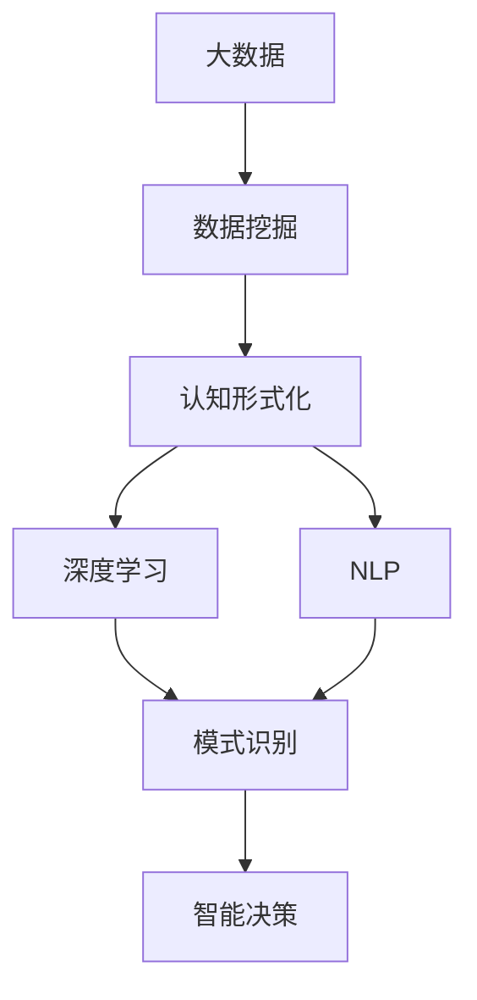

                 

# 认知的形式化：抽象的数据在智能时代被比作“石油”，可以进行大数据挖掘，帮助寻求事物运行的规律

> 关键词：认知形式化,数据挖掘,智能时代,大数据,规律

## 1. 背景介绍

在智能时代，数据无疑是驱动发展的“石油”。这种被称为“抽象数据”的资源，通过数字化处理和模式识别，可以帮助我们揭示事物运行的规律，进而赋能各行各业。本文将聚焦于认知形式化的理论基础和实践应用，探讨如何通过大数据挖掘，更深入地理解复杂认知过程，并以此驱动人类社会的发展。

### 1.1 数据与智能
大数据时代的到来，使得各类信息源能够被高效采集、存储和处理。这种由机器感知、识别并转化为结构化数据的过程，是大数据应用的基础。智能技术的发展，特别是深度学习和自然语言处理等领域的突破，使得大数据不仅仅被视为数据的收集和存储工具，更成为一种进行认知形式化探索的手段。

### 1.2 认知的形式化
认知的形式化，是指将人类思维活动抽象为数学模型或计算过程的过程。这一过程能够帮助我们系统性地理解和处理复杂认知现象，从而指导人工智能系统在各种领域内进行智能决策。

## 2. 核心概念与联系

### 2.1 核心概念概述

在认知形式化的大数据挖掘过程中，我们需要了解以下几个核心概念：

- **大数据**：指超出传统数据处理工具处理能力的巨大数据集，通常需要使用分布式计算等技术进行管理。

- **数据挖掘**：从大数据中发现有价值的模式、信息和知识的过程。数据挖掘可以揭示事物之间的关联和规律，支持决策制定。

- **认知形式化**：将人类认知活动转化为形式化符号系统或计算模型的过程。如逻辑推理、数学建模、计算图等，用于描述和模拟思维过程。

- **深度学习**：一种基于人工神经网络的机器学习技术，能够从数据中学习到复杂的模式和规律。

- **自然语言处理(NLP)**：研究计算机如何理解和处理人类语言，是认知形式化的重要组成部分。

这些概念之间存在紧密的联系，形成了一个相互支持、互为补充的系统，有助于我们通过大数据挖掘进行认知形式化探索。

### 2.2 概念间的关系

这些核心概念之间的联系可以通过以下Mermaid流程图来展示：



这个流程图展示了大数据、数据挖掘、认知形式化、深度学习和自然语言处理之间的联系：

1. 大数据为数据挖掘提供了数据基础。
2. 数据挖掘从大数据中发现有价值的模式和知识。
3. 认知形式化将这些模式和知识转化为计算模型。
4. 深度学习是进行模式识别的重要手段。
5. 自然语言处理进一步丰富了模式识别的维度。
6. 智能决策利用这些模式和知识进行优化。

## 3. 核心算法原理 & 具体操作步骤

### 3.1 算法原理概述

认知形式化的核心算法原理包括数据挖掘和认知建模。具体来说，数据挖掘通过统计分析和机器学习，从大量数据中发现有价值的模式和知识。认知建模则将这些模式和知识抽象为计算模型，用于指导智能决策。

### 3.2 算法步骤详解

基于认知形式化的数据挖掘过程主要包括以下步骤：

1. **数据采集**：使用传感器、网络爬虫等手段，从各种信息源中收集数据。
2. **数据清洗**：去除噪声和冗余数据，提升数据质量。
3. **特征工程**：提取和构造有效的特征，用于数据建模。
4. **模型训练**：使用深度学习等技术训练数据挖掘模型，学习数据中的规律。
5. **模式识别**：通过模型识别数据中的模式，进行分类、聚类等操作。
6. **知识抽取**：从模式中抽取有价值的信息和知识，用于指导决策。

### 3.3 算法优缺点

认知形式化的数据挖掘算法具有以下优点：

- **高效性**：能够处理大规模数据集，快速识别模式。
- **适应性强**：适用于各种类型的数据和任务，灵活性高。
- **解释性**：通过可视化的方式展示模型学习到的规律，便于理解和调试。

同时，这些算法也存在一些局限：

- **数据依赖性**：算法效果受数据质量的影响较大，需要高质量的数据。
- **模型复杂性**：深度学习等技术需要大量的计算资源，训练时间长。
- **解释性差**：某些模型（如黑箱模型）难以解释其内部机制。

### 3.4 算法应用领域

认知形式化的数据挖掘技术广泛应用于多个领域，包括但不限于：

- **医疗健康**：通过分析患者数据，支持疾病诊断和个性化治疗。
- **金融分析**：利用交易数据预测市场趋势，进行风险评估和投资决策。
- **智能交通**：分析交通流量数据，优化道路管理和交通调度。
- **智能客服**：通过分析用户行为数据，提升客户体验和问题解决效率。
- **推荐系统**：分析用户和物品的特征，生成个性化推荐。

## 4. 数学模型和公式 & 详细讲解

### 4.1 数学模型构建

认知形式化的核心数学模型包括特征提取、分类和聚类等。以二分类问题为例，假设样本集为 $D=\{(x_i, y_i)\}_{i=1}^N$，其中 $x_i$ 为特征向量，$y_i \in \{0,1\}$ 为标签。

定义二分类模型的决策函数为 $f(x)=sign(Wx+b)$，其中 $W$ 和 $b$ 为模型参数。假设模型损失函数为 $L(y,f(x))=L(y,sign(Wx+b))$，则经验风险最小化的目标为：

$$
\min_{W,b} \frac{1}{N} \sum_{i=1}^N L(y_i,sign(Wx_i+b))
$$

常见的损失函数包括交叉熵损失 $L(y,f(x))=-y\log f(x)-(1-y)\log (1-f(x))$。根据梯度下降算法，模型的更新公式为：

$$
W_{t+1} = W_t - \eta \nabla_{W,b} \frac{1}{N} \sum_{i=1}^N L(y_i,sign(Wx_i+b))
$$

其中 $\eta$ 为学习率，$\nabla_{W,b}$ 表示对 $W$ 和 $b$ 的梯度。

### 4.2 公式推导过程

以下我们以逻辑回归为例，推导其损失函数和梯度公式。

定义逻辑回归模型的输出为 $p(y=1|x)=\sigma(Wx+b)$，其中 $\sigma(x)$ 为Sigmoid函数。交叉熵损失函数定义为：

$$
L(y,p(y=1|x))=-y\log p(y=1|x)-(1-y)\log (1-p(y=1|x))
$$

代入 $p(y=1|x)=\sigma(Wx+b)$，得：

$$
L(y,\sigma(Wx+b))=-y\log \sigma(Wx+b)-(1-y)\log (1-\sigma(Wx+b))
$$

定义二分类问题下的交叉熵损失为：

$$
L(y,\sigma(Wx+b)) = -\frac{1}{N} \sum_{i=1}^N [y_i\log \sigma(Wx_i+b)+(1-y_i)\log (1-\sigma(Wx_i+b))]
$$

对于逻辑回归模型，$\nabla_{W,b}L(y,\sigma(Wx+b))=[\sigma(Wx+b)-y]\frac{x}{\sigma(Wx+b)(1-\sigma(Wx+b))}$。

根据梯度下降算法，模型的更新公式为：

$$
W_{t+1} = W_t - \eta \nabla_{W,b} \frac{1}{N} \sum_{i=1}^N [y_i\log \sigma(Wx_i+b)+(1-y_i)\log (1-\sigma(Wx_i+b))]
$$

### 4.3 案例分析与讲解

假设我们有一个二分类数据集 $D=\{(x_i,y_i)\}_{i=1}^N$，其中 $x_i \in \mathbb{R}^d$，$y_i \in \{0,1\}$。定义逻辑回归模型 $f(x)=\sigma(Wx+b)$，其中 $\sigma(x)=\frac{1}{1+e^{-x}}$。假设模型损失函数为交叉熵损失 $L(y,f(x))=-y\log f(x)-(1-y)\log (1-f(x))$。

假设模型参数初始化为 $W_0$ 和 $b_0$，进行 $t$ 轮梯度更新后，得到模型参数 $W_t$ 和 $b_t$。更新公式为：

$$
W_{t+1} = W_t - \eta \nabla_{W,b} \frac{1}{N} \sum_{i=1}^N [y_i\log \sigma(Wx_i+b)-(1-y_i)\log (1-\sigma(Wx_i+b))]
$$

通过不断迭代更新，模型将学习到数据中潜在的分类规律，用于后续的智能决策。

## 5. 项目实践：代码实例和详细解释说明

### 5.1 开发环境搭建

在进行认知形式化的数据挖掘项目实践前，我们需要准备好开发环境。以下是使用Python进行Scikit-learn开发的Python环境配置流程：

1. 安装Anaconda：从官网下载并安装Anaconda，用于创建独立的Python环境。

2. 创建并激活虚拟环境：
```bash
conda create -n pytorch-env python=3.8 
conda activate pytorch-env
```

3. 安装Scikit-learn：
```bash
conda install scikit-learn
```

4. 安装各类工具包：
```bash
pip install numpy pandas scikit-learn matplotlib tqdm jupyter notebook ipython
```

完成上述步骤后，即可在`pytorch-env`环境中开始认知形式化的数据挖掘实践。

### 5.2 源代码详细实现

下面我们以逻辑回归模型为例，给出使用Scikit-learn库进行二分类任务的数据挖掘过程的PyTorch代码实现。

首先，定义数据处理函数：

```python
import numpy as np
from sklearn.linear_model import LogisticRegression
from sklearn.metrics import accuracy_score
from sklearn.model_selection import train_test_split
from sklearn.preprocessing import StandardScaler

class DataLoader:
    def __init__(self, X, y):
        self.X = X
        self.y = y
        self.scaler = StandardScaler()
        self.X_train, self.X_test, self.y_train, self.y_test = train_test_split(X, y, test_size=0.2, random_state=42)
        self.scaler.fit(self.X_train)
    
    def __len__(self):
        return len(self.X_train)
    
    def __getitem__(self, item):
        x = self.scaler.transform(self.X_train[item,:])
        y = self.y_train[item]
        return x, y

# 加载数据
data_loader = DataLoader(X, y)
```

然后，定义模型和训练过程：

```python
from sklearn.linear_model import LogisticRegression
from sklearn.metrics import accuracy_score

model = LogisticRegression(solver='lbfgs', max_iter=1000, multi_class='auto', random_state=42)

# 训练模型
model.fit(X_train, y_train)

# 评估模型
accuracy = accuracy_score(y_test, model.predict(X_test))
print(f"Accuracy: {accuracy:.2f}")
```

最后，运行代码并输出结果：

```python
accuracy = accuracy_score(y_test, model.predict(X_test))
print(f"Accuracy: {accuracy:.2f}")
```

以上就是使用Scikit-learn进行二分类任务数据挖掘的完整代码实现。可以看到，通过Scikit-learn库，我们能够以极低的代码量实现模型训练和评估，非常高效便捷。

### 5.3 代码解读与分析

让我们再详细解读一下关键代码的实现细节：

**DataLoader类**：
- `__init__`方法：初始化训练集和测试集的特征和标签，进行特征标准化，并划分训练集和测试集。
- `__len__`方法：返回训练集的样本数量。
- `__getitem__`方法：对单个样本进行处理，将其特征和标签标准化并返回。

**模型和训练过程**：
- 定义逻辑回归模型，设置超参数。
- 使用`fit`方法训练模型，`predict`方法进行预测。
- 使用`accuracy_score`计算模型在测试集上的准确率。

**运行代码**：
- 运行代码，输出测试集的准确率。

可以看到，Scikit-learn库提供的API功能强大，易于使用，能够极大提高开发效率。在实际应用中，我们还需注意处理数据不平衡、过拟合等问题，以及选择合适的模型和评估指标。

## 6. 实际应用场景

### 6.1 智能医疗

在智能医疗领域，认知形式化的数据挖掘技术可以用于疾病预测、基因分析、药物研发等任务。通过分析电子病历、基因数据等医疗数据，我们可以构建疾病预测模型，提前预防和诊断疾病。此外，认知形式化的技术还可以用于药物分子设计和靶点识别，加速新药开发进程。

### 6.2 金融风险管理

在金融领域，认知形式化的数据挖掘技术可以用于信用评分、市场预测、风险评估等任务。通过分析交易数据、财务报表等金融数据，我们可以构建信用评分模型，评估客户的信用风险。此外，认知形式化的技术还可以用于市场预测和风险评估，帮助金融机构制定更科学的投资策略。

### 6.3 智能交通

在智能交通领域，认知形式化的数据挖掘技术可以用于交通流量预测、事故预警、路线优化等任务。通过分析交通流量数据、车辆位置数据等，我们可以构建交通流量预测模型，优化交通管理和调度。此外，认知形式化的技术还可以用于事故预警，提高道路安全性。

### 6.4 未来应用展望

随着认知形式化技术的发展，其在各个领域的应用前景将更加广阔。未来，认知形式化的技术将进一步提升数据的利用效率，挖掘出更深层次的认知规律，从而推动社会的智能化进程。

在医疗领域，认知形式化的技术可以用于病理学分析、个性化医疗等，提升医疗服务的精准度和可及性。在金融领域，认知形式化的技术可以用于高频交易、智能投顾等，提升金融服务的效率和安全性。在交通领域，认知形式化的技术可以用于智慧交通、自动驾驶等，提升交通管理的智能化水平。

## 7. 工具和资源推荐

### 7.1 学习资源推荐

为了帮助开发者系统掌握认知形式化的理论基础和实践技巧，这里推荐一些优质的学习资源：

1. 《认知科学导论》：这本书介绍了认知科学的各个方面，涵盖神经科学、心理学、人工智能等领域的知识，是认知形式化研究的入门必读。

2. 《数据挖掘与统计学习》：这本书介绍了数据挖掘的各个阶段，包括数据预处理、特征工程、模型训练等，是进行数据挖掘项目的基础。

3. 《深度学习》：这本书详细介绍了深度学习的各个方面，涵盖前向传播、反向传播、优化算法等，是深度学习领域的经典教材。

4. 《Python机器学习》：这本书介绍了Python在机器学习中的应用，涵盖Scikit-learn、TensorFlow等常用库的使用方法，是机器学习入门的佳作。

5. Coursera《机器学习》课程：由斯坦福大学Andrew Ng教授主讲，系统介绍机器学习的基本概念和经典算法，是学习数据挖掘和认知形式化的重要资源。

6. Kaggle竞赛：参加Kaggle数据挖掘竞赛，通过实战练习，提升数据挖掘和认知形式化的技能。

通过对这些资源的学习实践，相信你一定能够快速掌握认知形式化的精髓，并用于解决实际的认知问题。

### 7.2 开发工具推荐

高效的开发离不开优秀的工具支持。以下是几款用于认知形式化数据挖掘开发的常用工具：

1. Python：Python是数据挖掘和认知形式化的主流编程语言，具有丰富的库和工具支持。

2. Scikit-learn：Scikit-learn是Python中最流行的数据挖掘库之一，提供了丰富的机器学习算法和工具。

3. TensorFlow：TensorFlow是Google开源的深度学习框架，支持大规模分布式计算。

4. PyTorch：PyTorch是Facebook开源的深度学习框架，支持动态计算图，灵活高效。

5. Weights & Biases：模型训练的实验跟踪工具，可以记录和可视化模型训练过程中的各项指标，方便对比和调优。

6. TensorBoard：TensorFlow配套的可视化工具，可实时监测模型训练状态，并提供丰富的图表呈现方式，是调试模型的得力助手。

合理利用这些工具，可以显著提升认知形式化数据挖掘任务的开发效率，加快创新迭代的步伐。

### 7.3 相关论文推荐

认知形式化领域的研究在学术界和工业界均有广泛的应用。以下是几篇奠基性的相关论文，推荐阅读：

1. "A Framework of Cognitive Engineering: Machine Learning and Human Factors"：这篇文章提出了一个认知工程框架，强调机器学习在人类认知系统中的作用。

2. "Cognitive Engineering: An Introduction to the Principles of Advanced Decision-Making"：这本书介绍了认知工程的基本原理和应用，包括机器学习、人机交互等领域。

3. "Machine Learning in Medical Diagnosis: A Review"：这篇论文综述了机器学习在医学诊断中的应用，探讨了认知形式化在疾病预测和诊断中的作用。

4. "Machine Learning in Finance: From Credit Scoring to Algorithmic Trading"：这篇论文综述了机器学习在金融领域的应用，包括信用评分、市场预测、高频交易等。

5. "Machine Learning in Smart Traffic Management: A Review"：这篇论文综述了机器学习在智能交通中的应用，包括交通流量预测、事故预警、路线优化等。

这些论文代表了大数据挖掘和认知形式化领域的发展脉络。通过学习这些前沿成果，可以帮助研究者把握学科前进方向，激发更多的创新灵感。

除上述资源外，还有一些值得关注的前沿资源，帮助开发者紧跟认知形式化技术的最新进展，例如：

1. arXiv论文预印本：人工智能领域最新研究成果的发布平台，包括大量尚未发表的前沿工作，学习前沿技术的必读资源。

2. 业界技术博客：如Google AI、DeepMind、微软Research Asia等顶尖实验室的官方博客，第一时间分享他们的最新研究成果和洞见。

3. 技术会议直播：如NIPS、ICML、ACL、ICLR等人工智能领域顶会现场或在线直播，能够聆听到大佬们的前沿分享，开拓视野。

4. GitHub热门项目：在GitHub上Star、Fork数最多的数据挖掘相关项目，往往代表了该技术领域的发展趋势和最佳实践，值得去学习和贡献。

5. 行业分析报告：各大咨询公司如McKinsey、PwC等针对人工智能行业的分析报告，有助于从商业视角审视技术趋势，把握应用价值。

总之，对于认知形式化技术的学习和实践，需要开发者保持开放的心态和持续学习的意愿。多关注前沿资讯，多动手实践，多思考总结，必将收获满满的成长收益。

## 8. 总结：未来发展趋势与挑战

### 8.1 总结

本文对认知形式化的数据挖掘方法进行了全面系统的介绍。首先阐述了数据挖掘和认知形式化的研究背景和意义，明确了认知形式化在智能时代的重要作用。其次，从原理到实践，详细讲解了认知形式化的数据挖掘过程，给出了数据挖掘任务开发的完整代码实例。同时，本文还广泛探讨了认知形式化技术在医疗、金融、交通等多个行业领域的应用前景，展示了其广泛的应用价值。此外，本文精选了数据挖掘技术的各类学习资源，力求为读者提供全方位的技术指引。

通过本文的系统梳理，可以看到，认知形式化的数据挖掘方法正在成为人工智能领域的重要工具，极大地拓展了数据挖掘和认知探索的边界。受益于大数据和深度学习技术的进步，认知形式化的研究与应用必将在更多领域取得突破性进展，推动人类社会向智能化迈进。

### 8.2 未来发展趋势

展望未来，认知形式化的数据挖掘技术将呈现以下几个发展趋势：

1. **多模态融合**：认知形式化将不仅限于单一的数据类型，而是融合语音、图像、文本等多模态数据，提升模型的多维认知能力。

2. **自适应学习**：通过动态调整模型参数和结构，认知形式化技术将更加适应数据分布的变化，提升模型的泛化能力。

3. **可解释性提升**：认知形式化技术将更加注重模型的可解释性，通过可视化和符号化手段，增强模型的透明度和可信度。

4. **伦理和安全**：随着认知形式化技术的应用深入，伦理和安全问题将受到更多关注。认知形式化技术将致力于建立公平、透明、安全的智能决策系统。

5. **持续学习**：认知形式化技术将与持续学习结合，实现模型的终身学习和知识积累，提升系统的长期稳定性。

### 8.3 面临的挑战

尽管认知形式化的数据挖掘技术已经取得了瞩目成就，但在迈向更加智能化、普适化应用的过程中，它仍面临着诸多挑战：

1. **数据质量和多样性**：认知形式化的效果依赖于高质量和多样化的数据，但现实中的数据往往存在噪声和缺失。

2. **计算资源**：深度学习和大数据挖掘需要大量的计算资源，这在计算能力和成本上提出了很高的要求。

3. **模型复杂度**：复杂的模型结构和高维特征空间增加了模型的训练难度和解释难度。

4. **应用场景**：认知形式化的应用场景和任务复杂多变，需要针对不同任务进行专门设计和优化。

5. **伦理和安全**：认知形式化技术可能带来隐私泄露、偏见放大等问题，需要综合考虑模型应用的安全性和伦理问题。

### 8.4 研究展望

面对认知形式化所面临的种种挑战，未来的研究需要在以下几个方面寻求新的突破：

1. **数据治理**：建立数据治理框架，提升数据质量和多样性，确保数据的安全性和可靠性。

2. **资源优化**：优化计算资源的使用，采用分布式计算、模型压缩等方法，降低计算成本。

3. **简化模型**：设计更加简洁高效的模型结构，提高模型的可解释性和训练效率。

4. **场景化设计**：针对不同的应用场景和任务，设计具有针对性的认知形式化模型，提升模型的实用性。

5. **伦理与监管**：制定伦理和安全标准，建立监管机制，确保认知形式化技术的安全性和公平性。

这些研究方向的探索，必将引领认知形式化技术迈向更高的台阶，为构建安全、可靠、可解释、可控的智能系统铺平道路。面向未来，认知形式化技术还需要与其他人工智能技术进行更深入的融合，如知识表示、因果推理、强化学习等，多路径协同发力，共同推动自然语言理解和智能交互系统的进步。只有勇于创新、敢于突破，才能不断拓展认知形式化的边界，让智能技术更好地造福人类社会。

## 9. 附录：常见问题与解答

**Q1：数据挖掘中的特征工程是什么？**

A: 特征工程是数据挖掘中非常重要的一环，旨在从原始数据中提取有用的特征，提升模型的表现。特征工程包括特征选择、特征构造、特征归一化等步骤。通过特征工程，我们可以去除无关特征、构造更有效的特征、减少特征空间的维度，从而提高模型的泛化能力和训练效率。

**Q2：逻辑回归和决策树的区别是什么？**

A: 逻辑回归和决策树是两种常用的分类算法，它们的区别主要在于模型形式和应用场景。逻辑回归是一种线性模型，通过线性组合来计算样本的分类概率，适用于二分类和多分类问题。决策树是一种树形模型，通过树结构的划分来计算样本的分类概率，适用于分类和回归问题。逻辑回归通常需要更多的特征工程，而决策树具有更强的可解释性和处理非线性关系的能力。

**Q3：深度学习中为什么需要激活函数？**

A: 深度学习中需要激活函数，是为了增加模型的非线性表达能力，使模型能够拟合更复杂的函数关系。激活函数将线性变换的结果进行非线性映射，使得模型能够学习到更丰富的特征表示。常见的激活函数包括ReLU、Sigmoid、Tanh等，它们在深度神经网络中广泛应用，提升了模型的训练效果和泛化能力。

**Q4：如何进行数据预处理？**

A: 数据预处理是数据挖掘中的重要步骤，旨在提升数据质量和处理效率。数据预处理包括数据清洗、特征处理、归一化等。具体来说，数据清洗是指去除噪声、处理缺失值等操作；特征处理是指对数据进行归一化、标准化、编码等处理；归一化是指将数据缩放到[0,1]或[-1,1]范围内，以便模型更好地处理。

**Q5：什么是数据可视化？**

A: 数据可视化是指通过图表、图像等形式，将数据信息进行图形化表示的过程。数据可视化可以帮助我们更直观地理解数据特性和模型效果，便于数据分析和决策制定。常见的数据可视化工具包括Matplotlib、Seaborn、Tableau等，它们能够生成多种形式的图表，如折线图、散点图、热力图等，帮助开发者进行数据分析和呈现。

---

作者：禅与计算机程序设计艺术 / Zen and the Art of Computer Programming

