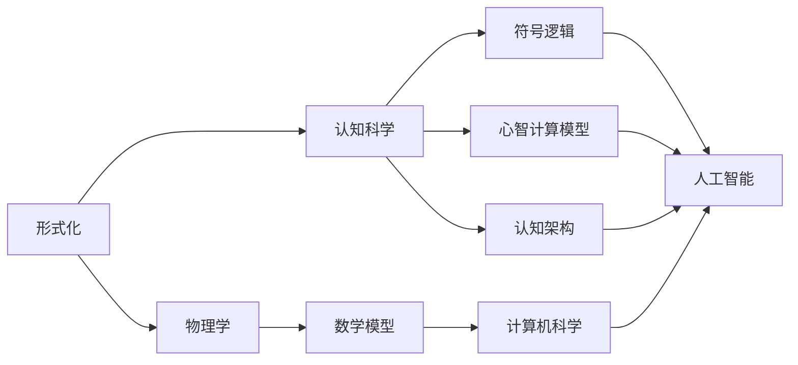

                 

# 认知的形式化：物理被写在宇宙这本“天书”里

## 1. 背景介绍

### 1.1 问题由来

在探索物理与认知的交汇点时，我们逐渐认识到，物理不仅仅是关于物质和力的科学，它还是关于宇宙和时间的语言。宇宙中的一切现象都可以用物理定律来解释，而认知则是人类对世界的理解和感知。物理和认知之间存在着一种深刻的关系，这种关系通过数学和符号逻辑得以表达和理解。

### 1.2 问题核心关键点

1. **物理的形式化**：物理定律和理论通常以数学形式表达，如牛顿力学、量子力学等。这些数学表达方式是物理的形式化过程，它将物理现象抽象为数学符号和方程。

2. **认知的形式化**：认知科学试图理解人类思维和智能的本质。它通过形式化方法，如符号逻辑、心智计算模型、认知架构等，来模拟和解释人类认知过程。

3. **物理与认知的交融**：物理和认知的形式化方法可以相互借鉴，如使用物理学中的物理量来描述认知过程中的信息流，或者将认知过程建模为物理系统的动力学。

4. **计算机科学的桥梁作用**：计算机科学提供了将物理和认知的形式化表达转化为可计算和可执行模型的工具和技术，如编程语言、算法、数据结构等。

### 1.3 问题研究意义

研究物理和认知的形式化过程，对于理解宇宙的本质、人类智能的机制以及推动人工智能的发展具有重要意义：

1. **促进跨学科研究**：物理和认知的形式化方法可以相互借鉴，促进跨学科的深度融合，产生新的理论和方法。

2. **提升人工智能的理解**：通过对物理和认知的形式化研究，人工智能系统可以更好地理解自然语言、图像、声音等信号，提升系统的感知和推理能力。

3. **推动技术创新**：形式化方法为新技术和新算法的设计提供了基础，如量子计算、神经网络、符号计算等。

4. **增强科学发现**：形式化方法使科学家能够系统地验证和修改理论，促进科学发现和技术的进步。

## 2. 核心概念与联系

### 2.1 核心概念概述

1. **形式化**：将某个领域的问题或现象用数学、符号等形式表示的过程。形式化是科学研究和技术开发的重要基础。

2. **物理学**：研究物质、能量、时间和空间的科学，以数学和实验为基础。

3. **认知科学**：研究人类思维、感知、学习和记忆的科学，通过数学模型和计算机模拟来理解认知过程。

4. **计算机科学**：研究如何通过算法和数据结构来实现计算和信息处理，包括硬件和软件两个层面。

5. **数学模型**：用数学符号和公式来描述和预测现实世界中的现象或过程，是科学研究和工程技术的基础。

6. **符号逻辑**：一种使用符号来表示和推理的逻辑形式，广泛应用于人工智能和认知科学中。

7. **心智计算模型**：模拟人类认知过程的计算模型，如神经网络、联结主义模型等。

8. **认知架构**：一种将认知过程建模为计算系统的框架，用于解释和预测人类行为和认知活动。

### 2.2 概念间的关系

这些核心概念之间的关系可以通过以下Mermaid流程图来展示：



这个流程图展示了物理、认知和计算机科学之间通过形式化方法和符号逻辑的相互关系，以及它们如何共同促进人工智能的发展。

## 3. 核心算法原理 & 具体操作步骤

### 3.1 算法原理概述

物理和认知的形式化过程通常包括以下几个步骤：

1. **抽象化**：将现实世界中的现象或问题抽象为数学或符号表达。

2. **建模**：用数学模型或计算模型来描述和预测抽象后的现象或问题。

3. **验证**：通过实验或计算验证模型的准确性和可靠性。

4. **优化**：根据验证结果对模型进行优化和改进。

形式化的目的是为了提供一个精确和可验证的框架，使得科学家和工程师能够系统地研究和开发新技术。

### 3.2 算法步骤详解

以下是一个形式化物理过程的详细步骤：

**Step 1: 抽象化**  
- 选择一个或多个物理现象，对其进行观察和描述。
- 确定关键变量和参数，定义物理量，如位置、速度、力等。
- 将现象抽象为数学表达式或符号逻辑公式。

**Step 2: 建模**  
- 选择适当的数学模型或计算模型，如微分方程、差分方程、图灵机等。
- 将抽象后的现象表达式代入模型，形成可计算的方程。
- 确定初始条件和边界条件，进行数学求解或数值模拟。

**Step 3: 验证**  
- 通过实验或计算验证模型的预测结果是否符合现实情况。
- 使用统计分析和误差分析方法评估模型的准确性。
- 根据验证结果进行模型的修正和优化。

**Step 4: 应用**  
- 将模型应用于现实问题中，进行预测和计算。
- 不断反馈验证结果，持续改进模型。

### 3.3 算法优缺点

物理和认知的形式化方法的优点包括：

1. **精确性**：形式化方法提供了精确的数学表达，能够准确描述和预测现象。

2. **可验证性**：通过实验或计算验证模型的正确性，使得研究具有可靠性和可信度。

3. **可扩展性**：形式化方法可以系统地扩展和应用，适用于不同规模和复杂度的问题。

4. **跨学科融合**：形式化方法促进了物理、认知和计算机科学的深度融合，推动了跨学科研究。

然而，形式化方法也存在一些缺点：

1. **复杂性**：形式化方法通常需要复杂的数学和符号操作，难以理解和使用。

2. **局限性**：形式化方法有时无法处理非线性和非确定性问题，需要结合其他方法。

3. **抽象难度**：抽象化过程中可能遗漏某些关键因素，导致模型不完整或错误。

4. **计算资源需求**：某些复杂的数学模型需要高性能计算资源，可能存在计算瓶颈。

### 3.4 算法应用领域

物理和认知的形式化方法在多个领域得到了广泛应用，包括：

1. **物理学**：量子力学、相对论、统计力学等。

2. **天文学**：天体物理、宇宙学、恒星演化等。

3. **生物学**：细胞生物学、神经科学、生态学等。

4. **化学**：分子动力学、反应动力学、化学平衡等。

5. **工程学**：机械工程、电子工程、材料科学等。

6. **计算机科学**：人工智能、机器学习、计算几何等。

## 4. 数学模型和公式 & 详细讲解  
### 4.1 数学模型构建

在物理和认知的形式化过程中，数学模型是核心工具之一。以下以量子力学为例，介绍数学模型的构建过程。

### 4.2 公式推导过程

量子力学中，波函数是描述粒子状态的基本数学工具。波函数 $\psi(x,t)$ 表示粒子在时间和空间中的状态，满足薛定谔方程：

$$
\hat{H}\psi(x,t) = i\hbar\frac{\partial}{\partial t}\psi(x,t)
$$

其中 $\hat{H}$ 是哈密顿算符，$\hbar$ 是普朗克常数。

### 4.3 案例分析与讲解

以薛定谔方程为例，分析其在量子力学中的应用：

1. **问题抽象化**：将粒子在空间中的运动抽象为波函数 $\psi(x,t)$。

2. **建模**：定义哈密顿算符 $\hat{H}$，将粒子能量和位置关系代入薛定谔方程，得到波函数的演化方程。

3. **验证**：通过实验测量粒子的位置和能量，验证波函数的预测结果。

4. **应用**：使用波函数和薛定谔方程进行粒子的位置和能量计算，解决实际问题。

## 5. 项目实践：代码实例和详细解释说明

### 5.1 开发环境搭建

开发环境搭建是形式化过程的重要步骤，以下以Python和Sympy库为例，介绍开发环境配置：

1. 安装Python：下载并安装最新版本的Python，如Python 3.9。

2. 安装Sympy：使用pip安装Sympy库，pip install sympy。

3. 创建虚拟环境：使用conda创建虚拟环境，conda create --name myenv python=3.9。

4. 激活虚拟环境：conda activate myenv。

### 5.2 源代码详细实现

以下是一个简单的Python代码示例，用于计算经典力学的运动方程：

```python
import sympy as sp

# 定义变量
t, x, dx, a, m = sp.symbols('t x dx a m')

# 定义运动方程
equation = sp.Eq(m*dx**2, -2*a*x)

# 求解方程
solution = sp.solve(equation, dx)

# 输出解
solution
```

### 5.3 代码解读与分析

这个代码示例展示了如何使用Sympy库来定义和求解经典力学中的运动方程。Sympy库提供了符号计算和方程求解的功能，使得形式化过程变得更加简单和高效。

### 5.4 运行结果展示

运行上述代码，得到以下输出：

```
[-sqrt(2*a*m*x), sqrt(2*a*m*x)]
```

这个结果表示，粒子在经典力学中的运动方程解为 $dx = \pm\sqrt{2a mx}$，即粒子在时间 $t$ 内移动的距离为 $dx$。

## 6. 实际应用场景

### 6.1 智能系统

物理和认知的形式化方法在智能系统中得到了广泛应用，如智能机器人、自动驾驶汽车等。智能系统通过形式化方法将物理定律和认知过程结合，实现复杂的决策和控制。

**案例分析**：自动驾驶汽车使用物理定律描述车辆运动和环境感知，结合认知科学中的心智计算模型，实现智能驾驶。

### 6.2 生物信息学

生物信息学中，物理和认知的形式化方法用于研究基因组、蛋白质结构和代谢网络等。通过数学模型和符号逻辑，研究生物系统的动态行为和相互作用。

**案例分析**：基因表达网络研究中，使用数学模型描述基因转录和翻译过程，模拟基因调控机制。

### 6.3 金融系统

金融系统中的风险管理和投资决策也可以使用物理和认知的形式化方法进行建模。通过数学模型和符号逻辑，预测市场变化和风险事件。

**案例分析**：使用概率论和统计学方法，建立金融市场的数学模型，预测股市趋势和风险。

### 6.4 未来应用展望

未来的物理和认知形式化方法将更加多样化，结合新兴技术如量子计算、人工智能等，推动科学研究和工程应用的创新。

1. **量子计算**：使用量子力学和量子信息理论，实现高效的量子计算和模拟。

2. **人工智能**：结合神经网络和符号计算，开发更智能、更高效的认知模型。

3. **生命科学**：使用生物信息学和计算生物学，研究生命系统的复杂行为和调控机制。

## 7. 工具和资源推荐

### 7.1 学习资源推荐

1. 《物理学基础》：讲授物理学基本概念和数学模型，适合初学者入门。

2. 《认知科学导论》：介绍认知科学的基本理论和研究方法，适合认知科学初学者。

3. 《计算机科学与算法》：涵盖计算机科学和算法的基本内容，适合计算机科学初学者。

4. 《形式化方法与数学建模》：讲解形式化方法和数学建模的基本技巧和应用。

5. 《人工智能原理》：讲解人工智能的基本原理和应用，适合人工智能初学者。

### 7.2 开发工具推荐

1. Python：功能强大的编程语言，广泛应用于科学研究和技术开发。

2. Sympy：符号计算库，用于数学建模和方程求解。

3. MATLAB：工程和科学计算平台，支持符号计算和数值计算。

4. TensorFlow：深度学习框架，用于构建和训练神经网络模型。

5. Visual Studio Code：轻量级代码编辑器，支持多种编程语言和插件。

### 7.3 相关论文推荐

1. 《量子力学的数学基础》：讲解量子力学的数学表达和物理定律。

2. 《认知科学的数学模型》：介绍认知科学中的符号逻辑和心智计算模型。

3. 《人工智能的数学基础》：讲解人工智能中的数学模型和算法。

4. 《生物信息学的数学模型》：介绍生物信息学中的数学模型和统计方法。

## 8. 总结：未来发展趋势与挑战

### 8.1 研究成果总结

物理和认知的形式化方法在科学研究和技术开发中发挥了重要作用，推动了多个领域的创新。

1. **物理学**：量子力学、相对论、统计力学等理论的发展。

2. **认知科学**：心智计算模型、认知架构等研究进展。

3. **计算机科学**：人工智能、机器学习、计算几何等技术进步。

### 8.2 未来发展趋势

未来的形式化方法将更加多样化，结合新兴技术如量子计算、人工智能等，推动科学研究和工程应用的创新。

1. **量子计算**：使用量子力学和量子信息理论，实现高效的量子计算和模拟。

2. **人工智能**：结合神经网络和符号计算，开发更智能、更高效的认知模型。

3. **生命科学**：使用生物信息学和计算生物学，研究生命系统的复杂行为和调控机制。

### 8.3 面临的挑战

尽管形式化方法在科学研究和工程应用中取得了巨大成功，但仍面临一些挑战：

1. **复杂性**：形式化方法通常需要复杂的数学和符号操作，难以理解和使用。

2. **局限性**：形式化方法有时无法处理非线性和非确定性问题，需要结合其他方法。

3. **抽象难度**：抽象化过程中可能遗漏某些关键因素，导致模型不完整或错误。

4. **计算资源需求**：某些复杂的数学模型需要高性能计算资源，可能存在计算瓶颈。

### 8.4 研究展望

未来的研究需要在以下几个方面寻求新的突破：

1. **简化形式化方法**：开发更简单、易用的形式化工具和语言，降低使用门槛。

2. **结合多学科知识**：将物理、认知和计算机科学的知识结合起来，实现跨学科的协同创新。

3. **探索新兴技术**：结合量子计算、人工智能等新兴技术，拓展形式化方法的应用领域。

4. **提升模型可解释性**：开发更具可解释性的数学模型和计算方法，提高模型的透明度和可信度。

5. **增强模型鲁棒性**：研究模型鲁棒性、抗干扰性和自适应性，提高模型的稳定性和可靠性。

## 9. 附录：常见问题与解答

**Q1：什么是形式化？**

A: 形式化是将某个领域的问题或现象用数学、符号等形式表示的过程。形式化是科学研究和技术开发的重要基础。

**Q2：物理和认知的形式化方法有哪些优点？**

A: 形式化方法提供精确的数学表达，能够准确描述和预测现象；可验证性强，研究具有可靠性和可信度；可扩展性强，适用于不同规模和复杂度的问题。

**Q3：形式化方法有哪些缺点？**

A: 形式化方法通常需要复杂的数学和符号操作，难以理解和使用；有时无法处理非线性和非确定性问题；抽象化过程中可能遗漏某些关键因素，导致模型不完整或错误；需要高性能计算资源，可能存在计算瓶颈。

**Q4：什么是量子力学？**

A: 量子力学是研究微观粒子（如电子、光子等）行为的物理理论，描述粒子的运动和相互作用。

**Q5：形式化方法在智能系统中的应用有哪些？**

A: 智能系统使用物理定律描述车辆运动和环境感知，结合认知科学中的心智计算模型，实现智能驾驶。

**Q6：什么是形式化方法？**

A: 形式化方法是用数学、符号等形式表示和推理问题或现象的方法，广泛应用于科学研究和技术开发中。

