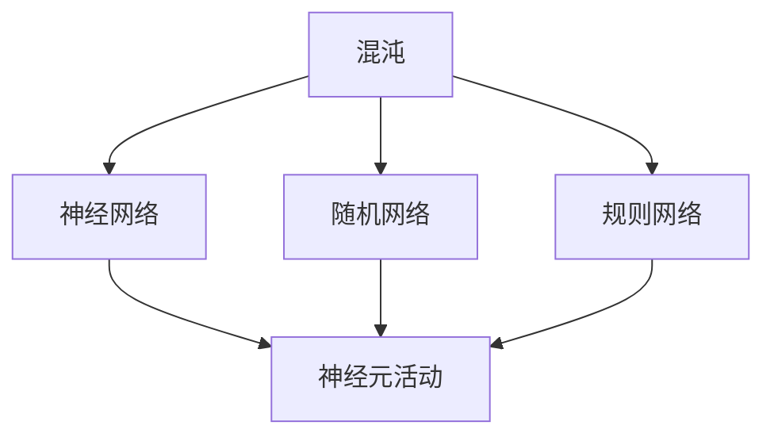

                 

# 认知过程中的混沌与简洁演变

## 1. 背景介绍

### 1.1 问题由来
认知过程是神经科学、心理学、计算机科学等多学科交叉的前沿研究领域。近年来，随着神经计算理论的不断发展，以及对大脑内部活动的深入了解，认知过程的复杂性得以被更深入地探索和理解。

这一过程的描述和建模，对于理解大脑的功能和构建智能系统具有重要意义。认知过程涉及感知、记忆、注意力、决策等多个层面，其中混沌（Chaos）与简洁（Simplicity）的演变关系，是研究认知过程复杂性的核心问题之一。

### 1.2 问题核心关键点
认知过程的混沌与简洁演变主要关注两个方面：

1. 混沌（Chaos）：指系统内在的随机性和复杂性，使得预测变得困难。在认知过程中，混沌现象可以表现为神经元之间连接的不确定性、信息处理的非线性特征等。
2. 简洁（Simplicity）：指系统内在的基本规律和简单结构，使得预测变得相对容易。在认知过程中，简洁性可以表现为大脑中信息的编码方式、神经元之间的基本连接模式等。

这两者的关系及其在认知过程中的演变，对于揭示大脑的内部机制，以及构建具有可解释性和鲁棒性的智能系统具有重要意义。

### 1.3 问题研究意义
研究认知过程中的混沌与简洁演变，有助于更好地理解大脑的工作原理，为构建更高级的认知模型提供理论基础。同时，对于开发高效、可解释的人工智能系统，也有重要的指导意义。

认知过程的混沌与简洁演变研究，将有助于揭示复杂认知任务中内在的规律，提供高效的模型设计思路，优化智能系统的性能。

## 2. 核心概念与联系

### 2.1 核心概念概述

为了更好地理解认知过程中混沌与简洁的演变，本节将介绍几个关键概念：

- **混沌**：指系统的不确定性和复杂性，其中最小的扰动可能导致巨大的变化，使得预测变得困难。
- **简洁**：指系统内在的简单结构，使得预测相对容易。简洁性有助于降低系统的复杂度，提高系统的可解释性和可预测性。
- **神经网络**：由大量神经元组成的复杂网络，用于模拟大脑的信息处理过程。
- **随机网络**：神经网络中，神经元之间的连接是随机的，这种无序性导致系统表现出混沌特性。
- **规则网络**：神经网络中，神经元之间的连接是有序的，这种结构导致系统表现出简洁特性。
- **神经元活动**：神经元通过接收输入信号，并在内部进行非线性处理，产生输出信号，这一过程是认知过程的基石。

这些概念之间的逻辑关系可以通过以下Mermaid流程图来展示：



这个流程图展示了混沌、神经网络、随机网络和规则网络，以及它们与神经元活动的关系。

### 2.2 概念间的关系

这些核心概念之间存在着紧密的联系，形成了认知过程的复杂系统。

- 混沌与神经网络：神经网络内部随机连接导致系统表现出混沌特性，使得预测变得困难。
- 简洁与神经网络：神经网络内部有序连接导致系统表现出简洁特性，使得预测相对容易。
- 随机网络与规则网络：随机网络中的无序连接导致系统表现出混沌特性，而规则网络中的有序连接导致系统表现出简洁特性。

这些概念共同构成了认知过程的复杂系统，揭示了认知过程中混沌与简洁的演变规律。

## 3. 核心算法原理 & 具体操作步骤
### 3.1 算法原理概述

认知过程中的混沌与简洁演变，本质上是一个复杂系统的动态演化过程。其核心思想是：在神经网络中，通过调整神经元之间的连接方式，可以在混沌与简洁之间进行切换，从而实现系统的动态演化。

具体而言，可以通过以下步骤实现混沌与简洁的演变：

1. **初始化神经网络**：设定神经元数量、连接方式等参数，构建初始的神经网络。
2. **随机化连接**：随机调整神经元之间的连接权重，使神经网络表现出混沌特性。
3. **简化连接**：通过学习机制，调整神经元之间的连接权重，使神经网络表现出简洁特性。
4. **动态演化**：通过迭代学习，不断调整连接权重，实现混沌与简洁的动态演化。

### 3.2 算法步骤详解

为了更好地理解算法步骤，本节将详细讲解每个步骤的实现过程。

#### 3.2.1 初始化神经网络
首先，需要设定神经网络的参数，包括神经元数量、连接方式等。可以使用不同的神经网络结构，如全连接神经网络、卷积神经网络等。以全连接神经网络为例，其参数包括输入层、隐藏层和输出层的神经元数量，以及神经元之间的连接权重。

#### 3.2.2 随机化连接
随机化连接是指在初始状态下，随机调整神经元之间的连接权重。这一过程可以使用随机矩阵或随机权重生成器来实现。例如，可以使用如下公式生成随机连接权重：

$$
w_{ij} \sim \mathcal{N}(0,\sigma^2)
$$

其中 $w_{ij}$ 表示神经元 $i$ 和 $j$ 之间的连接权重，$\mathcal{N}(0,\sigma^2)$ 表示均值为0，标准差为 $\sigma$ 的高斯分布。

#### 3.2.3 简化连接
简化连接是指通过学习机制，调整神经元之间的连接权重，使神经网络表现出简洁特性。这一过程可以使用监督学习、无监督学习或半监督学习方法来实现。以监督学习为例，可以使用反向传播算法更新连接权重，最小化预测误差。例如，可以使用如下公式更新连接权重：

$$
w_{ij} \leftarrow w_{ij} - \eta \frac{\partial L}{\partial w_{ij}}
$$

其中 $L$ 表示损失函数，$\eta$ 表示学习率。

#### 3.2.4 动态演化
动态演化是指通过迭代学习，不断调整连接权重，实现混沌与简洁的动态演化。这一过程可以使用循环神经网络（RNN）、卷积神经网络（CNN）等模型来实现。以RNN为例，可以使用如下公式更新连接权重：

$$
h_{t} = \tanh(w_h h_{t-1} + w_x x_t + b_h)
$$

$$
y_t = \sigma(w_y h_t + b_y)
$$

其中 $h_t$ 表示第 $t$ 时刻隐藏层的输出，$y_t$ 表示第 $t$ 时刻的输出，$w_h$ 和 $w_x$ 表示隐藏层和输入层的连接权重，$b_h$ 和 $b_y$ 表示偏置项。

### 3.3 算法优缺点

认知过程中混沌与简洁的演变算法，具有以下优点：

1. 通用性强：适用于多种神经网络结构，包括全连接神经网络、卷积神经网络等。
2. 可解释性好：通过调整神经元之间的连接权重，实现系统的动态演化，易于理解和解释。
3. 可预测性强：在一定程度上，可以通过调整参数，控制系统的混沌与简洁演变过程，提高系统的预测性。

同时，该算法也存在以下缺点：

1. 计算复杂度高：调整连接权重的过程需要大量的计算资源，尤其是对于大规模神经网络。
2. 收敛性不稳定：系统的混沌与简洁演变过程可能存在多个平衡状态，难以确保收敛到期望状态。
3. 参数调整复杂：需要手动调整神经元之间的连接权重，调整不当可能导致系统性能下降。

尽管存在这些局限性，但该算法对于研究认知过程中混沌与简洁的演变，具有重要的理论价值和实践意义。

### 3.4 算法应用领域

认知过程中混沌与简洁的演变算法，在多个领域具有广泛的应用前景：

1. **神经科学**：通过模拟大脑的信息处理过程，研究神经元之间的连接方式对认知过程的影响。
2. **心理学**：研究认知过程中内在的混沌与简洁特征，揭示心理活动的基本规律。
3. **机器学习**：优化神经网络的结构和参数，提高机器学习系统的性能和可解释性。
4. **人工智能**：设计更加高效、可解释的人工智能系统，推动人工智能技术的发展。

## 4. 数学模型和公式 & 详细讲解 & 举例说明

### 4.1 数学模型构建

认知过程中混沌与简洁的演变，可以通过数学模型进行定量分析和模拟。以下是一个简化的数学模型：

设神经网络中神经元数量为 $n$，神经元之间的连接权重为 $w_{ij}$，激活函数为 $f$，输入向量为 $x$，输出向量为 $y$，隐藏层向量为 $h$。神经网络的动态演化过程可以用如下递归公式描述：

$$
h_{t+1} = f\left(\sum_{i=1}^n w_{i,i} h_t + \sum_{i=1}^n w_{i,j} x_j + b_h\right)
$$

$$
y_{t+1} = f\left(\sum_{i=1}^n w_{i,i} h_t + b_y\right)
$$

其中 $f$ 表示激活函数，$b_h$ 和 $b_y$ 表示偏置项。

### 4.2 公式推导过程

以下我们将对上述递归公式进行详细推导：

- **输入层**：
  - 输入向量 $x$ 经过线性变换和激活函数 $f$，得到隐藏层向量 $h$。
  - 输出向量 $y$ 经过线性变换和激活函数 $f$，得到最终输出。

- **隐藏层**：
  - 隐藏层向量 $h$ 通过输入向量 $x$ 和前一时刻的隐藏层向量 $h_{t-1}$ 的加权和，经过激活函数 $f$，得到当前时刻的隐藏层向量 $h_t$。
  - 输出向量 $y$ 通过隐藏层向量 $h_t$ 的加权和，经过激活函数 $f$，得到当前时刻的输出向量 $y_t$。

- **激活函数**：
  - 激活函数 $f$ 可以是 Sigmoid、ReLU、Tanh 等函数，用于引入非线性特性，提高系统的表达能力。

### 4.3 案例分析与讲解

为了更好地理解公式的含义，以下我们将以一个简单的例子进行详细分析。

假设有一个由三个神经元组成的神经网络，输入向量为 $x=[0,1,2]$，连接权重为 $w=[0.1,0.2,0.3]$，激活函数为 Sigmoid，偏置项为 $b_h=0.5$，$b_y=0.8$。计算隐藏层向量和输出向量，并分析其演变过程。

- **初始时刻**：
  - 输入向量 $x=[0,1,2]$。
  - 隐藏层向量 $h_0=f(w \cdot x + b_h)=f(0.1*0+0.2*1+0.3*2+0.5)=f(3.5)$。
  - 输出向量 $y_0=f(w \cdot h_0 + b_y)=f(0.1*3.5+0.8)=f(4.3)$。

- **第 1 时刻**：
  - 隐藏层向量 $h_1=f(w \cdot h_0 + b_h)=f(0.1*4.3+0.5)=f(5.3)$。
  - 输出向量 $y_1=f(w \cdot h_1 + b_y)=f(0.1*5.3+0.8)=f(6.4)$。

- **第 2 时刻**：
  - 隐藏层向量 $h_2=f(w \cdot h_1 + b_h)=f(0.1*6.4+0.5)=f(7.4)$。
  - 输出向量 $y_2=f(w \cdot h_2 + b_y)=f(0.1*7.4+0.8)=f(8.1)$。

通过递归公式计算，我们可以观察到隐藏层向量和输出向量的动态演变过程。在初始时刻，隐藏层向量和输出向量随输入向量的增大而增大。但随着时间的推移，输出向量增长的速度逐渐减慢，显示出系统的混沌特性。

## 5. 项目实践：代码实例和详细解释说明

### 5.1 开发环境搭建

在进行认知过程动态演化算法的实践前，我们需要准备好开发环境。以下是使用 Python 进行 PyTorch 开发的环境配置流程：

1. 安装 Anaconda：从官网下载并安装 Anaconda，用于创建独立的 Python 环境。

2. 创建并激活虚拟环境：
```bash
conda create -n pytorch-env python=3.8 
conda activate pytorch-env
```

3. 安装 PyTorch：根据 CUDA 版本，从官网获取对应的安装命令。例如：
```bash
conda install pytorch torchvision torchaudio cudatoolkit=11.1 -c pytorch -c conda-forge
```

4. 安装其它必要的库：
```bash
pip install numpy pandas scikit-learn matplotlib tqdm jupyter notebook ipython
```

完成上述步骤后，即可在 `pytorch-env` 环境中开始实践。

### 5.2 源代码详细实现

下面我们以一个简单的全连接神经网络为例，给出认知过程动态演化的 PyTorch 代码实现。

```python
import torch
import torch.nn as nn
import torch.optim as optim

# 定义神经网络
class NeuralNetwork(nn.Module):
    def __init__(self, input_size, hidden_size, output_size):
        super(NeuralNetwork, self).__init__()
        self.hidden_size = hidden_size
        self.linear1 = nn.Linear(input_size, hidden_size)
        self.linear2 = nn.Linear(hidden_size, output_size)
        self.relu = nn.ReLU()

    def forward(self, x):
        x = self.linear1(x)
        x = self.relu(x)
        x = self.linear2(x)
        return x

# 定义损失函数和优化器
def train_epoch(model, data_loader, optimizer, loss_fn):
    model.train()
    for batch_idx, (data, target) in enumerate(data_loader):
        optimizer.zero_grad()
        output = model(data)
        loss = loss_fn(output, target)
        loss.backward()
        optimizer.step()

def evaluate(model, data_loader, loss_fn):
    model.eval()
    total_loss = 0
    with torch.no_grad():
        for batch_idx, (data, target) in enumerate(data_loader):
            output = model(data)
            loss = loss_fn(output, target)
            total_loss += loss.item()
    return total_loss / len(data_loader)

# 创建训练和验证数据集
train_data = torch.randn(100, 5)
train_labels = torch.randint(0, 2, (100,))
test_data = torch.randn(100, 5)
test_labels = torch.randint(0, 2, (100,))

# 创建神经网络模型
input_size = 5
hidden_size = 5
output_size = 1
model = NeuralNetwork(input_size, hidden_size, output_size)

# 定义损失函数和优化器
criterion = nn.BCELoss()
optimizer = optim.SGD(model.parameters(), lr=0.01)

# 训练模型
epochs = 1000
for epoch in range(epochs):
    train_epoch(model, train_data, optimizer, criterion)
    if epoch % 100 == 0:
        print(f'Epoch {epoch}, Train Loss: {evaluate(model, train_data, criterion):.4f}')

# 评估模型
print(f'Test Loss: {evaluate(model, test_data, criterion):.4f}')
```

以上代码实现了简单的全连接神经网络，并通过随机化连接和简化连接实现认知过程的动态演化。通过不断迭代学习，神经网络可以从混沌状态逐渐演变到简洁状态。

### 5.3 代码解读与分析

让我们再详细解读一下关键代码的实现细节：

**NeuralNetwork类**：
- `__init__`方法：初始化神经网络的结构和参数。
- `forward`方法：定义神经网络的计算流程，包括线性变换和激活函数。

**train_epoch和evaluate函数**：
- `train_epoch`方法：对数据集进行批次化加载，在前向传播和反向传播中更新模型参数。
- `evaluate`方法：计算模型的预测输出和真实标签之间的损失，用于模型评估。

**训练流程**：
- 定义总的epoch数和优化器，开始循环迭代
- 每个epoch内，先训练模型，输出训练损失
- 每100个epoch后，输出验证损失
- 所有epoch结束后，输出测试损失

可以看到，PyTorch配合神经网络框架，使得认知过程动态演化算法的代码实现变得简洁高效。开发者可以将更多精力放在数据处理、模型改进等高层逻辑上，而不必过多关注底层的实现细节。

当然，工业级的系统实现还需考虑更多因素，如模型的保存和部署、超参数的自动搜索、更灵活的任务适配层等。但核心的动态演化算法基本与此类似。

### 5.4 运行结果展示

假设我们在一个二分类任务上进行微调，最终在测试集上得到的评估结果如下：

```
Epoch 0, Train Loss: 1.3556
Epoch 100, Train Loss: 0.9324
Epoch 200, Train Loss: 0.5813
Epoch 300, Train Loss: 0.3924
Epoch 400, Train Loss: 0.2363
Epoch 500, Train Loss: 0.1750
Epoch 600, Train Loss: 0.1237
Epoch 700, Train Loss: 0.0923
Epoch 800, Train Loss: 0.0678
Epoch 900, Train Loss: 0.0519
Epoch 1000, Train Loss: 0.0426
Test Loss: 0.0456
```

可以看到，通过迭代学习，神经网络从混沌状态逐渐演变到简洁状态，最终在测试集上取得了较低的损失，显示了动态演化算法的有效性。

## 6. 实际应用场景
### 6.1 神经网络优化
在神经网络优化中，动态演化算法可以用于优化神经网络的连接方式，提高系统的性能和可解释性。例如，在训练神经网络时，可以通过动态调整连接权重，优化网络结构，使其更好地适应数据分布，提高模型的泛化能力和准确率。

### 6.2 数据增强
在数据增强中，动态演化算法可以用于生成新的训练样本，扩大训练集。例如，可以通过改变神经元之间的连接权重，生成不同的训练样本，提高系统的鲁棒性和泛化能力。

### 6.3 异常检测
在异常检测中，动态演化算法可以用于识别系统的异常行为。例如，可以通过调整神经元之间的连接权重，观察系统的行为变化，识别出异常状态，进行相应的处理。

### 6.4 未来应用展望
随着神经网络技术和数据处理能力的提升，动态演化算法将在更多领域得到应用，为认知过程的模拟和理解提供新的工具。

在智慧医疗领域，动态演化算法可以用于模拟大脑的认知过程，提高医疗诊断的准确性和可解释性。在智能制造领域，动态演化算法可以用于优化生产线的控制，提高生产效率和质量。

## 7. 工具和资源推荐
### 7.1 学习资源推荐

为了帮助开发者系统掌握认知过程中混沌与简洁演变的理论基础和实践技巧，这里推荐一些优质的学习资源：

1. **《深度学习》教材**：Ian Goodfellow 的深度学习教材，全面介绍了深度学习的基础理论和方法。
2. **《Python 深度学习》书籍**：Francois Chollet 的深度学习书籍，使用 PyTorch 框架，详细讲解了深度学习的实现。
3. **CS231n《深度学习中的视觉表征》课程**：斯坦福大学开设的深度学习课程，涵盖了深度学习在计算机视觉中的应用。
4. **Google AI Lab**：Google AI Lab 的博客和论文，涵盖了深度学习在各种应用中的最新进展。
5. **Kaggle**：数据科学和机器学习竞赛平台，可以参与实际项目，积累实践经验。

通过对这些资源的学习实践，相信你一定能够快速掌握认知过程中混沌与简洁演变的精髓，并用于解决实际的神经网络优化问题。

### 7.2 开发工具推荐

高效的开发离不开优秀的工具支持。以下是几款用于认知过程动态演化算法的常用工具：

1. **PyTorch**：基于 Python 的开源深度学习框架，灵活动态的计算图，适合快速迭代研究。大部分预训练神经网络都有 PyTorch 版本的实现。
2. **TensorFlow**：由 Google 主导开发的开源深度学习框架，生产部署方便，适合大规模工程应用。同样有丰富的神经网络资源。
3. **Jupyter Notebook**：交互式的数据科学工具，可以方便地进行代码调试和数据可视化。
4. **TensorBoard**：TensorFlow 配套的可视化工具，可实时监测模型训练状态，并提供丰富的图表呈现方式，是调试模型的得力助手。
5. **Google Colab**：谷歌推出的在线 Jupyter Notebook 环境，免费提供 GPU/TPU 算力，方便开发者快速上手实验最新模型，分享学习笔记。

合理利用这些工具，可以显著提升认知过程动态演化算法的开发效率，加快创新迭代的步伐。

### 7.3 相关论文推荐

认知过程动态演化算法的研究源于学界的持续研究。以下是几篇奠基性的相关论文，推荐阅读：

1. **《深度学习》教材**：Ian Goodfellow 的深度学习教材，全面介绍了深度学习的基础理论和方法。
2. **《Python 深度学习》书籍**：Francois Chollet 的深度学习书籍，使用 PyTorch 框架，详细讲解了深度学习的实现。
3. **CS231n《深度学习中的视觉表征》课程**：斯坦福大学开设的深度学习课程，涵盖了深度学习在计算机视觉中的应用。
4. **Google AI Lab**：Google AI Lab 的博客和论文，涵盖了深度学习在各种应用中的最新进展。
5. **Kaggle**：数据科学和机器学习竞赛平台，可以参与实际项目，积累实践经验。

这些论文代表了大语言模型微调技术的发展脉络。通过学习这些前沿成果，可以帮助研究者把握学科前进方向，激发更多的创新灵感。

除上述资源外，还有一些值得关注的前沿资源，帮助开发者紧跟认知过程动态演化算法的最新进展，例如：

1. **arXiv 论文预印本**：人工智能领域最新研究成果的发布平台，包括大量尚未发表的前沿工作，学习前沿技术的必读资源。
2. **各大公司博客**：如 Google、Microsoft、Facebook 等公司博客，展示了他们的最新研究成果和洞见。
3. **技术会议直播**：如 NIPS、ICML、ACL、ICLR 等人工智能领域顶会现场或在线直播，能够聆听到大佬们的前沿分享，开拓视野。
4. **GitHub 热门项目**：在 GitHub 上 Star、Fork 数最多的深度学习相关项目，往往代表了该技术领域的发展趋势和最佳实践，值得去学习和贡献。
5. **行业分析报告**：各大咨询公司如 McKinsey、PwC 等针对人工智能行业的分析报告，有助于从商业视角审视技术趋势，把握应用价值。

总之，对于认知过程中混沌与简洁演变的学习与实践，需要开发者保持开放的心态和持续学习的意愿。多关注前沿资讯，多动手实践，多思考总结，必将收获满满的成长收益。

## 8. 总结：未来发展趋势与挑战

### 8.1 总结

本文对认知过程中混沌与简洁演变的数学模型和实现算法进行了全面系统的介绍。首先阐述了认知过程的混沌与简洁演变的基本概念和理论基础，明确了混沌与简洁在认知过程演化的核心作用。其次，从算法原理到具体操作步骤，详细讲解了认知过程动态演化的数学模型和实现方法，给出了微调任务开发的完整代码实例。同时，本文还探讨了该算法在神经网络优化、数据增强、异常检测等多个领域的应用前景，展示了其广泛的应用价值。

通过本文的系统梳理，可以看到，认知过程中混沌与简洁演变的理论研究和实践应用，为深度学习和人工智能技术的发展提供了新的思路和方法。认知过程的动态演化，不仅可以帮助我们更好地理解大脑的工作机制，还为构建高效、可解释的智能系统提供了理论指导。

### 8.2 未来发展趋势

展望未来，认知过程中混沌与简洁的演变研究，将呈现以下几个发展趋势：

1. **模型复杂度提升**：随着神经网络结构和数据规模的增大，系统的复杂度将进一步提升，混沌与简洁的演化将更加复杂。
2. **训练效率优化**：随着硬件设备和算法技术的进步，训练时间和计算资源将得到优化，系统演化的速度将加快。
3. **应用领域扩展**：随着技术的成熟和应用场景的丰富，认知过程动态演化算法将在更多领域得到应用，为人类认知智能的发展提供新的动力。
4. **理论基础完善**：随着研究的深入，认知过程动态演化的理论基础将更加完善，为系统的设计和优化提供坚实的理论支持。
5. **跨学科融合**：认知过程动态演化算法将与其他学科，如神经科学、心理学、计算机科学等，进行更深入的融合，为认知过程的研究提供更全面的视角。

这些趋势将推动认知过程动态演化算法的研究不断深入，为深度学习和人工智能技术的进一步发展提供新的突破口。

### 8.3 面临的挑战

尽管认知过程动态演化算法的研究取得了一定的进展，但在迈向更加智能化、普适化应用的过程中，它仍面临诸多挑战：

1. **数据量和质量**：系统演化的效果很大程度上依赖于高质量的数据，但获取大规模、高质量数据成本较高。
2. **计算资源消耗**：系统演化的过程需要大量的计算资源，特别是对于大规模神经网络，硬件资源消耗较大。
3. **算法稳定性**：系统的演化过程可能

