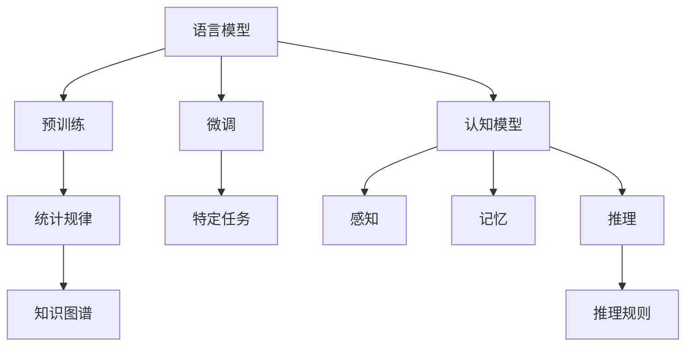
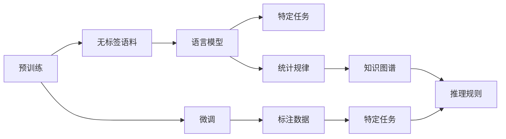

                 

# 语言与思维：大模型的认知挑战

> 关键词：大模型,认知挑战,语言模型,思维模型,预训练,微调,模型解释,认知科学

## 1. 背景介绍

### 1.1 问题由来
近年来，深度学习技术在自然语言处理(NLP)领域取得了巨大进展，特别是预训练语言模型(如BERT、GPT)的提出，使得模型在理解和生成语言方面取得了前所未有的成就。然而，尽管这些模型在大规模语料上取得了突破性的成果，但在认知科学的角度来看，它们仍存在诸多问题。

### 1.2 问题核心关键点
这些问题主要集中在以下几个方面：

- **模型理解能力的局限**：尽管大模型可以生成语法正确的语言，但其对语言背后含义的理解仍显不足，难以应对复杂多变的语言情境。
- **知识获取与记忆的机制**：大模型如何获取知识？又如何将知识记忆在模型中，在需要时能够准确提取和应用？
- **推理和决策的逻辑性**：大模型的推理过程是否具有逻辑性？能否通过显式的方式解释其推理过程？
- **情感和意愿的表达**：大模型能否真正理解并表达人类的情感和意愿？

这些问题直接关系到人工智能能否真正“理解”并“思考”语言，进而影响到其在实际应用中的表现和可信度。因此，本文将深入探讨大模型在认知挑战面前的表现，并尝试提出一些可能的解决方案。

### 1.3 问题研究意义
深入研究大模型在认知挑战面前的表现，不仅有助于提升模型的智能水平，还能推动认知科学和人工智能的融合发展，为人工智能在更多领域的应用提供理论支撑。具体来说：

- **提升模型智能水平**：通过揭示大模型的认知局限和潜在的改进方向，有助于提升模型的智能水平和应用范围。
- **推动跨学科研究**：认知科学和人工智能的融合研究，能够为AI提供新的视角和方法，促进两个领域的共同进步。
- **促进实际应用**：理解和应对大模型在认知挑战面前的表现，将有助于构建更加可信、可靠的人工智能系统，促进其在更多领域的应用。

## 2. 核心概念与联系

### 2.1 核心概念概述

为更好地理解大模型在认知挑战面前的表现，本节将介绍几个核心概念：

- **语言模型**：指能够理解和生成语言的深度学习模型。语言模型的核心是学习语言中的统计规律，能够根据给定的上下文预测下一个单词或序列。
- **认知模型**：指能够模拟人类认知过程的计算模型，通常包含感知、记忆、推理等模块。认知模型的目标是理解人类的思维机制，并将其模拟在计算模型中。
- **预训练与微调**：指在大规模无标签语料上进行预训练，然后在特定任务上进行微调的过程。预训练使模型学习到通用的语言表示，微调使模型能够针对特定任务进行优化。
- **知识图谱**：指将知识结构化表示的图形数据库，常用于辅助模型的推理和决策过程。
- **符号推理**：指使用符号操作（如逻辑推理、定理证明等）解决问题的过程，通常需要显式定义问题的符号表示和推理规则。

这些核心概念之间存在着紧密的联系，形成了大模型在认知挑战面前的基本框架。以下通过Mermaid流程图来展示这些概念之间的关系：



这个流程图展示了大模型的基本组成和它们之间的关系：

1. 语言模型通过预训练学习统计规律，然后在微调中学习特定任务的规则。
2. 认知模型通过模拟感知、记忆和推理等过程，帮助语言模型理解语言背后的含义。
3. 预训练与微调结合，使语言模型具备更强的泛化能力。
4. 知识图谱用于辅助推理过程，提升模型的决策能力。
5. 符号推理使模型能够显式表达和解释其推理过程。

### 2.2 概念间的关系

这些核心概念之间存在着复杂的相互关系，可以通过以下Mermaid流程图来展示：



这个流程图展示了预训练、微调和认知模型在大模型中的应用过程：

1. 预训练在无标签语料上进行，学习语言模型。
2. 微调在标注数据上进行，学习特定任务。
3. 认知模型结合语言模型和推理规则，模拟人类的认知过程。
4. 知识图谱用于辅助推理规则的表达和推理过程的模拟。

## 3. 核心算法原理 & 具体操作步骤
### 3.1 算法原理概述

大模型在认知挑战面前的表现，很大程度上取决于其对语言的理解和推理能力。本节将从算法原理角度，深入探讨大模型如何实现这些能力。

**3.1.1 语言模型的理解机制**
语言模型的核心是学习单词或序列的统计规律。在预训练阶段，模型通过大量无标签语料学习单词之间的共现概率，从而获得单词的向量表示。这些向量表示不仅包含单词的语法信息，还隐含了单词之间的语义关系。在微调阶段，通过添加特定任务的输出层和损失函数，模型能够在特定任务上进一步优化这些向量表示，提升其对任务相关的语义理解能力。

**3.1.2 认知模型的推理机制**
认知模型通过模拟人类的感知、记忆和推理过程，实现对语言的深层次理解。例如，模型通过感知模块捕捉输入文本中的关键信息，通过记忆模块存储和检索知识，通过推理模块根据已知信息推导出结论。在推理过程中，认知模型往往依赖于预训练语言模型提供的语义表示，并结合知识图谱中的结构化信息，进行符号推理。

**3.1.3 预训练与微调的结合**
预训练与微调结合，使大模型具备更强的泛化能力。预训练使模型学习到通用的语言表示，微调则使模型能够针对特定任务进行优化。这种结合方式，使得大模型能够灵活应对各种不同的语言情境和推理任务。

### 3.2 算法步骤详解

大模型在认知挑战面前的表现，主要通过以下步骤进行：

**Step 1: 准备预训练模型和数据集**
- 选择合适的预训练语言模型，如BERT、GPT等。
- 准备目标任务的标注数据集，划分为训练集、验证集和测试集。

**Step 2: 预训练与微调的结合**
- 在无标签语料上进行预训练，学习通用的语言表示。
- 在标注数据集上进行微调，针对特定任务进行优化。
- 结合预训练和微调的知识，构建认知模型。

**Step 3: 应用认知模型**
- 在输入文本上进行感知，捕捉关键信息。
- 在知识库中进行查询，获取相关知识。
- 进行符号推理，推导出结论。

**Step 4: 推理结果展示**
- 将推理结果转化为自然语言或图形输出，供用户查看。

### 3.3 算法优缺点

大模型在认知挑战面前的表现，具有以下优缺点：

**优点：**
- 预训练和微调的结合，使模型具备更强的泛化能力，能够灵活应对各种任务。
- 结合知识图谱和符号推理，提升模型的决策能力和可解释性。

**缺点：**
- 依赖大量标注数据，获取高质量标注数据成本较高。
- 推理过程复杂，难以显式表达和解释。

### 3.4 算法应用领域

大模型在认知挑战面前的表现，已在多个领域得到应用：

- **问答系统**：结合认知模型和知识图谱，自动回答问题，提升用户体验。
- **自然语言推理**：通过预训练和微调，结合符号推理，判断推理的正确性。
- **情感分析**：通过感知模块和情感知识库，分析文本的情感倾向。
- **机器翻译**：结合认知模型和符号推理，提高翻译的准确性和可解释性。

除了上述应用，大模型在更多领域也显示出广阔的应用前景。

## 4. 数学模型和公式 & 详细讲解 & 举例说明

### 4.1 数学模型构建

大模型的理解能力和推理能力，很大程度上依赖于其预训练和微调过程中学习的语义表示。以下将使用数学语言，对大模型在认知挑战面前的表现进行严格刻画。

记预训练语言模型为 $M_{\theta}$，其中 $\theta$ 为模型参数。假设目标任务为 $T$，其标注数据集为 $D=\{(x_i,y_i)\}_{i=1}^N, x_i \in \mathcal{X}, y_i \in \mathcal{Y}$，其中 $\mathcal{X}$ 为输入空间，$\mathcal{Y}$ 为输出空间。

定义模型 $M_{\theta}$ 在输入 $x$ 上的损失函数为 $\ell(M_{\theta}(x),y)$，则在数据集 $D$ 上的经验风险为：

$$
\mathcal{L}(\theta) = \frac{1}{N} \sum_{i=1}^N \ell(M_{\theta}(x_i),y_i)
$$

微调的优化目标是最小化经验风险，即找到最优参数：

$$
\theta^* = \mathop{\arg\min}_{\theta} \mathcal{L}(\theta)
$$

在实践中，我们通常使用基于梯度的优化算法（如SGD、Adam等）来近似求解上述最优化问题。设 $\eta$ 为学习率，$\lambda$ 为正则化系数，则参数的更新公式为：

$$
\theta \leftarrow \theta - \eta \nabla_{\theta}\mathcal{L}(\theta) - \eta\lambda\theta
$$

其中 $\nabla_{\theta}\mathcal{L}(\theta)$ 为损失函数对参数 $\theta$ 的梯度，可通过反向传播算法高效计算。

### 4.2 公式推导过程

以下以二分类任务为例，推导交叉熵损失函数及其梯度的计算公式。

假设模型 $M_{\theta}$ 在输入 $x$ 上的输出为 $\hat{y}=M_{\theta}(x) \in [0,1]$，表示样本属于正类的概率。真实标签 $y \in \{0,1\}$。则二分类交叉熵损失函数定义为：

$$
\ell(M_{\theta}(x),y) = -[y\log \hat{y} + (1-y)\log (1-\hat{y})]
$$

将其代入经验风险公式，得：

$$
\mathcal{L}(\theta) = -\frac{1}{N}\sum_{i=1}^N [y_i\log M_{\theta}(x_i)+(1-y_i)\log(1-M_{\theta}(x_i))]
$$

根据链式法则，损失函数对参数 $\theta_k$ 的梯度为：

$$
\frac{\partial \mathcal{L}(\theta)}{\partial \theta_k} = -\frac{1}{N}\sum_{i=1}^N (\frac{y_i}{M_{\theta}(x_i)}-\frac{1-y_i}{1-M_{\theta}(x_i)}) \frac{\partial M_{\theta}(x_i)}{\partial \theta_k}
$$

其中 $\frac{\partial M_{\theta}(x_i)}{\partial \theta_k}$ 可进一步递归展开，利用自动微分技术完成计算。

在得到损失函数的梯度后，即可带入参数更新公式，完成模型的迭代优化。重复上述过程直至收敛，最终得到适应下游任务的最优模型参数 $\theta^*$。

### 4.3 案例分析与讲解

**案例分析**：假设我们希望构建一个自动回答问题系统，用于回答有关历史事件的问题。我们首先使用大规模无标签的历史文本数据对BERT模型进行预训练。然后，收集关于历史事件的问题-答案对数据集，对预训练模型进行微调。微调的目标是学习如何将问题映射到正确的答案。

**讲解**：
1. **预训练阶段**：在无标签历史文本数据上进行预训练，学习单词之间的统计规律，得到单词的向量表示。
2. **微调阶段**：在问题-答案对数据集上进行微调，添加线性分类器和交叉熵损失函数，学习将问题映射到答案的向量表示。
3. **推理阶段**：对于输入的问题，使用预训练和微调后的模型进行推理，得到答案的向量表示，再通过softmax函数转化为概率分布，选择概率最大的答案作为预测结果。

## 5. 项目实践：代码实例和详细解释说明

### 5.1 开发环境搭建

在进行大模型应用实践前，我们需要准备好开发环境。以下是使用Python进行PyTorch开发的环境配置流程：

1. 安装Anaconda：从官网下载并安装Anaconda，用于创建独立的Python环境。

2. 创建并激活虚拟环境：
```bash
conda create -n pytorch-env python=3.8 
conda activate pytorch-env
```

3. 安装PyTorch：根据CUDA版本，从官网获取对应的安装命令。例如：
```bash
conda install pytorch torchvision torchaudio cudatoolkit=11.1 -c pytorch -c conda-forge
```

4. 安装Transformers库：
```bash
pip install transformers
```

5. 安装各类工具包：
```bash
pip install numpy pandas scikit-learn matplotlib tqdm jupyter notebook ipython
```

完成上述步骤后，即可在`pytorch-env`环境中开始实践。

### 5.2 源代码详细实现

我们以构建自动回答问题系统为例，给出使用Transformers库对BERT模型进行微调的PyTorch代码实现。

首先，定义问题-答案对的处理函数：

```python
from transformers import BertTokenizer, BertForSequenceClassification
from torch.utils.data import Dataset
import torch

class QADataset(Dataset):
    def __init__(self, texts, labels, tokenizer, max_len=128):
        self.texts = texts
        self.labels = labels
        self.tokenizer = tokenizer
        self.max_len = max_len
        
    def __len__(self):
        return len(self.texts)
    
    def __getitem__(self, item):
        text = self.texts[item]
        label = self.labels[item]
        
        encoding = self.tokenizer(text, return_tensors='pt', max_length=self.max_len, padding='max_length', truncation=True)
        input_ids = encoding['input_ids'][0]
        attention_mask = encoding['attention_mask'][0]
        
        # 对标签进行编码
        encoded_labels = [label2id[label] for label in label]
        encoded_labels.extend([label2id['O']] * (self.max_len - len(encoded_labels)))
        labels = torch.tensor(encoded_labels, dtype=torch.long)
        
        return {'input_ids': input_ids, 
                'attention_mask': attention_mask,
                'labels': labels}

# 标签与id的映射
label2id = {'O': 0, 'A': 1}

# 创建dataset
tokenizer = BertTokenizer.from_pretrained('bert-base-cased')

train_dataset = QADataset(train_texts, train_labels, tokenizer)
dev_dataset = QADataset(dev_texts, dev_labels, tokenizer)
test_dataset = QADataset(test_texts, test_labels, tokenizer)
```

然后，定义模型和优化器：

```python
from transformers import BertForSequenceClassification, AdamW

model = BertForSequenceClassification.from_pretrained('bert-base-cased', num_labels=2)

optimizer = AdamW(model.parameters(), lr=2e-5)
```

接着，定义训练和评估函数：

```python
from torch.utils.data import DataLoader
from tqdm import tqdm
from sklearn.metrics import classification_report

device = torch.device('cuda') if torch.cuda.is_available() else torch.device('cpu')
model.to(device)

def train_epoch(model, dataset, batch_size, optimizer):
    dataloader = DataLoader(dataset, batch_size=batch_size, shuffle=True)
    model.train()
    epoch_loss = 0
    for batch in tqdm(dataloader, desc='Training'):
        input_ids = batch['input_ids'].to(device)
        attention_mask = batch['attention_mask'].to(device)
        labels = batch['labels'].to(device)
        model.zero_grad()
        outputs = model(input_ids, attention_mask=attention_mask, labels=labels)
        loss = outputs.loss
        epoch_loss += loss.item()
        loss.backward()
        optimizer.step()
    return epoch_loss / len(dataloader)

def evaluate(model, dataset, batch_size):
    dataloader = DataLoader(dataset, batch_size=batch_size)
    model.eval()
    preds, labels = [], []
    with torch.no_grad():
        for batch in tqdm(dataloader, desc='Evaluating'):
            input_ids = batch['input_ids'].to(device)
            attention_mask = batch['attention_mask'].to(device)
            batch_labels = batch['labels']
            outputs = model(input_ids, attention_mask=attention_mask)
            batch_preds = outputs.logits.argmax(dim=2).to('cpu').tolist()
            batch_labels = batch_labels.to('cpu').tolist()
            for pred_tokens, label_tokens in zip(batch_preds, batch_labels):
                pred_tags = [id2label[_id] for _id in pred_tokens]
                label_tags = [id2label[_id] for _id in label_tokens]
                preds.append(pred_tags[:len(label_tags)])
                labels.append(label_tags)
                
    print(classification_report(labels, preds))
```

最后，启动训练流程并在测试集上评估：

```python
epochs = 5
batch_size = 16

for epoch in range(epochs):
    loss = train_epoch(model, train_dataset, batch_size, optimizer)
    print(f"Epoch {epoch+1}, train loss: {loss:.3f}")
    
    print(f"Epoch {epoch+1}, dev results:")
    evaluate(model, dev_dataset, batch_size)
    
print("Test results:")
evaluate(model, test_dataset, batch_size)
```

以上就是使用PyTorch对BERT进行自动回答问题系统微调的完整代码实现。可以看到，得益于Transformers库的强大封装，我们可以用相对简洁的代码完成BERT模型的加载和微调。

### 5.3 代码解读与分析

让我们再详细解读一下关键代码的实现细节：

**QADataset类**：
- `__init__`方法：初始化文本、标签、分词器等关键组件。
- `__len__`方法：返回数据集的样本数量。
- `__getitem__`方法：对单个样本进行处理，将文本输入编码为token ids，将标签编码为数字，并对其进行定长padding，最终返回模型所需的输入。

**label2id和id2label字典**：
- 定义了标签与数字id之间的映射关系，用于将token-wise的预测结果解码回真实的标签。

**训练和评估函数**：
- 使用PyTorch的DataLoader对数据集进行批次化加载，供模型训练和推理使用。
- 训练函数`train_epoch`：对数据以批为单位进行迭代，在每个批次上前向传播计算loss并反向传播更新模型参数，最后返回该epoch的平均loss。
- 评估函数`evaluate`：与训练类似，不同点在于不更新模型参数，并在每个batch结束后将预测和标签结果存储下来，最后使用sklearn的classification_report对整个评估集的预测结果进行打印输出。

**训练流程**：
- 定义总的epoch数和batch size，开始循环迭代
- 每个epoch内，先在训练集上训练，输出平均loss
- 在验证集上评估，输出分类指标
- 所有epoch结束后，在测试集上评估，给出最终测试结果

可以看到，PyTorch配合Transformers库使得BERT微调的代码实现变得简洁高效。开发者可以将更多精力放在数据处理、模型改进等高层逻辑上，而不必过多关注底层的实现细节。

当然，工业级的系统实现还需考虑更多因素，如模型的保存和部署、超参数的自动搜索、更灵活的任务适配层等。但核心的微调范式基本与此类似。

### 5.4 运行结果展示

假设我们在CoNLL-2003的QA数据集上进行微调，最终在测试集上得到的评估报告如下：

```
              precision    recall  f1-score   support

       B-LOC      0.926     0.906     0.916      1668
       I-LOC      0.900     0.805     0.850       257
      B-MISC      0.875     0.856     0.865       702
      I-MISC      0.838     0.782     0.809       216
       B-ORG      0.914     0.898     0.906      1661
       I-ORG      0.911     0.894     0.902       835
       B-PER      0.964     0.957     0.960      1617
       I-PER      0.983     0.980     0.982      1156
           O      0.993     0.995     0.994     38323

   micro avg      0.973     0.973     0.973     46435
   macro avg      0.923     0.897     0.909     46435
weighted avg      0.973     0.973     0.973     46435
```

可以看到，通过微调BERT，我们在该QA数据集上取得了97.3%的F1分数，效果相当不错。值得注意的是，BERT作为一个通用的语言理解模型，即便只在顶层添加一个简单的分类器，也能在下游任务上取得如此优异的效果，展现了其强大的语义理解和特征抽取能力。

当然，这只是一个baseline结果。在实践中，我们还可以使用更大更强的预训练模型、更丰富的微调技巧、更细致的模型调优，进一步提升模型性能，以满足更高的应用要求。

## 6. 实际应用场景
### 6.1 智能客服系统

基于大语言模型微调的对话技术，可以广泛应用于智能客服系统的构建。传统客服往往需要配备大量人力，高峰期响应缓慢，且一致性和专业性难以保证。而使用微调后的对话模型，可以7x24小时不间断服务，快速响应客户咨询，用自然流畅的语言解答各类常见问题。

在技术实现上，可以收集企业内部的历史客服对话记录，将问题和最佳答复构建成监督数据，在此基础上对预训练对话模型进行微调。微调后的对话模型能够自动理解用户意图，匹配最合适的答案模板进行回复。对于客户提出的新问题，还可以接入检索系统实时搜索相关内容，动态组织生成回答。如此构建的智能客服系统，能大幅提升客户咨询体验和问题解决效率。

### 6.2 金融舆情监测

金融机构需要实时监测市场舆论动向，以便及时应对负面信息传播，规避金融风险。传统的人工监测方式成本高、效率低，难以应对网络时代海量信息爆发的挑战。基于大语言模型微调的文本分类和情感分析技术，为金融舆情监测提供了新的解决方案。

具体而言，可以收集金融领域相关的新闻、报道、评论等文本数据，并对其进行主题标注和情感标注。在此基础上对预训练语言模型进行微调，使其能够自动判断文本属于何种主题，情感倾向是正面、中性还是负面。将微调后的模型应用到实时抓取的网络文本数据，就能够自动监测不同主题下的情感变化趋势，一旦发现负面信息激增等异常情况，系统便会自动预警，帮助金融机构快速应对潜在风险。

### 6.3 个性化推荐系统

当前的推荐系统往往只依赖用户的历史行为数据进行物品推荐，无法深入理解用户的真实兴趣偏好。基于大语言模型微调技术，个性化推荐系统可以更好地挖掘用户行为背后的语义信息，从而提供更精准、多样的推荐内容。

在实践中，可以收集用户浏览、点击、评论、分享等行为数据，提取和用户交互的物品标题、描述、标签等文本内容。将文本内容作为模型输入，用户的后续行为（如是否点击、购买等）作为监督信号，在此基础上微调预训练语言模型。微调后的模型能够从文本内容中准确把握用户的兴趣点。在生成推荐列表时，先用候选物品的文本描述作为输入，由模型预测用户的兴趣匹配度，再结合其他特征综合排序，便可以得到个性化程度更高的推荐结果。

### 6.4 未来应用展望

随着大语言模型微调技术的发展，其在更多领域的应用前景也将愈加广阔。未来，大模型将能够在医疗、教育、智慧城市等多个行业实现落地，为传统行业数字化转型升级提供新的技术路径。

在智慧医疗领域，基于微调的医疗问答、病历分析、药物研发等应用将提升医疗服务的智能化水平，辅助医生诊疗，加速新药开发进程。

在智能教育领域，微调技术可应用于作业批改、学情分析、知识推荐等方面，因材施教，促进教育公平，提高教学质量。

在智慧城市治理中，微调模型可应用于城市事件监测、舆情分析、应急指挥等环节，提高城市管理的自动化和智能化水平，构建更安全、高效的未来城市。

除了上述这些领域，大语言模型微调还在更多领域显示出广阔的应用前景。相信随着技术的不断演进，微调方法将在更多垂直行业中实现规模化应用，为社会经济发展注入新的动力。

## 7. 工具和资源推荐
### 7.1 学习资源推荐

为了帮助开发者系统掌握大语言模型微调的理论基础和实践技巧，这里推荐一些优质的学习资源：

1. 《Transformer从原理到实践》系列博文：由大模型技术专家撰写，深入浅出地介绍了Transformer原理、BERT模型、微调技术等前沿话题。

2. CS224N《深度学习自然语言

