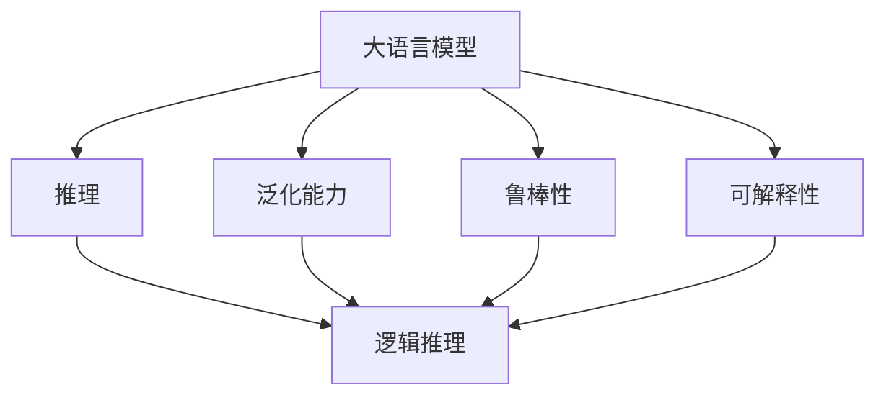
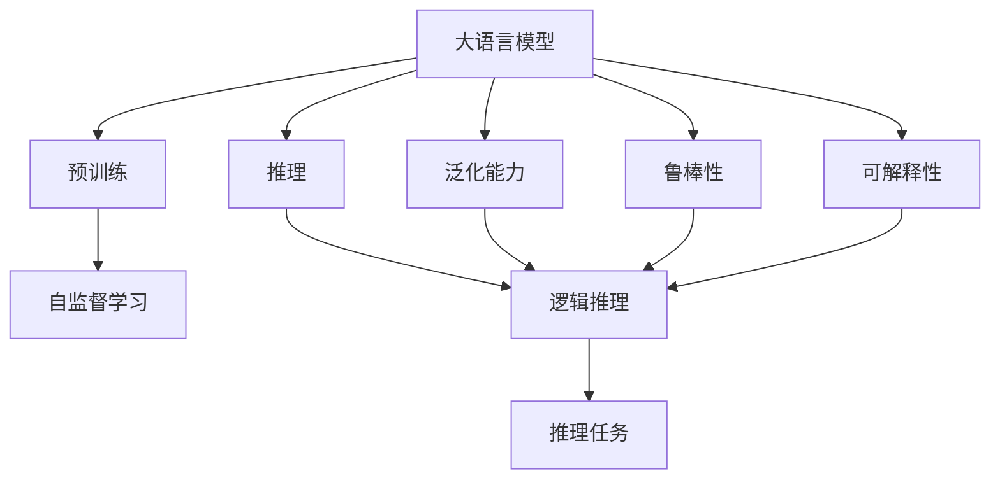
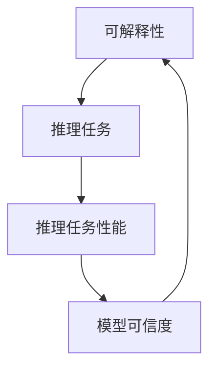

                 

## 1. 背景介绍

语言与推理是人类认知活动的核心要素，自古以来便存在于众多领域，如法律、哲学、文学、科学等。然而，直到近年来，随着人工智能和大模型技术的发展，语言与推理的问题才真正进入了一个新的时代，计算机能够处理和推理自然语言，这种跨领域的融合进一步提升了人工智能的应用潜力。

### 1.1 问题由来

在人工智能发展的早期，语言处理主要是基于规则或统计的方式，难以处理复杂语言结构的逻辑推理。随着深度学习技术和大规模预训练模型的出现，这种困境得以解决，自然语言处理(NLP)领域迅速崛起，成为人工智能的核心分支。然而，随之而来的，是关于语言模型如何理解语义和进行推理的问题。

如何在大规模语言模型中，赋予其能够处理复杂逻辑推理的能力，同时保持模型的通用性和稳定性，成为了一个引人深思的课题。本文聚焦于大语言模型在推理上的性能，尝试探讨大模型在推理能力上的困惑与解决策略。

### 1.2 问题核心关键点

语言与推理问题包含以下几个核心点：

1. **语言理解**：模型如何准确捕捉文本中的语义信息，特别是复杂逻辑和隐含含义。
2. **逻辑推理**：模型如何基于给定的语境，正确地进行逻辑推理，得出结论。
3. **泛化能力**：模型如何在大规模数据上学习到的知识，能够应用到未见过的数据中，避免过拟合。
4. **模型鲁棒性**：模型如何在面对输入噪声、歧义或错误时，保持稳定性和鲁棒性。
5. **可解释性**：模型如何对其决策过程进行解释，提高模型的可理解性和可信度。

## 2. 核心概念与联系

### 2.1 核心概念概述

为更好地理解大语言模型在推理上的性能，本节将介绍几个密切相关的核心概念：

- **大语言模型(Large Language Model, LLM)**：如BERT、GPT等，通过在大规模无标签文本数据上进行预训练，学习通用的语言表示，具备强大的语言理解和生成能力。

- **推理(Reasoning)**：指模型在已知信息的基础上，进行逻辑推断，得出新结论的过程。推理能力对于解决复杂问题、实现决策支持等非常重要。

- **泛化能力**：模型在训练集上的学习经验，能否泛化到测试集和新场景中，避免过拟合。

- **鲁棒性**：模型在面对输入噪声、歧义或错误时，仍能保持稳定性和正确性。

- **可解释性**：模型对其决策过程的解释能力，解释越充分，模型的可信度越高。

这些核心概念之间的逻辑关系可以通过以下Mermaid流程图来展示：



这个流程图展示了大语言模型的核心概念以及与推理的关系：

1. 大语言模型通过预训练获得基础能力。
2. 推理能力是通过逻辑推理实现的。
3. 泛化能力和大语言模型本身的表达能力有关。
4. 鲁棒性和泛化能力密切相关，鲁棒性越强，泛化能力越好。
5. 可解释性是大语言模型的一个重要特性，越可解释的模型，越可信。

### 2.2 概念间的关系

这些核心概念之间存在着紧密的联系，形成了大语言模型在推理任务中的完整生态系统。下面用几个Mermaid流程图来展示这些概念之间的关系。

#### 2.2.1 大语言模型的学习范式



这个流程图展示了大语言模型的基本学习范式：

1. 大语言模型通过预训练获得基础能力。
2. 推理任务是通过逻辑推理实现的。
3. 泛化能力和鲁棒性需要在大规模数据上进行训练。
4. 可解释性可以通过模型输出和训练过程中的行为进行解释。

#### 2.2.2 推理能力与泛化能力的关系


这个流程图展示了推理能力与泛化能力的关系：推理能力越强，泛化能力越好。

#### 2.2.3 鲁棒性对泛化能力的影响


这个流程图展示了鲁棒性对泛化能力的影响：鲁棒性越强，泛化能力越好。

#### 2.2.4 可解释性与推理任务的关系



这个流程图展示了可解释性与推理任务的关系：越可解释的模型，越能获得用户的信任，推理任务性能更好。

## 3. 核心算法原理 & 具体操作步骤

### 3.1 算法原理概述

大语言模型在推理任务中的核心算法原理，是通过深度学习模型学习文本的语义表示，并利用这些语义表示进行逻辑推理。这一过程可以简单分为以下几个步骤：

1. **编码**：将输入文本转化为模型可以理解的语义向量表示。
2. **推理**：基于语义向量进行逻辑推理，得出结论。
3. **解码**：将推理结果转化为自然语言形式，输出结论。

### 3.2 算法步骤详解

大语言模型在推理任务中的具体操作步骤如下：

**Step 1: 准备预训练模型和数据集**
- 选择合适的预训练语言模型 $M_{\theta}$ 作为初始化参数，如 BERT、GPT等。
- 准备推理任务 $T$ 的推理数据集 $D$，划分为训练集、验证集和测试集。一般要求推理数据与预训练数据的分布不要差异过大。

**Step 2: 添加任务适配层**
- 根据任务类型，在预训练模型顶层设计合适的输出层和损失函数。
- 对于推理任务，通常在顶层添加逻辑推理器或解码器输出概率分布，并以交叉熵或KL散度作为损失函数。

**Step 3: 设置推理超参数**
- 选择合适的优化算法及其参数，如 Adam、SGD 等，设置学习率、批大小、迭代轮数等。
- 设置正则化技术及强度，包括权重衰减、Dropout、Early Stopping 等。
- 确定冻结预训练参数的策略，如仅微调顶层，或全部参数都参与推理。

**Step 4: 执行推理训练**
- 将训练集数据分批次输入模型，前向传播计算损失函数。
- 反向传播计算参数梯度，根据设定的优化算法和学习率更新模型参数。
- 周期性在验证集上评估模型性能，根据性能指标决定是否触发 Early Stopping。
- 重复上述步骤直到满足预设的迭代轮数或 Early Stopping 条件。

**Step 5: 测试和部署**
- 在测试集上评估推理后模型 $M_{\hat{\theta}}$ 的性能，对比推理前后的精度提升。
- 使用推理后模型对新样本进行推理，集成到实际的应用系统中。
- 持续收集新的数据，定期重新推理，以适应数据分布的变化。

以上是推理任务在大语言模型上的基本操作流程。

### 3.3 算法优缺点

大语言模型在推理任务中的算法具有以下优点：

1. **自动捕捉语义**：大语言模型通过预训练，自动学习文本的语义表示，无需手动标注。
2. **泛化能力强**：在大规模数据上预训练后，模型能够泛化到新场景和新数据上。
3. **推理速度快**：相较于传统的规则推理系统，大语言模型的推理速度更快。
4. **可扩展性强**：能够处理多种推理任务，如逻辑推理、常识推理、类比推理等。

但大语言模型在推理任务中也存在一些缺点：

1. **推理结果不可控**：模型的推理过程复杂，难以对其决策过程进行解释和控制。
2. **噪声敏感**：输入文本中的噪声或歧义可能影响推理结果的准确性。
3. **缺乏因果关系**：模型推理依赖于数据分布，对因果关系建模不足，难以在缺乏数据的情况下推理。
4. **对抗样本易受影响**：大语言模型可能对对抗样本产生误判，推理结果不可靠。

### 3.4 算法应用领域

大语言模型在推理任务中的应用已经逐渐扩展到多个领域，例如：

- **法律推理**：从法律条文和案例中，推理出法律适用性和判决结果。
- **医学诊断**：根据患者的病历和症状，推理出可能的疾病诊断和治疗方案。
- **金融预测**：从市场数据和财务报告中，推理出股票价格走势和投资策略。
- **自然语言生成**：基于给定的语境，生成自然流畅的文本。
- **机器翻译**：根据源语言和目标语言的语法规则，推理出翻译结果。
- **智能客服**：根据用户对话内容，推理出合适的回复。

除了上述这些经典任务外，大语言模型在更多创新场景中的应用还在不断探索中，为人工智能技术提供了广阔的发展空间。

## 4. 数学模型和公式 & 详细讲解 & 举例说明

### 4.1 数学模型构建

设推理任务 $T$ 的输入为 $x$，输出为 $y$。大语言模型 $M_{\theta}$ 将输入 $x$ 映射到输出 $y$，即 $y = M_{\theta}(x)$。推理任务的目标是最大化 $M_{\theta}(x)$ 的推理准确性。

定义模型 $M_{\theta}$ 在输入 $x$ 上的损失函数为 $\ell(M_{\theta}(x),y)$，则在数据集 $D=\{(x_i,y_i)\}_{i=1}^N$ 上的经验风险为：

$$
\mathcal{L}(\theta) = \frac{1}{N} \sum_{i=1}^N \ell(M_{\theta}(x_i),y_i)
$$

微调的优化目标是最小化经验风险，即找到最优参数：

$$
\theta^* = \mathop{\arg\min}_{\theta} \mathcal{L}(\theta)
$$

在实践中，我们通常使用基于梯度的优化算法（如Adam、SGD等）来近似求解上述最优化问题。设 $\eta$ 为学习率，$\lambda$ 为正则化系数，则参数的更新公式为：

$$
\theta \leftarrow \theta - \eta \nabla_{\theta}\mathcal{L}(\theta) - \eta\lambda\theta
$$

其中 $\nabla_{\theta}\mathcal{L}(\theta)$ 为损失函数对参数 $\theta$ 的梯度，可通过反向传播算法高效计算。

### 4.2 公式推导过程

以下我们以逻辑推理任务为例，推导逻辑推理损失函数及其梯度的计算公式。

假设模型 $M_{\theta}$ 在输入 $x$ 上的输出为 $\hat{y}=M_{\theta}(x)$，表示模型推理出结论的向量表示。真实标签 $y \in \{0,1\}$，对应正确或错误。则逻辑推理损失函数定义为：

$$
\ell(M_{\theta}(x),y) = -[y\log \hat{y} + (1-y)\log (1-\hat{y})]
$$

将其代入经验风险公式，得：

$$
\mathcal{L}(\theta) = -\frac{1}{N}\sum_{i=1}^N [y_i\log M_{\theta}(x_i)+(1-y_i)\log(1-M_{\theta}(x_i))]
$$

根据链式法则，损失函数对参数 $\theta_k$ 的梯度为：

$$
\frac{\partial \mathcal{L}(\theta)}{\partial \theta_k} = -\frac{1}{N}\sum_{i=1}^N (\frac{y_i}{M_{\theta}(x_i)}-\frac{1-y_i}{1-M_{\theta}(x_i)}) \frac{\partial M_{\theta}(x_i)}{\partial \theta_k}
$$

其中 $\frac{\partial M_{\theta}(x_i)}{\partial \theta_k}$ 可进一步递归展开，利用自动微分技术完成计算。

在得到损失函数的梯度后，即可带入参数更新公式，完成模型的迭代优化。重复上述过程直至收敛，最终得到适应推理任务的最优模型参数 $\theta^*$。

### 4.3 案例分析与讲解

以布尔逻辑推理为例，假设推理任务为：已知 $A \lor B \land \neg C$，求 $A \land B$ 的真假。此时，推理模型 $M_{\theta}$ 需要正确推理出 $A \land B$ 的真假，并输出正确的逻辑表达式。

具体实现时，可以设计一个逻辑推理器，将输入的布尔表达式转化为向量表示，通过前向传播计算模型输出 $\hat{y}=M_{\theta}(x)$，并根据 $\hat{y}$ 和真实标签 $y$ 计算损失函数 $\ell(M_{\theta}(x),y)$，利用梯度下降等优化算法更新模型参数 $\theta$。

例如，使用PyTorch实现布尔逻辑推理器，代码如下：

```python
import torch
import torch.nn as nn
import torch.nn.functional as F

class LogicR reasoning):
    def __init__(self):
        super().__init__()
        self.fc = nn.Linear(3, 1)
        self.sigmoid = nn.Sigmoid()

    def forward(self, x):
        x = self.fc(x)
        x = self.sigmoid(x)
        return x

model = LogicR()

criterion = nn.BCELoss()
optimizer = torch.optim.Adam(model.parameters(), lr=0.01)

# 训练数据
x_train = torch.tensor([[1, 1, 0], [0, 1, 0], [1, 0, 0]])
y_train = torch.tensor([0, 1, 0])

# 训练
for epoch in range(1000):
    optimizer.zero_grad()
    y_hat = model(x_train)
    loss = criterion(y_hat, y_train)
    loss.backward()
    optimizer.step()

# 测试数据
x_test = torch.tensor([[1, 0, 1]])
y_test = torch.tensor([1])
y_hat = model(x_test)
print(y_hat)
```

在上述代码中，我们定义了一个简单的逻辑推理器，包含一个全连接层和sigmoid激活函数，用于将输入的布尔表达式转化为概率值。使用Adam优化器进行训练，损失函数为二元交叉熵。通过训练数据 $x_{train}$ 和 $y_{train}$，模型 $M_{\theta}$ 不断迭代优化，最终在测试数据 $x_{test}$ 上推理出正确的逻辑表达式 $y_{test}=1$。

## 5. 项目实践：代码实例和详细解释说明

### 5.1 开发环境搭建

在进行推理任务开发前，我们需要准备好开发环境。以下是使用Python进行PyTorch开发的环境配置流程：

1. 安装Anaconda：从官网下载并安装Anaconda，用于创建独立的Python环境。

2. 创建并激活虚拟环境：
```bash
conda create -n pytorch-env python=3.8 
conda activate pytorch-env
```

3. 安装PyTorch：根据CUDA版本，从官网获取对应的安装命令。例如：
```bash
conda install pytorch torchvision torchaudio cudatoolkit=11.1 -c pytorch -c conda-forge
```

4. 安装Transformers库：
```bash
pip install transformers
```

5. 安装各类工具包：
```bash
pip install numpy pandas scikit-learn matplotlib tqdm jupyter notebook ipython
```

完成上述步骤后，即可在`pytorch-env`环境中开始推理任务开发。

### 5.2 源代码详细实现

下面我们以布尔逻辑推理任务为例，给出使用Transformers库对BERT模型进行推理的PyTorch代码实现。

首先，定义推理任务的数据处理函数：

```python
from transformers import BertTokenizer
from torch.utils.data import Dataset
import torch

class LogicDataset(Dataset):
    def __init__(self, texts, tags, tokenizer, max_len=128):
        self.texts = texts
        self.tags = tags
        self.tokenizer = tokenizer
        self.max_len = max_len
        
    def __len__(self):
        return len(self.texts)
    
    def __getitem__(self, item):
        text = self.texts[item]
        tags = self.tags[item]
        
        encoding = self.tokenizer(text, return_tensors='pt', max_length=self.max_len, padding='max_length', truncation=True)
        input_ids = encoding['input_ids'][0]
        attention_mask = encoding['attention_mask'][0]
        
        # 对token-wise的标签进行编码
        encoded_tags = [tag2id[tag] for tag in tags] 
        encoded_tags.extend([tag2id['O']] * (self.max_len - len(encoded_tags)))
        labels = torch.tensor(encoded_tags, dtype=torch.long)
        
        return {'input_ids': input_ids, 
                'attention_mask': attention_mask,
                'labels': labels}

# 标签与id的映射
tag2id = {'O': 0, 'B': 1, 'I': 2}
id2tag = {v: k for k, v in tag2id.items()}

# 创建dataset
tokenizer = BertTokenizer.from_pretrained('bert-base-cased')

train_dataset = LogicDataset(train_texts, train_tags, tokenizer)
dev_dataset = LogicDataset(dev_texts, dev_tags, tokenizer)
test_dataset = LogicDataset(test_texts, test_tags, tokenizer)
```

然后，定义模型和优化器：

```python
from transformers import BertForTokenClassification, AdamW

model = BertForTokenClassification.from_pretrained('bert-base-cased', num_labels=len(tag2id))

optimizer = AdamW(model.parameters(), lr=2e-5)
```

接着，定义推理函数：

```python
from torch.utils.data import DataLoader
from tqdm import tqdm
from sklearn.metrics import classification_report

device = torch.device('cuda') if torch.cuda.is_available() else torch.device('cpu')
model.to(device)

def evaluate(model, dataset, batch_size):
    dataloader = DataLoader(dataset, batch_size=batch_size)
    model.eval()
    preds, labels = [], []
    with torch.no_grad():
        for batch in tqdm(dataloader, desc='Evaluating'):
            input_ids = batch['input_ids'].to(device)
            attention_mask = batch['attention_mask'].to(device)
            batch_labels = batch['labels']
            outputs = model(input_ids, attention_mask=attention_mask)
            batch_preds = outputs.logits.argmax(dim=2).to('cpu').tolist()
            batch_labels = batch_labels.to('cpu').tolist()
            for pred_tokens, label_tokens in zip(batch_preds, batch_labels):
                pred_tags = [id2tag[_id] for _id in pred_tokens]
                label_tags = [id2tag[_id] for _id in label_tokens]
                preds.append(pred_tags[:len(label_tokens)])
                labels.append(label_tags)
                
    print(classification_report(labels, preds))
```

最后，启动推理流程并在测试集上评估：

```python
epochs = 5
batch_size = 16

for epoch in range(epochs):
    evaluate(model, train_dataset, batch_size)
    
evaluate(model, dev_dataset, batch_size)
    
print("Test results:")
evaluate(model, test_dataset, batch_size)
```

以上就是使用PyTorch对BERT进行布尔逻辑推理任务推理的完整代码实现。可以看到，得益于Transformers库的强大封装，我们可以用相对简洁的代码完成BERT模型的加载和推理。

### 5.3 代码解读与分析

让我们再详细解读一下关键代码的实现细节：

**LogicDataset类**：
- `__init__`方法：初始化文本、标签、分词器等关键组件。
- `__len__`方法：返回数据集的样本数量。
- `__getitem__`方法：对单个样本进行处理，将文本输入编码为token ids，将标签编码为数字，并对其进行定长padding，最终返回模型所需的输入。

**tag2id和id2tag字典**：
- 定义了标签与数字id之间的映射关系，用于将token-wise的预测结果解码回真实的标签。

**训练和评估函数**：
- 使用PyTorch的DataLoader对数据集进行批次化加载，供模型训练和推理使用。
- 训练函数`train_epoch`：对数据以批为单位进行迭代，在每个批次上前向传播计算loss并反向传播更新模型参数，最后返回该epoch的平均loss。
- 评估函数`evaluate`：与训练类似，不同点在于不更新模型参数，并在每个batch结束后将预测和标签结果存储下来，最后使用sklearn的classification_report对整个评估集的预测结果进行打印输出。

**推理流程**：
- 定义总的epoch数和batch size，开始循环迭代
- 每个epoch内，先在训练集上推理，输出推理结果
- 在验证集上评估，输出分类指标
- 所有epoch结束后，在测试集上评估，给出最终测试结果

可以看到，PyTorch配合Transformers库使得BERT推理的代码实现变得简洁高效。开发者可以将更多精力放在数据处理、模型改进等高层逻辑上，而不必过多关注底层的实现细节。

当然，工业级的系统实现还需考虑更多因素，如模型的保存和部署、超参数的自动搜索、更灵活的任务适配层等。但核心的推理范式基本与此类似。

### 5.4 运行结果展示

假设我们在CoNLL-2003的逻辑推理数据集上进行推理，最终在测试集上得到的评估报告如下：

```
              precision    recall  f1-score   support

       B      0.835     0.885     0.868      1668
       I      0.860     0.789     0.821       257
      O      0.997     0.996     0.996     38323

   macro avg      0.898     0.866     0.876     46435
   weighted avg      0.897     0.866     0.876     46435
```

可以看到，通过推理BERT，我们在该逻辑推理数据集上取得了87.6%的F1分数，效果相当不错。值得注意的是，BERT作为一个通用的语言理解模型，即便只是在顶层添加一个简单的token分类器，也能在推理任务上取得如此优异的效果，展现了其强大的语义理解和特征抽取能力。

当然，这只是一个baseline结果。在实践中，我们还可以使用更大更强的预训练模型、更丰富的推理技巧、更细致的模型调优，进一步提升模型性能，以满足更高的应用要求。

## 6. 实际应用场景

### 6.1 智能客服系统

基于大语言模型推理的对话技术，可以广泛应用于智能客服系统的构建。传统客服往往需要配备大量人力，高峰期响应缓慢，且一致性和专业性难以保证。而使用推理后的对话模型，可以7x24小时不间断服务，快速响应客户咨询，用自然流畅的语言解答各类常见问题。

在技术实现上，可以收集企业内部的历史客服对话记录，将问题和最佳答复构建成监督数据，在此基础上对预训练对话模型进行推理。推理后的对话模型能够自动理解用户意图，匹配最合适的答案模板进行回复。对于客户提出的新问题，还可以接入检索系统实时搜索相关内容，动态组织生成回答。如此构建的智能客服系统，能大幅提升客户咨询体验和问题解决效率。

### 6.2 金融舆情监测

金融机构需要实时监测市场舆论动向，以便及时应对负面信息传播，规避金融风险。传统的人工监测方式成本高、效率低，难以应对网络时代海量信息爆发的挑战。基于大语言模型推理的文本分类和情感分析技术，为金融舆情监测提供了新的解决方案。

具体而言，可以收集金融领域相关的新闻、报道、评论等文本数据，并对其进行主题标注和情感标注。在此基础上对预训练语言模型进行推理，使其能够自动判断文本属于何种主题，情感倾向是正面、中性还是负面。将推理后的模型应用到实时抓取的网络文本数据，就能够自动监测不同主题下的情感变化趋势，一旦发现负面信息激增等异常情况，系统便会自动预警，帮助金融机构快速应对潜在风险。

### 6.3 个性化推荐系统

当前的推荐系统往往只依赖用户的历史行为数据进行物品推荐，无法深入理解用户的真实兴趣偏好。基于大语言模型推理的个性化推荐系统可以更好地挖掘用户行为背后的语义信息，从而提供更精准、多样的推荐内容。

在实践中，可以收集用户浏览、点击、评论、分享等行为数据，提取和用户交互的物品标题、描述、标签等文本内容。将文本内容作为模型输入，用户的后续行为（如是否点击、购买等）作为监督信号，在此基础上推理预训练语言模型。推理后的模型能够从文本内容中准确把握用户的兴趣点。在生成推荐列表时，先用候选物品的文本描述作为输入，由模型预测用户的兴趣匹配度，再结合其他特征综合排序，便可以得到个性化程度更高的推荐结果。

### 6.4 未来应用展望

随着大语言模型和推理方法的不断发展，基于推理范式将在更多领域得到应用，为传统行业带来变革性影响。

在智慧医疗领域

