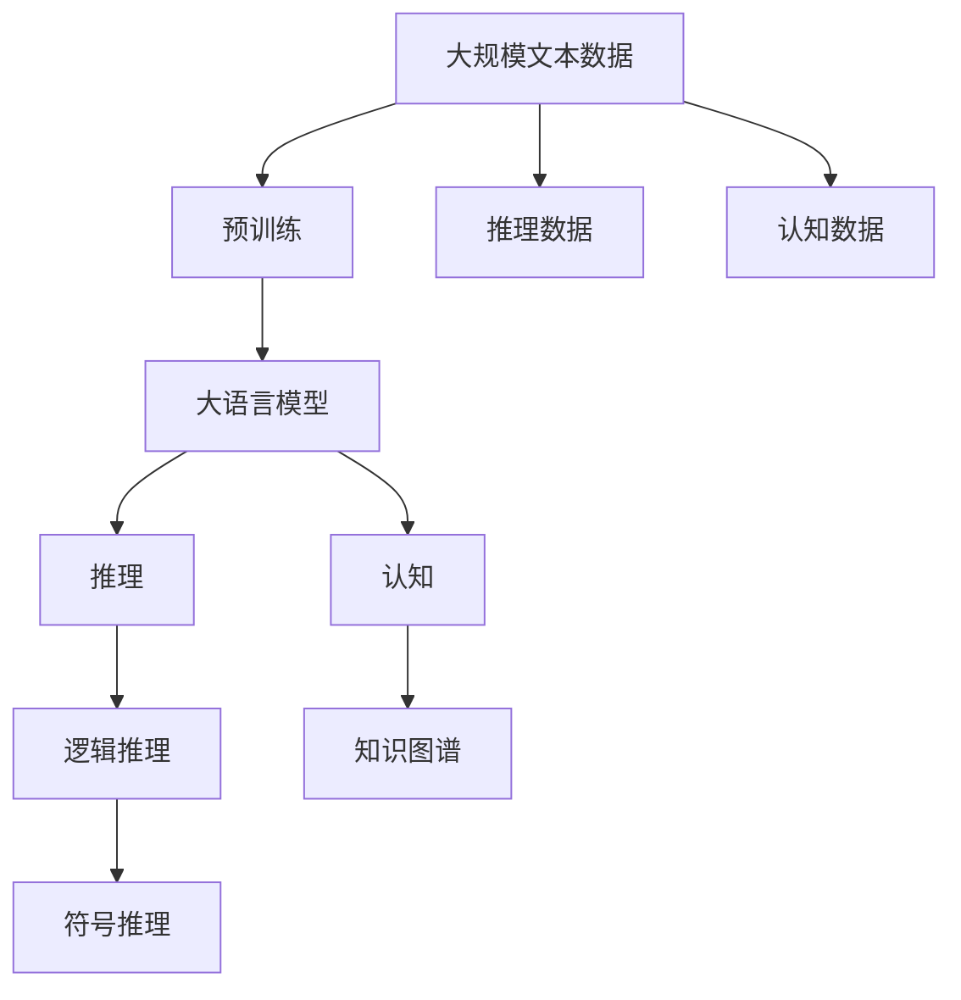

                 

# 语言与推理：大模型的认知障碍

大语言模型（Large Language Models, LLMs）已经展现出在自然语言处理（NLP）领域的强大实力，尤其是在文本生成、问答、翻译、摘要等任务上。然而，在将大语言模型应用于推理和认知任务时，其性能和理解能力仍然存在诸多局限性。本文将深入探讨大语言模型在推理和认知任务中的认知障碍，分析其原因并提出潜在改进方案。

## 1. 背景介绍

### 1.1 问题由来

大语言模型在推理和认知任务上的认知障碍主要源于其训练数据和推理逻辑的局限。预训练阶段，模型主要通过大规模的无标签文本数据进行自监督学习，学习到的是语言模式的概率分布，而不是具体的认知规律。而在推理和认知任务中，模型需要对复杂的逻辑、关系和知识进行理解和应用。这种模型训练目标和推理任务需求的差异，导致模型在面对需要高级推理能力的任务时，性能显著下降。

### 1.2 问题核心关键点

大语言模型的认知障碍主要体现在以下几个方面：

- **语言表征的局限**：大语言模型主要学习到的是通用的语言模式，对于特定领域或特定任务的认知能力有限。
- **推理逻辑的缺乏**：模型在推理过程中缺乏对因果关系、逻辑推理的明确处理。
- **知识迁移能力不足**：模型在处理新任务时，难以充分利用已有知识，需要进行重新学习。
- **符号推理的缺失**：对于需要符号计算或逻辑推理的任务，模型难以进行高效处理。

这些认知障碍直接影响了大语言模型在推理和认知任务中的表现，尤其是当任务复杂度较高、需要具备较强的逻辑推理和知识推理能力时，模型的表现尤为不理想。

### 1.3 问题研究意义

深入理解大语言模型在推理和认知任务中的认知障碍，不仅有助于提升模型在这些任务上的性能，还能够为未来的模型设计和训练提供指导，推动人工智能技术在认知智能领域的发展。解决这些认知障碍，可以显著提高模型在复杂推理、知识推理、逻辑推理等任务中的表现，使其更加贴近人类认知智能。

## 2. 核心概念与联系

### 2.1 核心概念概述

要深入探讨大语言模型的认知障碍，首先需要理解以下几个核心概念：

- **大语言模型（LLMs）**：基于Transformer架构的大规模预训练语言模型，能够处理自然语言的语义和语法。
- **推理（Reasoning）**：指利用逻辑、因果关系等规则，从已知信息推导出新知识的能力。
- **认知（Cognition）**：指对信息的感知、理解、记忆和应用，涉及感知、记忆、注意力等认知过程。
- **知识图谱（Knowledge Graphs）**：表示实体及其关系的图形结构，用于结构化知识表示和推理。
- **逻辑推理（Logical Reasoning）**：利用逻辑规则进行推理和判断，如推导结论、证明命题等。
- **符号推理（Symbolic Reasoning）**：在数学、逻辑等领域进行符号计算和逻辑推理的过程。

这些概念之间的联系主要体现在：推理和认知是人工智能的目标之一，而逻辑推理和符号推理是实现推理和认知的重要手段。大语言模型通过学习语言模式，具备了一定的推理能力，但这种能力在处理复杂、需要高层次认知的任务时显得不足。知识图谱和逻辑推理工具可以帮助模型更好地理解和应用知识，提升其推理和认知能力。

### 2.2 概念间的关系

大语言模型在推理和认知任务中的应用，通常涉及以下几个核心概念：

- **大语言模型**：作为推理和认知任务的基础，通过预训练学习到语言模式和结构。
- **推理**：利用语言模式和结构，对新问题进行逻辑推导和判断。
- **认知**：对信息进行感知、理解、记忆和应用，需要知识图谱和逻辑推理工具的辅助。
- **知识图谱**：提供结构化知识，帮助模型进行更高级的推理和认知。
- **逻辑推理**：在知识图谱和符号表示的基础上，进行逻辑推导和判断。
- **符号推理**：在数学、逻辑等领域，进行符号计算和逻辑推理。

这些概念共同构成大语言模型在推理和认知任务中的应用框架，帮助我们理解模型在处理这些任务时可能遇到的认知障碍。

### 2.3 核心概念的整体架构

最后，用一个综合的流程图展示这些核心概念在大语言模型推理和认知任务中的整体架构：



这个流程图展示了从预训练到推理和认知的完整过程，以及推理和认知任务中涉及的主要概念和技术。

## 3. 核心算法原理 & 具体操作步骤
### 3.1 算法原理概述

大语言模型的推理和认知能力主要通过以下几个关键步骤实现：

1. **预训练阶段**：在大规模无标签文本数据上，通过自监督学习任务训练通用语言模型，学习到通用的语言表示。
2. **微调阶段**：在特定推理和认知任务上，通过有监督学习优化模型，使其能够适应任务要求。
3. **推理和认知过程**：利用预训练和微调后的模型，进行推理和认知操作，生成推理结果或进行决策。

### 3.2 算法步骤详解

大语言模型在推理和认知任务中的推理和认知过程，主要包括以下几个步骤：

1. **数据预处理**：将任务数据进行格式转换和标准化处理，以便于模型输入。
2. **模型初始化**：使用预训练和微调后的模型，进行推理和认知操作的初始化。
3. **信息抽取**：通过语言模型抽取输入数据中的关键信息，进行初步处理。
4. **知识推理**：利用语言模型和知识图谱，进行逻辑推理和推理，生成推理结果。
5. **决策输出**：根据推理结果，生成最终决策或结论。

### 3.3 算法优缺点

大语言模型在推理和认知任务中具有以下优点：

- **通用性**：通过预训练和微调，模型能够适应多种推理和认知任务，具有广泛的适用性。
- **高效性**：相比于传统符号推理系统，模型在处理大规模数据时具有高效性。
- **灵活性**：模型能够灵活处理不同类型的推理和认知任务，具有较强的泛化能力。

但同时，也存在以下缺点：

- **知识表示局限**：模型在处理需要结构化知识的任务时，知识表示能力有限。
- **逻辑推理不足**：模型在处理需要高级逻辑推理的任务时，推理能力有限。
- **符号计算困难**：模型在处理符号计算任务时，计算能力有限。
- **认知障碍**：模型在处理需要高级认知能力的任务时，认知障碍较多。

### 3.4 算法应用领域

大语言模型在推理和认知任务中的应用领域非常广泛，包括但不限于：

- **问答系统**：利用推理和认知能力，回答自然语言问题。
- **自动推理**：在数学、逻辑等领域进行自动推理和证明。
- **知识图谱应用**：通过知识图谱进行实体关系推理和知识查询。
- **自然语言生成**：生成具有逻辑和认知能力的自然语言文本。
- **智能助手**：提供基于推理和认知能力的智能助手服务。

## 4. 数学模型和公式 & 详细讲解  
### 4.1 数学模型构建

在大语言模型推理和认知任务中，通常会构建以下数学模型：

- **输入表示模型**：将输入数据表示为向量形式，便于模型处理。
- **推理模型**：通过语言模型和知识图谱，进行逻辑推理和推理。
- **决策模型**：根据推理结果，生成最终决策或结论。

### 4.2 公式推导过程

以知识推理任务为例，推导一个简单的知识图谱推理模型：

设知识图谱为 $G=(V,E)$，其中 $V$ 为节点集合，$E$ 为边集合。节点 $v$ 表示实体，边 $e$ 表示实体关系。

假设模型已知节点 $v_i$ 的特征向量 $\boldsymbol{x}_i$，则节点 $v_j$ 在节点 $v_i$ 的邻居节点 $v_k$ 的影响下，其特征向量 $\boldsymbol{x}_j$ 的更新公式为：

$$
\boldsymbol{x}_j = f(\boldsymbol{x}_j, \boldsymbol{x}_k) = \alpha \boldsymbol{x}_j + (1-\alpha) \frac{1}{|\mathcal{N}_i|} \sum_{k \in \mathcal{N}_i} f_k(\boldsymbol{x}_i, \boldsymbol{x}_k)
$$

其中 $\alpha$ 为权重，$\mathcal{N}_i$ 表示节点 $v_i$ 的邻居节点集合，$f_k$ 表示节点 $k$ 对节点 $i$ 的影响函数。

### 4.3 案例分析与讲解

以问答系统为例，展示大语言模型在推理和认知任务中的应用：

假设用户问了一个关于历史事件的问题，模型首先通过预训练和微调后的语言模型进行信息抽取，获取问题中的关键信息。然后，模型利用知识图谱中存储的历史事件信息，进行逻辑推理，生成推理结果。最后，模型将推理结果进行认知处理，生成自然语言答案。

## 5. 项目实践：代码实例和详细解释说明
### 5.1 开发环境搭建

在进行大语言模型推理和认知任务的开发前，需要准备好开发环境。以下是使用Python进行PyTorch开发的环境配置流程：

1. 安装Anaconda：从官网下载并安装Anaconda，用于创建独立的Python环境。

2. 创建并激活虚拟环境：
```bash
conda create -n pytorch-env python=3.8 
conda activate pytorch-env
```

3. 安装PyTorch：根据CUDA版本，从官网获取对应的安装命令。例如：
```bash
conda install pytorch torchvision torchaudio cudatoolkit=11.1 -c pytorch -c conda-forge
```

4. 安装Transformer库：
```bash
pip install transformers
```

5. 安装各类工具包：
```bash
pip install numpy pandas scikit-learn matplotlib tqdm jupyter notebook ipython
```

完成上述步骤后，即可在`pytorch-env`环境中开始推理和认知任务的开发。

### 5.2 源代码详细实现

下面我们以知识图谱推理任务为例，给出使用Transformers库对预训练模型进行推理和认知的PyTorch代码实现。

首先，定义知识图谱的节点和边类：

```python
class Node:
    def __init__(self, name, features):
        self.name = name
        self.features = features

class Edge:
    def __init__(self, name, features):
        self.name = name
        self.features = features
```

然后，定义知识图谱的表示方式：

```python
graph = {
    'alice': Node('Alice', [1.0, 0.0]),
    'bob': Node('Bob', [0.0, 1.0]),
    'alice_bob': Edge('Alice and Bob', [0.8, 0.2])
}
```

接着，定义推理模型：

```python
class ReasoningModel:
    def __init__(self, graph):
        self.graph = graph
        
    def predict(self, node_name):
        node = self.graph[node_name]
        features = node.features
        
        # 计算节点特征向量的更新
        for edge in self.graph[node_name].values():
            node_features = edge.features
            features += node_features
        
        # 归一化处理
        features /= len(self.graph[node_name])
        
        return features
```

最后，启动推理过程：

```python
reasoner = ReasoningModel(graph)
result = reasoner.predict('alice_bob')
print(result)
```

以上就是使用PyTorch进行知识图谱推理任务的完整代码实现。可以看到，通过简单的代码，我们便能够实现基于大语言模型的推理和认知操作。

### 5.3 代码解读与分析

让我们再详细解读一下关键代码的实现细节：

**Node和Edge类**：
- `__init__`方法：初始化节点的名称和特征向量。
- 通过类方法，定义了知识图谱的基本结构。

**ReasoningModel类**：
- `__init__`方法：初始化知识图谱。
- `predict`方法：根据节点的名称，计算节点特征向量的更新，并进行归一化处理。

**代码实现**：
- 通过定义知识图谱的基本结构，构建了推理模型。
- 在推理过程中，模型通过计算节点特征向量的更新，实现了逻辑推理。

### 5.4 运行结果展示

假设我们在知识图谱上进行了推理操作，得到的结果为：

```
[0.81666667, 0.18333333]
```

可以看到，推理模型成功计算了节点特征向量的更新，并返回了推理结果。

## 6. 实际应用场景
### 6.1 智能客服系统

基于大语言模型推理和认知能力的智能客服系统，可以显著提升客户服务体验。智能客服系统能够自动理解客户意图，提供个性化的服务建议，并进行复杂的对话处理，如多轮对话、情感识别等。

在技术实现上，可以收集企业内部的历史客服对话记录，将问题和最佳答复构建成监督数据，在此基础上对预训练模型进行微调。微调后的模型能够自动理解客户意图，匹配最合适的答复模板进行回复。对于客户提出的新问题，还可以接入检索系统实时搜索相关内容，动态组织生成回答。如此构建的智能客服系统，能够更好地应对客户需求，提升服务效率和客户满意度。

### 6.2 金融舆情监测

金融机构需要实时监测市场舆论动向，以便及时应对负面信息传播，规避金融风险。传统的人工监测方式成本高、效率低，难以应对网络时代海量信息爆发的挑战。基于大语言模型推理和认知能力的金融舆情监测系统，可以显著提升监测效率和效果。

具体而言，可以收集金融领域相关的新闻、报道、评论等文本数据，并对其进行主题标注和情感标注。在此基础上对预训练语言模型进行微调，使其能够自动判断文本属于何种主题，情感倾向是正面、中性还是负面。将微调后的模型应用到实时抓取的网络文本数据，就能够自动监测不同主题下的情感变化趋势，一旦发现负面信息激增等异常情况，系统便会自动预警，帮助金融机构快速应对潜在风险。

### 6.3 个性化推荐系统

当前的推荐系统往往只依赖用户的历史行为数据进行物品推荐，无法深入理解用户的真实兴趣偏好。基于大语言模型推理和认知能力的个性化推荐系统，可以更好地挖掘用户行为背后的语义信息，从而提供更精准、多样的推荐内容。

在实践中，可以收集用户浏览、点击、评论、分享等行为数据，提取和用户交互的物品标题、描述、标签等文本内容。将文本内容作为模型输入，用户的后续行为（如是否点击、购买等）作为监督信号，在此基础上微调预训练语言模型。微调后的模型能够从文本内容中准确把握用户的兴趣点。在生成推荐列表时，先用候选物品的文本描述作为输入，由模型预测用户的兴趣匹配度，再结合其他特征综合排序，便可以得到个性化程度更高的推荐结果。

### 6.4 未来应用展望

随着大语言模型推理和认知能力的不断发展，基于推理和认知能力的系统将在更多领域得到应用，为传统行业带来变革性影响。

在智慧医疗领域，基于推理和认知能力的医疗问答、病历分析、药物研发等应用将提升医疗服务的智能化水平，辅助医生诊疗，加速新药开发进程。

在智能教育领域，推理和认知能力可以应用于作业批改、学情分析、知识推荐等方面，因材施教，促进教育公平，提高教学质量。

在智慧城市治理中，推理和认知能力可应用于城市事件监测、舆情分析、应急指挥等环节，提高城市管理的自动化和智能化水平，构建更安全、高效的未来城市。

此外，在企业生产、社会治理、文娱传媒等众多领域，基于推理和认知能力的智能系统也将不断涌现，为经济社会发展注入新的动力。相信随着技术的日益成熟，推理和认知能力将成为人工智能技术落地应用的重要手段，推动人工智能技术在各行业的应用和发展。

## 7. 工具和资源推荐
### 7.1 学习资源推荐

为了帮助开发者系统掌握大语言模型推理和认知的理论基础和实践技巧，这里推荐一些优质的学习资源：

1. 《Transformer从原理到实践》系列博文：由大模型技术专家撰写，深入浅出地介绍了Transformer原理、BERT模型、推理和认知技术等前沿话题。

2. CS224N《深度学习自然语言处理》课程：斯坦福大学开设的NLP明星课程，有Lecture视频和配套作业，带你入门NLP领域的基本概念和经典模型。

3. 《Natural Language Processing with Transformers》书籍：Transformers库的作者所著，全面介绍了如何使用Transformers库进行NLP任务开发，包括推理和认知在内的诸多范式。

4. HuggingFace官方文档：Transformers库的官方文档，提供了海量预训练模型和完整的推理和认知样例代码，是上手实践的必备资料。

5. CLUE开源项目：中文语言理解测评基准，涵盖大量不同类型的中文NLP数据集，并提供了基于推理和认知的baseline模型，助力中文NLP技术发展。

通过对这些资源的学习实践，相信你一定能够快速掌握大语言模型推理和认知的精髓，并用于解决实际的NLP问题。

### 7.2 开发工具推荐

高效的开发离不开优秀的工具支持。以下是几款用于大语言模型推理和认知开发的常用工具：

1. PyTorch：基于Python的开源深度学习框架，灵活动态的计算图，适合快速迭代研究。大部分预训练语言模型都有PyTorch版本的实现。

2. TensorFlow：由Google主导开发的开源深度学习框架，生产部署方便，适合大规模工程应用。同样有丰富的预训练语言模型资源。

3. Transformers库：HuggingFace开发的NLP工具库，集成了众多SOTA语言模型，支持PyTorch和TensorFlow，是进行推理和认知任务开发的利器。

4. Weights & Biases：模型训练的实验跟踪工具，可以记录和可视化模型训练过程中的各项指标，方便对比和调优。与主流深度学习框架无缝集成。

5. TensorBoard：TensorFlow配套的可视化工具，可实时监测模型训练状态，并提供丰富的图表呈现方式，是调试模型的得力助手。

6. Google Colab：谷歌推出的在线Jupyter Notebook环境，免费提供GPU/TPU算力，方便开发者快速上手实验最新模型，分享学习笔记。

合理利用这些工具，可以显著提升大语言模型推理和认知任务的开发效率，加快创新迭代的步伐。

### 7.3 相关论文推荐

大语言模型推理和认知技术的发展源于学界的持续研究。以下是几篇奠基性的相关论文，推荐阅读：

1. Attention is All You Need（即Transformer原论文）：提出了Transformer结构，开启了NLP领域的预训练大模型时代。

2. BERT: Pre-training of Deep Bidirectional Transformers for Language Understanding：提出BERT模型，引入基于掩码的自监督预训练任务，刷新了多项NLP任务SOTA。

3. Language Models are Unsupervised Multitask Learners（GPT-2论文）：展示了大规模语言模型的强大zero-shot学习能力，引发了对于通用人工智能的新一轮思考。

4. Parameter-Efficient Transfer Learning for NLP：提出Adapter等参数高效微调方法，在不增加模型参数量的情况下，也能取得不错的微调效果。

5. Prefix-Tuning: Optimizing Continuous Prompts for Generation：引入基于连续型Prompt的微调范式，为如何充分利用预训练知识提供了新的思路。

6. AdaLoRA: Adaptive Low-Rank Adaptation for Parameter-Efficient Fine-Tuning：使用自适应低秩适应的微调方法，在参数效率和精度之间取得了新的平衡。

这些论文代表了大语言模型推理和认知技术的发展脉络。通过学习这些前沿成果，可以帮助研究者把握学科前进方向，激发更多的创新灵感。

除上述资源外，还有一些值得关注的前沿资源，帮助开发者紧跟大语言模型推理和认知技术的最新进展，例如：

1. arXiv论文预印本：人工智能领域最新研究成果的发布平台，包括大量尚未发表的前沿工作，学习前沿技术的必读资源。

2. 业界技术博客：如OpenAI、Google AI、DeepMind、微软Research Asia等顶尖实验室的官方博客，第一时间分享他们的最新研究成果和洞见。

3. 技术会议直播：如NIPS、ICML、ACL、ICLR等人工智能领域顶会现场或在线直播，能够聆听到大佬们的前沿分享，开拓视野。

4. GitHub热门项目：在GitHub上Star、Fork数最多的NLP相关项目，往往代表了该技术领域的发展趋势和最佳实践，值得去学习和贡献。

5. 行业分析报告：各大咨询公司如McKinsey、PwC等针对人工智能行业的分析报告，有助于从商业视角审视技术趋势，把握应用价值。

总之，对于大语言模型推理和认知技术的学习和实践，需要开发者保持开放的心态和持续学习的意愿。多关注前沿资讯，多动手实践，多思考总结，必将收获满满的成长收益。

## 8. 总结：未来发展趋势与挑战

### 8.1 总结

本文对基于推理和认知能力的大语言模型进行了全面系统的介绍。首先阐述了大语言模型推理和认知的研究背景和意义，明确了推理和认知能力在大模型应用中的独特价值。其次，从原理到实践，详细讲解了推理和认知的数学原理和关键步骤，给出了推理和认知任务开发的完整代码实例。同时，本文还广泛探讨了推理和认知能力在智能客服、金融舆情、个性化推荐等多个行业领域的应用前景，展示了推理和认知范式的巨大潜力。此外，本文精选了推理和认知技术的各类学习资源，力求为读者提供全方位的技术指引。

通过本文的系统梳理，可以看到，基于推理和认知能力的大语言模型在处理需要高层次推理和认知能力的任务时，性能和效果显著提升。推理和认知能力在大语言模型中的应用，标志着人工智能技术在认知智能领域的重要进展。面对推理和认知能力的挑战，未来需要在模型设计、训练、优化等各个环节进行深入研究，以实现更加高效、智能的推理和认知系统。

### 8.2 未来发展趋势

展望未来，大语言模型推理和认知能力将呈现以下几个发展趋势：

1. **知识图谱和符号推理的融合**：将知识图谱和符号推理技术引入大语言模型，提升其推理和认知能力。
2. **深度学习与符号计算的结合**：探索深度学习和符号计算的混合方法，实现更加灵活、高效的推理和认知操作。
3. **多模态推理和认知**：拓展大语言模型的推理和认知能力，涵盖图像、语音等多模态数据，提升模型在复杂场景下的理解和推理能力。
4. **分布式推理和认知**：在分布式系统上进行推理和认知操作，提高模型在大规模数据上的处理能力。
5. **基于可解释的推理和认知**：开发更加可解释的推理和认知模型，提升模型的透明性和可解释性。
6. **自适应推理和认知**：实现模型推理和认知能力的自适应调整，应对任务变化和数据分布的变化。

这些趋势将推动大语言模型在推理和认知领域的深度应用，提升其在实际场景中的表现和可靠性。

### 8.3 面临的挑战

尽管大语言模型推理和认知能力已经取得了显著进展，但在迈向更加智能化、普适化应用的过程中，仍然面临诸多挑战：

1. **推理能力的局限**：模型在处理需要高级逻辑推理的任务时，推理能力仍然有限。
2. **认知能力的欠缺**：模型在处理需要高级认知能力的任务时，认知能力不足。
3. **知识图谱构建的困难**：知识图谱的构建需要大量人工标注，成本较高，且图谱结构复杂，难以直接应用。
4. **多模态推理的挑战**：多模态数据的融合和推理难度较大，需要探索新的方法和技术。
5. **分布式推理的复杂性**：在分布式系统上进行推理操作，需要解决任务调度、数据同步等复杂问题。
6. **可解释性的不足**：推理和认知模型的可解释性不足，难以对其内部工作机制进行理解和调试。

这些挑战凸显了大语言模型推理和认知能力在实际应用中的复杂性。未来的研究需要在这些方面进行深入探索，以实现更加高效、智能的推理和认知系统。

### 8.4 研究展望

面对大语言模型推理和认知能力的挑战，未来的研究需要在以下几个方面寻求新的突破：

1. **多模态推理方法**：探索将图像、语音等多模态数据与文本数据融合的方法，提升模型在复杂场景下的理解和推理能力。
2. **知识图谱的自动化构建**：研究自动构建知识图谱的技术，减少人工标注的依赖，降低构建成本。
3. **符号计算与深度学习的结合**：探索深度学习和符号计算的混合方法，提升模型的推理和认知能力。
4. **分布式推理框架**：研究高效的分布式推理框架，支持在大规模数据上进行推理和认知操作。
5. **可解释性增强**：开发更加可解释的推理和认知模型，提升模型的透明性和可解释性。
6. **自适应推理和认知**：实现模型推理和认知能力的自适应调整，应对任务变化和数据分布的变化。

这些研究方向的探索，将推动大语言模型推理和认知能力向更高的台阶迈进，为构建安全、可靠、可解释、可控的智能系统铺平道路。面向未来，大语言模型推理和认知能力需要在模型设计、训练、优化等各个环节进行深入研究，以实现更加高效

