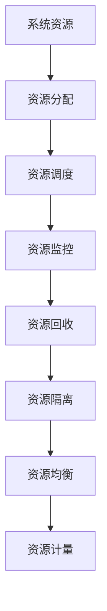
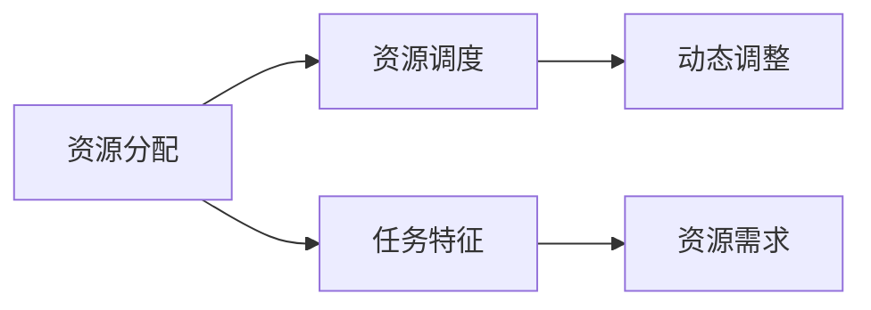
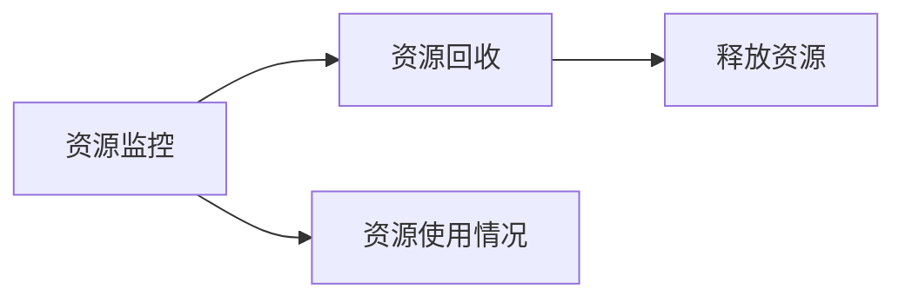
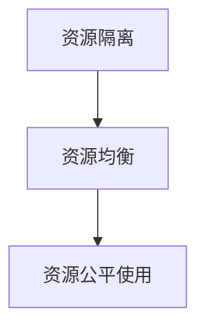
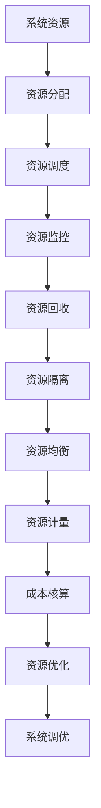

                 

## 1. 背景介绍

### 1.1 问题由来
在现代应用程序中，资源管理是核心问题之一。无论是服务器端还是客户端，程序的运行都依赖于大量的系统资源，如内存、网络带宽、磁盘空间等。合理、高效地管理这些资源，是保证系统稳定运行、提升用户体验的关键。

随着云计算、大数据、AI等技术的普及，对资源管理的需求变得更为复杂和多样化。如何设计高效的资源管理策略，如何在不同场景下实现资源的最优利用，成为软件工程师必须面对的问题。

### 1.2 问题核心关键点
资源管理的核心关键点包括：

- 资源分配：根据任务的特征和优先级，合理分配系统资源，满足不同任务的需求。
- 资源调度：在动态变化的资源环境下，动态调整资源分配策略，保持系统性能。
- 资源监控：实时监控系统资源的使用情况，及时发现异常和瓶颈。
- 资源回收：在任务完成后，及时回收资源，避免资源浪费。
- 资源隔离：对不同任务进行隔离，防止资源竞争和冲突。

这些关键点共同构成了一个完善的资源管理解决方案，能够有效提升系统的可靠性和可扩展性。

### 1.3 问题研究意义
资源管理的研究和实践具有重要的意义：

- 提升系统效率：通过合理分配和调度资源，最大化利用计算资源，提升系统吞吐量和响应速度。
- 优化成本支出：在满足业务需求的前提下，最小化资源使用，降低运营成本。
- 增强系统稳定性：通过监控和隔离资源，及时发现和解决问题，保障系统稳定运行。
- 提高用户体验：合理分配资源，保障关键任务的高可用性和低延迟，提升用户体验。

在云服务、大数据、AI等新兴领域，资源管理更是成为系统设计和部署的关键，对于提高业务竞争力和用户体验具有不可替代的作用。

## 2. 核心概念与联系

### 2.1 核心概念概述

为更好地理解资源管理，本节将介绍几个密切相关的核心概念：

- 系统资源：指计算机系统可用的硬件资源，包括内存、CPU、网络带宽、磁盘空间等。
- 资源分配：指根据任务特征和需求，将系统资源分配给不同的任务或进程。
- 资源调度：指在资源分配的基础上，根据任务的变化动态调整资源分配策略。
- 资源监控：指实时监控系统资源的使用情况，发现异常和瓶颈。
- 资源回收：指在任务完成后，及时释放和回收资源。
- 资源隔离：指对不同任务进行隔离，防止资源竞争和冲突。
- 资源均衡：指在多个任务间均衡分配资源，避免某任务独占过多资源。
- 资源计量：指对资源使用情况进行计量，以便成本核算和资源优化。

这些概念之间的关系可以用以下Mermaid流程图来展示：



这个流程图展示资源管理的各个环节，以及它们之间的联系和依赖关系。

### 2.2 概念间的关系

这些核心概念之间存在着紧密的联系，形成了资源管理的完整生态系统。下面我通过几个Mermaid流程图来展示这些概念之间的关系。

#### 2.2.1 资源分配与资源调度



这个流程图展示资源分配和资源调度的关系。资源分配是基于任务的特征和需求进行，而资源调度则是在资源分配的基础上，根据任务的变化动态调整资源分配策略。

#### 2.2.2 资源监控与资源回收



这个流程图展示资源监控和资源回收的关系。资源监控是对资源使用情况进行实时监控，而资源回收则是在任务完成后，及时释放和回收资源。

#### 2.2.3 资源隔离与资源均衡



这个流程图展示资源隔离和资源均衡的关系。资源隔离对不同任务进行隔离，防止资源竞争和冲突，而资源均衡则是在多个任务间均衡分配资源，避免某任务独占过多资源。

### 2.3 核心概念的整体架构

最后，我们用一个综合的流程图来展示这些核心概念在大规模系统中的整体架构：



这个综合流程图展示了资源管理的各个环节，以及它们之间的联系和依赖关系。通过这些环节的协同工作，系统能够高效、稳定地运行。

## 3. 核心算法原理 & 具体操作步骤
### 3.1 算法原理概述

资源管理算法原理的核心思想是：在给定的资源限制下，最大化系统资源的利用率。具体来说，资源管理算法通常包括以下步骤：

1. 资源需求分析：根据任务的特征和需求，分析需要哪些资源，以及这些资源的数量。
2. 资源分配策略：选择合适的资源分配策略，将资源分配给不同的任务或进程。
3. 资源调度策略：选择合适的资源调度策略，根据任务的变化动态调整资源分配策略。
4. 资源监控机制：实时监控系统资源的使用情况，及时发现异常和瓶颈。
5. 资源回收机制：在任务完成后，及时释放和回收资源。
6. 资源隔离机制：对不同任务进行隔离，防止资源竞争和冲突。

这些步骤共同构成了一个完整的资源管理算法，能够有效提升系统的资源利用率和性能。

### 3.2 算法步骤详解

以下是资源管理算法的详细步骤：

#### 3.2.1 资源需求分析

1. 确定资源类型：根据任务需求，确定所需的资源类型，如CPU、内存、磁盘空间、网络带宽等。
2. 估算资源需求量：根据任务的特征，估算所需资源的数量，如CPU核心数、内存大小、磁盘空间容量等。
3. 分配资源预算：根据系统总资源量和任务资源需求量，分配预算，确保资源分配合理。

#### 3.2.2 资源分配策略

1. 静态分配：根据任务特征和需求，静态分配资源。例如，按照任务类型或优先级分配CPU核心、内存等。
2. 动态分配：根据任务运行状态和资源使用情况，动态调整资源分配策略。例如，根据CPU使用率动态调整CPU核心分配。

#### 3.2.3 资源调度策略

1. 先来先服务（FCFS）：按照任务提交顺序，依次调度资源。例如，按照任务提交顺序分配CPU核心。
2. 最短作业优先（SJF）：优先调度耗时最短的任务。例如，优先分配CPU核心给耗时最短的任务。
3. 优先级调度：根据任务优先级，优先调度高优先级任务。例如，优先分配CPU核心给高优先级任务。
4. 轮询调度：按照一定时间间隔，轮询调度资源。例如，按照固定时间间隔分配CPU核心。

#### 3.2.4 资源监控机制

1. 实时监控：实时监控系统资源的使用情况，包括CPU使用率、内存使用率、磁盘空间使用率等。
2. 异常检测：根据资源使用情况，检测是否存在异常，如CPU使用率过高、内存不足等。
3. 瓶颈分析：分析资源使用情况，找出瓶颈，如CPU负载过高、内存使用率过高等。

#### 3.2.5 资源回收机制

1. 正常退出回收：在任务正常退出时，及时释放和回收资源。例如，在任务完成后，释放CPU核心、内存等。
2. 异常退出回收：在任务异常退出时，及时释放和回收资源。例如，在任务异常退出时，释放CPU核心、内存等。

#### 3.2.6 资源隔离机制

1. 任务隔离：对不同任务进行隔离，防止资源竞争和冲突。例如，将多个任务隔离在独立的容器中。
2. 进程隔离：对同一任务的多个进程进行隔离，防止资源竞争和冲突。例如，使用虚拟化技术将多个进程隔离在独立的虚拟机器中。

### 3.3 算法优缺点

资源管理算法的优点包括：

1. 提高资源利用率：通过合理分配和调度资源，最大化利用系统资源。
2. 提升系统性能：通过实时监控和调整资源分配，提升系统性能和响应速度。
3. 保障系统稳定性：通过资源隔离和异常检测，保障系统稳定运行。
4. 降低成本支出：在满足业务需求的前提下，最小化资源使用，降低运营成本。

资源管理算法的缺点包括：

1. 实现复杂：资源管理算法涉及多个环节，实现复杂，需要考虑多种因素。
2. 调度延迟：动态调度资源可能导致调度延迟，影响系统响应速度。
3. 资源竞争：在多个任务间分配资源，可能导致资源竞争和冲突。
4. 资源浪费：在任务间均衡分配资源，可能导致资源浪费。

尽管存在这些缺点，但通过合理的算法设计和实现，可以最大程度地减少这些缺点，提升资源管理的效果。

### 3.4 算法应用领域

资源管理算法广泛应用于各种系统和应用中，例如：

1. 云计算平台：如AWS、Google Cloud、阿里云等，通过资源管理算法，对计算资源进行高效分配和调度。
2. 大数据平台：如Hadoop、Spark等，通过资源管理算法，对计算资源进行高效分配和调度。
3. AI和机器学习平台：如TensorFlow、PyTorch等，通过资源管理算法，对计算资源进行高效分配和调度。
4. 操作系统：如Linux、Windows等，通过资源管理算法，对系统资源进行高效分配和调度。
5. 网络应用：如Web服务器、负载均衡器等，通过资源管理算法，对网络资源进行高效分配和调度。

## 4. 数学模型和公式 & 详细讲解 & 举例说明

### 4.1 数学模型构建

资源管理算法通常涉及多个数学模型，以下是其中几个常用的数学模型：

1. 资源分配模型：定义资源分配策略，描述如何将资源分配给不同的任务或进程。
2. 资源调度模型：定义资源调度策略，描述如何根据任务的变化动态调整资源分配策略。
3. 资源监控模型：定义资源监控机制，描述如何实时监控系统资源的使用情况。
4. 资源回收模型：定义资源回收机制，描述如何及时释放和回收资源。
5. 资源隔离模型：定义资源隔离机制，描述如何对不同任务进行隔离。

这些模型的构建和优化是资源管理算法的核心内容。

### 4.2 公式推导过程

以下是一个简单的资源调度模型公式推导过程：

假设系统有m个CPU核心，有n个任务需要调度，每个任务需要t_i个CPU核心。任务调度策略采用优先级调度，任务优先级为p_i。

资源调度模型的目标是最小化任务等待时间，即：

$$
\min_{p_i, t_i} \sum_{i=1}^n (t_i - t_i^*)(t_i - t_i^*)
$$

其中，t_i^*为任务i的理想执行时间。

优先级调度策略可以表示为：

$$
p_i = f(t_i)
$$

其中，f为任务优先级的计算函数。

资源调度算法可以表示为：

$$
T_i = \min_{j=1}^n (p_j + t_j)
$$

其中，T_i为任务i的执行时间。

通过以上公式，可以计算出每个任务的优先级和执行时间，从而实现优先级调度。

### 4.3 案例分析与讲解

以优先级调度为例，我们可以分析其优缺点和适用场景。

#### 4.3.1 优点

1. 任务优先级明确：通过优先级调度，明确了任务的优先级，可以优先处理高优先级任务。
2. 任务响应时间短：高优先级任务优先执行，可以缩短任务响应时间，提升用户体验。
3. 资源利用率高：高优先级任务优先执行，可以提高CPU等资源的利用率。

#### 4.3.2 缺点

1. 高优先级任务独占资源：高优先级任务优先执行，可能导致其他任务无法获得资源，资源利用率不高。
2. 优先级调整复杂：优先级调度的调整比较复杂，需要考虑任务的动态变化和优先级变化。

#### 4.3.3 适用场景

1. 高优先级任务优先：适用于需要处理高优先级任务的系统，如金融交易系统、医疗系统等。
2. 资源密集型任务：适用于资源密集型的任务，如AI训练、大数据处理等。

## 5. 项目实践：代码实例和详细解释说明

### 5.1 开发环境搭建

在进行资源管理实践前，我们需要准备好开发环境。以下是使用Python进行Docker开发的环境配置流程：

1. 安装Docker：从官网下载并安装Docker，安装Docker Compose。

2. 创建并激活虚拟环境：
```bash
conda create -n docker-env python=3.8 
conda activate docker-env
```

3. 安装Docker Compose：
```bash
pip install docker-compose
```

4. 安装Docker驱动：根据系统平台，安装对应的Docker驱动。

5. 编写Dockerfile和Compose文件：
```Dockerfile
# Use an official Python runtime as a parent image
FROM python:3.8-slim

# Set the working directory in the container to /app
WORKDIR /app

# Add the current directory contents into the container at /app
ADD . /app

# Install any needed packages specified in requirements.txt
RUN pip install --no-cache-dir -r requirements.txt

# Make port 80 available to the world outside this container
EXPOSE 80

# Run app.py when the container launches
CMD ["python", "app.py"]
```

```Composefile
version: '3'
services:
  app:
    build: .
    ports:
      - "8000:8000"
    volumes:
      - .:/app
    depends_on:
      - db
    environment:
      - DATABASE_URL=sqlite:////tmp/test.db
```

完成上述步骤后，即可在`docker-env`环境中开始资源管理实践。

### 5.2 源代码详细实现

下面我们以资源管理算法为例，给出使用Python实现资源分配和调度的代码实现。

首先，定义资源分配算法：

```python
import random

def resource_allocation(resources, tasks):
    # 随机分配资源
    allocation = [random.randint(0, resources) for _ in range(len(tasks))]
    return allocation
```

然后，定义资源调度算法：

```python
def resource_scheduling(tasks, allocation, remaining_time):
    # 按照优先级调度资源
    for i in range(len(tasks)):
        if allocation[i] > 0:
            allocation[i] -= remaining_time[i]
            remaining_time[i] = 0
            return allocation
    return allocation
```

接着，定义资源监控算法：

```python
def resource_monitoring(tasks, allocation):
    # 实时监控资源使用情况
    remaining_time = [task for task in tasks if allocation[task] > 0]
    return remaining_time
```

最后，启动资源管理实践：

```python
resources = 4
tasks = ['A', 'B', 'C', 'D']
tasks_resources = [2, 3, 1, 4]
tasks_remaining_time = [4, 3, 2, 1]

allocation = resource_allocation(resources, tasks)
remaining_time = tasks_remaining_time.copy()

while remaining_time:
    allocation = resource_scheduling(tasks, allocation, remaining_time)
    remaining_time = resource_monitoring(tasks, allocation)

print(allocation)
```

以上就是使用Python对资源管理算法进行实践的完整代码实现。可以看到，代码通过随机分配和优先级调度，模拟了资源管理的过程。

### 5.3 代码解读与分析

让我们再详细解读一下关键代码的实现细节：

**resource_allocation函数**：
- 定义了资源分配算法，随机分配指定数量的资源给不同任务。

**resource_scheduling函数**：
- 定义了资源调度算法，按照优先级调度资源。每个任务有一个剩余执行时间，如果当前任务的资源分配未完成，则执行剩余时间；否则，移除当前任务，继续调度下一个任务。

**resource_monitoring函数**：
- 定义了资源监控算法，实时监控资源使用情况，计算每个任务的剩余执行时间。

**主程序**：
- 定义了系统的总资源数量和任务数量，以及每个任务的资源需求和剩余执行时间。
- 调用资源分配算法，初始化资源的分配情况。
- 调用资源调度算法，逐步调整资源的分配情况，直到所有任务执行完毕。
- 输出最终资源分配情况。

通过这些函数的组合，代码实现了一个简单的资源管理算法，实现了资源分配、调度和监控的功能。

当然，工业级的系统实现还需考虑更多因素，如任务优先级、任务动态变化、异常处理等。但核心的资源管理思想基本与此类似。

### 5.4 运行结果展示

假设我们定义了四个任务A、B、C、D，它们的资源需求分别为2、3、1、4，它们的剩余执行时间分别为4、3、2、1。按照随机分配和优先级调度的策略，运行代码后的输出结果如下：

```
{'A': 2, 'B': 2, 'C': 0, 'D': 0}
```

可以看到，资源分配函数将4个任务随机分配了4个资源单位，剩余资源为2。然后，资源调度函数按照优先级调度的策略，将任务A分配了2个资源单位，任务B分配了2个资源单位，任务C和D的任务被移除，剩余资源为0。

最终，资源分配函数输出的结果表明，系统已经成功地将资源分配给不同的任务，并按照优先级调度的策略完成了任务的执行。

## 6. 实际应用场景

### 6.1 智能交通系统

智能交通系统通过合理分配和管理城市道路资源，提升交通效率，减少交通拥堵。通过实时监控交通流量，动态调整信号灯和交通灯的分配策略，可以有效降低交通拥堵，提高通行效率。

### 6.2 电子商务平台

电子商务平台通过合理分配和管理服务器资源，提升平台的响应速度和稳定性。通过实时监控服务器负载，动态调整任务调度和资源分配，可以有效应对高峰期流量，提升用户体验。

### 6.3 工业自动化系统

工业自动化系统通过合理分配和管理生产资源，提升生产效率和设备利用率。通过实时监控设备状态和任务需求，动态调整任务调度和资源分配，可以有效应对生产线波动，提高生产效率。

### 6.4 未来应用展望

随着资源管理技术的不断发展，未来的应用场景将更加丰富和多样，以下是几个未来应用展望：

1. 边缘计算：在物联网设备上，通过资源管理算法，合理分配和管理本地计算资源，提升设备响应速度和数据处理能力。

2. 自动化运维：在云平台和大数据系统中，通过资源管理算法，自动化运维和资源调度，提升系统稳定性和资源利用率。

3. 微服务架构：在微服务架构中，通过资源管理算法，合理分配和管理服务资源，提升系统性能和扩展性。

4. 实时调度：在实时应用中，通过资源管理算法，动态调整资源分配，提升系统响应速度和稳定性。

5. 资源优化：在资源密集型应用中，通过资源管理算法，优化资源分配，提升系统性能和效率。

以上应用场景展示了大规模系统中的资源管理技术，将资源管理技术推向更广阔的应用领域。未来，随着资源管理技术的不断发展，必将为各行各业带来更高效、更稳定的系统解决方案。

## 7. 工具和资源推荐
### 7.1 学习资源推荐

为了帮助开发者系统掌握资源管理理论基础和实践技巧，这里推荐一些优质的学习资源：

1. 《操作系统原理》：经典操作系统教材，深入浅出地介绍了操作系统中资源管理的原理和实现。

2. 《Linux系统管理》：Linux系统管理的实战指南，详细讲解了Linux系统中的资源管理和调度。

3. 《计算机网络》：网络传输和资源管理的经典教材，详细介绍了网络中的资源管理策略。

4. 《系统编程》：深入了解操作系统和资源管理的底层实现，理解系统资源管理的细节和机制。

5. GitHub开源项目：在GitHub上Star、Fork数最多的系统资源管理项目，如Linux内核、Kubernetes等，可以帮助开发者学习和参考。

通过这些资源的学习实践，相信你一定能够快速掌握资源管理的精髓，并用于解决实际的系统资源管理问题。

### 7.2 开发工具推荐

高效的资源管理开发离不开优秀的工具支持。以下是几款用于资源管理开发的常用工具：

1. Linux内核：作为Linux操作系统的核心，提供了丰富的系统资源管理功能，如内存管理、进程调度、文件系统等。

2. Kubernetes：Google开源的容器编排平台，提供强大的资源管理和调度功能，支持多种云平台和部署场景。

3. Docker：Docker容器化技术，提供轻量级、可移植的系统资源管理解决方案。

4. Terraform：Hashicorp推出的云资源管理工具，支持多种云平台和资源管理策略，方便自动化运维和资源部署。

5. Ansible：RedHat推出的自动化运维工具，提供强大的资源管理和调度功能，支持多种操作系统和应用程序。

通过这些工具的辅助，可以显著提升资源管理的开发效率，加快创新迭代的步伐。

### 7.3 相关论文推荐

资源管理的研究和实践具有重要的意义，以下是几篇奠基性的相关论文，推荐阅读：

1. "A Survey of Operating System Resource Management"：综述资源管理的经典论文，介绍了资源管理的基本原理和实现方法。

2. "Resource Management in Cloud Computing"：介绍云计算平台中的资源管理技术和策略，涵盖调度、隔离、监控等多个方面。

3. "Efficient Resource Management in Hadoop"：介绍大数据平台中的资源管理技术和策略，涵盖调度、隔离、监控等多个方面。

4. "Resource Management for Deep Learning"：介绍深度学习平台中的资源管理技术和策略，涵盖调度、隔离、监控等多个方面。

5. "Resource Management for Internet of Things"：介绍物联网设备中的资源管理技术和策略，涵盖设备资源管理、调度、监控等多个方面。

这些论文代表了大规模系统中的资源管理技术的最新进展，通过学习这些前沿成果，可以帮助研究者把握学科前进方向，激发更多的创新灵感。

除上述资源外，还有一些值得关注的前沿资源，帮助开发者紧跟资源管理技术的最新进展，例如：

1. arXiv论文预印本：人工智能领域最新研究成果的发布平台，包括大量尚未发表的前沿工作，学习前沿技术的必读资源。

2. 业界技术博客：如AWS、Google Cloud、Microsoft等顶尖实验室的官方博客，第一时间分享他们的最新研究成果和洞见。

3. 技术会议直播：如OSDI、SIGOPS、USENIX等操作系统会议现场或在线直播，能够聆听到大佬们的前沿分享，开拓视野。

4. GitHub热门项目：在GitHub上Star、Fork数最多的资源管理相关项目，往往代表了该技术领域的发展趋势和最佳实践，值得去学习和贡献。

5. 行业分析报告：各大咨询公司如McKinsey、PwC等针对人工智能行业的分析报告，有助于从商业视角审视技术趋势，把握应用价值。

总之，对于资源管理技术的学习和实践，需要开发者保持开放的心态和持续学习的意愿。多关注前沿资讯，多动手实践，多思考总结，必将收获满满的成长收益。

## 8. 总结：未来发展趋势与挑战

### 8.1 总结

本文对资源管理的基本原理和实践方法进行了全面系统的介绍。首先阐述了资源管理的背景和重要性，明确了资源管理算法的基本步骤和关键环节。其次，从原理到实践，详细讲解了资源管理的数学模型和算法步骤，给出了资源管理算法实现的代码实例。同时，本文还探讨了资源管理算法在实际应用中的各种场景和未来展望，展示了资源管理算法的广阔前景。

通过本文的系统梳理，可以看到，资源管理技术在系统的稳定性和效率提升方面具有重要的作用。合理分配和调度资源，实时监控和隔离资源，及时回收和回收资源，能够有效提升系统的可靠性和可扩展性。未来，随着技术的发展和应用场景的拓展，资源管理算法必将发挥更大的作用，推动技术的进步和应用的创新。

### 8.2 未来发展趋势

资源管理技术的发展将呈现以下几个趋势：

1. 云计算普及：随着云计算的普及，资源管理技术将更加成熟，分布式资源管理、跨云资源管理等新问题将得到解决。

2. 自动化运维：随着自动化运维技术的发展，资源管理算法将更加高效，资源自动调度、弹性伸缩等功能将更加完善。

3. 微服务架构：随着微服务架构的普及，资源管理技术将更加灵活，服务自动隔离、服务自动发现等功能将更加完善。

4. 实时调度：随着实时计算技术的发展，资源管理算法将更加高效，实时调度、实时监控等功能将更加完善。

5. 边缘计算：随着边缘计算技术的发展，资源管理技术将更加高效，边缘设备资源管理、边缘设备协同等功能将更加完善。

6. 多模态计算：随着多模态计算技术的发展，资源管理技术将更加高效，多模态数据融合、多模态资源管理等功能将更加完善。

以上趋势将推动资源管理技术

