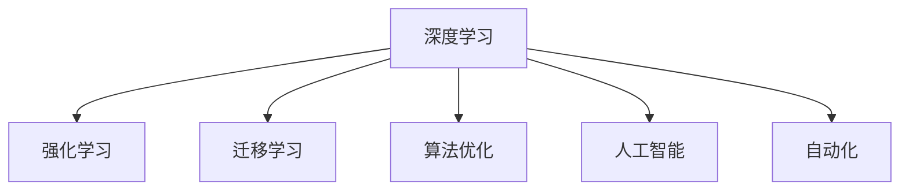
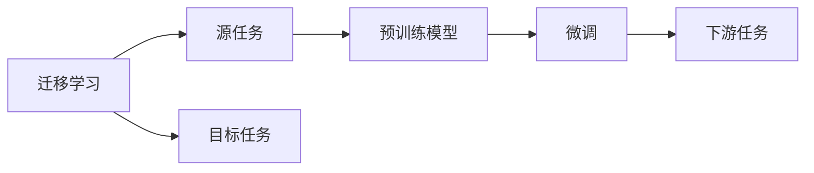
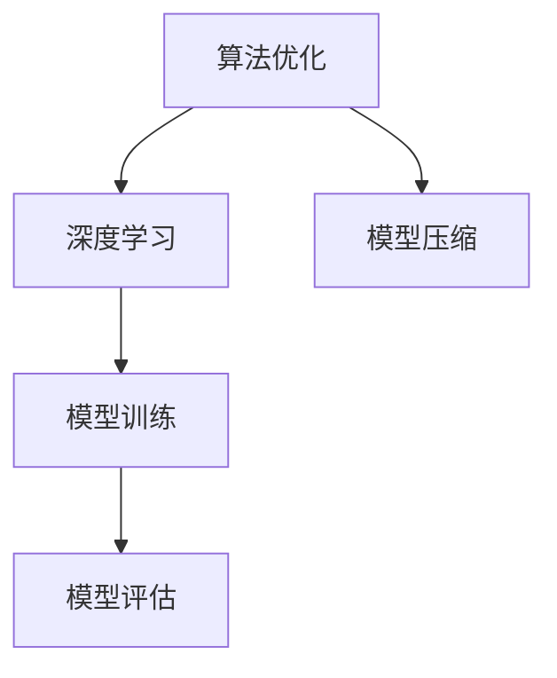
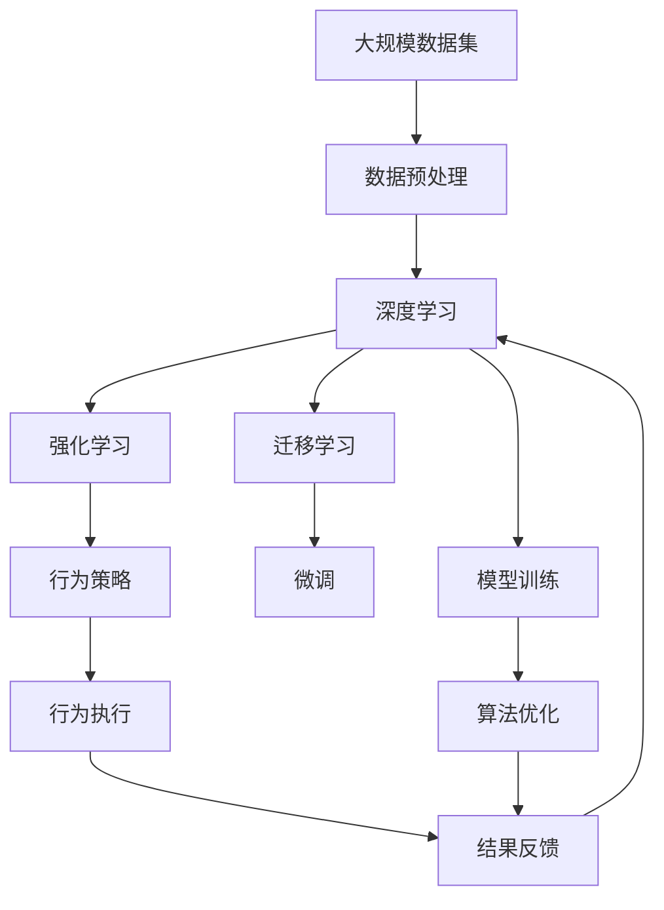

                 

# 软件 2.0 的发展趋势：深度学习、强化学习

> 关键词：深度学习,强化学习,算法,优化,人工智能

## 1. 背景介绍

### 1.1 问题由来

在过去几十年里，计算机软件领域经历了从以规则为基础的静态编程到以数据驱动的动态智能的转变。传统的软件开发模型如瀑布模型、原型模型等已经难以满足日益复杂多变的需求。如何在软件构建、部署、运维等全生命周期中更好地利用数据和算法，成为了软件工程领域的重大挑战。

### 1.2 问题核心关键点

软件2.0的核心理念是将数据和算法深度融合到软件开发的各个环节，实现软件智能化。这不仅包括传统的机器学习、深度学习等技术，还包括近年来快速发展的强化学习、迁移学习等前沿技术。这些技术的应用，能够有效提升软件的自动化水平、推理能力、适应性、鲁棒性和用户体验。

### 1.3 问题研究意义

研究软件2.0的发展趋势，对推动软件工程领域的自动化、智能化、工业化有着重要意义：

1. 降低开发成本：通过自动化算法生成代码，可以大幅减少手动编写代码的工作量，节省时间和人力。
2. 提升性能：基于算法优化的软件系统可以更快、更准确地处理海量数据，提升应用效率。
3. 增强适应性：通过学习和适应的能力，软件系统可以更快地适应新环境和新需求，延长其生命周期。
4. 优化用户体验：通过深度学习、强化学习等技术，软件系统可以更智能地理解和响应用户行为，提升用户体验。
5. 促进创新：基于算法驱动的软件系统，为创新提供了新的思路和工具，推动了软件技术的不断突破。

## 2. 核心概念与联系

### 2.1 核心概念概述

为更好地理解软件2.0的发展趋势，本节将介绍几个密切相关的核心概念：

- 深度学习(Deep Learning)：一种基于多层神经网络，通过多层特征提取和特征融合，实现对复杂数据建模的技术。
- 强化学习(Reinforcement Learning)：通过智能体在环境中与环境互动，不断优化策略以最大化预期收益的技术。
- 迁移学习(Transfer Learning)：指将一个领域学习到的知识，迁移到另一个不同但相关的领域，以加速学习和提高泛化能力的技术。
- 算法优化(Optimization)：通过搜索策略、梯度优化、模型压缩等方法，提升算法模型的性能和效率。
- 人工智能(Artificial Intelligence)：使计算机能够模拟人类智能行为的技术，包括感知、推理、学习等。
- 自动化(Automation)：通过算法自动化执行复杂的任务，减少人工干预的技术。

这些核心概念之间的逻辑关系可以通过以下Mermaid流程图来展示：



这个流程图展示了深度学习、强化学习、迁移学习、算法优化、人工智能和自动化等核心概念之间的相互联系：

1. 深度学习是一种实现人工智能的基础技术，通过多层次的神经网络，提取并融合数据中的特征。
2. 强化学习通过智能体的行为与环境的反馈，不断优化决策策略，实现智能化行为。
3. 迁移学习利用已有知识，加速新任务的学习，提升泛化能力。
4. 算法优化通过提升算法模型的效率和性能，推动智能化技术的应用。
5. 人工智能是这些技术的目标，旨在构建具有感知、推理、学习等人类智能行为的计算机系统。
6. 自动化通过算法自动化执行复杂任务，提高工作效率和质量。

### 2.2 概念间的关系

这些核心概念之间存在着紧密的联系，形成了软件2.0技术的完整生态系统。下面我通过几个Mermaid流程图来展示这些概念之间的关系。

#### 2.2.1 深度学习和强化学习的关系


这个流程图展示了深度学习和强化学习的基本关系：

1. 深度学习通过数据驱动，学习特征提取和融合，构建模型。
2. 强化学习通过智能决策，优化策略，指导行为执行。
3. 深度学习提供特征提取和融合的工具，为强化学习提供输入数据。
4. 强化学习利用智能决策，提升深度学习的优化目标。

#### 2.2.2 迁移学习和深度学习的关系



这个流程图展示了迁移学习与深度学习的基本关系：

1. 迁移学习通过源任务和目标任务的预训练模型，加速新任务的学习。
2. 深度学习通过多层次的神经网络，提取特征并进行融合。
3. 迁移学习利用已有知识，加速新任务的学习，提升泛化能力。
4. 深度学习提供模型，迁移学习利用该模型进行微调，提升性能。

#### 2.2.3 算法优化和深度学习的关系



这个流程图展示了算法优化和深度学习的关系：

1. 算法优化通过提升模型效率和性能，推动深度学习模型的应用。
2. 深度学习通过构建多层次的神经网络，实现特征提取和融合。
3. 算法优化通过压缩和优化，减少计算资源消耗，提升深度学习模型的性能。
4. 深度学习提供模型，算法优化提升模型效率，提升深度学习模型的性能。

### 2.3 核心概念的整体架构

最后，我们用一个综合的流程图来展示这些核心概念在软件2.0中的整体架构：



这个综合流程图展示了从数据预处理到结果反馈的完整流程：

1. 大规模数据集通过数据预处理，转化为深度学习、迁移学习、强化学习等算法的输入。
2. 深度学习通过构建多层次神经网络，提取和融合数据特征。
3. 迁移学习利用已有知识，加速新任务的学习，提升泛化能力。
4. 强化学习通过智能决策，优化行为策略，指导行为执行。
5. 算法优化通过压缩和优化，提升深度学习、强化学习模型的性能。
6. 微调通过微调已有模型，适应新任务的需求。
7. 结果反馈用于优化策略和模型，不断提升系统的智能化水平。

通过这些流程图，我们可以更清晰地理解深度学习、强化学习等技术在软件2.0中的作用和关系，为后续深入讨论具体的算法和技术奠定基础。

## 3. 核心算法原理 & 具体操作步骤
### 3.1 算法原理概述

软件2.0中的深度学习算法和强化学习算法，本质上是一种数据驱动的优化问题。其核心思想是通过算法模型的迭代训练，不断调整参数，最小化损失函数，从而优化模型的预测能力。

形式化地，假设模型为 $M_{\theta}$，训练数据集为 $D=\{(x_i,y_i)\}_{i=1}^N$，其中 $x_i$ 为输入数据，$y_i$ 为对应的标签。深度学习模型的损失函数通常为交叉熵损失函数，表示为：

$$
\mathcal{L}(M_{\theta},D) = -\frac{1}{N}\sum_{i=1}^N \log P_{M_{\theta}}(y_i|x_i)
$$

其中 $P_{M_{\theta}}$ 表示模型在给定输入数据 $x_i$ 下，预测标签 $y_i$ 的概率分布。在强化学习中，通过智能体与环境的互动，优化决策策略，使得智能体最大化累积奖励 $R$，表示为：

$$
\max_{\pi} \mathbb{E}_{\pi}\left[\sum_{t=1}^{\infty}\gamma^t r_t\right]
$$

其中 $\pi$ 表示智能体的策略，$r_t$ 表示在第 $t$ 步的奖励，$\gamma$ 表示折扣因子。

### 3.2 算法步骤详解

基于深度学习和强化学习的大规模软件系统，其算法步骤通常包括以下几个关键步骤：

**Step 1: 数据准备和预处理**
- 收集大规模数据集，进行清洗、标注和划分。
- 进行特征工程，将数据转换为模型可用的形式。
- 设计数据增强技术，扩充数据集，避免过拟合。

**Step 2: 模型构建和训练**
- 选择合适的深度学习或强化学习算法。
- 设计模型的网络结构，如卷积神经网络、循环神经网络、生成对抗网络等。
- 使用优化算法进行模型训练，如梯度下降、Adam、RMSprop等。
- 通过交叉验证或学习曲线，评估模型性能，调整超参数。

**Step 3: 迁移学习与微调**
- 对已有模型进行迁移学习，将预训练模型微调成新任务的模型。
- 设计任务的适配层，如分类层、回归层、自编码器等。
- 进行微调，更新模型参数，适应新任务。
- 评估微调后的模型性能，进行调优。

**Step 4: 强化学习策略设计**
- 定义智能体的行为策略，如Q-learning、SARSA、DQN等。
- 设计环境，设定状态、动作、奖励等。
- 通过模拟或实际环境，不断训练智能体。
- 调整策略参数，优化决策策略。

**Step 5: 行为执行与结果反馈**
- 使用训练好的模型执行智能体行为。
- 收集行为结果，进行评估和反馈。
- 根据反馈结果，调整策略参数，优化行为表现。
- 在生产环境中，部署和应用模型。

以上是基于深度学习和强化学习的大规模软件系统的一般流程。在实际应用中，还需要针对具体任务，对算法流程进行优化设计，如改进训练目标函数，引入更多的正则化技术，搜索最优的超参数组合等，以进一步提升模型性能。

### 3.3 算法优缺点

深度学习和强化学习在大规模软件系统中的优点包括：

1. 强大的特征提取和融合能力：通过多层次神经网络，深度学习能够自动提取和学习数据中的复杂特征。
2. 泛化能力强：深度学习模型在大规模数据集上进行预训练，具备较强的泛化能力，能够适应新的数据和任务。
3. 可解释性强：深度学习模型通过可视化特征图和权重，能够提供较好的可解释性。
4. 自适应能力强：强化学习能够自动调整策略，适应环境变化，提升系统的鲁棒性和自适应能力。
5. 高效率：深度学习和强化学习模型能够并行计算，快速处理海量数据，提升系统效率。

同时，这些算法也存在一些缺点：

1. 数据需求大：深度学习和强化学习需要大量的标注数据和实际数据，难以在小样本条件下取得好的效果。
2. 计算资源需求高：深度学习和强化学习模型往往参数量巨大，需要大量的计算资源进行训练和推理。
3. 模型复杂度高：深度学习和强化学习模型结构复杂，难以理解和调试。
4. 易受噪声干扰：深度学习和强化学习模型对噪声敏感，容易产生过拟合。
5. 可解释性不足：深度学习和强化学习模型通常被视为"黑盒"，难以解释其决策过程和推理逻辑。

尽管存在这些局限性，但就目前而言，深度学习和强化学习仍是大规模软件系统中最主流的方法之一。未来相关研究的重点在于如何进一步降低数据和计算需求，提高模型的可解释性和鲁棒性，同时兼顾模型的效率和性能。

### 3.4 算法应用领域

深度学习和强化学习在大规模软件系统中的应用，已经覆盖了几乎所有常见的领域，例如：

- 自然语言处理(NLP)：如机器翻译、文本分类、语音识别等。通过深度学习模型，能够自动提取和理解自然语言中的语义信息。
- 计算机视觉(CV)：如目标检测、图像分类、人脸识别等。通过深度学习模型，能够自动提取和分析图像中的特征。
- 智能推荐系统：如电商推荐、新闻推荐、广告推荐等。通过深度学习模型，能够自动推荐用户可能感兴趣的内容。
- 游戏AI：如AlphaGo、星际争霸AI等。通过强化学习模型，能够自动优化游戏策略，提升游戏表现。
- 机器人控制：如机器人导航、操作、维护等。通过强化学习模型，能够自动控制机器人行为，提高作业效率。
- 医疗诊断：如影像诊断、病历分析、基因预测等。通过深度学习模型，能够自动分析医疗影像和病历，提升诊断精度。

除了上述这些经典应用外，深度学习和强化学习还被创新性地应用到更多场景中，如自动驾驶、金融交易、供应链管理、城市交通等，为软件系统带来了全新的突破。随着算法的不断演进，相信深度学习和强化学习将会在更多领域得到应用，为软件系统的智能化发展提供新的动力。

## 4. 数学模型和公式 & 详细讲解  
### 4.1 数学模型构建

本节将使用数学语言对深度学习和强化学习的算法模型进行更加严格的刻画。

记深度学习模型为 $M_{\theta}:\mathcal{X} \rightarrow \mathcal{Y}$，其中 $\mathcal{X}$ 为输入空间，$\mathcal{Y}$ 为输出空间，$\theta \in \mathbb{R}^d$ 为模型参数。假设训练数据集为 $D=\{(x_i,y_i)\}_{i=1}^N$。

定义模型 $M_{\theta}$ 在数据样本 $(x,y)$ 上的损失函数为 $\ell(M_{\theta}(x),y)$，则在数据集 $D$ 上的经验风险为：

$$
\mathcal{L}(\theta) = \frac{1}{N} \sum_{i=1}^N \ell(M_{\theta}(x_i),y_i)
$$

在强化学习中，定义智能体在环境中的策略为 $\pi(a|s)$，其中 $a$ 表示智能体的动作，$s$ 表示环境的状态。智能体在环境中的奖励函数为 $r(s,a)$。智能体的累积奖励和动作策略为 $R(\pi)$，表示为：

$$
R(\pi) = \mathbb{E}_{\pi}\left[\sum_{t=1}^{\infty}\gamma^t r_t\right]
$$

其中 $\mathbb{E}_{\pi}$ 表示智能体在策略 $\pi$ 下的期望，$\gamma$ 表示折扣因子。

### 4.2 公式推导过程

以下我们以深度学习中的卷积神经网络(CNN)和强化学习中的Q-learning为例，推导算法模型的数学公式及其梯度计算过程。

**卷积神经网络**

卷积神经网络由多个卷积层、池化层和全连接层组成。其核心公式如下：

$$
f(x) = h_{l}(h_{l-1}(...(h_1(x)+b_1)|x)+b_2)|x)+b_2)+...+b_l)
$$

其中 $h_i$ 表示第 $i$ 层的卷积操作，$b_i$ 表示第 $i$ 层的偏置，$l$ 表示总层数。

对于训练数据 $(x_i,y_i)$，卷积神经网络的损失函数为：

$$
\mathcal{L}(\theta) = \frac{1}{N}\sum_{i=1}^N \ell(M_{\theta}(x_i),y_i)
$$

其中 $\ell$ 表示交叉熵损失函数。

通过反向传播算法，可以求得模型参数 $\theta$ 的梯度：

$$
\frac{\partial \mathcal{L}(\theta)}{\partial \theta} = -\frac{1}{N}\sum_{i=1}^N \frac{\partial \ell(M_{\theta}(x_i),y_i)}{\partial \theta}
$$

其中 $\frac{\partial \ell(M_{\theta}(x_i),y_i)}{\partial \theta}$ 可以通过链式法则递归展开计算。

**Q-learning**

Q-learning是一种基于值函数的学习算法，其核心公式如下：

$$
Q(s,a) \leftarrow (1-\alpha)Q(s,a)+\alpha(r+\gamma \max_{a'} Q(s',a'))
$$

其中 $Q(s,a)$ 表示智能体在状态 $s$ 下采取动作 $a$ 的Q值，$r$ 表示即时奖励，$\gamma$ 表示折扣因子，$\alpha$ 表示学习率，$s'$ 表示智能体在状态 $s$ 下采取动作 $a$ 后的下一状态。

通过Q-learning算法，智能体可以不断优化Q值函数，选择最优动作，最大化累积奖励。

### 4.3 案例分析与讲解

这里我们以图像分类任务为例，具体讲解深度学习模型的实现过程。

假设训练数据集为MNIST手写数字识别数据集，其核心代码实现如下：

```python
import torch
import torch.nn as nn
import torch.optim as optim
import torchvision.transforms as transforms
from torchvision.datasets import MNIST
from torch.utils.data import DataLoader

# 定义卷积神经网络模型
class CNN(nn.Module):
    def __init__(self):
        super(CNN, self).__init__()
        self.conv1 = nn.Conv2d(1, 32, kernel_size=3, stride=1, padding=1)
        self.pool = nn.MaxPool2d(kernel_size=2, stride=2)
        self.conv2 = nn.Conv2d(32, 64, kernel_size=3, stride=1, padding=1)
        self.fc1 = nn.Linear(64*8*8, 256)
        self.fc2 = nn.Linear(256, 10)
    
    def forward(self, x):
        x = nn.functional.relu(self.conv1(x))
        x = self.pool(x)
        x = nn.functional.relu(self.conv2(x))
        x = self.pool(x)
        x = x.view(-1, 64*8*8)
        x = nn.functional.relu(self.fc1(x))
        x = self.fc2(x)
        return x

# 定义模型参数和超参数
model = CNN()
criterion = nn.CrossEntropyLoss()
optimizer = optim.Adam(model.parameters(), lr=0.001)

# 加载数据集
transform = transforms.ToTensor()
train_data = MNIST(root='./data', train=True, transform=transform, download=True)
train_loader = DataLoader(train_data, batch_size=64, shuffle=True)

# 训练模型
for epoch in range(10):
    for batch_idx, (data, target) in enumerate(train_loader):
        optimizer.zero_grad()
        output = model(data)
        loss = criterion(output, target)
        loss.backward()
        optimizer.step()
        if (batch_idx+1) % 100 == 0:
            print('Train Epoch: {} [{}/{} ({:.0f}%)]\tLoss: {:.6f}'.format(
                epoch+1, batch_idx*len(data), len(train_loader.dataset),
                100. * batch_idx/len(train_loader), loss.item()))

print('Finished Training')
```

可以看到，通过上述代码，我们成功地定义了一个简单的卷积神经网络模型，并使用Adam优化器进行模型训练。训练过程通过交叉熵损失函数衡量模型的预测与真实标签之间的差异，并使用梯度下降算法不断优化模型参数。

在强化学习中，假设我们要训练一个机器人控制模型，核心代码实现如下：

```python
import gym
import numpy as np
import random
import tensorflow as tf

# 定义智能体策略
class DQN:
    def __init__(self, state_dim, action_dim):
        self.state_dim = state_dim
        self.action_dim = action_dim
        self.model = tf.keras.models.Sequential([
            tf.keras.layers.Dense(64, input_dim=self.state_dim, activation='relu'),
            tf.keras.layers.Dense(self.action_dim, activation='linear')
        ])
        self.target_model = tf.keras.models.Sequential([
            tf.keras.layers.Dense(64, input_dim=self.state_dim, activation='relu'),
            tf.keras.layers.Dense(self.action_dim, activation='linear')
        ])
        self.optimizer = tf.keras.optimizers.Adam(learning_rate=0.001)
        self.memory = []
        self.train_memory_size = 1000
    
    def act(self, state):
        if np.random.rand() < epsilon:
            return random.randrange(self.action_dim)
        q_value = self.model.predict(state)
        return np.argmax(q_value[0])
    
    def replay(self, batch_size):
        minibatch = random.sample(self.memory, batch_size)
        for state, action, reward, next_state, done in minibatch:
            target = reward + 0.9 * np.amax(self.target_model.predict(next_state))
            target_f = self.model.predict(state)
            target_f[0][action] = target
            self.optimizer.minimize(self.model.train_on_batch(state, target_f))
    
    def train(self):
        if len(self.memory) < self.train_memory_size:
            return
        minibatch = random.sample(self.memory, batch_size)
        for state, action, reward, next_state, done in minibatch:
            target = reward + 0.9 * np.amax(self.target_model.predict(next_state))
            target_f = self.model.predict(state)
            target_f[0][action] = target
            self.optimizer.minimize(self.model.train_on_batch(state, target_f))
    
    def remember(self, state, action, reward, next_state, done):
        self.memory.append((state, action, reward, next_state, done))
        if len(self.memory) > self.train_memory_size:
            del self.memory[0]
    
    def load(self):
        self.model.load_weights('model.h5')
    
    def save(self):
        self.model.save_weights('model.h5')

# 定义环境
env = gym.make('CartPole-v0')
env = env.unwrapped

# 定义状态和动作
state_dim = env.observation_space.shape[0]
action_dim = env.action_space.n
model = DQN(state_dim, action_dim)

# 训练模型
for episode in range(1000):
    state = env.reset()
    state = np.reshape(state, [1, state_dim])
    done = False
    while not done:
        action = model.act(state)
        next_state, reward, done, _ = env.step(action)
        next_state = np.reshape(next_state, [1, state_dim])
        model.remember(state, action, reward, next_state, done)
        state = next_state
    model.train()
```

可以看到，通过上述代码，我们成功地定义了一个简单的DQN智能体，并使用Adam优化器进行模型训练。训练过程通过Q-learning算法不断优化智能体的决策策略，选择最优动作，最大化累积奖励。

以上是深度学习和强化学习在大规模软件系统中的应用示例，展示了模型构建和训练的基本流程，以及具体算法实现的代码实现。

## 5. 项目实践：代码实例和详细解释说明
### 5.1 开发环境搭建

在进行深度学习和强化学习算法开发前，我们需要准备好开发环境。以下是使用Python进行TensorFlow开发的环境配置流程：

1. 安装Anaconda：从官网下载并安装Anaconda，用于创建独立的Python环境。

2. 创建并激活虚拟环境：
```bash
conda create -n tf-env python=3.7 
conda activate tf-env
```

3. 安装TensorFlow：根据CUDA版本，从官网获取对应的安装命令。例如：
```bash
conda install tensorflow -c pytorch -c conda-forge
```

4. 安装各类工具包：
```bash
pip install numpy pandas scikit-learn matplotlib tqdm jupyter notebook ipython
```

完成上述步骤后，即可在`tf-env`环境中开始深度学习和强化学习算法的开发。

### 5.2 源代码详细实现

这里我们以图像分类任务为例，给出使用TensorFlow实现卷积神经网络的PyTorch代码实现。

首先，定义卷积神经网络模型：

```python
import tensorflow as tf
from tensorflow.keras import layers

class CNN(tf.keras.Model):
    def __init__(self, num_classes):
        super(CNN, self).__init__()
        self.conv1 = layers.Conv2D(32, 3, activation='relu')
        self.pool = layers.MaxPooling2D()
        self.conv2 = layers.Conv2D(64, 3, activation='relu')
        self.pool = layers.MaxPooling2D()
        self.flatten = layers.Flatten()
        self.fc1 = layers.Dense(128, activation='relu')
        self.fc2 = layers.Dense(num_classes, activation='softmax')
    
    def call(self, inputs):
        x = self.conv1(inputs)
        x = self.pool(x)
        x = self.conv2(x)
        x = self.pool(x)
        x = self.flatten(x)
        x = self.fc1(x)
        return self.fc2(x)

# 定义模型参数和超参数
model = CNN(10)
optimizer = tf.keras.optimizers.Adam(learning_rate=0.001)
loss_fn = tf.keras.losses.CategoricalCrossentropy()

# 加载数据集
train_data = tf.keras.datasets.mnist.load_data()
train_images, train_labels = train_data[0]
train_images = train_images.reshape((60000, 28, 28,

