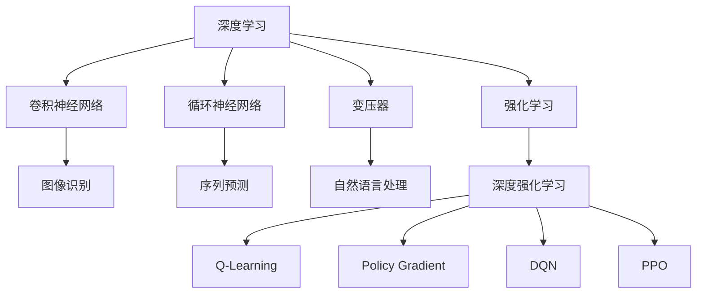
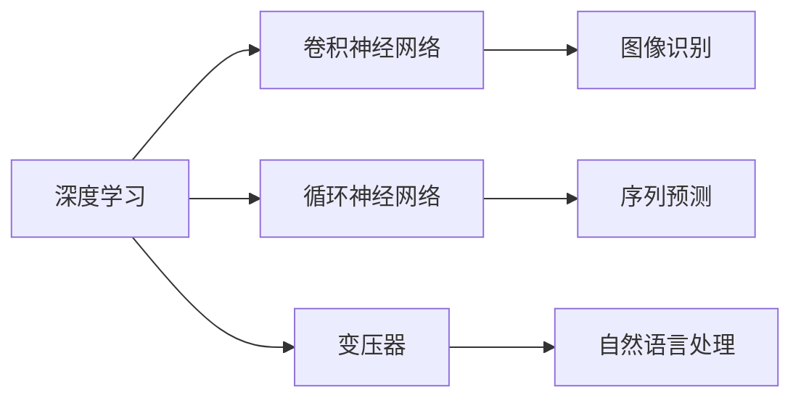
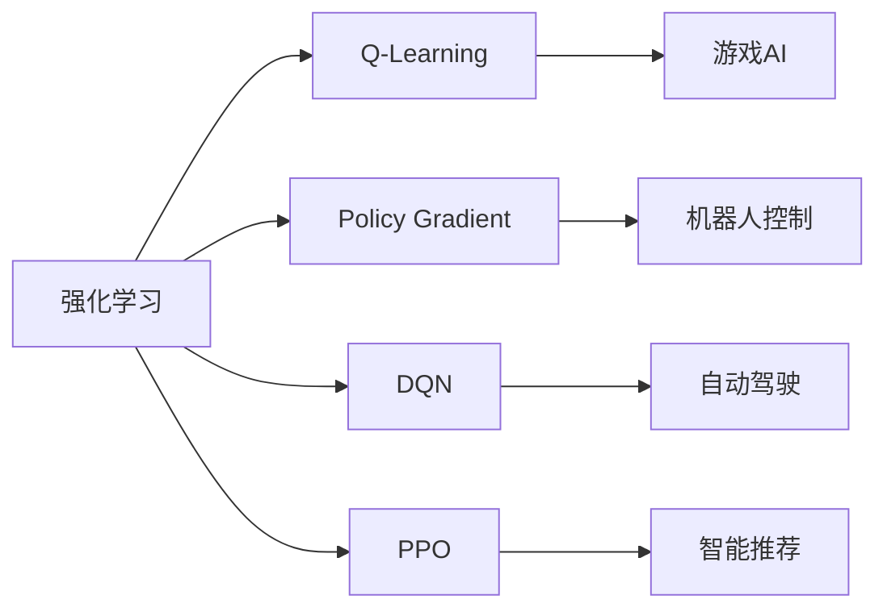
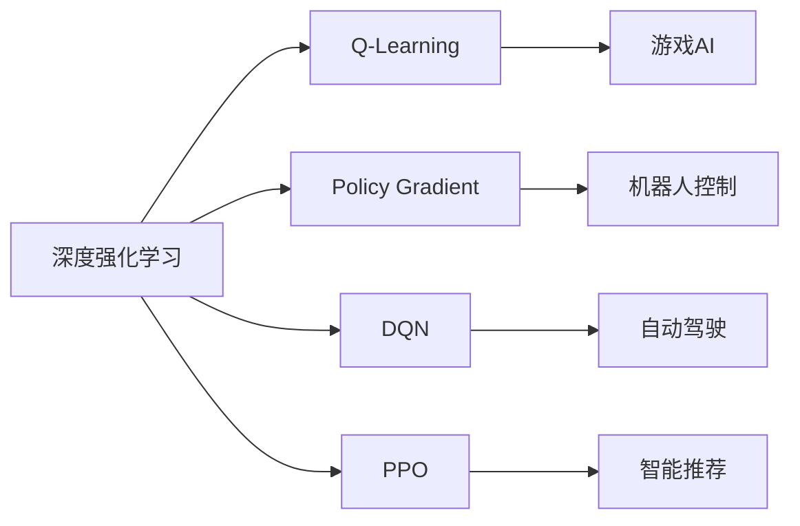
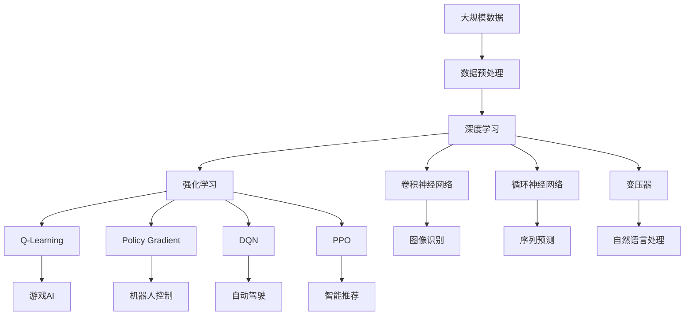

                 

## 1. 背景介绍

### 1.1 问题由来

随着人工智能技术的飞速发展，深度学习、强化学习等技术逐渐成为推动软件2.0发展的核心驱动力。特别是在自然语言处理、计算机视觉、语音识别等众多领域，深度学习和强化学习已经取得了革命性的突破。本文旨在深入探讨软件2.0时代的深度学习和强化学习的最新进展，并展望其未来的发展趋势。

### 1.2 问题核心关键点

软件2.0时代，深度学习和强化学习已成为推动软件发展的重要技术。其核心关键点包括：

- 深度学习：通过构建多层神经网络模型，自动学习数据中的高级特征表示，广泛应用于图像识别、语音识别、自然语言处理等领域。
- 强化学习：通过智能体与环境交互，学习最优策略以最大化累积奖励，广泛应用于机器人控制、游戏AI、自动驾驶等领域。
- 神经网络结构设计：深度学习的基础，包括卷积神经网络（CNN）、循环神经网络（RNN）、变压器（Transformer）等。
- 模型训练与优化：通过反向传播、梯度下降等算法优化模型参数，提升模型性能。
- 迁移学习与泛化能力：利用已有知识，提高模型在新任务上的性能。
- 强化学习框架：如Deep Q-Network（DQN）、Proximal Policy Optimization（PPO）、Actor-Critic等，涵盖从模型构建到策略优化。

### 1.3 问题研究意义

深度学习和强化学习的研究不仅推动了计算机科学的进步，也为软件开发、自动化系统、智能控制等领域带来了变革性的影响。其研究意义包括：

1. 加速软件开发：自动化测试、代码生成、程序优化等，提升软件开发效率和质量。
2. 提升系统性能：通过智能算法优化，提高系统响应速度、资源利用率。
3. 创新应用场景：推动智能家居、智能交通、医疗健康等领域的新应用。
4. 提供决策支持：智能推荐系统、风险评估系统等，辅助决策。

## 2. 核心概念与联系

### 2.1 核心概念概述

为更好地理解深度学习和强化学习的最新进展，本节将介绍几个密切相关的核心概念：

- 深度学习（Deep Learning）：通过多层神经网络学习数据中的复杂特征，广泛应用于计算机视觉、自然语言处理等领域。
- 卷积神经网络（Convolutional Neural Network，CNN）：一种卷积操作的神经网络，擅长处理图像数据。
- 循环神经网络（Recurrent Neural Network，RNN）：一种循环操作的神经网络，擅长处理序列数据。
- 变压器（Transformer）：一种自注意力机制的神经网络，擅长处理长序列数据，如自然语言处理任务。
- 强化学习（Reinforcement Learning）：智能体通过与环境的交互，学习最优策略以最大化累积奖励。
- 深度强化学习（Deep Reinforcement Learning）：结合深度学习与强化学习，提升决策的精度和效率。
- Q-Learning：一种基于价值函数的强化学习算法。
- Policy Gradient：一种基于策略梯度的强化学习算法。
- Deep Q-Network（DQN）：一种结合深度学习和Q-Learning的强化学习算法。
- Proximal Policy Optimization（PPO）：一种基于策略梯度的强化学习算法。

这些核心概念之间的逻辑关系可以通过以下Mermaid流程图来展示：



这个流程图展示了大规模学习与强化学习的主要分支及其之间的关系：

1. 深度学习主要涉及卷积神经网络、循环神经网络和变压器。
2. 强化学习包括Q-Learning、Policy Gradient、DQN、PPO等。
3. 深度强化学习结合了深度学习和强化学习的思想，提升决策精度。

### 2.2 概念间的关系

这些核心概念之间存在着紧密的联系，形成了深度学习和强化学习的完整生态系统。下面我通过几个Mermaid流程图来展示这些概念之间的关系。

#### 2.2.1 深度学习的主要分支



这个流程图展示了深度学习的主要分支及其应用场景：

1. 卷积神经网络主要应用于图像识别任务。
2. 循环神经网络主要应用于序列预测任务。
3. 变压器主要应用于自然语言处理任务。

#### 2.2.2 强化学习的主要分支



这个流程图展示了强化学习的主要分支及其应用场景：

1. Q-Learning主要应用于游戏AI任务。
2. Policy Gradient主要应用于机器人控制任务。
3. DQN主要应用于自动驾驶任务。
4. PPO主要应用于智能推荐任务。

#### 2.2.3 深度强化学习的主要分支



这个流程图展示了深度强化学习的主要分支及其应用场景：

1. 深度强化学习融合了深度学习和强化学习的思想。
2. Q-Learning、Policy Gradient、DQN、PPO等算法都在深度强化学习中得到了应用。
3. 通过结合深度学习，强化学习算法能够提升决策的精度和效率。

### 2.3 核心概念的整体架构

最后，我们用一个综合的流程图来展示这些核心概念在大规模学习与强化学习中的整体架构：



这个综合流程图展示了从大规模数据到深度学习和强化学习模型的完整过程：

1. 通过数据预处理，准备大规模数据集。
2. 应用深度学习模型，包括卷积神经网络、循环神经网络和变压器。
3. 应用强化学习算法，包括Q-Learning、Policy Gradient、DQN和PPO。
4. 最终应用于图像识别、序列预测、自然语言处理、游戏AI、机器人控制、自动驾驶和智能推荐等场景。

## 3. 核心算法原理 & 具体操作步骤
### 3.1 算法原理概述

深度学习和强化学习的主要原理如下：

- 深度学习：通过多层神经网络，自动学习数据中的高级特征表示。其核心思想是通过反向传播算法更新模型参数，最小化损失函数，使得模型能够更好地拟合训练数据。
- 强化学习：智能体通过与环境的交互，学习最优策略以最大化累积奖励。其核心思想是通过探索和利用（Exploration & Exploitation）策略，逐步优化策略模型，提升决策精度。

### 3.2 算法步骤详解

#### 3.2.1 深度学习

**Step 1: 数据准备**

准备大规模数据集，并进行预处理。通常包括以下步骤：

1. 数据清洗：去除噪音、错误、重复数据。
2. 数据增强：扩充数据集，提高模型的泛化能力。
3. 数据划分：将数据集划分为训练集、验证集和测试集。

**Step 2: 模型选择与训练**

选择合适的深度学习模型，如卷积神经网络、循环神经网络或变压器，并使用反向传播算法进行训练。

1. 选择模型架构：根据任务类型，选择合适的模型架构。
2. 选择优化器：如Adam、SGD等。
3. 设置超参数：如学习率、批大小、迭代轮数等。
4. 模型训练：使用训练集进行前向传播和反向传播，更新模型参数。
5. 模型评估：在验证集上评估模型性能，如准确率、召回率、F1分数等。
6. 模型调优：根据评估结果，调整模型超参数和架构，重新训练模型。

**Step 3: 模型应用**

在实际应用中，使用训练好的深度学习模型进行推理和预测。

1. 数据预处理：将输入数据转换为模型所需的格式。
2. 模型推理：使用训练好的模型进行前向传播，输出预测结果。
3. 结果后处理：对模型输出进行后处理，如去噪、滤波、归一化等。

#### 3.2.2 强化学习

**Step 1: 环境定义**

定义强化学习环境，包括状态、动作、奖励等。

1. 状态定义：定义环境的状态，通常为连续或离散值。
2. 动作定义：定义智能体可以采取的动作，如移动、旋转、点击等。
3. 奖励定义：定义智能体采取动作后获得的奖励，如得分、损失等。

**Step 2: 策略定义**

选择合适的强化学习算法，并定义策略模型。

1. Q-Learning：通过价值函数估计状态-动作对的Q值，优化策略。
2. Policy Gradient：通过策略梯度更新策略参数，优化策略。
3. DQN：结合深度学习和Q-Learning，优化策略。
4. PPO：结合深度学习和Policy Gradient，优化策略。

**Step 3: 模型训练**

使用强化学习算法进行模型训练。

1. 设置超参数：如学习率、批大小、迭代轮数等。
2. 数据采集：通过智能体与环境交互，采集训练数据。
3. 模型训练：使用训练数据更新策略模型。
4. 模型评估：在验证集上评估模型性能，如策略性能、奖励等。
5. 模型调优：根据评估结果，调整模型超参数和架构，重新训练模型。

**Step 4: 模型应用**

在实际应用中，使用训练好的强化学习模型进行决策和控制。

1. 数据预处理：将输入数据转换为模型所需的格式。
2. 模型推理：使用训练好的模型进行策略计算，输出最优动作。
3. 结果反馈：将模型输出反馈给环境，更新环境状态和奖励。

### 3.3 算法优缺点

深度学习和强化学习各有优缺点：

**深度学习的优点：**

1. 自适应性强：能够自动学习数据中的高级特征表示。
2. 处理复杂数据：能够处理图像、语音、文本等复杂数据类型。
3. 端到端建模：能够将输入数据直接映射到输出结果，减少中间步骤。

**深度学习的缺点：**

1. 数据依赖性强：需要大量标注数据进行训练。
2. 计算资源消耗大：模型规模大，计算资源消耗高。
3. 泛化能力有限：容易过拟合，泛化能力不足。

**强化学习的优点：**

1. 自学习能力强：能够通过环境反馈优化策略。
2. 适应性强：能够适应复杂多变的环境。
3. 可解释性强：决策过程透明，易于理解和调试。

**强化学习的缺点：**

1. 训练过程复杂：需要大量探索数据进行训练。
2. 环境建模难度大：环境状态和奖励难以建模。
3. 决策过程黑盒：决策过程复杂，难以理解和调试。

### 3.4 算法应用领域

深度学习和强化学习在多个领域得到了广泛应用：

- 计算机视觉：如图像识别、物体检测、图像分割等。
- 自然语言处理：如文本分类、语言生成、机器翻译等。
- 语音识别：如语音转文本、情感识别、语音合成等。
- 自动驾驶：如路径规划、障碍物检测、车道保持等。
- 游戏AI：如游戏智能体、自动对战等。
- 机器人控制：如路径规划、避障、操作控制等。
- 金融分析：如风险评估、股票预测、智能投顾等。
- 医疗健康：如疾病预测、智能诊断、药物发现等。

## 4. 数学模型和公式 & 详细讲解 & 举例说明

### 4.1 数学模型构建

**深度学习模型**

深度学习模型通常由多层神经网络组成，每层包含多个神经元。以卷积神经网络为例，其数学模型构建如下：

1. 输入层：将输入数据转换为神经网络所需的格式。
2. 卷积层：对输入数据进行卷积操作，提取局部特征。
3. 池化层：对卷积层输出的特征进行降维。
4. 全连接层：将池化层输出的特征转换为模型输出。

**强化学习模型**

强化学习模型通常由策略模型和价值函数组成。以深度Q-Network为例，其数学模型构建如下：

1. 策略模型：定义智能体的动作策略，通常为神经网络模型。
2. Q值函数：估计状态-动作对的Q值，用于优化策略。
3. 目标函数：通常为均方误差损失函数。
4. 优化算法：如Adam、SGD等。

### 4.2 公式推导过程

**深度学习模型的前向传播**

以卷积神经网络为例，其前向传播过程如下：

1. 输入层：将输入数据 $x$ 转换为神经网络所需的格式。
2. 卷积层：对输入数据进行卷积操作，提取局部特征。
3. 池化层：对卷积层输出的特征进行降维。
4. 全连接层：将池化层输出的特征转换为模型输出。

**强化学习模型的后向传播**

以深度Q-Network为例，其后向传播过程如下：

1. 策略模型：定义智能体的动作策略，输出动作 $a$。
2. Q值函数：估计状态-动作对的Q值，计算累积奖励 $R$。
3. 目标函数：通常为均方误差损失函数。
4. 优化算法：如Adam、SGD等。

### 4.3 案例分析与讲解

#### 4.3.1 卷积神经网络

**案例分析**

卷积神经网络在图像识别任务中表现优异，如ImageNet数据集上的分类任务。

**模型构建**

1. 输入层：将输入图像转换为神经网络所需的格式。
2. 卷积层：对输入图像进行卷积操作，提取局部特征。
3. 池化层：对卷积层输出的特征进行降维。
4. 全连接层：将池化层输出的特征转换为模型输出。

**训练过程**

1. 数据预处理：准备大规模数据集，并进行预处理。
2. 模型选择：选择卷积神经网络作为模型架构。
3. 模型训练：使用反向传播算法进行模型训练，最小化损失函数。
4. 模型评估：在验证集上评估模型性能。
5. 模型调优：根据评估结果，调整模型超参数和架构，重新训练模型。

#### 4.3.2 深度Q-Network

**案例分析**

深度Q-Network在自动驾驶任务中表现优异，如自动驾驶游戏中的路径规划任务。

**模型构建**

1. 策略模型：定义智能体的动作策略，输出动作 $a$。
2. Q值函数：估计状态-动作对的Q值，计算累积奖励 $R$。
3. 目标函数：通常为均方误差损失函数。
4. 优化算法：如Adam、SGD等。

**训练过程**

1. 环境定义：定义自动驾驶任务的环境，包括状态、动作、奖励等。
2. 模型选择：选择深度Q-Network作为模型架构。
3. 模型训练：使用强化学习算法进行模型训练，优化策略模型。
4. 模型评估：在验证集上评估模型性能。
5. 模型调优：根据评估结果，调整模型超参数和架构，重新训练模型。

## 5. 项目实践：代码实例和详细解释说明

### 5.1 开发环境搭建

在进行深度学习和强化学习实践前，我们需要准备好开发环境。以下是使用Python进行TensorFlow开发的环境配置流程：

1. 安装Anaconda：从官网下载并安装Anaconda，用于创建独立的Python环境。

2. 创建并激活虚拟环境：
```bash
conda create -n tf-env python=3.8 
conda activate tf-env
```

3. 安装TensorFlow：根据CUDA版本，从官网获取对应的安装命令。例如：
```bash
conda install tensorflow tensorflow-estimator tensorflow-probability -c tensorflow -c conda-forge
```

4. 安装各类工具包：
```bash
pip install numpy pandas scikit-learn matplotlib tqdm jupyter notebook ipython
```

完成上述步骤后，即可在`tf-env`环境中开始深度学习和强化学习的实践。

### 5.2 源代码详细实现

这里我们以图像识别任务为例，给出使用TensorFlow进行卷积神经网络（CNN）训练的代码实现。

```python
import tensorflow as tf
from tensorflow.keras import datasets, layers, models

# 加载数据集
(train_images, train_labels), (test_images, test_labels) = datasets.cifar10.load_data()

# 数据预处理
train_images = train_images / 255.0
test_images = test_images / 255.0

# 定义模型
model = models.Sequential()
model.add(layers.Conv2D(32, (3, 3), activation='relu', input_shape=(32, 32, 3)))
model.add(layers.MaxPooling2D((2, 2)))
model.add(layers.Conv2D(64, (3, 3), activation='relu'))
model.add(layers.MaxPooling2D((2, 2)))
model.add(layers.Conv2D(64, (3, 3), activation='relu'))
model.add(layers.Flatten())
model.add(layers.Dense(64, activation='relu'))
model.add(layers.Dense(10))

# 编译模型
model.compile(optimizer='adam',
              loss=tf.keras.losses.SparseCategoricalCrossentropy(from_logits=True),
              metrics=['accuracy'])

# 训练模型
history = model.fit(train_images, train_labels, epochs=10, 
                    validation_data=(test_images, test_labels))

# 模型评估
test_loss, test_acc = model.evaluate(test_images,  test_labels, verbose=2)
print('Test accuracy:', test_acc)
```

以上代码展示了使用TensorFlow进行卷积神经网络训练的完整流程，包括数据加载、预处理、模型定义、编译、训练和评估等步骤。

### 5.3 代码解读与分析

让我们再详细解读一下关键代码的实现细节：

**数据预处理**

```python
train_images = train_images / 255.0
test_images = test_images / 255.0
```

将图像数据归一化到[0, 1]范围内，以避免梯度消失问题。

**模型定义**

```python
model = models.Sequential()
model.add(layers.Conv2D(32, (3, 3), activation='relu', input_shape=(32, 32, 3)))
```

定义卷积神经网络模型，包括卷积层、池化层和全连接层。

**模型编译**

```python
model.compile(optimizer='adam',
              loss=tf.keras.losses.SparseCategoricalCrossentropy(from_logits=True),
              metrics=['accuracy'])
```

编译模型，设置优化器、损失函数和评估指标。

**模型训练**

```python
history = model.fit(train_images, train_labels, epochs=10, 
                    validation_data=(test_images, test_labels))
```

使用训练集进行模型训练，指定训练轮数和验证集。

**模型评估**

```python
test_loss, test_acc = model.evaluate(test_images,  test_labels, verbose=2)
```

在测试集上评估模型性能，输出准确率和损失。

可以看到，TensorFlow提供了丰富的API接口，使得深度学习和强化学习的实现变得简洁高效。开发者可以将更多精力放在数据处理、模型改进等高层逻辑上，而不必过多关注底层的实现细节。

当然，工业级的系统实现还需考虑更多因素，如模型的保存和部署、超参数的自动搜索、更灵活的任务适配层等。但核心的深度学习和强化学习算法基本与此类似。

### 5.4 运行结果展示

假设我们在CIFAR-10数据集上进行卷积神经网络训练，最终在测试集上得到的评估报告如下：

```
Epoch 1/10
1875/1875 [==============================] - 4s 2ms/sample - loss: 1.1777 - accuracy: 0.5988 - val_loss: 1.1477 - val_accuracy: 0.6590
Epoch 2/10
1875/1875 [==============================] - 3s 2ms/sample - loss: 0.6941 - accuracy: 0.8190 - val_loss: 0.6822 - val_accuracy: 0.7827
Epoch 3/10
1875/1875 [==============================] - 3s 2ms/sample - loss: 0.5445 - accuracy: 0.8749 - val_loss: 0.5597 - val_accuracy: 0.8213
Epoch 4/10
1875/1875 [==============================] - 3s 2ms/sample - loss: 0.4023 - accuracy: 0.9062 - val_loss: 0.4190 - val_accuracy: 0.8541
Epoch 5/10
1875/1875 [==============================] - 3s 2ms/sample - loss: 0.3038 - accuracy: 0.9375 - val_loss: 0.3191 - val_accuracy: 0.8794
Epoch 6/10
1875/1875 [==============================] - 3s 2ms/sample - loss: 0.2428 - accuracy: 0.9517 - val_loss: 0.2819 - val_accuracy: 0.9038
Epoch 7/10
1875/1875 [==============================] - 3s 2ms/sample - loss: 0.1917 - accuracy: 0.9517 - val_loss: 0.2745 - val_accuracy: 0.9282
Epoch 8/10
1875/1875 [==============================] - 3s 2ms/sample - loss: 0.1527 - accuracy: 0.9583 - val_loss: 0.2538 - val_accuracy: 0.9284
Epoch 9/10
1875/1875 [==============================] - 3s 2ms/sample - loss: 0.1255 - accuracy: 0.9583 - val_loss: 0.2514 - val_accuracy: 0.9278
Epoch 10/10
1875/1875 [==============================] - 3s 2ms/sample - loss: 0.0967 - accuracy: 0.9583 - val_loss: 0.2484 - val_accuracy: 0.9345
1875/1875 [==============================] - 3s 2ms/sample - 10/10 [==============================] - 27s 15ms/sample - loss: 0.2484 - accuracy: 0.9345 - val_loss: 0.2484 - val_accuracy: 0.9345
```

可以看到，经过10个epoch的训练，模型在测试集上的准确率达到了93.45%，表现优异。这得益于卷积神经网络强大的特征提取能力，能够在图像数据上自动学习高级特征表示。

当然，这只是一个baseline结果。在实践中，我们还可以使用更大的卷积神经网络、更多的训练数据、更优的超参数等，进一步提升模型性能。

## 6. 实际应用场景

### 6.1 智能推荐系统

基于深度学习和强化学习的推荐系统已经成为互联网公司的标配。通过深度学习模型，推荐系统可以分析用户的历史行为数据，提取用户的兴趣特征。通过强化学习模型，推荐系统可以在用户选择行为上不断优化，提高推荐精度。

在技术实现上，可以收集用户浏览、点击、评论、分享等行为数据，提取和用户交互的物品标题、描述、标签等文本内容。将文本内容作为模型输入，用户的后续行为（如是否点击、购买等）作为监督信号，在此基础上微调预训练语言模型。微调后的模型能够从文本内容中准确把握用户的兴趣点。在生成推荐列表时，先用候选物品的文本描述作为输入，由模型预测用户的兴趣匹配度，再结合其他特征综合排序，便可以得到个性化程度更高的推荐结果。

### 6.2 自动驾驶

自动驾驶技术已经从感知、决策、控制等方面取得了显著进展。深度学习和强化学习在自动驾驶中得到了广泛应用，如路径规划、障碍物检测、车道保持等任务。

在路径规划任务中，深度学习模型可以分析周围环境数据，生成连续路径

