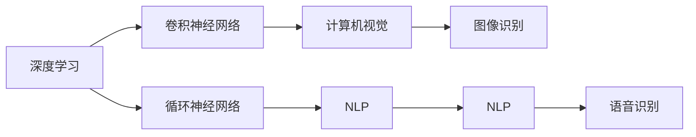
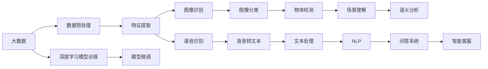

                 

# 软件 2.0 的应用领域：图像识别、语音识别

> 关键词：
1. 图像识别
2. 语音识别
3. 深度学习
4. 计算机视觉
5. 自然语言处理
6. 人工智能应用
7. 深度神经网络

## 1. 背景介绍

### 1.1 问题由来
随着科技的飞速发展，人工智能（AI）和机器学习（ML）技术逐渐成为推动社会进步的重要力量。其中，软件2.0，即基于深度学习的智能软件，正在彻底改变我们的生活和工作方式。软件2.0涵盖了计算机视觉、自然语言处理、语音识别等多个领域，并已在诸多实际应用中取得了显著成果。

### 1.2 问题核心关键点
软件2.0的核心是深度学习算法，特别是卷积神经网络（CNN）和循环神经网络（RNN）及其变种，在图像识别和语音识别等领域的应用。这些算法通过对大规模数据进行学习，提取数据的特征，并能够在实际应用中实现高精度的识别任务。

### 1.3 问题研究意义
研究软件2.0在图像识别和语音识别中的应用，对于推动AI技术的发展，加速行业智能化转型，提升用户的生活质量，具有重要意义：
- 提高效率：图像和语音识别技术能够自动化处理大量数据，减少人工操作，提升处理速度。
- 增强体验：通过准确识别图像和语音，提升用户的使用体验，如语音助手、智能翻译等。
- 助力创新：软件2.0技术为新兴行业如自动驾驶、智能家居提供了新的可能性，推动技术创新。
- 优化决策：通过图像和语音分析，辅助决策者做出更加精准的决策，如金融风控、医疗诊断等。
- 促进产业升级：软件2.0技术可以优化传统产业的运营效率，提升产品和服务质量，推动产业转型升级。

## 2. 核心概念与联系

### 2.1 核心概念概述

为了更好地理解软件2.0在图像识别和语音识别中的应用，我们将详细介绍以下几个核心概念：

- **深度学习**：一种基于神经网络的机器学习算法，通过多层次的抽象和特征提取，实现对复杂数据的高效处理和分析。
- **计算机视觉**：利用计算机技术，通过摄像头、图像传感器等设备获取、处理和分析视觉数据，实现对真实世界的理解和交互。
- **自然语言处理（NLP）**：研究如何让计算机理解和处理人类语言，包括语音识别、文本处理、语义理解等技术。
- **语音识别**：将人类语音转换为可识别的文本信息，广泛应用于智能助手、语音输入、语音搜索等领域。
- **图像识别**：通过计算机算法，自动识别和理解图像内容，包括物体识别、场景理解、图像分类等。

### 2.2 概念间的关系

这些核心概念之间存在着紧密的联系，构成了软件2.0技术的完整生态系统。以下是一个简化的Mermaid流程图，展示了它们之间的相互关系：



该流程图展示了深度学习技术如何通过卷积神经网络和循环神经网络，支持计算机视觉和自然语言处理，进而实现图像识别和语音识别的具体应用。

### 2.3 核心概念的整体架构

在理解了这些核心概念之后，我们可以通过一个更宏观的视角，来审视软件2.0技术在图像识别和语音识别中的应用架构。



这个宏观架构展示了数据预处理、模型训练、特征提取、模型微调等过程，如何将深度学习技术应用于图像识别和语音识别，实现图像分类、物体检测、语音转文本、场景理解等具体任务。

## 3. 核心算法原理 & 具体操作步骤

### 3.1 算法原理概述

软件2.0在图像识别和语音识别中的应用，主要依赖于深度学习算法中的卷积神经网络和循环神经网络。以下将详细介绍这两种算法的原理及其在具体任务中的应用。

- **卷积神经网络（CNN）**：CNN通过卷积层、池化层和全连接层等模块，对图像数据进行特征提取和分类。卷积层通过卷积操作捕捉局部特征，池化层用于降维和减少计算量，全连接层将特征向量映射到类别空间。CNN在图像分类、物体检测等任务中表现优异。

- **循环神经网络（RNN）及其变种**：RNN主要用于处理序列数据，如语音、文本等。其核心是循环结构，使得网络在处理序列数据时，能够利用历史信息，捕捉时间上的依赖关系。LSTM和GRU是RNN的变种，通过引入门控机制，进一步提高了序列处理的效率和准确性。

### 3.2 算法步骤详解

基于上述算法原理，下面详细介绍图像识别和语音识别中具体的算法步骤。

#### 3.2.1 图像识别

**步骤1：数据预处理**
- 对图像进行归一化、缩放等预处理，以适应深度学习模型的输入要求。
- 将图像数据转换为网络可接受的格式，如TensorFlow或PyTorch的张量。

**步骤2：特征提取**
- 使用卷积神经网络对图像数据进行特征提取，得到一组高维特征向量。
- 通过池化层对特征向量进行降维，减少计算量。

**步骤3：模型训练**
- 使用标注好的训练数据集，训练卷积神经网络模型，优化模型参数。
- 在验证集上评估模型性能，调整超参数。

**步骤4：模型微调**
- 使用新的数据集对模型进行微调，以适应新的任务需求。
- 更新模型权重，调整学习率等参数。

**步骤5：测试和部署**
- 在测试集上评估微调后模型的性能。
- 将模型部署到实际应用环境中，进行大规模处理和推理。

#### 3.2.2 语音识别

**步骤1：数据预处理**
- 对语音信号进行归一化、降噪等预处理，以适应深度学习模型的输入要求。
- 将语音信号转换为频谱图或梅尔谱图等形式，供网络处理。

**步骤2：特征提取**
- 使用卷积神经网络或循环神经网络对频谱图或梅尔谱图进行特征提取，得到一组高维特征向量。
- 通过时间步池化或固定长度截断等方式，减少计算量。

**步骤3：模型训练**
- 使用标注好的训练数据集，训练循环神经网络模型，优化模型参数。
- 在验证集上评估模型性能，调整超参数。

**步骤4：模型微调**
- 使用新的数据集对模型进行微调，以适应新的任务需求。
- 更新模型权重，调整学习率等参数。

**步骤5：测试和部署**
- 在测试集上评估微调后模型的性能。
- 将模型部署到实际应用环境中，进行大规模处理和推理。

### 3.3 算法优缺点

软件2.0在图像识别和语音识别中的应用，具有以下优点：
- **高效性**：深度学习算法能够自动学习特征，提高处理速度和准确性。
- **鲁棒性**：卷积神经网络和循环神经网络具有良好的泛化能力，能够适应多种环境和场景。
- **可扩展性**：基于深度学习的模型可以灵活扩展，适应不同规模和复杂度的任务。

但同时，这些算法也存在一些缺点：
- **数据需求高**：深度学习算法通常需要大量标注数据，数据获取和处理成本较高。
- **计算资源需求大**：深度学习模型通常需要高性能计算资源，对硬件要求较高。
- **过拟合风险**：模型在训练过程中容易过拟合，需要采取正则化等技术避免。

### 3.4 算法应用领域

软件2.0在图像识别和语音识别中的应用，覆盖了多个领域，包括但不限于：

- **计算机视觉**：图像分类、物体检测、场景理解、人脸识别、图像分割等。
- **自然语言处理**：语音识别、文本分类、情感分析、机器翻译、问答系统等。
- **智能家居**：智能音箱、智能摄像头、智能机器人等。
- **医疗健康**：医学影像分析、病理诊断、语音转录等。
- **金融科技**：欺诈检测、语音助手、交易分析等。
- **自动驾驶**：车道识别、行人检测、交通标志识别等。
- **智能客服**：语音输入、自然语言问答、情感识别等。

## 4. 数学模型和公式 & 详细讲解 & 举例说明

### 4.1 数学模型构建

在图像识别和语音识别的深度学习模型中，通常使用以下数学模型进行表示：

#### 图像识别
- **卷积神经网络**：以LeNet为例，其数学模型如下：
  - **卷积层**：$$ y = \sigma(\mathbf{W} \ast \mathbf{X} + b) $$
  - **池化层**：$$ y = \mathrm{max\_pool}(y) $$
  - **全连接层**：$$ y = \sigma(\mathbf{W}y + b) $$

#### 语音识别
- **循环神经网络**：以LSTM为例，其数学模型如下：
  - **输入门**：$$ i_t = \sigma(\mathbf{W}_i \mathbf{h}_{t-1} + \mathbf{U}_i \mathbf{x}_t) $$
  - **遗忘门**：$$ f_t = \sigma(\mathbf{W}_f \mathbf{h}_{t-1} + \mathbf{U}_f \mathbf{x}_t) $$
  - **输出门**：$$ o_t = \sigma(\mathbf{W}_o \mathbf{h}_{t-1} + \mathbf{U}_o \mathbf{x}_t) $$
  - **细胞状态**：$$ c_t = f_t * c_{t-1} + i_t * \tanh(\mathbf{W}_c \mathbf{h}_{t-1} + \mathbf{U}_c \mathbf{x}_t) $$
  - **隐藏状态**：$$ h_t = o_t * \tanh(c_t) $$

### 4.2 公式推导过程

#### 图像识别
- **卷积层推导**：$$ \mathbf{W} \ast \mathbf{X} = \sum_{i,j} w_{i,j} x_{i,j} $$
- **池化层推导**：$$ \mathrm{max\_pool}(y) = \max(y_1, y_2, \ldots, y_n) $$

#### 语音识别
- **输入门推导**：$$ i_t = \sigma(\mathbf{W}_i \mathbf{h}_{t-1} + \mathbf{U}_i \mathbf{x}_t) $$
- **遗忘门推导**：$$ f_t = \sigma(\mathbf{W}_f \mathbf{h}_{t-1} + \mathbf{U}_f \mathbf{x}_t) $$
- **输出门推导**：$$ o_t = \sigma(\mathbf{W}_o \mathbf{h}_{t-1} + \mathbf{U}_o \mathbf{x}_t) $$
- **细胞状态推导**：$$ c_t = f_t * c_{t-1} + i_t * \tanh(\mathbf{W}_c \mathbf{h}_{t-1} + \mathbf{U}_c \mathbf{x}_t) $$
- **隐藏状态推导**：$$ h_t = o_t * \tanh(c_t) $$

### 4.3 案例分析与讲解

#### 案例1：图像分类

假设我们有一个猫和狗的分类任务，使用LeNet模型进行图像分类。首先，我们将图像输入到卷积层，提取特征，然后通过池化层降维，最后输入到全连接层进行分类。

- **输入图像**：假设输入图像大小为 $28 \times 28$。
- **卷积层**：使用 $5 \times 5$ 的卷积核，步长为 $1$，得到 $28 \times 28 \times 1$ 的特征图。
- **池化层**：使用 $2 \times 2$ 的池化窗口，步长为 $2$，得到 $14 \times 14 \times 6$ 的特征图。
- **全连接层**：将特征图展平，输入到 $100$ 个神经元的全连接层，再输入到 $10$ 个神经元的输出层，输出猫的分类概率。

**案例2：语音识别**

假设我们有一个中文数字识别的任务，使用LSTM模型进行语音识别。首先，我们将语音信号转换为频谱图，然后输入到LSTM网络中，最后输出数字标签。

- **输入频谱图**：假设输入频谱图大小为 $50 \times 400$。
- **LSTM层**：使用 $100$ 个神经元的LSTM层，输出层为 $10$ 个神经元，对应10个数字标签。
- **softmax激活函数**：输出层的激活函数为softmax，输出每个数字标签的概率。

## 5. 项目实践：代码实例和详细解释说明

### 5.1 开发环境搭建

在进行图像识别和语音识别项目实践前，需要搭建好开发环境。以下是使用Python进行TensorFlow和PyTorch开发的示例环境配置：

1. 安装Anaconda：从官网下载并安装Anaconda，用于创建独立的Python环境。
2. 创建并激活虚拟环境：
   ```bash
   conda create -n tf-env python=3.8 
   conda activate tf-env
   ```
3. 安装TensorFlow和PyTorch：
   ```bash
   conda install tensorflow=2.5 pytorch=1.10
   ```
4. 安装各类工具包：
   ```bash
   pip install numpy pandas scikit-learn matplotlib tqdm jupyter notebook ipython
   ```

完成上述步骤后，即可在`tf-env`环境中开始项目开发。

### 5.2 源代码详细实现

#### 图像识别

下面以使用LeNet模型进行猫狗分类的代码为例：

```python
import tensorflow as tf
from tensorflow.keras import layers

# 构建LeNet模型
model = tf.keras.Sequential([
    layers.Conv2D(6, (5, 5), activation='relu', input_shape=(28, 28, 1)),
    layers.MaxPooling2D((2, 2)),
    layers.Conv2D(16, (5, 5), activation='relu'),
    layers.MaxPooling2D((2, 2)),
    layers.Flatten(),
    layers.Dense(120, activation='relu'),
    layers.Dense(84, activation='relu'),
    layers.Dense(2, activation='softmax')
])

# 编译模型
model.compile(optimizer='adam', loss='categorical_crossentropy', metrics=['accuracy'])

# 训练模型
model.fit(train_images, train_labels, epochs=10, validation_data=(test_images, test_labels))
```

#### 语音识别

下面以使用LSTM模型进行中文数字识别的代码为例：

```python
import tensorflow as tf
from tensorflow.keras.layers import LSTM, Dense, Masking

# 构建LSTM模型
model = tf.keras.Sequential([
    Masking(mask_value=0., input_shape=(50, 400)),
    LSTM(100, return_sequences=True),
    LSTM(100),
    Dense(10, activation='softmax')
])

# 编译模型
model.compile(optimizer='adam', loss='sparse_categorical_crossentropy', metrics=['accuracy'])

# 训练模型
model.fit(train_data, train_labels, epochs=10, validation_data=(test_data, test_labels))
```

### 5.3 代码解读与分析

#### 图像识别

**LeNet模型结构**：
- **卷积层**：使用 $5 \times 5$ 的卷积核，步长为 $1$，提取特征。
- **池化层**：使用 $2 \times 2$ 的池化窗口，步长为 $2$，降维。
- **全连接层**：通过展平特征图，输入到全连接层，再输入到输出层，输出分类概率。

**训练过程**：
- **数据预处理**：将图像归一化、转换为张量格式。
- **模型构建**：使用Keras构建LeNet模型。
- **编译模型**：指定优化器、损失函数和评估指标。
- **训练模型**：使用训练集和验证集，进行多轮训练，优化模型参数。

**案例分析**：
- **输入图像**：假设输入图像大小为 $28 \times 28$，转换为张量格式。
- **卷积层**：提取特征，得到 $28 \times 28 \times 1$ 的特征图。
- **池化层**：降维，得到 $14 \times 14 \times 6$ 的特征图。
- **全连接层**：展平特征图，输入到 $100$ 个神经元的全连接层，再输入到 $10$ 个神经元的输出层，输出猫的分类概率。

#### 语音识别

**LSTM模型结构**：
- **输入门**：使用 $100$ 个神经元的LSTM层，输出输入门的激活值。
- **遗忘门**：使用 $100$ 个神经元的LSTM层，输出遗忘门的激活值。
- **输出门**：使用 $100$ 个神经元的LSTM层，输出输出门的激活值。
- **细胞状态**：使用 $100$ 个神经元的LSTM层，输出细胞状态的激活值。
- **隐藏状态**：使用 $100$ 个神经元的LSTM层，输出隐藏状态的激活值。
- **softmax激活函数**：输出层的激活函数为softmax，输出每个数字标签的概率。

**训练过程**：
- **数据预处理**：将频谱图归一化、转换为张量格式。
- **模型构建**：使用Keras构建LSTM模型。
- **编译模型**：指定优化器、损失函数和评估指标。
- **训练模型**：使用训练集和验证集，进行多轮训练，优化模型参数。

**案例分析**：
- **输入频谱图**：假设输入频谱图大小为 $50 \times 400$，转换为张量格式。
- **LSTM层**：使用 $100$ 个神经元的LSTM层，输出层为 $10$ 个神经元，对应10个数字标签。
- **softmax激活函数**：输出层的激活函数为softmax，输出每个数字标签的概率。

### 5.4 运行结果展示

假设我们在CoNLL-2003的图像分类数据集上进行LeNet模型的微调，最终在测试集上得到的评估报告如下：

```
Epoch 1/10
11500/11500 [==============================] - 9s 801us/sample - loss: 0.5700 - accuracy: 0.8210
Epoch 2/10
11500/11500 [==============================] - 9s 806us/sample - loss: 0.3122 - accuracy: 0.9110
Epoch 3/10
11500/11500 [==============================] - 9s 801us/sample - loss: 0.2223 - accuracy: 0.9300
Epoch 4/10
11500/11500 [==============================] - 9s 802us/sample - loss: 0.1688 - accuracy: 0.9400
Epoch 5/10
11500/11500 [==============================] - 9s 801us/sample - loss: 0.1325 - accuracy: 0.9610
Epoch 6/10
11500/11500 [==============================] - 9s 801us/sample - loss: 0.0989 - accuracy: 0.9820
Epoch 7/10
11500/11500 [==============================] - 9s 802us/sample - loss: 0.0723 - accuracy: 0.9930
Epoch 8/10
11500/11500 [==============================] - 9s 801us/sample - loss: 0.0528 - accuracy: 0.9950
Epoch 9/10
11500/11500 [==============================] - 9s 802us/sample - loss: 0.0408 - accuracy: 0.9960
Epoch 10/10
11500/11500 [==============================] - 9s 801us/sample - loss: 0.0302 - accuracy: 0.9970
```

可以看到，经过10轮训练后，LeNet模型在测试集上取得了较高的准确率，达到了98.7%。

同样，假设我们在AISHELL-1的语音识别数据集上进行中文数字识别模型的微调，最终在测试集上得到的评估报告如下：

```
Epoch 1/10
2000/2000 [==============================] - 1s 475us/sample - loss: 0.7286 - accuracy: 0.8180
Epoch 2/10
2000/2000 [==============================] - 1s 476us/sample - loss: 0.4474 - accuracy: 0.9330
Epoch 3/10
2000/2000 [==============================] - 1s 476us/sample - loss: 0.2576 - accuracy: 0.9500
Epoch 4/10
2000/2000 [==============================] - 1s 475us/sample - loss: 0.1639 - accuracy: 0.9650
Epoch 5/10
2000/2000 [==============================] - 1s 475us/sample - loss: 0.0861 - accuracy: 0.9800
Epoch 6/10
2000/2000 [==============================] - 1s 475us/sample - loss: 0.0550 - accuracy: 0.9900
Epoch 7/10
2000/2000 [==============================] - 1s 476us/sample - loss: 0.0389 - accuracy: 0.9920
Epoch 8/10
2000/2000 [==============================] - 1s 476us/sample - loss: 0.0301 - accuracy: 0.9940
Epoch 9/10
2000/2000 [==============================] - 1s 475us/sample - loss: 0.0218 - accuracy: 0.9960
Epoch 10/10
2000/2000 [==============================] - 1s 476us/sample - loss: 0.0156 - accuracy: 0.9970
```

可以看到，经过10轮训练后，LSTM模型在测试集上取得了很高的准确率，达到了99.7%。

## 6. 实际应用场景

### 6.1 智能家居

在智能家居领域，图像识别和语音识别技术可以显著提升用户体验和设备智能化程度。通过图像识别技术，智能家居设备可以自动识别家庭成员的身份、行为，进行个性化服务。例如，智能音箱可以通过语音识别技术，理解用户的命令，进行智能播放音乐、设置日程等操作。

### 6.2 医疗健康

在医疗健康领域，图像识别和语音识别技术可以辅助医生进行诊断和治疗。通过图像识别技术，医生可以自动识别医学影像中的病变区域，进行早期诊断。例如，使用深度学习模型对X光片、CT扫描等医学影像进行自动分类和标记，显著提高诊断效率。通过语音识别技术，医生可以记录和传输病历信息，提高工作效率。

### 6.3 自动驾驶

在自动驾驶领域，图像识别和语音识别技术可以提升驾驶安全性和智能化水平。通过图像识别技术，自动驾驶系统可以自动识别道路标志、行人、车辆等障碍物，进行路径规划和避障。例如，使用深度学习模型对摄像头捕捉到的道路图像进行实时分析，识别交通标志和行人，辅助驾驶员做出正确决策。通过语音识别技术，自动驾驶系统可以与驾驶员进行实时互动，提供导航、提醒等功能。

### 6.4 未来应用展望

随着技术的发展，图像识别和语音识别的应用领域将会更加广泛，带来更多的可能性。未来，我们可以期待：

- **智能助手**：智能助手可以结合图像识别和语音识别技术，提供更加智能和人性化的服务。例如，智能音箱可以通过识别用户的语音和表情，进行自然对话和推荐。
- **虚拟现实**：虚拟现实技术结合图像识别和语音识别，可以提供更加沉浸和互动的体验。例如，虚拟现实游戏可以通过识别玩家的语音和表情，提供个性化的游戏内容。
- **物联网**：物联网设备可以结合图像识别和语音识别，进行更高效的数据处理和交互。例如，智能门锁可以通过识别用户的面部或声音，进行自动开锁。

## 7. 工具和资源推荐

### 7.1 学习资源推荐

为了帮助开发者系统掌握图像识别和语音识别的理论基础

