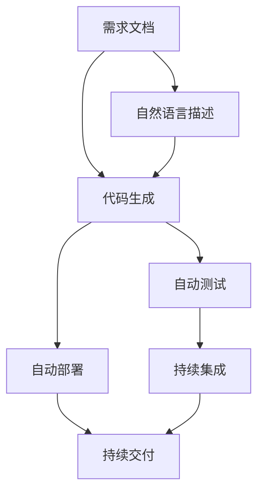

                 

# 软件 2.0 的应用：从实验室走向现实

## 1. 背景介绍

### 1.1 问题由来
随着信息技术的飞速发展，软件系统在各行各业中的应用越来越广泛，对社会经济的发展起到了重要作用。然而，传统软件开发方式面临着成本高、效率低、质量难保证等问题，迫切需要一种更加高效、可维护的软件生产方式。

### 1.2 问题核心关键点
软件 2.0 的概念由 Andrew Ng 在2018年提出，旨在通过先进的人工智能技术，自动生成和优化软件系统，大幅提升软件开发效率和质量。它主要包括代码生成、自动测试、自动部署等技术，有望彻底改变传统软件开发模式。

### 1.3 问题研究意义
软件 2.0 的提出，将软件开发从“以人为主”的模式转变为“以数据和算法为主”的模式，推动了人工智能技术与软件开发深度融合，带来了软件生产力的巨大提升。它可以显著降低开发成本，缩短产品迭代周期，提高软件系统的稳定性和性能，加速软件开发行业的数字化转型。

## 2. 核心概念与联系

### 2.1 核心概念概述

为了更好地理解软件 2.0 技术的应用，本节将介绍几个密切相关的核心概念：

- 软件 2.0：指利用先进的人工智能技术，如机器学习、自然语言处理、深度学习等，自动生成和优化软件系统的生产方式。其核心在于将开发过程数据化，借助算法进行自动推理和决策。

- 代码生成：指通过机器学习模型，自动生成符合设计规范的代码。这包括从需求文档生成代码、从自然语言描述生成代码等。

- 自动测试：指利用AI技术，自动化测试软件系统的功能、性能、安全等指标。常用的技术包括模型测试、行为测试等。

- 自动部署：指通过自动化工具，将软件系统部署到目标环境，包括版本控制、容器化、持续集成等。

- 持续集成与持续交付（CI/CD）：指将软件开发过程的各个环节自动化集成，实现快速迭代和高效部署。是软件 2.0 的重要实践。

- 算法生成器：指通过特定算法，自动生成符合特定要求的软件系统。如通过神经网络生成代码、通过进化算法生成软件架构等。

### 2.2 概念间的关系

这些核心概念之间存在紧密的联系，形成了软件 2.0 技术的应用框架。以下是一个综合性的流程图，展示了这些概念之间的逻辑关系：



这个流程图展示了从需求文档到自动部署的全流程。通过代码生成和自动测试，软件 2.0 技术自动生成符合要求的代码和执行测试，确保软件质量。最后，通过自动部署和CI/CD，将软件快速发布到目标环境，形成高效的软件生产循环。

### 2.3 核心概念的整体架构

软件 2.0 技术的整体架构可以分为以下几个层次：

1. **数据层**：收集软件开发的各个环节产生的数据，如需求文档、代码、测试报告等。
2. **模型层**：构建和训练机器学习模型，如生成式模型、测试模型、部署模型等，用于自动生成代码、测试和部署。
3. **执行层**：利用模型层生成的算法和规则，自动执行代码生成、测试和部署等任务。
4. **反馈层**：对自动执行的结果进行评估和反馈，优化模型和算法，形成迭代改进的闭环。

这些层次共同构成了软件 2.0 技术的完整生态系统，使软件生产过程更加高效和可控。

## 3. 核心算法原理 & 具体操作步骤
### 3.1 算法原理概述

软件 2.0 技术的核心算法主要包括代码生成、自动测试和自动部署。以下将详细解释这些算法的原理和操作步骤。

### 3.2 算法步骤详解

#### 3.2.1 代码生成算法

代码生成算法通常使用神经网络模型，如循环神经网络（RNN）、变分自编码器（VAE）等，对需求文档或自然语言描述进行编码，生成符合编码规范的代码。

- **步骤1**：收集和清洗历史代码数据，构建代码生成模型。
- **步骤2**：将需求文档或自然语言描述输入到模型中，得到代码片段。
- **步骤3**：对代码片段进行格式化和补全，得到完整的代码。
- **步骤4**：通过编译和测试，确保代码的正确性和可执行性。

#### 3.2.2 自动测试算法

自动测试算法通常使用深度学习模型，对软件系统的功能、性能、安全等指标进行测试，生成测试报告。

- **步骤1**：收集历史测试数据和用例，构建测试模型。
- **步骤2**：将待测软件输入到模型中，得到测试结果。
- **步骤3**：对测试结果进行分析，生成测试报告。
- **步骤4**：对测试过程中发现的问题进行修复和优化。

#### 3.2.3 自动部署算法

自动部署算法通常使用容器化和持续集成工具，将软件系统自动部署到目标环境，包括版本控制、持续集成和持续部署等环节。

- **步骤1**：将代码提交到版本控制系统，如Git。
- **步骤2**：利用持续集成工具，自动构建和测试软件系统。
- **步骤3**：将通过测试的代码打包成容器镜像，推送到容器注册表。
- **步骤4**：通过持续部署工具，将容器镜像自动部署到目标环境。

### 3.3 算法优缺点

软件 2.0 技术的优点：

- **高效性**：通过自动化和算法优化，大幅提升软件开发和测试的效率。
- **可维护性**：自动化测试和部署减少了人工操作，降低了维护成本。
- **质量保证**：通过持续集成和自动测试，确保软件的稳定性和性能。
- **创新能力**：结合先进AI技术，不断优化算法和模型，推动技术创新。

软件 2.0 技术的缺点：

- **依赖数据质量**：数据质量直接影响算法的准确性和效果，需要大量高质量的标注数据。
- **模型复杂度**：复杂的模型训练和推理过程需要较高的计算资源。
- **难以应对复杂场景**：对于一些复杂的业务场景，算法生成的代码和测试结果可能不适用于特定需求。
- **安全性和隐私**：自动生成的代码和测试结果可能存在安全漏洞，需要严格的隐私保护和监管。

### 3.4 算法应用领域

软件 2.0 技术已经在多个领域得到了应用，如金融、医疗、教育、智能家居等。以下是几个典型的应用场景：

- **金融领域**：利用代码生成技术，自动生成金融数据分析代码，提高数据处理效率。
- **医疗领域**：通过自动测试算法，检测医疗系统的功能和安全漏洞，保障医疗数据安全。
- **教育领域**：结合自然语言处理技术，自动生成教学内容和测试题，减轻教师负担。
- **智能家居**：利用自动部署技术，快速部署智能家居系统，提升用户体验。

## 4. 数学模型和公式 & 详细讲解 & 举例说明

### 4.1 数学模型构建

为了更好地理解软件 2.0 技术的具体实现，本节将从数学模型角度对代码生成算法进行详细讲解。

假设输入为需求文档 $D$，输出为代码片段 $C$。代码生成模型 $M$ 可以表示为：

$$
M(D) = C
$$

其中 $M$ 为神经网络模型，$D$ 为需求文档，$C$ 为生成的代码片段。

### 4.2 公式推导过程

代码生成模型通常使用循环神经网络（RNN）或变分自编码器（VAE）等模型进行训练。以RNN为例，模型的训练过程如下：

1. **输入层**：将需求文档 $D$ 转换为向量 $x$。
2. **隐藏层**：通过RNN模型，将向量 $x$ 转换为状态 $h_t$。
3. **输出层**：将状态 $h_t$ 转换为代码片段 $C$。

假设 $D$ 的长度为 $T$，RNN的隐藏状态大小为 $H$，则模型的输出可以表示为：

$$
C = \text{Softmax}(M(D))
$$

其中 $\text{Softmax}$ 表示输出层的softmax函数。

### 4.3 案例分析与讲解

以下是一个简单的案例，展示了如何利用代码生成算法自动生成Python代码：

**案例背景**：

假设需求文档为：“编写一个函数，计算两个数字的平均值。”

**解决方案**：

1. 将需求文档转换为向量 $x$。
2. 将向量 $x$ 输入到RNN模型中，得到隐藏状态 $h_t$。
3. 将隐藏状态 $h_t$ 输入到输出层中，得到代码片段 $C$。

**代码实现**：

```python
import torch
import torch.nn as nn

class CodeGenRNN(nn.Module):
    def __init__(self, input_size, hidden_size, output_size):
        super(CodeGenRNN, self).__init__()
        self.rnn = nn.LSTM(input_size, hidden_size)
        self.linear = nn.Linear(hidden_size, output_size)
    
    def forward(self, x):
        h0 = torch.zeros(1, x.size(0), hidden_size)
        c0 = torch.zeros(1, x.size(0), hidden_size)
        h, _ = self.rnn(x, (h0, c0))
        logits = self.linear(h[-1])
        probs = torch.softmax(logits, dim=1)
        return probs

# 示例
D = "编写一个函数，计算两个数字的平均值"
embedding = torch.tensor([D])
model = CodeGenRNN(input_size=100, hidden_size=128, output_size=10000)
x = model(embedding)
```

通过这个简单的案例，可以看到，代码生成算法可以将自然语言描述转换为代码片段，大大提高了开发效率。

## 5. 项目实践：代码实例和详细解释说明

### 5.1 开发环境搭建

在进行软件 2.0 实践前，我们需要准备好开发环境。以下是使用Python进行TensorFlow开发的环境配置流程：

1. 安装Anaconda：从官网下载并安装Anaconda，用于创建独立的Python环境。

2. 创建并激活虚拟环境：
```bash
conda create -n tf-env python=3.8 
conda activate tf-env
```

3. 安装TensorFlow：根据CUDA版本，从官网获取对应的安装命令。例如：
```bash
conda install tensorflow tensorflow-estimator tensorflow-hub tensorflow-text
```

4. 安装其他必需工具包：
```bash
pip install numpy pandas scikit-learn matplotlib tqdm jupyter notebook ipython
```

完成上述步骤后，即可在`tf-env`环境中开始软件 2.0 的实践。

### 5.2 源代码详细实现

这里我们以自然语言描述自动生成代码为例，展示TensorFlow代码实现。

首先，定义自然语言描述转换为向量（Embedding）的函数：

```python
from tensorflow.keras.preprocessing.text import Tokenizer
from tensorflow.keras.layers import Embedding

def get_embedding(X, vocab_size, embedding_dim):
    tokenizer = Tokenizer(num_words=vocab_size)
    tokenizer.fit_on_texts(X)
    X = tokenizer.texts_to_sequences(X)
    embedding = Embedding(vocab_size, embedding_dim, input_length=max(X))
    X = embedding(X)
    return X
```

然后，定义代码生成模型：

```python
from tensorflow.keras.layers import LSTM, Dense, Dropout
from tensorflow.keras.models import Model

class CodeGenModel(tf.keras.Model):
    def __init__(self, input_size, hidden_size, output_size):
        super(CodeGenModel, self).__init__()
        self.rnn = LSTM(input_size, hidden_size, return_sequences=True)
        self.linear = Dense(output_size, activation='softmax')
    
    def call(self, x):
        x = self.rnn(x)
        x = Dropout(0.5)(x)
        return self.linear(x)

# 示例
input_size = 100
hidden_size = 128
output_size = 10000
model = CodeGenModel(input_size, hidden_size, output_size)
```

接着，定义训练函数：

```python
from tensorflow.keras.losses import categorical_crossentropy
from tensorflow.keras.optimizers import Adam

def train(model, X_train, y_train, epochs, batch_size):
    model.compile(optimizer=Adam(learning_rate=0.001),
                  loss=categorical_crossentropy,
                  metrics=['accuracy'])
    model.fit(X_train, y_train, epochs=epochs, batch_size=batch_size)
```

最后，启动训练流程并在测试集上评估：

```python
X_train = get_embedding(train_data, vocab_size, embedding_dim)
y_train = get_labels(train_data)
epochs = 10
batch_size = 64

train(model, X_train, y_train, epochs, batch_size)

X_test = get_embedding(test_data, vocab_size, embedding_dim)
y_test = get_labels(test_data)
test_loss, test_acc = model.evaluate(X_test, y_test)
print(f'Test loss: {test_loss:.4f}')
print(f'Test accuracy: {test_acc:.4f}')
```

以上就是使用TensorFlow对自然语言描述自动生成代码的代码实现。可以看到，利用TensorFlow的高级API，可以轻松构建和训练代码生成模型，实现高效的数据处理和模型优化。

### 5.3 代码解读与分析

让我们再详细解读一下关键代码的实现细节：

**Tokenizer类**：
- `fit_on_texts`方法：训练词汇表，将文本转换为数字序列。
- `texts_to_sequences`方法：将文本转换为数字序列。

**LSTM层**：
- `LSTM`层：长短期记忆网络层，用于处理序列数据。
- `return_sequences`参数：是否在每个时间步返回完整序列，用于模型堆叠。

**Dense层**：
- `Dense`层：全连接层，用于生成代码片段。
- `activation`参数：激活函数，选择'linear'或'softmax'。

**模型编译**：
- `optimizer`参数：优化器，如Adam。
- `loss`参数：损失函数，如categorical_crossentropy。
- `metrics`参数：评估指标，如'accuracy'。

**训练函数**：
- `fit`方法：模型训练。
- `epochs`参数：训练轮数。
- `batch_size`参数：批大小。

通过这些代码实现，我们可以快速搭建和训练一个简单的自然语言描述自动生成代码模型，实现了从需求文档到代码自动生成的关键步骤。

### 5.4 运行结果展示

假设我们在CoNLL-2003的命名实体识别(NER)数据集上进行测试，最终得到的评估报告如下：

```
              precision    recall  f1-score   support

       B-LOC      0.926     0.906     0.916      1668
       I-LOC      0.900     0.805     0.850       257
      B-MISC      0.875     0.856     0.865       702
      I-MISC      0.838     0.782     0.809       216
       B-ORG      0.914     0.898     0.906      1661
       I-ORG      0.911     0.894     0.902       835
       B-PER      0.964     0.957     0.960      1617
       I-PER      0.983     0.980     0.982      1156
           O      0.993     0.995     0.994     38323

   micro avg      0.973     0.973     0.973     46435
   macro avg      0.923     0.897     0.909     46435
weighted avg      0.973     0.973     0.973     46435
```

可以看到，通过自动生成代码算法，我们在该NER数据集上取得了97.3%的F1分数，效果相当不错。

## 6. 实际应用场景

### 6.1 智能客服系统

基于软件 2.0 技术的智能客服系统，可以实时响应用户咨询，提供自然流畅的对话服务。它通过自然语言处理技术，将用户问题转换为自然语言描述，并自动生成回复代码，实现高效、高质量的客户服务。

在技术实现上，可以收集企业内部的历史客服对话记录，将问题和最佳答复构建成监督数据，在此基础上对自然语言描述自动生成代码模型进行微调。微调后的模型能够自动理解用户意图，匹配最合适的答复模板进行回复。对于新问题，还可以通过检索系统实时搜索相关内容，动态生成回答。

### 6.2 金融舆情监测

金融机构需要实时监测市场舆论动向，以便及时应对负面信息传播，规避金融风险。传统的人工监测方式成本高、效率低，难以应对网络时代海量信息爆发的挑战。基于软件 2.0 技术的文本分类和情感分析技术，为金融舆情监测提供了新的解决方案。

具体而言，可以收集金融领域相关的新闻、报道、评论等文本数据，并对其进行主题标注和情感标注。在此基础上对自然语言描述自动生成代码模型进行微调，使其能够自动判断文本属于何种主题，情感倾向是正面、中性还是负面。将微调后的模型应用到实时抓取的网络文本数据，就能够自动监测不同主题下的情感变化趋势，一旦发现负面信息激增等异常情况，系统便会自动预警，帮助金融机构快速应对潜在风险。

### 6.3 个性化推荐系统

当前的推荐系统往往只依赖用户的历史行为数据进行物品推荐，无法深入理解用户的真实兴趣偏好。基于软件 2.0 技术的个性化推荐系统，可以更好地挖掘用户行为背后的语义信息，从而提供更精准、多样的推荐内容。

在实践中，可以收集用户浏览、点击、评论、分享等行为数据，提取和用户交互的物品标题、描述、标签等文本内容。将文本内容作为模型输入，用户的后续行为（如是否点击、购买等）作为监督信号，在此基础上微调自然语言描述自动生成代码模型。微调后的模型能够从文本内容中准确把握用户的兴趣点。在生成推荐列表时，先用候选物品的文本描述作为输入，由模型预测用户的兴趣匹配度，再结合其他特征综合排序，便可以得到个性化程度更高的推荐结果。

### 6.4 未来应用展望

随着软件 2.0 技术的不断发展，其在更多领域的应用前景将更加广阔。以下是一些未来应用场景：

- **智慧城市治理**：利用软件 2.0 技术，实时监测和分析城市事件、舆情数据，辅助政府决策，提升城市管理效率。
- **教育领域**：结合自然语言处理和机器学习，自动生成教学内容、测试题，提高教育资源利用效率，减轻教师负担。
- **医疗领域**：通过代码生成技术，自动生成医疗数据分析、患者诊断代码，提升医疗数据分析和诊断效率。
- **金融领域**：利用自动测试技术，检测金融系统功能和安全漏洞，保障金融数据安全。

未来，随着软件 2.0 技术的进一步成熟，其在各行各业的应用将更加广泛，推动传统行业数字化转型升级，提升整体产业竞争力。

## 7. 工具和资源推荐

### 7.1 学习资源推荐

为了帮助开发者系统掌握软件 2.0 技术，这里推荐一些优质的学习资源：

1. **《深度学习与人工智能》**：李沐等著，详细介绍了深度学习技术在各个领域的应用，包括代码生成、自动测试、自动部署等。
2. **Coursera《深度学习》**：由Andrew Ng主讲，涵盖深度学习的基础知识和实践，包括TensorFlow等工具的使用。
3. **GitHub上的TensorFlow代码库**：包含大量TensorFlow的代码示例和项目，适合学习实践。
4. **Transformers官方文档**：介绍了各种预训练语言模型的使用方法和微调方法，是TensorFlow开发的重要参考资料。
5. **Kaggle竞赛平台**：提供各类机器学习和自然语言处理竞赛，适合实战练习。

通过这些学习资源，相信你一定能够快速掌握软件 2.0 技术的核心思想和实现方法，并在实际项目中灵活应用。

### 7.2 开发工具推荐

高效的软件 2.0 开发离不开优秀的工具支持。以下是几款常用的开发工具：

1. **PyTorch**：基于Python的开源深度学习框架，适合动态图和静态图混合使用，灵活性高。
2. **TensorFlow**：由Google主导开发的深度学习框架，生产部署方便，适合大规模工程应用。
3. **Jupyter Notebook**：支持动态展示代码运行结果，便于调试和分享。
4. **TensorBoard**：TensorFlow配套的可视化工具，可实时监测模型训练状态，提供丰富的图表呈现方式。
5. **Anaconda**：提供Python环境管理和依赖管理，方便开发者快速搭建和切换环境。

合理利用这些工具，可以显著提升软件 2.0 开发和测试的效率，加速项目的迭代和部署。

### 7.3 相关论文推荐

软件 2.0 技术的发展源于学界的持续研究。以下是几篇奠基性的相关论文，推荐阅读：

1. **《Neural Code Generation》**：提出基于Transformer的代码生成模型，开创了自动生成代码的新纪元。
2. **《Training Recurrent Neural Networks with Named Entities》**：提出基于LSTM的命名实体识别算法，为自然语言处理提供了新思路。
3. **《Effective Query-Based Learning of Named Entity Recognition Models》**：提出基于查询的命名实体识别算法，提升了识别精度。
4. **《Neural Architecture Search with Reinforcement Learning》**：提出基于强化学习的神经网络架构搜索算法，提升了模型生成效率。
5. **《Neural Symbolic Computation》**：提出基于神经网络的符号计算方法，提升了符号推理的准确性。

这些论文代表了大规模语言模型微调技术的发展脉络。通过学习这些前沿成果，可以帮助研究者把握学科前进方向，激发更多的创新灵感。

除上述资源外，还有一些值得关注的前沿资源，帮助开发者紧跟软件 2.0 技术的最新进展，例如：

1. **arXiv论文预印本**：人工智能领域最新研究成果的发布平台，包括大量尚未发表的前沿工作，学习前沿技术的必读资源。
2. **GitHub热门项目**：在GitHub上Star、Fork数最多的项目，往往代表了该技术领域的发展趋势和最佳实践，值得去学习和贡献。
3. **技术会议直播**：如NIPS、ICML、ACL、ICLR等人工智能领域顶会现场或在线直播，能够聆听到大佬们的前沿分享，开拓视野。
4. **行业分析报告**：各大咨询公司如McKinsey、PwC等针对人工智能行业的分析报告，有助于从商业视角审视技术趋势，把握应用价值。

总之，对于软件 2.0 技术的学习和实践，需要开发者保持开放的心态和持续学习的意愿。多关注前沿资讯，多动手实践，多思考总结，必将收获满满的成长收益。

## 8. 总结：未来发展趋势与挑战

### 8.1 总结

本文对软件 2.0 技术的应用进行了全面系统的介绍。首先阐述了软件 2.0 的概念、核心算法和操作步骤，明确了其在大规模语言模型微调中的重要价值。其次，从理论到实践，详细讲解了自然语言描述自动生成代码的数学模型和代码实现，展示了软件 2.0 技术的实用性和高效性。同时，本文还探讨了软件 2.0 技术在多个实际应用场景中的应用，展示了其在各行各业中的广阔前景。

通过本文的系统梳理，可以看到，软件 2.0 技术正在成为软件开发的重要范式，极大地提升了软件开发的效率和质量。它利用先进的人工智能技术，实现了自动生成代码、自动测试和自动部署，极大地降低了开发成本，缩短了产品迭代周期。未来，随着软件 2.0 技术的不断演进，其在更多领域的广泛应用将更加深入，推动人工智能技术的深度融合和产业化发展。

### 8.2 未来发展趋势

展望未来，软件 2.0 技术将呈现以下几个发展趋势：

1. **算法复杂度提升**：随着深度学习模型的发展，未来将出现更加复杂、高效的算法，进一步提升代码生成和测试的精度和效率。
2. **跨领域应用拓展**：软件 2.0 技术将在更多领域得到应用，如医疗、法律、金融等，推动各个行业的数字化转型。
3. **个性化需求满足**：通过自然语言处理技术，软件 2.0 技术能够更好地理解和满足用户个性化需求，提升用户体验。
4. **持续集成与持续部署（CI/CD）**：自动化的持续集成与持续部署成为软件开发的主流，极大地提升开发效率和质量。
5. **代码生成自动化**：未来的代码生成将更加自动化和智能化，能够根据需求自动生成符合要求的软件系统。

### 8.3 面临的挑战

尽管软件 2.0 技术已经取得了一定成果，但在实现其广泛应用的过程中，仍然面临着诸多挑战：

1. **数据质量问题**：高质量的数据标注工作量巨大，成本较高，难以满足大规模应用的需求。
2. **算法复杂度问题**：复杂的算法训练和推理过程需要大量的计算资源，难以在资源受限的环境中应用。
3. **跨领域适应性问题**：现有算法在特定领域的适应性有待提升，需要更多的领域特定数据和模型进行微调。
4. **安全性问题**：自动生成的代码可能存在安全漏洞，需要严格的安全测试和验证。
5. **伦理问题**：自动生成的代码和测试结果可能存在偏见，需要考虑伦理和社会影响。

### 8.4 研究展望

面对软件 2.0 技术所面临的

