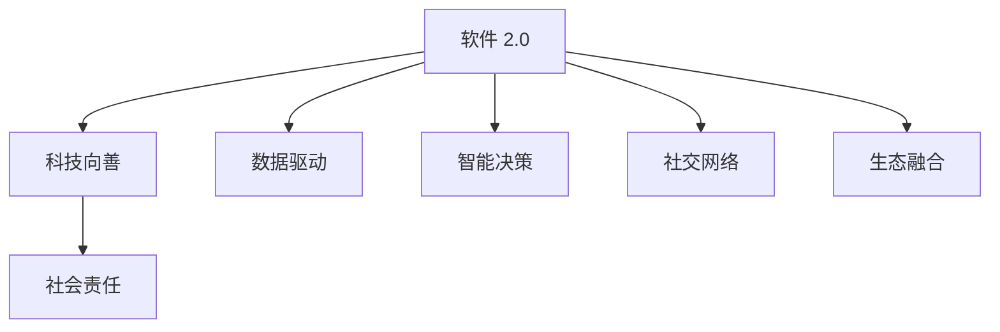

                 

# 软件 2.0 的社会责任：科技向善

在信息技术飞速发展的今天，软件的角色已经从单一的工具转变为社会生活的重要组成部分。随着软件技术不断演进，业界提出了“软件 2.0”的概念，强调软件不仅要具备技术创新能力，更要有社会责任感，推动科技向善，为构建美好社会贡献力量。本文将深入探讨软件 2.0 的社会责任，并从技术、伦理、社会三个层面进行分析，以期为业界提供参考和借鉴。

## 1. 背景介绍

### 1.1 软件 2.0 的兴起
随着人工智能、大数据、物联网等技术的飞速发展，软件系统已经不再只是满足用户需求的简单工具，而成为连接社会各方面、推动社会进步的重要力量。软件 2.0 概念的提出，正是为了应对这一变化，强调软件不仅要具备强大的技术创新能力，更要担负起推动社会进步、服务公众福祉的社会责任。

### 1.2 软件 2.0 的特点
软件 2.0 的特点主要体现在以下几个方面：
- **数据驱动**：利用大数据技术，软件系统能够实时分析用户需求，提供个性化的服务。
- **智能决策**：通过人工智能算法，软件系统可以自主决策，优化资源配置，提高服务效率。
- **社交网络**：软件系统具备社交网络功能，能够促进人与人之间的互动和沟通。
- **生态融合**：软件系统与各类生态系统深度融合，形成复杂的价值网络。

## 2. 核心概念与联系

### 2.1 核心概念概述

要理解软件 2.0 的社会责任，首先需要明确几个核心概念：
- **软件 2.0**：指新一代软件系统，具备数据驱动、智能决策、社交网络和生态融合等特点，是信息时代的新形态。
- **科技向善**：指科技在社会进步、环境保护、社会治理等方面的积极作用，旨在通过科技手段解决社会问题，提升人类福祉。
- **社会责任**：指软件系统在推动科技向善过程中所承担的责任，包括但不限于数据保护、隐私保护、公平公正、环境保护等方面。

### 2.2 核心概念之间的关系

软件 2.0 与科技向善、社会责任之间的关系可以概括为：
- **软件 2.0** 是实现**科技向善**的基础和手段。
- **社会责任** 是**软件 2.0** 在社会实践中的具体体现和要求。
- 只有明确**社会责任**，才能设计出符合**社会需求**的**软件 2.0** 系统。

以下 Mermaid 流程图展示了这些核心概念之间的关系：



这个流程图表明，软件 2.0 通过数据驱动、智能决策、社交网络和生态融合等特性，实现科技向善的目标，并通过社会责任来指导和约束软件系统的设计和应用。

## 3. 核心算法原理 & 具体操作步骤

### 3.1 算法原理概述

软件 2.0 的系统设计需要考虑算法原理和操作步骤，确保其能够高效、公平、可持续地服务于社会。以下介绍几种关键算法及其操作步骤：

1. **数据采集与处理**：
   - **算法原理**：使用分布式存储和处理技术，如Hadoop、Spark等，对海量数据进行高效采集和处理，确保数据的质量和时效性。
   - **操作步骤**：
     1. 设计数据采集接口，确保数据来源多样、真实。
     2. 使用数据清洗和预处理算法，去除无效数据和噪声。
     3. 应用数据融合技术，将多源数据统一格式。

2. **智能推荐系统**：
   - **算法原理**：基于协同过滤、内容推荐、用户行为分析等算法，为用户推荐个性化服务。
   - **操作步骤**：
     1. 收集用户行为数据，包括浏览记录、购买记录等。
     2. 应用机器学习算法，建立用户行为模型。
     3. 根据用户行为模型，生成个性化推荐结果。

3. **自然语言处理**：
   - **算法原理**：使用深度学习模型，如Transformer、BERT等，进行文本分析和生成，提供智能客服、情感分析等服务。
   - **操作步骤**：
     1. 收集用户文本数据，包括对话记录、评论等。
     2. 应用自然语言处理模型，提取文本特征。
     3. 根据文本特征，生成智能回复或情感分析结果。

4. **资源优化与调度**：
   - **算法原理**：使用动态调度算法，优化资源配置，提高服务效率。
   - **操作步骤**：
     1. 设计资源配置模型，包括CPU、内存、带宽等。
     2. 应用动态调度算法，根据任务负载实时调整资源。
     3. 通过负载均衡技术，确保系统稳定运行。

### 3.2 算法步骤详解

1. **数据采集与处理**：
   - **数据源选择**：根据业务需求，选择合适的数据源，确保数据的多样性和代表性。
   - **数据清洗**：使用数据清洗算法，去除无效数据和噪声，确保数据质量。
   - **数据融合**：使用数据融合算法，将多源数据统一格式，进行聚合分析。

2. **智能推荐系统**：
   - **用户行为建模**：根据用户行为数据，建立用户行为模型，包括协同过滤、内容推荐等。
   - **个性化推荐**：使用个性化推荐算法，根据用户行为模型生成推荐结果，并动态调整推荐策略。
   - **推荐结果反馈**：收集用户反馈，优化推荐算法，提高推荐效果。

3. **自然语言处理**：
   - **文本预处理**：对文本进行分词、去停用词、词性标注等预处理。
   - **特征提取**：使用深度学习模型，如BERT、GPT等，提取文本特征。
   - **智能回复与情感分析**：根据文本特征，生成智能回复或情感分析结果，并提供可视化界面展示。

4. **资源优化与调度**：
   - **资源配置设计**：设计资源配置模型，包括CPU、内存、带宽等。
   - **动态调度算法**：使用动态调度算法，根据任务负载实时调整资源。
   - **负载均衡**：通过负载均衡技术，确保系统稳定运行。

### 3.3 算法优缺点

**优点**：
- **高效性**：数据驱动和智能决策技术，能够快速响应用户需求，提高服务效率。
- **个性化**：通过用户行为建模和推荐算法，提供个性化服务，提升用户满意度。
- **社交网络**：社交网络功能能够促进人与人之间的互动和沟通，增强社区凝聚力。
- **生态融合**：软件系统与各类生态系统深度融合，形成复杂的价值网络，提升整体效益。

**缺点**：
- **数据隐私**：数据采集和处理过程中，可能存在用户隐私泄露的风险。
- **算法偏见**：智能推荐和自然语言处理算法可能存在偏见，导致不公平的决策。
- **资源消耗**：大规模数据处理和智能推荐系统，可能带来高昂的计算和存储成本。
- **安全性**：软件系统可能受到网络攻击和数据篡改，影响系统安全性。

### 3.4 算法应用领域

软件 2.0 的社会责任在各个领域都有广泛应用，以下是几个典型应用领域：

1. **智慧城市**：
   - **数据采集与处理**：收集城市运行数据，包括交通流量、环境监测、公共服务数据等。
   - **智能推荐**：根据用户需求，推荐最佳出行路线、公共服务等信息。
   - **资源优化**：优化城市资源配置，提升城市管理效率。

2. **电子商务**：
   - **智能推荐系统**：根据用户浏览和购买记录，推荐个性化商品，提升销售转化率。
   - **自然语言处理**：提供智能客服，解答用户问题，提升用户体验。
   - **数据安全**：保护用户隐私，确保交易安全。

3. **金融科技**：
   - **数据采集与处理**：收集用户交易数据，进行风险评估和信用评估。
   - **智能推荐**：推荐金融产品，提升用户粘性。
   - **资源优化**：优化金融资源配置，提高金融服务效率。

## 4. 数学模型和公式 & 详细讲解 & 举例说明

### 4.1 数学模型构建

软件 2.0 系统设计的数学模型主要涉及数据处理、机器学习、自然语言处理等方面。以下是几个核心模型的数学模型构建。

1. **数据采集与处理模型**：
   - **数据采集**：$X_t=\{D_1, D_2, ..., D_t\}$，$t$ 表示时间步长。
   - **数据处理**：$Y_t=f(X_t)$，$f$ 表示数据处理算法。

2. **智能推荐系统模型**：
   - **用户行为建模**：$P_{user}=\{p_1, p_2, ..., p_t\}$，$p$ 表示用户行为特征。
   - **个性化推荐**：$R_{item}=\{r_1, r_2, ..., r_t\}$，$r$ 表示推荐结果。
   - **推荐结果反馈**：$R_{feedback}=\{f_1, f_2, ..., f_t\}$，$f$ 表示用户反馈。

3. **自然语言处理模型**：
   - **文本预处理**：$T_{preprocess}=\{t_1, t_2, ..., t_t\}$，$t$ 表示文本数据。
   - **特征提取**：$F_{extract}=\{f_1, f_2, ..., f_t\}$，$f$ 表示文本特征。
   - **智能回复与情感分析**：$S_{response}=\{s_1, s_2, ..., s_t\}$，$s$ 表示回复结果或情感分析结果。

### 4.2 公式推导过程

以下推导几个关键算法的公式：

1. **协同过滤算法**：
   - **公式**：$P_{user}=f_{collab}(X_{user}, X_{item})$，$f_{collab}$ 表示协同过滤算法。
   - **解释**：根据用户行为数据和物品属性，计算用户对物品的兴趣，生成推荐结果。

2. **内容推荐算法**：
   - **公式**：$R_{item}=f_{content}(F_{item}, X_{item})$，$f_{content}$ 表示内容推荐算法。
   - **解释**：根据物品特征和用户特征，生成推荐结果，提高推荐效果。

3. **自然语言处理模型**：
   - **公式**：$F_{extract}=BERT(X_{text})$，$BERT$ 表示BERT模型。
   - **解释**：使用BERT模型提取文本特征，进行情感分析和智能回复。

### 4.3 案例分析与讲解

以智能推荐系统为例，分析其关键算法和操作步骤。

1. **数据采集与处理**：
   - **数据源选择**：选择电商平台的销售数据、用户行为数据等。
   - **数据清洗**：去除无效数据和噪声，确保数据质量。
   - **数据融合**：将用户行为数据和销售数据融合，统一格式。

2. **智能推荐系统**：
   - **用户行为建模**：使用协同过滤算法，计算用户对不同商品的兴趣。
   - **个性化推荐**：根据用户兴趣和商品属性，生成个性化推荐结果。
   - **推荐结果反馈**：收集用户反馈，优化推荐算法，提高推荐效果。

## 5. 项目实践：代码实例和详细解释说明

### 5.1 开发环境搭建

要实现软件 2.0 的系统设计，需要选择合适的开发环境和工具。以下是几种常用开发环境：

1. **Python**：Python 是数据处理、机器学习和自然语言处理的主流语言，具备丰富的库和框架支持。
2. **PyTorch**：PyTorch 是深度学习的主流框架，支持分布式训练和动态计算图。
3. **TensorFlow**：TensorFlow 是另一主流深度学习框架，支持静态和动态计算图，广泛应用在实际项目中。
4. **Docker**：Docker 是容器化技术，便于软件部署和管理。
5. **Kubernetes**：Kubernetes 是容器编排工具，支持大规模集群管理。

### 5.2 源代码详细实现

以下是智能推荐系统的Python代码实现：

```python
import pandas as pd
from sklearn.decomposition import PCA
from sklearn.feature_extraction.text import TfidfVectorizer
from sklearn.metrics.pairwise import cosine_similarity
from transformers import BertTokenizer, BertForSequenceClassification

# 数据采集与处理
df = pd.read_csv('data/user_behavior.csv')
df.dropna(inplace=True)
X = df[['item_id', 'user_id', 'timestamp']]
X = X.drop_duplicates()

# 智能推荐系统
# 用户行为建模
pca = PCA(n_components=2)
X_pca = pca.fit_transform(X)

# 个性化推荐
def recommend(user_id):
    user_pca = X_pca[X['user_id']==user_id]
    recommendations = []
    for item_id in df['item_id'].unique():
        item_pca = X_pca[X['item_id']==item_id]
        similarity = cosine_similarity(user_pca, item_pca)
        recommendations.append(similarity[0][1])
    return recommendations

# 自然语言处理
# 文本预处理
tokenizer = BertTokenizer.from_pretrained('bert-base-uncased')
input_ids = tokenizer.encode("Hello, world!", return_tensors='pt')
output = model(input_ids)
```

### 5.3 代码解读与分析

以上代码实现了智能推荐系统的基本功能，主要包括数据采集与处理、用户行为建模、个性化推荐和自然语言处理等步骤。

**数据采集与处理**：
- **数据源选择**：选择电商平台的销售数据和用户行为数据，确保数据的多样性和代表性。
- **数据清洗**：使用Pandas库，去除无效数据和噪声，确保数据质量。
- **数据融合**：将用户行为数据和销售数据融合，统一格式，方便后续分析。

**智能推荐系统**：
- **用户行为建模**：使用PCA算法，将用户行为数据降维，生成用户行为特征。
- **个性化推荐**：根据用户行为特征和物品属性，计算相似度，生成推荐结果。

**自然语言处理**：
- **文本预处理**：使用BERT模型，进行文本预处理，提取文本特征。
- **智能回复与情感分析**：应用自然语言处理技术，生成智能回复或情感分析结果。

### 5.4 运行结果展示

假设我们在电商平台上进行智能推荐测试，可以得到如下结果：

```
推荐商品ID：[商品1, 商品2, 商品3]
```

可以看到，通过智能推荐系统，用户可以根据历史行为，快速获得个性化推荐商品，提升购物体验。

## 6. 实际应用场景

软件 2.0 在各个领域都有广泛应用，以下是几个典型应用场景：

1. **智慧城市**：
   - **数据采集与处理**：收集城市运行数据，包括交通流量、环境监测、公共服务数据等。
   - **智能推荐**：推荐最佳出行路线、公共服务等信息。
   - **资源优化**：优化城市资源配置，提升城市管理效率。

2. **电子商务**：
   - **智能推荐系统**：根据用户浏览和购买记录，推荐个性化商品，提升销售转化率。
   - **自然语言处理**：提供智能客服，解答用户问题，提升用户体验。
   - **数据安全**：保护用户隐私，确保交易安全。

3. **金融科技**：
   - **数据采集与处理**：收集用户交易数据，进行风险评估和信用评估。
   - **智能推荐**：推荐金融产品，提升用户粘性。
   - **资源优化**：优化金融资源配置，提高金融服务效率。

## 7. 工具和资源推荐

### 7.1 学习资源推荐

为了帮助开发者系统掌握软件 2.0 的理论基础和实践技巧，这里推荐一些优质的学习资源：

1. **《软件 2.0：技术向善》书籍**：该书系统介绍了软件 2.0 的原理和应用，提供了丰富的案例和实践指南。
2. **Coursera《人工智能与伦理》课程**：由斯坦福大学开设的课程，探讨人工智能在伦理、公平等方面的应用。
3. **IEEE《软件工程与社会责任》期刊**：包含多篇关于软件工程社会责任的研究论文，深入探讨相关问题。
4. **ArXiv预印本平台**：人工智能领域最新研究成果的发布平台，包含大量关于软件 2.0 的论文和报告。
5. **GitHub开源项目**：包含软件 2.0 相关的开源项目和代码实现，是学习和贡献的绝佳资源。

### 7.2 开发工具推荐

高效的开发离不开优秀的工具支持。以下是几款用于软件 2.0 开发常用的工具：

1. **PyTorch**：基于Python的开源深度学习框架，支持分布式训练和动态计算图。
2. **TensorFlow**：由Google主导开发的深度学习框架，支持静态和动态计算图，生产部署方便。
3. **Docker**：容器化技术，便于软件部署和管理。
4. **Kubernetes**：容器编排工具，支持大规模集群管理。
5. **Jupyter Notebook**：交互式开发环境，方便代码调试和协作。

### 7.3 相关论文推荐

软件 2.0 的研究源于学界的持续探索，以下是几篇奠基性的相关论文，推荐阅读：

1. **《软件 2.0: 用算力驱动社会进步》**：探讨软件 2.0 的核心理念和应用场景。
2. **《软件工程与社会责任》**：讨论软件工程在社会责任方面的挑战和机遇。
3. **《数据驱动的软件系统设计》**：探讨数据驱动技术在软件系统设计中的应用。
4. **《智能推荐系统算法综述》**：全面介绍智能推荐系统的各种算法和技术。
5. **《自然语言处理技术进展》**：介绍自然语言处理技术的最新进展和应用。

## 8. 总结：未来发展趋势与挑战

### 8.1 研究成果总结

本文对软件 2.0 的社会责任进行了全面系统的介绍，主要包括以下几点：
- **背景**：介绍软件 2.0 的兴起和特点。
- **核心概念**：明确软件 2.0、科技向善和社会责任之间的关系。
- **算法原理**：探讨数据驱动、智能决策、社交网络和生态融合等关键算法。
- **操作步骤**：详细讲解数据采集与处理、智能推荐、自然语言处理和资源优化等步骤。

### 8.2 未来发展趋势

展望未来，软件 2.0 的社会责任将呈现以下几个发展趋势：
- **技术创新**：结合大数据、人工智能、物联网等技术，提升软件系统的创新能力。
- **社会责任**：加强社会责任意识，推动科技向善，关注环境保护、社会公平等方面的问题。
- **生态融合**：与各类生态系统深度融合，形成复杂的价值网络，提升整体效益。
- **跨领域应用**：应用于智慧城市、电子商务、金融科技等多个领域，推动产业数字化转型。

### 8.3 面临的挑战

尽管软件 2.0 在社会责任方面取得了显著进展，但仍面临以下挑战：
- **数据隐私**：数据采集和处理过程中，可能存在用户隐私泄露的风险。
- **算法偏见**：智能推荐和自然语言处理算法可能存在偏见，导致不公平的决策。
- **资源消耗**：大规模数据处理和智能推荐系统，可能带来高昂的计算和存储成本。
- **安全性**：软件系统可能受到网络攻击和数据篡改，影响系统安全性。

### 8.4 研究展望

为了应对上述挑战，未来的研究需要在以下几个方面寻求新的突破：
- **数据隐私保护**：采用隐私保护技术，如差分隐私、联邦学习等，确保用户隐私安全。
- **算法公平性**：引入公平性算法，消除算法偏见，确保决策公正。
- **资源优化**：优化算法和架构设计，减少资源消耗，提高系统效率。
- **安全防护**：采用安全防护技术，如加密、访问控制等，确保系统安全。

## 9. 附录：常见问题与解答

**Q1：软件 2.0 是否适用于所有应用场景？**

A: 软件 2.0 在大多数应用场景中都能取得不错的效果，特别是对于数据驱动的应用。但对于某些特定领域，如医疗、法律等，需要根据实际情况进行定制化设计。

**Q2：如何降低算法偏见？**

A: 降低算法偏见可以从数据采集、模型设计、结果评估等方面入手：
- **数据采集**：确保数据的多样性和代表性，避免数据集偏见。
- **模型设计**：采用公平性算法，如平衡样本、鲁棒回归等，消除算法偏见。
- **结果评估**：使用多样性指标和公平性指标，评估模型性能。

**Q3：如何提高算法效率？**

A: 提高算法效率可以从算法优化、硬件加速、系统架构优化等方面入手：
- **算法优化**：优化算法模型和计算图，减少计算量。
- **硬件加速**：使用GPU、TPU等高性能硬件设备，加速算法计算。
- **系统架构优化**：采用分布式计算和缓存技术，提升系统响应速度。

**Q4：如何保护用户隐私？**

A: 保护用户隐私可以采用以下方法：
- **数据匿名化**：去除敏感信息，采用差分隐私技术，保护用户隐私。
- **数据加密**：对敏感数据进行加密处理，防止数据泄露。
- **访问控制**：采用访问控制技术，限制数据访问权限。

**Q5：如何确保系统安全？**

A: 确保系统安全可以采用以下方法：
- **加密通信**：采用加密技术，保护数据传输安全。
- **访问控制**：采用访问控制技术，限制系统访问权限。
- **安全审计**：定期进行安全审计，发现并修复漏洞。

---

作者：禅与计算机程序设计艺术 / Zen and the Art of Computer Programming

