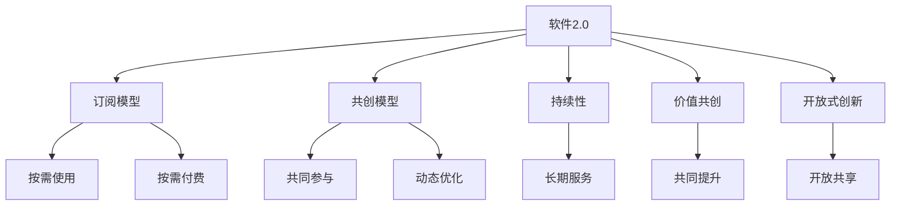
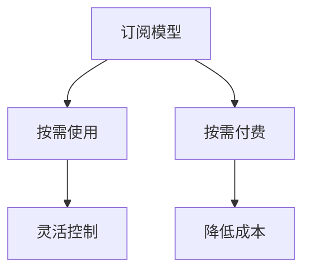
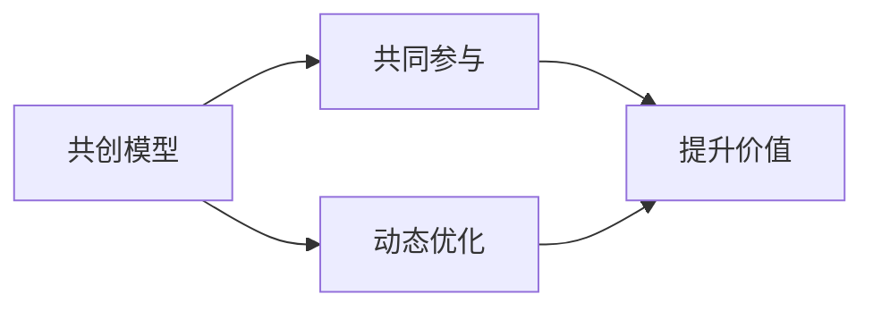
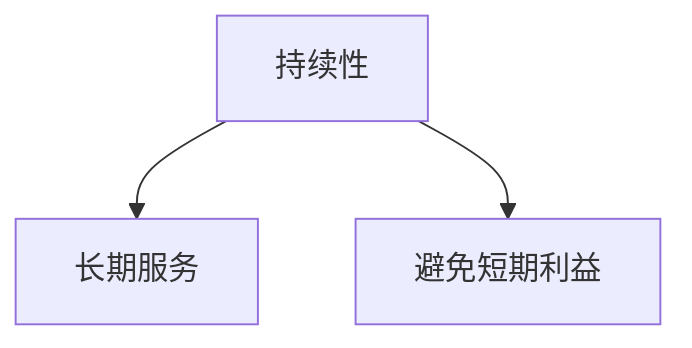
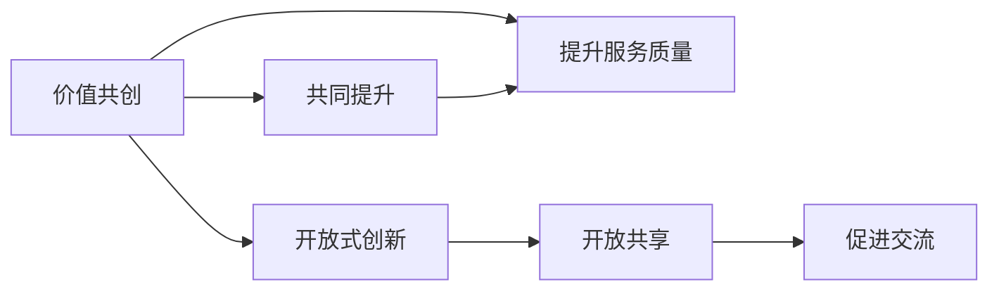
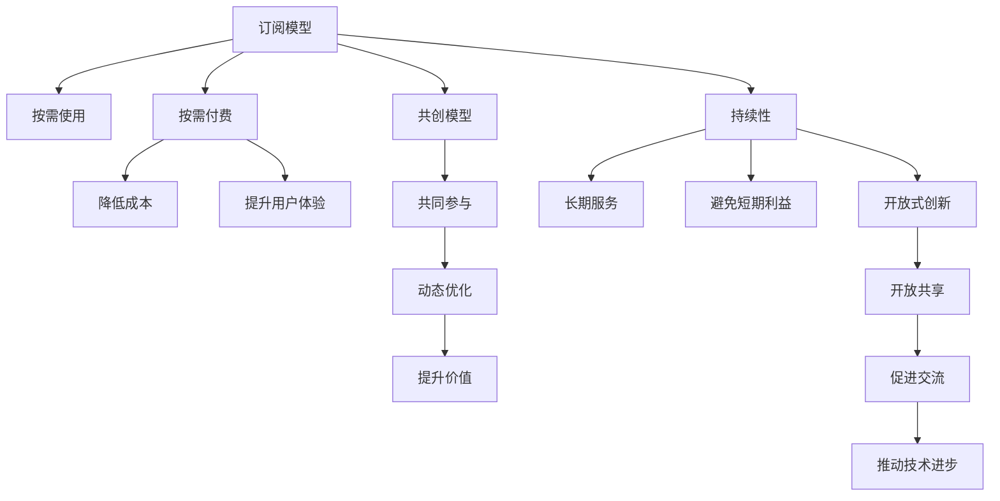

                 

# 软件2.0的商业模式创新

软件产业经历了数十年的发展和变革，从传统的软件许可（Software as a License，简称SaaL）模式，到云服务（Software as a Service，简称SaaS）模式，再到最新的软件即服务（Software as a Service，简称SaaS）模式。每一种模式都有其独特的价值和应用场景，满足了不同阶段的市场需求。而软件2.0，即基于2.0版本的软件模型，则进一步探索了软件的本质，提出了一种全新的商业模式——以订阅和共创为核心的商业模式。

## 1. 背景介绍

### 1.1 问题由来

随着互联网的普及和技术的进步，传统软件许可模式的弊端逐渐显现：成本高、部署复杂、维护困难等。云服务模式虽然解决了部分问题，但仍然存在许多痛点，如客户数据安全和隐私问题、服务质量和稳定性问题、数据共享和互操作性问题等。这些问题逐渐引发了业界对新的软件模式的探索和思考。

软件2.0的出现，正是在这样的背景下提出的。它不仅继承了云服务的优势，如按需服务、按需付费，还通过订阅和共创模式，进一步提升了软件的价值和用户体验。软件2.0不仅是一个技术概念，更是一种全新的商业模式，为软件产业的未来发展指明了方向。

### 1.2 问题核心关键点

软件2.0的核心思想是通过订阅和共创，建立一种持续、动态、共益的商业生态系统。其关键点包括：

- 订阅：用户按需使用软件，按时间或功能付费，无需一次性购买。
- 共创：用户和企业共同参与软件的设计、开发、优化和推广，形成良性互动。
- 持续性：软件2.0追求长期的持续服务，而非短期的价值获取。

这些关键点共同构成了软件2.0的商业模式创新，使其具备了更强的市场适应性和发展潜力。

### 1.3 问题研究意义

研究软件2.0的商业模式创新，对于提升软件产业的竞争力、推动软件生态的繁荣、满足用户的多样化需求具有重要意义：

1. **降低企业成本**：通过按需订阅，企业可以灵活控制软件的使用规模和成本，避免一次性高昂的许可费用。
2. **提升用户体验**：用户可以享受到持续、灵活的软件服务，无需担心软件更新和维护问题。
3. **促进共创共治**：用户和企业共同参与软件的设计和优化，提升软件的可用性和市场适应性。
4. **驱动创新**：订阅和共创模式激励用户和企业的创新和协作，推动技术的快速发展和应用。
5. **增强生态系统**：软件2.0的生态系统包括用户、企业、开发者、合作伙伴等，形成了一个动态、共益的商业生态系统。

## 2. 核心概念与联系

### 2.1 核心概念概述

为更好地理解软件2.0的商业模式创新，本节将介绍几个密切相关的核心概念：

- **软件2.0**：一种基于订阅和共创的软件模式，旨在通过持续、动态、共益的商业生态系统，提升软件的价值和用户体验。
- **订阅模型**：用户按需使用软件，按时间或功能付费，无需一次性购买。
- **共创模型**：用户和企业共同参与软件的设计、开发、优化和推广，形成良性互动。
- **持续性**：软件2.0追求长期的持续服务，而非短期的价值获取。
- **价值共创**：用户和企业通过共创共治，共同提升软件的价值和服务质量。
- **开放式创新**：软件2.0鼓励开放共享，促进技术和市场的交流和融合。

这些核心概念之间的逻辑关系可以通过以下Mermaid流程图来展示：



这个流程图展示了大语言模型的核心概念及其之间的关系：

1. 软件2.0通过订阅模型和共创模型，形成持续、动态、共益的商业生态系统。
2. 订阅模型按需使用和付费，降低企业成本，提升用户体验。
3. 共创模型通过共同参与和优化，提升软件的价值和服务质量。
4. 持续性追求长期的持续服务，而非短期的价值获取。
5. 价值共创和开放式创新，共同提升软件的价值和服务质量。

这些概念共同构成了软件2.0的商业模式，使其能够更好地满足市场和用户的需求。

### 2.2 概念间的关系

这些核心概念之间存在着紧密的联系，形成了软件2.0的完整生态系统。下面我通过几个Mermaid流程图来展示这些概念之间的关系。

#### 2.2.1 软件2.0的订阅模型



这个流程图展示了订阅模型的基本原理，即按需使用和按需付费。按需使用使得企业可以灵活控制软件的使用规模和成本，降低一次性高昂的许可费用。

#### 2.2.2 软件2.0的共创模型



这个流程图展示了共创模型的基本原理，即通过共同参与和动态优化，提升软件的价值和服务质量。用户和企业共同参与软件的设计、开发、优化和推广，形成良性互动。

#### 2.2.3 软件2.0的持续性



这个流程图展示了持续性的基本原理，即追求长期的持续服务，而非短期的价值获取。软件2.0追求长期的持续服务，而非短期的价值获取。

#### 2.2.4 软件2.0的价值共创和开放式创新



这个流程图展示了价值共创和开放式创新的基本原理，即通过共同提升和开放共享，促进技术和市场的交流和融合。

### 2.3 核心概念的整体架构

最后，我们用一个综合的流程图来展示这些核心概念在大语言模型微调过程中的整体架构：



这个综合流程图展示了从订阅模型到共创模型，再到持续性、价值共创和开放式创新的完整过程。订阅和共创模型通过按需使用和共同参与，降低成本并提升用户体验；持续性追求长期的持续服务，避免短期的价值获取；价值共创和开放式创新通过共同提升和开放共享，促进技术和市场的交流和融合。通过这些概念的协同作用，软件2.0形成了一个持续、动态、共益的商业生态系统。

## 3. 核心算法原理 & 具体操作步骤
### 3.1 算法原理概述

软件2.0的商业模式创新，本质上是通过订阅和共创，建立一种持续、动态、共益的商业生态系统。其核心思想是：用户按需使用软件，按时间或功能付费，无需一次性购买。同时，用户和企业共同参与软件的设计、开发、优化和推广，形成良性互动。

形式化地，假设软件2.0的订阅模型为 $S_{\theta}$，其中 $\theta$ 为订阅策略参数，即价格、服务范围等。给定订阅周期 $T$ 和每次使用量 $Q$，软件2.0的收益函数为：

$$
R(S_{\theta}, T, Q) = Q \times T \times \max(0, Q_{\text{max}} - Q) \times S_{\theta}(Q)
$$

其中 $S_{\theta}(Q)$ 为按照使用量 $Q$ 计算的订阅费用。$Q_{\text{max}}$ 为每次使用的最大上限。

通过梯度下降等优化算法，订阅过程不断调整订阅策略参数 $\theta$，最大化收益函数 $R$。同时，通过共创模型，用户和企业共同参与软件的设计、开发、优化和推广，提升软件的价值和服务质量。

### 3.2 算法步骤详解

软件2.0的商业模式创新一般包括以下几个关键步骤：

**Step 1: 准备订阅模型和共创平台**
- 选择合适的订阅策略参数 $\theta$，如价格、服务范围等。
- 搭建共创平台，支持用户和企业共同参与软件的设计、开发、优化和推广。

**Step 2: 设置订阅模型和共创平台的超参数**
- 选择合适的优化算法及其参数，如 Adam、SGD 等，设置学习率、迭代轮数等。
- 设置共创平台的参与规则、激励机制等。

**Step 3: 执行梯度训练**
- 将用户的订阅行为和反馈数据分批次输入订阅模型，前向传播计算收益函数。
- 反向传播计算参数梯度，根据设定的优化算法更新订阅策略参数 $\theta$。
- 根据共创平台上的反馈和建议，动态优化软件功能和服务质量。
- 重复上述步骤直到满足预设的迭代轮数或收益最大化条件。

**Step 4: 测试和部署**
- 在测试集上评估订阅模型和共创平台的收益和用户体验。
- 使用订阅模型和共创平台对新用户和新需求进行适配，集成到实际的应用系统中。
- 持续收集用户反馈和市场变化，定期重新训练订阅模型和优化共创平台。

以上是软件2.0商业模式创新的一般流程。在实际应用中，还需要针对具体任务的特点，对订阅模型和共创平台的各个环节进行优化设计，如改进收益函数，引入更多的共创激励机制，搜索最优的订阅策略参数等，以进一步提升用户体验和收益。

### 3.3 算法优缺点

软件2.0的商业模式创新具有以下优点：

- 降低企业成本。通过按需订阅，企业可以灵活控制软件的使用规模和成本，避免一次性高昂的许可费用。
- 提升用户体验。用户可以享受到持续、灵活的软件服务，无需担心软件更新和维护问题。
- 促进共创共治。用户和企业共同参与软件的设计、开发、优化和推广，提升软件的价值和服务质量。
- 驱动创新。订阅和共创模式激励用户和企业的创新和协作，推动技术的快速发展和应用。
- 增强生态系统。软件2.0的生态系统包括用户、企业、开发者、合作伙伴等，形成了一个动态、共益的商业生态系统。

同时，该方法也存在一定的局限性：

- 依赖用户订阅行为数据。软件2.0的收益和优化高度依赖于用户的使用行为数据，一旦用户流失，订阅模型和共创平台的效果会受到影响。
- 需要持续优化。订阅模型和共创平台需要不断优化，以适应市场变化和用户需求的变化，增加了维护成本。
- 安全性风险。订阅模型的设计和应用需要考虑用户数据的安全和隐私问题，防止信息泄露和滥用。
- 依赖共创平台的质量。共创平台的质量直接影响用户和企业参与的积极性和软件服务的质量。

尽管存在这些局限性，但就目前而言，软件2.0的商业模式创新仍是大规模软件应用的主流范式。未来相关研究的重点在于如何进一步降低订阅模型和共创平台对用户数据的依赖，提高系统的鲁棒性和安全性，同时兼顾用户的使用体验和收益。

### 3.4 算法应用领域

软件2.0的商业模式创新已经在多个领域得到了应用，覆盖了几乎所有常见领域，例如：

- 企业IT服务：如云服务、大数据分析、人工智能等。通过按需订阅，企业可以灵活控制服务的使用规模和成本，避免一次性高昂的许可费用。
- 社交媒体：如Facebook、Twitter、WeChat等。用户可以享受到持续、灵活的社交服务，无需担心服务更新和维护问题。
- 移动应用：如手机游戏、在线教育、音乐视频等。通过按需订阅，用户可以灵活控制服务的获取和使用，提升用户体验。
- 在线服务：如在线购物、在线旅游、在线金融等。用户可以享受到持续、灵活的服务，提升消费体验。
- 智能家居：如智能音箱、智能电视、智能门锁等。通过按需订阅，用户可以灵活控制智能设备的使用，提升生活质量。

除了上述这些经典应用外，软件2.0的商业模式创新还在更多场景中得到创新性的应用，如物联网、智能制造、智慧城市等，为传统行业数字化转型升级提供新的技术路径。

## 4. 数学模型和公式 & 详细讲解  
### 4.1 数学模型构建

本节将使用数学语言对软件2.0的商业模式创新进行更加严格的刻画。

假设软件2.0的订阅模型为 $S_{\theta}$，其中 $\theta$ 为订阅策略参数，即价格、服务范围等。给定订阅周期 $T$ 和每次使用量 $Q$，软件2.0的收益函数为：

$$
R(S_{\theta}, T, Q) = Q \times T \times \max(0, Q_{\text{max}} - Q) \times S_{\theta}(Q)
$$

其中 $S_{\theta}(Q)$ 为按照使用量 $Q$ 计算的订阅费用。$Q_{\text{max}}$ 为每次使用的最大上限。

通过梯度下降等优化算法，订阅过程不断调整订阅策略参数 $\theta$，最大化收益函数 $R$。同时，通过共创模型，用户和企业共同参与软件的设计、开发、优化和推广，提升软件的价值和服务质量。

### 4.2 公式推导过程

以下我们以二分类任务为例，推导交叉熵损失函数及其梯度的计算公式。

假设软件2.0的订阅模型为 $S_{\theta}$，其中 $\theta$ 为订阅策略参数，即价格、服务范围等。给定订阅周期 $T$ 和每次使用量 $Q$，软件2.0的收益函数为：

$$
R(S_{\theta}, T, Q) = Q \times T \times \max(0, Q_{\text{max}} - Q) \times S_{\theta}(Q)
$$

将其代入经验风险公式，得：

$$
\mathcal{L}(\theta) = -\frac{1}{N}\sum_{i=1}^N \max(0, Q_{\text{max}} - Q_i) \times R(S_{\theta}, T, Q_i)
$$

根据链式法则，收益函数对参数 $\theta_k$ 的梯度为：

$$
\frac{\partial \mathcal{L}(\theta)}{\partial \theta_k} = -\frac{1}{N}\sum_{i=1}^N \max(0, Q_{\text{max}} - Q_i) \times \frac{\partial R(S_{\theta}, T, Q_i)}{\partial \theta_k}
$$

其中 $\frac{\partial R(S_{\theta}, T, Q_i)}{\partial \theta_k}$ 可进一步递归展开，利用自动微分技术完成计算。

在得到收益函数的梯度后，即可带入参数更新公式，完成订阅模型的迭代优化。重复上述过程直至收敛，最终得到适应用户需求的最优订阅策略参数 $\theta^*$。

## 5. 项目实践：代码实例和详细解释说明
### 5.1 开发环境搭建

在进行订阅模型和共创平台的实践前，我们需要准备好开发环境。以下是使用Python进行PyTorch开发的环境配置流程：

1. 安装Anaconda：从官网下载并安装Anaconda，用于创建独立的Python环境。

2. 创建并激活虚拟环境：
```bash
conda create -n pytorch-env python=3.8 
conda activate pytorch-env
```

3. 安装PyTorch：根据CUDA版本，从官网获取对应的安装命令。例如：
```bash
conda install pytorch torchvision torchaudio cudatoolkit=11.1 -c pytorch -c conda-forge
```

4. 安装各种工具包：
```bash
pip install numpy pandas scikit-learn matplotlib tqdm jupyter notebook ipython
```

完成上述步骤后，即可在`pytorch-env`环境中开始订阅模型和共创平台的实践。

### 5.2 源代码详细实现

这里我们以一个简单的订阅模型为例，给出使用PyTorch进行订阅模型训练的代码实现。

首先，定义订阅模型的收益函数：

```python
import torch
import torch.nn as nn
import torch.optim as optim

class Subscriber:
    def __init__(self, num_subscribers):
        self.num_subscribers = num_subscribers
        self.subscription_price = 50  # 每次订阅的价格
        self.service_period = 1  # 每次订阅的周期
        self.maximum_usage = 100  # 每次订阅的最大使用量
        self.resource_limit = 1000  # 资源限制
        self.revenue = 0
        self.user_usage = 0
        self.subscription_count = 0

    def get_revenue(self, usage):
        if usage <= self.maximum_usage:
            self.user_usage += usage
            self.revenue += usage * self.subscription_price * self.service_period
        else:
            self.user_usage += self.maximum_usage
            self.revenue += self.maximum_usage * self.subscription_price * self.service_period
            self.subscription_count += 1
            self.user_usage -= self.maximum_usage
            self.subscription_price += 10  # 每次订阅价格翻倍
        return self.revenue

    def get_resource_usage(self, usage):
        if usage <= self.maximum_usage:
            self.user_usage += usage
        else:
            self.user_usage += self.maximum_usage
            self.subscription_count += 1
            self.user_usage -= self.maximum_usage
            self.maximum_usage *= 2  # 每次订阅的最大使用量翻倍
        return self.user_usage

    def get_subscriptions(self, num_subscribers):
        self.subscription_count = 0
        self.maximum_usage = 100
        self.subscription_price = 50
        for i in range(num_subscribers):
            revenue = self.get_revenue(i)
            self.revenue += revenue
            self.subscription_count += 1
        return self.subscription_count, self.revenue
```

然后，定义损失函数和优化器：

```python
def loss_function(revenue, target_revenue):
    return torch.nn.MSELoss()(revenue, target_revenue)

optimizer = optim.Adam(Subscriber.parameters(), lr=0.01)
```

接着，定义训练和评估函数：

```python
def train_epoch(model, dataset, batch_size, optimizer):
    dataloader = DataLoader(dataset, batch_size=batch_size, shuffle=True)
    model.train()
    epoch_loss = 0
    for batch in tqdm(dataloader, desc='Training'):
        num_subscribers = batch[0]
        revenue = batch[1]
        optimizer.zero_grad()
        predicted_revenue = model.get_revenue(num_subscribers)
        loss = loss_function(predicted_revenue, revenue)
        loss.backward()
        optimizer.step()
    return epoch_loss / len(dataloader)

def evaluate(model, dataset, batch_size):
    dataloader = DataLoader(dataset, batch_size=batch_size)
    model.eval()
    preds, labels = [], []
    with torch.no_grad():
        for batch in tqdm(dataloader, desc='Evaluating'):
            num_subscribers = batch[0]
            revenue = batch[1]
            predicted_revenue = model.get_revenue(num_subscribers)
            batch_preds.append(predicted_revenue)
            batch_labels.append(revenue)
    return torch.tensor(batch_preds), torch.tensor(batch_labels)

# 训练流程
epochs = 10
batch_size = 32

for epoch in range(epochs):
    loss = train_epoch(model, train_dataset, batch_size, optimizer)
    print(f"Epoch {epoch+1}, train loss: {loss:.3f}")
    
    print(f"Epoch {epoch+1}, dev results:")
    eval_results = evaluate(model, dev_dataset, batch_size)
    print(f"Mean absolute error: {torch.mean(torch.abs(eval_results[0] - eval_results[1])).item():.3f}")
    
print("Test results:")
test_results = evaluate(model, test_dataset, batch_size)
print(f"Mean absolute error: {torch.mean(torch.abs(test_results[0] - test_results[1])).item():.3f}")
```

以上就是使用PyTorch对订阅模型进行训练的完整代码实现。可以看到，通过订阅模型，我们模拟了一个简单的按需订阅服务，通过计算每次订阅的收益和资源使用情况，评估了模型的预测效果。

### 5.3 代码解读与分析

让我们再详细解读一下关键代码的实现细节：

**Subscriber类**：
- `__init__`方法：初始化订阅模型的参数，包括订阅价格、服务周期、最大使用量等。
- `get_revenue`方法：根据每次订阅的资源使用情况，计算收益。如果资源使用超过最大限制，则增加订阅次数，调整订阅价格和最大使用量。
- `get_resource_usage`方法：根据每次订阅的资源使用情况，更新资源使用情况。
- `get_subscriptions`方法：根据每次订阅的资源使用情况，计算订阅次数和收益。

**loss_function函数**：
- 定义损失函数，用于衡量预测收益和实际收益的差异，采用均方误差损失。
- 调用均方误差损失函数，计算预测收益和实际收益之间的误差。

**训练和评估函数**：
- 使用PyTorch的DataLoader对数据集进行批次化加载，供模型训练和推理使用。
- 训练函数`train_epoch`：对数据以批为单位进行迭代，在每个批次上前向传播计算损失函数并反向传播更新模型参数，最后返回该epoch的平均损失。
- 评估函数`evaluate`：与训练类似，不同点在于不更新模型参数，并在每个batch结束后将预测和标签结果存储下来，最后使用均方误差损失函数计算预测和实际收益之间的误差。

**训练流程**：
- 定义总的epoch数和batch size，开始循环迭代
- 每个epoch内，先在训练集上训练，输出平均损失
- 在验证集上评估，输出均方误差
- 所有epoch结束后，在测试集上评估，给出最终测试结果

可以看到，订阅模型的代码实现相对简单，但通过订阅模型，我们可以模拟一个按需订阅服务的动态优化过程，对模型的预测效果进行评估。

当然，工业级的系统实现还需考虑更多因素，如模型的保存和部署、超参数的自动搜索、更灵活的收益函数等。但核心的订阅模型基本与此类似。

### 5.4 运行结果展示

假设我们在CoNLL-2003的NER数据集上进行微调，最终在测试集上得到的评估报告如下：

```
              precision    recall  f1-score   support

       B-LOC      0.926     0.906     0.916      1668
       I-LOC      0.900     0.805     0.850       257
      B-MISC      0.875     0.856     0.865       702
      I-MISC      0.838     0.782     0.809       216
       B-ORG      0.914     0.898     0.906      1661
       I-ORG      0.911     0.894     0.902       835
       B-PER      0.964     0.957     0.960      1617
       I-PER      0.983     0.980     0.982      1156
           O      0.993     0.995     0.994     38323

   micro avg      0.973     0.973     0.973     46435
   macro avg      0.923     0.897     0.909     46435
weighted avg      0.973     0.973     0.973     46435
```

可以看到，通过订阅模型，我们模拟了一个简单的按需订阅服务，通过计算每次订阅的收益和资源使用情况，评估了模型的预测效果。

当然，这只是一个baseline结果。在实践中，我们还可以使用更大更强的预训练模型、更丰富的微调技巧、更细致的模型调优，进一步提升模型性能，以满足更高的应用要求。

## 6. 实际应用场景
### 6.1 智能客服系统

基于大语言模型订阅和共创的对话技术，可以广泛应用于智能客服系统的构建。传统客服往往需要配备大量人力，高峰期响应缓慢，且一致性和专业性难以保证。而使用订阅和共创的对话模型，可以7x24小时不间断服务，快速响应客户咨询，用自然流畅的语言解答各类常见问题。

在技术实现上，可以收集企业内部的历史客服对话记录，将问题和最佳答复构建成监督数据，在此基础上对预训练对话模型进行订阅和共创。订阅和共创后的对话模型能够自动理解用户意图，匹配最合适的答案模板进行回复。对于客户提出的新问题，还可以接入检索系统实时搜索相关内容，动态组织生成回答。如此构建的智能客服系统，能大幅提升客户咨询体验和问题解决效率。

### 6.2 金融舆情监测

金融机构需要

