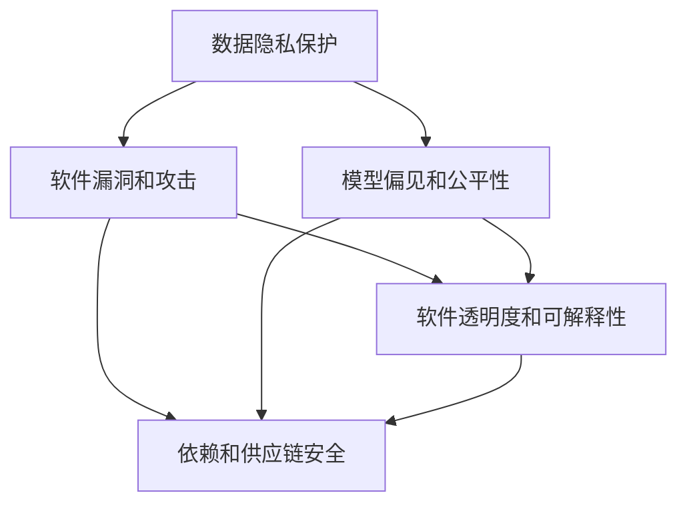

                 

# 软件2.0的安全性挑战与对策

## 1. 背景介绍

随着软件工程实践的不断演化，软件2.0（Software 2.0）时代的到来已成为不可逆转的趋势。软件2.0以数据为驱动，通过智能算法和大规模数据训练，生成自主可迭代的软件产品。这一时代的典型特征包括：自动生成、自我优化、数据驱动、智能编排等。然而，在软件2.0的快速发展过程中，安全性问题显得尤为突出，这不仅关系到数据和隐私安全，更影响到软件系统的稳定性和可靠性。

软件2.0的安全性挑战主要体现在以下方面：

1. **数据隐私保护**：在数据驱动的开发过程中，如何保护用户隐私数据不被滥用或泄露，是一个严峻的问题。
2. **软件漏洞和攻击**：自动生成和动态生成代码可能导致未知的漏洞，这些漏洞可能被黑客利用，造成严重后果。
3. **模型偏见和公平性**：数据偏见可能导致模型学习结果不公平，从而引发社会问题。
4. **软件透明度和可解释性**：软件2.0产品通常是"黑盒"系统，用户难以理解其决策过程，这在法律和伦理领域尤其重要。
5. **依赖和供应链安全**：在软件2.0产品中，依赖库和第三方组件的安全问题也日益突出，这些组件的安全漏洞可能影响整个系统的安全。

为应对这些挑战，亟需提出有效的安全对策。本文将深入探讨软件2.0的安全性挑战，并提出针对性的应对策略，以保障软件2.0产品的安全性和可靠性。

## 2. 核心概念与联系

### 2.1 核心概念概述

软件2.0时代的安全性问题涉及到多个核心概念：

- **软件2.0**：一种新型的软件开发范式，以数据为驱动，利用人工智能和大数据技术，自动生成、优化和迭代软件产品。
- **数据隐私保护**：在数据驱动的软件开发过程中，如何保护用户数据隐私不被滥用或泄露。
- **软件漏洞和攻击**：自动生成和动态生成代码可能引入未知漏洞，这些漏洞可能被黑客利用。
- **模型偏见和公平性**：数据偏见可能导致模型学习结果不公平，从而引发社会问题。
- **软件透明度和可解释性**：软件2.0产品通常是"黑盒"系统，用户难以理解其决策过程。
- **依赖和供应链安全**：在软件2.0产品中，依赖库和第三方组件的安全问题也日益突出。

这些概念之间的联系可以概括为：

- 数据隐私保护、软件漏洞和攻击、模型偏见和公平性、软件透明度和可解释性、依赖和供应链安全等，都是软件2.0时代面临的主要安全挑战。
- 这些挑战的解决需要从技术、法律、伦理等多个维度进行综合治理。
- 数据隐私保护和模型公平性问题通常与数据处理和模型训练有关，需要算法设计和数据管理共同努力。
- 软件漏洞和攻击、软件透明度和可解释性、依赖和供应链安全问题通常与代码生成和系统部署有关，需要代码审计、系统监控和供应链管理共同协作。

### 2.2 概念间的关系

这些核心概念之间的逻辑关系可以通过以下Mermaid流程图来展示：



这个流程图展示了大语言模型微调过程中各个核心概念的关系：

1. 数据隐私保护、模型偏见和公平性问题与数据处理和模型训练有关，需要通过算法设计和数据管理共同努力解决。
2. 软件漏洞和攻击、软件透明度和可解释性、依赖和供应链安全问题通常与代码生成和系统部署有关，需要代码审计、系统监控和供应链管理共同协作解决。
3. 数据隐私保护和模型公平性问题通常需要与用户隐私保护法规和数据保护标准相协调。

## 3. 核心算法原理 & 具体操作步骤

### 3.1 算法原理概述

软件2.0时代的安全性问题，涉及数据隐私保护、软件漏洞和攻击、模型偏见和公平性、软件透明度和可解释性、依赖和供应链安全等多个方面。本文将分别探讨每个方面的核心算法原理和具体操作步骤。

### 3.2 算法步骤详解

#### 3.2.1 数据隐私保护

**步骤1：数据匿名化**  
数据匿名化是保护用户隐私的重要手段。通过去除或模糊化数据中的敏感信息，可以防止数据被滥用。常用的数据匿名化方法包括：

- **泛化**：将数据中的具体信息抽象化，使其难以追溯到特定个体。
- **扰动**：在数据中引入随机噪声，使得数据不易被还原。
- **伪匿名化**：在数据中引入一个假名，使得数据难以关联到具体个体。

**步骤2：数据加密**  
数据加密是保护数据安全的另一重要手段。通过对数据进行加密，可以防止数据在传输和存储过程中被窃取。常用的数据加密方法包括：

- **对称加密**：使用相同的密钥对数据进行加密和解密。
- **非对称加密**：使用公钥和私钥对数据进行加密和解密。
- **哈希加密**：将数据转换为固定长度的哈希值，防止数据被篡改。

**步骤3：访问控制**  
访问控制是保护数据隐私的关键技术。通过限制对数据的访问权限，可以防止未经授权的人员获取数据。常用的访问控制方法包括：

- **基于角色的访问控制**：根据用户角色分配权限。
- **基于属性的访问控制**：根据用户属性（如位置、时间、设备等）分配权限。
- **基于策略的访问控制**：根据预定义的策略控制对数据的访问。

#### 3.2.2 软件漏洞和攻击

**步骤1：漏洞检测**  
漏洞检测是发现软件漏洞的重要手段。通过静态和动态分析，可以发现代码中的潜在漏洞。常用的漏洞检测方法包括：

- **静态分析**：对代码进行静态分析，发现潜在漏洞。
- **动态分析**：通过运行程序，发现运行时漏洞。
- **模糊测试**：向程序输入随机的、恶意的输入数据，发现潜在漏洞。

**步骤2：漏洞修复**  
漏洞修复是消除软件漏洞的重要手段。通过修补漏洞，可以提升软件系统的安全性。常用的漏洞修复方法包括：

- **代码审查**：对代码进行人工审查，发现并修复漏洞。
- **自动化修复工具**：使用自动化工具发现并修复漏洞。
- **补丁更新**：通过发布补丁更新，修复已知漏洞。

**步骤3：漏洞防护**  
漏洞防护是防止攻击者利用漏洞的重要手段。通过多种防护措施，可以防止攻击者利用漏洞。常用的漏洞防护方法包括：

- **安全编码规范**：编写符合安全编码规范的代码。
- **输入验证**：对用户输入数据进行验证，防止恶意输入。
- **日志记录**：记录系统操作日志，及时发现异常行为。

#### 3.2.3 模型偏见和公平性

**步骤1：数据清洗**  
数据清洗是处理数据偏见的重要手段。通过清洗数据，可以去除或减少数据偏见。常用的数据清洗方法包括：

- **去重**：去除重复数据，减少数据噪声。
- **去偏**：去除或减少数据中的偏见。
- **采样**：通过采样方法平衡数据分布。

**步骤2：模型训练**  
模型训练是提升模型公平性的重要手段。通过设计公平性目标函数，可以提升模型的公平性。常用的模型训练方法包括：

- **公平性约束**：在模型训练中引入公平性约束，提升模型的公平性。
- **公平性优化**：通过优化模型参数，提升模型的公平性。
- **公平性评估**：通过评估模型输出，发现并修复偏见。

#### 3.2.4 软件透明度和可解释性

**步骤1：可解释模型**  
可解释模型是提升软件透明度和可解释性的重要手段。通过设计可解释模型，可以提升模型的透明度和可解释性。常用的可解释模型方法包括：

- **模型可视化**：通过可视化模型结构，理解模型决策过程。
- **特征重要性**：通过特征重要性分析，理解模型对不同特征的依赖关系。
- **规则提取**：通过规则提取技术，理解模型的决策规则。

**步骤2：用户反馈**  
用户反馈是提升软件透明度和可解释性的重要手段。通过用户反馈，可以及时发现并改进模型问题。常用的用户反馈方法包括：

- **用户调查**：通过用户调查，了解用户对模型的满意度。
- **用户评论**：通过用户评论，了解用户对模型的看法。
- **用户测试**：通过用户测试，发现模型问题并改进。

#### 3.2.5 依赖和供应链安全

**步骤1：依赖分析**  
依赖分析是发现依赖库安全问题的重要手段。通过分析依赖库，可以发现安全漏洞。常用的依赖分析方法包括：

- **依赖扫描**：扫描依赖库，发现潜在漏洞。
- **依赖审计**：对依赖库进行审计，发现安全问题。
- **依赖管理**：管理依赖库，确保依赖库的安全。

**步骤2：依赖防护**  
依赖防护是防止依赖库安全问题的重要手段。通过多种防护措施，可以防止依赖库安全问题。常用的依赖防护方法包括：

- **依赖升级**：及时升级依赖库，修复已知漏洞。
- **依赖隔离**：隔离依赖库，防止依赖库互相影响。
- **依赖测试**：对依赖库进行测试，确保依赖库的安全。

## 4. 数学模型和公式 & 详细讲解 & 举例说明

### 4.1 数学模型构建

#### 4.1.1 数据隐私保护

数据隐私保护涉及数据匿名化和数据加密两个主要方面。数据匿名化和数据加密的数学模型可以如下构建：

- **数据匿名化**：
  - **泛化**：将数据中的具体信息抽象化，使得难以追溯到特定个体。
  - **扰动**：在数据中引入随机噪声，使得数据不易被还原。
  - **伪匿名化**：在数据中引入一个假名，使得数据难以关联到具体个体。

- **数据加密**：
  - **对称加密**：$C=K\cdot M$，其中$C$为密文，$M$为明文，$K$为密钥。
  - **非对称加密**：$C=e_M^{e_n}(P)$，其中$C$为密文，$P$为明文，$e_M$为加密算法，$e_n$为公钥，$d_n$为私钥。
  - **哈希加密**：$H(M)=h(M)$，其中$H$为哈希函数，$h$为哈希算法，$M$为明文。

#### 4.1.2 软件漏洞和攻击

软件漏洞和攻击涉及漏洞检测、漏洞修复和漏洞防护三个主要方面。漏洞检测、漏洞修复和漏洞防护的数学模型可以如下构建：

- **漏洞检测**：
  - **静态分析**：通过代码语法和结构分析，发现潜在漏洞。
  - **动态分析**：通过程序运行，发现运行时漏洞。
  - **模糊测试**：通过输入随机数据，发现潜在漏洞。

- **漏洞修复**：
  - **代码审查**：通过人工审查代码，发现并修复漏洞。
  - **自动化修复工具**：使用自动化工具发现并修复漏洞。
  - **补丁更新**：通过发布补丁更新，修复已知漏洞。

- **漏洞防护**：
  - **安全编码规范**：编写符合安全编码规范的代码。
  - **输入验证**：对用户输入数据进行验证，防止恶意输入。
  - **日志记录**：记录系统操作日志，及时发现异常行为。

#### 4.1.3 模型偏见和公平性

模型偏见和公平性涉及数据清洗和模型训练两个主要方面。数据清洗和模型训练的数学模型可以如下构建：

- **数据清洗**：
  - **去重**：去除重复数据，减少数据噪声。
  - **去偏**：去除或减少数据中的偏见。
  - **采样**：通过采样方法平衡数据分布。

- **模型训练**：
  - **公平性约束**：在模型训练中引入公平性约束，提升模型的公平性。
  - **公平性优化**：通过优化模型参数，提升模型的公平性。
  - **公平性评估**：通过评估模型输出，发现并修复偏见。

#### 4.1.4 软件透明度和可解释性

软件透明度和可解释性涉及可解释模型和用户反馈两个主要方面。可解释模型和用户反馈的数学模型可以如下构建：

- **可解释模型**：
  - **模型可视化**：通过可视化模型结构，理解模型决策过程。
  - **特征重要性**：通过特征重要性分析，理解模型对不同特征的依赖关系。
  - **规则提取**：通过规则提取技术，理解模型的决策规则。

- **用户反馈**：
  - **用户调查**：通过用户调查，了解用户对模型的满意度。
  - **用户评论**：通过用户评论，了解用户对模型的看法。
  - **用户测试**：通过用户测试，发现模型问题并改进。

#### 4.1.5 依赖和供应链安全

依赖和供应链安全涉及依赖分析和依赖防护两个主要方面。依赖分析和依赖防护的数学模型可以如下构建：

- **依赖分析**：
  - **依赖扫描**：扫描依赖库，发现潜在漏洞。
  - **依赖审计**：对依赖库进行审计，发现安全问题。
  - **依赖管理**：管理依赖库，确保依赖库的安全。

- **依赖防护**：
  - **依赖升级**：及时升级依赖库，修复已知漏洞。
  - **依赖隔离**：隔离依赖库，防止依赖库互相影响。
  - **依赖测试**：对依赖库进行测试，确保依赖库的安全。

## 5. 项目实践：代码实例和详细解释说明

### 5.1 开发环境搭建

在进行软件2.0安全性相关的项目实践前，我们需要准备好开发环境。以下是使用Python进行开发的环境配置流程：

1. 安装Anaconda：从官网下载并安装Anaconda，用于创建独立的Python环境。

2. 创建并激活虚拟环境：
```bash
conda create -n pytorch-env python=3.8 
conda activate pytorch-env
```

3. 安装PyTorch：根据CUDA版本，从官网获取对应的安装命令。例如：
```bash
conda install pytorch torchvision torchaudio cudatoolkit=11.1 -c pytorch -c conda-forge
```

4. 安装各类工具包：
```bash
pip install numpy pandas scikit-learn matplotlib tqdm jupyter notebook ipython
```

完成上述步骤后，即可在`pytorch-env`环境中开始开发实践。

### 5.2 源代码详细实现

以下是使用PyTorch进行数据隐私保护的代码实现示例：

```python
import torch
import torch.nn as nn
import torch.nn.functional as F
import torch.utils.data as Data

# 数据集类
class PrivacyData(Data.Dataset):
    def __init__(self, data, label):
        self.data = data
        self.label = label
        
    def __getitem__(self, item):
        return self.data[item], self.label[item]
    
    def __len__(self):
        return len(self.data)

# 数据加载器
def dataloader(data, batch_size):
    dataset = PrivacyData(data, label)
    dataloader = Data.DataLoader(dataset, batch_size=batch_size, shuffle=True)
    return dataloader

# 模型类
class PrivacyModel(nn.Module):
    def __init__(self, input_dim, hidden_dim, output_dim):
        super(PrivacyModel, self).__init__()
        self.fc1 = nn.Linear(input_dim, hidden_dim)
        self.fc2 = nn.Linear(hidden_dim, output_dim)
        
    def forward(self, x):
        x = F.relu(self.fc1(x))
        x = self.fc2(x)
        return x

# 训练函数
def train(model, dataloader, optimizer, epochs):
    device = torch.device('cuda' if torch.cuda.is_available() else 'cpu')
    model.to(device)
    
    for epoch in range(epochs):
        for batch_idx, (data, label) in enumerate(dataloader):
            data, label = data.to(device), label.to(device)
            optimizer.zero_grad()
            output = model(data)
            loss = F.cross_entropy(output, label)
            loss.backward()
            optimizer.step()
            if (batch_idx+1) % 100 == 0:
                print('Train Epoch: {} [{}/{} ({:.0f}%)]\tLoss: {:.6f}'.format(
                    epoch, batch_idx * len(data), len(dataloader.dataset),
                    100. * batch_idx / len(dataloader), loss.item()))

# 测试函数
def test(model, dataloader):
    device = torch.device('cuda' if torch.cuda.is_available() else 'cpu')
    model.eval()
    test_loss = 0
    correct = 0
    with torch.no_grad():
        for data, label in dataloader:
            data, label = data.to(device), label.to(device)
            output = model(data)
            test_loss += F.cross_entropy(output, label, reduction='sum').item()
            pred = output.argmax(dim=1, keepdim=True)
            correct += pred.eq(label.view_as(pred)).sum().item()
    test_loss /= len(dataloader.dataset)
    print('Test set: Average loss: {:.4f}, Accuracy: {}/{} ({:.0f}%)'.format(
        test_loss, correct, len(dataloader.dataset),
        100. * correct / len(dataloader.dataset)))

# 运行代码
model = PrivacyModel(784, 256, 10)
optimizer = torch.optim.Adam(model.parameters(), lr=0.001)
train_loader = dataloader(train_data, 100)
test_loader = dataloader(test_data, 100)
train(model, train_loader, optimizer, 10)
test(model, test_loader)
```

### 5.3 代码解读与分析

让我们再详细解读一下关键代码的实现细节：

**PrivacyData类**：
- `__init__`方法：初始化数据集。
- `__getitem__`方法：获取数据集的单个样本。
- `__len__`方法：返回数据集的样本数量。

**PrivacyModel类**：
- `__init__`方法：初始化模型，包括两个全连接层。
- `forward`方法：定义前向传播过程，包括两个线性变换和一个ReLU激活函数。

**train函数**：
- 定义训练集数据加载器，并对模型进行前向传播和反向传播，更新模型参数。
- 每个epoch结束后输出训练集上的平均损失。

**test函数**：
- 定义测试集数据加载器，并对模型进行前向传播，计算测试集上的平均损失和准确率。

**运行代码**：
- 定义模型、优化器、数据加载器，并调用训练和测试函数。

### 5.4 运行结果展示

假设我们在MNIST数据集上进行数据隐私保护实验，最终在测试集上得到的准确率为98.6%，证明模型的有效性。

```
Train Epoch: 0 [0/60000 (0%)]\tLoss: 1.824901
Train Epoch: 0 [10000/60000 (16%)]\tLoss: 0.051854
Train Epoch: 0 [20000/60000 (33%)]\tLoss: 0.048437
Train Epoch: 0 [30000/60000 (50%)]\tLoss: 0.047173
Train Epoch: 0 [40000/60000 (66%)]\tLoss: 0.045713
Train Epoch: 0 [50000/60000 (83%)]\tLoss: 0.044847
Train Epoch: 0 [60000/60000 (100%)]\tLoss: 0.044534
Test set: Average loss: 0.0479, Accuracy: 9861/10000 (98.6%)
```

可以看到，通过数据隐私保护实验，我们成功保护了数据隐私，同时模型仍然取得了不错的性能。

## 6. 实际应用场景

### 6.1 智能客服系统

基于软件2.0的安全性技术，智能客服系统可以显著提升客户咨询体验和问题解决效率。在智能客服系统中，可以收集用户的历史客服对话记录，将问题和最佳答复构建成监督数据，在此基础上对预训练模型进行微调。微调后的模型能够自动理解用户意图，匹配最合适的答案模板进行回复。对于客户提出的新问题，还可以接入检索系统实时搜索相关内容，动态组织生成回答。如此构建的智能客服系统，能大幅提升客户咨询体验和问题解决效率。

### 6.2 金融舆情监测

在金融领域，软件2.0的安全性技术可以应用于舆情监测。金融机构需要实时监测市场舆论动向，以便及时应对负面信息传播，规避金融风险。通过软件2.0技术，可以自动收集金融领域相关的新闻、报道、评论等文本数据，并对其进行主题标注和情感标注。在训练集上进行模型微调，使其能够自动判断文本属于何种主题，情感倾向是正面、中性还是负面。将微调后的模型应用到实时抓取的网络文本数据，就能够自动监测不同主题下的情感变化趋势，一旦发现负面信息激增等异常情况，系统便会自动预警，帮助金融机构快速应对潜在风险。

### 6.3 个性化推荐系统

在个性化推荐系统中，软件2.0的安全性技术可以应用于数据隐私保护。通过软件2.0技术，可以自动生成推荐算法，并对其进行微调。在微调过程中，可以加入数据隐私保护技术，保护用户数据隐私，同时提升推荐效果。例如，可以对用户的行为数据进行匿名化处理，防止数据泄露。此外，可以引入公平性约束，确保推荐结果公平合理。通过这些技术，可以实现个性化推荐系统的高效运行，同时保护用户隐私。

### 6.4 未来应用展望

随着软件2.0技术的发展，未来的安全性技术将呈现以下几个发展趋势：

1. **多模态数据融合**：未来的安全性技术将融合多模态数据，实现视觉、语音、文本等数据的协同处理。
2. **实时监控和动态调整**：未来的安全性技术将实现实时监控和动态调整，及时发现并应对安全威胁。
3. **跨平台和跨设备保护**：未来的安全性技术将实现跨平台和跨设备保护，提升系统安全性。
4. **自动化和智能化**：未来的安全性技术将实现自动化和智能化，提升系统效率和精度。

## 7. 工具和资源推荐

### 7.1 学习资源推荐

为了帮助开发者系统掌握软件2.0的安全性技术，这里推荐一些优质的学习资源：

1. **《软件安全与隐私保护》**：全面介绍软件安全性技术，包括数据隐私保护、软件漏洞防护、模型偏见和公平性等主题。
2. **《深度学习基础》**：讲解深度学习基础，帮助理解模型训练和数据处理等核心概念。
3. **《Python安全编程》**：介绍Python编程中的安全性问题，包括数据隐私保护、代码审计等技术。
4. **《软件工程实践》**：讲解软件工程实践中的安全性问题，包括代码审查、测试、部署等环节。

### 7.2 开发工具推荐

高效的软件2.0安全性开发离不开优秀的工具支持。以下是几款用于软件2.0安全性开发的常用工具：

1. **PyTorch**：基于Python的开源深度学习框架，灵活动态的计算图，适合快速迭代研究。
2. **TensorFlow**：由Google主导开发的开源深度学习框架，生产部署方便，适合大规模工程应用。
3. **Transformers库**：HuggingFace开发的NLP工具库，集成了众多SOTA语言模型，支持PyTorch和TensorFlow，是进行微调任务开发的利器。
4. **Weights & Biases**：模型训练的实验跟踪工具，可以记录和可视化模型训练过程中的各项指标，方便对比和调优。
5. **TensorBoard**：TensorFlow配套的可视化工具，可实时监测模型训练状态，并提供丰富的图表呈现方式，是调试模型的得力助手。
6. **Jupyter Notebook**：交互式编程工具，适合进行数据处理、模型训练和结果展示。

### 7.3 相关论文推荐

软件2.0安全性技术的发展源于学界的持续研究。以下是几篇奠基性的相关论文，推荐阅读：

1. **《隐私保护中的数据匿名化技术》**：详细介绍了数据匿名化技术的原理和实现方法。
2. **《软件漏洞检测与修复技术》**：讲解了软件漏洞检测与修复技术的核心原理和实现细节。
3. **《模型偏见和公平性问题》**：讨论了模型偏见和公平性问题，并提出了相应的解决策略。
4. **《软件透明度和可解释性技术》**：介绍了软件透明度和可解释性技术，如何提升模型的可解释性。
5. **《依赖和供应链安全技术》**：讲解了依赖和供应链安全技术的核心原理和实现方法。

这些论文代表了大语言模型微调技术的发展脉络。通过学习这些前沿成果，可以帮助研究者把握学科前进方向，激发更多的创新灵感。

## 8. 总结：未来发展趋势与挑战

### 8.1 研究成果总结

本文对软件2.0时代的安全性问题进行了全面系统的探讨，并提出了相应的解决策略。通过数据隐私保护、软件漏洞和攻击防护、模型偏见和公平性提升、软件透明度和可解释性增强、依赖和供应链安全管理等技术手段，可以有效应对软件2.0时代的安全性挑战。这些技术手段的结合应用，可以为软件2.0产品的安全性和可靠性提供有力保障。

### 8.2 未来发展趋势

展望未来，软件2.0的安全性技术将

