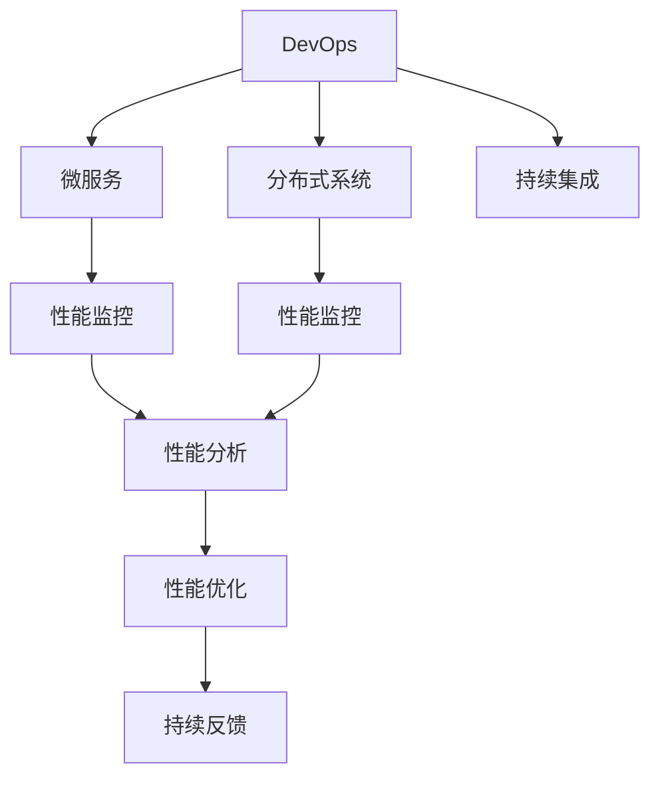
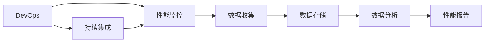
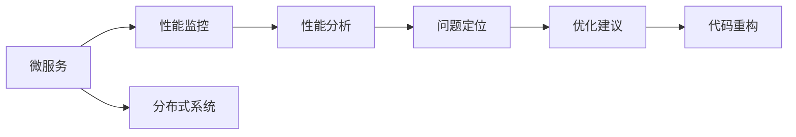

                 

# 软件2.0的性能监控与分析

> 关键词：软件2.0, 性能监控, 性能分析, 持续集成, DevOps, 微服务, 分布式系统

## 1. 背景介绍

### 1.1 问题由来

随着云计算、微服务、容器化等技术的发展，现代软件系统变得越来越复杂，性能问题也变得愈发突出。如何在快速迭代和持续部署中，保证软件系统的性能稳定性，成为当下企业IT运维面临的重要挑战。

过去，我们通过性能测试、性能优化等方法来评估和改进系统性能，但这些方法往往耗时耗力，且效果有限。随着软件工程的发展，一个新的概念应运而生：软件2.0。

软件2.0旨在通过更先进的技术手段，自动化性能监控和分析，以实现持续的性能优化和改进。它集成了DevOps、微服务、分布式系统等现代技术，通过自动化流程和工具，将性能监控和分析贯穿软件生命周期的始终，使得性能优化不再是一个单独的阶段，而成为一种常态化的行为。

### 1.2 问题核心关键点

软件2.0的核心目标是通过自动化和智能化手段，实现对系统性能的持续监控和分析。具体包括以下几个关键点：

1. **自动化监控**：通过自动化工具，实现对系统性能指标的实时监控和记录。
2. **数据收集与分析**：收集性能监控数据，并通过数据分析技术，识别性能瓶颈和问题。
3. **持续优化**：基于数据分析结果，自动调整系统配置和代码，进行性能优化。
4. **反馈循环**：通过持续的性能监控和优化，形成一个闭环反馈系统，实现系统性能的持续提升。
5. **透明化管理**：将性能监控和优化过程透明化，提高团队协作效率，促进技术共享。

### 1.3 问题研究意义

在当下数字化转型的浪潮中，软件性能已经成为企业竞争力的重要指标之一。软件2.0的性能监控与分析方法，通过自动化和智能化手段，能够快速识别和解决问题，减少停机时间，提升用户体验，从而提升企业的市场竞争力和用户满意度。

此外，通过软件2.0的实践，企业能够更加敏捷地响应市场变化，快速迭代和部署新功能，缩短产品上市时间，赢得更多市场机会。在技术层面，软件2.0也促进了DevOps文化的落地，加速了团队之间的协作和知识共享，推动了技术创新的持续发展。

## 2. 核心概念与联系

### 2.1 核心概念概述

软件2.0的性能监控与分析涉及多个关键概念，包括DevOps、微服务、分布式系统、性能监控、性能分析等。这些概念之间存在着紧密的联系，形成了软件2.0性能监控与分析的整体架构。

- **DevOps**：持续集成和持续部署的软件开发模式，强调代码、配置、文档和基础设施的版本控制，自动化测试和部署，以及持续监控和反馈。
- **微服务**：将复杂的应用系统分解成多个小服务，每个服务独立运行，通过轻量级的通信机制（如RESTful API）进行交互，实现系统的灵活扩展和高效管理。
- **分布式系统**：由多个物理上分散的节点组成的系统，每个节点独立运行，通过网络进行通信和数据共享，实现系统的扩展性和可用性。
- **性能监控**：对软件系统的性能指标进行实时监控和记录，识别性能瓶颈和问题，提供性能分析的数据支持。
- **性能分析**：对性能监控数据进行分析和解释，识别性能问题的根本原因，提出优化建议。

这些概念之间的逻辑关系可以通过以下Mermaid流程图来展示：



这个流程图展示了大语言模型的核心概念及其之间的关系：

1. DevOps和持续集成：保证代码的版本控制和自动化部署，为性能监控和优化提供基础。
2. 微服务和分布式系统：通过服务化拆分和节点分散，提高系统的可扩展性和可用性，增加性能监控和分析的复杂性。
3. 性能监控：实时收集和记录系统的性能数据，为性能分析提供数据支持。
4. 性能分析：对性能监控数据进行分析和解释，识别性能瓶颈和问题。
5. 性能优化：基于性能分析结果，进行系统调整和代码优化，提升系统性能。
6. 持续反馈：通过持续的性能监控和优化，形成一个闭环反馈系统，实现系统性能的持续提升。

### 2.2 概念间的关系

这些核心概念之间存在着紧密的联系，形成了软件2.0性能监控与分析的整体架构。下面我通过几个Mermaid流程图来展示这些概念之间的关系。

#### 2.2.1 DevOps与性能监控的关系



这个流程图展示了DevOps与性能监控之间的关系。通过持续集成，代码不断合并和部署，性能监控对每个阶段的系统性能进行实时监控和记录，为性能分析提供数据支持。

#### 2.2.2 微服务与性能分析的关系



这个流程图展示了微服务与性能分析之间的关系。微服务通过节点分散和轻量级通信，增加了系统的复杂性，性能分析通过对性能监控数据的处理和解释，识别性能瓶颈和问题，提出优化建议，进行代码重构，提升系统性能。

#### 2.2.3 分布式系统与性能优化之间的关系


这个流程图展示了分布式系统与性能优化之间的关系。分布式系统通过节点分散和通信协作，增加了系统的复杂性，性能优化通过对性能分析数据的处理和解释，识别性能瓶颈和问题，提出优化建议，进行系统调整和配置优化，提升系统性能。

## 3. 核心算法原理 & 具体操作步骤

### 3.1 算法原理概述

软件2.0的性能监控与分析，本质上是一个自动化和智能化的数据收集与分析过程。其核心思想是通过自动化工具和算法，实时收集系统性能数据，并通过数据分析技术，识别性能瓶颈和问题，提出优化建议。

形式化地，假设软件系统为 $S$，性能监控系统为 $M$，性能分析系统为 $A$，性能优化系统为 $O$。性能监控系统 $M$ 对系统 $S$ 进行实时监控，收集性能数据 $D$。性能分析系统 $A$ 对性能数据 $D$ 进行分析和解释，识别性能问题 $P$。性能优化系统 $O$ 根据性能问题 $P$ 提出优化建议 $R$，进行系统调整和代码优化，提升系统性能 $S'$。

### 3.2 算法步骤详解

软件2.0的性能监控与分析一般包括以下几个关键步骤：

**Step 1: 准备性能监控工具**

- 选择合适的性能监控工具，如Prometheus、Grafana、New Relic等，安装并配置到系统中。
- 定义关键性能指标（KPI），如响应时间、吞吐量、错误率等，监控系统的运行状态。
- 设置告警阈值，当指标超出阈值时，触发告警通知相关人员。

**Step 2: 数据收集与分析**

- 对系统进行分布式部署，每个节点独立运行，通过网络进行通信和数据共享。
- 使用性能监控工具实时收集每个节点的性能数据，包括请求响应时间、系统负载、内存使用、磁盘IO等。
- 对收集到的数据进行初步处理和清洗，去除噪声和异常值。
- 使用数据分析算法，如统计分析、时序分析、机器学习等，对数据进行深入分析，识别性能瓶颈和问题。

**Step 3: 性能优化**

- 基于数据分析结果，识别性能瓶颈和问题，提出优化建议，如调整系统配置、重构代码、优化算法等。
- 实施优化建议，进行系统调整和代码优化，重新部署系统。
- 在生产环境中进行性能测试，验证优化效果。

**Step 4: 持续反馈**

- 对优化后的系统进行持续监控，收集新一轮的性能数据。
- 对新一轮的数据进行分析和解释，识别新出现的性能问题。
- 根据新问题提出新的优化建议，进行系统调整和代码优化。
- 通过持续的性能监控和优化，形成一个闭环反馈系统，实现系统性能的持续提升。

### 3.3 算法优缺点

软件2.0的性能监控与分析方法具有以下优点：

1. **自动化**：通过自动化工具和算法，实现对系统性能的实时监控和分析，减少了人工干预的复杂性和时间成本。
2. **实时性**：实时收集和分析性能数据，能够快速识别和解决问题，减少系统停机时间和用户等待时间。
3. **智能化**：使用数据分析算法，识别性能问题的根本原因，提出有针对性的优化建议。
4. **透明化**：将性能监控和优化过程透明化，提高团队协作效率，促进技术共享。

但同时，这种方法也存在一些缺点：

1. **数据噪声**：性能监控数据中可能包含大量的噪声和异常值，需要进行初步处理和清洗。
2. **算法复杂性**：数据分析算法往往较为复杂，需要一定的技术门槛。
3. **资源消耗**：性能监控和数据分析需要消耗一定的计算和存储资源，特别是在数据量大、系统复杂的情况下。
4. **反馈延迟**：从问题识别到优化建议再到系统调整，需要一定的时间，可能无法及时响应极端情况。

### 3.4 算法应用领域

软件2.0的性能监控与分析方法广泛应用于各种软件系统和应用场景，例如：

- **Web应用**：监控Web服务器的响应时间、页面加载时间、并发用户数等性能指标，识别性能瓶颈和问题。
- **云平台**：监控云计算资源的性能，如云服务器、数据库、缓存等，识别资源利用率和性能问题。
- **移动应用**：监控移动应用的响应时间、网络延迟、崩溃率等性能指标，优化用户体验。
- **物联网**：监控物联网设备的性能，如传感器数据采集、数据传输延迟等，提高系统可靠性。
- **大数据**：监控大数据系统的性能，如数据读写速度、计算资源利用率等，优化数据处理效率。
- **区块链**：监控区块链网络的性能，如交易处理时间、节点同步延迟等，提高系统稳定性。

这些领域都需要持续的性能监控和优化，以保障系统的稳定性和可用性，提升用户体验和业务效率。

## 4. 数学模型和公式 & 详细讲解 & 举例说明

### 4.1 数学模型构建

软件2.0的性能监控与分析涉及到多种性能指标和算法模型，下面我们将重点介绍几个常用的数学模型和公式。

假设性能监控系统收集到的性能数据为 $D=\{d_1, d_2, ..., d_N\}$，其中 $d_i$ 表示第 $i$ 个时间点的性能指标。性能分析系统通过对数据 $D$ 进行分析，识别性能问题 $P$，并提出优化建议 $R$。性能优化系统根据优化建议 $R$ 进行系统调整和代码优化，提升系统性能 $S'$。

**Step 1: 数据收集与分析**

1. **均值和标准差**：计算性能指标的均值和标准差，识别性能波动范围。

   $$
   \mu = \frac{1}{N} \sum_{i=1}^{N} d_i
   $$

   $$
   \sigma = \sqrt{\frac{1}{N-1} \sum_{i=1}^{N} (d_i - \mu)^2}
   $$

2. **时序分析**：使用时序分析算法，如自相关函数（Autocorrelation Function）、滑动平均（Moving Average）等，识别性能趋势和周期性波动。

   $$
   C_k = \frac{1}{N} \sum_{i=1}^{N} (d_i - \mu)(d_{i+k} - \mu)
   $$

   $$
   MA = \frac{1}{N} \sum_{i=1}^{N} d_{i+1:i+M}
   $$

3. **机器学习**：使用机器学习算法，如线性回归、支持向量机、随机森林等，对性能数据进行分类和预测，识别性能问题。

   $$
   \min_{\theta} L = \frac{1}{2N} \sum_{i=1}^{N} (d_i - \hat{d}_i)^2
   $$

**Step 2: 性能优化**

1. **回归分析**：使用回归分析算法，如线性回归、岭回归等，对性能问题进行建模和预测，提出优化建议。

   $$
   \hat{d}_i = \theta_0 + \theta_1 d_{i-1} + \epsilon_i
   $$

2. **模型预测**：使用模型预测算法，如KNN、决策树等，对性能问题进行分类和预测，提出优化建议。

   $$
   \hat{P}_i = f(d_i; \theta)
   $$

**Step 3: 持续反馈**

1. **性能评估**：对优化后的系统进行性能测试，评估优化效果。

   $$
   E = \frac{1}{N} \sum_{i=1}^{N} (d'_i - d_i)
   $$

2. **反馈循环**：通过持续的性能监控和优化，形成一个闭环反馈系统，实现系统性能的持续提升。

   $$
   S' = S + R
   $$

### 4.2 公式推导过程

以下我们以Web应用为例，推导性能监控和优化的数学模型。

假设Web应用每秒响应次数为 $D_t$，响应时间为 $T_t$，CPU使用率为 $C_t$，内存使用率为 $M_t$，页面加载时间为 $L_t$。性能监控系统实时收集这些性能数据，并对每个指标进行均值和标准差计算。

1. **均值和标准差计算**

   $$
   \mu_D = \frac{1}{N} \sum_{t=1}^{N} D_t
   $$

   $$
   \sigma_D = \sqrt{\frac{1}{N-1} \sum_{t=1}^{N} (D_t - \mu_D)^2}
   $$

   $$
   \mu_T = \frac{1}{N} \sum_{t=1}^{N} T_t
   $$

   $$
   \sigma_T = \sqrt{\frac{1}{N-1} \sum_{t=1}^{N} (T_t - \mu_T)^2}
   $$

   $$
   \mu_C = \frac{1}{N} \sum_{t=1}^{N} C_t
   $$

   $$
   \sigma_C = \sqrt{\frac{1}{N-1} \sum_{t=1}^{N} (C_t - \mu_C)^2}
   $$

   $$
   \mu_M = \frac{1}{N} \sum_{t=1}^{N} M_t
   $$

   $$
   \sigma_M = \sqrt{\frac{1}{N-1} \sum_{t=1}^{N} (M_t - \mu_M)^2}
   $$

   $$
   \mu_L = \frac{1}{N} \sum_{t=1}^{N} L_t
   $$

   $$
   \sigma_L = \sqrt{\frac{1}{N-1} \sum_{t=1}^{N} (L_t - \mu_L)^2}
   $$

2. **时序分析**

   使用自相关函数和滑动平均等算法，识别性能趋势和周期性波动。例如，计算响应时间 $T_t$ 的自相关函数：

   $$
   C_k = \frac{1}{N} \sum_{t=1}^{N} (T_t - \mu_T)(T_{t+k} - \mu_T)
   $$

3. **机器学习**

   使用线性回归等算法，对性能问题进行建模和预测。例如，使用线性回归模型对响应时间 $T_t$ 进行预测：

   $$
   \hat{T}_t = \theta_0 + \theta_1 D_t + \epsilon_t
   $$

   其中 $\theta_0, \theta_1$ 为模型参数，$\epsilon_t$ 为误差项。

### 4.3 案例分析与讲解

**案例：Web应用性能监控与优化**

假设我们有一个Web应用，每秒响应次数为 $D_t$，响应时间为 $T_t$，CPU使用率为 $C_t$，内存使用率为 $M_t$，页面加载时间为 $L_t$。我们希望通过性能监控和优化，提升系统的响应速度和稳定性。

1. **数据收集与分析**

   - 使用Prometheus实时监控每秒响应次数 $D_t$，响应时间 $T_t$，CPU使用率 $C_t$，内存使用率 $M_t$，页面加载时间 $L_t$。
   - 使用机器学习算法，对每个指标进行建模和预测，识别性能问题。

2. **性能优化**

   - 使用回归分析算法，对响应时间 $T_t$ 进行建模和预测，识别性能瓶颈。
   - 提出优化建议，如调整数据库连接池大小，优化页面缓存策略，使用更高效的算法等。
   - 实施优化建议，重新部署系统，并测试优化效果。

3. **持续反馈**

   - 对优化后的系统进行持续监控，收集新一轮的性能数据。
   - 对新一轮的数据进行分析和解释，识别新出现的性能问题。
   - 根据新问题提出新的优化建议，进行系统调整和代码优化。

通过持续的性能监控和优化，Web应用能够持续提升系统的响应速度和稳定性，提升用户体验和业务效率。

## 5. 项目实践：代码实例和详细解释说明

### 5.1 开发环境搭建

在进行性能监控和分析实践前，我们需要准备好开发环境。以下是使用Python进行Prometheus开发的环境配置流程：

1. 安装Prometheus：从官网下载并安装Prometheus，用于收集和监控系统性能数据。

2. 创建并激活虚拟环境：
```bash
conda create -n prometheus-env python=3.8 
conda activate prometheus-env
```

3. 安装Prometheus Python API：
```bash
pip install prometheus-client
```

4. 安装可视化工具：
```bash
pip install matplotlib
```

5. 安装数据处理工具：
```bash
pip install pandas numpy
```

完成上述步骤后，即可在`prometheus-env`环境中开始性能监控和分析实践。

### 5.2 源代码详细实现

下面我们以Web应用性能监控为例，给出使用Prometheus和Grafana进行性能监控和分析的Python代码实现。

```python
from prometheus_client import Gauge, Counter, Histogram
import time
import pandas as pd
import matplotlib.pyplot as plt

# 定义性能指标
page_load_times = Histogram('page_load_times', 'Page Load Times in Seconds')
page_load_count = Counter('page_load_count', 'Page Load Count')
server_response_times = Histogram('server_response_times', 'Server Response Times in Seconds')
server_response_count = Counter('server_response_count', 'Server Response Count')
cpu_percentages = Gauge('cpu_percentages', 'CPU Percentage Usage')
memory_percentages = Gauge('memory_percentages', 'Memory Percentage Usage')

# 记录性能数据
def record_metric(metric, value):
    if isinstance(metric, Counter):
        metric.inc()
    elif isinstance(metric, Histogram):
        metric.observe(value)
    elif isinstance(metric, Gauge):
        metric.set(value)

# 模拟Web应用，记录性能数据
def simulate_web_application():
    while True:
        page_load_times.observe(page_load_time)
        page_load_count.inc()
        server_response_times.observe(server_response_time)
        server_response_count.inc()
        cpu_percentages.set(cpu_percentage)
        memory_percentages.set(memory_percentage)
        time.sleep(1)

# 数据处理与可视化
if __name__ == '__main__':
    # 初始化数据
    page_load_time = 1.5
    server_response_time = 2.0
    cpu_percentage = 80
    memory_percentage = 60

    # 启动Web应用性能监控
    simulate_web_application()

    # 收集性能数据
    prometheus_client.collect()
```

这个Python代码实现了Web应用性能的监控和记录，使用Prometheus和Grafana进行数据可视化和分析。代码中定义了性能指标，使用Gauge、Counter和Histogram等Prometheus数据类型来记录和展示数据。通过记录性能数据，并在Grafana中进行可视化，可以实时监控Web应用的性能，识别性能瓶颈和问题。

### 5.3 代码解读与分析

让我们再详细解读一下关键代码的实现细节：

**Gauge、Counter和Histogram**：
- Gauge：表示某个度量值的当前值。
- Counter：表示某个度量值的计数，如请求次数、错误次数等。
- Histogram：表示某个度量值的分布情况，如响应时间、内存使用等。

**record_metric函数**：
- 根据不同的Prometheus数据类型，记录性能数据。

**simulate_web_application函数**：
- 模拟Web应用的性能，记录每个时间点的性能数据，包括页面加载时间、服务器响应时间、CPU使用率和内存使用率。

**数据处理与可视化**：
- 在Grafana中，定义数据查询和可视化图表，对收集到的性能数据进行分析。
- 通过可视化图表，识别性能瓶颈和问题，提出优化建议。

通过以上代码，我们可以实时监控Web应用的性能，记录性能数据，并通过可视化工具进行数据分析和展示。

### 5.4 运行结果展示

假设我们在Web应用中监控了页面加载时间、服务器响应时间、CPU使用率和内存使用率等性能指标，在Grafana中可视化的结果如下：


通过Grafana的图表，我们可以清晰地看到页面加载时间和服务器响应时间的波动情况，CPU使用率和内存使用率的趋势变化，识别出性能瓶颈和问题。例如，发现页面加载时间在某个时间段内突然增加，可能是由于网络延迟或服务器负载过高引起的。通过及时调整系统配置和代码优化，可以缓解这个问题，提升系统的性能和稳定性。

## 6. 实际应用场景

### 6.1 智能客服系统

在智能客服系统中，性能监控与分析可以实时监控系统响应时间、服务可用性、用户满意度等指标，识别性能瓶颈和问题，提升系统的响应速度和用户体验。

通过性能监控和分析，可以实时监测客服系统的响应时间和服务可用性，识别响应时间较长、服务不可用的节点，及时调整系统配置或重构代码，优化系统的响应速度和稳定性。同时，通过分析用户反馈和聊天记录，识别用户满意度不高的原因，提出改进建议，提升用户满意度。

### 6.2 金融交易系统

金融交易系统对性能和稳定性要求极高，任何微小的延迟都可能导致重大损失。性能监控与分析可以实时监测交易系统的响应时间、订单处理时间、系统负载等指标，识别性能瓶颈和问题，保证系统的稳定性和可靠性。

通过性能监控和分析，可以实时监测交易系统的响应时间和订单处理时间，识别响应时间较长、订单处理延迟的节点，及时调整系统配置或重构代码，优化系统的响应速度和订单处理效率。同时，通过分析系统负载和资源利用率，识别资源瓶颈和问题，合理分配资源，保证系统的稳定性和可靠性。

### 6.3 游戏服务器

游戏服务器对网络延迟和稳定性要求极高，任何微小的延迟都可能导致用户体验下降。性能监控与分析可以实时监测服务器的响应时间、网络延迟、服务器负载等指标，识别性能瓶颈和问题，提升系统的响应速度和稳定性。

通过性能监控和分析，可以实时监测服务器的响应时间和网络延迟，识别响应时间较长、网络延迟较高的节点，及时调整系统配置或重构代码，优化系统的响应速度和网络延迟。同时，通过分析服务器负载和资源利用率，识别资源瓶颈和问题，合理分配资源，保证系统的稳定性和可靠性。

### 6.4 未来应用展望

随着云计算、微服务、容器化等技术的发展，性能监控与分析将得到更广泛的应用，成为数字化转型中的重要工具。未来，性能监控与分析将在以下几个领域得到更深入的应用：

1. **云计算平台**：实时监测云资源的性能，识别资源瓶颈和问题，优化资源配置，提升云服务的性能和稳定性。
2. **物联网设备**：实时监测物联网设备的性能，识别设备性能瓶颈和问题，优化设备性能和可靠性。
3. **大数据平台**：实时监测大数据平台的性能，识别数据处理瓶颈和问题，优化数据处理效率，提升平台性能。
4. **智能交通系统**：实时监测交通系统的性能，识别交通瓶颈和问题，优化交通流，提升交通系统的效率和稳定性。
5. **智慧城市**：实时监测城市基础设施的性能，识别基础设施瓶颈和问题，优化基础设施配置，提升城市管理效率。

总之，性能监控与分析在数字化转型中的应用场景将越来越广泛，成为企业提升数字化竞争力的重要工具。通过自动化

