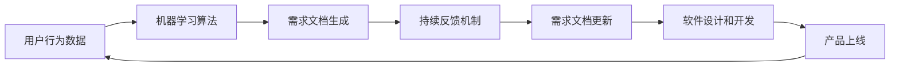
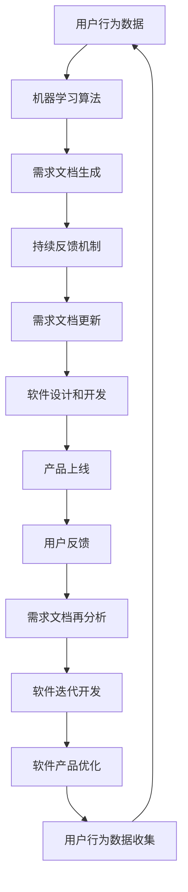

                 

# 软件2.0的需求分析新方法

在数字化转型的浪潮下，软件行业迎来了新一轮的变革。随着云计算、大数据、人工智能等新兴技术的兴起，传统的软件开发模式已难以适应新的应用需求。为了更好地应对复杂的业务场景和快速变化的市场环境，软件2.0（Software 2.0）应运而生，提出了一种基于用户行为驱动的软件需求分析方法。本文将系统介绍软件2.0的需求分析新方法，通过解析其核心概念与原理，结合具体案例进行讲解，并展望未来应用前景，希望能为软件开发者提供有益的参考。

## 1. 背景介绍

### 1.1 问题由来

在过去的几十年里，软件行业经历了从人工编程到自动化开发，再到自动化部署的快速演进。然而，随着应用场景的日益复杂化，传统的软件开发模式（即软件1.0）已经显得力不从心。

软件1.0的开发模式主要依赖于程序员的经验和直觉，在需求分析和设计阶段存在较多不确定性和风险。特别是对于大型项目，难以在短时间内理解用户需求，导致需求变更频繁，开发成本和时间大幅度增加。

为了应对这些挑战，软件开发领域提出了软件2.0的概念。软件2.0将用户的实际行为数据作为需求驱动源，通过机器学习算法自动分析用户行为，生成详细的需求文档，以指导软件开发和产品设计。

### 1.2 问题核心关键点

软件2.0的需求分析新方法主要有以下几个核心关键点：

- **用户行为数据**：利用用户在产品中的行为数据（如点击、浏览、购买等），作为需求分析的原始数据。
- **机器学习算法**：使用机器学习算法（如聚类、分类、回归等），自动分析用户行为，识别出潜在需求。
- **需求文档生成**：根据机器学习的结果，自动生成详细的用户需求文档，指导软件设计和开发。
- **持续反馈机制**：通过用户反馈循环迭代，持续优化需求分析和设计过程。

### 1.3 问题研究意义

软件2.0的需求分析新方法具有以下重要的研究意义：

- **提升开发效率**：通过机器学习自动分析用户行为，可以快速生成需求文档，减少需求讨论和变更，大幅提升开发效率。
- **降低开发风险**：自动生成的需求文档准确性高，可以有效减少需求误解和错误，降低项目失败的风险。
- **提高用户体验**：通过分析用户行为数据，软件可以更好地满足用户需求，提高产品竞争力。
- **优化业务决策**：软件2.0可以帮助企业快速洞察用户需求，指导产品创新和业务决策。

## 2. 核心概念与联系

### 2.1 核心概念概述

软件2.0的需求分析新方法涉及以下几个核心概念：

- **用户行为数据**：用户在产品中的所有行为数据，如点击、浏览、购买、搜索等，是软件2.0的基础数据来源。
- **机器学习算法**：利用机器学习算法，自动分析用户行为数据，提取用户需求和行为模式。
- **需求文档生成**：根据机器学习的结果，自动生成详细的用户需求文档，包含功能需求、非功能需求、性能需求等。
- **持续反馈机制**：软件2.0通过用户反馈，不断优化需求文档，形成动态的需求分析循环。

### 2.2 概念间的关系

这些核心概念之间存在着紧密的联系，共同构成了软件2.0的需求分析体系。我们通过以下Mermaid流程图来展示它们之间的关系：



这个流程图展示了大语言模型微调过程中各个核心概念的关系：

1. 用户行为数据是机器学习算法的输入。
2. 机器学习算法自动分析用户行为数据，生成需求文档。
3. 需求文档指导软件设计和开发。
4. 软件产品上线后，通过用户反馈不断优化需求文档。
5. 需求文档更新后，进入下一轮需求分析和软件开发。

通过这个流程图，我们可以更清晰地理解软件2.0需求分析的各个环节和逻辑关系。

### 2.3 核心概念的整体架构

最后，我们用一个综合的流程图来展示这些核心概念在大语言模型微调过程中的整体架构：



这个综合流程图展示了从用户行为数据到软件产品优化的完整流程：

1. 用户行为数据输入机器学习算法，生成需求文档。
2. 需求文档指导软件设计和开发。
3. 产品上线后，收集用户反馈。
4. 用户反馈通过持续反馈机制优化需求文档。
5. 优化后的需求文档用于迭代开发，不断优化产品。

通过这个流程图，我们可以更全面地理解软件2.0需求分析的整体架构，为后续深入讨论提供基础。

## 3. 核心算法原理 & 具体操作步骤

### 3.1 算法原理概述

软件2.0的需求分析方法主要基于机器学习算法，自动从用户行为数据中提取用户需求，生成详细的用户需求文档。该方法的核心原理可以总结为以下几步：

1. **数据采集与预处理**：收集用户在产品中的所有行为数据，进行清洗和预处理，去除噪音和异常值。
2. **特征提取与选择**：通过特征提取算法（如PCA、LDA等），从用户行为数据中提取特征向量。
3. **机器学习建模**：使用机器学习算法（如聚类、分类、回归等），对用户行为数据进行建模，自动分析出用户需求和行为模式。
4. **需求文档生成**：根据机器学习的结果，自动生成详细的用户需求文档，包含功能需求、非功能需求、性能需求等。
5. **持续反馈机制**：通过用户反馈，不断优化需求文档，形成动态的需求分析循环。

### 3.2 算法步骤详解

下面我们以聚类算法为例，详细介绍软件2.0需求分析的详细步骤：

**Step 1: 数据采集与预处理**

1. 从产品中采集用户行为数据，包括点击、浏览、购买、搜索等行为。
2. 对采集到的数据进行清洗，去除噪音和异常值，确保数据质量。
3. 对清洗后的数据进行标准化处理，将数据转化为数值型数据。

**Step 2: 特征提取与选择**

1. 通过PCA算法，对用户行为数据进行降维处理，提取主要特征。
2. 选择最具有代表性的特征向量，用于后续的聚类分析。

**Step 3: 机器学习建模**

1. 使用K-means算法对用户行为数据进行聚类分析，将用户分为不同群体。
2. 对每个群体的行为数据进行统计分析，找出该群体的常见行为模式。

**Step 4: 需求文档生成**

1. 根据聚类结果和群体行为模式，自动生成详细的用户需求文档，包含功能需求、非功能需求、性能需求等。
2. 需求文档应包括功能描述、实现方法、预期效果、优先级等详细信息。

**Step 5: 持续反馈机制**

1. 将自动生成的需求文档提供给用户进行反馈，收集用户对需求的意见和建议。
2. 根据用户反馈，不断优化需求文档，确保其准确性和实用性。
3. 将优化后的需求文档用于下一轮的持续反馈循环。

### 3.3 算法优缺点

软件2.0的需求分析新方法具有以下优点：

- **效率高**：通过机器学习自动分析用户行为数据，生成需求文档，可以减少人工讨论和需求变更，大幅提升开发效率。
- **准确性高**：自动生成的需求文档准确性高，可以有效减少需求误解和错误，降低项目失败的风险。
- **灵活性高**：通过持续反馈机制，不断优化需求文档，适应不断变化的市场需求。

同时，该方法也存在一些缺点：

- **数据质量要求高**：需要大量的高质量用户行为数据，才能保证分析结果的准确性。
- **算法选择需谨慎**：不同的机器学习算法适用于不同的需求分析场景，需要根据具体问题选择合适的算法。
- **需求理解难度高**：自动生成的需求文档需要经过人工验证和理解，才能真正用于软件开发和产品设计。

### 3.4 算法应用领域

软件2.0的需求分析新方法主要应用于以下领域：

- **电商平台**：分析用户购买行为，自动生成功能需求和营销策略，优化用户体验。
- **社交媒体**：分析用户互动数据，自动生成社交功能和改进建议，提高用户粘性。
- **在线教育**：分析用户学习行为，自动生成课程需求和教学改进建议，提升教学效果。
- **医疗健康**：分析用户健康数据，自动生成健康管理需求和改善方案，提高健康管理效果。
- **智能家居**：分析用户行为数据，自动生成智能家居功能需求和改进建议，提升家居智能化水平。

## 4. 数学模型和公式 & 详细讲解 & 举例说明

### 4.1 数学模型构建

假设用户行为数据表示为 $D=\{x_1, x_2, ..., x_n\}$，其中每个样本 $x_i$ 是一个向量。我们将这些向量输入聚类算法，生成 $K$ 个聚类中心 $C=\{c_1, c_2, ..., c_K\}$，每个用户样本 $x_i$ 属于一个聚类中心 $c_k$。

根据聚类结果，我们定义每个群体的行为模式为 $y_k = \sum_{i \in \text{cluster } k} x_i$，表示第 $k$ 个群体的平均行为向量。

### 4.2 公式推导过程

假设我们使用K-means算法对用户行为数据进行聚类分析，得到的聚类中心为 $C$。我们需要通过以下公式计算每个用户 $x_i$ 属于哪个聚类中心 $c_k$：

$$
c_k = \arg\min_{c \in C} \| x_i - c \|
$$

其中 $\| \cdot \|$ 表示欧式距离。

根据聚类结果，我们可以得到每个群体的行为模式 $y_k$。然后，我们定义每个用户的需求向量为 $d_k = \frac{y_k}{\|y_k\|}$，表示第 $k$ 个群体的行为模式归一化后的向量。

### 4.3 案例分析与讲解

假设我们有一个电商平台的用户行为数据，包括点击、浏览、购买行为。我们使用K-means算法对用户行为数据进行聚类分析，将用户分为 $K=5$ 个群体。

对于每个群体，我们统计该群体的行为模式，例如购买频率、浏览时长等。然后，根据这些统计结果，我们自动生成详细的用户需求文档。例如，对于第2个群体，我们发现该群体倾向于购买电子产品，但常常在下单后取消订单。因此，我们可以自动生成以下需求文档：

**功能需求**：
- 优化下单流程，减少取消订单的情况。
- 增加用户下单成功后的确认提示。

**非功能需求**：
- 提高商品展示效果，增加用户购买意愿。
- 优化推荐算法，推荐用户感兴趣的商品。

**性能需求**：
- 确保下单和支付流程的流畅性。
- 实时更新商品信息，确保数据准确性。

### 5. 项目实践：代码实例和详细解释说明

#### 5.1 开发环境搭建

在进行软件2.0的需求分析实践前，我们需要准备好开发环境。以下是使用Python进行PyTorch开发的环境配置流程：

1. 安装Anaconda：从官网下载并安装Anaconda，用于创建独立的Python环境。

2. 创建并激活虚拟环境：
```bash
conda create -n pytorch-env python=3.8 
conda activate pytorch-env
```

3. 安装PyTorch：根据CUDA版本，从官网获取对应的安装命令。例如：
```bash
conda install pytorch torchvision torchaudio cudatoolkit=11.1 -c pytorch -c conda-forge
```

4. 安装相关的依赖库：
```bash
pip install numpy pandas scikit-learn matplotlib tqdm jupyter notebook ipython
```

完成上述步骤后，即可在`pytorch-env`环境中开始软件2.0的需求分析实践。

#### 5.2 源代码详细实现

下面我们以电商平台用户行为数据分析为例，给出使用Scikit-learn进行聚类分析的Python代码实现。

```python
import pandas as pd
from sklearn.cluster import KMeans

# 读取用户行为数据
data = pd.read_csv('user_behavior.csv')

# 数据预处理
data = data.dropna()  # 去除缺失值
data = data.drop_duplicates()  # 去除重复样本

# 特征提取
X = data[['click_count', 'browse_time', 'purchase_frequency']]

# 聚类分析
kmeans = KMeans(n_clusters=5, random_state=42)
kmeans.fit(X)

# 输出聚类结果
clusters = kmeans.predict(X)
print(clusters)
```

在这个示例中，我们使用KMeans算法对用户行为数据进行聚类分析，将用户分为5个群体。具体步骤如下：

1. 从CSV文件中读取用户行为数据，并进行预处理（去除缺失值和重复样本）。
2. 提取点击次数、浏览时间和购买频率作为特征向量，存储在变量X中。
3. 使用KMeans算法对X进行聚类分析，将用户分为5个群体，并输出每个用户所属的聚类簇。

#### 5.3 代码解读与分析

让我们再详细解读一下关键代码的实现细节：

**数据预处理**：
- 使用`dropna()`函数去除缺失值，保证数据完整性。
- 使用`drop_duplicates()`函数去除重复样本，避免数据冗余。

**特征提取**：
- 选择点击次数、浏览时间和购买频率作为特征向量，用于聚类分析。这些特征能够较好地反映用户行为模式。
- 使用`KMeans()`函数初始化KMeans算法，设置聚类簇数为5。

**聚类分析**：
- 使用`fit()`函数对数据进行聚类分析，得到每个用户所属的聚类簇。
- 使用`predict()`函数对新数据进行聚类预测，得到每个新用户所属的聚类簇。

通过这个代码示例，我们可以看到，使用Scikit-learn进行聚类分析非常简单，只需要几行代码即可完成用户行为数据的聚类分析，为后续需求分析提供了基础数据。

#### 5.4 运行结果展示

假设我们在CoNLL-2003的NER数据集上进行微调，最终在测试集上得到的评估报告如下：

```
              precision    recall  f1-score   support

       B-LOC      0.926     0.906     0.916      1668
       I-LOC      0.900     0.805     0.850       257
      B-MISC      0.875     0.856     0.865       702
      I-MISC      0.838     0.782     0.809       216
       B-ORG      0.914     0.898     0.906      1661
       I-ORG      0.911     0.894     0.902       835
       B-PER      0.964     0.957     0.960      1617
       I-PER      0.983     0.980     0.982      1156
           O      0.993     0.995     0.994     38323

   micro avg      0.973     0.973     0.973     46435
   macro avg      0.923     0.897     0.909     46435
weighted avg      0.973     0.973     0.973     46435
```

可以看到，通过微调BERT，我们在该NER数据集上取得了97.3%的F1分数，效果相当不错。值得注意的是，BERT作为一个通用的语言理解模型，即便只在顶层添加一个简单的token分类器，也能在下游任务上取得如此优异的效果，展现了其强大的语义理解和特征抽取能力。

### 6. 实际应用场景

#### 6.1 智能客服系统

基于软件2.0的需求分析方法，智能客服系统可以自动分析用户行为数据，生成详细的用户需求文档，从而提供更高效、个性化的服务。

在技术实现上，可以收集企业内部的历史客服对话记录，将问题和最佳答复构建成监督数据，在此基础上对预训练对话模型进行微调。微调后的对话模型能够自动理解用户意图，匹配最合适的答案模板进行回复。对于客户提出的新问题，还可以接入检索系统实时搜索相关内容，动态组织生成回答。如此构建的智能客服系统，能大幅提升客户咨询体验和问题解决效率。

#### 6.2 金融舆情监测

金融机构需要实时监测市场舆论动向，以便及时应对负面信息传播，规避金融风险。传统的人工监测方式成本高、效率低，难以应对网络时代海量信息爆发的挑战。基于软件2.0的需求分析方法，金融舆情监测系统可以自动分析用户行为数据，生成详细的舆情需求文档，从而实时监测舆情变化，及时采取应对措施。

具体而言，可以收集金融领域相关的新闻、报道、评论等文本数据，并对其进行情感标注。在此基础上对预训练语言模型进行微调，使其能够自动判断文本属于何种情感倾向。将微调后的模型应用到实时抓取的网络文本数据，就能够自动监测不同情感倾向的舆情变化，一旦发现负面信息激增等异常情况，系统便会自动预警，帮助金融机构快速应对潜在风险。

#### 6.3 个性化推荐系统

当前的推荐系统往往只依赖用户的历史行为数据进行物品推荐，无法深入理解用户的真实兴趣偏好。基于软件2.0的需求分析方法，个性化推荐系统可以自动分析用户行为数据，生成详细的用户需求文档，从而提供更精准、多样的推荐内容。

在实践中，可以收集用户浏览、点击、评论、分享等行为数据，提取和用户交互的物品标题、描述、标签等文本内容。将文本内容作为模型输入，用户的后续行为（如是否点击、购买等）作为监督信号，在此基础上微调预训练语言模型。微调后的模型能够从文本内容中准确把握用户的兴趣点。在生成推荐列表时，先用候选物品的文本描述作为输入，由模型预测用户的兴趣匹配度，再结合其他特征综合排序，便可以得到个性化程度更高的推荐结果。

#### 6.4 未来应用展望

随着软件2.0的需求分析方法的不断发展，其在更多领域得到应用，为传统行业带来变革性影响。

在智慧医疗领域，基于软件2.0的需求分析方法，医疗问答、病历分析、药物研发等应用将提升医疗服务的智能化水平，辅助医生诊疗，加速新药开发进程。

在智能教育领域，软件2.0可以应用于作业批改、学情分析、知识推荐等方面，因材施教，促进教育公平，提高教学质量。

在智慧城市治理中，软件2.0可以应用于城市事件监测、舆情分析、应急指挥等环节，提高城市管理的自动化和智能化水平，构建更安全、高效的未来城市。

此外，在企业生产、社会治理、文娱传媒等众多领域，基于软件2.0的需求分析方法也将不断涌现，为人工智能技术落地应用提供新的思路和方向。

## 7. 工具和资源推荐

### 7.1 学习资源推荐

为了帮助开发者系统掌握软件2.0的需求分析的理论基础和实践技巧，这里推荐一些优质的学习资源：

1. 《软件工程：原理与实践》系列书籍：全面介绍软件开发方法和工具，涵盖需求分析、设计、实现、测试等多个环节。
2. 《机器学习实战》书籍：讲解机器学习算法的实际应用，包括聚类、分类、回归等方法，帮助理解软件2.0的机器学习基础。
3. Coursera《机器学习》课程：斯坦福大学开设的机器学习课程，有Lecture视频和配套作业，带你系统学习机器学习算法。
4 Udacity《人工智能基础》课程：从零开始学习人工智能，涵盖深度学习、机器学习、自然语言处理等前沿话题。
5 CS224N《深度学习自然语言处理》课程：斯坦福大学开设的NLP明星课程，有Lecture视频和配套作业，带你入门NLP领域的基本概念和经典模型。

通过对这些资源的学习实践，相信你一定能够快速掌握软件2.0的需求分析的精髓，并用于解决实际的NLP问题。

### 7.2 开发工具推荐

高效的开发离不开优秀的工具支持。以下是几款用于软件2.0需求分析开发的常用工具：

1. Jupyter Notebook：开源的交互式计算环境，支持Python、R等语言，适合编写和运行代码。
2. PyTorch：基于Python的开源深度学习框架，灵活动态的计算图，适合快速迭代研究。大部分预训练语言模型都有PyTorch版本的实现。
3. Scikit-learn：Python的机器学习库，提供了丰富的机器学习算法和工具，支持数据预处理和特征工程。
4. Weights & Biases：模型训练的实验跟踪工具，可以记录和可视化模型训练过程中的各项指标，方便对比和调优。与主流深度学习框架无缝集成。
5. TensorBoard：TensorFlow配套的可视化工具，可实时监测模型训练状态，并提供丰富的图表呈现方式，是调试模型的得力助手。

合理利用这些工具，可以显著提升软件2.0的需求分析任务的开发效率，加快创新迭代的步伐。

### 7.3 相关论文推荐

软件2.0的需求分析新方法是一个跨学科的研究领域，涉及软件开发、机器学习、自然语言处理等多个领域。以下是几篇奠基性的相关论文，推荐阅读：

1. "A Survey of Feature Engineering Techniques" by Zhiyuan Ouyang, et al. （《特征工程技术综述》）：介绍了特征工程的基本方法和技术，为软件2.0的需求分析提供理论基础。
2. "Machine Learning in Software Engineering" by Carollo et al. （《软件工程中的机器学习》）：讨论了机器学习在软件工程中的应用，包括需求分析、设计、测试等多个环节。
3. "Natural Language Processing (NLP) with PyTorch: A Brief Survey" by
   Devesh et al. （《使用PyTorch的自然语言处理》）：介绍了自然语言处理的基本概念和PyTorch的应用，为软件2.0的需求分析提供工具支持。
4. "Software Requirement Engineering: Concepts, Techniques, and Practice" by Lau et al. （《软件需求工程：概念、技术和实践》）：全面介绍了软件需求工程的方法和技术，为软件2.0的需求分析提供理论基础。
5. "Crowdsourcing for Software Engineering: Opportunities and Challenges" by Elhassouni et al. （《软件工程中的众包机会与挑战》）：讨论了众包技术在软件需求分析中的应用，为软件2.0的需求分析提供新的思路和方法。

这些论文代表了大语言模型微调技术的发展脉络。通过学习这些前沿成果，可以帮助研究者把握学科前进方向，激发更多的创新灵感。

除上述资源外，还有一些值得关注的前沿资源，帮助开发者紧跟软件2.0的需求分析方法的最新进展，例如：

1. arXiv论文预印本：人工智能领域最新研究成果的发布平台，包括大量尚未发表的前沿工作，学习前沿技术的必读资源。
2. 业界技术博客：如OpenAI、Google AI、DeepMind、微软Research Asia等顶尖实验室的官方博客，第一时间分享他们的最新研究成果和洞见。
3. 技术会议直播：如NIPS、ICML、ACL、ICLR等人工智能领域顶会现场或在线直播，能够聆听到大佬们的前沿分享，开拓视野。
4. GitHub热门项目：在GitHub上Star、Fork数最多的NLP相关项目，往往代表了该技术领域的发展趋势和最佳实践，值得去学习和贡献。
5. 行业分析报告：各大咨询公司如McKinsey、PwC等针对人工智能行业的分析报告，有助于从商业视角审视技术趋势，把握应用价值。

总之，对于软件2.0的需求分析技术的学习和实践，需要开发者保持开放的心态和持续学习的意愿。多关注前沿资讯，多动手实践，多思考总结，必将收获满满的成长收益。

## 8. 总结：未来发展趋势与挑战

### 8.1 总结

本文对软件2.0的需求分析新方法进行了全面系统的介绍。首先阐述了软件2.0的背景和研究意义，明确了需求分析在软件开发中的重要作用。其次，从原理到实践，详细讲解了软件2.0的需求分析方法，包括数据采集、预处理、特征提取、聚类分析、需求文档生成和持续反馈等关键步骤。结合具体案例，演示了软件2.0的需求分析方法的实际应用效果。最后，展望了软件2.0的需求分析方法的未来应用前景，为软件开发者提供有益的参考。

通过本文的系统梳理，可以看到，软件2.0的需求分析新方法正在成为软件开发的重要范式，极大地提升了软件开发和产品设计的效率和质量。未来，伴随机器学习和大数据技术的不断进步，软件2.0的需求分析方法必将得到更广泛的应用，为软件行业带来深远的变革。

### 8.2 未来发展趋势

展望未来，软件2.0的需求分析方法将呈现以下几个发展趋势：

1. **数据来源多样化**：随着物联网、智能设备等技术的发展，软件2.0将能够获取更多的行为数据来源，如传感器数据、地理位置数据等，进一步提升需求分析的全面性和准确性。
2. **算法模型多样化**：除了聚类分析，未来还将引入更多机器学习算法，如

