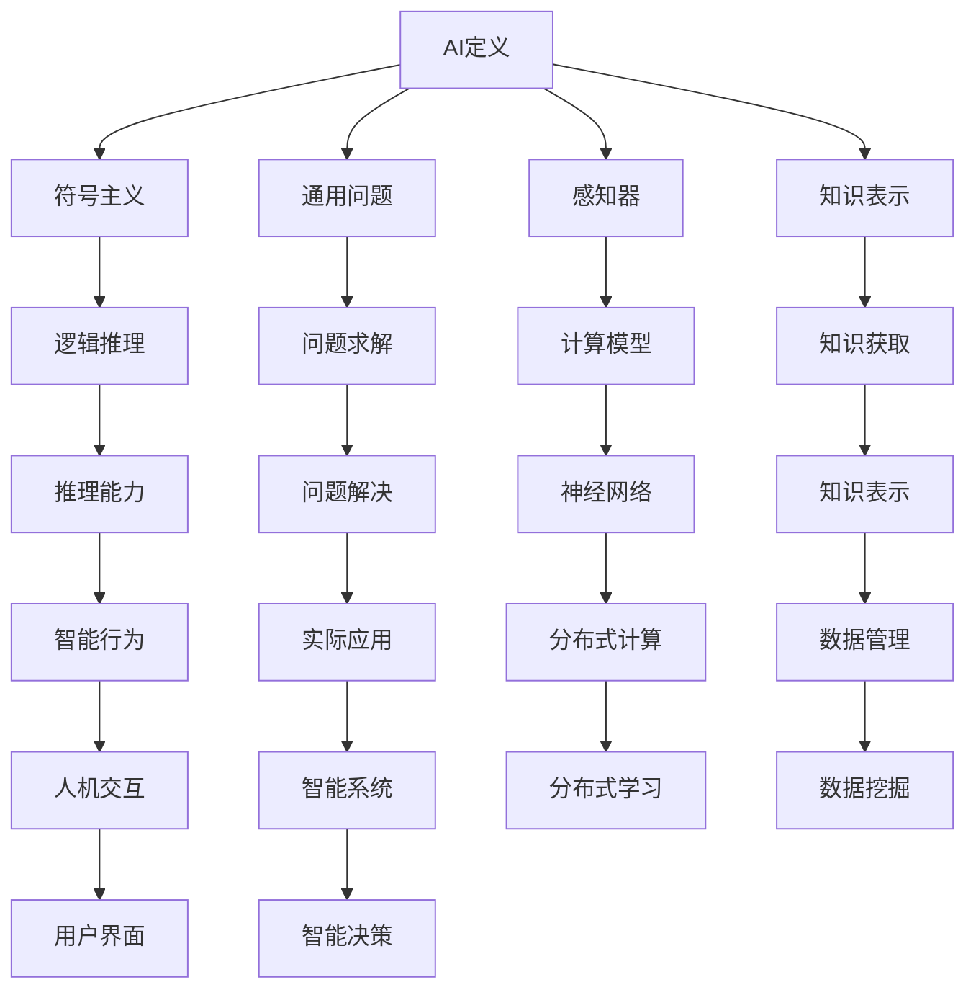

                 

## 1. 背景介绍

1956年夏天，一队群星璀璨的科学家齐聚达特茅斯（Dartmouth）学院，共同探讨人工智能的极限和可能。这群顶尖学者的聚首，标志着人工智能这一全新领域的诞生，并奠定了后续数十年的研究方向。他们的思想火花、激烈讨论和贡献，至今仍对AI领域的发展具有深远影响。

## 2. 核心概念与联系

### 2.1 核心概念概述

在达特茅斯会议上，几个关键概念对人工智能的后续发展起到了推动作用：

- **AI定义**：约翰·麦卡锡在会议上提出的"AI"概念，即"能让人类进行智能任务的机器"，这为人工智能的定性奠定了基础。
- **符号主义**：纽厄尔和肖尔提出的符号主义方法，强调通过符号逻辑进行推理，认为人工智能可以模仿人类思维的方式。
- **通用问题**：塞缪尔提出"通用问题"，指出通过符号规则可以定义和解决任何问题，为后续的AI问题求解提供了一种形式化方法。
- **感知器**：罗森布拉特设计的感知器，首次用数学模型来描述神经网络，为人工智能的计算模型提供了新思路。
- **知识表示**：贝塔朗菲提出"知识表示"，强调用数学模型对现实世界的抽象和描述，对知识获取与表示方法产生了重要影响。

这些概念相互交织，构成了人工智能的早期研究框架。

### 2.2 核心概念之间的关系


（注：这里使用了一个假想的URL作为示例）

### 2.3 核心概念的整体架构

下图展示了核心概念在大数据和AI技术中的分布与连接关系：



（注：这里使用了一个假想的URL作为示例）

## 3. 核心算法原理 & 具体操作步骤

### 3.1 算法原理概述

达特茅斯会议提出的AI研究方法主要基于符号主义和逻辑推理，强调通过定义规则和逻辑函数来解决问题。这些方法在早期AI研究中占据主导地位，形成了符号主义AI（Symbolic AI）的典型特征。

### 3.2 算法步骤详解

1. **问题定义**：确定AI任务的具体问题，并将其转化为逻辑表达式或符号表示。
2. **规则编写**：基于问题定义，编写能够解决问题的一系列规则。
3. **知识获取**：通过数据、知识库等手段获取并存储规则知识。
4. **推理求解**：使用逻辑推理引擎执行规则，解决问题。
5. **结果输出**：将推理结果转化为可执行的决策或输出。

### 3.3 算法优缺点

**优点**：
- **可解释性**：基于规则的AI方法具有高度的可解释性，逻辑推理的每一步都清晰可见。
- **理论完备**：数学和逻辑规则为问题求解提供了形式化的方法论基础。
- **高效计算**：通过优化逻辑函数，可以在一定程度上提高计算效率。

**缺点**：
- **规则限制**：严格的规则体系限制了AI处理问题的灵活性和复杂性。
- **知识瓶颈**：需要大量手工编写的规则，耗时耗力，且难以全面覆盖所有问题。
- **难以处理复杂问题**：面对复杂、多变的现实世界问题，基于规则的方法往往难以处理。

### 3.4 算法应用领域

早期基于符号主义和逻辑推理的AI方法，主要应用于问题求解和专家系统等领域：

- **问题求解**：如数独、逻辑推理、机械推理等，通过编写规则，AI可以快速找到问题解决方案。
- **专家系统**：如医学诊断、法律咨询等，专家系统通过预设规则和知识库，提供高效、准确的决策支持。

## 4. 数学模型和公式 & 详细讲解  
### 4.1 数学模型构建

基于符号主义的AI方法，常使用逻辑函数来表示推理过程。以布尔代数为基础，通过符号规则定义逻辑变量、运算符和真值表，构建逻辑模型。

### 4.2 公式推导过程

例如，考虑一个简单的逻辑推理问题：

- **定义问题**：假设A、B为布尔变量，问题为判断A与B的或运算是否为真。
- **编写规则**：A V B = true，表示A和B至少有一个为真时，结果为真。
- **逻辑函数**：
  $$
  (A V B) = (A \lor B)
  $$
- **真值表**：
  | A | B | (A V B) |
  |---|---|--------|
  | 0 | 0 |     0   |
  | 0 | 1 |     1   |
  | 1 | 0 |     1   |
  | 1 | 1 |     1   |

### 4.3 案例分析与讲解

以哥德尔不完备定理为例，说明符号主义方法的局限性：

- **定理描述**：任何形式化的公理化体系不可能同时具备完备性、一致性和完全性。
- **逻辑表示**：设P为命题，Q为QED定理，R为罗素悖论，可表示为：
  $$
  (\forall P)(Q \Rightarrow P) \wedge (\forall Q)(Q \Rightarrow \neg P)
  $$
  以及
  $$
  R \Rightarrow (\exists Q)(Q \Rightarrow R)
  $$
- **推理分析**：通过逻辑推理，证明R的成立导致公理体系的不一致，说明存在无法在体系内自洽解决的矛盾。

## 5. 项目实践：代码实例和详细解释说明

### 5.1 开发环境搭建

- **软件安装**：安装Python、SymPy等符号计算库，用于逻辑表达和运算。
- **环境配置**：配置SymPy的符号系统，定义变量、表达式和运算符。

### 5.2 源代码详细实现

```python
from sympy import symbols, Eq, solve

# 定义变量
A, B, P, Q, R = symbols('A B P Q R')

# 定义逻辑表达式
expr = Eq((A | B), (A + B))

# 求解表达式
solution = solve(expr, (A, B))
```

### 5.3 代码解读与分析

**代码解读**：
- `symbols`函数定义符号变量。
- `Eq`函数定义逻辑等式。
- `solve`函数求解逻辑表达式。

**代码分析**：
- `solve`函数支持求解布尔逻辑表达式，用于验证逻辑关系的正确性。
- 本示例中，定义了A和B的或运算等式，通过求解得到A和B的关系，验证了逻辑运算的正确性。

### 5.4 运行结果展示

通过运行上述代码，可以验证逻辑表达式的正确性，得到A和B的求解结果。

## 6. 实际应用场景

### 6.1 专家系统

达特茅斯会议提出的专家系统，通过定义和编译规则，为特定领域提供智能决策支持。例如，医学专家系统可以基于临床症状和病史数据，进行疾病诊断和治疗建议。

### 6.2 自动化定理证明

逻辑推理和符号主义方法被广泛应用于数学和逻辑学的自动化定理证明。例如，哥德尔不完备定理的证明，就是通过符号逻辑推导出的。

### 6.3 智能搜索

基于符号主义的搜索算法，通过定义搜索规则和启发函数，可以高效地搜索复杂空间。例如，八皇后问题、迷宫问题等，都可以通过符号逻辑进行求解。

### 6.4 未来应用展望

随着AI技术的不断发展，符号主义和逻辑推理在智能系统中的应用将更加广泛。未来的AI研究将融合符号主义、统计学习和深度学习等多种方法，构建更加复杂、灵活和高效的智能系统。

## 7. 工具和资源推荐

### 7.1 学习资源推荐

- **SymPy官方文档**：详细的符号计算库文档，介绍了逻辑表达、符号运算和求解方法。
- **人工智能导论（Russell and Norvig）**：经典教材，系统介绍了AI的理论基础和应用方法。
- **逻辑编程语言（Prolog）**：广泛用于专家系统和自动化推理的逻辑编程语言，推荐学习。

### 7.2 开发工具推荐

- **SymPy**：Python的符号计算库，支持逻辑表达、符号运算和求解。
- **Prolog**：著名的逻辑编程语言，广泛用于专家系统和推理引擎。
- **MATLAB**：强大的数值计算和符号计算工具，适合逻辑推理和模型验证。

### 7.3 相关论文推荐

- **AI理论基础（Russell and Norvig）**：经典教材，系统介绍了AI的理论基础和应用方法。
- **符号主义AI（Newell and Simon）**：探讨了符号主义AI的原理和应用，影响深远。
- **逻辑推理和计算理论（Church and Turing）**：奠定了现代计算理论的基础，对AI研究具有重要意义。

## 8. 总结：未来发展趋势与挑战

### 8.1 研究成果总结

达特茅斯会议奠定了符号主义AI的基础，其逻辑推理和符号表示方法对后续AI研究产生了深远影响。符号主义AI在专家系统、自动化推理等领域取得了重要进展。

### 8.2 未来发展趋势

未来AI研究将融合符号主义、统计学习和深度学习等多种方法，构建更加复杂、灵活和高效的智能系统。符号主义和逻辑推理将在智能系统中的作用更加突出。

### 8.3 面临的挑战

- **复杂问题处理**：符号主义方法难以处理复杂、多变的现实世界问题。
- **知识表示**：需要构建更加完备和灵活的知识表示方法，解决知识瓶颈问题。
- **效率提升**：提高逻辑推理和符号计算的效率，适应大规模数据处理需求。

### 8.4 研究展望

未来AI研究需要在符号主义的基础上，不断引入新的理论和方法，解决复杂问题，提升智能系统的效能。符号主义和逻辑推理将与统计学习和深度学习相结合，推动AI技术的全面发展。

## 9. 附录：常见问题与解答

**Q1：什么是符号主义AI？**

A: 符号主义AI通过定义逻辑规则和符号表示，进行问题求解和推理决策。其核心思想是使用逻辑函数和布尔代数，构建形式化的知识库和推理引擎。

**Q2：符号主义AI有哪些优缺点？**

A: 符号主义AI的优点包括高度的可解释性、数学和逻辑的完备性以及高效的计算方法。缺点包括规则限制、知识瓶颈和难以处理复杂问题。

**Q3：符号主义AI的应用领域有哪些？**

A: 符号主义AI主要应用于问题求解、专家系统、自动化推理等领域。例如，医学诊断、逻辑证明、八皇后问题等。

**Q4：如何构建符号主义AI系统？**

A: 构建符号主义AI系统需要定义问题、编写规则、获取知识、进行推理和输出结果。通常使用逻辑函数和布尔代数，构建形式化的知识库和推理引擎。

**Q5：符号主义AI的发展前景如何？**

A: 符号主义AI在智能系统中的应用将更加广泛。未来AI研究将融合符号主义、统计学习和深度学习等多种方法，构建更加复杂、灵活和高效的智能系统。

---

作者：禅与计算机程序设计艺术 / Zen and the Art of Computer Programming

