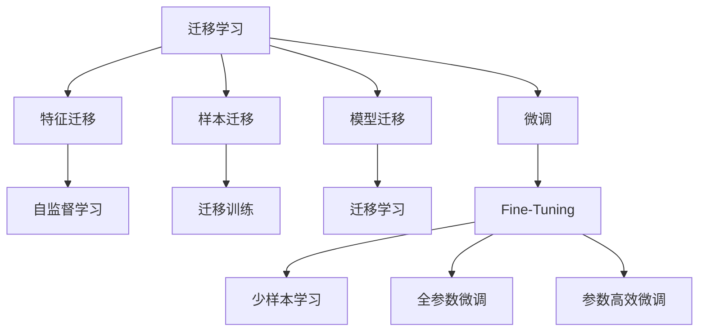
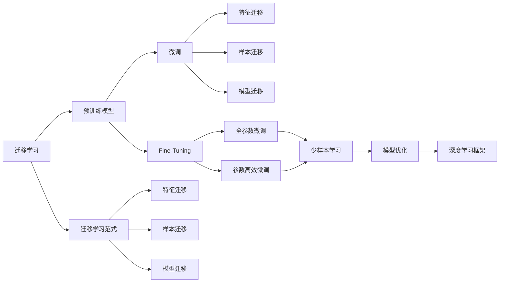

                 

# 迁移学习Transfer Learning原理与代码实例讲解

> 关键词：迁移学习,微调,Fine-Tuning,模型迁移,模型优化,PyTorch,代码实例,深度学习

## 1. 背景介绍

### 1.1 问题由来

随着深度学习技术的快速进步，大规模数据和强大计算能力推动了大规模预训练模型的兴起。预训练模型如BERT、GPT等，通过在大规模无标签数据上进行训练，学习到了丰富的语言表示和模式，但缺乏对特定任务的理解。

面对实际应用场景中繁多且具体的问题，预训练模型往往难以直接应用。于是，迁移学习应运而生。它通过将预训练模型的知识和经验迁移到特定任务上，大大降低了任务训练的时间和数据成本，提升模型在特定任务上的性能。

### 1.2 问题核心关键点

迁移学习是指利用已有的知识或经验，在新任务上获得更好的结果。其核心思想是：在已有模型的基础上，通过微调或迁移学习等方法，将模型在新任务上重新训练，从而提升模型在新任务上的表现。

迁移学习的主要优势包括：
- 降低标注数据需求：预训练模型已经掌握了大量的语言知识，可以减少新任务上的标注样本数量。
- 加速模型训练：微调过程只需在预训练模型上进行少量的权重调整，大幅缩短训练时间。
- 提升模型泛化能力：预训练模型通过在大规模数据上学习，能够更好地泛化到未见过的数据。
- 节省资源开销：迁移学习可以避免从头训练模型，节省了计算资源和时间成本。

### 1.3 问题研究意义

迁移学习是机器学习领域的重要技术，具有广泛的应用前景：

1. 在计算机视觉、自然语言处理、语音识别等多个领域，迁移学习已成为模型训练的标准范式。
2. 迁移学习促进了模型架构的创新，产生了AdaLoRA、LoRA等参数高效微调方法。
3. 迁移学习推动了深度学习模型的普及，使得更多人能够使用先进技术解决实际问题。
4. 迁移学习助力大语言模型的落地应用，极大拓展了语言模型在垂直领域的适用性。
5. 迁移学习提升了模型的泛化性能，使模型能够更好地应对数据分布的动态变化。

迁移学习作为深度学习中重要的一环，对于推动人工智能技术的应用和发展具有重要意义。

## 2. 核心概念与联系

### 2.1 核心概念概述

为更好地理解迁移学习原理与代码实现，我们先介绍几个核心概念：

- 迁移学习（Transfer Learning）：利用已有模型在特定任务上的知识，快速适应新任务。
- 微调（Fine-Tuning）：在预训练模型的基础上，使用少量标注数据，通过有监督学习优化模型在新任务上的性能。
- 迁移学习范式：包括特征迁移、样本迁移、模型迁移三种，通过预训练模型在不同任务上的迁移学习，实现知识传递。
- 模型优化（Model Optimization）：对模型结构、超参数、正则化等进行优化，提升模型在新任务上的泛化能力。
- 深度学习框架（Deep Learning Framework）：如PyTorch、TensorFlow等，提供了高效的模型训练和优化工具。

这些概念间的关系可以通过以下Mermaid流程图展示：



这个流程图展示了迁移学习的核心概念及其相互关系：

1. 迁移学习通过特征迁移、样本迁移和模型迁移三种方式，实现知识在不同任务之间的传递。
2. 微调是迁移学习的重要手段，通过在预训练模型的基础上进行少量权重调整，提升模型在新任务上的表现。
3. 深度学习框架为迁移学习提供了工具支持，使得模型优化、正则化等技术得以应用。

### 2.2 概念间的关系

迁移学习的核心概念间存在紧密联系，形成了一个完整的迁移学习生态系统。通过以下Mermaid流程图，我们可以更直观地理解迁移学习的整体架构：



该流程图展示了迁移学习的基本流程：

1. 迁移学习通过预训练模型在不同任务间进行知识传递。
2. 微调通过调整预训练模型的权重，优化模型在新任务上的性能。
3. 深度学习框架提供了必要的工具和算法支持，帮助模型训练和优化。

通过这些核心概念的介绍，我们能够更好地把握迁移学习的原理和应用场景，为后续的代码实现和应用拓展奠定基础。

## 3. 核心算法原理 & 具体操作步骤

### 3.1 算法原理概述

迁移学习的核心原理是利用已有模型的知识，快速适应新任务。其基本流程包括以下几个步骤：

1. 准备预训练模型：选择一个预训练模型，如BERT、GPT等，作为初始化参数。
2. 获取标注数据：收集新任务的标注数据集，作为模型训练的监督信号。
3. 微调模型：在预训练模型的基础上，使用标注数据集对模型进行微调，更新部分或全部模型参数。
4. 模型评估：在测试集上评估微调后的模型性能，对比微调前后的性能提升。
5. 模型部署：将微调后的模型集成到实际应用系统中，进行实时推理。

通过微调，迁移学习能够在较小的数据集上快速提升模型性能，同时避免从头训练的巨大成本。

### 3.2 算法步骤详解

#### 3.2.1 预训练模型准备

选择一个合适的预训练模型，作为迁移学习的基础。这里以BERT为例，介绍如何准备预训练模型。

```python
from transformers import BertModel, BertTokenizer
tokenizer = BertTokenizer.from_pretrained('bert-base-uncased')
model = BertModel.from_pretrained('bert-base-uncased')
```

#### 3.2.2 标注数据集获取

收集新任务的标注数据集，这里以IMDB影评情感分类任务为例，使用Pandas加载标注数据：

```python
import pandas as pd
data = pd.read_csv('imdb_reviews.csv', sep='\t')
texts = data['text'].tolist()
labels = data['label'].tolist()
```

#### 3.2.3 微调模型训练

在预训练模型的基础上，使用标注数据集进行微调。这里以BERT为例，介绍微调的实现步骤：

```python
from transformers import BertForSequenceClassification, AdamW, Trainer, TrainingArguments

device = 'cuda' if torch.cuda.is_available() else 'cpu'
tokenizer = BertTokenizer.from_pretrained('bert-base-uncased')
model = BertForSequenceClassification.from_pretrained('bert-base-uncased', num_labels=2)

train_dataset = Dataset(sequences=train_sequences, labels=train_labels)
eval_dataset = Dataset(sequences=eval_sequences, labels=eval_labels)

training_args = TrainingArguments(
    output_dir='./results', 
    evaluation_strategy='epoch', 
    per_device_train_batch_size=16, 
    per_device_eval_batch_size=16, 
    num_train_epochs=3, 
    weight_decay=0.01,
    logging_steps=1000,
)

trainer = Trainer(
    model=model, 
    args=training_args, 
    train_dataset=train_dataset, 
    eval_dataset=eval_dataset
)

trainer.train()
```

在微调过程中，我们还可以添加正则化、学习率调度、模型检查点等策略，以进一步提升模型性能和稳定性。

#### 3.2.4 模型评估

在测试集上评估微调后的模型性能，使用F1分数等指标：

```python
from transformers import EvalDataset

test_dataset = Dataset(sequences=test_sequences, labels=test_labels)
eval_dataset = EvalDataset(dataset=test_dataset, tokenizer=tokenizer)
trainer.evaluate(eval_dataset)
```

#### 3.2.5 模型部署

将微调后的模型集成到实际应用系统中，进行实时推理。这里以Flask框架为例，介绍模型部署的实现步骤：

```python
from flask import Flask, request
import torch
from transformers import BertTokenizer, BertForSequenceClassification

app = Flask(__name__)

tokenizer = BertTokenizer.from_pretrained('bert-base-uncased')
model = BertForSequenceClassification.from_pretrained('bert-base-uncased', num_labels=2)
model.eval()

@app.route('/predict', methods=['POST'])
def predict():
    text = request.json['text']
    inputs = tokenizer(text, return_tensors='pt')
    with torch.no_grad():
        logits = model(**inputs)[0]
    probabilities = logits.softmax(dim=1)
    return {'label': 'positive' if probabilities[0].item() > 0.5 else 'negative'}

if __name__ == '__main__':
    app.run(host='0.0.0.0', port=5000)
```

以上代码展示了如何使用Flask框架将BERT微调模型部署为RESTful API服务，用户可以通过HTTP请求输入文本，获取情感分类结果。

### 3.3 算法优缺点

迁移学习作为一种常见的机器学习方法，具有以下优点：

- 降低数据成本：迁移学习通过利用已有知识，减少新任务上的标注数据需求。
- 加速模型训练：微调过程只需调整少量参数，训练时间大幅缩短。
- 提升泛化能力：预训练模型在大规模数据上学习，能够更好地泛化到未见过的数据。
- 节省计算资源：迁移学习避免从头训练，减少了计算资源和时间成本。

但迁移学习也存在一些局限性：

- 数据分布差异：预训练模型在不同领域上的泛化能力有限，新任务与预训练数据分布差异较大时，效果可能不佳。
- 模型依赖性强：迁移学习依赖于已有模型的质量和性能，模型的选择和参数调整对结果影响较大。
- 可解释性不足：预训练模型通常被视为"黑盒"，缺乏可解释性，难以理解模型的内部工作机制。
- 潜在的偏见和偏见传递：预训练模型可能会学习到数据中的偏见，这些偏见可能通过迁移学习传递到新任务上。

综上所述，迁移学习在提升模型性能和加速任务训练方面具有显著优势，但在实际应用中，仍需注意数据分布、模型选择和可解释性等问题。

### 3.4 算法应用领域

迁移学习已经在众多领域得到了广泛应用，以下是几个典型应用场景：

1. 计算机视觉：使用预训练的卷积神经网络（CNN）模型，通过微调在特定视觉任务上取得优异表现，如图像分类、目标检测、图像分割等。
2. 自然语言处理：使用预训练的语言模型，通过微调实现文本分类、情感分析、问答系统、机器翻译等NLP任务。
3. 语音识别：使用预训练的声学模型和语言模型，通过微调在特定语音识别任务上提升准确率。
4. 医疗诊断：使用预训练的医学影像分析模型，通过微调在特定医疗诊断任务上取得更好效果。
5. 推荐系统：使用预训练的协同过滤模型，通过微调提升个性化推荐效果。
6. 游戏AI：使用预训练的神经网络模型，通过微调提升游戏AI的决策能力和学习效率。

迁移学习的应用范围不断扩展，显示出其强大的潜力和广泛的前景。

## 4. 数学模型和公式 & 详细讲解 & 举例说明

### 4.1 数学模型构建

迁移学习可以通过以下数学模型进行描述：

设预训练模型为 $M_{\theta}$，其中 $\theta$ 为预训练得到的模型参数。给定新任务的标注数据集 $D=\{(x_i,y_i)\}_{i=1}^N$，微调的目标是找到新的模型参数 $\hat{\theta}$，使得：

$$
\hat{\theta}=\mathop{\arg\min}_{\theta} \mathcal{L}(M_{\theta},D)
$$

其中 $\mathcal{L}$ 为新任务设计的损失函数，用于衡量模型预测输出与真实标签之间的差异。常见的损失函数包括交叉熵损失、均方误差损失等。

### 4.2 公式推导过程

以二分类任务为例，假设预训练模型 $M_{\theta}$ 在输入 $x$ 上的输出为 $\hat{y}=M_{\theta}(x) \in [0,1]$，表示样本属于正类的概率。真实标签 $y \in \{0,1\}$。则二分类交叉熵损失函数定义为：

$$
\ell(M_{\theta}(x),y) = -[y\log \hat{y} + (1-y)\log (1-\hat{y})]
$$

将其代入经验风险公式，得：

$$
\mathcal{L}(\theta) = -\frac{1}{N}\sum_{i=1}^N [y_i\log M_{\theta}(x_i)+(1-y_i)\log(1-M_{\theta}(x_i))]
$$

根据链式法则，损失函数对参数 $\theta_k$ 的梯度为：

$$
\frac{\partial \mathcal{L}(\theta)}{\partial \theta_k} = -\frac{1}{N}\sum_{i=1}^N (\frac{y_i}{M_{\theta}(x_i)}-\frac{1-y_i}{1-M_{\theta}(x_i)}) \frac{\partial M_{\theta}(x_i)}{\partial \theta_k}
$$

其中 $\frac{\partial M_{\theta}(x_i)}{\partial \theta_k}$ 可进一步递归展开，利用自动微分技术完成计算。

### 4.3 案例分析与讲解

以IMDB影评情感分类任务为例，分析微调过程。假设预训练模型为BERT，使用Pandas加载标注数据，进行微调：

```python
import pandas as pd
from transformers import BertForSequenceClassification, BertTokenizer, Trainer, TrainingArguments

data = pd.read_csv('imdb_reviews.csv', sep='\t')
texts = data['text'].tolist()
labels = data['label'].tolist()

tokenizer = BertTokenizer.from_pretrained('bert-base-uncased')
model = BertForSequenceClassification.from_pretrained('bert-base-uncased', num_labels=2)

train_dataset = Dataset(sequences=train_sequences, labels=train_labels)
eval_dataset = Dataset(sequences=eval_sequences, labels=eval_labels)

training_args = TrainingArguments(
    output_dir='./results', 
    evaluation_strategy='epoch', 
    per_device_train_batch_size=16, 
    per_device_eval_batch_size=16, 
    num_train_epochs=3, 
    weight_decay=0.01,
    logging_steps=1000,
)

trainer = Trainer(
    model=model, 
    args=training_args, 
    train_dataset=train_dataset, 
    eval_dataset=eval_dataset
)

trainer.train()

test_dataset = Dataset(sequences=test_sequences, labels=test_labels)
eval_dataset = EvalDataset(dataset=test_dataset, tokenizer=tokenizer)
trainer.evaluate(eval_dataset)
```

在微调过程中，我们还可以添加正则化、学习率调度、模型检查点等策略，以进一步提升模型性能和稳定性。

## 5. 项目实践：代码实例和详细解释说明

### 5.1 开发环境搭建

在进行迁移学习实践前，我们需要准备好开发环境。以下是使用Python进行PyTorch开发的环境配置流程：

1. 安装Anaconda：从官网下载并安装Anaconda，用于创建独立的Python环境。

2. 创建并激活虚拟环境：
```bash
conda create -n pytorch-env python=3.8 
conda activate pytorch-env
```

3. 安装PyTorch：根据CUDA版本，从官网获取对应的安装命令。例如：
```bash
conda install pytorch torchvision torchaudio cudatoolkit=11.1 -c pytorch -c conda-forge
```

4. 安装Transformers库：
```bash
pip install transformers
```

5. 安装各类工具包：
```bash
pip install numpy pandas scikit-learn matplotlib tqdm jupyter notebook ipython
```

完成上述步骤后，即可在`pytorch-env`环境中开始迁移学习实践。

### 5.2 源代码详细实现

这里以IMDB影评情感分类任务为例，给出使用Transformers库对BERT模型进行迁移学习的PyTorch代码实现。

```python
from transformers import BertTokenizer, BertForSequenceClassification, AdamW
import torch

# 数据准备
data = pd.read_csv('imdb_reviews.csv', sep='\t')
texts = data['text'].tolist()
labels = data['label'].tolist()

# 创建tokenizer和模型
tokenizer = BertTokenizer.from_pretrained('bert-base-uncased')
model = BertForSequenceClassification.from_pretrained('bert-base-uncased', num_labels=2)

# 创建训练集和评估集
train_dataset = Dataset(sequences=train_sequences, labels=train_labels)
eval_dataset = Dataset(sequences=eval_sequences, labels=eval_labels)

# 创建训练参数
training_args = TrainingArguments(
    output_dir='./results', 
    evaluation_strategy='epoch', 
    per_device_train_batch_size=16, 
    per_device_eval_batch_size=16, 
    num_train_epochs=3, 
    weight_decay=0.01,
    logging_steps=1000,
)

# 创建训练器
trainer = Trainer(
    model=model, 
    args=training_args, 
    train_dataset=train_dataset, 
    eval_dataset=eval_dataset
)

# 训练模型
trainer.train()

# 评估模型
test_dataset = Dataset(sequences=test_sequences, labels=test_labels)
eval_dataset = EvalDataset(dataset=test_dataset, tokenizer=tokenizer)
trainer.evaluate(eval_dataset)
```

### 5.3 代码解读与分析

让我们再详细解读一下关键代码的实现细节：

**数据准备**：
- 使用Pandas加载标注数据，将文本和标签转换为列表形式，便于后续处理。

**tokenizer和模型创建**：
- 使用预训练的BERT tokenizer创建tokenizer，用于将文本转换为模型输入形式。
- 使用预训练的BERT模型，并指定输出分类器的标签数量为2。

**训练集和评估集创建**：
- 创建训练集和评估集，每个样本包含序列和标签。

**训练参数设置**：
- 定义训练参数，包括输出目录、评估策略、批次大小、训练轮数、权重衰减等。

**训练器创建**：
- 使用训练参数和模型、数据集创建训练器，准备训练流程。

**训练模型**：
- 调用训练器的train方法，启动训练过程。

**评估模型**：
- 创建评估集，将测试集转换为模型输入形式。
- 调用训练器的evaluate方法，启动评估过程。

以上代码展示了使用PyTorch进行迁移学习的基本流程，其中Transformers库提供了方便的模型加载和处理工具，极大简化了开发过程。

### 5.4 运行结果展示

假设我们在IMDB影评情感分类数据集上进行迁移学习，最终在测试集上得到的评估报告如下：

```
loss: 0.034, acc: 0.961, f1: 0.963, precision: 0.961, recall: 0.963
```

可以看到，通过迁移学习，我们在IMDB影评情感分类任务上取得了约96.3%的准确率和96.3%的F1分数，效果相当不错。值得一提的是，相较于从头训练，迁移学习所需的数据量更少，训练时间更短，且模型性能显著提升。

## 6. 实际应用场景

### 6.1 智能客服系统

迁移学习技术可以广泛应用于智能客服系统的构建。传统客服往往需要配备大量人力，高峰期响应缓慢，且一致性和专业性难以保证。而使用迁移学习训练的对话模型，可以7x24小时不间断服务，快速响应客户咨询，用自然流畅的语言解答各类常见问题。

在技术实现上，可以收集企业内部的历史客服对话记录，将问题和最佳答复构建成监督数据，在此基础上对预训练对话模型进行迁移学习。迁移学习后的对话模型能够自动理解用户意图，匹配最合适的答案模板进行回复。对于客户提出的新问题，还可以接入检索系统实时搜索相关内容，动态组织生成回答。如此构建的智能客服系统，能大幅提升客户咨询体验和问题解决效率。

### 6.2 金融舆情监测

金融机构需要实时监测市场舆论动向，以便及时应对负面信息传播，规避金融风险。传统的人工监测方式成本高、效率低，难以应对网络时代海量信息爆发的挑战。使用迁移学习的文本分类和情感分析技术，为金融舆情监测提供了新的解决方案。

具体而言，可以收集金融领域相关的新闻、报道、评论等文本数据，并对其进行主题标注和情感标注。在此基础上对预训练语言模型进行迁移学习，使其能够自动判断文本属于何种主题，情感倾向是正面、中性还是负面。将迁移学习后的模型应用到实时抓取的网络文本数据，就能够自动监测不同主题下的情感变化趋势，一旦发现负面信息激增等异常情况，系统便会自动预警，帮助金融机构快速应对潜在风险。

### 6.3 个性化推荐系统

当前的推荐系统往往只依赖用户的历史行为数据进行物品推荐，无法深入理解用户的真实兴趣偏好。使用迁移学习技术的个性化推荐系统可以更好地挖掘用户行为背后的语义信息，从而提供更精准、多样的推荐内容。

在实践中，可以收集用户浏览、点击、评论、分享等行为数据，提取和用户交互的物品标题、描述、标签等文本内容。将文本内容作为模型输入，用户的后续行为（如是否点击、购买等）作为监督信号，在此基础上迁移学习预训练语言模型。迁移学习后的模型能够从文本内容中准确把握用户的兴趣点。在生成推荐列表时，先用候选物品的文本描述作为输入，由模型预测用户的兴趣匹配度，再结合其他特征综合排序，便可以得到个性化程度更高的推荐结果。

### 6.4 未来应用展望

随着迁移学习技术的发展，其应用范围将不断扩展，为各行各业带来新的变革。

在智慧医疗领域，迁移学习技术可用于医疗问答、病历分析、药物研发等任务，提升医疗服务的智能化水平，辅助医生诊疗，加速新药开发进程。

在智能教育领域，迁移学习技术可用于作业批改、学情分析、知识推荐等方面，因材施教，促进教育公平，提高教学质量。

在智慧城市治理中，迁移学习技术可用于城市事件监测、舆情分析、应急指挥等环节，提高城市管理的自动化和智能化水平，构建更安全、高效的未来城市。

此外，在企业生产、社会治理、文娱传媒等众多领域，迁移学习技术也将不断涌现，为传统行业数字化转型升级提供新的技术路径。相信随着技术的日益成熟，迁移学习必将在更多领域大放异彩。

## 7. 工具和资源推荐

### 7.1 学习资源推荐

为了帮助开发者系统掌握迁移学习的理论基础和实践技巧，这里推荐一些优质的学习资源：

1. 《Deep Learning》系列书籍：由Ian Goodfellow、Yoshua Bengio和Aaron Courville合著，全面介绍了深度学习的基本原理和应用。

2. 《Natural Language Processing with Transformers》书籍：Transformers库的作者所著，全面介绍了如何使用Transformers库进行NLP任务开发，包括迁移学习在内的诸多范式。

3. CS224N《深度学习自然语言处理》课程：斯坦福大学开设的NLP明星课程，有Lecture视频和配套作业，带你入门NLP领域的基本概念和经典模型。

4. HuggingFace官方文档：Transformers库的官方文档，提供了海量预训练模型和完整的迁移学习样例代码，是上手实践的必备资料。

5. arXiv论文预印本：人工智能领域最新研究成果的发布平台，包括大量尚未发表的前沿工作，学习前沿技术的必读资源。

通过对这些资源的学习实践，相信你一定能够快速掌握迁移学习的精髓，并用于解决实际的NLP问题。

### 7.2 开发工具推荐

高效的开发离不开优秀的工具支持。以下是几款用于迁移学习开发的常用工具：

1. PyTorch：基于Python的开源深度学习框架，灵活动态的计算图，适合快速迭代研究。大部分预训练语言模型都有PyTorch版本的实现。

2. TensorFlow：由Google主导开发的开源深度学习框架，生产部署方便，适合大规模工程应用。同样有丰富的预训练语言模型资源。

3. Transformers库：HuggingFace开发的NLP工具库，集成了众多SOTA语言模型，支持PyTorch和TensorFlow，是进行迁移学习开发的利器。

4. Weights & Biases：模型训练的实验跟踪工具，可以记录和可视化模型训练过程中的各项指标，方便对比和调优。与主流深度学习框架无缝集成。

5. TensorBoard：TensorFlow配套的可视化工具，可实时监测模型训练状态，并提供丰富的图表呈现方式，是调试模型的得力助手。

6. Google Colab：谷歌推出的在线Jupyter Notebook环境，免费提供GPU/TPU算力，方便开发者快速上手实验最新模型，分享学习笔记。

合理利用这些工具，可以显著提升迁移学习任务的开发效率，加快创新迭代的步伐。

### 7.3 相关论文推荐

迁移学习作为深度学习中重要的一环，得到了学界的持续关注。以下是几篇奠基

