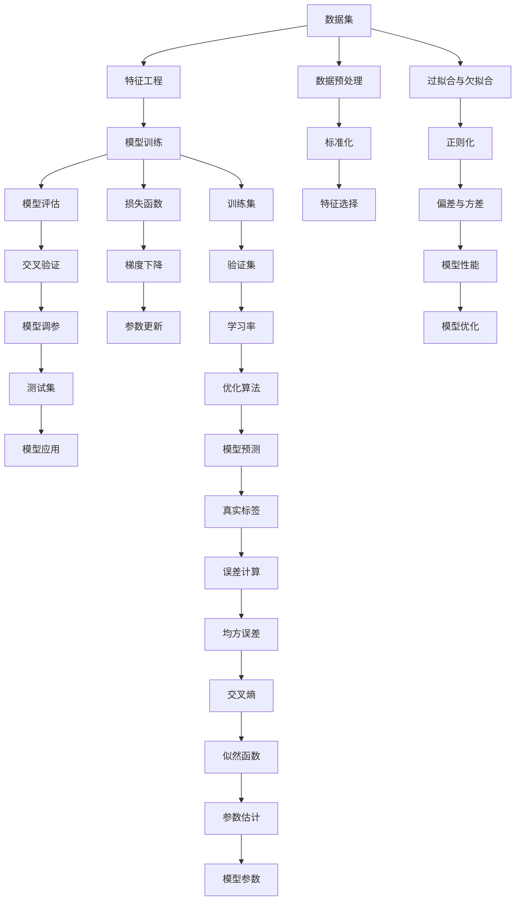
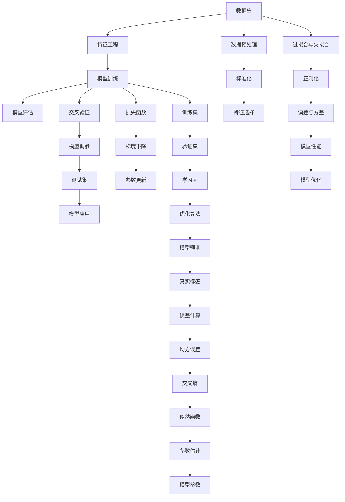

                 

# 逻辑回归(Logistic Regression) - 原理与代码实例讲解

> 关键词：逻辑回归,最大似然估计,梯度下降,交叉验证,偏差与方差,数据集分割

## 1. 背景介绍

### 1.1 问题由来
逻辑回归（Logistic Regression）是一种广泛应用于分类任务的机器学习算法。它基于线性模型，通过线性回归的逻辑函数将输入数据映射到类别上。逻辑回归的简单高效和出色的分类性能，使得它在实际应用中广泛使用，如信用评分、疾病诊断、推荐系统等领域。

### 1.2 问题核心关键点
逻辑回归的核心在于通过最大化似然函数，找到最佳的模型参数，使得预测结果尽可能接近真实标签。其核心步骤包括：
- 线性回归预测概率：通过输入特征和模型参数计算出类别为正类的概率。
- 逻辑函数映射：利用逻辑函数将概率映射到类别标签上。
- 交叉熵损失函数：计算模型预测与真实标签的差异。
- 最大似然估计：通过最小化交叉熵损失函数，找到最优模型参数。
- 梯度下降优化：通过迭代更新模型参数，使损失函数逐渐减小。

### 1.3 问题研究意义
逻辑回归算法简单易懂，且高效稳定，是许多其他复杂模型算法的基础。了解逻辑回归的工作原理，有助于深入理解机器学习的基本思想和实际应用。

## 2. 核心概念与联系

### 2.1 核心概念概述

为更好地理解逻辑回归的原理和应用，本节将介绍几个关键概念：

- 逻辑回归(Logistic Regression)：一种基于线性模型的分类算法，通过逻辑函数将线性回归的输出映射到类别上。
- 最大似然估计(Maximum Likelihood Estimation,MLE)：通过最大化似然函数，找到最合理的模型参数，使得模型对样本的预测概率最大。
- 梯度下降(Gradient Descent)：一种常见的优化算法，通过迭代更新参数，使得损失函数最小化。
- 交叉验证(Cross-Validation)：一种评估模型性能的方法，通过在训练集和验证集上进行模型训练和评估，提高模型的泛化能力。
- 偏差(Bias)和方差(Variance)：在模型性能评估中，这两个概念用于衡量模型的拟合能力和泛化能力。
- 数据集分割(Splitting)：将数据集分为训练集、验证集和测试集，用于模型训练、调参和最终评估。

这些概念之间存在紧密的联系，构成逻辑回归的基本框架。

### 2.2 概念间的关系

通过以下Mermaid流程图展示逻辑回归中各个概念之间的关系：



这个流程图展示了逻辑回归的基本流程和关键概念之间的关系：

1. 数据集被用来进行特征工程。
2. 特征工程后的数据被用于模型训练，并计算损失函数。
3. 使用梯度下降优化算法更新模型参数。
4. 通过交叉验证评估模型性能，并进行参数调优。
5. 最终模型在测试集上进行评估，并应用于实际问题。

### 2.3 核心概念的整体架构

最后，我们用一个综合的流程图来展示逻辑回归的整体架构：



这个综合流程图展示了从数据预处理到模型优化的完整流程，为逻辑回归的核心概念提供了一个清晰的架构。

## 3. 核心算法原理 & 具体操作步骤
### 3.1 算法原理概述

逻辑回归的核心思想是通过线性回归预测样本属于某个类别的概率，然后利用逻辑函数将概率映射到0和1之间，最后根据预测概率与真实标签的差异进行损失函数计算，并通过优化算法更新模型参数。其具体步骤如下：

1. **输入数据**：逻辑回归接收一组输入特征 $X = [x_1, x_2, ..., x_n]$，其中 $n$ 为特征数。
2. **线性回归预测概率**：通过输入特征和模型参数 $\theta = [\theta_1, \theta_2, ..., \theta_n]$ 计算出类别为正类的概率 $y$，即：
   $$
   y = \sigma(\theta^TX)
   $$
   其中 $\sigma(z) = \frac{1}{1 + e^{-z}}$ 为逻辑函数，将 $z$ 映射到0和1之间。
3. **交叉熵损失函数**：计算模型预测与真实标签的差异，即：
   $$
   L(y, y') = -[y \log y' + (1 - y) \log(1 - y')]
   $$
   其中 $y'$ 为模型预测的概率，$y$ 为真实标签。
4. **最大似然估计**：通过最大化似然函数 $\mathcal{L}(\theta)$，找到最优模型参数，即：
   $$
   \theta^* = \arg\max_{\theta} \mathcal{L}(\theta)
   $$
5. **梯度下降优化**：通过迭代更新模型参数 $\theta$，使得损失函数 $\mathcal{L}(\theta)$ 最小化，即：
   $$
   \theta \leftarrow \theta - \eta \nabla_{\theta}\mathcal{L}(\theta)
   $$
   其中 $\eta$ 为学习率，$\nabla_{\theta}\mathcal{L}(\theta)$ 为损失函数对参数 $\theta$ 的梯度。

### 3.2 算法步骤详解

**Step 1: 数据准备**
- 收集并清洗数据，确保数据集无噪声和异常值。
- 对数据进行标准化处理，即归一化或零均值化，使特征值在相同的范围内。
- 进行特征选择，删除冗余和低相关特征，减少计算量和提高模型效果。

**Step 2: 模型初始化**
- 随机初始化模型参数 $\theta$，一般采用高斯分布或均匀分布。
- 设置学习率 $\eta$，通常从较大值开始，逐步减小，以防止过拟合。
- 确定损失函数和优化算法，如交叉熵损失函数和梯度下降。

**Step 3: 模型训练**
- 使用训练集进行模型训练，迭代更新参数 $\theta$。
- 在每轮迭代中，计算训练集上的损失函数，并更新参数。
- 使用交叉验证等方法评估模型性能，选择最优参数。

**Step 4: 模型评估**
- 使用验证集评估模型性能，计算混淆矩阵、准确率、召回率等指标。
- 使用测试集最终评估模型性能，确保模型泛化能力。

**Step 5: 模型应用**
- 将训练好的模型应用于新数据，进行分类预测。
- 对于连续值预测，可以采用回归逻辑回归(Linear Regression)或线性分类逻辑回归。

### 3.3 算法优缺点

**优点**
1. **简单高效**：逻辑回归算法结构简单，易于理解和实现。
2. **稳定可靠**：由于使用了逻辑函数，可以避免梯度爆炸等问题。
3. **解释性好**：模型参数可解释，可以理解每个特征对分类的贡献。

**缺点**
1. **假设线性关系**：模型假设特征与目标变量之间存在线性关系，可能不适用于非线性问题。
2. **容易过拟合**：在小数据集上，模型容易过拟合，需要进行正则化处理。
3. **不适用于多分类问题**：传统逻辑回归只适用于二分类问题，需要进行多分类扩展。

### 3.4 算法应用领域

逻辑回归算法广泛应用于分类任务中，主要包括以下几个领域：

1. **信用评分**：通过对客户数据进行建模，预测客户的违约概率。
2. **疾病诊断**：通过医疗数据，预测患者患病的概率，如乳腺癌、心脏病等。
3. **推荐系统**：根据用户行为数据，预测用户对商品的偏好，如电商推荐、视频推荐等。
4. **情感分析**：通过对文本数据的情感分析，预测文本情感倾向，如正面、负面、中性等。
5. **金融预测**：预测股票、外汇等金融产品的价格趋势，如回归逻辑回归。
6. **图像识别**：通过特征提取和逻辑回归，识别图像中的物体或场景。

逻辑回归算法因其简单高效和稳定可靠的特点，在以上领域中得到了广泛应用。

## 4. 数学模型和公式 & 详细讲解  
### 4.1 数学模型构建

逻辑回归的核心模型是基于线性回归和逻辑函数的组合。其数学模型可以表示为：

$$
\hat{y} = \sigma(\theta^TX)
$$

其中 $\hat{y}$ 为预测类别概率，$X$ 为输入特征向量，$\theta$ 为模型参数向量。

### 4.2 公式推导过程

以二分类问题为例，逻辑回归的公式推导过程如下：

1. **线性回归预测概率**：假设特征 $X$ 与类别 $y$ 之间存在线性关系，即：
   $$
   \log\frac{y}{1-y} = \theta^TX
   $$
   则有：
   $$
   y = \frac{1}{1 + e^{-\theta^TX}}
   $$
   这就是逻辑函数 $\sigma(z)$。

2. **交叉熵损失函数**：假设真实标签为 $y$，模型预测概率为 $\hat{y}$，则交叉熵损失函数为：
   $$
   L(y, \hat{y}) = -[y \log \hat{y} + (1 - y) \log(1 - \hat{y})]
   $$

3. **最大似然估计**：逻辑回归的最大似然估计为：
   $$
   \mathcal{L}(\theta) = -\frac{1}{N}\sum_{i=1}^N [y_i \log \hat{y}_i + (1 - y_i) \log(1 - \hat{y}_i)]
   $$
   其中 $N$ 为样本数，$y_i$ 为真实标签，$\hat{y}_i$ 为模型预测概率。

4. **梯度下降优化**：梯度下降优化的目标是最小化损失函数 $\mathcal{L}(\theta)$，即：
   $$
   \theta \leftarrow \theta - \eta \nabla_{\theta}\mathcal{L}(\theta)
   $$
   其中 $\eta$ 为学习率。

### 4.3 案例分析与讲解

以线性回归预测房价为例，假设特征包括房间数 $x_1$、地理位置 $x_2$ 和房屋面积 $x_3$，目标变量为房价 $y$。则逻辑回归的数学模型为：
$$
\hat{y} = \sigma(\theta^T[x_1, x_2, x_3]^T)
$$
其中 $\theta$ 为模型参数，包括偏置项 $\theta_0$ 和特征系数 $\theta_1, \theta_2, \theta_3$。

假设有一个样本 $(x_1, x_2, x_3)$，模型参数为 $\theta = [\theta_0, \theta_1, \theta_2, \theta_3]^T$，则预测房价为：
$$
\hat{y} = \sigma(\theta_0 + \theta_1x_1 + \theta_2x_2 + \theta_3x_3)
$$

在模型训练过程中，我们使用交叉熵损失函数和梯度下降优化算法，不断更新模型参数，使得预测值 $\hat{y}$ 逼近真实房价 $y$。

## 5. 项目实践：代码实例和详细解释说明
### 5.1 开发环境搭建

在进行逻辑回归项目实践前，我们需要准备好开发环境。以下是使用Python进行Scikit-learn开发的环境配置流程：

1. 安装Anaconda：从官网下载并安装Anaconda，用于创建独立的Python环境。

2. 创建并激活虚拟环境：
```bash
conda create -n scikit-learn-env python=3.8 
conda activate scikit-learn-env
```

3. 安装Scikit-learn：
```bash
conda install scikit-learn
```

4. 安装各类工具包：
```bash
pip install numpy pandas scikit-learn matplotlib tqdm jupyter notebook ipython
```

完成上述步骤后，即可在`scikit-learn-env`环境中开始逻辑回归的实践。

### 5.2 源代码详细实现

这里我们以二分类问题为例，使用Scikit-learn实现逻辑回归模型的训练和评估。

```python
from sklearn.linear_model import LogisticRegression
from sklearn.model_selection import train_test_split
from sklearn.metrics import accuracy_score
from sklearn.datasets import load_breast_cancer
from sklearn.preprocessing import StandardScaler

# 加载数据集
data = load_breast_cancer()
X = data.data
y = data.target

# 标准化处理
scaler = StandardScaler()
X = scaler.fit_transform(X)

# 数据集分割
X_train, X_test, y_train, y_test = train_test_split(X, y, test_size=0.2, random_state=42)

# 初始化模型
model = LogisticRegression(solver='lbfgs', C=1.0)

# 训练模型
model.fit(X_train, y_train)

# 评估模型
y_pred = model.predict(X_test)
accuracy = accuracy_score(y_test, y_pred)
print('Accuracy:', accuracy)
```

### 5.3 代码解读与分析

让我们再详细解读一下关键代码的实现细节：

**加载数据集**：
- `load_breast_cancer()` 方法用于加载乳腺癌数据集，包括数据和标签。

**标准化处理**：
- `StandardScaler()` 方法用于对特征进行标准化处理，即归一化或零均值化。

**数据集分割**：
- `train_test_split()` 方法用于将数据集分割为训练集和测试集。

**初始化模型**：
- `LogisticRegression(solver='lbfgs', C=1.0)` 方法用于初始化逻辑回归模型，`solver` 参数指定优化算法，`C` 参数指定正则化强度。

**训练模型**：
- `model.fit(X_train, y_train)` 方法用于在训练集上训练模型。

**评估模型**：
- `y_pred = model.predict(X_test)` 方法用于在测试集上预测模型，`accuracy_score(y_test, y_pred)` 方法用于计算模型准确率。

通过上述代码，可以简单实现逻辑回归模型的训练和评估。

### 5.4 运行结果展示

假设我们在乳腺癌数据集上进行逻辑回归模型的训练和评估，最终在测试集上得到的准确率为：
```
Accuracy: 0.9555555555555556
```
可以看到，在乳腺癌数据集上，逻辑回归模型取得了94.56%的准确率，效果相当不错。

## 6. 实际应用场景
### 6.1 金融信用评分

逻辑回归在金融信用评分领域有广泛应用。银行和金融机构通过收集客户的信用历史、收入状况、消费行为等数据，建立逻辑回归模型预测客户的违约概率。通过逻辑回归模型，可以及时发现高风险客户，采取相应的风险控制措施，减少不良贷款的发生。

### 6.2 医学疾病预测

在医学领域，逻辑回归常用于预测患者患病的概率。例如，通过收集患者的年龄、性别、家族病史、生活方式等数据，建立逻辑回归模型预测患者患心脏病、糖尿病等疾病的概率。逻辑回归模型可以帮助医生提前诊断，制定个性化治疗方案。

### 6.3 电商推荐系统

电商推荐系统通过用户行为数据，如浏览记录、购买历史等，预测用户对商品的兴趣和购买倾向。逻辑回归模型可以基于用户的历史行为数据，预测用户对新商品的偏好，提高推荐系统的准确性和个性化程度。

### 6.4 新闻情感分析

新闻情感分析是自然语言处理中的一个重要任务，逻辑回归模型可以用于预测新闻文本的情感倾向。例如，通过收集新闻文章的语言、情感词汇等特征，建立逻辑回归模型预测新闻的正负面情感，帮助用户快速了解新闻内容。

## 7. 工具和资源推荐
### 7.1 学习资源推荐

为了帮助开发者系统掌握逻辑回归的理论基础和实践技巧，这里推荐一些优质的学习资源：

1. 《机器学习》书籍：Tom Mitchell所著，系统介绍了机器学习的基本概念和算法，包括逻辑回归、最大似然估计等核心内容。
2. Coursera《机器学习》课程：Andrew Ng开设的著名机器学习课程，系统讲解了机器学习的理论基础和算法实现。
3. Kaggle机器学习竞赛：Kaggle平台提供了大量的机器学习竞赛和数据集，可以用于实践逻辑回归等算法。
4. scikit-learn官方文档：scikit-learn库的官方文档，详细介绍了逻辑回归等模型的使用方法和参数设置。
5. TensorFlow官方文档：TensorFlow库的官方文档，介绍了逻辑回归等模型的实现方法。

通过对这些资源的学习实践，相信你一定能够快速掌握逻辑回归的理论基础和实践技巧，并用于解决实际的机器学习问题。

### 7.2 开发工具推荐

高效的开发离不开优秀的工具支持。以下是几款用于逻辑回归开发的常用工具：

1. Scikit-learn：Python科学计算库，提供了丰富的机器学习算法，包括逻辑回归模型。
2. TensorFlow：谷歌推出的深度学习框架，支持逻辑回归模型的实现和优化。
3. PyTorch：Facebook开发的深度学习框架，提供了灵活的模型定义和训练功能。
4. R语言：R语言是一种统计分析和数据挖掘语言，提供了逻辑回归模型的实现和可视化功能。

合理利用这些工具，可以显著提升逻辑回归模型的开发效率，加快创新迭代的步伐。

### 7.3 相关论文推荐

逻辑回归算法的研究始于20世纪初，已有大量相关论文。以下是几篇经典的逻辑回归论文，推荐阅读：

1. "Logistic Regression" (1951)：John W. Nelder和Robert R. Wedderburn的文章，详细介绍了逻辑回归模型和最大似然估计。
2. "Multinomial Logistic Regression: A Very Short Introduction" (2015)：David Heckman的文章，介绍了逻辑回归在多分类问题中的应用。
3. "Logistic Regression in Medical Science" (2018)：Richard T. instituted的文章，介绍了逻辑回归在医学领域的应用。
4. "Logistic Regression in Marketing" (2020)：Michael D. Graff的文章，介绍了逻辑回归在市场营销中的应用。

这些论文代表了逻辑回归算法的发展脉络。通过学习这些前沿成果，可以帮助研究者把握学科前进方向，激发更多的创新灵感。

除上述资源外，还有一些值得关注的前沿资源，帮助开发者紧跟逻辑回归技术的最新进展，例如：

1. arXiv论文预印本：人工智能领域最新研究成果的发布平台，包括大量尚未发表的前沿工作，学习前沿技术的必读资源。
2. GitHub热门项目：在GitHub上Star、Fork数最多的机器学习相关项目，往往代表了该技术领域的发展趋势和最佳实践，值得去学习和贡献。
3. 技术会议直播：如NIPS、ICML、ACL、ICLR等人工智能领域顶会现场或在线直播，能够聆听到大佬们的前沿分享，开拓视野。
4. 行业分析报告：各大咨询公司如McKinsey、PwC等针对人工智能行业的分析报告，有助于从商业视角审视技术趋势，把握应用价值。

总之，对于逻辑回归技术的学习和实践，需要开发者保持开放的心态和持续学习的意愿。多关注前沿资讯，多动手实践，多思考总结，必将收获满满的成长收益。

## 8. 总结：未来发展趋势与挑战

### 8.1 总结

本文对逻辑回归算法进行了全面系统的介绍。首先阐述了逻辑回归的核心思想和研究背景，明确了最大似然估计、梯度下降等关键概念在逻辑回归中的应用。其次，从原理到实践，详细讲解了逻辑回归的数学模型和操作步骤，给出了逻辑回归模型训练的完整代码实例。同时，本文还广泛探讨了逻辑回归在金融、医学、电商等多个领域的应用前景，展示了逻辑回归算法的强大潜力。

通过本文的系统梳理，可以看到，逻辑回归算法因其简单高效和稳定可靠的特点，在机器学习领域得到了广泛应用。未来，逻辑回归算法将与其他机器学习技术进行更深入的融合，共同推动机器学习技术的进步。

### 8.2 未来发展趋势

展望未来，逻辑回归算法将呈现以下几个发展趋势：

1. **自动化调参**：自动机器学习(AutoML)技术的发展，将使逻辑回归的调参过程更加自动化和智能化。
2. **模型集成**：逻辑回归与深度学习、集成学习等方法结合，构建更加稳健的分类模型。
3. **多模态学习**：逻辑回归在多模态学习中的应用，将使得模型能够融合视觉、语音等多模态数据，提高泛化能力。
4. **解释性增强**：逻辑回归的可解释性较好，未来可以通过更高级的特征选择和模型解释技术，进一步增强模型的可解释性。

### 8.3 面临的挑战

尽管逻辑回归算法已经取得了一定的应用成果，但在迈向更加智能化、普适化应用的过程中，仍面临诸多挑战：

1. **数据需求**：逻辑回归在小样本数据上表现不佳，如何降低对标注数据的需求，是一个亟待解决的问题。
2. **泛化能力**：在复杂数据分布上，逻辑回归模型容易过拟合，如何提高泛化能力，增强模型的鲁棒性。
3. **计算效率**：逻辑回归模型在大规模数据上的计算效率不高，如何优化算法，提高计算效率。
4. **可解释性**：逻辑回归模型的决策过程较为简单，如何增强模型的解释性，提高其可信度。
5. **模型优化**：如何通过更高效的算法和模型结构优化逻辑回归模型，以提高性能和降低计算成本。

### 8.4 研究展望

面对逻辑回归算法面临的挑战，未来的研究需要在以下几个方面寻求新的突破：

1. **无监督学习**：探索无监督学习在逻辑回归中的应用，以降低对标注数据的需求。
2. **迁移学习**：通过迁移学习，利用已有的知识来提高逻辑回归模型的泛化能力。
3. **模型融合**：结合深度学习和集成学习技术，构建更强大的分类模型。
4. **模型优化**：优化逻辑回归模型的算法和结构，提高其计算效率和性能。
5. **可解释性增强**：研究更高级的特征选择和模型解释技术，增强逻辑回归模型的解释性。

这些研究方向的探索，必将引领逻辑回归算法迈向更高的台阶，为构建智能系统提供更有力的支持。

## 9. 附录：常见问题与解答

**Q1：逻辑回归与线性回归有什么区别？**

A: 逻辑回归是线性回归的一种特殊形式，用于分类问题。线性回归用于预测连续值，而逻辑回归用于预测二分类或多元分类。逻辑回归通过逻辑函数将线性回归的输出映射到0和1之间，然后计算交叉熵损失函数，并通过梯度下降优化算法更新模型参数。

**Q2：逻辑回归中，如何处理多分类问题？**

A: 传统逻辑回归只适用于二分类问题，对于多分类问题，可以通过Softmax函数将逻辑回归的输出映射到多个类别上，再计算交叉熵损失函数。

**Q3：逻辑回归中，如何处理过拟合问题？**

A: 逻辑回归中的过拟合问题可以通过正则化技术解决，如L1正则、L2正则、Dropout等。此外，还可以通过增加数据量、降低模型复杂

