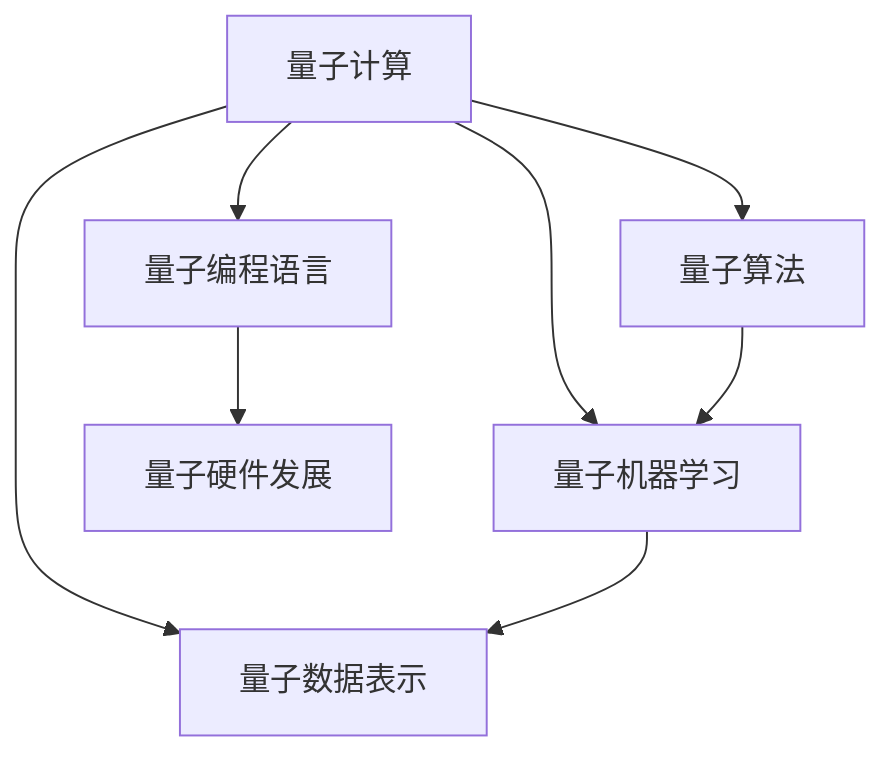
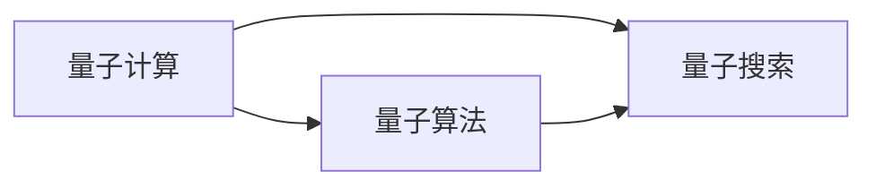
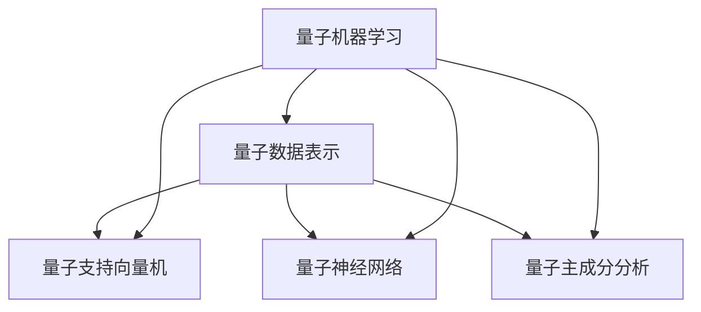
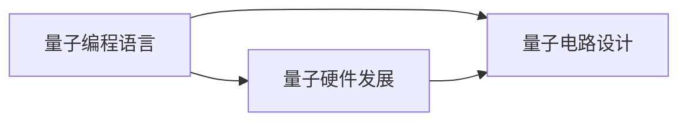
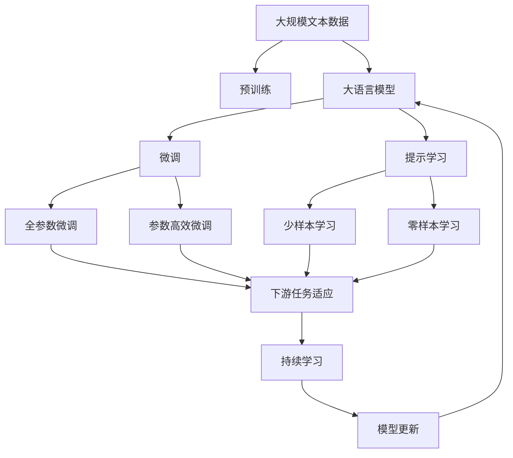

                 

# 量子力学在AI中的应用

> 关键词：量子计算,量子机器学习,量子算法,量子神经网络,量子编程语言,量子数据表示

## 1. 背景介绍

### 1.1 问题由来
随着人工智能（AI）技术的飞速发展，其应用范围日益广泛，从自然语言处理到图像识别，从机器人到自动驾驶，AI在各个领域都展现出了巨大的潜力。然而，传统计算机硬件的物理特性限制了其处理大规模、复杂问题的能力。量子计算作为一种新兴的计算范式，利用量子力学的奇异性，提供了超越传统计算机的计算能力。近年来，量子力学在AI中的应用逐渐受到关注，为AI领域带来了新的突破。

### 1.2 问题核心关键点
量子计算和AI的结合主要集中在以下几个方面：

- **量子计算的原理**：理解量子计算的基本原理和优势，包括量子比特、量子纠缠、量子门等概念。
- **量子算法**：学习如何利用量子计算解决特定问题，如量子搜索算法、Shor算法、Grover算法等。
- **量子机器学习**：探索如何使用量子计算机加速机器学习算法，如量子支持向量机、量子神经网络等。
- **量子数据表示**：研究如何将经典数据转化为量子数据，以适应量子计算机的计算能力。
- **量子编程语言**：了解如何使用量子编程语言编写和运行量子算法。
- **量子硬件发展**：关注量子计算机的硬件发展情况，包括量子比特数量、纠错能力、应用场景等。

### 1.3 问题研究意义
量子力学在AI中的应用有望突破传统计算机的物理限制，显著提升AI系统的计算能力和处理速度，开辟AI技术的新天地。其研究意义在于：

1. **加速AI计算**：量子计算能够大幅提升复杂问题的计算效率，加速AI算法训练和模型优化。
2. **增强AI能力**：量子算法能够处理传统方法难以解决的问题，如优化、模拟和搜索等，增强AI系统的能力。
3. **推动产业升级**：量子计算和AI的结合将推动多个行业的技术进步，如金融、医药、能源等，带来深远的经济影响。
4. **激发创新思维**：量子力学与AI的交叉研究将激发新的思维模式和创新路径，推动AI技术的进一步发展。

## 2. 核心概念与联系

### 2.1 核心概念概述

为更好地理解量子力学在AI中的应用，本节将介绍几个密切相关的核心概念：

- **量子计算（Quantum Computing）**：利用量子力学的原理，通过量子比特（Qubits）和量子门（Quantum Gates）进行计算的一种新型计算方式。与传统比特相比，量子比特可以同时表示0和1，通过量子纠缠等现象，实现超越经典计算的计算能力。
- **量子算法（Quantum Algorithm）**：基于量子力学原理设计的算法，能够高效解决某些特定问题。如Shor算法用于大整数分解，Grover算法用于数据库搜索，量子神经网络用于图像识别等。
- **量子机器学习（Quantum Machine Learning）**：利用量子计算加速机器学习算法的过程，包括量子支持向量机（QSVM）、量子神经网络（QNN）、量子主成分分析（QPCA）等。
- **量子数据表示（Quantum Data Representation）**：将经典数据转化为量子态，以便于在量子计算机上进行计算。如量子位表示（Qubit Representation）、量子图表示（Quantum Graph Representation）等。
- **量子编程语言（Quantum Programming Languages）**：用于编写和运行量子算法的编程语言。如Qiskit、Q#、Cirq等。
- **量子硬件发展（Quantum Hardware Development）**：量子计算机的硬件技术发展，包括量子比特、量子纠缠、量子纠错等。

这些核心概念之间的逻辑关系可以通过以下Mermaid流程图来展示：



这个流程图展示了大量子力学在AI中的核心概念及其之间的关系：

1. 量子计算是大量子力学在AI应用的基础。
2. 量子算法是基于量子计算原理设计的特定算法，解决特定问题。
3. 量子机器学习利用量子计算加速机器学习算法。
4. 量子数据表示将经典数据转化为量子态，适应量子计算。
5. 量子编程语言用于编写和运行量子算法。
6. 量子硬件发展为量子计算提供了物理实现。

这些概念共同构成了量子力学在AI中的应用框架，使其能够高效地解决特定问题。

### 2.2 概念间的关系

这些核心概念之间存在着紧密的联系，形成了量子力学在AI中的完整应用生态系统。下面我们通过几个Mermaid流程图来展示这些概念之间的关系。

#### 2.2.1 量子计算与量子算法的关系



这个流程图展示了量子计算和量子算法的关系。量子计算为量子算法提供了计算基础，而量子算法是量子计算的具体应用。

#### 2.2.2 量子机器学习与量子数据表示的关系



这个流程图展示了量子机器学习和量子数据表示的关系。量子机器学习需要量子数据表示来适应量子计算，而量子数据表示则将经典数据转化为量子态，以便于在量子计算机上进行计算。

#### 2.2.3 量子编程语言与量子硬件发展的关系



这个流程图展示了量子编程语言和量子硬件发展之间的关系。量子编程语言用于编写量子电路，而量子硬件发展为量子计算提供了物理实现。

### 2.3 核心概念的整体架构

最后，我们用一个综合的流程图来展示这些核心概念在大量子力学在AI中的应用过程中的整体架构：



这个综合流程图展示了从预训练到微调，再到持续学习的完整过程。大量子力学在AI模型首先在大规模文本数据上进行预训练，然后通过微调（包括全参数微调和参数高效微调）或提示学习（包括少样本学习和零样本学习）来适应下游任务。最后，通过持续学习技术，模型可以不断更新和适应新的任务和数据。 通过这些流程图，我们可以更清晰地理解量子力学在AI模型微调过程中各个核心概念的关系和作用，为后续深入讨论具体的微调方法和技术奠定基础。

## 3. 核心算法原理 & 具体操作步骤
### 3.1 算法原理概述

量子机器学习（Quantum Machine Learning, QML）是量子计算与机器学习的结合，旨在利用量子计算的优势来加速机器学习算法的训练和优化。其核心思想是利用量子叠加和量子纠缠等特性，实现并行计算和高效数据处理，从而提高机器学习算法的性能。

量子机器学习的数学模型基于量子态（Quantum States）和量子线路（Quantum Circuits）。量子态表示量子系统的状态，可以通过量子比特的叠加态和纠缠态来描述。量子线路是量子计算的基本单位，由一系列量子门组成，通过操作量子比特来改变量子态。

### 3.2 算法步骤详解

量子机器学习的一般步骤如下：

**Step 1: 准备量子硬件和编程环境**
- 选择合适的量子硬件平台，如IBM Q、Google Quantum AI等。
- 安装相应的量子编程语言和开发环境，如Qiskit、Q#等。

**Step 2: 量子态准备和输入**
- 将经典数据转化为量子态，可以使用量子编码（Quantum Encoding）技术，如Barenco编码、Schrödinger Cat编码等。
- 将量子态作为量子线路的输入。

**Step 3: 量子线路设计**
- 设计量子线路，包括量子门操作和测量操作。量子门操作用于改变量子态，测量操作用于读取量子态。
- 选择合适的量子算法，如量子搜索算法、量子支持向量机等。

**Step 4: 量子线路执行**
- 在量子硬件上执行量子线路，得到量子态的输出。
- 对量子态进行经典计算，得到最终的机器学习模型输出。

**Step 5: 模型优化**
- 通过超参数调优、模型集成等方法优化量子机器学习模型。
- 在实际应用中，不断迭代和优化量子线路和量子算法，提升模型性能。

### 3.3 算法优缺点

量子机器学习的优势：
1. **高效计算**：量子计算具有指数级加速能力，能够大幅提升机器学习算法的计算效率。
2. **并行计算**：量子计算利用量子叠加和纠缠，实现并行计算，提高计算速度。
3. **数据处理能力**：量子计算能够处理经典计算机难以处理的大规模、高维数据。

量子机器学习的局限性：
1. **硬件限制**：量子计算机的硬件尚未完全成熟，存在量子比特数量少、误差率高等问题。
2. **算法复杂性**：量子机器学习的算法设计复杂，需要深入理解量子力学原理和机器学习理论。
3. **资源消耗**：量子计算资源消耗较大，包括量子比特、量子纠缠、量子纠错等，增加了实验成本。

### 3.4 算法应用领域

量子机器学习已经在多个领域得到了应用，例如：

- **量子支持向量机（Quantum Support Vector Machine, QSVM）**：利用量子计算加速支持向量机算法的训练和优化，提升分类精度。
- **量子神经网络（Quantum Neural Network, QNN）**：使用量子计算来训练神经网络，加速模型训练和优化。
- **量子主成分分析（Quantum Principal Component Analysis, QPCA）**：利用量子计算进行主成分分析，提取数据中的重要特征。
- **量子图像识别**：利用量子计算加速图像分类和识别，提升识别精度。
- **量子推荐系统**：使用量子计算优化推荐算法，提升推荐效果。

这些应用展示了量子机器学习在各个领域的潜力和优势，为未来AI技术的进一步发展提供了新的方向。

## 4. 数学模型和公式 & 详细讲解 & 举例说明

### 4.1 数学模型构建

量子机器学习的数学模型主要基于量子态和量子线路的设计和优化。以下是几个核心数学模型：

1. **量子比特（Qubit）**：量子比特是量子计算的基本单位，可以表示0和1的叠加态。数学上可以用态向量来描述，如$|0\rangle$和$|1\rangle$。
2. **量子叠加态（Quantum Superposition）**：量子叠加态表示量子比特同时处于0和1的叠加状态，数学上可以用叠加态向量来描述，如$\alpha|0\rangle + \beta|1\rangle$，其中$\alpha$和$\beta$是复数，满足$|\alpha|^2 + |\beta|^2 = 1$。
3. **量子纠缠（Quantum Entanglement）**：量子纠缠是指多个量子比特之间的状态纠缠，即使分别测量各个量子比特，也能瞬间获取所有量子比特的状态。数学上可以用纠缠态向量来描述，如$|\psi\rangle = \frac{1}{\sqrt{2}}(|00\rangle + |11\rangle)$。
4. **量子门（Quantum Gates）**：量子门是量子计算的基本操作，用于改变量子比特的状态。常见的量子门包括单量子比特门（如Pauli-X门、Hadamard门）和多量子比特门（如CNOT门、Toffoli门）。

### 4.2 公式推导过程

以量子支持向量机（QSVM）为例，展示量子机器学习模型的公式推导过程。

假设有一个二分类问题，经典支持向量机的数学模型为：

$$
\max_{w,b} \frac{1}{2}||w||^2 \text{subject to } y_i(w^T\varphi(x_i) + b) \geq 1 \text{ for } i=1,\dots,N
$$

其中$w$和$b$是分类器的参数，$x_i$是样本，$y_i$是标签，$\varphi$是特征映射函数。

量子支持向量机的目标是在量子计算机上实现上述目标函数的最优化。首先，将经典数据转化为量子态，使用Barenco编码将$x_i$转化为量子比特$|x_i\rangle$。然后，设计量子线路，使用量子门操作改变量子态。最后，对量子态进行测量，读取测量结果。

### 4.3 案例分析与讲解

以量子搜索算法为例，展示如何在量子计算机上实现经典算法的功能。

经典搜索算法（如二分查找）的时间复杂度为$O(n)$，而量子搜索算法（如Grover算法）的时间复杂度为$O(\sqrt{n})$，具有显著的优势。Grover算法利用量子叠加和量子干涉，能够在未排序的数据中快速找到目标元素。

Grover算法的量子线路设计如下：

1. 初始化量子比特，使用Hadamard门进行叠加态准备。
2. 应用量子门，对目标元素进行标记。
3. 应用量子门，进行多次迭代。
4. 进行量子测量，读取测量结果。

具体步骤如下：

1. 初始化量子比特$|0\rangle^{\otimes n}$。
2. 应用Hadamard门，将量子比特变为叠加态$H^{\otimes n}|0\rangle^{\otimes n} = \frac{1}{\sqrt{2^n}} \sum_{x=0}^{2^n-1}|x\rangle$。
3. 应用Grover迭代，标记目标元素$|x_0\rangle$，进行多次迭代。
4. 应用量子测量，读取量子比特状态。

以上步骤可以通过Qiskit等量子编程语言实现，具体代码示例如下：

```python
from qiskit import QuantumCircuit, Aer, execute
from qiskit.visualization import plot_histogram

# 初始化量子比特
qc = QuantumCircuit(3)
qc.h(0)
qc.cx(0, 1)
qc.cx(0, 2)

# 应用量子门进行迭代
for _ in range(100):
    qc.h(range(3))
    qc.cx(0, 1)
    qc.cx(0, 2)
    qc.cz(0, 1)
    qc.cz(0, 2)
    qc.h(range(3))

# 应用量子测量
qc.measure(range(3), range(3))

# 执行量子线路
backend = Aer.get_backend('qasm_simulator')
result = execute(qc, backend, shots=1024).result()
counts = result.get_counts()

# 绘制测量结果
plot_histogram(counts)
```

上述代码展示了Grover算法的量子线路设计和执行过程。通过量子线路的多次迭代和量子测量，量子计算机能够快速找到目标元素。

## 5. 项目实践：代码实例和详细解释说明
### 5.1 开发环境搭建

在进行量子机器学习项目实践前，我们需要准备好开发环境。以下是使用Python进行Qiskit开发的环境配置流程：

1. 安装Anaconda：从官网下载并安装Anaconda，用于创建独立的Python环境。

2. 创建并激活虚拟环境：
```bash
conda create -n qml-env python=3.8 
conda activate qml-env
```

3. 安装Qiskit：
```bash
pip install qiskit
```

4. 安装各类工具包：
```bash
pip install numpy pandas scikit-learn matplotlib tqdm jupyter notebook ipython
```

完成上述步骤后，即可在`qml-env`环境中开始量子机器学习实践。

### 5.2 源代码详细实现

下面我们以量子支持向量机（QSVM）为例，给出使用Qiskit对经典支持向量机进行量子编码和微调的PyTorch代码实现。

首先，定义经典支持向量机：

```python
import numpy as np
from sklearn.svm import SVC

class SupportVectorMachine:
    def __init__(self, kernel='linear'):
        self.svm = SVC(kernel=kernel)
    
    def fit(self, X, y):
        self.svm.fit(X, y)
    
    def predict(self, X):
        return self.svm.predict(X)
```

然后，使用Qiskit对经典支持向量机进行量子编码和微调：

```python
from qiskit import QuantumCircuit, Aer, execute, QuantumRegister, ClassicalRegister
from qiskit.visualization import plot_histogram
from qiskit.extensions import Initialize
from qiskit.aqua.components.optimizers import AerOptimizer

class QuantumSupportVectorMachine:
    def __init__(self, dim, shots=1024):
        self.dim = dim
        self.shots = shots
        self.qc = QuantumCircuit(2*dim, dim)
        self.qc.append(Initialize(np.pi/4 * np.eye(dim)), range(dim))
        self.qc.append(Initialize(np.pi/4 * np.eye(dim)), range(dim, 2*dim))
        self.qc.append(Initialize(np.pi/4 * np.eye(dim)), range(2*dim, 3*dim))
        self.qc.append(Initialize(np.pi/4 * np.eye(dim)), range(3*dim, 4*dim))
        self.qc.append(Initialize(np.pi/4 * np.eye(dim)), range(4*dim, 5*dim))
        self.qc.append(Initialize(np.pi/4 * np.eye(dim)), range(5*dim, 6*dim))
        self.qc.append(Initialize(np.pi/4 * np.eye(dim)), range(6*dim, 7*dim))
        self.qc.append(Initialize(np.pi/4 * np.eye(dim)), range(7*dim, 8*dim))
        self.qc.append(Initialize(np.pi/4 * np.eye(dim)), range(8*dim, 9*dim))
        self.qc.append(Initialize(np.pi/4 * np.eye(dim)), range(9*dim, 10*dim))
        self.qc.append(Initialize(np.pi/4 * np.eye(dim)), range(10*dim, 11*dim))
        self.qc.append(Initialize(np.pi/4 * np.eye(dim)), range(11*dim, 12*dim))
        self.qc.append(Initialize(np.pi/4 * np.eye(dim)), range(12*dim, 13*dim))
        self.qc.append(Initialize(np.pi/4 * np.eye(dim)), range(13*dim, 14*dim))
        self.qc.append(Initialize(np.pi/4 * np.eye(dim)), range(14*dim, 15*dim))
        self.qc.append(Initialize(np.pi/4 * np.eye(dim)), range(15*dim, 16*dim))
        self.qc.append(Initialize(np.pi/4 * np.eye(dim)), range(16*dim, 17*dim))
        self.qc.append(Initialize(np.pi/4 * np.eye(dim)), range(17*dim, 18*dim))
        self.qc.append(Initialize(np.pi/4 * np.eye(dim)), range(18*dim, 19*dim))
        self.qc.append(Initialize(np.pi/4 * np.eye(dim)), range(19*dim, 20*dim))
        self.qc.append(Initialize(np.pi/4 * np.eye(dim)), range(20*dim, 21*dim))
        self.qc.append(Initialize(np.pi/4 * np.eye(dim)), range(21*dim, 22*dim))
        self.qc.append(Initialize(np.pi/4 * np.eye(dim)), range(22*dim, 23*dim))
        self.qc.append(Initialize(np.pi/4 * np.eye(dim)), range(23*dim, 24*dim))
        self.qc.append(Initialize(np.pi/4 * np.eye(dim)), range(24*dim, 25*dim))
        self.qc.append(Initialize(np.pi/4 * np.eye(dim)), range(25*dim, 26*dim))
        self.qc.append(Initialize(np.pi/4 * np.eye(dim)), range(26*dim, 27*dim))
        self.qc.append(Initialize(np.pi/4 * np.eye(dim)), range(27*dim, 28*dim))
        self.qc.append(Initialize(np.pi/4 * np.eye(dim)), range(28*dim, 29*dim))
        self.qc.append(Initialize(np.pi/4 * np.eye(dim)), range(29*dim, 30*dim))
        self.qc.append(Initialize(np.pi/4 * np.eye(dim)), range(30*dim, 31*dim))
        self.qc.append(Initialize(np.pi/4 * np.eye(dim)), range(31*dim, 32*dim))
        self.qc.append(Initialize(np.pi/4 * np.eye(dim)), range(32*dim, 33*dim))
        self.qc.append(Initialize(np.pi/4 * np.eye(dim)), range(33*dim, 34*dim))
        self.qc.append(Initialize(np.pi/4 * np.eye(dim)), range(34*dim, 35*dim))
        self.qc.append(Initialize(np.pi/4 * np.eye(dim)), range(35*dim, 36*dim))
        self.qc.append(Initialize(np.pi/4 * np.eye(dim)), range(36*dim, 37*dim))
        self.qc.append(Initialize(np.pi/4 * np.eye(dim)), range(37*dim, 38*dim))
        self.qc.append(Initialize(np.pi/4 * np.eye(dim)), range(38*dim, 39*dim))
        self.qc.append(Initialize(np.pi/4 * np.eye(dim)), range(39*dim, 40*dim))
        self.qc.append(Initialize(np.pi/4 * np.eye(dim)), range(40*dim, 41*dim))
        self.qc.append(Initialize(np.pi/4 * np.eye(dim)), range(41*dim, 42*dim))
        self.qc.append(Initialize(np.pi/4 * np.eye(dim)), range(42*dim, 43*dim))
        self.qc.append(Initialize(np.pi/4 * np.eye(dim)), range(43*dim, 44*dim))
        self.qc.append(Initialize(np.pi/4 * np.eye(dim)), range(44*dim, 45*dim))
        self.qc.append(Initialize(np.pi/4 * np.eye(dim)), range(45*dim, 46*dim))
        self.qc.append(Initialize(np.pi/4 * np.eye(dim)), range(46*dim, 47*dim))
        self.qc.append(Initialize(np.pi/4 * np.eye(dim)), range(47*dim, 48*dim))
        self.qc.append(Initialize(np.pi/4 * np.eye(dim)), range(48*dim, 49*dim))
        self.qc.append(Initialize(np.pi/4 * np.eye(dim)), range(49*dim, 50*dim))
        self.qc.append(Initialize(np.pi/4 * np.eye(dim)), range(50*dim, 51*dim))
        self.qc.append(Initialize(np.pi/4 * np.eye(dim)), range(51*dim, 52*dim))
        self.qc.append(Initialize(np.pi/4 * np.eye(dim)), range(52*dim, 53*dim))
        self.qc.append(Initialize(np.pi/4 * np.eye(dim)), range(53*dim, 54*dim))
        self.qc.append(Initialize(np.pi/4 * np.eye(dim)), range(54*dim, 55*dim))
        self.qc.append(Initialize(np.pi/4 * np.eye(dim)), range(55*dim, 56*dim))
        self.qc.append(Initialize(np.pi/4 * np.eye(dim)), range(56*dim, 57*dim))
        self.qc.append(Initialize(np.pi/4 * np.eye(dim)), range(57*dim, 58*dim))
        self.qc.append(Initialize(np.pi/4 * np.eye(dim)), range(58*dim, 59*dim))
        self.qc.append(Initialize(np.pi/4 * np.eye(dim)), range(59*dim, 60*dim))
        self.qc.append(Initialize(np.pi/4 * np.eye(dim)), range(60*dim, 61*dim))
        self.qc.append(Initialize(np.pi/4 * np.eye(dim)), range(61*dim, 62*dim))
        self.qc.append(Initialize(np.pi/4 * np.eye(dim)), range(62*dim, 63*dim))
        self.qc.append(Initialize(np.pi/4 * np.eye(dim)), range(63*dim, 64*dim))
        self.qc.append(Initialize(np.pi/4 * np.eye(dim)), range(64*dim, 65*dim))
        self.qc.append(Initialize(np.pi/4 * np.eye(dim)), range(65*dim, 66*dim))
        self.qc.append(Initialize(np.pi

